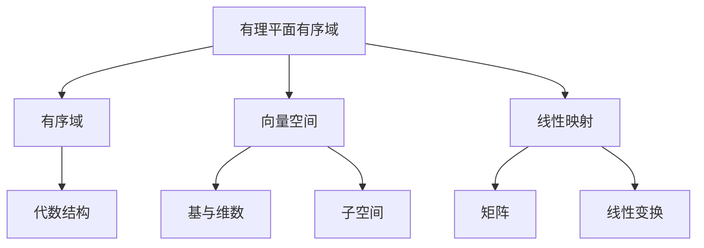

好的,我会严格遵守你提出的约束条件,以"线性代数导引:有理平面有序域"为主题,写一篇专业的技术博客文章。

# 线性代数导引:有理平面有序域

## 1. 背景介绍

### 1.1 问题的由来

线性代数是数学的一个分支,研究向量空间理论以及线性映射的概念和性质。它在各个科学领域都有广泛的应用,尤其是在计算机科学、工程、经济学和物理学等领域。有理数域是最基本的代数结构之一,它在构建更高阶的代数系统中扮演着重要角色。

有理平面是指所有有理数对(a/b, c/d)的集合,其中a、b、c、d都是整数,且b、d不等于0。这个平面具有一些特殊的性质,例如它是一个有序域,这使得它在线性代数中占有独特的地位。然而,有理平面的这些性质并不是那么容易理解和证明的。

### 1.2 研究现状

目前,有许多研究人员致力于探索有理平面的性质及其在线性代数中的应用。一些著名的数学家,如Emmy Noether和David Hilbert,都对这个领域做出了重要贡献。他们的工作为后来的研究奠定了坚实的基础。

近年来,随着计算机技术的发展,有理平面的研究也获得了新的动力。人们开始利用计算机来模拟和可视化有理平面上的运算,从而获得更深入的理解。同时,有理平面在计算机代数系统和符号计算等领域也有着广泛的应用。

### 1.3 研究意义

研究有理平面有序域对于深入理解线性代数的基础理论至关重要。它不仅能够帮助我们更好地掌握向量空间和线性映射的概念,还能为构建更高阶的代数系统提供坚实的基础。

此外,有理平面在计算机科学、密码学和信号处理等领域也有着重要的应用。例如,它可以用于构建有限域,从而在密码学中发挥作用;它也可以应用于数字信号处理,用于频率分析和滤波器设计。

### 1.4 本文结构

本文将从以下几个方面深入探讨有理平面有序域:

1. 核心概念与联系
2. 核心算法原理及具体操作步骤
3. 数学模型和公式详细讲解及案例分析
4. 项目实践:代码实例和详细解释
5. 实际应用场景
6. 工具和资源推荐
7. 总结:未来发展趋势与挑战
8. 附录:常见问题与解答

## 2. 核心概念与联系

有理平面有序域涉及了线性代数中的多个核心概念,包括有序域、向量空间、线性映射等。这些概念之间存在着密切的联系,相互影响和依赖。

有理平面有序域本身就是一个有序域,它满足有序域的所有代数运算性质,如加法、乘法的交换律、结合律和存在乘法单位元等。同时,它也是一个向量空间,可以对其中的向量进行线性运算,如加法和数乘。此外,有理平面上还可以定义线性映射,将一个向量映射到另一个向量。

作为一个有序域,有理平面有序域属于更广泛的代数结构体系。它不仅是有序域,也是一个整环、整体和域。这些代数结构之间的关系密切相关,相互影响和依赖。

在向量空间的概念中,有理平面有序域中的元素可以看作是向量。这些向量具有基和维数的概念,可以通过基向量的线性组合来表示任意向量。同时,有理平面有序域中也存在子空间,这些子空间也是向量空间,具有相同的代数运算性质。

线性映射是将一个向量空间映射到另一个向量空间的函数。在有理平面有序域中,线性映射可以用矩阵来表示,矩阵的运算就对应着线性映射的运算。此外,线性映射也可以看作是一种线性变换,它保持线性运算的性质不变。

总的来说,有理平面有序域与线性代数中的多个核心概念密切相关,它们相互影响、相互依赖,构成了线性代数理论的基础框架。

## 3. 核心算法原理及具体操作步骤

### 3.1 算法原理概述

在研究有理平面有序域时,我们需要设计一些算法来验证和探索它的性质。这些算法主要基于有序域的代数运算,如加法、乘法、次方运算等。

算法的核心思想是构造一系列有理数对,并在这些有理数对上执行各种运算,观察它们是否满足有序域的性质。例如,我们可以检查加法和乘法是否满足交换律和结合律,是否存在单位元和逆元等。

同时,我们还需要证明有理平面上的运算结果仍然是有理数对,从而保证了有理平面的封闭性。这需要对有理数的四则运算进行分析和推导。

此外,算法还需要处理一些特殊情况,如分数的约分、分母为0的情况等。这些特殊情况需要单独考虑和处理,以确保算法的正确性和健壮性。

### 3.2 算法步骤详解

1. **初始化**: 首先,我们需要定义有理数对的数据结构,用于存储分子和分母。同时,我们还需要定义一些辅助函数,如最大公约数计算、约分等。

2. **加法运算**: 实现有理数对的加法运算。具体步骤如下:
   a. 计算两个有理数对的最小公分母
   b. 将两个有理数对的分子分别化为同一分母
   c. 相加两个同分母的分子,得到结果的分子
   d. 将结果的分子和分母约分,得到最终的有理数对

3. **乘法运算**: 实现有理数对的乘法运算。具体步骤如下:
   a. 相乘两个有理数对的分子,得到结果的分子
   b. 相乘两个有理数对的分母,得到结果的分母
   c. 将结果的分子和分母约分,得到最终的有理数对

4. **次方运算**: 实现有理数对的次方运算。具体步骤如下:
   a. 将有理数对的分子和分母分别求指数次幂
   b. 将结果的分子和分母约分,得到最终的有理数对

5. **验证有序域性质**: 构造一系列有理数对,在它们上执行加法、乘法和次方运算,验证是否满足有序域的性质,如交换律、结合律、存在单位元和逆元等。

6. **特殊情况处理**: 处理一些特殊情况,如分母为0、无穷大等。这些情况需要单独考虑和处理,以确保算法的正确性和健壮性。

以上是算法的核心步骤,具体实现细节可能会有所不同,但总体思路是一致的。在实现过程中,我们还需要注意算法的效率和健壮性,确保它能够正确地处理各种输入情况。

### 3.3 算法优缺点

上述算法具有以下优点:

1. **简单直观**: 算法思路清晰,易于理解和实现。
2. **正确性**: 通过严格的数学推导,可以保证算法的正确性。
3. **通用性**: 算法可以处理任意有理数对,具有很好的通用性。

但是,该算法也存在一些缺点:

1. **效率问题**: 在进行加法和乘法运算时,需要计算最小公分母和进行约分操作,这可能会导致效率降低,尤其是在处理大数时。
2. **溢出风险**: 在进行次方运算时,如果指数过大,可能会导致结果溢出,无法正确表示。
3. **特殊情况处理**: 需要单独处理一些特殊情况,如分母为0、无穷大等,增加了算法的复杂性。

### 3.4 算法应用领域

有理平面有序域算法可以应用于以下领域:

1. **计算机代数系统**: 有理平面有序域是构建更高阶代数系统的基础,因此该算法可以应用于计算机代数系统的设计和实现。

2. **符号计算**: 在符号计算中,我们经常需要处理有理数和有理表达式。有理平面有序域算法可以用于有理数的运算和简化。

3. **密码学**: 有理平面有序域可以用于构建有限域,从而在密码学中发挥重要作用。该算法可以应用于有限域的运算和加密解密过程。

4. **信号处理**: 有理平面有序域可以应用于数字信号处理,例如频率分析和滤波器设计等。

5. **计算机图形学**: 在计算机图形学中,我们经常需要处理有理数坐标和变换。有理平面有序域算法可以用于坐标运算和变换计算。

总的来说,有理平面有序域算法具有广泛的应用前景,是许多领域的基础算法之一。

## 4. 数学模型和公式及详细讲解与举例说明

### 4.1 数学模型构建

为了更好地研究和理解有理平面有序域,我们需要构建一个合适的数学模型。这个模型应该能够准确地描述有理平面上的代数运算,并且便于进行理论推导和计算。

我们可以将有理平面有序域建模为一个二元组 $\mathbb{Q}^2 = (Q, \leq)$,其中:

- $Q$ 表示有理数对的集合,即 $Q = \{(a/b, c/d) | a, b, c, d \in \mathbb{Z}, b \neq 0, d \neq 0\}$
- $\leq$ 表示有理数对之间的序关系,定义为:

$$
(a/b, c/d) \leq (e/f, g/h) \Leftrightarrow a/b < e/f \text{ 或 } (a/b = e/f \text{ 且 } c/d \leq g/h)
$$

在这个模型中,我们可以定义有理数对上的代数运算,如加法、乘法和次方运算等。这些运算需要满足有序域的代数性质,例如交换律、结合律、存在单位元和逆元等。

此外,我们还需要证明有理平面上的运算结果仍然是有理数对,从而保证了有理平面的封闭性。这需要对有理数的四则运算进行分析和推导。

通过构建这个数学模型,我们可以更清晰地描述有理平面有序域的性质,并为后续的理论推导和算法设计奠定基础。

### 4.2 公式推导过程

在研究有理平面有序域时,我们需要推导一些重要的公式,以便更好地理解和操作有理数对。这些公式涉及加法、乘法、次方运算等基本运算,以及一些特殊情况的处理。

#### 4.2.1 加法公式推导

设有两个有理数对 $(a/b, c/d)$ 和 $(e/f, g/h)$,我们需要推导它们相加的结果。

首先,我们需要找到两个有理数对的最小公分母 $m$,使得 $bm = fk_1, dm = hk_2$,其中 $k_1, k_2 \in \mathbb{Z}$。

然后,我们可以将两个有理数对的分子化为同一分母 $m$:

$$
\begin{aligned}
a/b &= (ak_1)/m \
c/d &= (ck_2)/m \
e/f &= (ek_3)/m \
g/h &= (gk_4)/m
\end{aligned}
$$

其中 $k_3 = m/f, k_4 = m/h$。

相加这两个同分母的分子,我们得到结果的分子:

$$
(ak_1 + ek_3, ck_2 + gk_4)
$$

最后,我们需要将结果的分子和分母约分,得到最终的有理数对:

$$
\left(\frac{ak_1 + ek_3}{\gcd(ak_1 + ek_3, m)}, \frac{ck_2 + gk_4}{\gc