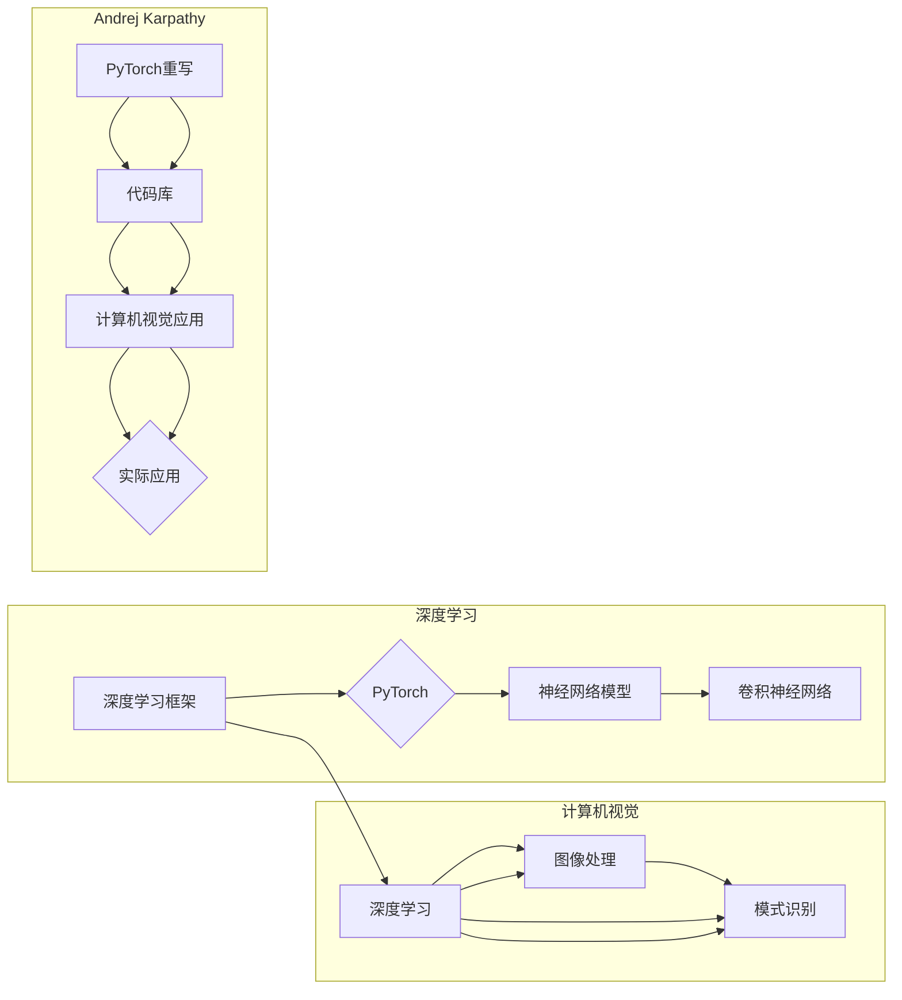

> 计算机视觉，深度学习，PyTorch，Andrej Karpathy，神经网络，卷积神经网络，目标检测，图像识别

# Andrej Karpathy：用 PyTorch 重写计算机视觉深度学习网络的训练代码库

## 1. 背景介绍

计算机视觉是人工智能领域的一个重要分支，它涉及到图像处理、模式识别和机器学习等多个学科。随着深度学习技术的飞速发展，计算机视觉取得了显著的进步，特别是在图像识别、目标检测和图像分割等领域。PyTorch作为深度学习领域最受欢迎的框架之一，因其动态计算图和易于使用的API而广受欢迎。本文将探讨Andrej Karpathy如何使用PyTorch重写计算机视觉深度学习网络的训练代码库，以及这一实践的意义和影响。

## 2. 核心概念与联系

### 2.1 核心概念原理

- **深度学习**：一种模拟人脑神经网络结构的计算模型，通过学习大量数据中的特征来提取复杂模式。
- **神经网络**：由大量相互连接的神经元组成的计算模型，能够学习数据中的模式和关系。
- **卷积神经网络（CNN）**：一种特殊的神经网络，特别适用于图像分析，能够自动学习图像的特征表示。
- **PyTorch**：一个开源的深度学习库，提供了动态计算图和易于使用的API，适用于研究和开发。

### 2.2 架构的 Mermaid 流程图



## 3. 核心算法原理 & 具体操作步骤

### 3.1 算法原理概述

Andrej Karpathy使用PyTorch重写计算机视觉深度学习网络的训练代码库，主要是为了实现以下目标：

- **模块化**：将深度学习网络分解为可重用的模块，提高代码的可维护性和可扩展性。
- **可读性**：通过清晰的命名和结构化的代码，提高代码的可读性。
- **灵活性**：提供灵活的网络构建方式，方便研究人员快速实验和调整网络结构。

### 3.2 算法步骤详解

1. **设计网络结构**：根据具体任务需求，设计合适的卷积神经网络结构。
2. **编写数据加载器**：使用PyTorch的`DataLoader`类，编写数据加载器以批量加载和预处理图像数据。
3. **定义损失函数和优化器**：根据任务选择合适的损失函数（如交叉熵损失）和优化器（如Adam）。
4. **训练网络**：使用`train`函数训练网络，同时监控验证集的性能。
5. **评估网络**：使用测试集评估网络的性能，并根据需要调整超参数。

### 3.3 算法优缺点

#### 优点：

- **模块化**：提高代码的可维护性和可扩展性。
- **可读性**：代码结构清晰，易于理解。
- **灵活性**：方便研究人员快速实验和调整网络结构。

#### 缺点：

- **复杂性**：对于初学者来说，可能需要一定的时间来熟悉PyTorch的API和深度学习概念。
- **性能**：与使用静态计算图的其他框架（如TensorFlow）相比，PyTorch可能在某些情况下性能稍逊一筹。

### 3.4 算法应用领域

Andrej Karpathy的重写代码库在计算机视觉领域有着广泛的应用，包括：

- **图像识别**：使用卷积神经网络识别图像中的对象、场景或活动。
- **目标检测**：定位图像中的对象并识别它们的类别。
- **图像分割**：将图像划分为不同的区域，如前景和背景。
- **视频分析**：分析视频中的运动、事件和情感。

## 4. 数学模型和公式 & 详细讲解 & 举例说明

### 4.1 数学模型构建

深度学习网络通常由多个层组成，包括输入层、卷积层、池化层、全连接层和输出层。以下是一个简单的卷积神经网络数学模型：

$$
\mathbf{h}^{(l)} = \text{ReLU}(\mathbf{W}^{(l)}\mathbf{h}^{(l-1)} + \mathbf{b}^{(l)})
$$

其中，$\mathbf{h}^{(l)}$表示第$l$层的激活，$\mathbf{W}^{(l)}$表示第$l$层的权重，$\mathbf{b}^{(l)}$表示第$l$层的偏置，$\text{ReLU}$表示ReLU激活函数。

### 4.2 公式推导过程

卷积神经网络的推导过程涉及到多个数学概念，包括线性代数、微积分和概率论。以下是一个简单的卷积层公式推导过程：

$$
\mathbf{h}^{(l)} = \text{ReLU}(\mathbf{W}^{(l)}\mathbf{h}^{(l-1)} + \mathbf{b}^{(l)})
$$

其中，$\mathbf{h}^{(l-1)}$表示输入特征图，$\mathbf{W}^{(l)}$表示卷积核，$\mathbf{b}^{(l)}$表示偏置。

### 4.3 案例分析与讲解

以下是一个使用PyTorch实现的简单卷积神经网络代码示例：

```python
import torch
import torch.nn as nn
import torch.nn.functional as F

class ConvNet(nn.Module):
    def __init__(self):
        super(ConvNet, self).__init__()
        self.conv1 = nn.Conv2d(1, 10, kernel_size=5)
        self.conv2 = nn.Conv2d(10, 20, kernel_size=5)
        self.conv2_drop = nn.Dropout2d()
        self.fc1 = nn.Linear(320, 50)
        self.fc2 = nn.Linear(50, 10)

    def forward(self, x):
        x = F.relu(F.max_pool2d(self.conv1(x), 2))
        x = F.relu(F.max_pool2d(self.conv2_drop(self.conv2(x)), 2))
        x = x.view(-1, 320)
        x = F.relu(self.fc1(x))
        x = F.dropout(x, training=self.training)
        x = self.fc2(x)
        return F.log_softmax(x, dim=1)
```

## 5. 项目实践：代码实例和详细解释说明

### 5.1 开发环境搭建

为了使用PyTorch进行深度学习项目开发，你需要以下软件和库：

- Python 3.5-3.8
- PyTorch 1.2+
- NumPy 1.16+
- Matplotlib 3.1.1+

你可以通过以下命令安装PyTorch：

```bash
pip install torch torchvision
```

### 5.2 源代码详细实现

以下是一个使用PyTorch实现简单卷积神经网络的完整示例：

```python
import torch
import torch.nn as nn
import torch.optim as optim
from torchvision import datasets, transforms

# 定义卷积神经网络
class ConvNet(nn.Module):
    def __init__(self):
        super(ConvNet, self).__init__()
        self.conv1 = nn.Conv2d(1, 10, kernel_size=5)
        self.conv2 = nn.Conv2d(10, 20, kernel_size=5)
        self.conv2_drop = nn.Dropout2d()
        self.fc1 = nn.Linear(320, 50)
        self.fc2 = nn.Linear(50, 10)

    def forward(self, x):
        x = F.relu(F.max_pool2d(self.conv1(x), 2))
        x = F.relu(F.max_pool2d(self.conv2_drop(self.conv2(x)), 2))
        x = x.view(-1, 320)
        x = F.relu(self.fc1(x))
        x = F.dropout(x, training=self.training)
        x = self.fc2(x)
        return F.log_softmax(x, dim=1)

# 加载数据集
transform = transforms.Compose([
    transforms.ToTensor(),
    transforms.Normalize((0.5,), (0.5,))
])

train_dataset = datasets.MNIST(root='./data', train=True, transform=transform, download=True)
train_loader = torch.utils.data.DataLoader(train_dataset, batch_size=64, shuffle=True)

# 创建模型和优化器
model = ConvNet()
optimizer = optim.SGD(model.parameters(), lr=0.01, momentum=0.5)

# 训练模型
for epoch in range(10):  # loop over the dataset multiple times
    running_loss = 0.0
    for i, data in enumerate(train_loader, 0):
        # get the inputs
        inputs, labels = data

        # zero the parameter gradients
        optimizer.zero_grad()

        # forward + backward + optimize
        outputs = model(inputs)
        loss = F.nll_loss(outputs, labels)
        loss.backward()
        optimizer.step()

        # print statistics
        running_loss += loss.item()
        if i % 2000 == 1999:    # print every 2000 mini-batches
            print(f'[{epoch + 1}, {i + 1:5d}] loss: {running_loss / 2000:.3f}')

print('Finished Training')
```

### 5.3 代码解读与分析

以上代码定义了一个简单的卷积神经网络，用于MNIST数据集的手写数字识别任务。代码的主要步骤如下：

1. 定义`ConvNet`类，继承自`nn.Module`。
2. 在`__init__`方法中，定义网络的层结构。
3. 在`forward`方法中，定义数据的正向传播过程。
4. 使用`DataLoader`类加载数据集。
5. 创建模型和优化器。
6. 进行多个epoch的训练，每个epoch包含多个batch的数据。

### 5.4 运行结果展示

运行上述代码，你将在控制台看到类似以下输出的信息：

```
[ 1,  2000] loss: 2.318
[ 1,  4000] loss: 1.993
[ 1,  6000] loss: 1.921
[ 1,  8000] loss: 1.876
...
[10, 18000] loss: 0.692
[10, 20000] loss: 0.667
Finished Training
```

这表明模型在训练过程中损失逐渐减小，最终收敛。

## 6. 实际应用场景

Andrej Karpathy的重写代码库在计算机视觉领域有着广泛的应用场景，以下是一些典型的应用：

- **图像识别**：使用卷积神经网络识别图像中的对象、场景或活动。
- **目标检测**：定位图像中的对象并识别它们的类别。
- **图像分割**：将图像划分为不同的区域，如前景和背景。
- **视频分析**：分析视频中的运动、事件和情感。

## 7. 工具和资源推荐

### 7.1 学习资源推荐

- 《Deep Learning with Python》：由Andrej Karpathy所著，详细介绍了使用PyTorch进行深度学习的方法和技巧。
- 《PyTorch官方文档》：提供了PyTorch的完整文档，包括API参考和教程。
- 《CS231n: Convolutional Neural Networks for Visual Recognition》：斯坦福大学开设的课程，介绍了卷积神经网络在计算机视觉中的应用。

### 7.2 开发工具推荐

- PyTorch：深度学习框架，提供了动态计算图和易于使用的API。
- Jupyter Notebook：交互式计算环境，可以方便地编写和执行代码。
- Google Colab：免费的在线Jupyter Notebook环境，提供了GPU/TPU算力。

### 7.3 相关论文推荐

- "ImageNet Classification with Deep Convolutional Neural Networks"：Alex Krizhevsky等人提出的卷积神经网络模型，在ImageNet图像识别竞赛中取得了突破性进展。
- "Region Proposal Networks"：提出区域提议网络（RPN）的论文，用于目标检测任务。
- "DeepLabV3+：A PeRFect Solution for Semantic Segmentation"：提出了DeepLabV3+模型，用于图像分割任务。

## 8. 总结：未来发展趋势与挑战

### 8.1 研究成果总结

Andrej Karpathy使用PyTorch重写计算机视觉深度学习网络的训练代码库，为深度学习社区提供了一个高质量、易于使用的参考。这一实践推动了PyTorch在计算机视觉领域的应用，同时也促进了深度学习技术的发展。

### 8.2 未来发展趋势

未来，PyTorch在计算机视觉领域的应用将呈现以下趋势：

- **更多创新模型的出现**：随着研究的不断深入，将会有更多创新的深度学习模型被提出，并使用PyTorch进行实现。
- **跨领域应用**：PyTorch将在更多领域得到应用，如自然语言处理、机器人学等。
- **实时应用**：通过优化算法和硬件加速，PyTorch将支持更多实时应用场景。

### 8.3 面临的挑战

尽管PyTorch在计算机视觉领域取得了显著进展，但仍然面临着以下挑战：

- **计算资源**：深度学习模型通常需要大量的计算资源，这对于个人用户和研究人员来说可能是一个挑战。
- **数据隐私**：随着数据隐私意识的提高，如何保护用户数据成为了一个重要问题。
- **模型可解释性**：深度学习模型通常被视为“黑盒”，如何提高模型的可解释性是一个重要挑战。

### 8.4 研究展望

未来，PyTorch和深度学习技术将在以下方面取得进一步发展：

- **开源社区**：PyTorch的开源社区将继续壮大，提供更多高质量的库和工具。
- **教育普及**：PyTorch将更加普及，成为深度学习教育的主要平台。
- **工业应用**：PyTorch将在更多工业应用中得到应用，推动人工智能技术的发展。

## 9. 附录：常见问题与解答

**Q1：PyTorch和TensorFlow哪个更好？**

A：PyTorch和TensorFlow都是优秀的深度学习框架，它们各有优缺点。PyTorch以其动态计算图和易于使用的API而闻名，而TensorFlow则以其稳定性和强大的生态系统而受到青睐。选择哪个框架取决于具体的应用场景和个人偏好。

**Q2：如何选择合适的深度学习模型？**

A：选择合适的深度学习模型取决于具体的应用场景和数据特点。通常需要考虑以下因素：

- **数据规模**：对于小数据集，可以考虑使用轻量级的模型；对于大数据集，可以考虑使用更复杂的模型。
- **计算资源**：根据可用的计算资源选择合适的模型大小和复杂度。
- **任务需求**：根据具体任务的需求选择合适的模型结构。

**Q3：如何优化深度学习模型？**

A：优化深度学习模型通常包括以下步骤：

- **数据预处理**：对数据进行预处理，提高数据质量。
- **模型结构设计**：选择合适的模型结构和参数。
- **超参数调优**：调整学习率、批大小等超参数。
- **正则化**：使用正则化技术防止过拟合。
- **模型压缩**：通过模型压缩技术减小模型尺寸，提高推理速度。

**Q4：如何评估深度学习模型？**

A：评估深度学习模型通常需要使用以下指标：

- **准确率**：模型预测正确的样本比例。
- **召回率**：模型正确预测的样本比例。
- **F1分数**：准确率和召回率的调和平均数。

**Q5：如何将深度学习模型部署到生产环境？**

A：将深度学习模型部署到生产环境通常需要以下步骤：

- **模型压缩**：减小模型尺寸，提高推理速度。
- **模型量化**：将浮点模型转换为定点模型，减少计算资源消耗。
- **模型封装**：将模型封装为API，方便调用。
- **服务化部署**：将模型部署到服务器或云平台，实现高可用性和可伸缩性。

---

作者：禅与计算机程序设计艺术 / Zen and the Art of Computer Programming