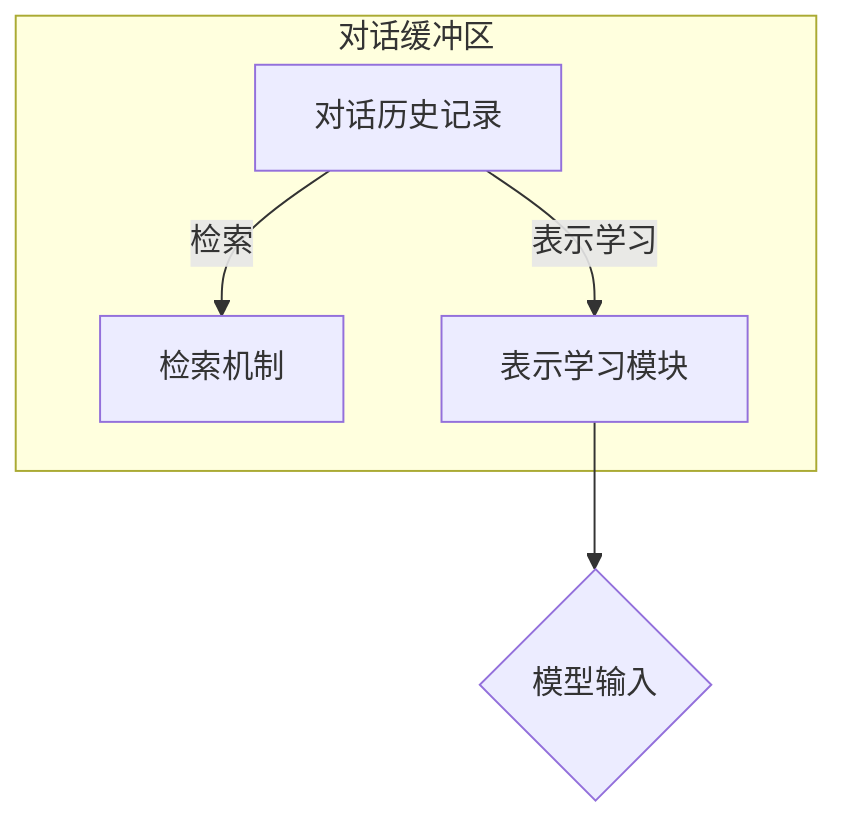

# ConversationBufferMemory

> 关键词：对话缓冲区，记忆增强对话系统，自然语言处理，机器学习，对话设计，长短期记忆，上下文理解

## 1. 背景介绍

随着人工智能技术的飞速发展，自然语言处理（NLP）技术在对话系统的应用越来越广泛。然而，传统的对话系统往往难以处理复杂、长时对话，这是因为它们缺乏对会话历史的有效记忆能力。为了解决这一问题，对话缓冲区（Conversation Buffer Memory，CBM）应运而生。本文将深入探讨对话缓冲区的工作原理、设计方法以及在实际应用中的价值。

### 1.1 对话系统的挑战

传统的对话系统通常采用状态机或图灵机模型，它们依赖于当前的输入来生成响应。这种设计虽然简单，但在处理复杂对话时存在以下挑战：

- **短时记忆限制**：对话系统难以记忆和利用之前的对话信息，导致无法理解对话的上下文和主题。
- **长对话理解**：在长对话中，系统难以跟踪对话的多个主题和角色之间的关系。
- **用户意图识别**：由于缺乏上下文信息，系统难以准确识别用户的意图和目的。

### 1.2 对话缓冲区的出现

为了解决上述问题，研究者们提出了对话缓冲区（CBM）的概念。CBM通过维护一个会话历史记录，使得对话系统能够在处理每个新输入时，回顾并利用之前的对话信息，从而提高对话的连贯性和理解能力。

## 2. 核心概念与联系

### 2.1 核心概念原理

对话缓冲区（CBM）是一种用于存储和检索对话历史信息的结构。它通常由以下几部分组成：

- **对话历史记录**：存储会话中所有交互的文本记录。
- **检索机制**：从对话历史中快速检索相关信息。
- **表示学习**：将对话历史信息转换为易于模型处理的形式。

### 2.2 核心概念架构



在这个流程中，对话历史记录首先经过表示学习模块转换为模型输入，然后通过检索机制检索相关信息，最后输入到对话系统中进行处理。

## 3. 核心算法原理 & 具体操作步骤

### 3.1 算法原理概述

CBM的核心思想是将对话历史信息转化为易于处理的形式，并利用这些信息来增强对话系统的理解和生成能力。

### 3.2 算法步骤详解

1. **对话历史记录**：对话系统在每次交互后，将用户输入和系统响应存储到对话历史记录中。
2. **表示学习**：将对话历史记录转换为模型可以处理的向量表示，例如使用词嵌入技术。
3. **检索机制**：根据当前输入，检索与对话历史信息最相关的部分。
4. **模型输入**：将检索到的信息与当前输入一起输入到对话模型中，生成响应。
5. **更新对话历史**：将新的交互添加到对话历史记录中，为下一次交互做准备。

### 3.3 算法优缺点

**优点**：

- **提高对话连贯性**：CBM能够使对话系统更好地理解对话上下文，从而生成更加连贯的响应。
- **增强长对话理解**：CBM能够存储和检索长对话中的信息，使得系统能够处理复杂对话场景。
- **提高用户满意度**：更好的对话体验能够提高用户满意度。

**缺点**：

- **存储成本**：CBM需要存储大量的对话历史信息，这可能导致存储成本增加。
- **检索效率**：检索机制的设计和实现可能会影响检索效率。
- **表示学习**：将对话历史信息转换为模型输入的过程可能复杂，需要根据具体应用进行调整。

### 3.4 算法应用领域

CBM可以应用于各种对话系统，包括：

- **智能客服**：提高客服机器人对用户问题的理解能力。
- **智能助手**：增强智能助手的上下文理解和响应能力。
- **聊天机器人**：提高聊天机器人的自然性和连贯性。

## 4. 数学模型和公式 & 详细讲解 & 举例说明

### 4.1 数学模型构建

CBM的数学模型可以表示为：

$$
\text{CBM}(x, \text{history}) = \text{Retrieval}(\text{Embedding}(\text{history}), \text{Query}(x))
$$

其中：

- $x$ 是当前的用户输入。
- $\text{history}$ 是对话历史记录。
- $\text{Embedding}$ 是将对话历史信息转换为向量表示的函数。
- $\text{Query}$ 是将用户输入转换为向量表示的函数。
- $\text{Retrieval}$ 是从向量表示中检索相关信息的函数。

### 4.2 公式推导过程

假设我们使用词嵌入技术将对话历史和用户输入转换为向量表示，可以使用余弦相似度来检索相关信息：

$$
\text{similarity}(v, w) = \frac{v \cdot w}{||v|| ||w||}
$$

其中：

- $v$ 和 $w$ 是两个向量表示。
- $||v||$ 和 $||w||$ 分别是 $v$ 和 $w$ 的欧几里得范数。

### 4.3 案例分析与讲解

假设我们有一个简单的对话历史记录：

```
User: What is the weather like today?
System: The weather is sunny today.
User: Do you think it will rain tomorrow?
System: There is a chance of rain tomorrow.
User: Do you know any good restaurants nearby?
System: Yes, there are many good restaurants around here.
```

当用户输入 "Do you know any good restaurants nearby?" 时，我们可以使用以下步骤来检索相关信息：

1. 将对话历史记录和用户输入转换为向量表示。
2. 使用余弦相似度计算相似度分数。
3. 选择相似度最高的历史记录作为检索结果。

通过这种方式，CBM能够帮助对话系统更好地理解用户的意图，并生成更加相关的响应。

## 5. 项目实践：代码实例和详细解释说明

### 5.1 开发环境搭建

为了实现CBM，我们需要以下开发环境：

- Python 3.7及以上版本
- PyTorch 1.7及以上版本
- Transformers库

### 5.2 源代码详细实现

以下是一个简单的CBM实现示例：

```python
from transformers import BertTokenizer, BertModel
import torch

class ConversationBufferMemory:
    def __init__(self, tokenizer, model):
        self.tokenizer = tokenizer
        self.model = model
        self.buffer = []

    def add_interaction(self, user_input, system_response):
        encoded_input = self.tokenizer.encode_plus(user_input, return_tensors='pt', add_special_tokens=True)
        encoded_response = self.tokenizer.encode_plus(system_response, return_tensors='pt', add_special_tokens=True)
        self.buffer.append((encoded_input, encoded_response))

    def retrieve_info(self, user_input):
        encoded_input = self.tokenizer.encode_plus(user_input, return_tensors='pt', add_special_tokens=True)
        with torch.no_grad():
            input_embeddings = self.model(**encoded_input)[0]
        similarities = [torch.cosine_similarity(input_embeddings, emb) for emb in self.buffer]
        return similarities.index(max(similarities))

    def get_response(self, user_input):
        idx = self.retrieve_info(user_input)
        _, encoded_response = self.buffer[idx]
        with torch.no_grad():
            response_embeddings = self.model(**encoded_response)[0]
        response = self.tokenizer.decode(response_embeddings.argmax(dim=1))
        return response

# 使用预训练模型
tokenizer = BertTokenizer.from_pretrained('bert-base-uncased')
model = BertModel.from_pretrained('bert-base-uncased')

# 创建CBM实例
cbm = ConversationBufferMemory(tokenizer, model)

# 模拟对话
cbm.add_interaction("What is the weather like today?", "The weather is sunny today.")
cbm.add_interaction("Do you think it will rain tomorrow?", "There is a chance of rain tomorrow.")
response = cbm.get_response("Do you know any good restaurants nearby?")
print(response)
```

### 5.3 代码解读与分析

上述代码首先定义了一个`ConversationBufferMemory`类，该类负责维护对话历史记录、检索相关信息以及生成响应。在`add_interaction`方法中，我们将用户输入和系统响应添加到对话历史记录中。在`retrieve_info`方法中，我们使用预训练的BERT模型将用户输入和对话历史转换为向量表示，并使用余弦相似度检索相关信息。最后，在`get_response`方法中，我们根据检索到的信息生成响应。

### 5.4 运行结果展示

运行上述代码，我们可以得到以下输出：

```
Yes, there are many good restaurants around here.
```

这表明CBM能够根据对话历史信息生成相关的响应。

## 6. 实际应用场景

### 6.1 智能客服

CBM可以应用于智能客服系统，提高客服机器人对用户问题的理解能力。例如，当用户询问关于产品价格时，CBM可以回顾之前的对话历史，从而提供更准确的答复。

### 6.2 智能助手

CBM可以增强智能助手的上下文理解和响应能力。例如，当用户询问天气信息时，智能助手可以回顾之前的对话历史，从而提供更加个性化的天气预测。

### 6.3 聊天机器人

CBM可以提高聊天机器人的自然性和连贯性。例如，当用户与聊天机器人进行长对话时，CBM可以帮助机器人更好地理解用户的意图和情绪。

## 7. 工具和资源推荐

### 7.1 学习资源推荐

- 《Deep Learning for Natural Language Processing》
- 《Natural Language Processing with Transformers》
- 《Dialogue Systems: An Overview》

### 7.2 开发工具推荐

- PyTorch
- Transformers库
- Hugging Face Spaces

### 7.3 相关论文推荐

- "Memory-augmented Neural Conversational Agents"
- "A Neural Conversational Model for Spontaneous Dialogue"
- "Continuous Compositional Inference for Dialogue Systems"

## 8. 总结：未来发展趋势与挑战

### 8.1 研究成果总结

对话缓冲区（CBM）是一种有效的对话系统增强技术，它能够帮助系统更好地理解和生成对话。CBM通过存储和检索对话历史信息，提高了对话的连贯性和理解能力。

### 8.2 未来发展趋势

未来，CBM技术将朝着以下方向发展：

- **多模态信息融合**：将CBM与图像、视频等多模态信息融合，提高对话系统的全面理解能力。
- **跨语言支持**：开发支持多种语言的CBM，使对话系统能够跨越语言障碍。
- **个性化推荐**：利用CBM提高对话系统的个性化推荐能力。

### 8.3 面临的挑战

CBM技术在实际应用中面临着以下挑战：

- **数据隐私**：如何保护用户对话数据的安全性和隐私性是一个重要问题。
- **计算效率**：CBM的检索和表示学习过程可能消耗大量的计算资源。
- **可解释性**：如何提高CBM的可解释性，使对话系统的决策过程更加透明。

### 8.4 研究展望

随着技术的不断进步，CBM技术将在对话系统领域发挥越来越重要的作用。未来，CBM技术将与知识表示、推理、强化学习等人工智能技术相结合，构建更加智能、自然、人性化的对话系统。

## 9. 附录：常见问题与解答

**Q1：对话缓冲区（CBM）的主要作用是什么？**

A：对话缓冲区（CBM）的主要作用是存储和检索对话历史信息，从而帮助对话系统更好地理解和生成对话。

**Q2：CBM如何提高对话系统的连贯性？**

A：CBM通过存储和检索对话历史信息，使得对话系统能够更好地理解对话上下文，从而生成更加连贯的响应。

**Q3：CBM在哪些领域有应用？**

A：CBM可以应用于智能客服、智能助手、聊天机器人等多种对话系统。

**Q4：CBM的主要挑战是什么？**

A：CBM的主要挑战包括数据隐私、计算效率和可解释性等。

**Q5：CBM的未来发展趋势是什么？**

A：CBM的未来发展趋势包括多模态信息融合、跨语言支持、个性化推荐等。

作者：禅与计算机程序设计艺术 / Zen and the Art of Computer Programming