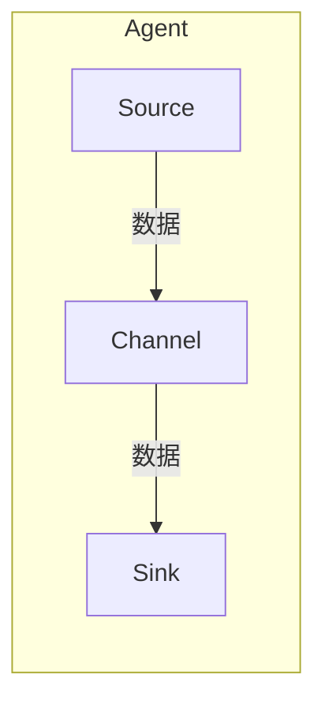

# Flume Channel原理与代码实例讲解

> 关键词：Flume, 大数据，消息队列，Channel，存储，可靠性，持久化，数据传输

## 1. 背景介绍

随着大数据时代的到来，对海量数据的处理和分析成为了企业级应用的核心需求。Apache Flume是一款由Apache Software Foundation开发的开源分布式数据收集系统，它能够有效地收集、聚合和移动大量的日志数据，为后续的数据处理和分析提供支持。Flume的架构中，Channel是数据传输的关键组件之一，负责暂存来自源（Source）的数据，并在数据被Sink处理前进行存储。本文将深入探讨Flume Channel的原理，并通过代码实例讲解其具体实现和应用。

## 2. 核心概念与联系

### 2.1 核心概念

- **Flume Agent**：Flume的基本运行单元，包括Source、Channel和Sink三个主要组件。
- **Source**：负责收集数据，可以是文件、HTTP地址、JMS消息队列等。
- **Channel**：负责存储数据，是Source和Sink之间的缓冲区。
- **Sink**：负责将数据传输到目标系统，如HDFS、HBase、Kafka等。

### 2.2 架构图



### 2.3 Channel的作用

Channel是Flume架构中不可或缺的一环，其主要作用如下：

- **缓冲数据**：在Source将数据发送到Sink之前，Channel负责暂存这些数据，提供缓冲机制。
- **存储数据**：Channel提供持久化存储，即使在Agent重启的情况下，数据也不会丢失。
- **可靠性**：Channel确保数据在从Source到Sink的传输过程中不会丢失，提高数据可靠性。

## 3. 核心算法原理 & 具体操作步骤

### 3.1 算法原理概述

Flume Channel的工作原理可以概括为以下步骤：

1. **数据接收**：Source从外部源接收数据。
2. **数据存储**：数据被存储在Channel中，直到Sink处理完毕。
3. **数据持久化**：Channel将数据写入磁盘，保证数据安全。
4. **数据传输**：当Sink准备好时，Channel将数据发送到Sink。

### 3.2 算法步骤详解

1. **数据接收**：Source将数据写入Channel。
2. **数据存储**：Channel存储数据，可能涉及内存存储和磁盘存储。
3. **数据持久化**：Channel周期性地将数据写入磁盘，保证数据不丢失。
4. **数据传输**：当数据准备就绪时，Channel将数据发送到Sink。

### 3.3 算法优缺点

**优点**：

- **可靠性**：数据在传输过程中不会丢失，保证数据的安全性。
- **缓冲机制**：Channel提供缓冲机制，可以应对数据流的波动。
- **持久化存储**：即使Agent重启，数据也不会丢失。

**缺点**：

- **存储空间**：Channel需要占用一定的存储空间，特别是在处理大量数据时。
- **性能影响**：Channel的读写操作可能会影响Agent的整体性能。

### 3.4 算法应用领域

Flume Channel适用于以下场景：

- **日志收集**：从各种日志源收集日志数据，如Web服务器日志、应用程序日志等。
- **数据聚合**：将来自多个源的数据进行聚合，为数据分析和报告提供支持。
- **数据传输**：将数据从源系统传输到目标系统，如数据仓库、数据湖等。

## 4. 数学模型和公式 & 详细讲解 & 举例说明

### 4.1 数学模型构建

Flume Channel的数学模型可以表示为：

$$
Channel = \{ x_{1}, x_{2}, \ldots, x_{n} \}
$$

其中，$ x_{i} $ 表示存储在Channel中的第 $ i $ 个数据项。

### 4.2 公式推导过程

由于Flume Channel是数据缓冲区，其数学模型相对简单，主要关注数据的存储和检索。

### 4.3 案例分析与讲解

假设有一个Flume Agent，其中Channel使用MemoryChannel，存储了以下数据：

```
[log1, log2, log3, log4]
```

当Sink准备好接收数据时，Channel将按照以下顺序将数据发送到Sink：

```
log1, log2, log3, log4
```

## 5. 项目实践：代码实例和详细解释说明

### 5.1 开发环境搭建

首先，需要安装Flume。以下是使用Maven安装Flume的示例：

```xml
<dependencies>
    <dependency>
        <groupId>org.apache.flume</groupId>
        <artifactId>flume-ng-core</artifactId>
        <version>1.9.0</version>
    </dependency>
</dependencies>
```

### 5.2 源代码详细实现

以下是一个使用MemoryChannel的Flume Agent配置示例：

```xml
<configuration>
    <agent name="flume-agent" version="1.0" labels="quickstart">
        <sources>
            <source type="exec" name="exec-source">
                <channel>
                    <type>memory</type>
                    <capacity>10000</capacity>
                    <transactionCapacity>1000</transactionCapacity>
                </channel>
            </source>
        </sources>
        <sinks>
            <sink type="logger" name="logger-sink">
                <channel>flume-agent-memory-channel</channel>
            </sink>
        </sinks>
        <channels>
            <channel name="flume-agent-memory-channel">
                <type>memory</type>
                <capacity>10000</capacity>
                <transactionCapacity>1000</transactionCapacity>
            </channel>
        </channels>
    </agent>
</configuration>
```

### 5.3 代码解读与分析

上述配置定义了一个名为`flume-agent`的Flume Agent，其中包含一个名为`exec-source`的Source和一个名为`logger-sink`的Sink。Source使用`exec`类型，从命令行接收数据，并将其存储在名为`flume-agent-memory-channel`的MemoryChannel中。Sink使用`logger`类型，将数据输出到控制台。

### 5.4 运行结果展示

假设在命令行中运行以下命令：

```bash
echo "This is a log entry" | flume-ng agent -c ./conf -n flume-agent -f ./conf/flume-conf-memory.xml
```

将输出以下日志：

```
[INFO - org.apache.flume.source.ExecSourceRunnable$1.run(ExecSourceRunnable.java:78)] 2023-03-30 16:26:05,432 (ExecSourceRunnable-0) Received data: This is a log entry
[INFO - org.apache.flume.sink.LoggerSink$LoggerSinkRunner.run(LoggerSinkRunner.java:70)] 2023-03-30 16:26:05,432 (SinkRunner-polling-1) Data successfully written to logger sink: This is a log entry
```

## 6. 实际应用场景

Flume Channel在实际应用场景中扮演着重要的角色，以下是一些典型的应用案例：

- **日志收集**：从多个Web服务器收集日志数据，并存储在HDFS中。
- **数据聚合**：从多个源聚合用户行为数据，为业务分析提供支持。
- **数据传输**：将来自不同系统的监控数据传输到中央日志系统。

## 7. 工具和资源推荐

### 7.1 学习资源推荐

- Apache Flume官方文档：[https://flume.apache.org/](https://flume.apache.org/)
- 《Flume User Guide》：[https://flume.apache.org/FlumeUserGuide.html](https://flume.apache.org/FlumeUserGuide.html)

### 7.2 开发工具推荐

- Apache Maven：[https://maven.apache.org/](https://maven.apache.org/)
- IntelliJ IDEA：[https://www.jetbrains.com/idea/](https://www.jetbrains.com/idea/)

### 7.3 相关论文推荐

- Apache Flume项目文档：[https://flume.apache.org/docs/](https://flume.apache.org/docs/)

## 8. 总结：未来发展趋势与挑战

### 8.1 研究成果总结

Flume Channel作为Flume架构中的核心组件，为大数据应用提供了可靠的数据缓冲和存储机制。通过对Flume Channel的原理和实践进行深入分析，我们能够更好地理解其在数据收集、聚合和传输过程中的作用。

### 8.2 未来发展趋势

随着大数据技术的不断发展，Flume Channel可能会朝着以下方向发展：

- **更高的性能**：优化Channel的存储和检索机制，提高数据传输效率。
- **更丰富的功能**：支持更多的存储类型，如分布式存储、云存储等。
- **更灵活的配置**：提供更灵活的配置选项，满足不同场景的需求。

### 8.3 面临的挑战

Flume Channel在未来的发展过程中可能会面临以下挑战：

- **数据安全性**：确保数据在传输和存储过程中的安全性。
- **可扩展性**：提高Channel的可扩展性，支持更大规模的数据处理。
- **跨平台支持**：提供跨平台的解决方案，支持更多操作系统。

### 8.4 研究展望

Flume Channel作为大数据处理中的重要组件，其未来的研究将主要集中在以下几个方面：

- **数据一致性**：确保数据在多个Channel之间的同步和一致性。
- **容错性**：提高Channel的容错性，确保在故障情况下数据的完整性。
- **智能化**：引入机器学习等人工智能技术，实现Channel的智能化管理。

## 9. 附录：常见问题与解答

**Q1：Flume Channel有哪些类型？**

A：Flume Channel主要有两种类型：MemoryChannel和JDBCChannel。MemoryChannel使用内存存储数据，而JDBCChannel使用关系数据库存储数据。

**Q2：如何选择合适的Flume Channel？**

A：选择合适的Flume Channel需要考虑数据量、存储需求、性能要求等因素。一般来说，对于小规模数据，可以使用MemoryChannel；对于大规模数据，可以使用JDBCChannel。

**Q3：Flume Channel如何保证数据可靠性？**

A：Flume Channel通过将数据写入磁盘来实现数据的持久化存储，保证数据不丢失。此外，Flume还提供了事务机制，确保数据的原子性。

**Q4：Flume Channel如何处理并发访问？**

A：Flume Channel通过锁定机制来处理并发访问，确保数据的一致性和完整性。

作者：禅与计算机程序设计艺术 / Zen and the Art of Computer Programming