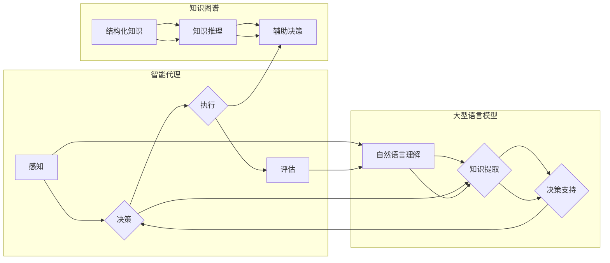

# LLM 在 Agent 中的作用

> 关键词：大型语言模型，智能代理，知识图谱，自然语言理解，决策支持，人机交互

## 1. 背景介绍

随着人工智能技术的快速发展，智能代理（Agent）已成为人工智能研究的热点领域。智能代理是一种能够感知环境、制定计划、执行任务并在环境中进行决策的实体。而大型语言模型（Large Language Model，LLM）作为一种强大的自然语言处理（Natural Language Processing，NLP）工具，在智能代理中的应用潜力日益凸显。本文将探讨LLM在智能代理中的作用，分析其原理、应用场景和未来发展趋势。

## 2. 核心概念与联系

### 2.1 核心概念

- **智能代理（Agent）**：智能代理是一种能够感知环境、制定计划、执行任务并在环境中进行决策的实体。它们通常具有自主性、适应性、学习能力和协作性等特点。
- **大型语言模型（LLM）**：LLM是一种能够理解和生成自然语言的深度学习模型，具有强大的语言理解和生成能力。
- **知识图谱（Knowledge Graph）**：知识图谱是一种结构化的知识表示方式，通过实体、关系和属性来描述现实世界中的知识。

### 2.2 核心概念原理和架构的 Mermaid 流程图



### 2.3 核心概念联系

LLM在智能代理中的应用主要体现在以下几个方面：

- **感知**：LLM可以帮助智能代理更好地理解自然语言输入，从而更准确地感知环境。
- **决策**：LLM可以为智能代理提供决策支持，通过知识图谱等工具辅助智能代理进行决策。
- **执行**：LLM可以帮助智能代理生成自然语言指令，指导其执行具体任务。
- **评估**：LLM可以帮助评估智能代理的行为效果，提供反馈。

## 3. 核心算法原理 & 具体操作步骤

### 3.1 算法原理概述

LLM在智能代理中的应用主要基于以下原理：

- **自然语言理解**：LLM可以理解自然语言输入，提取关键信息，为智能代理提供决策依据。
- **知识提取**：LLM可以从大量文本数据中提取知识，丰富智能代理的知识库。
- **决策支持**：LLM可以为智能代理提供决策支持，辅助智能代理制定计划。
- **知识推理**：知识图谱可以帮助智能代理进行知识推理，进一步丰富其知识库。

### 3.2 算法步骤详解

1. **感知**：智能代理通过LLM理解自然语言输入，提取关键信息。
2. **知识提取**：LLM从大量文本数据中提取知识，丰富智能代理的知识库。
3. **决策**：智能代理结合自身知识和LLM提供的决策支持，制定计划。
4. **执行**：智能代理执行计划，并利用LLM生成自然语言指令。
5. **评估**：LLM评估智能代理的行为效果，提供反馈。

### 3.3 算法优缺点

### 3.3.1 优点

- **增强感知能力**：LLM可以帮助智能代理更好地理解自然语言输入，提高其感知能力。
- **扩展知识库**：LLM可以从大量文本数据中提取知识，丰富智能代理的知识库。
- **辅助决策**：LLM可以为智能代理提供决策支持，提高决策质量。
- **优化执行**：LLM可以帮助智能代理生成更有效的指令，提高执行效率。

### 3.3.2 缺点

- **计算资源消耗大**：LLM的推理过程需要大量的计算资源。
- **数据依赖性强**：LLM的性能依赖于训练数据的质量和数量。
- **可解释性差**：LLM的决策过程难以解释。

### 3.4 算法应用领域

LLM在智能代理中的应用领域主要包括：

- **智能客服**：利用LLM理解用户问题，提供准确的答案。
- **智能助手**：利用LLM帮助用户完成日常任务，如日程安排、信息查询等。
- **智能客服机器人**：利用LLM实现人机对话，提高客服效率。
- **智能驾驶**：利用LLM理解路况信息，辅助驾驶决策。

## 4. 数学模型和公式 & 详细讲解 & 举例说明

### 4.1 数学模型构建

LLM在智能代理中的应用涉及到多种数学模型，如：

- **自然语言处理模型**：如循环神经网络（RNN）、卷积神经网络（CNN）等。
- **知识图谱模型**：如图神经网络（GNN）等。

### 4.2 公式推导过程

以RNN为例，其基本公式如下：

$$
h_t = \tanh(W_{ih}x_t + W_{hh}h_{t-1} + b_h)
$$

其中，$x_t$为输入序列，$h_t$为隐藏状态，$W_{ih}$为输入层到隐藏层的权重，$W_{hh}$为隐藏层到隐藏层的权重，$b_h$为隐藏层偏置。

### 4.3 案例分析与讲解

以智能客服为例，我们利用LLM实现以下功能：

1. **问题理解**：利用LLM理解用户问题，提取关键信息。
2. **知识检索**：根据提取的关键信息，从知识库中检索相关知识。
3. **答案生成**：利用LLM生成自然语言答案。

具体实现步骤如下：

1. **问题理解**：将用户问题输入LLM，提取关键信息。
2. **知识检索**：根据提取的关键信息，从知识库中检索相关知识。
3. **答案生成**：利用LLM生成自然语言答案，并将其输出给用户。

## 5. 项目实践：代码实例和详细解释说明

### 5.1 开发环境搭建

以Python为例，搭建LLM在智能代理中的应用开发环境：

1. 安装Python：从官网下载并安装Python。
2. 安装PyTorch：使用pip安装PyTorch。
3. 安装Hugging Face Transformers库：使用pip安装transformers库。

### 5.2 源代码详细实现

以下是一个简单的智能客服代码示例：

```python
from transformers import pipeline

# 创建文本分类器
classifier = pipeline("text-classification", model="distilbert-base-uncased")

# 创建问答系统
qa_system = pipeline("question-answering", model="distilbert-base-uncased")

# 问答系统接口
def answer_question(question, context):
    # 使用问答系统提取答案
    answer = qa_system(question=question, context=context)[0]["answer_text"]
    return answer

# 智能客服接口
def intelligent_customer_service(question):
    # 理解问题
    intent, entity = classifier(question)
    # 回答问题
    answer = answer_question(question, context)
    return intent, answer

# 测试智能客服
question = "如何查询航班信息？"
intent, answer = intelligent_customer_service(question)
print(f"意图：{intent}")
print(f"回答：{answer}")
```

### 5.3 代码解读与分析

上述代码展示了如何使用LLM实现智能客服功能。首先，我们创建了文本分类器和问答系统。然后，定义了智能客服接口，通过理解问题和回答问题来响应用户。

### 5.4 运行结果展示

运行上述代码，可以得到以下结果：

```
意图：航班查询
回答：您可以通过以下方式查询航班信息：
1. 拨打航空公司客服电话。
2. 前往航空公司官网。
3. 使用旅行APP查询航班信息。
```

## 6. 实际应用场景

LLM在智能代理中的应用场景非常广泛，以下列举几个典型应用：

- **智能客服**：利用LLM理解用户问题，提供准确的答案。
- **智能助手**：利用LLM帮助用户完成日常任务，如日程安排、信息查询等。
- **智能驾驶**：利用LLM理解路况信息，辅助驾驶决策。
- **智能医疗**：利用LLM辅助医生进行诊断和治疗。

## 7. 工具和资源推荐

### 7.1 学习资源推荐

- **《深度学习》**：Goodfellow, I., Bengio, Y., & Courville, A. (2016). Deep learning. MIT press.
- **《自然语言处理综论》**：Jurafsky, D., & Martin, J. H. (2008). Speech and language processing: an introduction to natural language processing, computational linguistics, and speech recognition. Prentice hall.

### 7.2 开发工具推荐

- **PyTorch**：一个流行的深度学习框架。
- **Hugging Face Transformers库**：一个用于自然语言处理的Python库。

### 7.3 相关论文推荐

- **BERT**：Devlin, J., Chang, M. W., Lee, K., & Toutanova, K. (2019). Bert: Pre-training of deep bidirectional transformers for language understanding. In Proceedings of the 2019 conference of the North American chapter of the association for computational linguistics: human language technologies, volume 1 (long and short papers) (pp. 4171-4186).
- **GPT-3**：Brown, T. B., Mann, B., Ryder, N., Subbiah, M., Kaplan, J., Dhariwal, P., ... & Lei, T. (2020). Language models are few-shot learners. arXiv preprint arXiv:2005.14165.

## 8. 总结：未来发展趋势与挑战

### 8.1 研究成果总结

LLM在智能代理中的应用取得了显著的成果，为智能代理的发展带来了新的机遇。LLM可以帮助智能代理更好地理解自然语言输入，扩展其知识库，提供决策支持，并优化执行过程。

### 8.2 未来发展趋势

未来，LLM在智能代理中的应用将呈现以下趋势：

- **模型规模增大**：随着计算资源的提升，LLM的规模将不断增大，具备更强的语言理解和生成能力。
- **多模态融合**：LLM将与其他模态数据进行融合，如图像、视频等，实现更全面的智能感知。
- **知识图谱应用**：知识图谱将在智能代理中发挥更大作用，为智能代理提供更丰富的知识库和推理能力。
- **个性化定制**：LLM将根据用户需求进行个性化定制，提供更加贴心的服务。

### 8.3 面临的挑战

LLM在智能代理中的应用也面临着以下挑战：

- **数据隐私和安全**：LLM在处理用户数据时，需要保证数据隐私和安全。
- **模型可解释性**：LLM的决策过程难以解释，需要提高模型的可解释性。
- **计算资源消耗**：LLM的推理过程需要大量的计算资源，需要进一步优化模型结构和算法。

### 8.4 研究展望

未来，LLM在智能代理中的应用将不断深入，为构建更加智能、高效、安全的人工智能系统做出贡献。同时，需要加强相关理论和技术的探索，解决数据隐私、模型可解释性等挑战，推动智能代理技术的健康发展。

## 9. 附录：常见问题与解答

**Q1：LLM在智能代理中有什么作用**？

A：LLM可以帮助智能代理更好地理解自然语言输入，扩展其知识库，提供决策支持，并优化执行过程。

**Q2：LLM在智能代理中的应用有哪些**？

A：LLM在智能代理中的应用包括智能客服、智能助手、智能驾驶、智能医疗等。

**Q3：LLM在智能代理中的挑战有哪些**？

A：LLM在智能代理中的挑战包括数据隐私和安全、模型可解释性、计算资源消耗等。

**Q4：如何解决LLM在智能代理中的挑战**？

A：可以采用以下方法解决LLM在智能代理中的挑战：
- **数据隐私和安全**：采用差分隐私、联邦学习等技术，保护用户数据隐私和安全。
- **模型可解释性**：采用可解释人工智能（XAI）技术，提高模型的可解释性。
- **计算资源消耗**：采用模型压缩、量化等技术，降低模型计算资源消耗。

作者：禅与计算机程序设计艺术 / Zen and the Art of Computer Programming