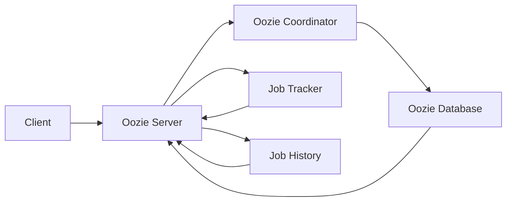

# Oozie原理与代码实例讲解

> 关键词：Oozie, 工作流引擎, Hadoop, 分布式计算, 调度, 代码实例, 实践指南

## 1. 背景介绍

随着大数据时代的到来，分布式计算框架如Hadoop在处理海量数据方面发挥了重要作用。Hadoop生态系统中，Oozie是一个强大的工作流引擎，用于协调和管理Hadoop作业。它能够将多个Hadoop作业（如MapReduce、Spark、Streaming等）组合成一个工作流，使得复杂的计算任务可以像编写脚本一样简单。本文将深入探讨Oozie的原理，并通过实例代码讲解其使用方法。

### 1.1 问题的由来

在分布式计算环境中，往往需要执行一系列复杂的任务，例如数据处理、数据转换、数据分析等。这些任务可能需要依赖于其他任务的结果，或者需要按照特定的顺序执行。手动管理这些任务不仅效率低下，而且容易出错。Oozie的出现，就是为了解决这一问题，提供一个统一的工作流管理平台。

### 1.2 研究现状

Oozie是Apache软件基金会的一个开源项目，已经成为Hadoop生态系统的重要组成部分。它支持多种作业类型，包括Hadoop MapReduce、Hive、Pig、Spark、FsGet、FsPut、Shell、Java、Email等，可以灵活地构建各种工作流。

### 1.3 研究意义

Oozie能够提高分布式计算任务的执行效率，减少人工干预，降低错误率。通过Oozie，用户可以专注于业务逻辑的实现，而无需关心任务调度的复杂性。

### 1.4 本文结构

本文将按照以下结构进行：

- 第2部分：介绍Oozie的核心概念和架构。
- 第3部分：详细解释Oozie的工作原理和操作步骤。
- 第4部分：通过数学模型和公式，深入讲解Oozie的计算逻辑。
- 第5部分：提供Oozie的代码实例和详细解释。
- 第6部分：探讨Oozie在实际应用场景中的使用。
- 第7部分：推荐Oozie相关的学习资源、开发工具和论文。
- 第8部分：总结Oozie的未来发展趋势和面临的挑战。
- 第9部分：提供常见问题与解答。

## 2. 核心概念与联系

### 2.1 核心概念

- **工作流**：Oozie中的基本单元，由一系列作业组成，定义了作业的执行顺序和依赖关系。
- **作业**：Oozie中的任务单元，可以是Hadoop作业、Shell脚本、Java程序等。
- **协调器**：定义工作流中作业的执行顺序和依赖关系。
- **共享库**：存储工作流中使用的各种资源，如作业定义、配置文件等。

### 2.2 架构

Oozie的架构图如下所示：



- **Client**：客户端，用于提交和监控工作流。
- **Oozie Server**：Oozie服务器，负责处理客户端的请求，调度作业，并与Oozie Coordinator通信。
- **Oozie Coordinator**：协调器，负责解析工作流定义，调度作业执行。
- **Oozie Database**：存储工作流定义、作业状态、元数据等信息。
- **Job Tracker**：Hadoop作业跟踪器，负责监控作业的执行状态。
- **Job History**：存储作业的历史执行信息。

## 3. 核心算法原理 & 具体操作步骤

### 3.1 算法原理概述

Oozie的核心算法是调度算法，它根据工作流定义中的依赖关系，决定作业的执行顺序。调度算法的主要步骤如下：

1. 解析工作流定义，构建作业依赖图。
2. 根据作业的依赖关系，确定作业的执行顺序。
3. 调度作业执行，并监控其状态。
4. 根据作业的执行结果，更新作业状态和工作流状态。

### 3.2 算法步骤详解

1. **解析工作流定义**：Oozie Coordinator首先解析工作流定义文件，构建作业依赖图。工作流定义文件通常使用XML格式，定义了作业的类型、参数、依赖关系等。

2. **确定作业执行顺序**：根据作业依赖图，Oozie Coordinator确定作业的执行顺序。例如，如果一个作业依赖于另一个作业的输出，那么它只能在依赖的作业完成后执行。

3. **调度作业执行**：Oozie Coordinator将作业调度到Hadoop集群中执行。作业的执行可以通过多种方式完成，例如Hadoop MapReduce、Spark、Shell脚本等。

4. **监控作业状态**：Oozie Coordinator监控作业的执行状态，包括运行中、成功、失败等。如果作业失败，Oozie Coordinator可以尝试重新执行或通知管理员。

5. **更新状态**：根据作业的执行结果，Oozie Coordinator更新作业状态和工作流状态。

### 3.3 算法优缺点

#### 优点：

- **易于使用**：Oozie提供直观的工作流定义语言，用户可以轻松地定义复杂的作业依赖关系。
- **灵活**：支持多种作业类型，可以满足不同的计算需求。
- **稳定**：Oozie经过多年的发展，已经非常稳定，可以可靠地调度和管理Hadoop作业。

#### 缺点：

- **学习曲线**：对于初学者来说，学习Oozie可能需要一些时间。
- **配置复杂**：虽然Oozie提供了丰富的配置选项，但配置起来可能比较复杂。

### 3.4 算法应用领域

Oozie广泛应用于Hadoop生态系统中的各种场景，包括：

- **数据清洗**：将多个数据清洗作业组合成一个工作流，自动处理数据质量问题。
- **数据转换**：将不同格式的数据转换成统一格式，以便后续分析和处理。
- **数据加载**：将数据从源系统加载到目标系统。
- **数据分析**：将多个数据分析作业组合成一个工作流，自动分析数据并生成报告。

## 4. 数学模型和公式 & 详细讲解 & 举例说明

### 4.1 数学模型构建

Oozie的工作流定义可以用有向无环图（DAG）来表示。每个节点代表一个作业，每条边代表作业之间的依赖关系。

### 4.2 公式推导过程

Oozie的调度算法可以通过以下公式进行推导：

$$
F(S) = \max(F(v) + w(v,s))
$$

其中，$F(S)$ 表示从源节点 $S$ 到目标节点 $s$ 的最短路径长度，$F(v)$ 表示从源节点 $S$ 到节点 $v$ 的最短路径长度，$w(v,s)$ 表示节点 $v$ 到节点 $s$ 的权重。

### 4.3 案例分析与讲解

假设有一个简单的工作流，包括三个作业：作业A、作业B和作业C。作业A和作业B互为依赖，作业B完成后触发作业C。以下是其工作流定义：

```xml
<workflow-app xmlns="uri:oozie:workflow:0.4">
  <name>SimpleWorkflow</name>
  <start-to-start>
    <start>
      <name>start</name>
    </start>
    <action>
      <name>A</name>
      <type>MapReduce</type>
      <configuration>
        <property>
          <name>mapreduce.job.name</name>
          <value>Job A</value>
        </property>
      </configuration>
    </action>
  </start-to-start>
  <action>
    <name>B</name>
    <type>MapReduce</type>
    <configuration>
      <property>
        <name>mapreduce.job.name</name>
        <value>Job B</value>
      </property>
    </configuration>
    <start-to-start>
      <start>
        <name>A</name>
      </start>
    </start-to-start>
  </action>
  <action>
    <name>C</name>
    <type>MapReduce</type>
    <configuration>
      <property>
        <name>mapreduce.job.name</name>
        <value>Job C</value>
      </property>
    </configuration>
    <start-to-start>
      <start>
        <name>B</name>
      </start>
    </start-to-start>
  </action>
  <end-to-end>
    <end>
      <name>end</name>
    </end>
  </end-to-end>
</workflow-app>
```

在这个例子中，作业A和作业B之间有直接的依赖关系，作业B完成后触发作业C。Oozie会根据这个工作流定义，确定作业的执行顺序。

## 5. 项目实践：代码实例和详细解释说明

### 5.1 开发环境搭建

要使用Oozie，首先需要搭建Hadoop和Oozie环境。以下是基本步骤：

1. 下载并安装Hadoop和Oozie。
2. 配置Hadoop集群。
3. 配置Oozie服务。

### 5.2 源代码详细实现

以下是一个简单的Oozie工作流实例，包含两个作业：作业A和作业B。

```xml
<workflow-app xmlns="uri:oozie:workflow:0.4">
  <name>SimpleWorkflow</name>
  <start-to-start>
    <start>
      <name>start</name>
    </start>
    <action>
      <name>A</name>
      <type>MapReduce</type>
      <configuration>
        <property>
          <name>mapreduce.job.name</name>
          <value>Job A</value>
        </property>
      </configuration>
    </action>
  </start-to-start>
  <action>
    <name>B</name>
    <type>MapReduce</type>
    <configuration>
      <property>
        <name>mapreduce.job.name</name>
        <value>Job B</value>
      </property>
    </configuration>
    <start-to-start>
      <start>
        <name>A</name>
      </start>
    </start-to-start>
  </action>
  <end-to-end>
    <end>
      <name>end</name>
    </end>
  </end-to-end>
</workflow-app>
```

### 5.3 代码解读与分析

这个工作流定义了一个简单的线性工作流，作业A完成后触发作业B。在Oozie中，`<workflow-app>`标签定义了一个工作流，`<start-to-start>`标签定义了作业A的起点，`<action>`标签定义了一个作业，`<configuration>`标签定义了作业的配置信息。

### 5.4 运行结果展示

将上述工作流定义保存为`simpleworkflow.xml`，然后在Oozie中提交该工作流：

```bash
oozie workflow -config simpleworkflow.properties -file simpleworkflow.xml -run
```

Oozie会按照工作流定义执行作业，并在控制台输出执行结果。

## 6. 实际应用场景

Oozie在许多实际应用场景中都有广泛的应用，以下是一些例子：

- **数据仓库ETL**：使用Oozie管理数据仓库的ETL过程，包括数据抽取、转换和加载。
- **数据分析和报告**：将多个数据分析作业组合成一个工作流，自动生成报告。
- **机器学习**：使用Oozie管理机器学习任务的执行流程，包括数据预处理、模型训练、模型评估等。

## 7. 工具和资源推荐

### 7.1 学习资源推荐

- 《Oozie User Guide》：Oozie官方用户指南，提供了详细的文档和教程。
- 《Hadoop实战》：介绍了Hadoop生态系统的使用方法，包括Oozie。
- 《大数据技术实战》系列书籍：深入讲解了大数据技术的原理和应用，包括Oozie。

### 7.2 开发工具推荐

- **IntelliJ IDEA**：支持Oozie插件，可以方便地编辑和调试Oozie工作流定义文件。
- **Eclipse**：可以通过Oozie插件支持Oozie开发。

### 7.3 相关论文推荐

- 《Oozie: An extensible and scalable workflow engine for Hadoop》

## 8. 总结：未来发展趋势与挑战

### 8.1 研究成果总结

Oozie作为Hadoop生态系统的重要组成部分，为分布式计算提供了强大的工作流管理功能。它能够提高分布式计算任务的执行效率，减少人工干预，降低错误率。

### 8.2 未来发展趋势

随着云计算和大数据技术的不断发展，Oozie将朝着以下几个方向发展：

- **云原生**：将Oozie迁移到云平台，提供云原生的工作流管理功能。
- **容器化**：使用容器技术，提高Oozie的可移植性和可扩展性。
- **服务化**：将Oozie的功能模块化，提供微服务化的工作流管理能力。

### 8.3 面临的挑战

Oozie在发展过程中也面临着一些挑战：

- **生态支持**：随着Hadoop生态系统的变化，Oozie需要适应新的技术发展。
- **用户界面**：Oozie的用户界面相对简单，需要进一步改进。
- **性能优化**：Oozie在处理大规模工作流时，可能存在性能瓶颈。

### 8.4 研究展望

未来，Oozie将继续在分布式计算领域发挥重要作用。通过不断优化和改进，Oozie将更好地满足用户的需求，推动分布式计算技术的发展。

## 9. 附录：常见问题与解答

**Q1：Oozie与Azkaban有什么区别？**

A：Oozie和Azkaban都是工作流管理工具，但它们在架构和功能上有所不同。Oozie是Hadoop生态系统的一部分，与Hadoop紧密集成；而Azkaban是独立的工具，可以与多种计算框架集成。Oozie更适合需要与Hadoop生态系统集成的场景，而Azkaban更适合需要灵活配置和扩展的场景。

**Q2：Oozie支持哪些作业类型？**

A：Oozie支持多种作业类型，包括Hadoop MapReduce、Hive、Pig、Spark、FsGet、FsPut、Shell、Java、Email等。

**Q3：如何优化Oozie工作流的性能？**

A：优化Oozie工作流性能可以从以下几个方面入手：

- 优化工作流定义，减少不必要的作业和依赖关系。
- 选择合适的作业类型和配置参数。
- 使用Hadoop集群的资源管理功能，如YARN。
- 使用Oozie的并发控制功能，避免资源冲突。

**Q4：Oozie是否支持可视化界面？**

A：Oozie本身不提供可视化界面，但有一些第三方工具可以提供Oozie的可视化界面，例如oozie-webstart。

**Q5：如何监控Oozie作业的执行状态？**

A：Oozie提供了Web界面，可以监控作业的执行状态。此外，还可以使用命令行工具，如oozie admin和oozie job。

---

作者：禅与计算机程序设计艺术 / Zen and the Art of Computer Programming