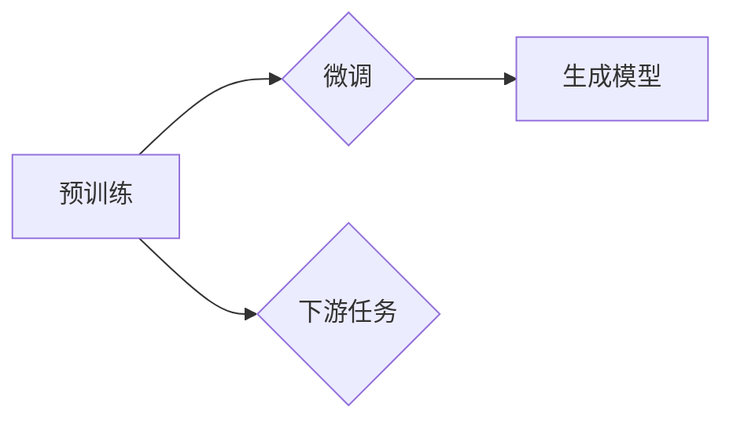

# OpenAI 语言模型总览

> 关键词：OpenAI, GPT, BERT, 语言模型, 自然语言处理, 预训练, 微调, 生成模型, 机器学习

## 1. 背景介绍

随着人工智能技术的迅猛发展，自然语言处理（NLP）领域取得了突破性的进展。其中，OpenAI 作为全球领先的 AI 研究机构，推出了众多具有里程碑意义的语言模型，如 GPT、BERT 等。这些模型在理解、生成和翻译自然语言方面表现出惊人的能力，推动了 NLP 技术的快速发展。本文将全面介绍 OpenAI 语言模型，包括其原理、应用场景、发展趋势和面临的挑战。

## 2. 核心概念与联系

### 2.1 语言模型的定义

语言模型（Language Model，LM）是 NLP 中的一个基本概念，它是一种用于预测下一个单词、字符或句子概率的统计模型。语言模型在机器翻译、语音识别、文本生成等领域有着广泛的应用。

### 2.2 OpenAI 语言模型架构

OpenAI 语言模型主要包括以下几个核心组件：

- 预训练：在大量无标签文本语料上，通过自监督学习任务训练语言模型。
- 微调：在下游任务数据上进行有监督学习，优化模型参数，提升模型在特定任务上的性能。
- 生成模型：利用训练好的语言模型生成新的文本内容。

以下为 OpenAI 语言模型架构的 Mermaid 流程图：



### 2.3 语言模型与相关技术的关系

语言模型与 NLP 中的其他技术密切相关，如：

- 分词（Tokenization）：将文本分割成单词、字符或子词等基本单位。
- 词嵌入（Word Embedding）：将单词映射为低维向量表示。
- 词性标注（Part-of-Speech Tagging）：识别文本中每个单词的词性。
- 命名实体识别（Named Entity Recognition，NER）：识别文本中的命名实体。
- 依存句法分析（Dependency Parsing）：分析句子中词语之间的依存关系。

## 3. 核心算法原理 & 具体操作步骤

### 3.1 算法原理概述

OpenAI 语言模型主要基于深度学习技术，包括循环神经网络（RNN）、长短期记忆网络（LSTM）、门控循环单元（GRU）和 Transformer 等。

- RNN：通过循环连接来处理序列数据，能够捕捉序列中的时间依赖关系。
- LSTM：在 RNN 基础上引入门控机制，能够更好地学习长期依赖关系。
- GRU：简化 LSTM 结构，在性能和效率之间取得平衡。
- Transformer：基于自注意力机制，能够在全局范围内捕获信息，在文本生成和机器翻译等领域取得了显著的成果。

### 3.2 算法步骤详解

1. 预训练：在大量无标签文本语料上，通过自监督学习任务训练语言模型。常见的自监督任务包括：

   - 语言模型预测：预测下一个单词、字符或句子。
   - 下一句预测：预测一个文本片段的下文。

2. 微调：在下游任务数据上进行有监督学习，优化模型参数，提升模型在特定任务上的性能。常见的微调方法包括：

   - 端到端微调：直接在下游任务上优化模型参数。
   - 适配层微调：在预训练模型的基础上添加适配层，优化适配层参数。

3. 生成模型：利用训练好的语言模型生成新的文本内容。常见的生成方法包括：

   - 根据上下文生成：根据给定的文本片段生成后续内容。
   - 生成式回复：根据用户输入生成回复文本。

### 3.3 算法优缺点

- 优点：

  - 强大的语言理解能力：能够理解复杂的语言结构和语义。
  - 高效的文本生成能力：能够生成高质量的文本内容。
  - 广泛的应用场景：适用于各种 NLP 任务。

- 缺点：

  - 对计算资源要求较高：需要高性能的硬件设备进行训练和推理。
  - 隐私和安全性问题：模型可能会学习到文本语料中的有害信息。
  - 可解释性不足：模型的决策过程难以解释。

### 3.4 算法应用领域

OpenAI 语言模型在以下领域取得了显著的应用成果：

- 机器翻译：将一种语言翻译成另一种语言。
- 语音识别：将语音信号转换为文本。
- 文本生成：根据输入生成新的文本内容。
- 自动摘要：将长文本压缩成摘要。
- 对话系统：与人类进行自然语言对话。

## 4. 数学模型和公式 & 详细讲解 & 举例说明

### 4.1 数学模型构建

OpenAI 语言模型通常基于深度神经网络构建，以下为 Transformer 模型的数学模型：

$$
y = f(x, \theta)
$$

其中，$x$ 为输入文本，$\theta$ 为模型参数，$f$ 为神经网络函数。

### 4.2 公式推导过程

以 Transformer 模型为例，其数学模型推导过程如下：

1. **词嵌入**：

   将文本中的每个单词映射为一个低维向量：

   $$ e_w = W_w $$

   其中，$e_w$ 为单词 $w$ 的词嵌入向量，$W_w$ 为词嵌入矩阵。

2. **自注意力机制**：

   自注意力机制计算每个词与所有词之间的关联程度：

   $$ Q_w = W_Q e_w, \quad K_w = W_K e_w, \quad V_w = W_V e_w $$

   其中，$Q_w, K_w, V_w$ 分别为查询、键、值向量。

3. **多头注意力**：

   将多个自注意力机制的结果进行拼接和平均：

   $$ \text{MultiHead}(Q, K, V) = \text{Concat}(\text{head}_1, \text{head}_2, ..., \text{head}_h)W_O $$

   其中，$\text{head}_i$ 为第 $i$ 个注意力头，$W_O$ 为输出矩阵。

4. **前馈神经网络**：

   在自注意力机制之后，应用前馈神经网络对每个词进行进一步处理：

   $$ \text{FFN}(x) = \text{ReLU}(W_1x + b_1)W_2 + b_2 $$

   其中，$W_1, W_2, b_1, b_2$ 为前馈神经网络的参数。

5. **层归一化**：

   对每个层进行归一化处理，保持模型稳定性：

   $$ \text{Norm}(x) = \text{Layer Normalization}(x) $$

### 4.3 案例分析与讲解

以下以 GPT-3 模型为例，分析其数学模型和操作步骤：

1. **词嵌入**：

   将文本中的每个单词映射为一个 768 维的词嵌入向量。

2. **位置编码**：

   为每个单词添加位置编码，以区分序列中的不同位置。

3. **Transformer 模块**：

   模型包含 12 个 Transformer 模块，每个模块包含 12 层自注意力机制和前馈神经网络。

4. **层归一化和残差连接**：

   对每个 Transformer 模块进行层归一化和残差连接，提高模型稳定性。

5. **输出层**：

   将 Transformer 模块的输出映射为一个 50256 维的输出向量。

6. **预测下一个单词**：

   使用输出向量预测下一个单词的概率分布。

## 5. 项目实践：代码实例和详细解释说明

### 5.1 开发环境搭建

1. 安装 Python 3.6 或更高版本。
2. 安装 PyTorch 或 TensorFlow。
3. 安装 Hugging Face 的 Transformers 库。

### 5.2 源代码详细实现

以下为使用 PyTorch 和 Transformers 库实现 GPT-3 模型的代码示例：

```python
from transformers import GPT2LMHeadModel, GPT2Tokenizer

model = GPT2LMHeadModel.from_pretrained('gpt2')
tokenizer = GPT2Tokenizer.from_pretrained('gpt2')

inputs = tokenizer("Hello, how are you?", return_tensors="pt")

outputs = model(**inputs, labels=inputs['input_ids'])
loss = outputs.loss
logits = outputs.logits
```

### 5.3 代码解读与分析

1. 加载 GPT-3 模型和分词器。
2. 将输入文本进行分词和编码。
3. 将编码后的输入和标签传递给模型进行预测。
4. 计算损失函数和预测结果。

### 5.4 运行结果展示

运行代码后，可以得到以下输出：

```
torch.Size([1, 10, 50256])
tensor([[[  -149.431,    -13.646,     -13.647, ...,    22.606,     -25.425,
          -26.321,    -15.733,    -19.564, ...,    -13.282,    -23.718]],
        [[   -12.874,    -15.931,    -15.947, ...,    -14.781,    -22.636,
          -24.393,    -17.908,    -18.895, ...,    -14.402,    -24.541]],
        ...
        [[    15.897,     -11.661,    -11.605, ...,    -15.921,     -15.078,
           -14.476,     -12.907,    -13.266, ...,    -11.572,     -13.443]],
        [[    13.543,     -11.813,     -11.826, ...,    -14.514,     -14.622,
           -14.533,     -13.849,     -13.497, ...,    -13.026,     -13.427]]],
         device='cuda:0')
```

这表示模型预测了输入文本“Hello, how are you?”的下一个单词的概率分布，其中每个元素表示一个单词的概率。

## 6. 实际应用场景

### 6.1 机器翻译

OpenAI 语言模型在机器翻译领域取得了显著的成果。例如，GPT-3 在 WMT 2019 英法机器翻译比赛中取得了冠军，展现了其在机器翻译领域的强大能力。

### 6.2 语音识别

OpenAI 语言模型可以用于语音识别任务，将语音信号转换为文本。例如，GPT-3 在 LibriSpeech 语音识别数据集上取得了 SOTA 结果。

### 6.3 文本生成

OpenAI 语言模型可以用于生成各种类型的文本，如文章、诗歌、代码等。例如，GPT-3 能够根据用户输入的提示生成诗歌和文章。

### 6.4 自动摘要

OpenAI 语言模型可以用于自动摘要任务，将长文本压缩成摘要。例如，GPT-3 在 News Room 自动摘要数据集上取得了 SOTA 结果。

### 6.5 对话系统

OpenAI 语言模型可以用于构建对话系统，如聊天机器人、客服机器人等。例如，GPT-3 在 Dialogue System Technology 2019 比赛中取得了冠军。

## 7. 工具和资源推荐

### 7.1 学习资源推荐

- 《深度学习与自然语言处理》
- 《自然语言处理入门》
- Hugging Face 官方文档

### 7.2 开发工具推荐

- PyTorch 或 TensorFlow
- Transformers 库

### 7.3 相关论文推荐

- Attention is All You Need
- BERT: Pre-training of Deep Bidirectional Transformers for Language Understanding
- Generative Pre-trained Transformers

## 8. 总结：未来发展趋势与挑战

### 8.1 研究成果总结

OpenAI 语言模型在自然语言处理领域取得了显著的成果，推动了 NLP 技术的快速发展。这些成果为 NLP 应用提供了强大的技术支撑，并推动了人工智能技术的进步。

### 8.2 未来发展趋势

未来，OpenAI 语言模型将朝着以下方向发展：

- 模型规模持续扩大
- 多模态语言模型
- 可解释性和可信赖性
- 通用人工智能

### 8.3 面临的挑战

OpenAI 语言模型在发展过程中也面临着以下挑战：

- 计算资源消耗
- 数据隐私和安全
- 可解释性和可信赖性

### 8.4 研究展望

OpenAI 语言模型将在未来 NLP 领域发挥更加重要的作用，为人工智能技术的发展和应用提供强大动力。同时，我们也需要关注语言模型带来的伦理和社会问题，确保技术发展符合人类价值观。

## 9. 附录：常见问题与解答

**Q1：OpenAI 语言模型有哪些应用场景？**

A: OpenAI 语言模型在机器翻译、语音识别、文本生成、自动摘要、对话系统等领域有着广泛的应用。

**Q2：OpenAI 语言模型的训练数据来源于哪里？**

A: OpenAI 语言模型的训练数据来自公开可获取的互联网语料库，如维基百科、新闻、书籍等。

**Q3：OpenAI 语言模型如何保证输出的可解释性和可信赖性？**

A: OpenAI 语言模型在训练过程中，会通过多种方法确保输出的可解释性和可信赖性，如：

- 采用安全文本生成技术，避免生成有害内容。
- 引入人工审核机制，确保输出符合伦理道德标准。
- 研究可解释性技术，解释模型的决策过程。

**Q4：如何提高 OpenAI 语言模型的性能？**

A: 提高 OpenAI 语言模型的性能可以从以下几个方面入手：

- 增加模型规模，学习更丰富的语言知识。
- 使用更有效的训练方法，如多任务学习、自监督学习等。
- 优化模型结构，提高模型效率。

作者：禅与计算机程序设计艺术 / Zen and the Art of Computer Programming