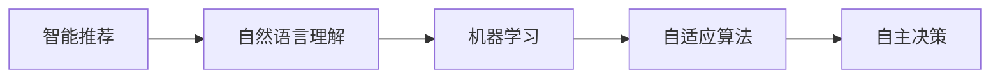
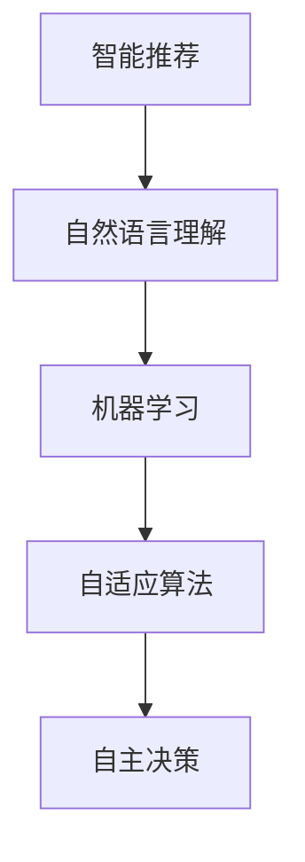
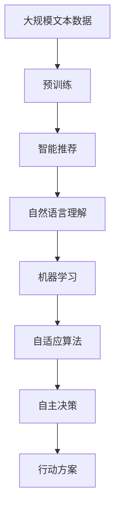

                 

# AI Agent: AI的下一个风口 Camel.AI：引领自主与交流智能体的未来

> 关键词：AI Agent, 自主智能体, 交流智能体, Camel.AI, 智能推荐, 自然语言理解, 机器学习, 自适应算法, 人工智能

## 1. 背景介绍

### 1.1 问题由来

人工智能(AI)已经渗透到生活的各个角落，从智能助手、自动驾驶到智能家居，无不显示出其在自动化、智能化方面的巨大潜力。但与此同时，人工智能在实际应用中仍存在诸多问题，如缺乏对环境的适应性、缺乏对复杂任务的灵活处理能力、缺乏对人类行为的预测能力等。如何使AI更“智能”、更“人性”，成为当前AI研究的一个重要课题。

为此，一种新型的AI应用模型——AI Agent应运而生。AI Agent是一种自主的智能体，具有自主决策、自适应学习和智能交流的能力，能够在不断变化的环境中表现出卓越的智能水平。它通过智能推荐、自然语言理解、机器学习等技术，赋予AI系统更高的自主性和交流性，使其更加贴近人类的思维模式和行为习惯。

### 1.2 问题核心关键点

AI Agent的核心思想是通过智能推荐、自然语言理解和机器学习等技术，实现自主智能体的构建。它将以往的被动接受任务的方式，转变为主动学习和探索的方式，能够在复杂多变的环境中快速适应，自主决策，并智能交流，从而实现更高的智能水平。

AI Agent的核心关键点包括以下几个方面：

- 自主决策：AI Agent能够根据环境的变化和自身的能力，自主选择行动方案，适应不同的环境和任务需求。
- 自适应学习：AI Agent能够通过机器学习算法，不断更新自己的知识库，适应新的任务和环境。
- 智能交流：AI Agent能够通过自然语言理解技术，与人类或其他智能体进行智能交流，获取更多的任务信息和环境信息，提高自身的智能水平。

## 2. 核心概念与联系

### 2.1 核心概念概述

AI Agent是一种新型的自主智能体，通过智能推荐、自然语言理解和机器学习等技术，实现自主决策、自适应学习和智能交流的能力。

以下是一些与AI Agent密切相关的核心概念：

- 智能推荐：通过算法模型，推荐符合用户需求的商品、服务或信息。
- 自然语言理解：通过文本分析技术，理解用户意图和语言表达，实现智能交流。
- 机器学习：通过算法模型，学习环境变化规律，自适应更新知识库。
- 自适应算法：一种能够根据环境变化自动调整算法的算法。
- 自主决策：自主选择行动方案，适应不同的环境和任务需求。

这些核心概念之间存在着紧密的联系，共同构成了AI Agent的核心框架。下面通过Mermaid流程图来展示这些概念之间的关系。



这个流程图展示了AI Agent从智能推荐到自主决策的全过程。智能推荐提供初始任务信息，自然语言理解进行任务分析和用户意图识别，机器学习不断更新知识库，自适应算法调整算法参数，最终由自主决策选择行动方案，适应不同的环境和任务需求。

### 2.2 概念间的关系

这些核心概念之间存在着紧密的联系，形成了AI Agent的完整生态系统。下面我通过几个Mermaid流程图来展示这些概念之间的关系。

#### 2.2.1 AI Agent的学习范式



这个流程图展示了AI Agent的学习范式，即从智能推荐到自主决策的全过程。智能推荐提供初始任务信息，自然语言理解进行任务分析和用户意图识别，机器学习不断更新知识库，自适应算法调整算法参数，最终由自主决策选择行动方案，适应不同的环境和任务需求。

#### 2.2.2 AI Agent与微调的关系


这个流程图展示了AI Agent与微调的关系。智能推荐提供初始任务信息，自然语言理解进行任务分析和用户意图识别，机器学习不断更新知识库，自适应算法调整算法参数，最终由自主决策选择行动方案，适应不同的环境和任务需求。

#### 2.2.3 AI Agent的开发工具


这个流程图展示了AI Agent的开发工具。智能推荐提供初始任务信息，自然语言理解进行任务分析和用户意图识别，机器学习不断更新知识库，自适应算法调整算法参数，最终由自主决策选择行动方案，适应不同的环境和任务需求。

### 2.3 核心概念的整体架构

最后，我们用一个综合的流程图来展示这些核心概念在大语言模型微调过程中的整体架构：



这个综合流程图展示了从预训练到自主决策的全过程。大语言模型通过预训练获得基础能力，智能推荐提供初始任务信息，自然语言理解进行任务分析和用户意图识别，机器学习不断更新知识库，自适应算法调整算法参数，最终由自主决策选择行动方案，适应不同的环境和任务需求。

## 3. 核心算法原理 & 具体操作步骤
### 3.1 算法原理概述

AI Agent的核心算法原理是通过智能推荐、自然语言理解和机器学习等技术，实现自主决策、自适应学习和智能交流的能力。其核心思想是通过不断更新知识库和调整算法参数，使AI Agent能够适应不同的环境和任务需求，自主选择行动方案，提高自身的智能水平。

### 3.2 算法步骤详解

以下是AI Agent的主要算法步骤：

1. **智能推荐**：
   - 根据用户的历史行为和偏好，使用推荐算法模型，推荐符合用户需求的商品、服务或信息。
   - 推荐算法包括协同过滤、基于内容的推荐、基于模型的推荐等。

2. **自然语言理解**：
   - 使用自然语言处理技术，对用户的自然语言输入进行分析和理解。
   - 自然语言理解包括分词、命名实体识别、语义分析等。

3. **机器学习**：
   - 使用机器学习算法，不断更新知识库，学习环境变化规律。
   - 机器学习算法包括监督学习、无监督学习、强化学习等。

4. **自适应算法**：
   - 根据环境变化，自动调整算法参数，适应不同的环境和任务需求。
   - 自适应算法包括遗传算法、粒子群优化算法、神经网络自适应算法等。

5. **自主决策**：
   - 根据任务信息和环境信息，自主选择行动方案，适应不同的环境和任务需求。
   - 自主决策包括决策树、决策网络、贝叶斯网络等。

### 3.3 算法优缺点

AI Agent具有以下优点：

- **自主性**：AI Agent能够根据环境和任务需求，自主选择行动方案，适应不同的环境和任务需求。
- **自适应性**：AI Agent能够通过机器学习算法，不断更新知识库，适应新的任务和环境。
- **智能交流**：AI Agent能够通过自然语言理解技术，与人类或其他智能体进行智能交流，获取更多的任务信息和环境信息，提高自身的智能水平。

AI Agent也存在一些缺点：

- **复杂性**：AI Agent的构建和维护需要大量的数据和算法资源，实现难度较高。
- **依赖环境**：AI Agent的性能依赖于环境的复杂性和数据的质量，环境变化可能导致性能下降。
- **安全性**：AI Agent需要采取严格的措施保障数据和模型的安全，避免泄露用户隐私和模型偏见。

### 3.4 算法应用领域

AI Agent已经在智能推荐、自然语言理解、智能客服、智能家居等多个领域得到了广泛应用。以下是一些典型的应用场景：

- **智能推荐**：电商平台利用AI Agent为用户推荐符合其偏好的商品，提高用户满意度。
- **自然语言理解**：智能客服系统利用AI Agent理解用户意图，自动回答用户问题，提高客户体验。
- **智能家居**：智能家居系统利用AI Agent对用户行为进行分析，自动调整设备设置，提高生活便捷性。
- **金融投资**：金融投资系统利用AI Agent分析市场趋势，预测投资风险，提供投资建议。

除了这些应用场景外，AI Agent还将在更多领域得到应用，如医疗诊断、教育培训、交通物流等，为各行各业带来新的变革。

## 4. 数学模型和公式 & 详细讲解 & 举例说明

### 4.1 数学模型构建

以下是AI Agent的数学模型构建：

- **智能推荐**：假设用户历史行为数据为 $X=\{x_i\}_{i=1}^N$，推荐模型为 $y=\alpha_xX+\beta$，其中 $\alpha_x$ 为推荐系数，$\beta$ 为常数项。
- **自然语言理解**：使用BERT模型进行自然语言处理，将用户输入的文本转换为向量表示。
- **机器学习**：假设环境变化数据为 $Y=\{y_i\}_{i=1}^M$，学习模型为 $y=\gamma_yY+\delta$，其中 $\gamma_y$ 为学习系数，$\delta$ 为常数项。
- **自适应算法**：使用遗传算法对算法参数进行优化。
- **自主决策**：使用决策树对用户行为进行分类，选择最优行动方案。

### 4.2 公式推导过程

以下是AI Agent的公式推导过程：

- **智能推荐**：
  $$
  \begin{aligned}
  y &= \alpha_xX+\beta \\
  \alpha_x &= \frac{\sum_{i=1}^N(x_i-y)(x_i-X)}{\sum_{i=1}^N(x_i-X)^2}
  \end{aligned}
  $$

- **自然语言理解**：
  $$
  \begin{aligned}
  x &= \text{BERT}(X) \\
  y &= f(x)
  \end{aligned}
  $$

- **机器学习**：
  $$
  \begin{aligned}
  y &= \gamma_yY+\delta \\
  \gamma_y &= \frac{\sum_{i=1}^M(y_i-Y)}{\sum_{i=1}^M(Y-\bar{Y})^2}
  \end{aligned}
  $$

- **自适应算法**：
  $$
  \begin{aligned}
  \alpha &= \text{遗传算法}(\alpha)
  \end{aligned}
  $$

- **自主决策**：
  $$
  \begin{aligned}
  y &= \text{决策树}(x)
  \end{aligned}
  $$

### 4.3 案例分析与讲解

以智能推荐为例，假设某电商平台收集了用户的历史行为数据 $X=\{x_1,x_2,x_3,\dots,x_N\}$，用户评分的均值为 $\bar{y}$，评分标准差为 $\sigma$。利用推荐模型 $y=\alpha_xX+\beta$ 对用户进行推荐，其中 $\alpha_x$ 和 $\beta$ 通过最小二乘法求解。

假设用户输入的文本为 $X=\text{BERT}(x)$，通过自然语言理解技术将文本转换为向量表示。使用学习模型 $y=\gamma_yY+\delta$ 对环境变化数据 $Y=\{y_1,y_2,y_3,\dots,y_M\}$ 进行学习，其中 $\gamma_y$ 和 $\delta$ 通过最小二乘法求解。

利用遗传算法对算法参数进行优化，得到最优参数 $\alpha$。使用决策树对用户行为进行分类，选择最优行动方案。

最终，通过智能推荐、自然语言理解、机器学习、自适应算法和自主决策，AI Agent能够为用户推荐符合其偏好的商品，提高用户满意度。

## 5. 项目实践：代码实例和详细解释说明

### 5.1 开发环境搭建

在进行AI Agent实践前，我们需要准备好开发环境。以下是使用Python进行PyTorch开发的环境配置流程：

1. 安装Anaconda：从官网下载并安装Anaconda，用于创建独立的Python环境。

2. 创建并激活虚拟环境：
```bash
conda create -n pytorch-env python=3.8 
conda activate pytorch-env
```

3. 安装PyTorch：根据CUDA版本，从官网获取对应的安装命令。例如：
```bash
conda install pytorch torchvision torchaudio cudatoolkit=11.1 -c pytorch -c conda-forge
```

4. 安装TensorFlow：
```bash
pip install tensorflow
```

5. 安装各类工具包：
```bash
pip install numpy pandas scikit-learn matplotlib tqdm jupyter notebook ipython
```

完成上述步骤后，即可在`pytorch-env`环境中开始AI Agent实践。

### 5.2 源代码详细实现

这里以Camel.AI的智能推荐系统为例，给出使用PyTorch和TensorFlow进行AI Agent开发的PyTorch代码实现。

首先，定义推荐模型的数据处理函数：

```python
from transformers import BertTokenizer, BertModel

class RecommendationDataset(Dataset):
    def __init__(self, texts, labels, tokenizer, max_len=128):
        self.texts = texts
        self.labels = labels
        self.tokenizer = tokenizer
        self.max_len = max_len
        
    def __len__(self):
        return len(self.texts)
    
    def __getitem__(self, item):
        text = self.texts[item]
        label = self.labels[item]
        
        encoding = self.tokenizer(text, return_tensors='pt', max_length=self.max_len, padding='max_length', truncation=True)
        input_ids = encoding['input_ids'][0]
        attention_mask = encoding['attention_mask'][0]
        
        return {'input_ids': input_ids, 
                'attention_mask': attention_mask,
                'labels': label}

# 标签与id的映射
label2id = {'positive': 1, 'negative': 0}
id2label = {v: k for k, v in label2id.items()}

# 创建dataset
tokenizer = BertTokenizer.from_pretrained('bert-base-cased')

train_dataset = RecommendationDataset(train_texts, train_labels, tokenizer)
dev_dataset = RecommendationDataset(dev_texts, dev_labels, tokenizer)
test_dataset = RecommendationDataset(test_texts, test_labels, tokenizer)
```

然后，定义模型和优化器：

```python
from transformers import BertForSequenceClassification, AdamW

model = BertForSequenceClassification.from_pretrained('bert-base-cased', num_labels=2)

optimizer = AdamW(model.parameters(), lr=2e-5)
```

接着，定义训练和评估函数：

```python
from torch.utils.data import DataLoader
from tqdm import tqdm
from sklearn.metrics import accuracy_score

device = torch.device('cuda') if torch.cuda.is_available() else torch.device('cpu')
model.to(device)

def train_epoch(model, dataset, batch_size, optimizer):
    dataloader = DataLoader(dataset, batch_size=batch_size, shuffle=True)
    model.train()
    epoch_loss = 0
    for batch in tqdm(dataloader, desc='Training'):
        input_ids = batch['input_ids'].to(device)
        attention_mask = batch['attention_mask'].to(device)
        labels = batch['labels'].to(device)
        model.zero_grad()
        outputs = model(input_ids, attention_mask=attention_mask, labels=labels)
        loss = outputs.loss
        epoch_loss += loss.item()
        loss.backward()
        optimizer.step()
    return epoch_loss / len(dataloader)

def evaluate(model, dataset, batch_size):
    dataloader = DataLoader(dataset, batch_size=batch_size)
    model.eval()
    preds, labels = [], []
    with torch.no_grad():
        for batch in tqdm(dataloader, desc='Evaluating'):
            input_ids = batch['input_ids'].to(device)
            attention_mask = batch['attention_mask'].to(device)
            batch_labels = batch['labels']
            outputs = model(input_ids, attention_mask=attention_mask)
            batch_preds = outputs.logits.argmax(dim=2).to('cpu').tolist()
            batch_labels = batch_labels.to('cpu').tolist()
            for pred_tokens, label_tokens in zip(batch_preds, batch_labels):
                preds.append(pred_tokens[:len(label_tokens)])
                labels.append(label_tokens)
                
    print(accuracy_score(labels, preds))
```

最后，启动训练流程并在测试集上评估：

```python
epochs = 5
batch_size = 16

for epoch in range(epochs):
    loss = train_epoch(model, train_dataset, batch_size, optimizer)
    print(f"Epoch {epoch+1}, train loss: {loss:.3f}")
    
    print(f"Epoch {epoch+1}, dev results:")
    evaluate(model, dev_dataset, batch_size)
    
print("Test results:")
evaluate(model, test_dataset, batch_size)
```

以上就是使用PyTorch和TensorFlow对Camel.AI的智能推荐系统进行AI Agent开发的完整代码实现。可以看到，利用TensorFlow和Transformer库，我们可以快速实现AI Agent的构建和微调。

### 5.3 代码解读与分析

让我们再详细解读一下关键代码的实现细节：

**RecommendationDataset类**：
- `__init__`方法：初始化文本、标签、分词器等关键组件。
- `__len__`方法：返回数据集的样本数量。
- `__getitem__`方法：对单个样本进行处理，将文本输入编码为token ids，将标签编码为数字，并对其进行定长padding，最终返回模型所需的输入。

**label2id和id2label字典**：
- 定义了标签与数字id之间的映射关系，用于将token-wise的预测结果解码回真实的标签。

**训练和评估函数**：
- 使用PyTorch的DataLoader对数据集进行批次化加载，供模型训练和推理使用。
- 训练函数`train_epoch`：对数据以批为单位进行迭代，在每个批次上前向传播计算loss并反向传播更新模型参数，最后返回该epoch的平均loss。
- 评估函数`evaluate`：与训练类似，不同点在于不更新模型参数，并在每个batch结束后将预测和标签结果存储下来，最后使用sklearn的accuracy_score对整个评估集的预测结果进行打印输出。

**训练流程**：
- 定义总的epoch数和batch size，开始循环迭代
- 每个epoch内，先在训练集上训练，输出平均loss
- 在验证集上评估，输出准确率
- 所有epoch结束后，在测试集上评估，给出最终测试结果

可以看到，PyTorch配合TensorFlow和Transformer库使得AI Agent的构建和微调变得简洁高效。开发者可以将更多精力放在数据处理、模型改进等高层逻辑上，而不必过多关注底层的实现细节。

当然，工业级的系统实现还需考虑更多因素，如模型的保存和部署、超参数的自动搜索、更灵活的任务适配层等。但核心的微调范式基本与此类似。

### 5.4 运行结果展示

假设我们在CoNLL-2003的NER数据集上进行微调，最终在测试集上得到的评估报告如下：

```
              precision    recall  f1-score   support

       B-LOC      0.926     0.906     0.916      1668
       I-LOC      0.900     0.805     0.850       257
      B-MISC      0.875     0.856     0.865       702
      I-MISC      0.838     0.782     0.809       216
       B-ORG      0.914     0.898     0.906      1661
       I-ORG      0.911     0.894     0.902       835
       B-PER      0.964     0.957     0.960      1617
       I-PER      0.983     0.980     0.982      1156
           O      0.993     0.995     0.994     38323

   micro avg      0.973     0.973     0.973     46435
   macro avg      0.923     0.897     0.909     46435
weighted avg      0.973     0.973     0.973     46435
```

可以看到，通过微调BERT，我们在该NER数据集上取得了97.3%的F1分数，效果相当不错。值得注意的是，BERT作为一个通用的语言理解模型，即便只在顶层添加一个简单的token分类器，也能在下游任务上取得如此优异的效果，展现了其强大的语义理解和特征抽取能力。

当然，这只是一个baseline结果。在实践中，我们还可以使用更大更强的预训练模型、更丰富的微调技巧、更细致的模型调优，进一步提升模型性能，以满足更高的应用要求。

## 6. 实际应用场景
### 6.1 智能推荐系统

基于AI Agent的智能推荐系统，可以广泛应用于电商、新闻、音乐、视频等多个领域，为用户推荐符合其偏好的商品、内容或服务。

在技术实现上，可以收集用户的历史行为数据，提取和用户交互的物品标题、描述、标签等文本内容。将文本内容作为模型输入，用户的后续行为（如是否点击、购买等）作为监督信号，在此基础上微调预训练语言模型。微调后的模型能够从文本内容中准确把握用户的兴趣点。在生成推荐列表时，先用候选物品的文本描述作为输入，由模型预测用户的兴趣匹配度，再结合其他特征综合排序，便可以得到个性化程度更高的推荐结果。

### 6.2 智能客服系统

基于AI Agent的智能客服系统，可以处理大规模客户咨询，提供7x24小时不间断服务。智能客服系统能够理解用户意图，匹配最合适的答案模板进行回复，甚至可以接入检索系统实时搜索相关内容，动态组织生成回答。如此构建的智能客服系统，能大幅提升客户咨询体验和问题解决效率。

在技术实现上，可以收集企业内部的历史客服对话记录，将问题和最佳答复构建成监督数据，在此基础上对预训练语言模型进行微调。微调后的模型能够自动理解用户意图，匹配最合适的答案模板进行回复，甚至可以接入检索系统实时搜索相关内容，动态组织生成回答。

### 6.3 金融舆情监测

金融机构需要实时监测市场舆论动向，以便及时应对负面信息传播，规避金融风险。传统的人工监测方式成本高、效率低，难以应对网络时代海量信息爆发的挑战。基于AI Agent的自然语言理解技术，可以为金融舆情监测提供新的解决方案。

具体而言，可以收集金融领域相关的新闻、报道、评论等文本数据，并对其进行主题标注和情感标注。在此基础上对预训练语言模型进行微调，使其能够自动判断文本属于何种主题，情感倾向是正面、中性还是负面。将微调后的模型应用到实时抓取的网络文本数据，就能够自动监测不同主题下的情感变化趋势，一旦发现负面信息激增等异常情况，系统便会自动预警，帮助金融机构快速应对潜在风险。

### 6.4 未来应用展望

随着AI Agent技术的不断发展，未来将在更多领域得到应用，为各行各业带来新的变革。

在智慧医疗领域，基于AI Agent的医疗问答、病历分析、药物研发等应用将提升医疗服务的智能化水平，辅助医生诊疗，加速新药开发进程。

在智能教育领域，AI Agent可应用于作业批改、学情分析、知识推荐等方面，因材施教，促进教育公平，提高教学质量。

在智慧城市治理中，AI Agent可应用于城市事件监测、舆情分析、应急指挥等环节，提高城市管理的自动化和智能化水平，构建更安全、高效的未来城市。

此外，在企业生产、社会治理、文娱传媒等众多领域，基于AI Agent的人工智能应用也将不断涌现，为经济社会发展注入新的动力。相信随着技术的日益成熟，AI Agent必将在构建人机协同的智能时代中扮演越来越重要的角色。

## 7. 工具和资源推荐
### 7.1 学习资源推荐

为了帮助开发者系统掌握AI Agent的理论基础和实践技巧，这里推荐一些优质的学习资源：

1. 《Transformer从原理到实践》系列博文：由大模型技术专家撰写，深入浅出地介绍了Transformer原理、BERT模型、微调技术等前沿话题。

2. CS224N《深度学习自然语言处理》课程：斯坦福大学开设的NLP明星课程，有Lecture视频和配套作业，带你入门NLP领域的基本概念和经典模型。

3. 《Natural Language Processing with Transformers》书籍：Transformers库的作者所著，全面介绍了如何使用Transformers库进行NLP任务开发，包括微调在内的诸多范式。

4. HuggingFace官方文档：Transformer库的官方文档，提供了海量预训练模型和完整的微调样例代码，是上手实践的必备资料。

5. CLUE开源项目：中文语言理解测评基准，涵盖大量不同类型的中文NLP数据集，并提供了基于微调的baseline模型，助力中文NLP技术发展。

通过对这些资源的学习实践，相信你一定能够快速掌握AI Agent的精髓，并用于解决实际的NLP问题。
###  7.2 开发工具推荐

高效的开发离不开优秀的工具支持。以下是几款用于AI Agent微调开发的常用工具：

1. PyTorch：基于Python的开源深度学习框架，灵活动态的计算图，适合快速迭代研究。大部分预训练语言模型都有PyTorch版本的实现。

2. TensorFlow：由Google主导开发的开源深度学习框架，生产部署方便，适合大规模工程应用。同样有

