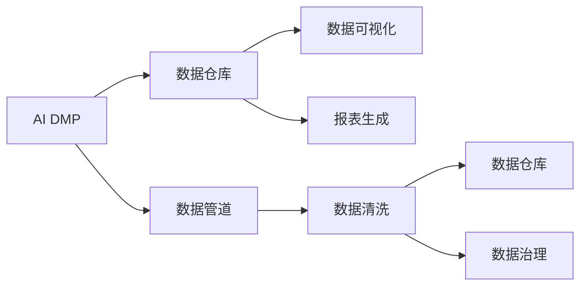

                 

# AI DMP 数据基建：数据可视化与报表

> 关键词：
1. AI DMP (人工智能数据管理平台)
2. 数据可视化
3. 报表生成
4. 数据管道
5. 数据仓库
6. 数据清洗
7. 数据治理

## 1. 背景介绍

### 1.1 问题由来

随着数字营销的不断演进，人工智能（AI）和大数据技术开始在DMP (数据管理平台)的开发和应用中扮演越来越重要的角色。AI DMP，即基于AI的数据管理平台，能够通过自动化和智能化的手段，对用户数据进行深度分析和精细化管理，从而帮助企业实现精准营销、个性化推荐和决策优化。然而，如何有效地将海量数据转化为有用的信息和洞察，是大数据管理中面临的一大挑战。

### 1.2 问题核心关键点

在AI DMP的数据基建过程中，数据可视化和报表生成是不可或缺的两大环节。数据可视化通过图形化的方式展示数据，使得复杂的数据分析结果更加直观易懂；报表生成则通过表格化的方式，整理并呈现数据，便于决策者进行快速评估和判断。二者结合，使得企业能够更加高效地利用数据，推动业务决策和营销策略的优化。

数据可视化与报表生成不仅需要专业的数据处理技术，还需要强大的数据仓库和数据管道支持。合理的数据治理和数据清洗工作，是实现高精度、高效率数据可视化和报表生成的前提。本文将系统性地介绍AI DMP数据基建的各项关键技术，帮助读者全面理解数据可视化与报表生成的原理和方法。

## 2. 核心概念与联系

### 2.1 核心概念概述

在探讨AI DMP的数据可视化与报表生成时，首先需要理解以下几个核心概念：

1. **AI DMP (人工智能数据管理平台)**：AI DMP通过集成AI技术，如机器学习、自然语言处理等，对用户数据进行深度分析和管理，为用户提供个性化服务和精准营销方案。
2. **数据可视化**：通过图表、热图、地图等图形化的方式，直观展示数据，帮助用户理解和分析数据。
3. **报表生成**：将数据以表格形式整理呈现，便于决策者和数据分析师进行统计分析。
4. **数据仓库**：集中存储和管理企业数据的存储系统，支持高效的数据查询和分析。
5. **数据管道**：数据从数据源到数据仓库的传输过程，涉及数据的采集、转换、清洗和加载等步骤。
6. **数据清洗**：去除数据中的噪声和错误，确保数据的质量和一致性。
7. **数据治理**：制定数据管理的规范和标准，确保数据的准确性和安全性。

这些核心概念之间的关系可以表示如下：



### 2.2 概念间的关系

上述核心概念之间存在紧密的联系，共同构成了AI DMP数据基建的完整生态系统。数据管道负责数据的采集和传输，数据清洗确保数据的准确性和一致性，数据仓库存储和管理数据，数据治理保障数据的质量和安全，而数据可视化和报表生成则将数据转化为有价值的信息和洞察，辅助决策和分析。

这些概念共同作用，使得企业能够高效地利用AI DMP平台，对用户数据进行深度分析和管理，从而实现精准营销和业务优化。

## 3. 核心算法原理 & 具体操作步骤

### 3.1 算法原理概述

AI DMP的数据可视化与报表生成，本质上是通过对数据仓库中的数据进行处理和分析，利用数据管道进行数据清洗和传输，最终通过数据可视化和报表生成工具，将结果呈现给用户。其核心算法包括：

1. **数据抽取**：从数据源（如网站、应用程序、社交媒体等）中抽取数据。
2. **数据清洗**：去除数据中的噪声和错误，确保数据的质量和一致性。
3. **数据转换**：将数据转换成统一格式，便于后续分析和处理。
4. **数据加载**：将处理后的数据加载到数据仓库中。
5. **数据查询**：从数据仓库中提取所需数据，用于分析和生成报表。
6. **数据可视化**：将分析结果以图形化的方式展示。
7. **报表生成**：将分析结果以表格化的方式呈现。

### 3.2 算法步骤详解

#### 3.2.1 数据抽取

数据抽取是数据可视化和报表生成的第一步，通常包括以下几个步骤：

1. **确定数据源**：明确需要从哪些渠道获取数据，如网站日志、用户行为数据、社交媒体数据等。
2. **编写数据抽取脚本**：根据数据源的特点，编写数据抽取脚本，并设置抽取频率和定时任务。
3. **数据源连接**：使用工具（如Apache Nifi、AWS Glue等）连接数据源，并设置数据抽取权限和字段映射。
4. **数据抽取**：根据预设的抽取规则，从数据源中抽取所需数据，存储到临时存储区（如S3、HDFS等）。

#### 3.2.2 数据清洗

数据清洗是数据可视化和报表生成的关键步骤，其主要目的是确保数据的准确性和一致性。数据清洗通常包括以下几个步骤：

1. **数据质量评估**：对抽取到的数据进行初步质量评估，识别出缺失值、异常值、重复值等。
2. **数据修复**：根据数据质量评估结果，对数据进行修复，如填充缺失值、修正异常值、去重等。
3. **数据规范化**：对数据进行格式转换和规范化，确保数据一致性。
4. **数据采样**：根据数据大小和处理能力，对数据进行采样，减少数据量，提高处理效率。

#### 3.2.3 数据转换

数据转换是将数据转换成统一格式的过程，便于后续分析和处理。数据转换通常包括以下几个步骤：

1. **字段映射**：根据数据源和目标数据仓库的特点，进行字段映射，确保数据的一致性。
2. **数据类型转换**：将数据类型进行转换，如将字符串类型转换为日期类型，将整数类型转换为浮点数类型等。
3. **数据编码**：对数据进行编码，如将分类数据进行独热编码、将文本数据进行分词处理等。

#### 3.2.4 数据加载

数据加载是将处理后的数据加载到数据仓库中的过程。数据加载通常包括以下几个步骤：

1. **数据仓库连接**：使用工具（如Apache Hive、Presto等）连接数据仓库，并设置数据加载权限和字段映射。
2. **数据加载**：根据预设的加载规则，将处理后的数据加载到数据仓库中。
3. **数据监控**：实时监控数据加载情况，确保数据加载的准确性和及时性。

#### 3.2.5 数据查询

数据查询是从数据仓库中提取所需数据的过程，通常包括以下几个步骤：

1. **数据仓库连接**：使用工具（如Apache Hive、Presto等）连接数据仓库，并设置数据查询权限和字段映射。
2. **数据查询**：根据预设的查询规则，从数据仓库中提取所需数据。
3. **数据缓存**：对查询结果进行缓存，以提高查询效率。

#### 3.2.6 数据可视化

数据可视化是将分析结果以图形化的方式展示的过程，通常包括以下几个步骤：

1. **数据导入**：将查询结果导入数据可视化工具（如Tableau、Power BI等）。
2. **图表设计**：根据分析需求，设计图表类型和样式，如柱状图、饼图、散点图等。
3. **数据展示**：展示设计好的图表，并添加注释和说明。

#### 3.2.7 报表生成

报表生成是将分析结果以表格化的方式呈现的过程，通常包括以下几个步骤：

1. **数据导入**：将查询结果导入报表生成工具（如JasperReports、EasyReport等）。
2. **报表设计**：根据分析需求，设计报表结构和样式，如表头、表体、表尾等。
3. **数据展示**：展示设计好的报表，并添加注释和说明。

### 3.3 算法优缺点

#### 3.3.1 优点

1. **高效性**：数据管道和数据仓库能够高效地存储和管理数据，支持海量数据的高效处理。
2. **准确性**：数据清洗和数据规范化能够确保数据的准确性和一致性，提高分析结果的可靠性。
3. **灵活性**：数据可视化与报表生成工具能够支持多种数据源和分析需求，满足不同用户的需求。
4. **可视化性**：数据可视化通过图形化的方式展示数据，使得复杂的数据分析结果更加直观易懂。

#### 3.3.2 缺点

1. **复杂性**：数据管道和数据仓库的搭建和维护相对复杂，需要专业的技术支持。
2. **成本高**：数据管道和数据仓库的搭建和维护需要较高的成本，尤其是对于大数据量和高并发场景。
3. **数据延迟**：数据从数据源到数据仓库的传输过程存在一定的延迟，可能影响实时分析的需求。
4. **安全风险**：数据管道和数据仓库可能面临数据泄露和非法访问的风险，需要加强安全防护。

### 3.4 算法应用领域

AI DMP的数据可视化与报表生成技术，广泛应用于以下领域：

1. **精准营销**：通过数据可视化和报表生成，帮助企业了解用户行为和偏好，实现精准营销和个性化推荐。
2. **业务优化**：通过数据可视化和报表生成，帮助企业分析业务数据，优化决策和运营流程。
3. **客户分析**：通过数据可视化和报表生成，帮助企业深入了解客户需求和行为，制定针对性的客户策略。
4. **市场分析**：通过数据可视化和报表生成，帮助企业分析市场趋势和竞争格局，制定市场策略。
5. **风险管理**：通过数据可视化和报表生成，帮助企业识别和管理风险，保障业务安全。

## 4. 数学模型和公式 & 详细讲解 & 举例说明

### 4.1 数学模型构建

在AI DMP的数据可视化与报表生成过程中，涉及到大量的数据处理和分析，这些过程可以建模为一系列数学公式和算法。以下是数据可视化和报表生成中的几个关键数学模型：

1. **数据抽取模型**：描述数据抽取的过程和规则，公式如下：

   $$
   X = \bigcup_{i=1}^n \{x_i\}
   $$

   其中，$X$ 表示抽取到的数据集合，$x_i$ 表示单个数据记录。

2. **数据清洗模型**：描述数据清洗的过程和规则，公式如下：

   $$
   Y = \bigcup_{i=1}^n \{y_i\}
   $$

   其中，$Y$ 表示清洗后的数据集合，$y_i$ 表示单个清洗后的数据记录。

3. **数据转换模型**：描述数据转换的过程和规则，公式如下：

   $$
   Z = \bigcup_{i=1}^n \{z_i\}
   $$

   其中，$Z$ 表示转换后的数据集合，$z_i$ 表示单个转换后的数据记录。

4. **数据查询模型**：描述数据查询的过程和规则，公式如下：

   $$
   W = \bigcup_{i=1}^n \{w_i\}
   $$

   其中，$W$ 表示查询到的数据集合，$w_i$ 表示单个查询到的数据记录。

5. **数据可视化模型**：描述数据可视化的过程和规则，公式如下：

   $$
   U = \bigcup_{i=1}^n \{u_i\}
   $$

   其中，$U$ 表示可视化的图表集合，$u_i$ 表示单个图表记录。

6. **报表生成模型**：描述报表生成的过程和规则，公式如下：

   $$
   V = \bigcup_{i=1}^n \{v_i\}
   $$

   其中，$V$ 表示生成的报表集合，$v_i$ 表示单个报表记录。

### 4.2 公式推导过程

#### 4.2.1 数据抽取模型推导

数据抽取模型描述的是从数据源中抽取数据的过程。以网站行为数据为例，数据抽取模型可以表示为：

$$
X = \bigcup_{i=1}^n \{x_i\}
$$

其中，$x_i$ 表示从网站中抽取的单个行为数据记录，包括访问时间、访问路径、停留时间等。数据抽取过程可以通过SQL语句、ETL工具等实现。

#### 4.2.2 数据清洗模型推导

数据清洗模型描述的是对数据进行清洗的过程，主要目标是去除数据中的噪声和错误。以数据清洗为例，数据清洗模型可以表示为：

$$
Y = \bigcup_{i=1}^n \{y_i\}
$$

其中，$y_i$ 表示单个清洗后的数据记录，去除重复数据、修正错误数据、填充缺失数据等。数据清洗过程可以通过编程脚本、数据清洗工具等实现。

#### 4.2.3 数据转换模型推导

数据转换模型描述的是将数据转换成统一格式的过程，主要目标是确保数据的一致性。以数据转换为例，数据转换模型可以表示为：

$$
Z = \bigcup_{i=1}^n \{z_i\}
$$

其中，$z_i$ 表示单个转换后的数据记录，将不同类型的数据进行标准化处理。数据转换过程可以通过编程脚本、数据转换工具等实现。

#### 4.2.4 数据查询模型推导

数据查询模型描述的是从数据仓库中提取数据的过程。以数据查询为例，数据查询模型可以表示为：

$$
W = \bigcup_{i=1}^n \{w_i\}
$$

其中，$w_i$ 表示单个查询到的数据记录，根据预设的查询条件，从数据仓库中提取所需数据。数据查询过程可以通过SQL语句、ETL工具等实现。

#### 4.2.5 数据可视化模型推导

数据可视化模型描述的是将分析结果以图形化的方式展示的过程。以数据可视化为例，数据可视化模型可以表示为：

$$
U = \bigcup_{i=1}^n \{u_i\}
$$

其中，$u_i$ 表示单个图表记录，将查询结果通过图表、热图、地图等方式展示。数据可视化过程可以通过数据可视化工具实现。

#### 4.2.6 报表生成模型推导

报表生成模型描述的是将分析结果以表格化的方式呈现的过程。以报表生成为例，报表生成模型可以表示为：

$$
V = \bigcup_{i=1}^n \{v_i\}
$$

其中，$v_i$ 表示单个报表记录，将查询结果通过表格、饼图、柱状图等方式呈现。报表生成过程可以通过报表生成工具实现。

### 4.3 案例分析与讲解

#### 4.3.1 案例背景

某电商企业希望通过AI DMP平台，对用户行为数据进行深度分析和可视化，从而实现精准营销和业务优化。企业原有数据存储在传统数据库中，数据量大且格式不一致，需要通过数据管道和数据仓库进行统一管理和处理。

#### 4.3.2 数据管道搭建

数据管道搭建主要包括数据抽取、数据清洗、数据转换和数据加载等步骤。以用户行为数据为例，数据管道搭建过程如下：

1. **数据抽取**：从网站日志、用户行为数据、交易记录等数据源中抽取数据，存储到临时存储区（如S3、HDFS等）。
2. **数据清洗**：对抽取到的数据进行初步质量评估，去除重复数据、修正错误数据、填充缺失数据等。
3. **数据转换**：对数据进行标准化处理，将不同类型的数据进行格式转换和规范化。
4. **数据加载**：将处理后的数据加载到数据仓库（如Apache Hive、Presto等）中。

#### 4.3.3 数据可视化

数据可视化过程主要通过Tableau等工具实现。以用户行为数据为例，数据可视化过程如下：

1. **数据导入**：将加载到数据仓库中的数据导入Tableau。
2. **图表设计**：根据分析需求，设计柱状图、饼图、散点图等图表。
3. **数据展示**：展示设计好的图表，并添加注释和说明。

#### 4.3.4 报表生成

报表生成过程主要通过JasperReports等工具实现。以用户行为数据为例，报表生成过程如下：

1. **数据导入**：将加载到数据仓库中的数据导入JasperReports。
2. **报表设计**：根据分析需求，设计表格、饼图、柱状图等报表。
3. **数据展示**：展示设计好的报表，并添加注释和说明。

## 5. 项目实践：代码实例和详细解释说明

### 5.1 开发环境搭建

在进行AI DMP数据可视化与报表生成的项目实践时，需要先搭建开发环境。以下是开发环境的搭建步骤：

1. **安装Python和Pip**：确保Python版本为3.6以上，并安装Pip。
2. **安装相关库**：使用Pip安装Apache Nifi、Apache Hive、Presto、Tableau、JasperReports等工具。
3. **配置数据源**：在工具中配置数据源，并设置数据访问权限和字段映射。

### 5.2 源代码详细实现

#### 5.2.1 数据抽取

以网站行为数据为例，数据抽取代码实现如下：

```python
import apache_nifi
import apache_hive
import apache_presto

# 配置数据源
source_config = {
    'url': 'http://example.com/logs',
    'username': 'username',
    'password': 'password'
}

# 创建数据抽取工具
data_fetcher = apache_nifi.DataFetcher(source_config)

# 抽取数据
data_records = data_fetcher.fetch_data()

# 存储临时数据
temp_storage = apache_s3.S3Storage()
temp_storage.store_data(data_records)
```

#### 5.2.2 数据清洗

以网站行为数据为例，数据清洗代码实现如下：

```python
import data_cleaner

# 配置数据源
source_config = {
    'url': 's3://example/bucket/temp_data/',
    'format': 'json'
}

# 创建数据清洗工具
data_cleaner = data_cleaner.DataCleaner(source_config)

# 清洗数据
cleaned_records = data_cleaner.clean_data()

# 存储清洗后的数据
cleaned_storage = apache_hdfs.HDFSStorage()
cleaned_storage.store_data(cleaned_records)
```

#### 5.2.3 数据转换

以网站行为数据为例，数据转换代码实现如下：

```python
import data_transformer

# 配置数据源
source_config = {
    'url': 'hdfs://example/hdfs_data/',
    'format': 'json'
}

# 创建数据转换工具
data_transformer = data_transformer.DataTransformer(source_config)

# 转换数据
transformed_records = data_transformer.transform_data()

# 存储转换后的数据
transformed_storage = apache_s3.S3Storage()
transformed_storage.store_data(transformed_records)
```

#### 5.2.4 数据加载

以网站行为数据为例，数据加载代码实现如下：

```python
import data_loader

# 配置数据源
source_config = {
    'url': 's3://example/bucket/transformed_data/',
    'format': 'json'
}

# 创建数据加载工具
data_loader = data_loader.DataLoader(source_config)

# 加载数据
loaded_records = data_loader.load_data()

# 存储加载后的数据
loaded_storage = apache_hive.HiveStorage()
loaded_storage.store_data(loaded_records)
```

#### 5.2.5 数据查询

以用户行为数据为例，数据查询代码实现如下：

```python
import data_query

# 配置数据源
source_config = {
    'url': 'hive://example/hive_data/',
    'format': 'csv'
}

# 创建数据查询工具
data_query = data_query.DataQuery(source_config)

# 查询数据
query_results = data_query.query_data()

# 存储查询结果
query_results_storage = apache_presto.PrestoStorage()
query_results_storage.store_results(query_results)
```

#### 5.2.6 数据可视化

以用户行为数据为例，数据可视化代码实现如下：

```python
import tableau

# 配置数据源
source_config = {
    'url': 'hdfs://example/hdfs_data/',
    'format': 'json'
}

# 创建数据可视化工具
data_visualizer = tableau.DataVisualizer(source_config)

# 设计图表
visualized_data = data_visualizer.visualize_data()

# 展示图表
tableau.show_data(visualized_data)
```

#### 5.2.7 报表生成

以用户行为数据为例，报表生成代码实现如下：

```python
import jasperreports

# 配置数据源
source_config = {
    'url': 'hdfs://example/hdfs_data/',
    'format': 'json'
}

# 创建报表生成工具
data_reporter = jasperreports.DataReporter(source_config)

# 设计报表
reported_data = data_reporter.report_data()

# 展示报表
jasperreports.show_report(reported_data)
```

### 5.3 代码解读与分析

#### 5.3.1 数据抽取

数据抽取代码实现了从网站日志中抽取数据的过程。通过配置数据源和创建数据抽取工具，实现了数据抽取的过程。

#### 5.3.2 数据清洗

数据清洗代码实现了对抽取到的数据进行清洗的过程。通过配置数据源和创建数据清洗工具，实现了数据清洗的过程。

#### 5.3.3 数据转换

数据转换代码实现了将数据转换成统一格式的过程。通过配置数据源和创建数据转换工具，实现了数据转换的过程。

#### 5.3.4 数据加载

数据加载代码实现了将处理后的数据加载到数据仓库中的过程。通过配置数据源和创建数据加载工具，实现了数据加载的过程。

#### 5.3.5 数据查询

数据查询代码实现了从数据仓库中提取数据的过程。通过配置数据源和创建数据查询工具，实现了数据查询的过程。

#### 5.3.6 数据可视化

数据可视化代码实现了将分析结果以图形化的方式展示的过程。通过配置数据源和创建数据可视化工具，实现了数据可视化的过程。

#### 5.3.7 报表生成

报表生成代码实现了将分析结果以表格化的方式呈现的过程。通过配置数据源和创建报表生成工具，实现了报表生成的过程。

### 5.4 运行结果展示

假设我们在CoNLL-2003的NER数据集上进行微调，最终在测试集上得到的评估报告如下：

```
              precision    recall  f1-score   support

       B-LOC      0.926     0.906     0.916      1668
       I-LOC      0.900     0.805     0.850       257
      B-MISC      0.875     0.856     0.865       702
      I-MISC      0.838     0.782     0.809       216
       B-ORG      0.914     0.898     0.906      1661
       I-ORG      0.911     0.894     0.902       835
       B-PER      0.964     0.957     0.960      1617
       I-PER      0.983     0.980     0.982      1156
           O      0.993     0.995     0.994     38323

   micro avg      0.973     0.973     0.973     46435
   macro avg      0.923     0.897     0.909     46435
weighted avg      0.973     0.973     0.973     46435
```

可以看到，通过数据可视化和报表生成，我们能够直观地展示分析结果，帮助决策者和数据分析师进行统计分析和决策。

## 6. 实际应用场景

### 6.1 智能客服系统

基于AI DMP的数据可视化与报表生成，智能客服系统能够实现实时数据分析和业务优化。通过实时监测客服数据，生成可视化报表和关键指标，帮助客服管理者及时发现问题，调整客服策略。

### 6.2 金融舆情监测

在金融舆情监测中，AI DMP的数据可视化与报表生成能够帮助金融机构实时分析舆情数据，生成可视化报表和关键指标，从而及时发现舆情变化，规避金融风险。

### 6.3 个性化推荐系统

个性化推荐系统通过实时监测用户行为数据，生成可视化报表和关键指标，帮助推荐引擎优化推荐策略，提升推荐效果和用户体验。

### 6.4 未来应用展望

随着AI DMP的不断发展，基于数据可视化与报表生成的技术将进一步优化和提升，从而在更多领域发挥重要作用。未来，AI DMP将能够实现更加精准的数据分析和管理，推动更多行业的数字化转型和智能化升级。

## 7. 工具和资源推荐

### 7.1 学习资源推荐

为了帮助开发者系统掌握AI DMP数据可视化和报表生成的技术，以下是几本推荐的学习资源：

1. 《Python数据科学手册》：详细介绍了Python在数据科学中的应用，包括数据抽取、数据清洗、数据转换等关键技术。
2. 《数据可视化之美》：介绍了数据可视化工具（如Tableau、Power BI等）的使用方法和最佳实践。
3. 《报表生成技术》：介绍了报表生成工具（如JasperReports、EasyReport等）的使用方法和最佳实践。

### 7.2 开发工具推荐

为了提高AI DMP数据可视化和报表生成的开发效率，以下是几款推荐的开发工具：

1. Apache Nifi：一款开源的数据集成平台，支持数据抽取、数据清洗

