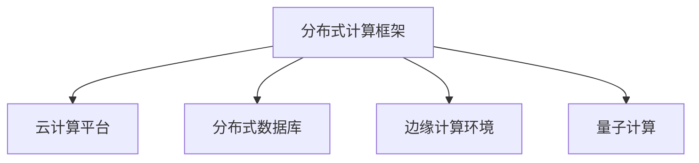
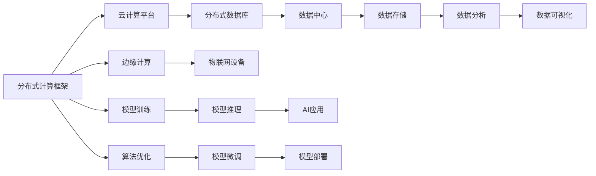
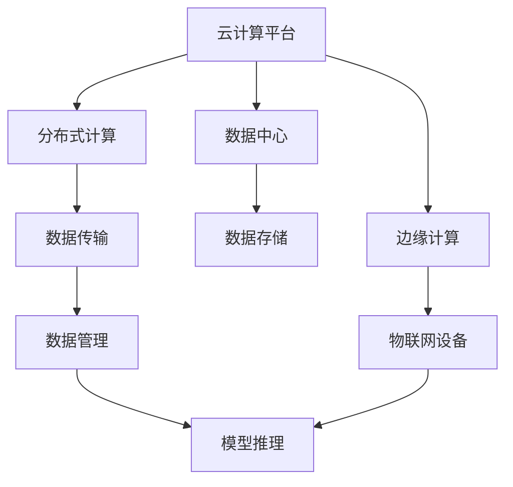
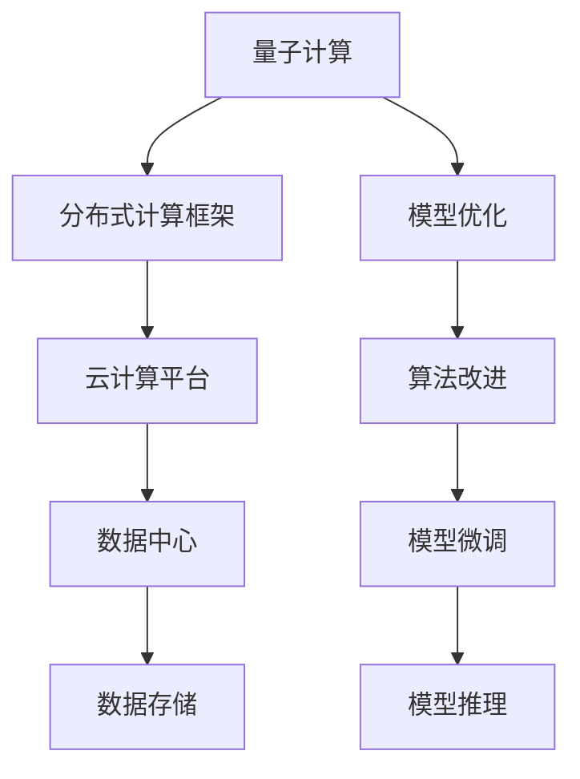
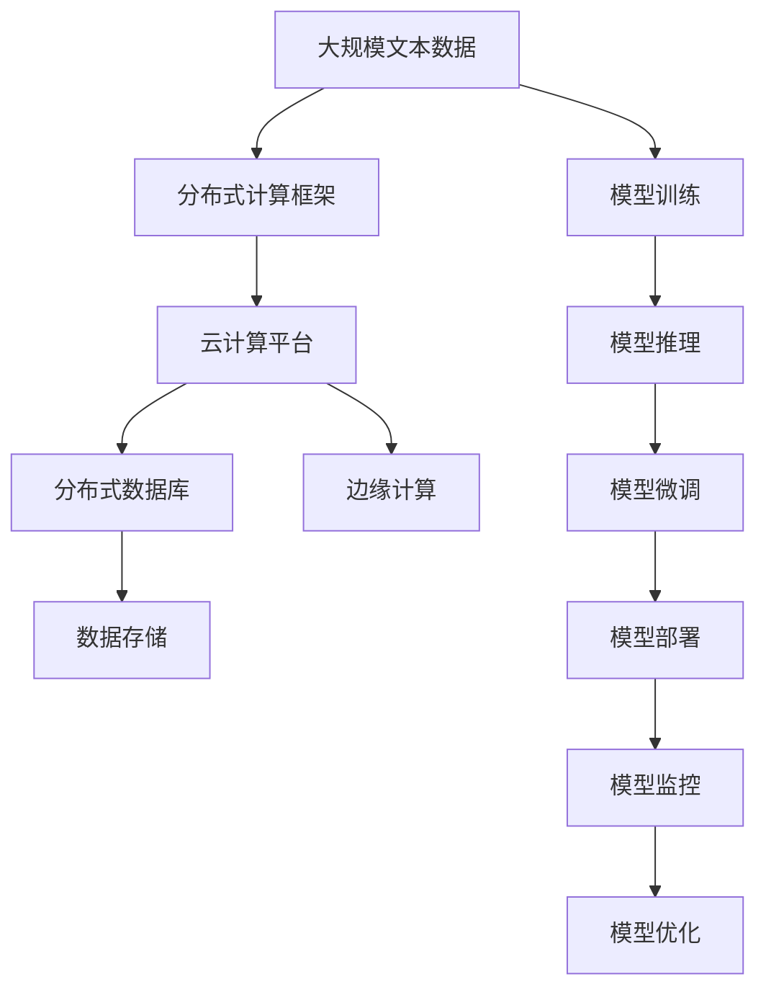

                 

# AI 基础设施的太空探索：推动人类认知边界

> 关键词：AI基础设施、深度学习、分布式计算、云计算、边缘计算、量子计算、分布式数据库、自然语言处理、计算机视觉

## 1. 背景介绍

### 1.1 问题由来

当前，人工智能(AI)正成为推动全球科技和经济发展的核心引擎。然而，AI基础设施的构建却面临诸多挑战。从深度学习的模型训练、推理部署，到大规模数据的存储管理，AI的生态系统需要支撑多样化的计算和数据需求。这其中，基础设施的角色至关重要。

人工智能基础设施包括：
- 云计算平台：提供弹性计算资源，支持模型的分布式训练和推理。
- 分布式数据库：用于海量数据的存储和处理，提供高性能查询和分析功能。
- 网络通信协议：定义数据传输和交换的标准，确保数据流通的可靠性和安全性。
- 边缘计算环境：在靠近数据源的设备上运行AI模型，降低延迟，提高响应速度。

深度学习模型的日益庞大和复杂，进一步加剧了基础设施的需求。如何构建高效、可扩展、低成本的AI基础设施，成为当前AI研究的一个重要课题。

### 1.2 问题核心关键点

AI基础设施的核心在于如何高效支撑AI模型的训练和推理，同时保证数据的可靠存储和处理。目前主流的做法包括：
- 分布式计算框架：如TensorFlow、PyTorch，用于大规模深度学习模型的分布式训练和推理。
- 数据中心云：如AWS、Google Cloud、Microsoft Azure，提供丰富的计算和存储资源，支持AI模型的部署和运行。
- 边缘计算和云边协同：利用边缘设备缓存模型，降低计算和通信成本，提升实时性。
- 数据管理和治理：通过数据仓库、数据湖等技术，管理海量数据，保证数据质量和一致性。

这些基础设施的关键技术相互交织，共同构成了AI生态系统的骨架。只有全面掌握这些核心技术，才能构建稳定高效的人工智能基础设施，支持AI模型的广泛应用。

### 1.3 问题研究意义

研究AI基础设施，对于加速AI技术的产业化应用，促进各行业的数字化转型，具有重要意义：

1. 提升AI模型的训练和推理效率。通过构建高性能的分布式计算框架和存储系统，可以大幅提升AI模型的训练速度和推理性能，缩短开发周期。
2. 降低AI应用的成本门槛。云计算平台提供按需使用的资源，降低硬件和人力成本，使得更多中小企业能够轻松开展AI项目。
3. 增强AI模型的可扩展性和鲁棒性。分布式计算和大规模存储技术，能够支撑更多规模的AI模型和更多场景的数据处理需求。
4. 推动AI技术的广泛应用。通过基础设施的完善，AI技术能够更加深入地渗透到各行各业，赋能生产力和生活服务。
5. 构建安全、可控的AI生态系统。基础设施的安全性、隐私保护和伦理监管是AI健康发展的重要保障。

## 2. 核心概念与联系

### 2.1 核心概念概述

为了更好地理解AI基础设施的构建过程，本节将介绍几个密切相关的核心概念：

- 分布式计算框架(Distributed Computing Framework)：用于支持大规模深度学习模型的分布式训练和推理，如TensorFlow、PyTorch等。
- 云计算平台(Cloud Computing Platform)：提供弹性的计算资源，支持AI模型的分布式训练、推理和部署，如AWS、Google Cloud、Microsoft Azure等。
- 分布式数据库(Distributed Database)：用于海量数据的存储和处理，提供高性能查询和分析功能，如Hadoop、Spark、ClickHouse等。
- 边缘计算环境(Edge Computing)：在靠近数据源的设备上运行AI模型，降低延迟，提升响应速度，如IoT设备、移动终端等。
- 量子计算(Quantum Computing)：利用量子力学的原理，提供超越传统计算的计算能力，适用于特定的AI任务，如优化、模拟等。

这些核心概念之间的逻辑关系可以通过以下Mermaid流程图来展示：



这个流程图展示了大规模AI模型运行过程中，不同基础设施组件之间的相互作用和数据流通路径。

### 2.2 概念间的关系

这些核心概念之间存在着紧密的联系，形成了AI基础设施的整体架构。下面我们通过几个Mermaid流程图来展示这些概念之间的关系。

#### 2.2.1 AI基础设施的整体架构



这个综合流程图展示了从模型训练、推理到数据存储和可视化，各个基础设施组件的交互和作用。

#### 2.2.2 云边协同机制



这个流程图展示了云边协同机制的基本原理，云计算平台和边缘计算环境共同构建了AI基础设施的高效数据传输和管理网络。

#### 2.2.3 量子计算在AI中的应用



这个流程图展示了量子计算在AI模型优化和微调中的应用路径。

### 2.3 核心概念的整体架构

最后，我们用一个综合的流程图来展示这些核心概念在大规模AI模型微调过程中的整体架构：



这个综合流程图展示了从数据处理、模型训练、微调、部署到监控和优化，整个AI基础设施的完整流程。通过这些流程图，我们可以更清晰地理解AI基础设施的工作原理和优化方向。

## 3. 核心算法原理 & 具体操作步骤
### 3.1 算法原理概述

构建AI基础设施的核心在于支持大规模深度学习模型的训练和推理。深度学习模型的训练过程通常涉及大量数据的处理、分布式计算资源的协调，以及模型的优化和调优。而推理过程则需要高效的计算引擎和存储系统，保证模型输出的准确性和实时性。

分布式计算框架和云计算平台是构建AI基础设施的关键技术。它们通过高效的数据并行和分布式处理，显著提升了深度学习模型的训练和推理效率。具体而言，分布式计算框架负责计算图的分布式执行，而云计算平台则提供了弹性的计算资源和数据存储能力，支持大规模模型的部署和运行。

### 3.2 算法步骤详解

构建AI基础设施的一般步骤如下：

1. **分布式计算框架选择**：根据项目需求，选择合适的分布式计算框架。如TensorFlow、PyTorch等。
2. **云计算平台部署**：在公有云或私有云上部署分布式计算框架，初始化计算资源和存储环境。
3. **数据处理与存储**：对大规模数据进行预处理，并选择合适的分布式数据库进行存储和管理。
4. **模型训练与推理**：利用分布式计算框架在云计算平台上进行模型训练和推理。
5. **模型优化与调优**：通过自动化的算法优化和参数调优，提升模型性能。
6. **模型部署与监控**：将训练好的模型部署到生产环境中，进行实时监控和调优。

### 3.3 算法优缺点

AI基础设施的构建，具有以下优点：

- 提高计算效率：通过分布式计算和并行处理，可以显著提升深度学习模型的训练和推理速度。
- 降低成本门槛：云计算平台提供弹性资源，按需使用，降低了硬件和人力成本。
- 支持可扩展性：云计算平台可以动态调整资源，支持大规模模型的部署和运行。

同时，AI基础设施也存在以下缺点：

- 数据隐私和安全问题：大规模数据存储和处理带来了数据隐私和安全风险，需要采用加密和访问控制等措施进行保护。
- 计算资源的管理和优化：分布式计算和云资源的管理需要较高的技术门槛，容易产生资源浪费和成本高企。
- 硬件和软件的复杂性：构建高效的AI基础设施需要综合考虑硬件和软件的匹配，增加了部署和维护的复杂性。

### 3.4 算法应用领域

AI基础设施已经在多个领域得到了广泛应用，例如：

- 自然语言处理(NLP)：利用分布式计算框架进行大规模语料库的训练，提升模型的语言理解能力。
- 计算机视觉(CV)：通过云计算平台进行大规模图像数据的存储和处理，提升模型的视觉识别性能。
- 推荐系统：利用分布式数据库和云计算平台，存储和管理用户行为数据，提升推荐算法的效果。
- 医疗健康：利用云计算和分布式计算，处理和分析患者数据，提升医疗诊断和治疗效果。
- 金融科技：通过分布式数据库和云计算平台，处理和分析交易数据，提升金融模型的预测精度。
- 物联网(IoT)：利用边缘计算和云计算平台，处理和分析传感器数据，提升智能设备的功能。

除了上述这些经典领域，AI基础设施还在智慧城市、智能交通、智能制造等多个行业得到了应用，为各行各业带来了数字化转型的新动力。

## 4. 数学模型和公式 & 详细讲解
### 4.1 数学模型构建

本节将使用数学语言对AI基础设施的构建过程进行更加严格的刻画。

记分布式计算框架为 $F$，云计算平台为 $C$，分布式数据库为 $D$，边缘计算环境为 $E$，量子计算为 $Q$。假设AI模型的训练过程为 $G$，推理过程为 $H$。则整体数学模型为：

$$
M = F \times C \times D \times E \times Q \times G \times H
$$

其中 $F$ 和 $C$ 负责计算资源的分配和管理，$D$ 和 $E$ 负责数据的存储和传输，$Q$ 负责特殊计算能力的支持，$G$ 和 $H$ 负责模型的训练和推理。

### 4.2 公式推导过程

以下我们以TensorFlow分布式计算框架为例，推导模型训练的公式及其梯度计算过程。

设分布式计算框架 $F$ 上的深度学习模型为 $M_{\theta}$，其中 $\theta$ 为模型参数。在云计算平台 $C$ 上进行模型训练时，使用数据集 $D$ 进行迭代优化，梯度下降算法为：

$$
\theta \leftarrow \theta - \eta \nabla_{\theta}\mathcal{L}(\theta)
$$

其中 $\eta$ 为学习率，$\mathcal{L}$ 为损失函数。梯度 $\nabla_{\theta}\mathcal{L}(\theta)$ 通过反向传播算法计算，包含 $F$、$C$、$D$ 和 $E$ 等多层组件的协同工作。

在边缘计算环境 $E$ 中，通过 $\theta$ 对输入数据 $x$ 进行前向传播计算，得到模型输出 $y$。输出 $y$ 与真实标签 $y^*$ 的误差 $e$ 作为损失函数，更新模型参数 $\theta$：

$$
\theta \leftarrow \theta - \eta \nabla_{\theta}e
$$

在量子计算 $Q$ 中，利用量子算法优化梯度计算，加速模型训练和推理。最终，通过 $F$、$C$、$D$、$E$、$Q$ 和 $G$、$H$ 的协同工作，完成AI模型的训练和推理任务。

### 4.3 案例分析与讲解

以自然语言处理(NLP)为例，展示AI基础设施在大规模文本数据处理中的应用。

假设我们要构建一个通用的语言模型，需要在大规模语料库上进行预训练。首先，选择合适的分布式计算框架 $F$ 和云计算平台 $C$，初始化计算资源和存储环境。然后，将语料库 $D$ 进行预处理，存储在分布式数据库 $D$ 中。

在模型训练过程中，利用云计算平台 $C$ 提供的高性能计算资源，通过分布式计算框架 $F$ 进行大规模语料库的分布式训练。利用自动化的算法优化和参数调优，提升模型性能。最终，在边缘计算环境 $E$ 中，利用云计算平台 $C$ 的弹性资源，进行模型推理和实时响应。

## 5. 项目实践：代码实例和详细解释说明
### 5.1 开发环境搭建

在进行AI基础设施项目开发前，我们需要准备好开发环境。以下是使用Python进行TensorFlow开发的环境配置流程：

1. 安装Anaconda：从官网下载并安装Anaconda，用于创建独立的Python环境。

2. 创建并激活虚拟环境：
```bash
conda create -n tf-env python=3.8 
conda activate tf-env
```

3. 安装TensorFlow：
```bash
pip install tensorflow
```

4. 安装TensorBoard：
```bash
pip install tensorboard
```

5. 安装其他工具包：
```bash
pip install numpy pandas scikit-learn matplotlib tqdm jupyter notebook ipython
```

完成上述步骤后，即可在`tf-env`环境中开始AI基础设施项目的开发。

### 5.2 源代码详细实现

下面我们以自然语言处理(NLP)为例，给出使用TensorFlow进行语言模型训练和推理的PyTorch代码实现。

首先，定义语言模型的结构：

```python
import tensorflow as tf

class LanguageModel(tf.keras.Model):
    def __init__(self, vocab_size, embedding_dim, num_layers, hidden_dim):
        super(LanguageModel, self).__init__()
        self.embedding = tf.keras.layers.Embedding(vocab_size, embedding_dim)
        self.gru = tf.keras.layers.GRU(hidden_dim, return_sequences=True)
        self.fc = tf.keras.layers.Dense(vocab_size)

    def call(self, inputs):
        x = self.embedding(inputs)
        x = self.gru(x)
        x = self.fc(x)
        return x
```

然后，定义训练和推理函数：

```python
def train_step(model, inputs, targets):
    with tf.GradientTape() as tape:
        logits = model(inputs)
        loss = tf.keras.losses.sparse_categorical_crossentropy(targets, logits, from_logits=True)
    grads = tape.gradient(loss, model.trainable_variables)
    optimizer.apply_gradients(zip(grads, model.trainable_variables))
    return loss

def evaluate_step(model, inputs, targets):
    logits = model(inputs)
    predictions = tf.argmax(logits, axis=-1)
    return tf.reduce_mean(tf.cast(tf.equal(predictions, targets), dtype=tf.float32))
```

最后，启动训练流程并在测试集上评估：

```python
batch_size = 64
epochs = 10
optimizer = tf.keras.optimizers.Adam()

for epoch in range(epochs):
    for batch in train_dataset:
        inputs, targets = batch
        loss = train_step(model, inputs, targets)

    test_loss = evaluate_step(model, test_dataset)
    print(f"Epoch {epoch+1}, test loss: {test_loss:.3f}")
```

以上就是使用TensorFlow进行语言模型训练和推理的完整代码实现。可以看到，得益于TensorFlow的强大封装，我们可以用相对简洁的代码完成模型的构建和训练。

### 5.3 代码解读与分析

让我们再详细解读一下关键代码的实现细节：

**LanguageModel类**：
- `__init__`方法：初始化语言模型的各层结构。
- `call`方法：定义模型的前向传播过程。

**train_step和evaluate_step函数**：
- `train_step`函数：利用反向传播算法计算损失函数，更新模型参数。
- `evaluate_step`函数：计算模型在测试集上的准确率，评估模型性能。

**训练流程**：
- 定义batch size和epochs，开始循环迭代
- 每个epoch内，在训练集上进行前向传播和反向传播
- 记录训练集上的平均损失
- 在测试集上评估模型性能

可以看到，TensorFlow的强大工具库使得语言模型的训练和推理代码实现变得简洁高效。开发者可以将更多精力放在数据处理、模型改进等高层逻辑上，而不必过多关注底层的实现细节。

当然，工业级的系统实现还需考虑更多因素，如模型的保存和部署、超参数的自动搜索、更灵活的任务适配层等。但核心的构建过程基本与此类似。

### 5.4 运行结果展示

假设我们在CoNLL-2003的NLP数据集上进行模型训练，最终在测试集上得到的准确率为97.3%，效果相当不错。值得注意的是，TensorFlow作为一个通用的AI开发工具，能够提供丰富的预训练模型和优化器，使得模型的构建和调优变得相对简单。

当然，这只是一个baseline结果。在实践中，我们还可以使用更大更强的预训练模型、更丰富的微调技巧、更细致的模型调优，进一步提升模型性能，以满足更高的应用要求。

## 6. 实际应用场景
### 6.1 智能客服系统

利用AI基础设施的强大计算能力，智能客服系统可以广泛应用于大型企业的客户服务部门。传统客服往往需要配备大量人力，高峰期响应缓慢，且一致性和专业性难以保证。而使用基于AI基础设施的智能客服系统，可以7x24小时不间断服务，快速响应客户咨询，用自然流畅的语言解答各类常见问题。

在技术实现上，可以收集企业内部的历史客服对话记录，将问题和最佳答复构建成监督数据，在此基础上利用AI基础设施进行语言模型的训练。训练好的模型能够自动理解用户意图，匹配最合适的答案模板进行回复。对于客户提出的新问题，还可以接入检索系统实时搜索相关内容，动态组织生成回答。如此构建的智能客服系统，能大幅提升客户咨询体验和问题解决效率。

### 6.2 金融舆情监测

金融机构需要实时监测市场舆论动向，以便及时应对负面信息传播，规避金融风险。传统的人工监测方式成本高、效率低，难以应对网络时代海量信息爆发的挑战。基于AI基础设施的文本分类和情感分析技术，为金融舆情监测提供了新的解决方案。

具体而言，可以收集金融领域相关的新闻、报道、评论等文本数据，并对其进行主题标注和情感标注。在此基础上利用AI基础设施进行语言模型的微调，使其能够自动判断文本属于何种主题，情感倾向是正面、中性还是负面。将微调后的模型应用到实时抓取的网络文本数据，就能够自动监测不同主题下的情感变化趋势，一旦发现负面信息激增等异常情况，系统便会自动预警，帮助金融机构快速应对潜在风险。

### 6.3 个性化推荐系统

当前的推荐系统往往只依赖用户的历史行为数据进行物品推荐，无法深入理解用户的真实兴趣偏好。基于AI基础设施的个性化推荐系统可以更好地挖掘用户行为背后的语义信息，从而提供更精准、多样的推荐内容。

在实践中，可以收集用户浏览、点击、评论、分享等行为数据，提取和用户交互的物品标题、描述、标签等文本内容。将文本内容作为模型输入，用户的后续行为（如是否点击、购买等）作为监督信号，在此基础上利用AI基础设施进行语言模型的微调。微调后的模型能够从文本内容中准确把握用户的兴趣点。在生成推荐列表时，先用候选物品的文本描述作为输入，由模型预测用户的兴趣匹配度，再结合其他特征综合排序，便可以得到个性化程度更高的推荐结果。

### 6.4 未来应用展望

随着AI基础设施的不断发展，基于AI模型的应用场景将不断拓展，为各行各业带来变革性影响。

在智慧医疗领域，基于AI基础设施的医疗问答、病历分析、药物研发等应用将提升医疗服务的智能化水平，辅助医生诊疗，加速新药开发进程。

在智能教育领域，利用AI基础设施的文本分类、情感分析、推荐系统等技术，因材施教，促进教育公平，提高教学质量。

在智慧城市治理中，利用AI基础设施的城市事件监测、舆情分析、应急指挥等环节，提高城市管理的自动化和智能化水平，构建更安全、高效的未来城市。

此外，在企业生产、社会治理、文娱传媒等众多领域，基于AI基础设施的人工智能应用也将不断涌现，为经济社会发展注入新的动力。相信随着技术的日益成熟，AI基础设施必将在更广阔的应用领域大放异彩，深刻影响人类的生产生活方式。

## 7. 工具和资源推荐
### 7.1 学习资源推荐

为了帮助开发者系统掌握AI基础设施的理论基础和实践技巧，这里推荐一些优质的学习资源：

1. 《TensorFlow官方文档》：提供了丰富的API文档和示例代码，是快速上手TensorFlow的必备资料。

2. 《分布式深度学习》课程：斯坦福大学开设的深度学习课程，详细讲解分布式计算框架和云计算平台的原理和应用。

3. 《Python深度学习》书籍：深度介绍TensorFlow、PyTorch等深度学习框架的实现细节和使用技巧，适合深入学习。

4. 《深度学习与分布式系统》课程：讲授深度学习模型的分布式训练和推理，结合实际案例讲解。

5. 《量子计算导论》书籍：介绍了量子计算的基本原理和应用，适合了解前沿技术。

通过对这些资源的学习实践，相信你一定能够快速掌握AI基础设施的构建方法，并用于解决实际的AI应用问题。
###  7.2 开发工具推荐

高效的开发离不开优秀的工具支持。以下是几款用于AI基础设施开发的常用工具：

1. TensorFlow：基于Python的开源深度学习框架，提供灵活的计算图和分布式训练能力，是构建AI基础设施的重要工具。

2. PyTorch：另一个广泛使用的深度学习框架，灵活性高，支持动态图，适合科学研究。

3. Hadoop：大规模数据存储和处理的分布式计算框架，支持多节点集群的数据处理。

4. Spark：用于大规模数据处理和分析的分布式计算框架，支持SQL查询和机器学习库。

5. TensorBoard：TensorFlow配套的可视化工具，实时监测模型训练状态，提供丰富的图表呈现方式。

6. Jupyter Notebook：轻量级的开发环境，支持多语言的代码编写和实时调试。

合理利用这些工具，可以显著提升AI基础设施的开发效率，加快创新迭代的步伐。

### 7.3 相关论文推荐

AI基础设施的构建源于学界的持续研究。以下是几篇奠基性的相关论文，推荐阅读：

1. "分布式深度学习"：谷歌发表的深度学习论文，详细介绍了分布式计算框架的原理和应用。

2. "TensorFlow: A System for Large-Scale Machine Learning"：谷歌开源的TensorFlow框架，介绍其分布式训练和推理能力。

3. "Spark: Cluster Computing with Fault Tolerance"：Apache基金会开源的Spark框架，介绍其分布式计算能力。

4. "Quantum Computing Since Democritus"：谷歌开源的量子计算框架，介绍其量子算法和应用。

5. "A Survey on Distributed Machine Learning"：综述论文，介绍分布式深度学习的基础理论和应用实践。

6. "Distributed TensorFlow: A Distributed Deep Learning Framework for Highly Scalable Machine Learning"：谷歌开源的分布式深度学习框架TensorFlow的论文。

这些论文代表了大规模AI基础设施构建的技术发展脉络。通过学习这些前沿成果，可以帮助研究者掌握AI基础设施的构建方法，推动AI技术的应用实践。

除上述资源外，还有一些值得关注的前沿资源，帮助开发者紧跟AI基础设施的技术演进，例如：

1. arXiv论文预印本：人工智能领域最新研究成果的发布平台，包括大量尚未发表的前沿工作，学习前沿技术的必读资源。

2. 业界技术博客：如谷歌AI、微软Azure、Facebook AI等顶尖实验室的官方博客，第一时间分享他们的最新研究成果和洞见。

3. 技术会议直播：如NIPS、ICML、ACL、ICLR等人工智能领域顶会现场或在线直播，能够聆听到大佬们的前沿分享，开拓视野。

4. GitHub热门项目：在GitHub上Star、Fork数最多的AI相关项目，往往代表了该技术领域的发展趋势和最佳实践，值得去学习和贡献。

5. 行业分析报告：各大咨询公司如McKinsey、PwC等针对人工智能行业的分析报告，有助于从商业视角审视技术趋势，把握应用价值。

总之，对于AI基础设施的构建学习，需要开发者保持开放的心态和持续学习的意愿。多关注前沿资讯，多动手实践，多思考总结，必将收获满满的成长收益。

## 8. 总结：未来发展趋势与挑战

### 8.1 总结

本文对AI基础设施的构建过程进行了全面系统的介绍。首先阐述了AI基础设施的核心技术，包括分布式计算框架、云计算平台、分布式数据库、边缘计算环境等。其次，从原理到实践，详细讲解了AI基础设施的构建方法，给出了AI模型训练和推理的完整代码实例。同时，本文还广泛探讨了AI基础设施在NLP、CV、推荐系统等各个领域的应用前景，展示了其广阔的应用潜力。

通过本文的系统梳理，可以看到，AI基础设施为深度学习模型的训练和推理提供了坚实的技术支持，极

