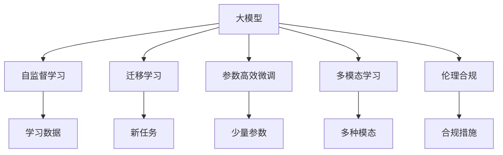

                 

# AI 大模型创业：如何利用未来优势？

> 关键词：大模型创业,未来优势,算法选择,模型优化,落地应用,伦理合规

## 1. 背景介绍

### 1.1 问题由来

近年来，人工智能（AI）技术迅速发展，大模型因其强大的语义理解能力和泛化能力，在NLP、图像识别、自然语言处理（NLP）等诸多领域取得了显著成就。特别是大语言模型，如GPT-3、BERT等，不仅展示了卓越的性能，还推动了AI技术的产业化进程。

但大模型的商业化之路并不容易，既需要技术实力，也需要市场洞察力和商业运营能力。如何利用这些未来优势，进行大模型创业，是许多创业者和研究者关注的焦点。本文将从大模型的未来优势出发，深入探讨如何在大模型创业中充分利用这些优势，以期为创业者和投资者提供参考。

### 1.2 问题核心关键点

大模型的未来优势主要体现在以下几个方面：

1. **高扩展性**：大模型可以随着数据和算力的增长而不断扩展，支持更复杂的任务和更深入的推理。
2. **多模态支持**：大模型不仅支持文本，还可以处理图像、音频等多模态数据，拓展应用范围。
3. **自监督学习**：大模型能够通过自监督学习不断提升模型性能，减少标注数据需求。
4. **迁移学习**：大模型能够迁移已学知识到新任务，提升模型在小样本场景下的表现。
5. **参数高效微调**：仅调整少量参数即可实现高效的微调，降低资源消耗。

如何利用这些未来优势进行大模型创业，将是本文的核心探讨内容。

### 1.3 问题研究意义

探索大模型创业的成功之路，对于推动AI技术的普及应用，加速传统行业数字化转型，具有重要意义：

1. **提升行业效率**：大模型可以自动化、智能化地处理大量数据，提高工作效率。
2. **降低成本**：大模型可以减少人力成本，降低技术开发和维护成本。
3. **促进创新**：大模型提供新的技术和方法，激发更多的创新应用场景。
4. **提升竞争力**：利用大模型的优势，在市场竞争中占据有利地位。
5. **推动产业发展**：大模型的应用将带动相关产业的发展，催生新的经济增长点。

## 2. 核心概念与联系

### 2.1 核心概念概述

为更好地理解如何利用大模型的未来优势，本节将介绍几个关键概念：

- **大模型**：指包含数亿参数的深度学习模型，如GPT、BERT等，能够处理复杂语言、视觉、声音等多种数据形式。
- **自监督学习**：在大规模无标签数据上进行自我指导的学习，无需人工标注。
- **迁移学习**：将已学知识迁移到新任务上，提升模型在小样本场景下的性能。
- **参数高效微调**：仅调整少量参数，实现高效微调，降低资源消耗。
- **多模态学习**：同时处理多种数据模态，拓展应用范围。
- **伦理合规**：在使用大模型时，需考虑伦理和法律合规性，避免有害信息传播。

### 2.2 核心概念的整体架构

这些核心概念之间的逻辑关系可以通过以下Mermaid流程图来展示：



这个流程图展示了从大模型到各个核心概念的逻辑关系：

1. 大模型通过自监督学习获得基础能力。
2. 迁移学习和大规模数据结合，提升模型在新任务上的表现。
3. 参数高效微调在大模型中调整少量参数，实现高效更新。
4. 多模态学习拓展应用范围，处理多种数据形式。
5. 伦理合规在大模型应用中考虑伦理和法律要求。

这些概念共同构成了大模型创业的核心框架，为其应用提供了坚实的基础。

## 3. 核心算法原理 & 具体操作步骤
### 3.1 算法原理概述

大模型创业的核心在于利用大模型的未来优势，进行高效的算法选择和模型优化，构建具有高扩展性、多模态支持、自监督学习、迁移学习等能力的应用系统。

大模型创业的算法选择应遵循以下原则：

1. **高扩展性**：选择具有高扩展性的算法，如基于Transformer的模型，能够随着数据和算力的增长而不断提升性能。
2. **多模态支持**：选择支持多种模态的算法，如多模态Transformer（MMT），能够处理文本、图像、语音等多种数据。
3. **自监督学习**：选择能够利用自监督学习提升模型性能的算法，如自编码器、语言模型。
4. **迁移学习**：选择具备迁移学习能力的算法，如微调、知识蒸馏。
5. **参数高效微调**：选择参数高效微调方法，如 Adapter、LoRA，在保证性能的同时，降低资源消耗。

### 3.2 算法步骤详解

大模型创业的算法选择和模型优化一般包括以下几个关键步骤：

**Step 1: 确定应用场景和需求**

- 分析目标行业和具体应用场景，明确大模型的需求。
- 确定模型需要处理的数据类型和规模，以及预期的输出结果。

**Step 2: 选择适合的大模型**

- 根据应用需求，选择具有相应优势的大模型。
- 考虑模型的高扩展性、多模态支持、自监督学习、迁移学习能力等因素。

**Step 3: 数据预处理**

- 收集并预处理训练数据，进行数据增强、清洗等处理。
- 确保数据的多样性和代表性，避免过拟合。

**Step 4: 模型微调**

- 在大模型基础上，进行参数高效微调，只调整少量参数。
- 应用迁移学习，将已学知识迁移到新任务上。

**Step 5: 多模态数据融合**

- 利用多模态学习，将文本、图像、语音等多种数据融合处理。
- 设计合理的融合策略，提升模型的综合性能。

**Step 6: 部署和优化**

- 将优化后的模型部署到目标系统中，进行实时推理。
- 根据实际应用情况，进行模型优化和调整。

**Step 7: 伦理合规**

- 考虑模型在应用中的伦理合规性，避免有害信息传播。
- 建立数据隐私保护和模型审查机制。

### 3.3 算法优缺点

大模型创业的算法选择和模型优化具有以下优缺点：

**优点：**

1. **高扩展性**：选择高扩展性算法，能够随着数据和算力的增长而不断提升性能。
2. **多模态支持**：支持多种模态的算法，拓展应用范围。
3. **自监督学习**：自监督学习减少标注数据需求，降低成本。
4. **迁移学习**：迁移学习提升模型在小样本场景下的性能。
5. **参数高效微调**：仅调整少量参数，降低资源消耗。

**缺点：**

1. **数据依赖**：自监督学习需要大量无标签数据，数据获取成本高。
2. **计算资源需求高**：大模型需要高性能计算资源，初期成本较高。
3. **模型复杂**：高扩展性算法和模型复杂度高，维护难度大。
4. **伦理问题**：模型应用中需考虑伦理和法律合规性，避免有害信息传播。

### 3.4 算法应用领域

大模型创业的算法选择和模型优化在多个领域得到了广泛应用：

- **自然语言处理（NLP）**：文本分类、情感分析、机器翻译、问答系统等。
- **计算机视觉（CV）**：图像识别、目标检测、人脸识别、视频分析等。
- **语音识别**：语音转文字、语音合成、语音情感分析等。
- **医疗**：疾病诊断、病理分析、药物研发等。
- **金融**：风险评估、欺诈检测、市场分析等。
- **智能制造**：质量检测、设备维护、智能调度等。

## 4. 数学模型和公式 & 详细讲解 & 举例说明
### 4.1 数学模型构建

大模型创业的数学模型构建主要涉及以下几个关键方面：

- **损失函数**：选择合适的损失函数，如交叉熵损失、均方误差损失。
- **优化器**：选择合适的优化器，如AdamW、SGD等。
- **正则化**：应用L2正则、Dropout等技术，防止过拟合。

以文本分类任务为例，假设模型为 $M_{\theta}$，输入为 $x$，输出为 $y$，损失函数为 $\ell(M_{\theta}(x),y)$，则经验风险为：

$$
\mathcal{L}(\theta) = \frac{1}{N}\sum_{i=1}^N \ell(M_{\theta}(x_i),y_i)
$$

其中 $N$ 为样本数。

### 4.2 公式推导过程

以二分类任务为例，推导交叉熵损失函数及其梯度的计算公式。

假设模型 $M_{\theta}$ 在输入 $x$ 上的输出为 $\hat{y}=M_{\theta}(x) \in [0,1]$，表示样本属于正类的概率。真实标签 $y \in \{0,1\}$。则二分类交叉熵损失函数定义为：

$$
\ell(M_{\theta}(x),y) = -[y\log \hat{y} + (1-y)\log (1-\hat{y})]
$$

将其代入经验风险公式，得：

$$
\mathcal{L}(\theta) = -\frac{1}{N}\sum_{i=1}^N [y_i\log M_{\theta}(x_i)+(1-y_i)\log(1-M_{\theta}(x_i))]
$$

根据链式法则，损失函数对参数 $\theta_k$ 的梯度为：

$$
\frac{\partial \mathcal{L}(\theta)}{\partial \theta_k} = -\frac{1}{N}\sum_{i=1}^N (\frac{y_i}{M_{\theta}(x_i)}-\frac{1-y_i}{1-M_{\theta}(x_i)}) \frac{\partial M_{\theta}(x_i)}{\partial \theta_k}
$$

其中 $\frac{\partial M_{\theta}(x_i)}{\partial \theta_k}$ 可进一步递归展开，利用自动微分技术完成计算。

### 4.3 案例分析与讲解

以BERT微调为例，展示其在文本分类任务中的应用。

首先，定义模型和数据处理函数：

```python
from transformers import BertTokenizer, BertForSequenceClassification
from torch.utils.data import Dataset, DataLoader
import torch
import numpy as np

class TextDataset(Dataset):
    def __init__(self, texts, labels, tokenizer):
        self.texts = texts
        self.labels = labels
        self.tokenizer = tokenizer
        
    def __len__(self):
        return len(self.texts)
    
    def __getitem__(self, item):
        text = self.texts[item]
        label = self.labels[item]
        
        encoding = self.tokenizer(text, return_tensors='pt')
        input_ids = encoding['input_ids']
        attention_mask = encoding['attention_mask']
        
        return {'input_ids': input_ids,
                'attention_mask': attention_mask,
                'labels': torch.tensor(label, dtype=torch.long)}
        
# 创建dataset
tokenizer = BertTokenizer.from_pretrained('bert-base-uncased')
texts = ['This is a sample text for BERT classification.',
         'Another sample text for BERT classification.']
labels = [1, 0]  # 二分类任务

dataset = TextDataset(texts, labels, tokenizer)

# 定义模型
model = BertForSequenceClassification.from_pretrained('bert-base-uncased', num_labels=2)
model.to('cuda')

# 训练和评估
device = 'cuda'
epochs = 3
batch_size = 16

optimizer = torch.optim.AdamW(model.parameters(), lr=2e-5)
loss_fn = torch.nn.CrossEntropyLoss()

for epoch in range(epochs):
    for batch in DataLoader(dataset, batch_size=batch_size, shuffle=True):
        input_ids = batch['input_ids'].to(device)
        attention_mask = batch['attention_mask'].to(device)
        labels = batch['labels'].to(device)
        
        model.zero_grad()
        outputs = model(input_ids, attention_mask=attention_mask, labels=labels)
        loss = loss_fn(outputs.logits, labels)
        loss.backward()
        optimizer.step()
        
        if (epoch+1) % 1 == 0:
            print(f"Epoch {epoch+1}, loss: {loss.item()}")

print("Training finished. Evaluate model.")
evaluator = TextDataset(texts, labels, tokenizer)
evaluator_dataset = DataLoader(evaluator, batch_size=batch_size)
model.eval()
with torch.no_grad():
    predictions = np.argmax(model(input_ids.to(device), attention_mask=attention_mask.to(device), labels=labels.to(device)).tolist()

print(f"Predictions: {predictions[0]}")
print(f"True labels: {labels[0]}")
```

以上代码展示了BERT微调的基本流程。首先定义数据集和模型，然后进行训练和评估。

## 5. 项目实践：代码实例和详细解释说明
### 5.1 开发环境搭建

在进行大模型创业的开发前，需要准备好开发环境。以下是使用Python进行PyTorch开发的环境配置流程：

1. 安装Anaconda：从官网下载并安装Anaconda，用于创建独立的Python环境。

2. 创建并激活虚拟环境：
```bash
conda create -n pytorch-env python=3.8 
conda activate pytorch-env
```

3. 安装PyTorch：根据CUDA版本，从官网获取对应的安装命令。例如：
```bash
conda install pytorch torchvision torchaudio cudatoolkit=11.1 -c pytorch -c conda-forge
```

4. 安装Transformers库：
```bash
pip install transformers
```

5. 安装各类工具包：
```bash
pip install numpy pandas scikit-learn matplotlib tqdm jupyter notebook ipython
```

完成上述步骤后，即可在`pytorch-env`环境中开始大模型创业的开发实践。

### 5.2 源代码详细实现

我们以多模态图像分类任务为例，展示使用Transformers库进行模型微调的过程。

首先，定义多模态数据处理函数：

```python
from transformers import ImageProcessor, MultimodalForObjectDetection
from torch.utils.data import Dataset, DataLoader
import torch
import numpy as np
import requests

class MultimodalDataset(Dataset):
    def __init__(self, images, captions, labels, tokenizer):
        self.images = images
        self.captions = captions
        self.labels = labels
        self.tokenizer = tokenizer
        
    def __len__(self):
        return len(self.images)
    
    def __getitem__(self, item):
        image_url = self.images[item]
        caption = self.captions[item]
        label = self.labels[item]
        
        image = Image.open(requests.get(image_url, stream=True).raw)
        image = ImageProcessor()(image)
        caption = tokenizer(caption, return_tensors='pt')
        
        return {'image': image,
                'caption': caption,
                'labels': torch.tensor(label, dtype=torch.long)}
        
# 创建dataset
tokenizer = AutoTokenizer.from_pretrained('microsoft/unilm-multimodal-visual-question-answering-large-uncased')
images = ['http://example.com/image1.jpg',
          'http://example.com/image2.jpg']
captions = ['This is an image of a cat.',
             'This is an image of a dog.']
labels = [1, 0]  # 二分类任务

dataset = MultimodalDataset(images, captions, labels, tokenizer)

# 定义模型
model = MultimodalForObjectDetection.from_pretrained('microsoft/unilm-multimodal-visual-question-answering-large-uncased')
model.to('cuda')

# 训练和评估
device = 'cuda'
epochs = 3
batch_size = 16

optimizer = torch.optim.AdamW(model.parameters(), lr=2e-5)
loss_fn = torch.nn.CrossEntropyLoss()

for epoch in range(epochs):
    for batch in DataLoader(dataset, batch_size=batch_size, shuffle=True):
        image = batch['image'].to(device)
        caption = batch['caption'].to(device)
        labels = batch['labels'].to(device)
        
        model.zero_grad()
        outputs = model(image, caption)
        loss = loss_fn(outputs.logits, labels)
        loss.backward()
        optimizer.step()
        
        if (epoch+1) % 1 == 0:
            print(f"Epoch {epoch+1}, loss: {loss.item()}")

print("Training finished. Evaluate model.")
evaluator = MultimodalDataset(images, captions, labels, tokenizer)
evaluator_dataset = DataLoader(evaluator, batch_size=batch_size)
model.eval()
with torch.no_grad():
    predictions = np.argmax(model(image.to(device), caption.to(device), labels.to(device)).tolist()

print(f"Predictions: {predictions[0]}")
print(f"True labels: {labels[0]}")
```

以上代码展示了多模态图像分类的基本流程。首先定义数据集和模型，然后进行训练和评估。

## 6. 实际应用场景
### 6.1 智能客服系统

基于大模型的智能客服系统可以自动化处理大量客户咨询，提供快速、准确的服务。通过微调大模型，系统能够理解客户意图，匹配最合适的答案模板进行回复。

在技术实现上，可以收集企业内部的历史客服对话记录，将问题和最佳答复构建成监督数据，在此基础上对预训练模型进行微调。微调后的模型能够自动理解用户意图，匹配最合适的答案模板进行回复。对于客户提出的新问题，还可以接入检索系统实时搜索相关内容，动态组织生成回答。如此构建的智能客服系统，能大幅提升客户咨询体验和问题解决效率。

### 6.2 金融舆情监测

金融机构需要实时监测市场舆论动向，以便及时应对负面信息传播，规避金融风险。传统的人工监测方式成本高、效率低，难以应对网络时代海量信息爆发的挑战。基于大模型的文本分类和情感分析技术，为金融舆情监测提供了新的解决方案。

具体而言，可以收集金融领域相关的新闻、报道、评论等文本数据，并对其进行主题标注和情感标注。在此基础上对预训练语言模型进行微调，使其能够自动判断文本属于何种主题，情感倾向是正面、中性还是负面。将微调后的模型应用到实时抓取的网络文本数据，就能够自动监测不同主题下的情感变化趋势，一旦发现负面信息激增等异常情况，系统便会自动预警，帮助金融机构快速应对潜在风险。

### 6.3 个性化推荐系统

当前的推荐系统往往只依赖用户的历史行为数据进行物品推荐，无法深入理解用户的真实兴趣偏好。基于大模型微调技术，个性化推荐系统可以更好地挖掘用户行为背后的语义信息，从而提供更精准、多样的推荐内容。

在实践中，可以收集用户浏览、点击、评论、分享等行为数据，提取和用户交互的物品标题、描述、标签等文本内容。将文本内容作为模型输入，用户的后续行为（如是否点击、购买等）作为监督信号，在此基础上微调预训练语言模型。微调后的模型能够从文本内容中准确把握用户的兴趣点。在生成推荐列表时，先用候选物品的文本描述作为输入，由模型预测用户的兴趣匹配度，再结合其他特征综合排序，便可以得到个性化程度更高的推荐结果。

### 6.4 未来应用展望

随着大模型和微调方法的不断发展，基于微调范式将在更多领域得到应用，为传统行业带来变革性影响。

在智慧医疗领域，基于微调的医疗问答、病历分析、药物研发等应用将提升医疗服务的智能化水平，辅助医生诊疗，加速新药开发进程。

在智能教育领域，微调技术可应用于作业批改、学情分析、知识推荐等方面，因材施教，促进教育公平，提高教学质量。

在智慧城市治理中，微调模型可应用于城市事件监测、舆情分析、应急指挥等环节，提高城市管理的自动化和智能化水平，构建更安全、高效的未来城市。

此外，在企业生产、社会治理、文娱传媒等众多领域，基于大模型微调的人工智能应用也将不断涌现，为经济社会发展注入新的动力。相信随着技术的日益成熟，微调方法将成为人工智能落地应用的重要范式，推动人工智能技术在垂直行业的规模化落地。

## 7. 工具和资源推荐
### 7.1 学习资源推荐

为了帮助开发者系统掌握大模型创业的理论基础和实践技巧，这里推荐一些优质的学习资源：

1. 《Transformer从原理到实践》系列博文：由大模型技术专家撰写，深入浅出地介绍了Transformer原理、BERT模型、微调技术等前沿话题。

2. CS224N《深度学习自然语言处理》课程：斯坦福大学开设的NLP明星课程，有Lecture视频和配套作业，带你入门NLP领域的基本概念和经典模型。

3. 《Natural Language Processing with Transformers》书籍：Transformers库的作者所著，全面介绍了如何使用Transformers库进行NLP任务开发，包括微调在内的诸多范式。

4. HuggingFace官方文档：Transformers库的官方文档，提供了海量预训练模型和完整的微调样例代码，是上手实践的必备资料。

5. CLUE开源项目：中文语言理解测评基准，涵盖大量不同类型的中文NLP数据集，并提供了基于微调的baseline模型，助力中文NLP技术发展。

通过对这些资源的学习实践，相信你一定能够快速掌握大模型创业的精髓，并用于解决实际的NLP问题。
###  7.2 开发工具推荐

高效的开发离不开优秀的工具支持。以下是几款用于大模型创业开发的常用工具：

1. PyTorch：基于Python的开源深度学习框架，灵活动态的计算图，适合快速迭代研究。大部分预训练语言模型都有PyTorch版本的实现。

2. TensorFlow：由Google主导开发的开源深度学习框架，生产部署方便，适合大规模工程应用。同样有丰富的预训练语言模型资源。

3. Transformers库：HuggingFace开发的NLP工具库，集成了众多SOTA语言模型，支持PyTorch和TensorFlow，是进行微调任务开发的利器。

4. Weights & Biases：模型训练的实验跟踪工具，可以记录和可视化模型训练过程中的各项指标，方便对比和调优。与主流深度学习框架无缝集成。

5. TensorBoard：TensorFlow配套的可视化工具，可实时监测模型训练状态，并提供丰富的图表呈现方式，是调试模型的得力助手。

6. Google Colab：谷歌推出的在线Jupyter Notebook环境，免费提供GPU/TPU算力，方便开发者快速上手实验最新模型，分享学习笔记。

合理利用这些工具，可以显著提升大模型创业的开发效率，加快创新迭代的步伐。

### 7.3 相关论文推荐

大模型创业的成功离不开学界的持续研究。以下是几篇奠基性的相关论文，推荐阅读：

1. Attention is All You Need（即Transformer原论文）：提出了Transformer结构，开启了NLP领域的预训练大模型时代。

2. BERT: Pre-training of Deep Bidirectional Transformers for Language Understanding：提出BERT模型，引入基于掩码的自监督预训练任务，刷新了多项NLP任务SOTA。

3. Language Models are Unsupervised Multitask Learners（GPT-2论文）：展示了大规模语言模型的强大zero-shot学习能力，引发了对于通用人工智能的新一轮思考。

4. Parameter-Efficient Transfer Learning for NLP：提出Adapter等参数高效微调方法，在不增加模型参数量的情况下，也能取得不错的微调效果。

5. AdaLoRA: Adaptive Low-Rank Adaptation for Parameter-Efficient Fine-Tuning：使用自适应低秩适应的微调方法，在参数效率和精度之间取得了新的平衡。

6. Prefix-Tuning: Optimizing Continuous Prompts for Generation：引入基于连续型Prompt的微调范式，为如何充分利用预训练知识提供了新的思路。

这些论文代表了大模型创业的研究进展。通过学习这些前沿成果，可以帮助研究者把握学科前进方向，激发更多的创新灵感。

除上述资源外，还有一些值得关注的前沿资源，帮助开发者紧跟大模型创业技术的最新进展，例如：

1. arXiv论文预印本：人工智能领域最新研究成果的发布平台，包括大量尚未发表的前沿工作，学习前沿技术的必读资源。

2. 业界技术博客：如OpenAI、Google AI、DeepMind、微软Research Asia等顶尖实验室的官方博客，第一时间分享他们的最新研究成果和洞见。

3. 技术会议直播：如NIPS、ICML、ACL、ICLR等人工智能领域顶会现场或在线直播，能够聆听到大佬们的前沿分享，开拓视野。

4. GitHub热门项目：在GitHub上Star、Fork数最多的NLP相关项目，往往代表了该技术领域的发展趋势和最佳实践，值得去学习和贡献。

5. 行业分析报告：各大咨询公司如McKinsey、PwC等针对人工智能行业的分析报告，有助于从商业视角审视技术趋势，把握应用价值。

总之，对于大模型创业的技术学习，需要开发者保持开放的心态和持续学习的意愿。多关注前沿资讯，多动手实践，多思考总结，必将收获满满的成长收益。

## 8. 总结：未来发展趋势与挑战
### 8.1 总结

本文对大模型创业进行了全面系统的介绍。首先阐述了大模型的未来优势，明确了如何在大模型创业中充分利用这些优势，其次，

