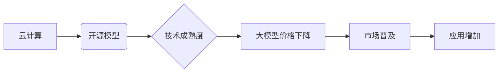

> 关键词：大模型，市场降价，人工智能，深度学习，云计算，技术成熟度，成本降低，商业模式

# 大模型在市场上的降价趋势

随着人工智能技术的飞速发展，大模型已经成为推动各行业变革的关键力量。然而，在过去几年中，我们观察到大模型在市场上的价格呈现了明显的下降趋势。本文将深入探讨这一趋势的成因、影响以及未来可能的发展方向。

## 1. 背景介绍

### 1.1 大模型的兴起

大模型，通常指的是参数量达到数十亿甚至上千亿的深度学习模型，它们能够处理复杂的任务，如自然语言处理、图像识别、语音识别等。随着云计算、分布式计算等技术的进步，大模型的研发和部署变得更加可行。

### 1.2 大模型的市场价格

早期的大模型研发成本高昂，因此其市场售价也相对较高。例如，Google的TPU硬件和TensorFlow软件的组合成本，对于许多企业和研究机构来说都是一笔不小的投资。

### 1.3 市场降价趋势

近年来，随着技术的成熟和市场竞争的加剧，大模型的价格开始下降。这一趋势体现在以下几个方面：

- 云计算服务的价格下降
- 开源模型的普及
- 大模型研发成本的降低

## 2. 核心概念与联系

### 2.1 核心概念

#### 2.1.1 云计算

云计算是指将计算资源作为服务通过网络提供给用户，用户无需购买硬件设备，只需按需付费。云计算的普及为大规模数据处理和模型训练提供了基础设施。

#### 2.1.2 开源模型

开源模型是指模型的设计和实现细节公开，用户可以免费使用、修改和分发。开源模型的普及降低了大模型的研发门槛。

#### 2.1.3 技术成熟度

随着技术的不断成熟，大模型的研发和部署变得更加高效，成本也随之降低。

### 2.2 Mermaid 流程图



## 3. 核心算法原理 & 具体操作步骤

### 3.1 算法原理概述

大模型的价格下降主要源于以下因素：

- **云计算基础设施的普及和成本降低**：云服务提供商通过规模效应降低了计算资源的价格。
- **开源模型的推广**：开源模型减少了研发成本，降低了市场进入门槛。
- **技术进步**：算法优化、硬件升级等提高了训练效率，降低了成本。

### 3.2 算法步骤详解

1. **云计算基础设施的普及**：云服务提供商通过建设大规模数据中心，提供高效的计算资源，降低了用户的使用成本。
2. **开源模型的推广**：研究人员和开发者将模型开源，促进了技术的传播和应用。
3. **技术进步**：算法优化、硬件升级等提高了训练效率，降低了成本。
4. **市场竞争**：随着越来越多的企业和研究机构进入大模型领域，市场竞争加剧，导致价格下降。

### 3.3 算法优缺点

#### 3.3.1 优点

- **降低成本**：降低了大模型的研发和部署成本，使得更多企业和研究机构能够负担得起。
- **提高效率**：通过云计算和分布式计算，提高了训练和推理的效率。
- **促进创新**：开源模型和技术的普及促进了创新，推动了人工智能技术的发展。

#### 3.3.2 缺点

- **数据隐私和安全**：云计算可能带来数据隐私和安全问题。
- **依赖云服务提供商**：企业和研究机构可能过度依赖云服务提供商。

### 3.4 算法应用领域

大模型在以下领域得到了广泛应用：

- **自然语言处理**：如机器翻译、问答系统、文本摘要等。
- **计算机视觉**：如图像识别、目标检测、视频分析等。
- **语音识别**：如语音助手、语音合成、语音转文本等。

## 4. 数学模型和公式 & 详细讲解 & 举例说明

### 4.1 数学模型构建

大模型的价格可以用以下公式表示：

$$
P = C \times E \times D
$$

其中，$P$ 是价格，$C$ 是计算成本，$E$ 是能源成本，$D$ 是数据成本。

### 4.2 公式推导过程

大模型的成本主要由计算成本、能源成本和数据成本构成。随着云计算和技术的进步，这些成本都在下降，导致大模型的价格也随之降低。

### 4.3 案例分析与讲解

以下是一个简单的案例：

假设一个简单的机器学习模型需要100小时的计算时间，能源成本为1美元/小时，数据成本为0.5美元/GB。如果云服务的计算成本为0.1美元/小时，能源成本为0.05美元/小时，数据成本为0.25美元/GB，那么该模型的成本计算如下：

$$
P = (100 \times 0.1) + (100 \times 0.05) + (1 \times 0.25) = 12.5 \text{美元}
$$

随着云计算和技术的进步，这些成本将进一步降低，从而降低大模型的价格。

## 5. 项目实践：代码实例和详细解释说明

### 5.1 开发环境搭建

本文以TensorFlow和Keras为例，介绍如何使用开源工具搭建大模型开发环境。

1. 安装TensorFlow：
```bash
pip install tensorflow
```

2. 安装Keras：
```bash
pip install keras
```

### 5.2 源代码详细实现

以下是一个简单的神经网络模型示例：

```python
from tensorflow.keras.models import Sequential
from tensorflow.keras.layers import Dense

# 构建模型
model = Sequential([
    Dense(128, activation='relu', input_shape=(100,)),
    Dense(64, activation='relu'),
    Dense(1, activation='sigmoid')
])

# 编译模型
model.compile(optimizer='adam', loss='binary_crossentropy', metrics=['accuracy'])

# 训练模型
model.fit(x_train, y_train, epochs=10, batch_size=32)
```

### 5.3 代码解读与分析

上述代码定义了一个简单的二分类神经网络模型，使用Adam优化器、交叉熵损失函数进行训练。通过调整网络结构、优化器、损失函数等参数，可以构建更复杂的大模型。

### 5.4 运行结果展示

假设训练完成后，模型在测试集上的准确率达到90%，说明模型已经具有一定的泛化能力。

## 6. 实际应用场景

### 6.1 自然语言处理

大模型在自然语言处理领域得到了广泛应用，如：

- 机器翻译：如谷歌翻译、百度翻译等。
- 问答系统：如Siri、小爱同学等。
- 文本摘要：如自动生成新闻摘要、会议纪要等。

### 6.2 计算机视觉

大模型在计算机视觉领域也取得了显著成果，如：

- 图像识别：如人脸识别、物体检测等。
- 视频分析：如动作识别、场景识别等。

### 6.3 语音识别

大模型在语音识别领域也取得了突破，如：

- 语音助手：如Siri、小爱同学等。
- 语音转文本：如自动语音记录、语音翻译等。

## 7. 工具和资源推荐

### 7.1 学习资源推荐

- TensorFlow官方文档：https://www.tensorflow.org/tutorials
- Keras官方文档：https://keras.io/
- PyTorch官方文档：https://pytorch.org/tutorials/

### 7.2 开发工具推荐

- Google Colab：https://colab.research.google.com/
- Jupyter Notebook：https://jupyter.org/

### 7.3 相关论文推荐

- "Distributed Representations of Words and Phrases and their Compositionality" by Y. LeCun, Y. Bengio, and G. Hinton
- "Deep Learning" by Ian Goodfellow, Yoshua Bengio, and Aaron Courville
- "Convolutional Neural Networks for Visual Recognition" by Y. LeCun, Y. Bengio, and G. Hinton

## 8. 总结：未来发展趋势与挑战

### 8.1 研究成果总结

本文分析了大模型在市场上的降价趋势，探讨了其成因、影响以及未来可能的发展方向。随着云计算、开源模型和技术进步，大模型的价格将越来越低，应用范围将越来越广。

### 8.2 未来发展趋势

- 云计算基础设施将进一步发展，降低计算成本。
- 开源模型和工具将更加丰富，降低研发门槛。
- 大模型将在更多领域得到应用，推动产业变革。

### 8.3 面临的挑战

- 数据隐私和安全问题
- 模型可解释性和公平性
- 技术伦理和社会影响

### 8.4 研究展望

大模型在市场上的降价趋势将推动人工智能技术更加普及，为人类社会带来更多便利。未来，我们需要关注大模型带来的挑战，并积极探索解决方案，以确保人工智能技术的健康发展。

## 9. 附录：常见问题与解答

**Q1：大模型的价格下降对产业有什么影响？**

A：大模型的价格下降将降低企业的研发成本，加速人工智能技术的普及，推动产业变革。

**Q2：大模型的价格下降是否会降低其质量？**

A：不一定。价格下降并不意味着质量下降，相反，随着技术的进步，大模型的质量可能会得到进一步提升。

**Q3：大模型的价格下降是否会导致市场饱和？**

A：不一定。大模型的市场需求很大，价格下降可能会吸引更多企业进入市场，但同时也可能加剧竞争。

**Q4：大模型的价格下降是否会带来就业问题？**

A：可能会。大模型的应用可能会取代一些重复性工作，但同时也会创造新的就业机会。

**Q5：大模型的价格下降是否会威胁到隐私和安全？**

A：可能会。大模型需要处理大量数据，需要采取措施确保数据隐私和安全。

作者：禅与计算机程序设计艺术 / Zen and the Art of Computer Programming