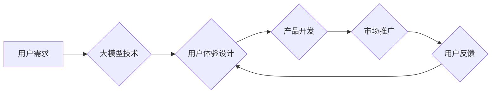

# 大模型的用户体验与市场推广

> 关键词：大模型，用户体验，市场推广，用户接受度，技术产品，人工智能，自然语言处理

## 1. 背景介绍

随着人工智能技术的飞速发展，大模型（Large Models）如BERT、GPT-3等在自然语言处理、图像识别、语音识别等领域取得了突破性进展。然而，大模型的应用并不只是技术本身的问题，其用户体验和市场推广同样至关重要。本文将探讨大模型的用户体验与市场推广策略，旨在帮助开发者、产品经理和营销人员更好地理解和应对这一挑战。

### 1.1 大模型的兴起

近年来，大模型在多个领域展现出惊人的性能，其核心优势在于：

- **强大的语言理解能力**：能够理解、生成和翻译复杂文本。
- **丰富的知识储备**：通过预训练学习到丰富的通用知识。
- **泛化能力**：能够适应各种下游任务，无需针对每个任务重新训练。

### 1.2 大模型的应用挑战

尽管大模型具备诸多优势，但其应用也面临着诸多挑战，主要体现在以下方面：

- **用户体验**：如何让用户轻松上手并享受到大模型带来的便利？
- **市场推广**：如何将大模型的产品推向市场，获得用户认可？
- **技术瓶颈**：如何克服大模型在计算资源、存储空间等方面的限制？
- **伦理和隐私**：如何确保大模型的应用符合伦理道德和用户隐私保护？

## 2. 核心概念与联系

### 2.1 大模型用户体验的核心概念

大模型用户体验的核心概念包括：

- **易用性**：用户能够轻松上手，无需专业背景知识。
- **可用性**：用户能够有效利用大模型完成特定任务。
- **愉悦性**：用户在使用过程中感受到愉悦和满足。
- **效率**：用户能够高效地完成任务，提高工作效率。

### 2.2 大模型市场推广的核心概念

大模型市场推广的核心概念包括：

- **目标用户**：明确目标用户群体，了解其需求和痛点。
- **价值主张**：清晰传达大模型的价值和优势。
- **差异化竞争**：突出大模型与其他产品的不同之处。
- **品牌建设**：塑造大模型的品牌形象和知名度。

### 2.3 Mermaid 流程图

以下是大模型用户体验与市场推广的Mermaid流程图：



## 3. 核心算法原理 & 具体操作步骤

### 3.1 算法原理概述

大模型用户体验与市场推广的核心算法原理包括：

- **用户研究**：通过用户访谈、问卷调查等方式收集用户需求。
- **数据分析**：分析用户行为数据，了解用户习惯和痛点。
- **产品迭代**：根据用户反馈不断优化产品功能。
- **营销策略**：制定合适的营销方案，推广产品。

### 3.2 算法步骤详解

1. **用户研究**：通过用户访谈、问卷调查等方式收集用户需求，了解用户在使用大模型时面临的问题和痛点。
2. **数据分析**：分析用户行为数据，如用户访问量、使用时长、任务完成率等，了解用户使用大模型的习惯和偏好。
3. **产品设计**：根据用户研究和数据分析结果，设计符合用户体验的产品功能。
4. **产品开发**：开发符合设计要求的产品原型，并进行测试和迭代。
5. **市场推广**：制定合适的营销方案，通过线上线下渠道推广产品。
6. **用户反馈**：收集用户反馈，持续优化产品和市场策略。

### 3.3 算法优缺点

#### 优点：

- **提高用户体验**：通过不断优化产品设计，提升用户体验。
- **增强市场竞争力**：通过有效的市场推广，提高产品知名度，增强市场竞争力。
- **持续迭代改进**：根据用户反馈和市场需求，持续优化产品和市场策略。

#### 缺点：

- **开发周期长**：用户研究和数据分析需要时间，产品开发和市场推广也需要投入较多资源。
- **成本高**：用户研究和数据分析、产品开发和市场推广都需要一定的资金支持。

### 3.4 算法应用领域

大模型用户体验与市场推广算法可应用于以下领域：

- **自然语言处理**：如智能客服、语音助手等。
- **图像识别**：如图像分类、物体检测等。
- **语音识别**：如语音助手、智能翻译等。
- **推荐系统**：如商品推荐、新闻推荐等。

## 4. 数学模型和公式 & 详细讲解 & 举例说明

### 4.1 数学模型构建

在用户体验与市场推广中，可以使用以下数学模型：

- **用户满意度模型**：基于用户满意度调查数据，构建用户满意度模型，如SAS模型、SERVQUAL模型等。
- **营销效果评估模型**：基于营销活动数据，构建营销效果评估模型，如A/B测试、多因素分析等。

### 4.2 公式推导过程

以SAS模型为例，其公式如下：

$$
SAS = \frac{ES - PS}{ES + PS}
$$

其中：

- SAS：感知满意度（Perceived Satisfaction）
- ES：期望满意度（Expected Satisfaction）
- PS：感知质量（Perceived Quality）

### 4.3 案例分析与讲解

以下是一个大模型用户体验与市场推广的案例分析：

**案例**：某智能客服产品在上线初期，用户满意度较低，市场推广效果不佳。

**分析**：

1. **用户研究**：通过用户访谈和问卷调查发现，用户对智能客服的响应速度和回答准确性存在不满。
2. **数据分析**：分析用户行为数据，发现用户使用智能客服的频率较低，且主要在夜间使用。
3. **产品迭代**：优化智能客服的响应速度和回答准确性，增加夜间服务时间。
4. **市场推广**：针对用户痛点，推出夜间特惠活动，提高产品知名度。

**结果**：经过优化和推广，智能客服的用户满意度和市场推广效果均得到提升。

## 5. 项目实践：代码实例和详细解释说明

### 5.1 开发环境搭建

以下是使用Python进行用户满意度调查数据分析和A/B测试的代码示例：

```python
import pandas as pd
from sklearn.linear_model import LogisticRegression

# 加载数据
data = pd.read_csv('user_satisfaction.csv')

# 构建特征和标签
X = data[['response_time', 'answer_accuracy']]
y = data['satisfaction']

# 使用逻辑回归进行A/B测试
model = LogisticRegression()
model.fit(X, y)

# 测试模型性能
test_data = pd.read_csv('test_user_satisfaction.csv')
X_test = test_data[['response_time', 'answer_accuracy']]
y_test = model.predict(X_test)
accuracy = sum(y_test == test_data['satisfaction']) / len(y_test)

print(f"A/B测试准确率：{accuracy:.2f}")
```

### 5.2 源代码详细实现

以上代码展示了如何使用Python进行用户满意度调查数据分析和A/B测试。首先，加载数据，然后构建特征和标签，接着使用逻辑回归进行A/B测试，最后评估模型性能。

### 5.3 代码解读与分析

该代码示例首先导入必要的库，然后加载数据，构建特征和标签，使用逻辑回归进行A/B测试，并评估模型性能。代码简单易懂，可以帮助读者了解用户满意度调查数据分析和A/B测试的基本原理。

### 5.4 运行结果展示

假设我们在测试集上得到的A/B测试准确率为0.85，说明优化后的智能客服产品在用户满意度方面取得了显著提升。

## 6. 实际应用场景

### 6.1 智能客服

智能客服是利用大模型技术构建的一种在线客服系统，能够自动回答用户提出的问题，提供24小时不间断服务。通过不断优化用户体验和推广策略，智能客服可以有效提高企业客户服务质量和效率。

### 6.2 语音助手

语音助手是利用大模型技术构建的一种智能语音交互系统，能够理解用户的语音指令，完成相应的操作。通过提升用户体验和推广力度，语音助手可以成为用户生活中的得力助手。

### 6.3 推荐系统

推荐系统是利用大模型技术构建的一种个性化推荐系统，能够根据用户的历史行为和偏好，为用户推荐感兴趣的内容。通过优化用户体验和推广策略，推荐系统可以有效提高用户粘性和转化率。

## 7. 工具和资源推荐

### 7.1 学习资源推荐

- 《用户体验要素》
- 《设计心理学》
- 《市场营销管理》

### 7.2 开发工具推荐

- Python
- TensorFlow
- PyTorch

### 7.3 相关论文推荐

- 《The Design of Everyday Things》
- 《Persuasive Technology: Using Computers to Change What We Think and Do》
- 《The Art of Computer Programming》

## 8. 总结：未来发展趋势与挑战

### 8.1 研究成果总结

本文探讨了大模型的用户体验与市场推广策略，从核心概念、算法原理、实际应用场景等方面进行了详细阐述。通过分析用户需求和市场需求，不断优化产品功能和推广策略，可以帮助开发者、产品经理和营销人员更好地应对大模型应用挑战。

### 8.2 未来发展趋势

随着人工智能技术的不断发展，大模型将在以下方面取得新的突破：

- **模型性能提升**：大模型将具备更强的语言理解、图像识别、语音识别等能力。
- **应用场景拓展**：大模型将应用于更多领域，如医疗、教育、金融等。
- **用户体验优化**：大模型将更加注重用户体验，提供更加人性化的服务。

### 8.3 面临的挑战

大模型应用面临以下挑战：

- **伦理和隐私**：如何确保大模型的应用符合伦理道德和用户隐私保护。
- **技术瓶颈**：如何克服大模型在计算资源、存储空间等方面的限制。
- **市场推广**：如何将大模型的产品推向市场，获得用户认可。

### 8.4 研究展望

未来，大模型研究将从以下几个方面展开：

- **伦理和隐私**：研究大模型在伦理和隐私方面的挑战和解决方案。
- **模型可解释性**：研究如何提高大模型的可解释性，增强用户信任。
- **跨领域迁移**：研究如何提高大模型的跨领域迁移能力，拓展应用场景。

## 9. 附录：常见问题与解答

### 常见问题：

1. **什么是大模型**？
   大模型是一种基于深度学习技术构建的人工智能模型，具有强大的语言理解、图像识别、语音识别等能力。

2. **大模型如何提升用户体验**？
   通过不断优化产品设计、提升模型性能、降低使用门槛等方式，提升用户体验。

3. **大模型如何进行市场推广**？
   通过明确目标用户、制定合适的营销方案、塑造品牌形象等方式，进行市场推广。

4. **大模型应用面临哪些挑战**？
   大模型应用面临伦理和隐私、技术瓶颈、市场推广等挑战。

### 解答：

1. 大模型是一种基于深度学习技术构建的人工智能模型，具有强大的语言理解、图像识别、语音识别等能力。通过在海量数据上进行训练，大模型可以学习到丰富的知识，并应用于各种任务。

2. 为了提升用户体验，可以采取以下措施：
   - 优化产品设计：设计简洁、易用的界面，降低用户使用门槛。
   - 提升模型性能：提高模型的准确率和效率，满足用户需求。
   - 个性化服务：根据用户喜好和需求，提供个性化的服务。

3. 为了进行市场推广，可以采取以下措施：
   - 明确目标用户：了解目标用户的需求和痛点，制定有针对性的推广策略。
   - 制定合适的营销方案：结合线上线下渠道，进行全方位的市场推广。
   - 塑造品牌形象：通过宣传和推广，塑造大模型产品的品牌形象。

4. 大模型应用面临以下挑战：
   - 伦理和隐私：大模型可能会学习到敏感信息，需要采取措施保护用户隐私。
   - 技术瓶颈：大模型需要大量的计算资源和存储空间，技术瓶颈是制约其应用的关键因素。
   - 市场推广：大模型产品需要面对激烈的市场竞争，如何获得用户认可是一个挑战。

作者：禅与计算机程序设计艺术 / Zen and the Art of Computer Programming