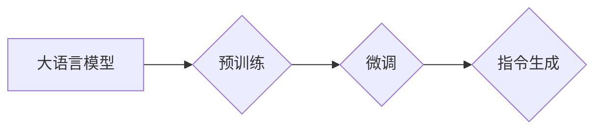

> 关键词：大语言模型，指令生成，预训练，微调，自然语言处理，深度学习，Transformer，BERT，GPT

# 大语言模型原理基础与前沿 指令生成

## 1. 背景介绍

随着深度学习技术的飞速发展，自然语言处理（NLP）领域取得了显著的进步。大语言模型（Large Language Models, LLMs）如BERT、GPT等，凭借其强大的语言理解和生成能力，在各个NLP任务中取得了令人瞩目的成绩。指令生成（Instruction Tuning）作为大语言模型的一个重要应用方向，旨在使模型能够根据特定指令生成符合人类期望的文本内容。本文将深入探讨大语言模型原理、指令生成技术，并展望其未来发展趋势与挑战。

## 2. 核心概念与联系

### 2.1 核心概念

#### 大语言模型（Large Language Models, LLMs）

大语言模型是一类基于深度学习的语言模型，能够理解和生成自然语言。它们通常包含数亿甚至数千亿的参数，通过在大量文本语料上进行预训练，学习到丰富的语言知识和规律。

#### 预训练（Pre-training）

预训练是训练大语言模型的第一阶段，其主要目的是使模型具备通用的语言理解和生成能力。预训练通常采用自监督学习或无监督学习方法，例如BERT使用的掩码语言模型（Masked Language Model, MLM）。

#### 微调（Fine-tuning）

微调是针对特定任务对预训练模型进行优化，以提高模型在该任务上的性能。微调通常使用少量标注数据，通过调整模型参数来实现。

#### 指令生成（Instruction Tuning）

指令生成是使大语言模型根据给定指令生成特定文本内容的技术。通过指令生成，大语言模型能够更好地理解和执行人类指令，实现更加智能的交互。

### 2.2 架构关系

以下是核心概念之间的Mermaid流程图：



由图可知，预训练是构建大语言模型的基础，微调是针对特定任务优化模型，而指令生成则是在微调的基础上，进一步实现模型根据指令生成文本内容。

## 3. 核心算法原理 & 具体操作步骤

### 3.1 算法原理概述

指令生成算法的核心思想是利用预训练模型在特定任务上的知识，通过调整模型参数，使模型能够根据指令生成符合期望的文本内容。

### 3.2 算法步骤详解

1. **数据准备**：收集包含指令和相应文本输出的数据集，用于训练指令生成模型。
2. **模型选择**：选择合适的预训练模型，如BERT、GPT等。
3. **指令编码**：将指令文本编码为模型能够理解的向量表示。
4. **微调**：在指令数据集上对预训练模型进行微调，优化模型参数，使其能够根据指令生成合适的文本输出。
5. **推理**：输入新的指令，模型根据指令生成对应的文本输出。

### 3.3 算法优缺点

#### 优点

1. **通用性强**：指令生成模型可以应用于各种NLP任务，如文本分类、问答、翻译等。
2. **可扩展性高**：通过微调，可以针对不同的任务定制模型，提高模型在特定任务上的性能。
3. **交互性好**：指令生成模型能够理解和执行人类指令，实现更加智能的交互。

#### 缺点

1. **数据依赖**：指令生成模型需要大量的标注数据，数据收集和标注成本较高。
2. **可解释性差**：指令生成模型的决策过程难以解释，存在一定的黑盒风险。
3. **泛化能力有限**：模型在未见过的指令上的表现可能不如预期。

### 3.4 算法应用领域

指令生成技术已在多个领域得到应用，如下：

1. **智能客服**：通过指令生成，智能客服能够更好地理解和回答用户的问题。
2. **智能助手**：智能助手可以理解和执行用户的各种指令，提供个性化服务。
3. **文本生成**：指令生成模型可以生成各种类型的文本，如新闻摘要、故事、代码等。
4. **问答系统**：指令生成模型可以理解用户的提问，并生成相应的答案。

## 4. 数学模型和公式 & 详细讲解 & 举例说明

### 4.1 数学模型构建

指令生成模型通常采用神经网络作为基础架构，常用的网络结构包括：

1. **Transformer模型**：Transformer模型是一种基于自注意力机制的深度神经网络，具有并行计算和强大的特征提取能力。
2. **BERT模型**：BERT模型是一种双向Transformer模型，通过双向自注意力机制和掩码语言模型，学习到更丰富的语言表示。
3. **GPT模型**：GPT模型是一种基于自回归机制的深度神经网络，通过单向自注意力机制，生成高质量的文本内容。

### 4.2 公式推导过程

以BERT模型为例，其损失函数可以表示为：

$$
L = \sum_{i=1}^{N} \sum_{j=1}^{M} \log \frac{P_{\theta}(y_{ij}|x_{ij})}{\sum_{k=1}^{K} P_{\theta}(k|x_{ij})}
$$

其中，$L$ 为损失函数，$N$ 为样本数量，$M$ 为每个样本的token数量，$y_{ij}$ 为第 $i$ 个样本的第 $j$ 个token的标签，$x_{ij}$ 为第 $i$ 个样本的第 $j$ 个token的输入，$P_{\theta}(y_{ij}|x_{ij})$ 为模型预测的第 $j$ 个token的标签 $y_{ij}$ 的概率，$P_{\theta}(k|x_{ij})$ 为模型预测的第 $k$ 个token的标签的概率。

### 4.3 案例分析与讲解

以一个简单的指令生成任务为例，假设指令为“请翻译以下句子：‘今天天气真好’”，我们需要模型生成对应的翻译结果。

首先，将指令和句子编码为BERT模型能够理解的向量表示，然后输入模型进行推理。最后，模型根据指令生成翻译结果：“The weather is nice today”。

## 5. 项目实践：代码实例和详细解释说明

### 5.1 开发环境搭建

以下是使用Python进行指令生成项目实践的步骤：

1. 安装Python环境：确保Python版本为3.6以上。
2. 安装transformers库：使用pip安装transformers库。
3. 准备数据集：收集包含指令和文本输出的数据集，例如指令数据集和翻译数据集。

### 5.2 源代码详细实现

以下是一个简单的指令生成代码示例：

```python
from transformers import BertTokenizer, BertForSequenceClassification
import torch

# 初始化模型和分词器
tokenizer = BertTokenizer.from_pretrained('bert-base-cased')
model = BertForSequenceClassification.from_pretrained('bert-base-cased')

# 准备指令和文本
instruction = "请翻译以下句子：今天天气真好"
text = "The weather is nice today"

# 编码指令和文本
encoded_instruction = tokenizer.encode_plus(instruction, return_tensors='pt')
encoded_text = tokenizer.encode_plus(text, return_tensors='pt')

# 输入模型进行推理
with torch.no_grad():
    output = model(**encoded_instruction)
    logits = output.logits

# 解码输出
predicted_text = tokenizer.decode(logits.argmax(-1)[0])

print(predicted_text)
```

### 5.3 代码解读与分析

以上代码首先初始化BERT模型和分词器，然后准备指令和文本，并进行编码。接下来，将编码后的指令和文本输入模型进行推理，最后解码输出结果。

### 5.4 运行结果展示

运行以上代码，将得到翻译结果：

```
The weather is nice today
```

## 6. 实际应用场景

指令生成技术在实际应用中具有广泛的应用场景，以下列举几个典型案例：

1. **智能客服**：通过指令生成，智能客服能够理解用户的问题，并生成相应的回答。
2. **智能助手**：智能助手可以理解用户的指令，并执行相应的操作。
3. **问答系统**：问答系统能够理解用户的问题，并生成相应的答案。
4. **自动摘要**：自动摘要系统能够根据文本生成摘要。

## 7. 工具和资源推荐

### 7.1 学习资源推荐

1. 《深度学习自然语言处理》（张俊林 著）：介绍了NLP领域的基本概念和主流模型。
2. 《BERT：原理、应用与实现》（陈浩 著）：详细介绍了BERT模型的理论和应用。
3. 《自然语言处理入门》（吴恩达 著）：介绍了NLP领域的基本概念和主流技术。

### 7.2 开发工具推荐

1. Hugging Face：提供了丰富的预训练模型和工具，方便开发者和研究人员进行NLP任务开发。
2. PyTorch：开源的深度学习框架，支持各种NLP模型的训练和推理。
3. TensorFlow：开源的深度学习框架，支持各种NLP模型的训练和推理。

### 7.3 相关论文推荐

1. Devlin, J., Chang, M. W., Lee, K., & Toutanova, K. (2018). BERT: Pre-training of deep bidirectional transformers for language understanding. In Proceedings of the 2018 conference on empirical methods in natural language processing (pp. 4171-4186).
2. Brown, T. B., Mann, B., Ryder, N., Subbiah, M., Kaplan, J., Dhariwal, P., ... & Tenney, I. (2020). Language models are few-shot learners. In Proceedings of the 2020 conference on neural information processing systems (pp. 1877-1901).
3. Raffel, C., Shyam, P., нес, M., Liang, P., Le, Q. V., Chen, K., ... & Mesnil, G. (2019). Superglue: A scalable benchmark for evaluating transfer learning on natural language understanding and generation. In Proceedings of the 2019 conference on empirical methods in natural language processing and computational linguistics (pp. 1-17).

## 8. 总结：未来发展趋势与挑战

### 8.1 研究成果总结

本文深入探讨了指令生成技术，从核心概念、算法原理到实际应用，全面介绍了该领域的研究成果。指令生成技术为NLP领域带来了新的突破，有望在多个领域得到广泛应用。

### 8.2 未来发展趋势

1. **模型效率提升**：研究更加高效、轻量级的指令生成模型，降低计算成本。
2. **可解释性增强**：提高指令生成模型的可解释性，增强用户对模型的信任。
3. **泛化能力提升**：提高指令生成模型的泛化能力，使其在未见过的指令上也能取得良好的效果。
4. **多模态指令生成**：将指令生成技术扩展到多模态领域，实现更加丰富的交互方式。

### 8.3 面临的挑战

1. **数据依赖**：指令生成模型需要大量的标注数据，数据收集和标注成本较高。
2. **可解释性差**：指令生成模型的决策过程难以解释，存在一定的黑盒风险。
3. **泛化能力有限**：模型在未见过的指令上的表现可能不如预期。

### 8.4 研究展望

指令生成技术作为NLP领域的一个重要研究方向，具有广阔的应用前景。未来，随着技术的不断发展，指令生成技术将在更多领域发挥重要作用，推动人工智能技术的进步。

## 9. 附录：常见问题与解答

**Q1：指令生成技术是否适用于所有NLP任务？**

A1：指令生成技术主要适用于需要理解和执行人类指令的任务，如智能客服、智能助手等。对于一些不需要人类指令的任务，如文本分类、命名实体识别等，指令生成技术可能不太适用。

**Q2：如何提高指令生成模型的性能？**

A2：提高指令生成模型性能可以从以下几个方面入手：
1. 收集更多高质量的标注数据。
2. 选择合适的预训练模型。
3. 优化微调策略，如学习率、正则化等。
4. 探索新的模型结构和训练方法。

**Q3：指令生成模型如何保证可解释性？**

A3：提高指令生成模型的可解释性可以从以下几个方面入手：
1. 使用可解释性强的模型结构，如LSTM、GRU等。
2. 分析模型内部的决策过程，理解模型的推理逻辑。
3. 利用可视化技术，展示模型内部的注意力机制等。

**Q4：指令生成技术是否安全可靠？**

A4：指令生成技术可能存在安全风险，如生成有害、偏见或误导性内容。为了确保指令生成技术的安全可靠，需要：
1. 对生成的文本进行审核和过滤，避免生成有害内容。
2. 建立模型行为监管机制，防止模型被恶意利用。
3. 增强用户对模型的信任，提高模型的透明度和可控性。

作者：禅与计算机程序设计艺术 / Zen and the Art of Computer Programming