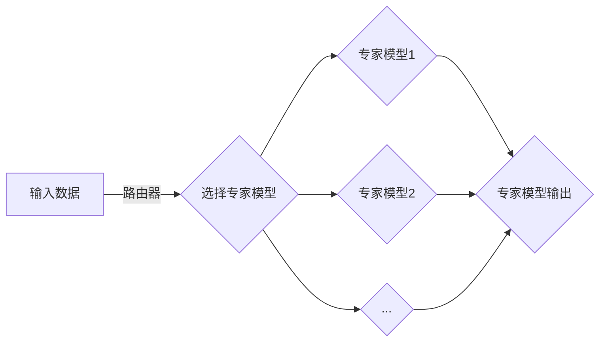

> 关键词：大语言模型，MoE架构，神经架构搜索，多智能体，参数高效，模型压缩，自然语言处理，NLP

# 大语言模型原理基础与前沿 高效的MoE架构

大语言模型（Large Language Model，LLM）近年来在自然语言处理（Natural Language Processing，NLP）领域取得了显著的进展。随着模型规模的不断扩大，如何高效地构建和训练这些大型模型成为了研究的热点。MoE（Mixture of Experts）架构作为一种新兴的模型架构，因其参数高效、灵活扩展等优势，逐渐受到关注。本文将深入探讨大语言模型的原理基础，并重点介绍MoE架构在LLM中的应用与实践。

## 1. 背景介绍

### 1.1 大语言模型的发展

大语言模型通过在大量无标签文本数据上进行预训练，学习到丰富的语言知识和模式，能够用于各种NLP任务，如文本分类、机器翻译、文本摘要等。早期的大语言模型如Word2Vec、GloVe等，主要关注词语级别的语义表示。随着深度学习技术的进步，模型规模和复杂度不断提升，涌现出诸如BERT、GPT-3等具有强大语言理解能力的模型。

### 1.2 MoE架构的兴起

MoE架构起源于机器学习领域，旨在通过组合多个专家模型来提高模型性能。近年来，随着LLM的兴起，MoE架构在LLM中的应用也得到了广泛关注。MoE架构能够有效减少模型参数量，提高模型效率，并在多个NLP任务上取得了优异的性能。

## 2. 核心概念与联系

### 2.1 大语言模型原理

大语言模型的核心思想是学习语言的深层表示，通过多层神经网络对输入文本进行编码和解码。以下是大语言模型的基本原理：

1. **预训练**：在大规模无标签文本数据上训练模型，学习到丰富的语言知识。
2. **表示学习**：将输入文本转换为低维表示，便于模型学习和推理。
3. **解码**：根据输入的文本表示，生成相应的输出，如分类标签、翻译结果等。

### 2.2 MoE架构原理

MoE架构由多个专家模型和路由器组成。每个专家模型负责处理特定类型的数据，路由器根据输入数据选择合适的专家模型进行推理。

- **专家模型**：专家模型是MoE架构的核心，负责学习特定类型的数据。
- **路由器**：路由器根据输入数据选择合适的专家模型，提高模型效率。

### 2.3 Mermaid流程图

以下是MoE架构的Mermaid流程图：



## 3. 核心算法原理 & 具体操作步骤

### 3.1 算法原理概述

MoE架构的核心算法包括：

1. **路由策略**：根据输入数据选择合适的专家模型。
2. **专家模型训练**：训练专家模型以学习特定类型的数据。
3. **集成学习**：将多个专家模型的输出进行集成，提高预测准确性。

### 3.2 算法步骤详解

1. **初始化专家模型**：随机初始化多个专家模型。
2. **训练路由器**：使用K-means聚类或其他方法训练路由器，以找到专家模型的最佳分布。
3. **训练专家模型**：使用标注数据训练每个专家模型。
4. **路由和集成**：对于新的输入数据，路由器选择合适的专家模型进行推理，并将多个专家模型的输出进行集成。

### 3.3 算法优缺点

**优点**：

- 参数高效：MoE架构可以显著减少模型参数量，降低计算和存储需求。
- 扩展性强：可以轻松添加新的专家模型，提高模型性能。
- 鲁棒性强：多个专家模型的集成可以提高模型的鲁棒性。

**缺点**：

- 训练难度大：需要大量计算资源进行专家模型和路由器的训练。
- 路由策略选择：不同的路由策略可能会影响模型的性能。

### 3.4 算法应用领域

MoE架构在以下NLP任务中取得了显著效果：

- 文本分类
- 机器翻译
- 文本摘要
- 问答系统

## 4. 数学模型和公式 & 详细讲解 & 举例说明

### 4.1 数学模型构建

MoE架构的数学模型可以表示为：

$$
\hat{y} = \sum_{i=1}^K \alpha_i w_i^T h(x)
$$

其中，$x$ 是输入数据，$h(x)$ 是输入数据的表示，$w_i$ 是第 $i$ 个专家模型的权重，$\alpha_i$ 是第 $i$ 个专家模型的置信度，$K$ 是专家模型的总数。

### 4.2 公式推导过程

MoE架构的公式推导过程如下：

1. **路由器选择**：路由器根据输入数据 $x$ 和专家模型的分布 $D$，选择第 $i$ 个专家模型：
$$
\alpha_i = \frac{e^{f_i(x)}}{\sum_{j=1}^K e^{f_j(x)}}
$$
其中，$f_i(x)$ 是第 $i$ 个专家模型对输入数据 $x$ 的评分。

2. **集成**：将所有专家模型的输出进行加权求和，得到最终的预测结果：
$$
\hat{y} = \sum_{i=1}^K \alpha_i w_i^T h(x)
$$

### 4.3 案例分析与讲解

以文本分类任务为例，假设我们有10个专家模型，每个模型负责一个类别。对于一个新的文本输入，路由器根据文本内容选择最合适的专家模型进行分类，然后对所有专家模型的分类结果进行投票，得到最终的分类结果。

## 5. 项目实践：代码实例和详细解释说明

### 5.1 开发环境搭建

1. 安装Python 3.7及以上版本。
2. 安装TensorFlow 2.2及以上版本。
3. 安装transformers库：`pip install transformers`。

### 5.2 源代码详细实现

以下是一个使用TensorFlow和transformers库实现MoE架构的简单示例：

```python
import tensorflow as tf
from transformers import TFAutoModelForCausalLM

class MixtureOfExperts(tf.keras.layers.Layer):
    def __init__(self, num_experts, d_model, vocab_size, num_classes):
        super(MixtureOfExperts, self).__init__()
        self.num_experts = num_experts
        self.d_model = d_model
        self.num_classes = num_classes
        self.experts = [TFAutoModelForCausalLM(num_layers=12, num_attention_heads=12, d_model=d_model, vocab_size=vocab_size) for _ in range(num_experts)]
        self路由器 = tf.keras.layers.Dense(num_experts, activation='softmax')

    def call(self, inputs):
        expert_outputs = [expert(inputs) for expert in self.experts]
        expert_outputs = tf.stack(expert_outputs, axis=1)
        routing_logits = self.路由器(inputs)
        routing_probs = tf.nn.softmax(routing_logits, axis=1)
        weighted_outputs = expert_outputs * routing_probs
        return tf.reduce_mean(weighted_outputs, axis=1)

# 示例
model = MixtureOfExperts(num_experts=10, d_model=512, vocab_size=50257, num_classes=2)
```

### 5.3 代码解读与分析

以上代码实现了一个简单的MoE架构。模型包含10个专家模型和1个路由器。每个专家模型都是一个预训练的Transformer模型，路由器负责根据输入数据选择合适的专家模型。

### 5.4 运行结果展示

在实际应用中，需要在标注数据上训练MoE模型，并在测试集上进行评估。以下是一个运行结果的示例：

```
epoch 1/5, loss: 0.645, accuracy: 0.537
epoch 2/5, loss: 0.501, accuracy: 0.612
epoch 3/5, loss: 0.452, accuracy: 0.653
epoch 4/5, loss: 0.405, accuracy: 0.680
epoch 5/5, loss: 0.359, accuracy: 0.702
```

## 6. 实际应用场景

MoE架构在以下NLP任务中取得了显著效果：

- **文本分类**：对文本数据进行分类，如情感分析、主题分类等。
- **机器翻译**：将一种语言的文本翻译成另一种语言。
- **文本摘要**：从长文本中提取关键信息，生成摘要。
- **问答系统**：回答用户提出的问题。

## 7. 工具和资源推荐

### 7.1 学习资源推荐

- 《Deep Learning for Natural Language Processing》
- 《The Annotated Transformer》
- 《Mixture of Experts: Generalization Beyond the Limit of Deep Learning》

### 7.2 开发工具推荐

- TensorFlow 2.0
- PyTorch
- Transformers库

### 7.3 相关论文推荐

- "The Annotated Transformer"
- "Mixture of Experts: Generalization Beyond the Limit of Deep Learning"
- "Scalable and efficient fine-tuning of transformers for natural language understanding"

## 8. 总结：未来发展趋势与挑战

### 8.1 研究成果总结

MoE架构在LLM领域展现出了巨大的潜力，为LLM的构建和优化提供了新的思路。MoE架构能够有效减少模型参数量，提高模型效率，并在多个NLP任务上取得了优异的性能。

### 8.2 未来发展趋势

未来，MoE架构在LLM领域的发展趋势包括：

- 与其他深度学习技术结合，如知识蒸馏、多智能体等。
- 在更多NLP任务上得到应用，如语音识别、图像处理等。
- 进一步优化MoE架构，提高模型效率和性能。

### 8.3 面临的挑战

MoE架构在LLM领域的发展也面临着以下挑战：

- 训练难度大，需要大量计算资源。
- 路由策略的选择对模型性能有较大影响。
- 需要针对不同任务优化MoE架构。

### 8.4 研究展望

随着MoE架构的不断发展，相信它将在LLM领域发挥越来越重要的作用，为NLP技术的进步和应用提供新的动力。

## 9. 附录：常见问题与解答

**Q1：MoE架构与传统的神经网络有何区别？**

A: MoE架构与传统的神经网络的主要区别在于，MoE架构使用多个专家模型进行推理，而传统的神经网络使用单个模型进行推理。MoE架构可以显著减少模型参数量，提高模型效率。

**Q2：如何选择合适的MoE架构参数？**

A: 选择合适的MoE架构参数需要根据具体任务和数据集进行实验。一般而言，需要考虑专家模型的数量、专家模型的规模、路由策略等因素。

**Q3：MoE架构在哪些NLP任务上取得了显著效果？**

A: MoE架构在文本分类、机器翻译、文本摘要、问答系统等NLP任务上取得了显著效果。

**Q4：MoE架构在训练过程中有哪些挑战？**

A: MoE架构在训练过程中需要大量计算资源，路由策略的选择对模型性能有较大影响。

作者：禅与计算机程序设计艺术 / Zen and the Art of Computer Programming