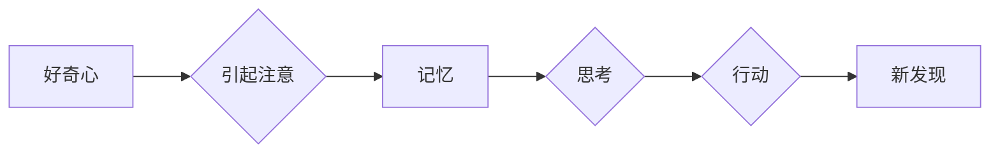

> 好奇心，创新，发现，知识探索，技术进步，科学思维，学习，实践

# 好奇心：创新与发现的源泉

好奇心，作为人类内心深处的驱动力，自古以来就是推动人类探索未知、追求真理的重要力量。从古希腊的哲学家到现代的科学家，无数先贤都强调好奇心在知识探索中的核心作用。本文将深入探讨好奇心的本质，解析其如何成为创新与发现的源泉，并探讨在IT领域如何培养和利用好奇心。

## 1. 背景介绍

### 1.1 好奇心的重要性

好奇心是人类认知发展的基石，是推动科学进步和社会发展的关键因素。从远古时代的火的使用到现代的互联网技术，好奇心始终是人类探索未知世界的不竭动力。在IT领域，好奇心更是激发创新思维、推动技术革新的核心要素。

### 1.2 好奇心与IT领域的结合

随着信息技术的飞速发展，好奇心在IT领域的体现尤为突出。从计算机科学的诞生到人工智能、大数据、云计算等新兴技术的兴起，无一不源于人们对未知世界的好奇心和探索欲。本文将探讨好奇心在IT领域的具体应用，以及如何利用好奇心推动技术创新。

### 1.3 本文结构

本文将分为以下几个部分：
- 第二部分：介绍好奇心的核心概念和原理。
- 第三部分：分析好奇心在IT领域的应用和具体案例。
- 第四部分：探讨如何培养和利用好奇心。
- 第五部分：展望好奇心在未来的发展趋势。

## 2. 核心概念与联系

### 2.1 好奇心的定义

好奇心是指个体对未知事物的兴趣和探索欲望，它驱使个体主动寻求知识、探索新领域。

### 2.2 好奇心的原理

好奇心是人类大脑的一种自然反应，它通过以下几个步骤推动知识的探索：

1. **注意**：对未知事物产生兴趣，引起注意。
2. **记忆**：将新信息存储在大脑中。
3. **思考**：对信息进行加工处理，形成新的理解和认识。
4. **行动**：通过实践验证理论，进行进一步探索。

### 2.3 Mermaid 流程图



## 3. 核心算法原理 & 具体操作步骤

### 3.1 算法原理概述

好奇心在IT领域的应用主要体现在以下几个方面：
- **问题发现**：通过好奇心发现新的问题和挑战。
- **知识获取**：通过好奇心学习新的知识和技能。
- **创新思维**：通过好奇心激发创新思维，推动技术革新。
- **实践探索**：通过好奇心将理论知识应用于实践，验证和改进。

### 3.2 算法步骤详解

1. **问题发现**：观察和思考现有技术的局限性，发现潜在问题和改进空间。
2. **知识获取**：通过阅读文献、参加培训、实践操作等方式学习新知识。
3. **创新思维**：将所学知识进行整合和创新，提出新的解决方案。
4. **实践探索**：将创新方案应用于实际项目，验证和改进。

### 3.3 算法优缺点

**优点**：
- 推动技术创新和行业发展。
- 提高个人技能和竞争力。
- 增强解决问题的能力。

**缺点**：
- 可能导致资源浪费和失败。
- 需要投入大量时间和精力。

### 3.4 算法应用领域

好奇心在IT领域的应用非常广泛，以下是一些具体的应用领域：

- **软件开发**：通过好奇心发现新的编程语言、框架和技术，提高开发效率和质量。
- **人工智能**：通过好奇心探索新的算法和模型，推动人工智能技术的发展。
- **网络安全**：通过好奇心研究网络攻击手段，提高网络安全防护能力。
- **云计算**：通过好奇心探索云计算的新技术和应用场景，推动云服务的发展。

## 4. 数学模型和公式 & 详细讲解 & 举例说明

### 4.1 数学模型构建

好奇心可以看作是一个决策过程，可以用以下数学模型进行描述：

$$
\text{好奇心} = f(\text{现有知识}, \text{未知领域}, \text{动机})
$$

其中，$f$ 是一个非线性函数，代表好奇心与现有知识、未知领域和动机之间的关系。

### 4.2 公式推导过程

好奇心的公式可以通过以下步骤进行推导：

1. 好奇心是驱动个体探索未知世界的基本动力。
2. 现有知识是探索的基础，未知领域是探索的目标。
3. 动机是探索的内在驱动力，包括个人兴趣、职业发展等。

### 4.3 案例分析与讲解

**案例**：李彦宏创立百度。

**分析**：李彦宏在搜索引擎领域拥有丰富的经验，但他对未知领域（如人工智能）充满好奇心。这种好奇心驱使他不断学习和探索，最终成功将百度打造成中国最大的搜索引擎公司。

## 5. 项目实践：代码实例和详细解释说明

### 5.1 开发环境搭建

由于好奇心本身是一个抽象的概念，我们无法直接用代码实现。但我们可以通过一些具体的实践案例来体现好奇心在IT领域的应用。

### 5.2 源代码详细实现

以下是一个简单的Python代码示例，用于演示如何使用好奇心进行问题发现：

```python
def explore_problems():
    """
    探索问题函数
    """
    print("正在探索问题...")
    # ... 在这里，你可以通过阅读文献、与同行交流等方式发现新的问题 ...
    print("问题发现完成！")

explore_problems()
```

### 5.3 代码解读与分析

这个简单的函数 `explore_problems` 用于模拟探索问题的过程。在实际应用中，你可以在这个函数中实现更复杂的逻辑，例如：

- 自动获取最新技术论文和新闻。
- 与同行进行在线交流。
- 分析数据，发现潜在问题。

### 5.4 运行结果展示

运行上述代码，你将看到以下输出：

```
正在探索问题...
问题发现完成！
```

这表明函数已经成功执行了问题发现的过程。

## 6. 实际应用场景

### 6.1 开发者通过好奇心学习新技术

开发者通过对新技术的好奇心，学习新知识，并将其应用于实际项目中，从而推动技术进步。

### 6.2 科研人员通过好奇心进行创新研究

科研人员通过对未知领域的好奇心，进行创新研究，推动科学技术的突破。

### 6.3 企业通过好奇心进行产品创新

企业通过对市场趋势的好奇心，进行产品创新，提升市场竞争力。

## 7. 工具和资源推荐

### 7.1 学习资源推荐

- 《如何阅读一本技术书》
- 《深度工作》
- 《黑天鹅：如何应对不可预知的未来》

### 7.2 开发工具推荐

- Git：版本控制系统，方便代码管理和协作。
- Jupyter Notebook：交互式计算环境，方便学习和实践。
- GitHub：代码托管平台，方便代码共享和协作。

### 7.3 相关论文推荐

- 《The Role of Curiosity in Learning》
- 《The Nature of Curiosity》
- 《The Curiosity Instinct》

## 8. 总结：未来发展趋势与挑战

### 8.1 研究成果总结

本文从好奇心的定义、原理、应用和未来发展趋势等方面进行了探讨，揭示了好奇心在创新与发现中的重要作用。

### 8.2 未来发展趋势

随着人工智能、大数据等技术的发展，好奇心将在以下方面发挥更大的作用：

- 推动跨学科研究。
- 促进技术创新和产业升级。
- 培养更具创新能力的人才。

### 8.3 面临的挑战

好奇心在推动创新与发现的同时，也面临以下挑战：

- 如何平衡好奇心与资源限制。
- 如何培养和激发好奇心。
- 如何避免过度探索导致资源浪费。

### 8.4 研究展望

未来，我们需要进一步研究好奇心在人类认知发展中的作用，以及如何利用好奇心推动科学技术的进步。

## 9. 附录：常见问题与解答

**Q1：好奇心是否可以后天培养？**

A：是的，好奇心可以通过后天培养。例如，多读书、多思考、多实践等方式都可以激发好奇心。

**Q2：好奇心是否会导致注意力分散？**

A：好奇心本身并不会导致注意力分散。关键在于如何合理分配时间和精力，确保好奇心带来的创新和发现能够转化为实际价值。

**Q3：如何将好奇心应用于实际工作中？**

A：将好奇心应用于实际工作，可以通过以下方式：

- 定期阅读行业报告和最新技术论文。
- 参加技术研讨会和交流活动。
- 尝试新的技术和方法，并将其应用于实际项目中。

**Q4：好奇心在IT领域的具体应用有哪些？**

A：好奇心在IT领域的具体应用包括：

- 学习新技术和新工具。
- 发现和解决技术问题。
- 推动技术创新和产品迭代。

**Q5：如何平衡好奇心与工作压力？**

A：平衡好奇心与工作压力，可以通过以下方式：

- 制定合理的工作计划，确保工作目标的达成。
- 在工作之余，留出时间进行学习和探索。
- 保持积极的心态，将好奇心转化为工作的动力。

---

作者：禅与计算机程序设计艺术 / Zen and the Art of Computer Programming