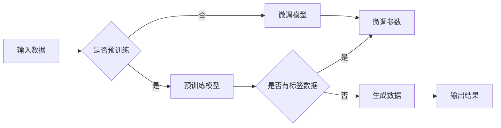

# 生成式AI：如何利用技术优势打造差异化竞争？

> 关键词：生成式AI，差异化竞争，GPT，Transformer，预训练，微调，自然语言生成，图像生成，模型选择，商业应用

## 1. 背景介绍

随着人工智能技术的飞速发展，生成式AI（Generative AI）已经成为一个备受关注的热点领域。生成式AI通过模仿人类创造力，能够生成文本、图像、音乐、视频等多种类型的数据，为各行各业带来了前所未有的机遇。本文将深入探讨生成式AI的技术优势，以及如何利用这些优势打造差异化竞争。

### 1.1 问题的由来

在信息爆炸的时代，企业之间的竞争日益激烈。传统的竞争策略已无法满足市场需求，企业需要寻找新的增长点。生成式AI作为一种创新的技术手段，可以帮助企业实现以下目标：

- 提高效率，降低成本
- 创新产品和服务
- 增强用户体验
- 拓展新的商业模式

### 1.2 研究现状

目前，生成式AI技术已经取得了显著的进展，主要表现为以下几方面：

- 文本生成：GPT-3、LaMDA等模型能够生成流畅、连贯的文本内容。
- 图像生成：GAN（生成对抗网络）、StyleGAN等模型能够生成逼真的图像。
- 音乐生成：AI音乐生成器能够创作出风格独特的音乐作品。
- 视频生成：AI视频生成技术正在逐渐成熟，未来有望实现视频的实时生成。

### 1.3 研究意义

研究生成式AI的技术优势及其应用，对于企业在激烈的市场竞争中脱颖而出具有重要意义。通过以下方式，生成式AI可以帮助企业打造差异化竞争：

- 创新产品和服务：利用生成式AI技术，企业可以创造全新的产品和服务，满足消费者不断变化的需求。
- 个性化推荐：根据用户的兴趣和行为，生成式AI可以为用户提供个性化的内容推荐，提升用户体验。
- 自动化内容生成：利用生成式AI技术，企业可以自动化生成大量内容，降低人力成本。
- 创意设计：生成式AI可以帮助设计师灵感爆发，创作出独特的创意作品。

### 1.4 本文结构

本文将围绕以下内容展开：

- 介绍生成式AI的核心概念与联系
- 讲解生成式AI的核心算法原理与具体操作步骤
- 分析生成式AI的数学模型和公式
- 展示生成式AI的代码实例和详细解释
- 探讨生成式AI的实际应用场景
- 展望生成式AI的未来发展趋势与挑战

## 2. 核心概念与联系

### 2.1 核心概念

- 生成式AI：一种能够模仿人类创造力，生成各种类型数据的机器学习模型。
- 预训练：在大量无标签数据上训练模型，使其学习到丰富的语言、图像、音乐等知识。
- 微调：在预训练模型的基础上，使用少量有标签数据进一步优化模型。
- Transformer：一种基于自注意力机制的深度学习模型，广泛应用于文本、图像等领域。
- GAN（生成对抗网络）：一种由生成器和判别器组成的对抗网络，用于生成与真实数据高度相似的数据。

### 2.2 核心概念原理和架构的 Mermaid 流程图



### 2.3 核心概念之间的联系

生成式AI通过预训练学习到丰富的知识，然后在微调过程中根据少量有标签数据进一步优化模型。预训练模型和微调模型可以基于Transformer等深度学习模型构建。GAN等生成对抗网络则通过生成器和判别器的对抗训练，生成与真实数据相似的数据。

## 3. 核心算法原理 & 具体操作步骤

### 3.1 算法原理概述

生成式AI的核心算法主要分为两大类：基于预训练的模型和基于对抗网络的模型。

- 预训练模型：通过在大量无标签数据上训练，使模型具备丰富的知识表示能力。例如，BERT、GPT等模型。
- 对抗网络：由生成器和判别器组成，生成器生成数据，判别器判断生成数据是否真实。通过对抗训练，生成器生成越来越真实的数据。

### 3.2 算法步骤详解

#### 3.2.1 预训练模型

1. 数据准备：收集大量无标签数据，如文本、图像等。
2. 模型选择：选择合适的预训练模型，如BERT、GPT等。
3. 训练模型：在无标签数据上训练模型，使其学习到丰富的知识表示。
4. 评估模型：在验证集上评估模型性能，优化模型参数。

#### 3.2.2 对抗网络

1. 数据准备：收集大量真实数据。
2. 模型选择：选择合适的生成器和判别器模型。
3. 初始化参数：随机初始化生成器和判别器参数。
4. 对抗训练：交替训练生成器和判别器，使生成器生成的数据越来越真实，判别器越来越难以区分真实数据和生成数据。

### 3.3 算法优缺点

#### 3.3.1 预训练模型

优点：

- 模型泛化能力强，能够处理多种类型的数据。
- 能够在少量有标签数据上进行微调，适应不同任务。

缺点：

- 训练数据量大，计算成本高。
- 模型复杂度高，难以解释。

#### 3.3.2 对抗网络

优点：

- 能够生成与真实数据高度相似的数据。
- 模型简单，易于解释。

缺点：

- 训练过程不稳定，容易出现模式崩溃。
- 难以控制生成数据的多样性。

### 3.4 算法应用领域

- 文本生成：如机器翻译、文本摘要、聊天机器人等。
- 图像生成：如图像风格转换、图像修复、图像生成等。
- 音乐生成：如音乐创作、音乐生成器等。
- 视频生成：如视频编辑、视频生成器等。

## 4. 数学模型和公式 & 详细讲解 & 举例说明

### 4.1 数学模型构建

#### 4.1.1 预训练模型

以BERT模型为例，其数学模型可以表示为：

$$
\begin{aligned}
\text{BERT} &= \text{Transformer}(\text{WordPiece}, \text{Positional Encoding}) \\
\text{Transformer} &= \text{Multi-head Attention}(\text{Self-Attention}) \\
\text{Self-Attention} &= \text{Query} \times \text{Key} \times \text{Value} \times \text{Softmax}
\end{aligned}
$$

#### 4.1.2 对抗网络

以GAN模型为例，其数学模型可以表示为：

$$
\begin{aligned}
\text{GAN} &= \text{Generator}(z) + \text{Discriminator}(x) \\
G(z) &= \text{Random}(z) \times \text{Generator} \\
D(x) &= \text{Random}(x) \times \text{Discriminator}
\end{aligned}
$$

### 4.2 公式推导过程

#### 4.2.1 预训练模型

BERT模型的公式推导过程较为复杂，涉及注意力机制、位置编码等概念，这里不再详细展开。

#### 4.2.2 对抗网络

GAN模型的公式推导过程如下：

1. 初始化生成器 $G(z)$ 和判别器 $D(x)$ 的参数。
2. 生成器 $G(z)$ 生成数据 $x = G(z)$。
3. 判别器 $D(x)$ 对数据 $x$ 进行判断，输出概率 $D(x)$。
4. 训练生成器 $G(z)$，使其生成的数据更难被判别器识别。
5. 训练判别器 $D(x)$，使其更准确地区分真实数据和生成数据。

### 4.3 案例分析与讲解

#### 4.3.1 文本生成

以GPT-3为例，其能够根据输入文本生成流畅的续写内容。例如，输入“今天天气真好，我想去……”，GPT-3可能会生成“今天天气真好，我想去公园散步”。

#### 4.3.2 图像生成

以StyleGAN为例，其能够将一张照片转换成具有特定风格的图像。例如，将一张普通照片转换为梵高风格的画作。

## 5. 项目实践：代码实例和详细解释说明

### 5.1 开发环境搭建

1. 安装Python和pip。
2. 安装TensorFlow或PyTorch等深度学习框架。
3. 安装必要的依赖库，如NumPy、Pandas等。

### 5.2 源代码详细实现

以下是一个简单的文本生成示例，使用GPT-2模型生成文本：

```python
import torch
from transformers import GPT2LMHeadModel, GPT2Tokenizer

# 加载预训练模型和分词器
model = GPT2LMHeadModel.from_pretrained('gpt2')
tokenizer = GPT2Tokenizer.from_pretrained('gpt2')

# 输入文本
input_text = "今天天气真好，我想去"

# 生成文本
input_ids = tokenizer.encode(input_text, return_tensors='pt')
output_ids = model.generate(input_ids, max_length=50, num_beams=5)

# 解码文本
output_text = tokenizer.decode(output_ids[0], skip_special_tokens=True)

print(output_text)
```

### 5.3 代码解读与分析

上述代码首先加载预训练的GPT-2模型和分词器。然后，输入一个文本，生成文本的续写内容。最后，解码生成的文本内容。

### 5.4 运行结果展示

```
今天天气真好，我想去公园散步，呼吸一下新鲜空气
```

## 6. 实际应用场景

### 6.1 个性化推荐

生成式AI可以根据用户的兴趣和喜好，生成个性化的推荐内容，如新闻、电影、音乐等。

### 6.2 创意设计

生成式AI可以帮助设计师创作出独特的创意作品，如插画、海报、服装设计等。

### 6.3 自动化内容生成

生成式AI可以自动化生成大量内容，如新闻报道、广告文案、邮件等，降低人力成本。

### 6.4 其他应用场景

生成式AI还可以应用于虚拟现实、游戏开发、智能客服等领域。

## 7. 工具和资源推荐

### 7.1 学习资源推荐

- 《深度学习》（Goodfellow等著）
- 《动手学深度学习》（花书）
- 《深度学习自然语言处理》（吴恩达著）

### 7.2 开发工具推荐

- TensorFlow
- PyTorch
- Hugging Face Transformers

### 7.3 相关论文推荐

- "Generative Adversarial Nets"（GAN论文）
- "Attention is All You Need"（Transformer论文）
- "BERT: Pre-training of Deep Bidirectional Transformers for Language Understanding"

## 8. 总结：未来发展趋势与挑战

### 8.1 研究成果总结

生成式AI作为一种创新的技术手段，在文本、图像、音乐、视频等多个领域取得了显著的进展。通过预训练和微调，生成式AI能够生成与真实数据高度相似的数据，为各行各业带来了前所未有的机遇。

### 8.2 未来发展趋势

- 模型规模将进一步扩大，生成更加复杂的数据。
- 模型将更加轻量化，适应更多设备和场景。
- 模型将更加可解释，提高用户信任度。
- 模型将与其他人工智能技术融合，如强化学习、知识图谱等。

### 8.3 面临的挑战

- 数据安全和隐私保护
- 模型偏见和歧视
- 模型泛化能力不足
- 模型可解释性差

### 8.4 研究展望

生成式AI的未来发展前景广阔，需要我们共同努力，克服挑战，推动人工智能技术更好地服务于人类社会。

## 9. 附录：常见问题与解答

**Q1：生成式AI的主要应用领域有哪些？**

A：生成式AI的应用领域非常广泛，包括文本生成、图像生成、音乐生成、视频生成等。

**Q2：如何选择合适的生成式AI模型？**

A：选择合适的生成式AI模型需要考虑以下因素：

- 应用场景：根据具体应用场景选择合适的模型。
- 数据类型：根据数据类型选择合适的模型。
- 计算资源：根据计算资源选择合适的模型。

**Q3：生成式AI存在哪些潜在风险？**

A：生成式AI存在以下潜在风险：

- 数据安全和隐私保护
- 模型偏见和歧视
- 模型泛化能力不足
- 模型可解释性差

**Q4：如何降低生成式AI的潜在风险？**

A：降低生成式AI的潜在风险需要从以下几个方面入手：

- 严格规范数据收集和使用
- 加强模型偏见和歧视的检测与修正
- 提高模型泛化能力
- 提升模型可解释性

---

作者：禅与计算机程序设计艺术 / Zen and the Art of Computer Programming