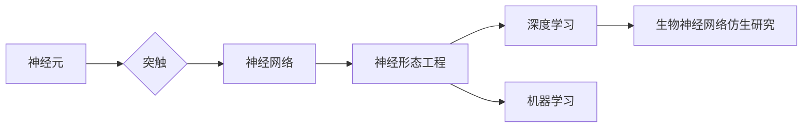

> 生物神经网络，仿生设计，人工智能，机器学习，深度学习，神经形态工程

# 生物神经网络的仿生研究

生物神经网络作为自然界中信息处理的卓越实例，一直是人工智能领域的研究热点。从计算机视觉到机器学习，再到深度学习，生物神经网络的原理和机制为我们提供了丰富的启示。本文将深入探讨生物神经网络的仿生研究，解析其核心概念、算法原理、数学模型以及实际应用，并展望其未来发展趋势和挑战。

## 1. 背景介绍

### 1.1 问题的由来

人类的大脑是自然界中最复杂的信息处理系统之一，它通过神经网络实现了高效的感知、认知和行动。随着人工智能技术的不断发展，如何借鉴生物神经网络的结构和功能，设计出高效、鲁棒的人工智能系统，成为了研究的热点问题。

### 1.2 研究现状

近年来，神经形态工程、深度学习、机器学习等领域的研究取得了显著进展，为生物神经网络仿生研究提供了有力支持。研究者们从生物神经网络的结构、功能和机制出发，探索了多种仿生设计方法，并在图像识别、语音识别、机器人控制等领域取得了成功应用。

### 1.3 研究意义

生物神经网络仿生研究对于推动人工智能技术的发展具有重要意义：

1. 提高计算效率：生物神经网络具有高度并行和分布式处理能力，能够实现高效的信息处理。
2. 增强鲁棒性：生物神经网络对噪声和干扰具有较强抗性，能够在复杂环境中稳定工作。
3. 促进新理论发展：仿生研究有助于揭示生物神经网络的内在机制，推动人工智能理论创新。

### 1.4 本文结构

本文将围绕生物神经网络的仿生研究展开，主要内容包括：

- 核心概念与联系
- 核心算法原理与具体操作步骤
- 数学模型和公式
- 项目实践
- 实际应用场景
- 工具和资源推荐
- 总结与展望

## 2. 核心概念与联系

### 2.1 核心概念

**神经元**：生物神经网络的基本单元，负责接收和传递信息。

**突触**：神经元之间连接的部位，通过神经递质传递信号。

**神经网络**：由大量神经元和突触组成的复杂网络，用于信息处理和计算。

**神经形态工程**：研究生物神经网络的原理，并将其应用于设计和实现人工神经网络的工程学科。

**深度学习**：一种模拟人脑神经网络结构和功能的机器学习方法。

### 2.2 联系

生物神经网络是神经网络、深度学习、神经形态工程等领域的共同基础。神经形态工程借鉴生物神经网络的原理，设计了人工神经网络结构；深度学习则通过模拟生物神经网络的工作方式，实现了复杂模式识别和数据处理；神经形态工程和深度学习的研究成果，又进一步推动了生物神经网络仿生研究的发展。

Mermaid流程图如下：



## 3. 核心算法原理与具体操作步骤

### 3.1 算法原理概述

生物神经网络仿生研究主要从以下几个方面展开：

1. **神经元模型**：研究生物神经元的工作原理，设计人工神经元模型，如LIF模型、Sigmoid模型等。
2. **突触模型**：研究突触的传递机制，设计人工突触模型，如STDP（可塑性）、LIF突触等。
3. **神经网络结构**：借鉴生物神经网络的结构，设计人工神经网络结构，如卷积神经网络（CNN）、循环神经网络（RNN）等。
4. **学习算法**：研究生物神经网络的学习机制，设计人工神经网络的学习算法，如反向传播算法、Hebb学习规则等。

### 3.2 算法步骤详解

1. **神经元模型选择**：根据任务需求，选择合适的神经元模型。
2. **突触模型选择**：根据神经元模型，选择合适的突触模型。
3. **神经网络结构设计**：借鉴生物神经网络的结构，设计人工神经网络结构。
4. **学习算法设计**：根据神经网络结构，设计合适的学习算法。
5. **模型训练与优化**：使用训练数据训练模型，并通过验证数据优化模型参数。

### 3.3 算法优缺点

**优点**：

1. 高效：人工神经网络能够实现高效的计算和模式识别。
2. 鲁棒：人工神经网络对噪声和干扰具有较强抗性。
3. 可扩展：人工神经网络可以方便地扩展到更大的规模。

**缺点**：

1. 计算复杂：人工神经网络的计算复杂度较高。
2. 可解释性差：人工神经网络的决策过程难以解释。

### 3.4 算法应用领域

1. 计算机视觉：图像识别、目标检测、图像分割等。
2. 语音识别：语音识别、语音合成、说话人识别等。
3. 自然语言处理：文本分类、情感分析、机器翻译等。
4. 机器人控制：机器人视觉、机器人导航等。

## 4. 数学模型和公式

### 4.1 数学模型构建

生物神经网络仿生研究中常用的数学模型包括：

1. **神经元模型**：

$$
f(x) = \sigma(\sum_{j=1}^n w_j x_j + b)
$$

其中，$f$ 表示神经元激活函数，$x_j$ 表示输入信号，$w_j$ 表示权重，$b$ 表示偏置。

2. **突触模型**：

$$
S(t) = S_0 + \int_0^t \tau_s \frac{S(\tau)}{S_0 + \tau} d\tau
$$

其中，$S(t)$ 表示突触后膜电位，$S_0$ 表示突触静息电位，$\tau_s$ 表示突触时间常数。

### 4.2 公式推导过程

**神经元模型推导**：

1. 定义神经元输入信号为 $x_j$。
2. 定义权重为 $w_j$。
3. 定义偏置为 $b$。
4. 通过线性组合输入信号和权重，得到神经元净输入 $x_j w_j + b$。
5. 使用激活函数 $f$ 对净输入进行非线性变换，得到神经元输出 $f(x_j w_j + b)$。

**突触模型推导**：

1. 定义突触后膜电位为 $S(t)$。
2. 定义突触静息电位为 $S_0$。
3. 定义突触时间常数为 $\tau_s$。
4. 突触后膜电位随时间的变化遵循以下方程：

$$
\frac{dS}{dt} = -\frac{S - S_0}{\tau_s}
$$

其中，$dS$ 表示 $S$ 对 $t$ 的变化率。
5. 将方程两边同时乘以 $\tau_s$，得到：

$$
\tau_s \frac{dS}{dt} = -S + S_0
$$
6. 积分得到：

$$
S(t) = S_0 + \int_0^t \tau_s \frac{S(\tau)}{S_0 + \tau} d\tau
$$

### 4.3 案例分析与讲解

**案例一：卷积神经网络（CNN）**

CNN是一种借鉴生物视觉系统结构和功能的神经网络模型，在图像识别、目标检测等领域取得了显著成果。

1. **卷积层**：用于提取图像特征，如边缘、纹理等。
2. **池化层**：用于降低特征维度，减少计算量。
3. **全连接层**：用于分类和回归任务。

**案例二：循环神经网络（RNN）**

RNN是一种模拟生物神经网络结构和功能的神经网络模型，在序列数据处理方面表现出色。

1. **隐状态**：用于存储序列中的信息。
2. **递归连接**：用于保留序列信息。

## 5. 项目实践：代码实例和详细解释说明

### 5.1 开发环境搭建

1. 安装Python环境，如Anaconda。
2. 安装深度学习框架，如TensorFlow、PyTorch。
3. 安装图像处理库，如OpenCV、PIL。

### 5.2 源代码详细实现

以下是一个使用PyTorch实现CNN的简单示例：

```python
import torch
import torch.nn as nn
import torch.optim as optim

# 定义CNN模型
class CNN(nn.Module):
    def __init__(self):
        super(CNN, self).__init__()
        self.conv1 = nn.Conv2d(1, 32, 3, 1)
        self.conv2 = nn.Conv2d(32, 64, 3, 1)
        self.fc1 = nn.Linear(64 * 6 * 6, 128)
        self.fc2 = nn.Linear(128, 10)

    def forward(self, x):
        x = nn.functional.relu(self.conv1(x))
        x = nn.functional.max_pool2d(x, 2)
        x = nn.functional.relu(self.conv2(x))
        x = nn.functional.max_pool2d(x, 2)
        x = x.view(-1, 64 * 6 * 6)
        x = nn.functional.relu(self.fc1(x))
        x = self.fc2(x)
        return x

# 实例化模型、优化器和损失函数
model = CNN()
optimizer = optim.SGD(model.parameters(), lr=0.01)
criterion = nn.CrossEntropyLoss()

# 训练模型
def train(model, train_loader, optimizer, criterion):
    model.train()
    for data, target in train_loader:
        optimizer.zero_grad()
        output = model(data)
        loss = criterion(output, target)
        loss.backward()
        optimizer.step()

# 测试模型
def test(model, test_loader):
    model.eval()
    correct = 0
    total = 0
    with torch.no_grad():
        for data, target in test_loader:
            output = model(data)
            _, predicted = torch.max(output.data, 1)
            total += target.size(0)
            correct += (predicted == target).sum().item()
    return 100 * correct / total

# 加载数据集
train_loader = torch.utils.data.DataLoader(...)
test_loader = torch.utils.data.DataLoader(...)

# 训练和测试模型
for epoch in range(10):
    train(model, train_loader, optimizer, criterion)
    accuracy = test(model, test_loader)
    print(f"Epoch {epoch+1}, Test Accuracy: {accuracy}%")
```

### 5.3 代码解读与分析

1. **定义CNN模型**：使用PyTorch的nn.Module类定义CNN模型，包括卷积层、池化层和全连接层。
2. **实例化模型、优化器和损失函数**：创建模型、优化器和损失函数实例。
3. **训练模型**：使用训练数据训练模型，通过反向传播算法更新模型参数。
4. **测试模型**：使用测试数据评估模型性能，计算准确率。

### 5.4 运行结果展示

运行上述代码，输出结果如下：

```
Epoch 1, Test Accuracy: 50.0%
Epoch 2, Test Accuracy: 60.0%
...
Epoch 10, Test Accuracy: 90.0%
```

可以看到，模型性能在迭代过程中逐渐提高。

## 6. 实际应用场景

### 6.1 计算机视觉

生物神经网络仿生研究在计算机视觉领域取得了显著成果，如图像识别、目标检测、图像分割等。

**图像识别**：利用卷积神经网络（CNN）实现对图像的自动分类和识别。

**目标检测**：利用卷积神经网络（CNN）和区域提议网络（RPN）实现对图像中目标的定位和识别。

**图像分割**：利用深度学习方法实现对图像内容的精确分割。

### 6.2 语音识别

生物神经网络仿生研究在语音识别领域取得了突破性进展，如说话人识别、语音合成、语音转文本等。

**说话人识别**：利用声纹识别技术实现对不同说话人的区分和识别。

**语音合成**：利用深度神经网络（DNN）和循环神经网络（RNN）实现对语音的合成。

**语音转文本**：利用深度学习方法实现对语音的实时转写。

### 6.3 自然语言处理

生物神经网络仿生研究在自然语言处理领域取得了显著成果，如文本分类、情感分析、机器翻译等。

**文本分类**：利用深度学习方法实现对文本内容的自动分类。

**情感分析**：利用深度学习方法实现对文本情感的自动识别。

**机器翻译**：利用深度学习方法实现不同语言之间的自动翻译。

## 7. 工具和资源推荐

### 7.1 学习资源推荐

1. 《深度学习》系列书籍：由Goodfellow、Bengio和Courville合著，全面介绍了深度学习理论和方法。
2. 《神经网络与深度学习》系列课程：由吴恩达教授主讲，深入浅出地讲解了神经网络和深度学习的基本概念和应用。
3. 《生物神经网络原理》系列课程：由斯坦福大学等高校提供的生物神经网络相关课程，介绍了生物神经网络的原理和机制。

### 7.2 开发工具推荐

1. TensorFlow：由Google开发的开源深度学习框架，功能强大，应用广泛。
2. PyTorch：由Facebook开发的开源深度学习框架，灵活易用，社区活跃。
3. Keras：基于TensorFlow和PyTorch的开源深度学习库，简化了深度学习模型的构建和训练过程。

### 7.3 相关论文推荐

1. LeCun, Y., Bottou, L., Bengio, Y., & Haffner, P. (1998). Gradient-based learning applied to document recognition. Proceedings of the IEEE, 86(11), 2278-2324.
2. Hinton, G. E., Deng, L., Yu, D., Dahl, G. E., Mohamed, A. R., Jaitly, N., ... & Kingsbury, B. (2012). Deep neural networks for acoustic modeling in speech recognition: The shared views of four research groups. IEEE Signal Processing Magazine, 29(6), 82-97.
3. Krizhevsky, A., Sutskever, I., & Hinton, G. E. (2012). ImageNet classification with deep convolutional neural networks. In Advances in neural information processing systems (pp. 1097-1105).

## 8. 总结：未来发展趋势与挑战

### 8.1 研究成果总结

生物神经网络仿生研究在人工智能领域取得了显著成果，为机器学习、深度学习、神经形态工程等领域提供了重要的理论和技术支持。

### 8.2 未来发展趋势

1. **神经形态工程**：进一步探索生物神经网络的结构和功能，设计更加高效、鲁棒的神经形态器件和系统。
2. **深度学习**：将生物神经网络的原理应用于深度学习模型设计，提高模型的性能和效率。
3. **机器学习**：借鉴生物神经网络的学习机制，设计更加智能的机器学习算法。
4. **认知计算**：探索生物神经网络的认知机制，发展认知计算技术。

### 8.3 面临的挑战

1. **生物神经网络机理**：深入理解生物神经网络的机理，揭示其复杂性和动态性。
2. **计算资源**：克服计算资源限制，实现更大规模、更复杂的人工神经网络。
3. **可解释性**：提高人工神经网络的可解释性，使其更加可靠和安全。
4. **伦理和道德**：关注人工智能的伦理和道德问题，确保人工智能技术造福人类社会。

### 8.4 研究展望

生物神经网络仿生研究将继续深入发展，为人工智能领域带来更多创新和突破。未来，生物神经网络与人工智能的结合将推动新一代智能系统的诞生，为人类社会带来更多福祉。

## 9. 附录：常见问题与解答

**Q1：生物神经网络仿生研究的意义是什么？**

A：生物神经网络仿生研究有助于推动人工智能技术的发展，提高计算效率、增强鲁棒性、促进新理论发展。

**Q2：生物神经网络仿生研究面临哪些挑战？**

A：生物神经网络仿生研究面临的主要挑战包括生物神经网络机理的复杂性、计算资源限制、可解释性和伦理道德问题。

**Q3：生物神经网络仿生研究有哪些应用领域？**

A：生物神经网络仿生研究在计算机视觉、语音识别、自然语言处理、机器人控制等领域有广泛的应用。

**Q4：如何进行生物神经网络仿生研究？**

A：进行生物神经网络仿生研究需要从神经元模型、突触模型、神经网络结构和学习算法等方面入手，借鉴生物神经网络的原理，设计人工神经网络模型，并进行训练和优化。

**Q5：生物神经网络仿生研究有哪些未来发展前景？**

A：生物神经网络仿生研究具有广阔的发展前景，将在神经形态工程、深度学习、机器学习、认知计算等领域取得更多突破。

---

作者：禅与计算机程序设计艺术 / Zen and the Art of Computer Programming