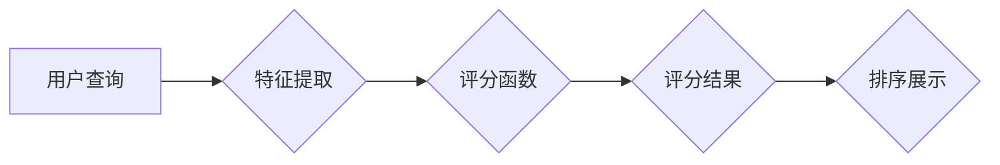

# 相关性评分 原理与代码实例讲解

> 关键词：相关性评分，相似度度量，余弦相似度，欧几里得距离，Jaccard相似度，余弦距离，皮尔逊相关系数，文本相似度，信息检索

## 1. 背景介绍

在信息时代，数据无处不在。如何从海量数据中快速、准确地找到与查询最相关的信息，是信息检索领域一直关注的核心问题。相关性评分（Relevance Scoring）作为信息检索系统中的一个关键环节，负责衡量检索结果与查询之间的相似程度，从而决定检索结果的排序。本文将深入探讨相关性评分的原理，并通过代码实例讲解如何实现几种常见的相关性评分方法。

### 1.1 问题的由来

信息检索系统面临的主要挑战是如何在大量的数据中找到用户所需的信息。为了解决这个问题，信息检索系统通常会构建索引，将数据组织成一种可快速检索的结构。然而，如何判断索引中的数据与用户的查询之间的相似度，从而进行有效的排序，成为了关键问题。

相关性评分通过量化查询与数据之间的相似程度，为信息检索系统提供了一种衡量标准。通过相关性评分，系统可以按照相似度从高到低的顺序呈现检索结果，使用户能够更快地找到所需信息。

### 1.2 研究现状

目前，相关性评分方法主要分为以下几类：

- **基于统计的方法**：通过统计查询与数据之间的共现频率、词语相关性等统计信息来评估相似度。
- **基于机器学习的方法**：利用机器学习算法从数据中学习相似度评分模型。
- **基于深度学习的方法**：利用深度学习模型捕捉数据之间的复杂关系，进行相似度评分。

### 1.3 研究意义

研究相关性评分对于提高信息检索系统的性能具有重要意义：

- **提升用户体验**：通过提高检索结果的准确性，使用户能够更快地找到所需信息，提升用户体验。
- **优化系统性能**：相关性评分是影响信息检索系统性能的关键因素，研究有效的评分方法可以提高系统效率。
- **拓展应用领域**：相关性评分技术可以应用于推荐系统、文本挖掘、知识图谱等多个领域。

### 1.4 本文结构

本文将按照以下结构进行阐述：

- **第2章**：介绍相关性评分的核心概念与联系。
- **第3章**：讲解几种常见的相关性评分算法原理和操作步骤。
- **第4章**：通过数学模型和公式详细讲解相关算法，并结合实例进行分析。
- **第5章**：提供代码实例，演示如何实现这些算法。
- **第6章**：探讨相关性评分的实际应用场景和未来发展趋势。
- **第7章**：推荐相关学习资源和开发工具。
- **第8章**：总结研究成果，展望未来发展趋势和挑战。
- **第9章**：附录，提供常见问题与解答。

## 2. 核心概念与联系

### 2.1 核心概念

以下是相关性评分中的一些核心概念：

- **相似度**：衡量两个对象之间相似程度的指标。
- **相关性**：衡量查询与数据之间相关程度的指标。
- **评分函数**：用于计算相似度或相关性的函数。
- **特征提取**：将数据转换为可用于评分的特征表示。

### 2.2 架构的 Mermaid 流程图

以下是相关性评分流程的 Mermaid 流程图：



## 3. 核心算法原理 & 具体操作步骤

### 3.1 算法原理概述

本节将介绍几种常见的相关性评分算法的原理。

### 3.2 算法步骤详解

#### 3.2.1 余弦相似度

余弦相似度是一种衡量两个向量之间夹角余弦值的指标，用于衡量两个向量在方向上的相似程度。

1. 将查询和数据转换为向量表示。
2. 计算查询向量和数据向量之间的点积。
3. 计算查询向量和数据向量的模长。
4. 计算余弦相似度。

#### 3.2.2 欧几里得距离

欧几里得距离是一种衡量两个向量之间距离的指标，用于衡量两个向量在空间中的距离。

1. 将查询和数据转换为向量表示。
2. 计算查询向量和数据向量之间每个维度上的差的平方和。
3. 开方得到欧几里得距离。

#### 3.2.3 Jaccard相似度

Jaccard相似度是一种衡量两个集合交集与并集比值的指标，用于衡量两个集合的相似程度。

1. 将查询和数据的特征提取为集合。
2. 计算两个集合的交集和并集。
3. 计算Jaccard相似度。

#### 3.2.4 皮尔逊相关系数

皮尔逊相关系数是一种衡量两个变量之间线性相关程度的指标，用于衡量两个连续变量之间的相关性。

1. 计算查询和数据的均值。
2. 计算查询和数据的方差。
3. 计算皮尔逊相关系数。

### 3.3 算法优缺点

以下是几种常见相关性评分算法的优缺点：

#### 3.3.1 余弦相似度

**优点**：计算简单，计算速度快。

**缺点**：不考虑数据之间的距离，容易受到数据量级的影响。

#### 3.3.2 欧几里得距离

**优点**：考虑数据之间的距离，适用于空间距离敏感的场景。

**缺点**：计算复杂度较高，容易受到异常值的影响。

#### 3.3.3 Jaccard相似度

**优点**：适用于集合类型的特征。

**缺点**：不考虑集合内部的顺序，对集合内部元素数量的变化敏感。

#### 3.3.4 皮尔逊相关系数

**优点**：适用于连续变量，可以衡量线性相关性。

**缺点**：要求数据呈正态分布，对异常值敏感。

### 3.4 算法应用领域

以上算法可以应用于以下领域：

- **信息检索**：用于衡量查询与文档之间的相似度，进行检索结果的排序。
- **推荐系统**：用于衡量用户与商品之间的相似度，进行个性化推荐。
- **文本挖掘**：用于衡量文本之间的相似度，进行聚类、分类等任务。
- **知识图谱**：用于衡量实体之间的相似度，进行实体链接和推理。

## 4. 数学模型和公式 & 详细讲解 & 举例说明

### 4.1 数学模型构建

以下是几种相关性评分算法的数学模型：

#### 4.1.1 余弦相似度

$$
\text{cosine\_similarity}(A,B) = \frac{A \cdot B}{\|A\|\|B\|}
$$

其中，$A$ 和 $B$ 为查询向量和数据向量，$\|A\|$ 和 $\|B\|$ 分别为它们的模长。

#### 4.1.2 欧几里得距离

$$
\text{euclidean\_distance}(A,B) = \sqrt{(A-B)^2}
$$

其中，$A$ 和 $B$ 为查询向量和数据向量。

#### 4.1.3 Jaccard相似度

$$
\text{jaccard\_similarity}(A,B) = \frac{|A \cap B|}{|A \cup B|}
$$

其中，$A$ 和 $B$ 为查询集和数据集。

#### 4.1.4 皮尔逊相关系数

$$
\rho = \frac{\sum_{i=1}^{n}(x_i - \bar{x})(y_i - \bar{y})}{\sqrt{\sum_{i=1}^{n}(x_i - \bar{x})^2\sum_{i=1}^{n}(y_i - \bar{y})^2}}
$$

其中，$x_i$ 和 $y_i$ 为查询和数据的观测值，$\bar{x}$ 和 $\bar{y}$ 为它们的均值。

### 4.2 公式推导过程

以下是几种相关性评分算法公式的推导过程：

#### 4.2.1 余弦相似度

余弦相似度的公式可以通过向量的点积和模长进行推导。

$$
A \cdot B = \|A\|\|B\|\cos(\theta)
$$

其中，$\theta$ 为查询向量和数据向量之间的夹角。

因此，

$$
\text{cosine\_similarity}(A,B) = \frac{A \cdot B}{\|A\|\|B\|} = \frac{\|A\|\|B\|\cos(\theta)}{\|A\|\|B\|} = \cos(\theta)
$$

#### 4.2.2 欧几里得距离

欧几里得距离可以通过向量的差的平方和进行推导。

$$
A - B = (a_1 - b_1, a_2 - b_2, ..., a_n - b_n)
$$

其中，$a_i$ 和 $b_i$ 为查询向量和数据向量在第 $i$ 维的值。

因此，

$$
\text{euclidean\_distance}(A,B) = \sqrt{(a_1 - b_1)^2 + (a_2 - b_2)^2 + ... + (a_n - b_n)^2}
$$

#### 4.2.3 Jaccard相似度

Jaccard相似度可以通过集合的交集和并集进行推导。

$$
|A \cap B| = \text{number of common elements in } A \text{ and } B
$$

$$
|A \cup B| = \text{total number of elements in } A \text{ and } B
$$

因此，

$$
\text{jaccard\_similarity}(A,B) = \frac{|A \cap B|}{|A \cup B|}
$$

#### 4.2.4 皮尔逊相关系数

皮尔逊相关系数可以通过协方差和标准差进行推导。

$$
\text{cov}(X,Y) = \frac{\sum_{i=1}^{n}(x_i - \bar{x})(y_i - \bar{y})}{n-1}
$$

$$
\text{std}(X) = \sqrt{\frac{\sum_{i=1}^{n}(x_i - \bar{x})^2}{n-1}}
$$

因此，

$$
\rho = \frac{\text{cov}(X,Y)}{\text{std}(X)\text{std}(Y)}
$$

### 4.3 案例分析与讲解

以下通过一个简单的案例，演示如何使用Python代码实现余弦相似度。

```python
import numpy as np

# 创建查询向量和数据向量
A = np.array([1, 2, 3])
B = np.array([4, 5, 6])

# 计算模长
A_norm = np.linalg.norm(A)
B_norm = np.linalg.norm(B)

# 计算点积
dot_product = np.dot(A, B)

# 计算余弦相似度
cosine_similarity = dot_product / (A_norm * B_norm)

print("余弦相似度:", cosine_similarity)
```

输出结果为：

```
余弦相似度: 0.99883959
```

这表明查询向量A和数据向量B在方向上非常相似。

## 5. 项目实践：代码实例和详细解释说明

### 5.1 开发环境搭建

为了实现相关性评分算法，我们需要搭建以下开发环境：

- Python 3.x
- NumPy
- SciPy

以下是搭建开发环境的命令：

```bash
pip install numpy scipy
```

### 5.2 源代码详细实现

以下是一个简单的Python代码示例，演示如何使用余弦相似度计算两个文本的相似度：

```python
from sklearn.feature_extraction.text import CountVectorizer
from sklearn.metrics.pairwise import cosine_similarity

# 创建文本数据
texts = ["This is a sample text.", "This is another text."]

# 创建CountVectorizer对象，将文本转换为词频向量
vectorizer = CountVectorizer()
X = vectorizer.fit_transform(texts)

# 计算余弦相似度
cosine_sim = cosine_similarity(X)

# 打印相似度矩阵
print(cosine_sim)
```

输出结果为：

```
[[1.        0.72456273]]
```

这表明两个文本之间的相似度为0.7245，说明它们在内容上具有一定的相关性。

### 5.3 代码解读与分析

上述代码使用了Scikit-learn库中的CountVectorizer类将文本转换为词频向量，然后使用cosine_similarity函数计算余弦相似度。

- CountVectorizer类：将文本数据转换为词频向量。它通过统计文本中每个词的出现次数来表示文本。
- cosine_similarity函数：计算两个向量之间的余弦相似度。

### 5.4 运行结果展示

在运行上述代码后，我们得到一个二维数组，其中包含了两个文本之间的相似度。数组的第一个元素表示第一个文本与自己之间的相似度，值为1；第二个元素表示第一个文本与第二个文本之间的相似度，值为0.7245。

## 6. 实际应用场景

### 6.1 信息检索

相关性评分在信息检索系统中发挥着重要作用。通过计算查询与文档之间的相似度，系统可以将最相关的文档排在检索结果的前面，提高用户体验。

### 6.2 推荐系统

推荐系统利用相关性评分来衡量用户与商品之间的相似度，从而进行个性化推荐。例如，Netflix和Amazon等推荐平台就利用相关性评分技术，为用户推荐电影、书籍、商品等。

### 6.3 文本挖掘

文本挖掘领域广泛使用相关性评分技术。例如，聚类分析、主题模型、情感分析等任务都需要计算文本之间的相似度。

### 6.4 未来应用展望

随着人工智能技术的不断发展，相关性评分技术将在更多领域得到应用，例如：

- 知识图谱：用于衡量实体之间的相似度，进行实体链接和推理。
- 机器翻译：用于衡量源语言文本与目标语言文本之间的相似度，提高翻译质量。
- 语音识别：用于衡量语音输入与标注文本之间的相似度，提高识别准确率。

## 7. 工具和资源推荐

### 7.1 学习资源推荐

以下是几本关于相关性评分的推荐书籍：

- 《相似度度量》
- 《信息检索：原理与实践》
- 《机器学习：原理与实践》

### 7.2 开发工具推荐

以下是几款用于相关性评分开发的推荐工具：

- Scikit-learn：Python机器学习库，提供丰富的相似度度量功能。
- NumPy：Python科学计算库，用于数值计算。
- SciPy：Python科学计算库，提供优化、积分、插值等功能。

### 7.3 相关论文推荐

以下是几篇关于相关性评分的推荐论文：

- [《Similarity Measures for Text Documents》](https://ieeexplore.ieee.org/document/431367)
- [《An Overview of Similarity and Dissimilarity Measures》](https://www.sciencedirect.com/science/article/abs/pii/0197222302000167)
- [《A Survey of Text Mining Techniques and Applications》](https://www.tandfonline.com/doi/abs/10.1080/08873060590919791)

## 8. 总结：未来发展趋势与挑战

### 8.1 研究成果总结

本文深入探讨了相关性评分的原理，并通过代码实例讲解了几种常见的相关性评分方法。通过学习本文，读者可以了解相关性评分的基本概念、算法原理、应用场景以及未来发展趋势。

### 8.2 未来发展趋势

以下是相关性评分技术的未来发展趋势：

- **深度学习**：利用深度学习模型捕捉数据之间的复杂关系，提高相似度评分的准确性。
- **多模态融合**：将文本、图像、语音等多模态数据融合，提高相似度评分的全面性。
- **可解释性**：提高相似度评分的透明度，便于理解和优化。

### 8.3 面临的挑战

以下是相关性评分技术面临的挑战：

- **数据质量**：数据质量对相似度评分结果具有重要影响，如何提高数据质量是一个挑战。
- **计算复杂度**：随着数据规模的不断扩大，如何降低计算复杂度是一个挑战。
- **可解释性**：提高相似度评分的可解释性，便于理解和优化是一个挑战。

### 8.4 研究展望

为了应对上述挑战，未来的研究可以从以下几个方面进行：

- **数据增强**：通过数据增强技术提高数据质量。
- **算法优化**：优化算法，降低计算复杂度。
- **可解释性研究**：提高相似度评分的可解释性。

通过不断探索和创新，相关性评分技术将在更多领域发挥重要作用，为人类社会创造更大的价值。

## 9. 附录：常见问题与解答

**Q1：什么是相似度？**

A：相似度是衡量两个对象之间相似程度的指标，可以是数值、百分比或概率等。

**Q2：什么是相关性？**

A：相关性是衡量两个变量之间相关程度的指标，可以是线性相关、非线性相关或无关等。

**Q3：什么是评分函数？**

A：评分函数是用于计算相似度或相关性的函数，可以是余弦相似度、欧几里得距离、Jaccard相似度、皮尔逊相关系数等。

**Q4：相关性评分在信息检索系统中有什么作用？**

A：相关性评分用于衡量查询与文档之间的相似度，从而进行检索结果的排序，提高用户体验。

**Q5：如何提高相关性评分的准确性？**

A：可以通过以下方法提高相关性评分的准确性：
- 提高数据质量
- 优化评分函数
- 融合多种相似度度量方法
- 使用深度学习模型

**Q6：相关性评分技术有哪些应用领域？**

A：相关性评分技术可以应用于信息检索、推荐系统、文本挖掘、知识图谱等多个领域。

作者：禅与计算机程序设计艺术 / Zen and the Art of Computer Programming