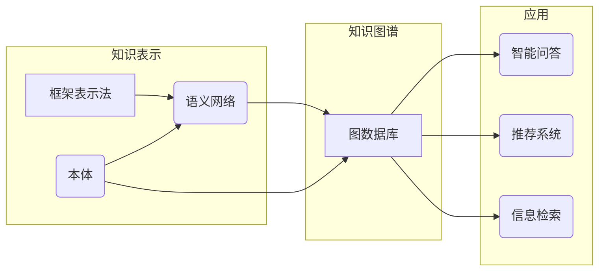

# 知识表示与知识图谱原理与代码实战案例讲解

> 关键词：知识表示，知识图谱，本体，语义网络，图数据库，Neo4j，Python，实体链接，推理，推荐系统

## 1. 背景介绍

在信息爆炸的时代，如何有效地组织和理解大量信息成为了关键问题。知识表示与知识图谱技术应运而生，它们通过将信息转化为结构化的知识，为智能系统提供更强的语义理解和推理能力。本文将深入探讨知识表示与知识图谱的原理，并通过实战案例讲解如何使用Python和图数据库Neo4j进行知识图谱的构建和应用。

### 1.1 问题的由来

随着互联网的普及和数据量的激增，传统的数据库和搜索引擎在处理复杂关系和语义理解方面逐渐显得力不从心。知识表示与知识图谱技术通过将信息转化为结构化的知识网络，能够更好地支持智能问答、推荐系统、信息检索等应用。

### 1.2 研究现状

知识表示与知识图谱技术已经广泛应用于金融、医疗、政府、教育等多个领域。常见的知识表示方法包括框架表示法、语义网络、本体等。知识图谱则通常基于图数据库构建，如Neo4j、JanusGraph等。

### 1.3 研究意义

研究知识表示与知识图谱技术对于以下方面具有重要意义：

- 提高信息检索和处理的效率和质量。
- 支持智能问答、推荐系统等智能应用。
- 帮助企业和组织更好地管理和利用知识资产。

### 1.4 本文结构

本文将分为以下几个部分：

- 核心概念与联系：介绍知识表示与知识图谱的相关概念和关系。
- 核心算法原理：讲解知识表示与知识图谱的构建方法和算法。
- 代码实战案例：通过Python和Neo4j构建知识图谱，并展示应用案例。
- 实际应用场景：探讨知识表示与知识图谱在实际领域的应用。
- 工具和资源推荐：推荐相关学习资源和开发工具。
- 总结：总结研究成果，展望未来发展趋势和挑战。

## 2. 核心概念与联系

### 2.1 核心概念

#### 2.1.1 知识表示

知识表示是指将人类知识转化为机器可以理解的形式。常见的知识表示方法包括：

- **框架表示法**：使用框架来表示实体、属性和关系。
- **语义网络**：使用节点表示实体，边表示关系，并通过边上的属性描述关系的性质。
- **本体**：一组概念及其关系的集合，用于描述某个领域的知识。

#### 2.1.2 知识图谱

知识图谱是一种用于存储和表示知识的图结构。它由实体、关系和属性组成，可以直观地展示实体之间的关系。

### 2.2 核心概念原理和架构的 Mermaid 流程图



### 2.3 核心概念之间的关系

知识表示是构建知识图谱的基础，而知识图谱则为智能应用提供了强大的语义支持。框架表示法、语义网络和本体都是知识表示的方法，它们可以用于构建知识图谱。图数据库则是存储和查询知识图谱的载体，而智能问答、推荐系统和信息检索则是知识图谱的应用领域。

## 3. 核心算法原理 & 具体操作步骤

### 3.1 算法原理概述

知识图谱的构建主要包括以下几个步骤：

1. **数据采集**：从各种数据源收集实体、关系和属性信息。
2. **数据清洗**：对采集到的数据进行去重、去噪等处理。
3. **实体链接**：将文本中的实体与知识图谱中的实体进行匹配。
4. **知识抽取**：从文本中抽取实体、关系和属性信息。
5. **知识存储**：将构建的知识存储到图数据库中。
6. **知识推理**：利用图数据库的推理能力，发现新的知识。

### 3.2 算法步骤详解

#### 3.2.1 数据采集

数据采集可以从多种来源获取，如维基百科、行业报告、学术论文等。

#### 3.2.2 数据清洗

数据清洗包括去除重复数据、处理缺失值、规范命名等。

#### 3.2.3 实体链接

实体链接是指将文本中的实体与知识图谱中的实体进行匹配。常用的实体链接方法包括基于规则的方法、基于统计的方法和基于深度学习的方法。

#### 3.2.4 知识抽取

知识抽取是指从文本中抽取实体、关系和属性信息。常用的知识抽取方法包括命名实体识别、关系抽取和属性抽取。

#### 3.2.5 知识存储

知识存储是指将构建的知识存储到图数据库中。Neo4j是一个流行的图数据库，它支持基于Cypher的查询语言。

#### 3.2.6 知识推理

知识推理是指利用图数据库的推理能力，发现新的知识。Neo4j支持多种推理算法，如路径查询、规则推理等。

### 3.3 算法优缺点

#### 3.3.1 优点

- 提高信息检索和处理的效率和质量。
- 支持智能问答、推荐系统等智能应用。
- 帮助企业和组织更好地管理和利用知识资产。

#### 3.3.2 缺点

- 数据采集和清洗需要大量人力成本。
- 实体链接和知识抽取的准确率受文本质量影响。
- 知识图谱的构建和维护需要一定的技术门槛。

### 3.4 算法应用领域

知识图谱技术可以应用于以下领域：

- 智能问答
- 推荐系统
- 信息检索
- 语义搜索
- 语义理解

## 4. 数学模型和公式 & 详细讲解 & 举例说明

### 4.1 数学模型构建

知识图谱的构建涉及到多种数学模型，如图论、概率论、统计学习等。

#### 4.1.1 图论

图论是知识图谱构建的基础，用于描述实体和关系之间的结构。

#### 4.1.2 概率论

概率论用于评估实体链接和知识抽取的准确率。

#### 4.1.3 统计学习

统计学习用于训练实体链接和知识抽取的模型。

### 4.2 公式推导过程

由于知识图谱构建涉及到的数学模型较为复杂，以下仅以实体链接中常用的余弦相似度公式为例进行讲解：

$$
\text{cosine\_similarity}(x,y) = \frac{x \cdot y}{\|x\| \|y\|}
$$

其中，$x$ 和 $y$ 分别为两个向量的表示，$\|x\|$ 和 $\|y\|$ 分别为两个向量的模长。

### 4.3 案例分析与讲解

#### 4.3.1 案例背景

假设我们要构建一个关于电影的知识图谱，其中包含演员、电影、导演等实体，以及出演、导演等关系。

#### 4.3.2 案例实现

首先，我们需要采集电影数据，可以使用公开的IMDb数据库。然后，对数据进行清洗，去除重复和错误的信息。接下来，使用实体链接技术将文本中的实体与知识图谱中的实体进行匹配。最后，使用知识抽取技术从文本中抽取实体、关系和属性信息，并存储到Neo4j图数据库中。

### 4.4 常见问题解答

#### Q1：什么是实体链接？

A1：实体链接是指将文本中的实体与知识图谱中的实体进行匹配的过程。

#### Q2：什么是知识抽取？

A2：知识抽取是指从文本中抽取实体、关系和属性信息的过程。

#### Q3：如何评估实体链接和知识抽取的准确率？

A3：可以通过比较系统输出的结果与人工标注的结果来评估实体链接和知识抽取的准确率。

## 5. 项目实践：代码实例和详细解释说明

### 5.1 开发环境搭建

为了进行知识图谱的构建和应用，我们需要以下开发环境：

- Python
- Neo4j
- Neo4j Python Driver
- spaCy (可选，用于文本处理)

### 5.2 源代码详细实现

以下是一个简单的知识图谱构建示例，使用Python和Neo4j：

```python
from neo4j import GraphDatabase
from spacy import displacy

# 连接到Neo4j数据库
driver = GraphDatabase.driver("bolt://localhost:7687", auth=("neo4j", "password"))

# 创建一个会话
session = driver.session()

# 创建节点和关系
session.run("CREATE (actor:Actor {name: 'Tom Hanks'})")
session.run("CREATE (movie:Movie {title: 'Forrest Gump'})")
session.run("CREATE (director:Director {name: 'Robert Zemeckis'})")
session.run("CREATE (actor)-[:ACTED_IN]->(movie)")
session.run("CREATE (movie)-[:DIRECTED_BY]->(director)")

# 关闭会话
session.close()

# 使用spaCy进行文本处理
import spacy

nlp = spacy.load("en_core_web_sm")

# 解析文本
doc = nlp("Tom Hanks starred in the movie Forrest Gump, which was directed by Robert Zemeckis.")

# 显示解析结果
displacy.render(doc, style="ent")

# 查询Neo4j数据库
for result in session.run("MATCH (n) RETURN n"):
    print(result)

# 关闭数据库连接
driver.close()
```

### 5.3 代码解读与分析

上述代码演示了如何使用Python和Neo4j创建一个简单的知识图谱，并使用spaCy进行文本解析。首先，我们连接到Neo4j数据库，并创建三个节点：演员、电影和导演。然后，我们创建三个节点之间的关系：出演、导演。接下来，我们使用spaCy解析一个文本，并使用displacy显示解析结果。最后，我们查询Neo4j数据库，并打印出所有节点的信息。

### 5.4 运行结果展示

运行上述代码后，Neo4j数据库中将创建三个节点和三个关系。同时，spaCy将解析文本并显示解析结果。最后，我们将查询Neo4j数据库，并打印出所有节点的信息。

## 6. 实际应用场景

知识图谱技术可以应用于以下实际场景：

### 6.1 智能问答

知识图谱可以为智能问答系统提供强大的语义支持，使得系统能够理解用户的问题，并从知识图谱中检索出相关答案。

### 6.2 推荐系统

知识图谱可以用于推荐系统，通过分析用户和物品之间的关系，为用户推荐更加精准的物品。

### 6.3 信息检索

知识图谱可以提高信息检索的效率和准确性，使得用户能够更快地找到所需信息。

### 6.4 语义搜索

知识图谱可以用于语义搜索，使得用户能够通过自然语言进行搜索，并得到更加精准的搜索结果。

## 7. 工具和资源推荐

### 7.1 学习资源推荐

- 《图数据库技术实战》
- 《Neo4j图数据库实战》
- 《自然语言处理与知识图谱》
- 《知识图谱与推理》

### 7.2 开发工具推荐

- Neo4j
- Python
- spaCy
- Jieba (中文分词)

### 7.3 相关论文推荐

- 《知识图谱构建与推理方法综述》
- 《实体链接技术综述》
- 《知识抽取技术综述》

## 8. 总结：未来发展趋势与挑战

### 8.1 研究成果总结

本文介绍了知识表示与知识图谱的原理、构建方法和应用案例。通过Python和Neo4j，我们可以构建和查询简单的知识图谱，并将其应用于智能问答、推荐系统、信息检索等领域。

### 8.2 未来发展趋势

- 知识图谱将更加开放和互联，实现不同知识图谱之间的数据共享和互操作。
- 知识图谱将与其他人工智能技术深度融合，如自然语言处理、机器学习等。
- 知识图谱将更加注重伦理和隐私保护，确保知识图谱的安全和可靠。

### 8.3 面临的挑战

- 数据质量和一致性：确保知识图谱的质量和一致性是构建知识图谱的挑战之一。
- 知识获取和更新：随着知识的不断更新，如何高效地获取和更新知识图谱是一个难题。
- 知识推理和解释：如何从知识图谱中推理出新的知识和解释推理结果是一个挑战。

### 8.4 研究展望

未来，知识表示与知识图谱技术将在以下方面取得更多进展：

- 开发更加高效的知识抽取和实体链接技术。
- 研究知识图谱的推理和解释方法。
- 探索知识图谱在更多领域的应用。

## 9. 附录：常见问题与解答

#### Q1：什么是知识表示？

A1：知识表示是指将人类知识转化为机器可以理解的形式。

#### Q2：什么是知识图谱？

A2：知识图谱是一种用于存储和表示知识的图结构。

#### Q3：如何构建知识图谱？

A3：构建知识图谱的步骤包括数据采集、数据清洗、实体链接、知识抽取、知识存储和知识推理。

#### Q4：知识图谱有哪些应用？

A4：知识图谱可以应用于智能问答、推荐系统、信息检索等领域。

#### Q5：如何评估知识图谱的质量？

A5：可以通过比较系统输出的结果与人工标注的结果来评估知识图谱的质量。

---

作者：禅与计算机程序设计艺术 / Zen and the Art of Computer Programming