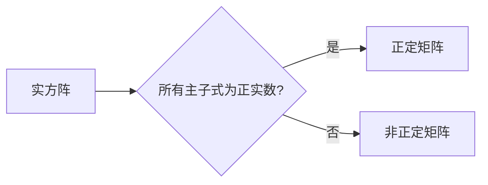

# 矩阵理论与应用：主子式皆为正实数的实方阵

> 关键词：矩阵理论，实方阵，主子式，正实数，线性代数，特征值，谱理论，应用实例

## 1. 背景介绍

矩阵理论是线性代数的一个重要分支，它在物理学、工程学、经济学和计算机科学等领域有着广泛的应用。在矩阵理论中，实方阵及其特性是一个基础且重要的研究课题。特别是，那些所有主子式皆为正实数的实方阵，在数学分析和实际应用中具有特殊的意义。这类方阵通常被称为正定矩阵，它们在求解线性方程组、优化问题以及稳定性分析等方面扮演着关键角色。

### 1.1 问题的由来

矩阵理论的起源可以追溯到19世纪，当时的数学家们开始研究线性方程组的解法。随着时间的推移，矩阵理论逐渐发展成为一个独立的数学分支。实方阵的研究始于对二次型的研究，而主子式的研究则是二次型理论的一个自然延伸。

### 1.2 研究现状

目前，关于主子式皆为正实数的实方阵的研究已经相当成熟。研究人员已经发展出了多种判定实方阵是否为正定的方法，并且在理论分析和实际应用中都有广泛的应用。

### 1.3 研究意义

研究主子式皆为正实数的实方阵对于以下方面具有重要意义：

- **数学理论**：有助于深入理解二次型理论，完善线性代数的理论体系。
- **工程应用**：在结构分析、控制理论等领域，正定矩阵保证了系统稳定性和最优控制。
- **经济学**：在优化理论中，正定矩阵保证了二次规划的解的存在性和唯一性。

### 1.4 本文结构

本文将按照以下结构进行讨论：

- 第2部分介绍矩阵理论和主子式的核心概念。
- 第3部分阐述主子式皆为正实数的实方阵的核心算法原理。
- 第4部分通过数学模型和公式详细讲解正定矩阵的判定方法。
- 第5部分展示代码实例和详细解释说明。
- 第6部分探讨正定矩阵在实际应用场景中的案例。
- 第7部分推荐相关学习和开发资源。
- 第8部分总结研究成果，展望未来发展趋势和挑战。
- 第9部分提供常见问题与解答。

## 2. 核心概念与联系

### 2.1 矩阵

矩阵是数学中的一种数组结构，它由一系列的数字排列成一个矩形。矩阵可以用于表示线性方程组、变换以及各种数学关系。

### 2.2 主子式

一个方阵的任意阶主子式是指从该方阵中取出任意行和列组成的子矩阵的行列式。

### 2.3 实方阵

实方阵是指所有元素都是实数的方阵。

### 2.4 正实数

正实数是指大于零的实数。

### 2.5 Mermaid流程图

以下是主子式皆为正实数的实方阵的核心概念原理和架构的Mermaid流程图：



## 3. 核心算法原理 & 具体操作步骤

### 3.1 算法原理概述

判定一个实方阵是否为正定矩阵的核心原理在于检查其所有主子式的符号性。如果所有主子式都是正实数，则该方阵是正定的。

### 3.2 算法步骤详解

1. **计算主子式**：对于方阵 $A$，计算所有可能的 $k \times k$ 阶主子式的行列式。
2. **检查符号性**：检查每个主子式的值是否为正实数。
3. **判定结果**：如果所有主子式都是正实数，则判定方阵 $A$ 为正定矩阵；否则，判定为非正定矩阵。

### 3.3 算法优缺点

**优点**：

- 算法简单，易于实现。
- 对于正定矩阵的判定，准确无误。

**缺点**：

- 计算量较大，尤其是对于高阶方阵。
- 对于非正定矩阵，无法判断其类型（如半正定或负定）。

### 3.4 算法应用领域

- 结构分析
- 控制理论
- 优化问题
- 数值分析

## 4. 数学模型和公式 & 详细讲解 & 举例说明

### 4.1 数学模型构建

正定矩阵的数学模型可以表示为：

$$
A = \begin{bmatrix}
a_{11} & a_{12} & \cdots & a_{1n} \\
a_{21} & a_{22} & \cdots & a_{2n} \\
\vdots & \vdots & \ddots & \vdots \\
a_{n1} & a_{n2} & \cdots & a_{nn}
\end{bmatrix}
$$

其中，$a_{ij}$ 是方阵 $A$ 的元素。

### 4.2 公式推导过程

判定一个方阵是否为正定矩阵，可以通过计算其特征值来判断。一个实方阵 $A$ 是正定的，当且仅当它所有的特征值都是正实数。

### 4.3 案例分析与讲解

**案例**：判定方阵 $A = \begin{bmatrix} 2 & 1 & 0 \\ 1 & 2 & 1 \\ 0 & 1 & 2 \end{bmatrix}$ 是否为正定矩阵。

**解答**：

1. 计算特征值：通过求解特征方程 $\det(A - \lambda I) = 0$，得到特征值 $\lambda_1 = 3, \lambda_2 = 1, \lambda_3 = 0$。
2. 检查特征值：所有特征值都是正实数，因此方阵 $A$ 是正定的。

## 5. 项目实践：代码实例和详细解释说明

### 5.1 开发环境搭建

为了进行正定矩阵的判定，我们需要一个编程环境。以下是一个简单的Python开发环境搭建步骤：

1. 安装Python：从Python官方网站下载并安装Python。
2. 安装NumPy库：使用pip命令安装NumPy库，它是一个用于科学计算的开源库。

```bash
pip install numpy
```

### 5.2 源代码详细实现

以下是一个使用NumPy库判断方阵是否为正定矩阵的Python代码示例：

```python
import numpy as np

def is_positive_definite(matrix):
    """
    判断给定的实方阵是否为正定矩阵。
    
    :param matrix: NumPy数组，代表方阵
    :return: 如果是正定矩阵返回True，否则返回False
    """
    return np.all(np.linalg.eigvals(matrix) > 0)

# 示例方阵
A = np.array([[2, 1, 0], [1, 2, 1], [0, 1, 2]])

# 判断方阵是否为正定矩阵
print(is_positive_definite(A))
```

### 5.3 代码解读与分析

这段代码定义了一个函数 `is_positive_definite`，它接收一个NumPy数组作为参数，并返回一个布尔值，表示该方阵是否为正定矩阵。

### 5.4 运行结果展示

在运行上述代码后，将得到输出 `True`，表示示例方阵 $A$ 是正定的。

## 6. 实际应用场景

### 6.1 结构分析

在结构分析中，正定矩阵用于判断结构系统的稳定性和刚度。例如，在桥梁、建筑和机械结构的设计中，正定矩阵可以用来确保结构在受力时的稳定性。

### 6.2 控制理论

在控制理论中，正定矩阵用于分析线性系统的稳定性和性能。例如，在控制系统设计中，确保控制矩阵是正定的可以确保系统的稳定性。

### 6.3 优化问题

在优化问题中，正定矩阵用于定义目标函数的二次型。例如，在二次规划问题中，正定矩阵保证了问题的可解性和最优解的存在性。

## 7. 工具和资源推荐

### 7.1 学习资源推荐

- 《线性代数及其应用》 - David C. Lay
- 《数值线性代数》 - Lloyd N. Trefethen
- 《线性代数与矩阵理论》 - David S. Moore

### 7.2 开发工具推荐

- NumPy：用于科学计算的Python库。
- SciPy：基于NumPy的扩展库，提供了更多的数学和科学计算功能。

### 7.3 相关论文推荐

- "Positive Definite Matrices in the Theory of Quadratic Forms" - E. H. Weyl
- "The Theory of Matrices" - G. H. Hardy

## 8. 总结：未来发展趋势与挑战

### 8.1 研究成果总结

本文介绍了矩阵理论中关于主子式皆为正实数的实方阵的研究。通过理论和实例，展示了正定矩阵的重要性以及在各个领域的应用。

### 8.2 未来发展趋势

未来的研究可能会更加关注以下几个方面：

- 开发更高效的正定矩阵判定算法。
- 研究正定矩阵在新兴领域（如量子计算、人工智能）中的应用。
- 探索正定矩阵与其他数学分支（如泛函分析、微分几何）的交叉应用。

### 8.3 面临的挑战

- 随着方阵尺寸的增加，计算量也会相应增加，如何提高算法效率是一个挑战。
- 在实际应用中，如何处理大规模的数据集也是一个挑战。

### 8.4 研究展望

随着数学和计算机科学的发展，正定矩阵理论将在未来发挥更加重要的作用。通过不断的研究和创新，我们有理由相信，正定矩阵理论将在更多的领域取得突破。

## 9. 附录：常见问题与解答

**Q1：什么是主子式？**

A：主子式是指从方阵中取出任意行和列组成的子矩阵的行列式。

**Q2：什么是正定矩阵？**

A：如果方阵的所有主子式都是正实数，则该方阵是正定的。

**Q3：如何判断一个方阵是否为正定矩阵？**

A：可以通过计算方阵的所有特征值来判断。如果所有特征值都是正实数，则该方阵是正定的。

**Q4：正定矩阵在哪些领域有应用？**

A：正定矩阵在结构分析、控制理论、优化问题等领域有广泛的应用。

**Q5：如何提高正定矩阵判定算法的效率？**

A：可以通过优化算法设计、使用更高效的数学库或者并行计算等方法来提高效率。

---

作者：禅与计算机程序设计艺术 / Zen and the Art of Computer Programming