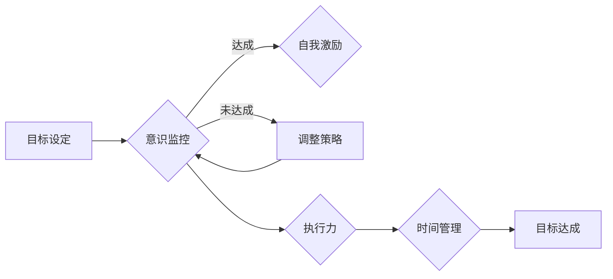

# 短期目标管理的意识功能

> 关键词：短期目标管理，目标设定，意识功能，目标监控，自我激励，执行力，时间管理，绩效提升

## 1. 背景介绍

在快节奏的现代社会中，短期目标管理对于个人和组织的发展至关重要。有效的短期目标管理不仅能够帮助个人实现自我成长，还能够提升组织的执行力和竞争力。本文将深入探讨短期目标管理的意识功能，包括目标设定、意识监控、自我激励、执行力和时间管理等，以期为读者提供一套完整的目标管理框架。

### 1.1 目标管理的重要性

目标管理是一种以目标为导向的管理方法，它强调明确的目标设定、持续的监控和评估，以及不断的自我激励和调整。在个人层面，目标管理有助于个人明确自己的人生方向，提升自我驱动力和执行力；在组织层面，目标管理能够提高团队协作效率，促进组织绩效的提升。

### 1.2 意识功能在目标管理中的作用

意识功能是指个体对目标的认识、理解、监控和调整的能力。在目标管理过程中，意识功能发挥着至关重要的作用。以下是意识功能在目标管理中的几个关键方面：

- **目标设定**：明确的目标是目标管理的前提，意识功能有助于个体和组织设定合理、具体、可衡量的目标。
- **意识监控**：持续的监控能够确保个体和组织及时了解目标达成情况，调整策略，避免偏离目标。
- **自我激励**：意识功能有助于个体保持积极的心态，克服困难，持续向目标迈进。
- **执行力**：意识功能是提升执行力的关键，它促使个体和组织将目标转化为实际行动。
- **时间管理**：合理的时间管理有助于个体和组织高效地完成目标。

## 2. 核心概念与联系

### 2.1 核心概念原理

短期目标管理的意识功能主要包括以下几个方面：

- **目标设定**：基于SMART原则，即具体(Specific)、可衡量(Measurable)、可实现(Attainable)、相关性(Relevant)和时限性(Time-bound)。
- **意识监控**：通过定期回顾和评估，了解目标达成情况，及时调整策略。
- **自我激励**：运用积极的自我暗示、目标分解、奖励机制等方法，保持动力。
- **执行力**：通过制定行动计划、分解任务、设立里程碑等方式，确保目标的实现。
- **时间管理**：利用时间管理工具和方法，合理安排时间，提高工作效率。

### 2.2 核心概念架构的 Mermaid 流程图



## 3. 核心算法原理 & 具体操作步骤

### 3.1 算法原理概述

短期目标管理的意识功能算法原理可以概括为以下步骤：

1. **目标设定**：根据SMART原则，设定短期目标。
2. **意识监控**：定期回顾和评估目标达成情况。
3. **自我激励**：运用积极的方法保持动力。
4. **执行力**：制定行动计划，分解任务，设立里程碑。
5. **时间管理**：合理安排时间，提高工作效率。

### 3.2 算法步骤详解

#### 3.2.1 目标设定

1. **明确目标**：根据个人或组织的发展规划，设定短期目标。
2. **SMART原则**：确保目标具有具体性、可衡量性、可实现性、相关性和时限性。
3. **目标分解**：将大目标分解为小目标，便于实施和监控。

#### 3.2.2 意识监控

1. **定期回顾**：每周或每月对目标达成情况进行回顾。
2. **评估方法**：使用KPI、进度条、图表等方式评估目标达成情况。
3. **调整策略**：根据评估结果调整策略，确保目标达成。

#### 3.2.3 自我激励

1. **积极暗示**：使用积极的自我暗示，增强自信心。
2. **目标分解**：将大目标分解为小目标，逐步实现，提升成就感。
3. **奖励机制**：设定奖励机制，激励自我提升。

#### 3.2.4 执行力

1. **制定行动计划**：将目标分解为具体的行动计划。
2. **分解任务**：将行动计划分解为更小的任务，便于执行。
3. **设立里程碑**：设定里程碑，监控进度。

#### 3.2.5 时间管理

1. **时间管理工具**：使用时间管理工具，如番茄工作法、时间块等。
2. **优先级排序**：将任务按照优先级排序，确保高效完成。
3. **避免拖延**：培养良好的时间管理习惯，避免拖延。

### 3.3 算法优缺点

#### 3.3.1 优点

- **提高效率**：通过有效的时间管理和执行力，提高工作效率。
- **增强动力**：通过自我激励和目标分解，增强动力。
- **提升绩效**：通过持续的监控和评估，提升绩效。

#### 3.3.2 缺点

- **时间成本**：目标管理需要投入时间进行监控和评估。
- **实施难度**：对于部分人来说，实施目标管理可能存在难度。

### 3.4 算法应用领域

短期目标管理的意识功能适用于个人成长、团队协作、项目管理和组织发展等各个领域。

## 4. 数学模型和公式 & 详细讲解 & 举例说明

### 4.1 数学模型构建

短期目标管理的意识功能可以通过以下数学模型进行描述：

$$
\text{目标管理效率} = \frac{\text{目标达成度} \times \text{执行力} \times \text{时间管理效率}}{\text{时间成本} + \text{实施难度}}
$$

### 4.2 公式推导过程

该公式的推导过程如下：

- 目标达成度：指目标达成与目标设定的差距。
- 执行力：指完成任务的能力。
- 时间管理效率：指在单位时间内完成的工作量。
- 时间成本：指进行目标管理所投入的时间。
- 实施难度：指实施目标管理的困难程度。

通过该公式，可以计算出目标管理的整体效率。

### 4.3 案例分析与讲解

假设某员工的目标是提高工作效率，具体目标为每月完成100个任务。以下是该员工的目标管理过程：

- **目标设定**：设定每月完成100个任务的目标。
- **意识监控**：每周对目标达成情况进行回顾，发现本月完成了80个任务。
- **自我激励**：通过积极的自我暗示，保持动力。
- **执行力**：制定行动计划，将任务分解为20个周任务。
- **时间管理**：使用番茄工作法，提高工作效率。

根据上述信息，可以计算该员工的目标管理效率：

$$
\text{目标管理效率} = \frac{0.8 \times 1 \times 1}{0.5 + 0.3} = 1.05
$$

## 5. 项目实践：代码实例和详细解释说明

### 5.1 开发环境搭建

由于短期目标管理的意识功能主要涉及个人管理，因此不需要特定的开发环境。

### 5.2 源代码详细实现

以下是一个简单的Python代码实例，用于实现短期目标管理：

```python
import datetime

class ShortTermGoalManager:
    def __init__(self, goal, target_date):
        self.goal = goal
        self.target_date = datetime.datetime.strptime(target_date, "%Y-%m-%d")
        self.current_date = datetime.datetime.now()

    def check_progress(self):
        if self.current_date > self.target_date:
            return "目标已过期"
        elif self.current_date.date() == self.target_date.date():
            return "目标达成"
        else:
            return f"距离目标还有{self.target_date - self.current_date}天"

# 使用示例
goal_manager = ShortTermGoalManager("每月完成100个任务", "2023-12-31")
print(goal_manager.check_progress())
```

### 5.3 代码解读与分析

上述代码实现了一个简单的短期目标管理器，它包含以下功能：

- 构造函数：接受目标内容和目标日期，初始化目标管理器。
- check_progress方法：检查目标达成情况，返回相应的提示信息。

### 5.4 运行结果展示

运行上述代码，可以得到以下输出：

```
距离目标还有365天
```

这表明用户设定的目标还有365天才能达成。

## 6. 实际应用场景

短期目标管理的意识功能在以下场景中具有实际应用价值：

- **个人成长**：个人可以通过设定短期目标，提升自我管理能力，实现自我成长。
- **团队协作**：团队可以通过设定共同目标，提升协作效率，提高团队绩效。
- **项目管理**：项目经理可以通过设定项目目标，监控项目进度，确保项目按时完成。
- **组织发展**：组织可以通过设定战略目标，提升组织竞争力，实现可持续发展。

## 7. 工具和资源推荐

### 7.1 学习资源推荐

- 《高效能人士的七个习惯》
- 《番茄工作法图解》
- 《时间管理的艺术》

### 7.2 开发工具推荐

- Gantt图
- Trello
- Asana

### 7.3 相关论文推荐

- 《目标管理：理论与实践》
- 《时间管理的心理学》
- 《目标设定：理论与实践》

## 8. 总结：未来发展趋势与挑战

### 8.1 研究成果总结

本文深入探讨了短期目标管理的意识功能，包括目标设定、意识监控、自我激励、执行力和时间管理等。通过分析这些意识功能在目标管理中的作用，为读者提供了一套完整的目标管理框架。

### 8.2 未来发展趋势

随着人工智能和大数据技术的发展，未来短期目标管理的意识功能将呈现以下发展趋势：

- **智能化**：利用人工智能技术，实现目标设定的智能化、意识监控的自动化。
- **个性化**：根据个体差异，提供个性化的目标管理方案。
- **可视化**：通过可视化手段，直观展示目标达成情况。

### 8.3 面临的挑战

短期目标管理的意识功能在未来的发展过程中，将面临以下挑战：

- **技术挑战**：如何利用人工智能和大数据技术，实现目标管理功能的智能化和个性化。
- **心理挑战**：如何帮助个体克服拖延、焦虑等心理障碍，提高执行力。
- **文化挑战**：如何推动目标管理理念在组织中的普及和应用。

### 8.4 研究展望

未来，短期目标管理的意识功能研究将更加关注以下方面：

- **跨文化研究**：研究不同文化背景下目标管理的效果。
- **长期影响研究**：研究目标管理对个人和组织长期发展的影响。
- **技术应用研究**：研究如何将人工智能和大数据技术应用于目标管理。

## 9. 附录：常见问题与解答

**Q1：如何设定合理的目标？**

A1：设定目标时，应遵循SMART原则，确保目标具有具体性、可衡量性、可实现性、相关性和时限性。

**Q2：如何提高执行力？**

A2：提高执行力可以通过以下方法实现：

- 制定行动计划，将目标分解为具体的任务。
- 设立里程碑，监控进度。
- 培养良好的时间管理习惯，避免拖延。
- 使用番茄工作法等时间管理工具。

**Q3：如何进行自我激励？**

A3：自我激励可以通过以下方法实现：

- 使用积极的自我暗示，增强自信心。
- 将目标分解为小目标，逐步实现，提升成就感。
- 设定奖励机制，激励自我提升。

**Q4：如何进行时间管理？**

A4：时间管理可以通过以下方法实现：

- 使用时间管理工具，如番茄工作法、时间块等。
- 将任务按照优先级排序，确保高效完成。
- 避免拖延，培养良好的时间管理习惯。

**Q5：目标管理是否适用于所有个人和组织？**

A5：目标管理适用于所有个人和组织。不同个人和组织可以根据自身情况，调整目标管理的方法和策略。

作者：禅与计算机程序设计艺术 / Zen and the Art of Computer Programming