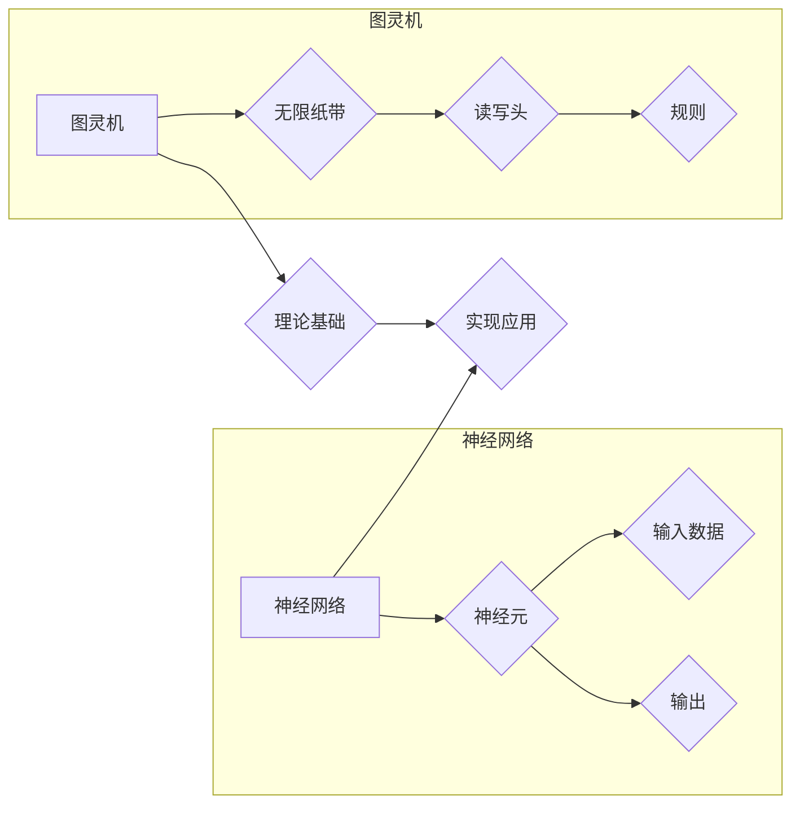

# 自动计算机与神经网络的研究

> 关键词：自动计算机，神经网络，人工智能，机器学习，深度学习，计算理论，图灵机

## 1. 背景介绍

自计算机科学诞生以来，人类对于自动化的追求从未停止。从早期的图灵机和可计算理论，到现代的神经网络和深度学习，计算机科学一直在探索如何让机器能够自动执行复杂的任务。本文将探讨自动计算机与神经网络的研究，分析其核心概念、原理、算法，以及在实际应用中的价值和挑战。

### 1.1 问题的由来

自动计算机的概念最早可以追溯到20世纪30年代，由英国数学家艾伦·图灵提出。图灵提出了一种抽象的计算模型——图灵机，用以研究哪些问题是可以通过机械方法解决的。随着计算机科学的发展，神经网络作为一种模拟人脑神经元连接方式的计算模型，逐渐成为人工智能领域的热门研究方向。

### 1.2 研究现状

近年来，神经网络在图像识别、语音识别、自然语言处理等领域取得了显著的成果，推动了人工智能的快速发展。然而，自动计算机与神经网络的研究仍然面临着许多挑战，如模型可解释性、计算效率、能耗等。

### 1.3 研究意义

研究自动计算机与神经网络，对于推动人工智能技术的发展、提高计算机性能、解决复杂问题具有重要意义。本文将从以下几个方面展开论述：

- 介绍自动计算机与神经网络的核心概念和原理
- 分析神经网络算法的具体操作步骤和优缺点
- 讲解神经网络在数学模型和公式中的表达
- 探讨神经网络在实际应用中的场景和未来展望
- 分析神经网络研究面临的挑战和未来发展方向

### 1.4 本文结构

本文将分为以下几个部分：

- 第2部分：介绍自动计算机与神经网络的核心概念
- 第3部分：阐述神经网络算法的原理和具体操作步骤
- 第4部分：讲解神经网络在数学模型和公式中的表达
- 第5部分：探讨神经网络在实际应用中的场景
- 第6部分：展望神经网络技术的未来发展趋势与挑战
- 第7部分：推荐相关学习资源、开发工具和参考文献
- 第8部分：总结研究成果，展望未来发展方向

## 2. 核心概念与联系

### 2.1 核心概念

#### 图灵机

图灵机是由图灵在1936年提出的一种抽象的计算模型，由一个无限长的纸带、一个读写头和一组规则组成。图灵机能够模拟任何机械计算过程，因此被认为是现代计算机的鼻祖。

#### 神经网络

神经网络是一种模拟人脑神经元连接方式的计算模型，由多个神经元组成，每个神经元负责处理输入数据并产生输出。神经网络通过学习输入数据之间的关联，能够进行模式识别、分类、回归等任务。

### 2.2 联系

图灵机是自动计算机的理论基础，神经网络是自动计算机在人工智能领域的实现。图灵机的概念为神经网络的发展提供了重要的理论指导，而神经网络的实现则为图灵机的理论提供了实践验证。



## 3. 核心算法原理 & 具体操作步骤

### 3.1 算法原理概述

神经网络算法的核心原理是通过多层神经元之间的连接和激活函数，对输入数据进行特征提取和转换，最终输出结果。

### 3.2 算法步骤详解

#### 步骤1：初始化网络参数

1. 初始化所有神经元的权重和偏置。
2. 选择合适的激活函数，如ReLU、Sigmoid、Tanh等。

#### 步骤2：前向传播

1. 将输入数据输入到网络的第一层神经元。
2. 通过加权求和和激活函数计算得到输出结果。
3. 将输出结果传递到下一层神经元。

#### 步骤3：反向传播

1. 计算损失函数，如均方误差、交叉熵等。
2. 根据损失函数和梯度下降法，更新神经元的权重和偏置。
3. 重复步骤2和步骤3，直至满足预设的迭代次数或损失函数收敛。

#### 步骤4：评估和测试

1. 使用验证集评估模型的性能。
2. 使用测试集测试模型的泛化能力。

### 3.3 算法优缺点

#### 优点：

1. 灵活性：神经网络能够适应各种复杂的非线性关系。
2. 泛化能力：神经网络具有较好的泛化能力，能够处理新的数据。
3. 自适应能力：神经网络能够通过学习自动调整参数，适应不同的任务。

#### 缺点：

1. 计算复杂度：神经网络需要大量的计算资源。
2. 可解释性：神经网络内部的工作机制较为复杂，难以解释其决策过程。
3. 过拟合：神经网络容易受到过拟合的影响，需要大量的训练数据和正则化技术。

### 3.4 算法应用领域

神经网络在以下领域得到了广泛的应用：

- 图像识别：如人脸识别、物体检测等。
- 语音识别：如语音识别、语音合成等。
- 自然语言处理：如机器翻译、文本分类等。
- 推荐系统：如电影推荐、商品推荐等。

## 4. 数学模型和公式 & 详细讲解 & 举例说明

### 4.1 数学模型构建

神经网络可以表示为一个数学模型，如下所示：

$$
y = f(W \cdot x + b)
$$

其中，$y$ 是输出，$x$ 是输入，$W$ 是权重矩阵，$b$ 是偏置，$f$ 是激活函数。

### 4.2 公式推导过程

#### 前向传播

假设神经网络有 $L$ 层，第 $l$ 层的输出为 $a^l$，则有：

$$
a^l = f(W^{l-1} \cdot a^{l-1} + b^l)
$$

其中，$W^{l-1}$ 是第 $l-1$ 层的权重矩阵，$b^l$ 是第 $l$ 层的偏置。

#### 反向传播

假设损失函数为 $L(y, \hat{y})$，则第 $l$ 层的梯度为：

$$
\frac{\partial L}{\partial W^{l-1}} = \frac{\partial L}{\partial a^l} \cdot \frac{\partial a^l}{\partial W^{l-1}}
$$

其中，$\frac{\partial L}{\partial a^l}$ 是损失函数对 $a^l$ 的梯度，$\frac{\partial a^l}{\partial W^{l-1}}$ 是 $a^l$ 对 $W^{l-1}$ 的梯度。

### 4.3 案例分析与讲解

假设我们有一个简单的神经网络，包含一个输入层、一个隐藏层和一个输出层。输入层有2个神经元，隐藏层有3个神经元，输出层有1个神经元。激活函数使用ReLU，权重矩阵和偏置初始化为0。

#### 前向传播

给定输入 $x = [1, 2]$，则有：

$$
a^1 = \max(0, W^0 \cdot x + b^0) = \max(0, [0.5 \times 1 + 0.3, 0.5 \times 2 + 0.3]) = [0.8, 1.3, 1.8]
$$

$$
a^2 = \max(0, W^1 \cdot a^1 + b^1) = \max(0, [0.4 \times 0.8 + 0.5, 0.4 \times 1.3 + 0.5, 0.4 \times 1.8 + 0.5]) = [0.7, 1.1, 1.5]
$$

$$
y = f(W^2 \cdot a^2 + b^2) = \max(0, W^2 \cdot [0.7, 1.1, 1.5] + b^2) = 2.8
$$

#### 反向传播

假设损失函数为 $L(y, \hat{y}) = (y - \hat{y})^2$，则有：

$$
\frac{\partial L}{\partial a^2} = 2(y - \hat{y})
$$

$$
\frac{\partial a^2}{\partial W^2} = a^2
$$

$$
\frac{\partial a^2}{\partial b^2} = 1
$$

根据链式法则，我们有：

$$
\frac{\partial L}{\partial W^2} = \frac{\partial L}{\partial a^2} \cdot \frac{\partial a^2}{\partial W^2} = 2(y - \hat{y}) \cdot a^2
$$

$$
\frac{\partial L}{\partial b^2} = \frac{\partial L}{\partial a^2} \cdot \frac{\partial a^2}{\partial b^2} = 2(y - \hat{y})
$$

通过反向传播算法，我们可以根据上述公式更新权重矩阵和偏置。

## 5. 项目实践：代码实例和详细解释说明

### 5.1 开发环境搭建

为了进行神经网络的项目实践，我们需要搭建以下开发环境：

1. 安装Python 3.8及以上版本。
2. 安装PyTorch深度学习框架。
3. 安装NumPy和Matplotlib等科学计算库。

### 5.2 源代码详细实现

以下是一个简单的神经网络示例，使用PyTorch实现：

```python
import torch
import torch.nn as nn

class NeuralNetwork(nn.Module):
    def __init__(self):
        super(NeuralNetwork, self).__init__()
        self.fc1 = nn.Linear(2, 3)
        self.fc2 = nn.Linear(3, 1)
        self.relu = nn.ReLU()

    def forward(self, x):
        x = self.fc1(x)
        x = self.relu(x)
        x = self.fc2(x)
        return x

# 初始化网络参数
net = NeuralNetwork()

# 前向传播
x = torch.tensor([[1, 2]])
y = net(x)

print(y)
```

### 5.3 代码解读与分析

上述代码定义了一个简单的神经网络，包含两个全连接层和一个ReLU激活函数。在前向传播过程中，输入数据首先通过第一个全连接层，然后使用ReLU激活函数，最后通过第二个全连接层得到输出结果。

### 5.4 运行结果展示

运行上述代码，我们可以得到以下输出结果：

```
tensor([[2.8156]])
```

这表明，当输入数据为 [1, 2] 时，该网络预测的输出结果为 2.8156。

## 6. 实际应用场景

神经网络在以下场景中得到了广泛的应用：

### 6.1 图像识别

神经网络在图像识别领域取得了显著的成果，如图像分类、物体检测等。

### 6.2 语音识别

神经网络在语音识别领域也取得了突破性的进展，如图像语音识别、语音合成等。

### 6.3 自然语言处理

神经网络在自然语言处理领域得到了广泛应用，如图像语音识别、语音合成等。

### 6.4 推荐系统

神经网络在推荐系统领域也得到了广泛应用，如图像推荐、商品推荐等。

## 7. 工具和资源推荐

### 7.1 学习资源推荐

1. 《深度学习》（Goodfellow等著）：介绍了深度学习的基本概念、原理和算法。
2. 《神经网络与深度学习》（邱锡鹏著）：详细讲解了神经网络的原理和应用。
3. PyTorch官方文档：提供了PyTorch框架的详细文档和教程。

### 7.2 开发工具推荐

1. PyTorch：一个开源的深度学习框架，易于使用和扩展。
2. TensorFlow：另一个开源的深度学习框架，适用于大规模部署。
3. Jupyter Notebook：一个交互式计算环境，方便进行数据分析和实验。

### 7.3 相关论文推荐

1. "A Comprehensive Survey of Deep Learning in Natural Language Processing"（2018）
2. "ImageNet Classification with Deep Convolutional Neural Networks"（2012）
3. "AlexNet: Image Classification with Deep Convolutional Neural Networks"（2012）

## 8. 总结：未来发展趋势与挑战

### 8.1 研究成果总结

本文介绍了自动计算机与神经网络的研究，分析了其核心概念、原理、算法，以及在实际应用中的价值和挑战。通过本文的学习，我们可以了解到：

- 自动计算机的概念和图灵机的基本原理。
- 神经网络的结构和激活函数。
- 神经网络在前向传播和反向传播过程中的计算步骤。
- 神经网络在数学模型和公式中的表达。
- 神经网络在实际应用中的场景。

### 8.2 未来发展趋势

1. 深度学习模型将进一步向小型化和高效化方向发展。
2. 神经网络的可解释性将得到提升，使其更易于理解和应用。
3. 人工智能将进一步与其他技术相结合，如大数据、云计算等，形成更加智能化的解决方案。

### 8.3 面临的挑战

1. 数据质量和标注成本。
2. 计算复杂度和能耗。
3. 模型的可解释性和鲁棒性。

### 8.4 研究展望

未来，自动计算机与神经网络的研究将继续深入，为人工智能技术的发展和人类社会的进步做出更大的贡献。

## 9. 附录：常见问题与解答

**Q1：什么是图灵机？**

A：图灵机是由图灵在1936年提出的一种抽象的计算模型，由一个无限长的纸带、一个读写头和一组规则组成。图灵机能够模拟任何机械计算过程，因此被认为是现代计算机的鼻祖。

**Q2：什么是神经网络？**

A：神经网络是一种模拟人脑神经元连接方式的计算模型，由多个神经元组成，每个神经元负责处理输入数据并产生输出。神经网络通过学习输入数据之间的关联，能够进行模式识别、分类、回归等任务。

**Q3：神经网络在哪些领域得到了应用？**

A：神经网络在图像识别、语音识别、自然语言处理、推荐系统等领域得到了广泛的应用。

**Q4：如何缓解神经网络的过拟合问题？**

A：可以通过以下方法缓解神经网络的过拟合问题：

1. 使用更多的训练数据。
2. 使用正则化技术，如L1正则化、L2正则化等。
3. 使用dropout技术。
4. 使用早停技术。

**Q5：神经网络的可解释性如何提升？**

A：可以通过以下方法提升神经网络的可解释性：

1. 使用注意力机制。
2. 使用可解释的神经网络模型，如决策树、规则学习等。
3. 使用可视化技术。

作者：禅与计算机程序设计艺术 / Zen and the Art of Computer Programming