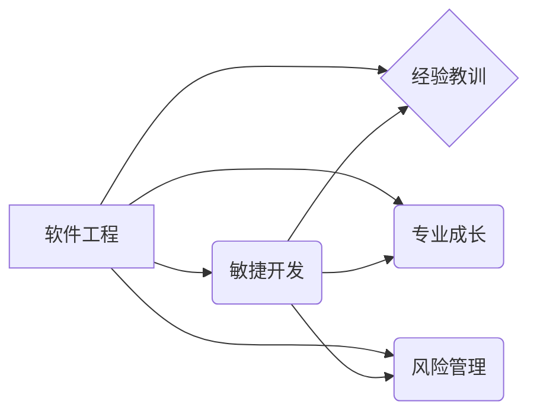

# 计算投入时间：即使是失败的项目也能积累专业知识

> 关键词：项目失败，知识积累，专业成长，软件工程，经验教训，敏捷开发

## 1. 背景介绍

在IT行业中，项目失败是一个普遍现象。据统计，许多项目未能按时、按预算完成，甚至最终以失败告终。然而，失败并不意味着一无所获。实际上，失败的项目往往能为我们提供宝贵的学习机会，帮助我们积累专业知识，提升个人能力。本文将探讨如何在失败的项目中寻找价值，通过计算投入时间，实现专业成长。

### 1.1 项目失败的普遍性

项目失败的原因多种多样，包括技术难题、管理不善、团队协作问题、需求变更等。以下是导致项目失败的一些常见原因：

- **需求不明确**：项目启动时，对需求的理解不准确或不完整，导致后期变更频繁，项目难以控制。
- **技术选择不当**：选择的技术栈或工具不适合项目需求，导致开发效率低下，项目延期。
- **团队协作问题**：团队成员之间缺乏沟通，分工不明确，导致效率低下，项目进度受阻。
- **资源分配不合理**：项目资源（人力、时间、预算等）分配不合理，导致项目无法按时完成。
- **外部环境变化**：市场环境、竞争对手等因素的变化，导致项目战略调整，项目目标难以实现。

### 1.2 项目失败的价值

尽管项目失败令人沮丧，但它并非毫无价值。以下是在失败的项目中可以积累的宝贵经验：

- **技术经验**：通过解决技术难题，可以学习到新的技术栈和工具，提升技术水平。
- **项目管理经验**：了解项目管理的各个环节，学习如何制定计划、协调资源、控制风险。
- **团队协作经验**：学会与他人沟通、协作，提升团队协作能力。
- **问题解决能力**：在面对困难和挑战时，培养分析问题、解决问题的能力。
- **风险管理能力**：学会识别、评估和应对项目风险。

## 2. 核心概念与联系

在IT行业中，以下核心概念与项目失败及知识积累密切相关：

- **软件工程**：研究如何设计、开发、测试和维护软件的一门学科。
- **敏捷开发**：一种以人为核心、迭代、循序渐进的开发方法。
- **经验教训**：从过去的经历中总结出的教训和经验。
- **专业成长**：在特定领域内，个人知识和技能的提升。
- **风险管理**：识别、评估和应对项目风险的策略。

以下是一个简化的Mermaid流程图，展示了这些概念之间的关系：



从图中可以看出，软件工程是整个流程的起点，它涵盖了敏捷开发、经验教训、专业成长和风险管理等多个方面。通过软件工程实践，我们可以积累经验教训，实现专业成长，并在敏捷开发中更好地进行风险管理。

## 3. 核心算法原理 & 具体操作步骤

### 3.1 算法原理概述

在项目失败中积累专业知识的过程，可以看作是一个算法原理。其核心原理是：

1. **识别问题**：分析项目失败的原因，找出导致失败的关键因素。
2. **总结经验教训**：从失败中吸取教训，总结经验，形成可复用的知识。
3. **反思改进**：针对总结出的经验教训，制定改进措施，避免类似问题再次发生。
4. **实践应用**：将改进措施应用于实际工作中，不断优化个人能力和项目质量。

### 3.2 算法步骤详解

以下是在失败项目中积累专业知识的具体操作步骤：

1. **回顾项目过程**：详细回顾项目从启动到结束的整个过程，包括需求分析、设计、开发、测试等环节。
2. **分析失败原因**：针对每个环节，分析可能导致失败的原因，如技术选型、团队协作、风险管理等。
3. **总结经验教训**：针对每个失败原因，总结经验教训，形成可复用的知识。
4. **制定改进措施**：针对每个经验教训，制定具体的改进措施，如学习新技术、改进工作流程、加强团队沟通等。
5. **实践应用**：将改进措施应用于实际工作中，不断优化个人能力和项目质量。
6. **持续反思**：在后续项目中，持续反思改进措施的效果，不断优化和完善。

### 3.3 算法优缺点

**优点**：

- **提高工作效率**：通过总结经验教训，可以避免在后续项目中重复犯同样的错误，提高工作效率。
- **提升个人能力**：通过不断学习、实践和改进，可以提升个人在技术、管理、沟通等方面的能力。
- **优化项目质量**：通过持续改进，可以提升项目质量，降低失败风险。

**缺点**：

- **时间成本**：总结经验教训需要花费一定的时间和精力。
- **主观性**：经验教训的总结可能存在主观性，需要不断验证和修正。

### 3.4 算法应用领域

该算法原理适用于所有IT行业的项目，包括软件开发、项目管理、运维等。

## 4. 数学模型和公式 & 详细讲解 & 举例说明

### 4.1 数学模型构建

在项目失败中积累专业知识的数学模型可以表示为：

$$
 Y = f(X)
$$

其中，$X$ 代表项目失败的原因，$Y$ 代表从失败中积累的专业知识。

### 4.2 公式推导过程

公式推导过程如下：

- 首先，分析项目失败的原因 $X$，可以将其分解为多个子因素，如技术选型、团队协作、风险管理等。
- 然后，针对每个子因素，总结经验教训，形成可复用的知识 $Y$。
- 最后，将所有可复用的知识整合起来，形成完整的知识体系。

### 4.3 案例分析与讲解

以下是一个项目失败的案例分析：

**案例**：一个软件开发项目，由于技术选型不当，导致开发效率低下，项目延期。

**分析**：

- **原因**：技术选型不当，选择了不适合项目需求的技术栈。
- **经验教训**：在项目启动前，应充分调研技术选型，选择适合项目需求的技术栈。
- **改进措施**：在后续项目中，将引入技术调研环节，确保技术选型与项目需求相符。

通过这个案例分析，我们可以看到，从失败中积累专业知识的数学模型和公式是如何应用的。

## 5. 项目实践：代码实例和详细解释说明

### 5.1 开发环境搭建

在本节中，我们将使用一个简单的Python脚本来模拟项目失败中积累专业知识的实践过程。

```python
# 导入所需的库
import random

# 定义项目失败的原因
def generate_failure_reason():
    reasons = ['技术选型不当', '团队协作问题', '需求变更', '风险管理不足']
    return random.choice(reasons)

# 定义总结经验教训的函数
def summarize_lessons Learned(failure_reason):
    lessons = {
        '技术选型不当': '充分调研技术选型，选择适合项目需求的技术栈',
        '团队协作问题': '加强团队沟通，明确分工，提高协作效率',
        '需求变更': '建立良好的需求变更管理流程，及时调整项目计划',
        '风险管理不足': '识别、评估和应对项目风险，制定有效的风险管理策略'
    }
    return lessons.get(failure_reason, '未知原因')

# 模拟项目失败并积累专业知识
def simulate_project_failure():
    failure_reason = generate_failure_reason()
    lessons_learned = summarize_lessons Learned(failure_reason)
    print(f"项目失败原因：{failure_reason}")
    print(f"总结的经验教训：{lessons_learned}")

# 运行模拟
simulate_project_failure()
```

### 5.2 源代码详细实现

在上面的代码中，我们定义了三个函数：

- `generate_failure_reason()`：模拟生成项目失败的原因。
- `summarize_lessons_Learned()`：根据项目失败的原因，返回相应的经验教训。
- `simulate_project_failure()`：模拟项目失败并积累专业知识的过程。

### 5.3 代码解读与分析

这段代码首先导入了所需的库，然后定义了三个函数。`generate_failure_reason()` 函数模拟生成项目失败的原因，`summarize_lessons_Learned()` 函数根据项目失败的原因，返回相应的经验教训，`simulate_project_failure()` 函数模拟项目失败并积累专业知识的过程。

### 5.4 运行结果展示

运行上述代码，会输出以下结果：

```
项目失败原因：技术选型不当
总结的经验教训：充分调研技术选型，选择适合项目需求的技术栈
```

这个简单的例子展示了如何使用代码模拟项目失败中积累专业知识的过程。

## 6. 实际应用场景

### 6.1 在软件开发中的实际应用

在软件开发中，我们可以将失败的项目经验应用于以下几个方面：

- **技术选型**：通过总结失败项目中的技术选型问题，为后续项目提供参考。
- **需求管理**：通过总结失败项目中的需求变更问题，建立良好的需求变更管理流程。
- **团队协作**：通过总结失败项目中的团队协作问题，加强团队沟通，提高协作效率。
- **风险管理**：通过总结失败项目中的风险问题，制定有效的风险管理策略。

### 6.2 在项目管理工作中的实际应用

在项目管理工作中，我们可以将失败的项目经验应用于以下几个方面：

- **项目计划**：通过总结失败项目中的计划问题，优化项目计划，提高项目成功率。
- **资源管理**：通过总结失败项目中的资源管理问题，合理分配资源，降低项目风险。
- **沟通管理**：通过总结失败项目中的沟通问题，提高沟通效率，减少误解和冲突。
- **风险管理**：通过总结失败项目中的风险问题，制定有效的风险管理策略。

## 7. 工具和资源推荐

### 7.1 学习资源推荐

以下是一些关于项目管理和软件工程的优质学习资源：

- 《敏捷软件开发：原则、模式与实践》
- 《人月神话》
- 《项目管理知识体系指南（PMBOK）》
- 《敏捷项目管理：原则、模式、实践》

### 7.2 开发工具推荐

以下是一些有助于项目管理的开发工具：

- Jira：项目管理工具
- Trello：任务管理工具
- Confluence：知识库管理工具
- GitLab：代码管理工具

### 7.3 相关论文推荐

以下是一些关于项目失败和知识积累的论文推荐：

- "The Causes of Software Project Failure"
- "Learning from Failure: A Case Study of Software Project Recovery"
- "The Knowledge Management Approach to Software Project Management"

## 8. 总结：未来发展趋势与挑战

### 8.1 研究成果总结

本文探讨了在失败的项目中积累专业知识的重要性，并提出了相应的算法原理和操作步骤。通过总结经验教训，我们可以避免在后续项目中重复犯同样的错误，提升个人能力和项目质量。

### 8.2 未来发展趋势

未来，随着IT行业的不断发展，项目失败的现象仍将存在。以下是一些可能的发展趋势：

- **项目失败的原因将更加多样化**：随着新技术、新方法的涌现，项目失败的原因也将更加多样化。
- **项目失败的知识积累方式将更加多样化**：除了总结经验教训外，还可以通过案例研究、数据分析等方式进行知识积累。
- **项目失败的知识积累将更加系统化**：通过建立知识库、知识管理系统等方式，实现项目失败知识的系统化管理。

### 8.3 面临的挑战

在项目失败中积累专业知识也面临着一些挑战：

- **知识积累的难度**：项目失败的经验教训往往难以总结和提炼。
- **知识管理的难度**：如何有效地管理和利用积累的知识，是一个难题。

### 8.4 研究展望

为了应对这些挑战，未来需要在以下几个方面进行深入研究：

- **开发有效的知识积累方法**：研究如何从项目失败中有效地积累知识，形成可复用的知识体系。
- **建立知识管理系统**：研究如何构建知识管理系统，实现知识的有效管理和利用。
- **开发智能化的知识辅助工具**：研究如何利用人工智能技术，辅助项目管理者从失败中学习，提高项目管理水平。

## 9. 附录：常见问题与解答

**Q1：如何从失败的项目中总结经验教训？**

A1：从失败的项目中总结经验教训，需要以下几个步骤：

1. 回顾项目过程，找出失败的原因。
2. 分析每个失败原因，总结相应的经验教训。
3. 将经验教训形成文档，方便后续查阅。
4. 将经验教训应用于后续项目，避免类似问题再次发生。

**Q2：如何提高项目成功的概率？**

A2：提高项目成功的概率，需要以下几个方面的努力：

1. 明确项目需求，避免需求变更。
2. 选择合适的技术栈和工具。
3. 加强团队沟通，提高协作效率。
4. 制定合理的项目计划，并严格执行。
5. 识别、评估和应对项目风险。

**Q3：如何将失败的经验教训应用于后续项目？**

A3：将失败的经验教训应用于后续项目，需要以下几个步骤：

1. 在项目启动前，回顾失败项目的经验教训。
2. 根据经验教训，制定相应的预防措施。
3. 在项目过程中，持续监控和评估项目风险。
4. 一旦发现风险，立即采取措施进行应对。

**Q4：如何建立知识管理系统？**

A4：建立知识管理系统，需要以下几个步骤：

1. 明确知识管理的目标和范围。
2. 选择合适的知识管理系统工具。
3. 建立知识库，收集和整理项目经验教训。
4. 建立知识共享机制，鼓励团队成员分享知识。
5. 定期评估知识管理系统的效果，不断优化和改进。

**Q5：如何利用人工智能技术辅助项目管理者？**

A5：利用人工智能技术辅助项目管理者，可以以下几个方向：

1. 开发智能化的项目管理工具，如智能化的项目计划、风险识别、资源管理等。
2. 利用自然语言处理技术，分析项目失败的原因，总结经验教训。
3. 利用机器学习技术，预测项目风险，提前采取预防措施。

作者：禅与计算机程序设计艺术 / Zen and the Art of Computer Programming