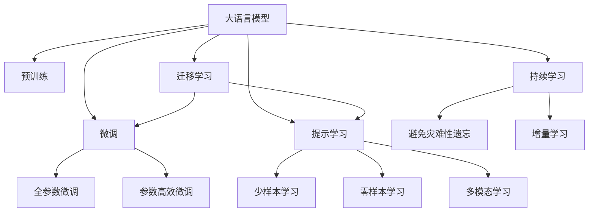
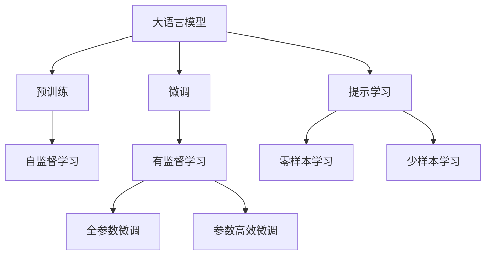
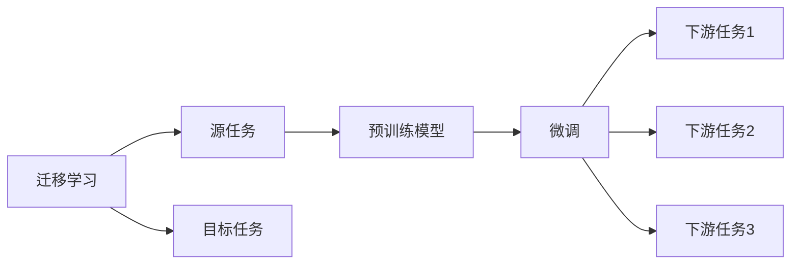
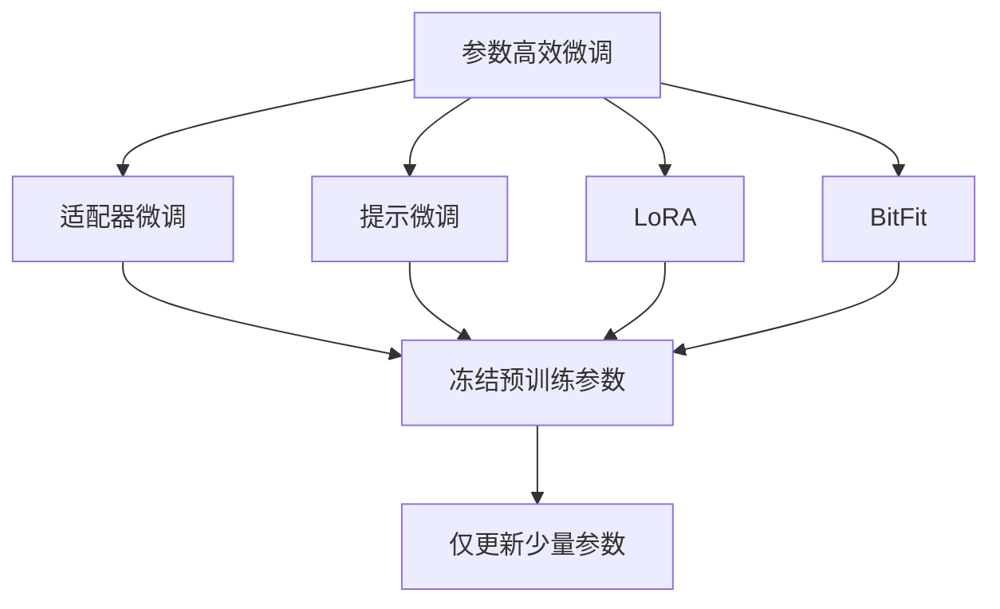
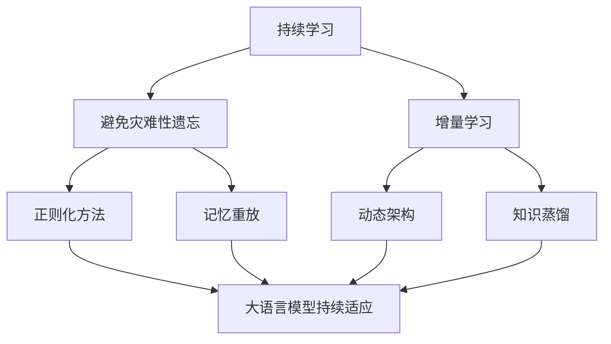
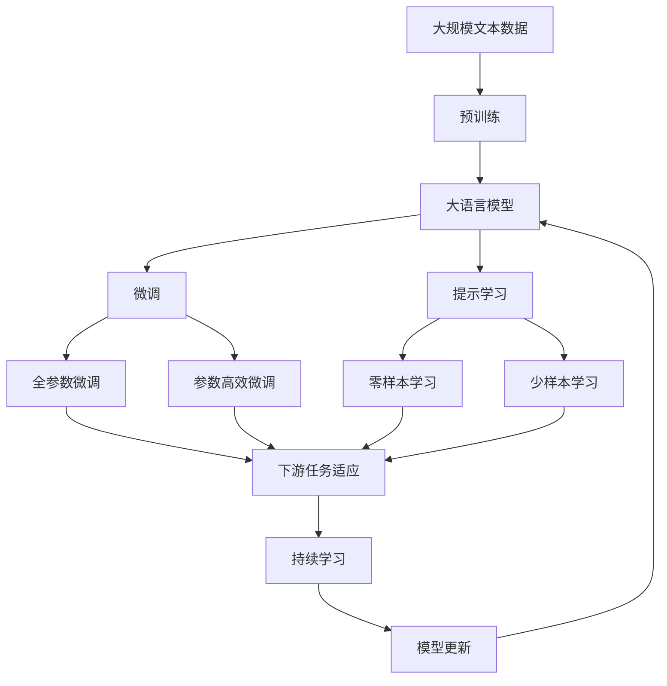

                 

# 大语言模型应用指南：Chat Completion交互格式中的提示

> 关键词：大语言模型,交互提示,Chat Completion,微调,Transformer,BERT,提示学习,自然语言处理(NLP)

## 1. 背景介绍

### 1.1 问题由来
大语言模型（Large Language Models, LLMs）如BERT、GPT等，在自然语言处理（NLP）领域取得了巨大成功。然而，这些模型通常需要大量的标注数据来微调，以适应特定任务，并且对标注数据的质量和数量要求较高。为了降低微调对标注数据的依赖，并提高模型的少样本学习能力，提示学习（Prompt Learning）技术应运而生。提示学习通过精心设计的输入文本格式，引导大语言模型进行特定任务的推理和生成，可以在不更新模型参数的情况下，实现零样本或少样本学习。

Chat Completion是大语言模型中一种常见的交互格式，通过在输入文本中添加提示（Prompt），模型能够自动完成未完成的用户输入，为用户提供精准的回复。Chat Completion技术不仅能够显著提升人机交互的自然性和流畅性，还能大大降低微调模型的标注成本和复杂度。

### 1.2 问题核心关键点
提示学习在大语言模型的应用中，通常涉及以下几个关键点：
1. **Prompt设计**：提示模板的设计是提示学习的核心，需要考虑如何最大限度地引导模型理解用户意图和上下文，从而生成最合适的回复。
2. **模型适配**：不同模型对提示的反应可能不同，因此需要根据具体模型进行调整。
3. **模型微调**：对于某些任务，如问答系统、对话生成等，微调模型可能能够提高效果。
4. **动态提示**：根据用户反馈和交互历史，动态调整提示模板，提升交互体验。
5. **鲁棒性测试**：提示学习模型的鲁棒性测试，确保其在各种异常输入下仍能正常工作。

### 1.3 问题研究意义
提示学习技术能够显著降低大语言模型的微调成本，提高模型的少样本学习能力，为NLP技术在工业界的广泛应用提供了新路径。通过精心设计的提示，可以更高效地利用大语言模型，提升人机交互的自然性和准确性，加速自然语言处理技术的产业化进程。

## 2. 核心概念与联系

### 2.1 核心概念概述

为更好地理解Chat Completion交互格式中的提示学习，本节将介绍几个密切相关的核心概念：

- **大语言模型**：如BERT、GPT等，通过在大规模无标签文本数据上进行预训练，学习通用的语言表示，具备强大的语言理解和生成能力。
- **预训练**：指在大规模无标签文本数据上，通过自监督学习任务训练通用语言模型的过程。
- **微调**：指在预训练模型的基础上，使用下游任务的少量标注数据，通过有监督学习优化模型在特定任务上的性能。
- **提示学习**：通过在输入文本中添加提示模板（Prompt Template），引导大语言模型进行特定任务的推理和生成。
- **少样本学习**：指在只有少量标注样本的情况下，模型能够快速适应新任务的学习方法。
- **零样本学习**：指模型在没有见过任何特定任务的训练样本的情况下，仅凭任务描述就能够执行新任务的能力。
- **多模态学习**：指结合文本、图像、语音等多模态信息进行联合建模，提升模型的综合能力。

这些核心概念之间的逻辑关系可以通过以下Mermaid流程图来展示：



这个流程图展示了大语言模型的核心概念及其之间的关系：

1. 大语言模型通过预训练获得基础能力。
2. 微调是对预训练模型进行任务特定的优化，可以分为全参数微调和参数高效微调（PEFT）。
3. 提示学习是一种不更新模型参数的方法，可以实现少样本学习和零样本学习。
4. 迁移学习是连接预训练模型与下游任务的桥梁，可以通过微调或提示学习来实现。
5. 持续学习旨在使模型能够不断学习新知识，同时保持已学习的知识，而不会出现灾难性遗忘。

这些概念共同构成了大语言模型的学习和应用框架，使其能够在各种场景下发挥强大的语言理解和生成能力。通过理解这些核心概念，我们可以更好地把握大语言模型的工作原理和优化方向。

### 2.2 概念间的关系

这些核心概念之间存在着紧密的联系，形成了大语言模型的完整生态系统。下面我通过几个Mermaid流程图来展示这些概念之间的关系。

#### 2.2.1 大语言模型的学习范式



这个流程图展示了大语言模型的三种主要学习范式：预训练、微调和提示学习。预训练主要采用自监督学习方法，而微调则是有监督学习的过程。提示学习可以实现零样本和少样本学习。微调又可以分为全参数微调和参数高效微调两种方式。

#### 2.2.2 迁移学习与微调的关系



这个流程图展示了迁移学习的基本原理，以及它与微调的关系。迁移学习涉及源任务和目标任务，预训练模型在源任务上学习，然后通过微调适应各种下游任务（目标任务）。

#### 2.2.3 参数高效微调方法



这个流程图展示了几种常见的参数高效微调方法，包括适配器微调、提示微调、LoRA和BitFit。这些方法的共同特点是冻结大部分预训练参数，只更新少量参数，从而提高微调效率。

#### 2.2.4 持续学习在大语言模型中的应用



这个流程图展示了持续学习在大语言模型中的应用。持续学习的主要目标是避免灾难性遗忘和实现增量学习。通过正则化方法、记忆重放、动态架构和知识蒸馏等技术，可以使大语言模型持续适应新的任务和数据。

### 2.3 核心概念的整体架构

最后，我们用一个综合的流程图来展示这些核心概念在大语言模型微调过程中的整体架构：



这个综合流程图展示了从预训练到微调，再到持续学习的完整过程。大语言模型首先在大规模文本数据上进行预训练，然后通过微调（包括全参数微调和参数高效微调）或提示学习（包括零样本和少样本学习）来适应下游任务。最后，通过持续学习技术，模型可以不断更新和适应新的任务和数据。 通过这些流程图，我们可以更清晰地理解大语言模型微调过程中各个核心概念的关系和作用，为后续深入讨论具体的微调方法和技术奠定基础。

## 3. 核心算法原理 & 具体操作步骤
### 3.1 算法原理概述

Chat Completion交互格式中的提示学习，通过在输入文本中添加提示模板（Prompt Template），引导大语言模型进行特定任务的推理和生成。其核心思想是利用大语言模型的语言理解能力，通过提示模板来模拟任务场景，使得模型能够自动完成未完成的用户输入，从而实现少样本或零样本学习。

形式化地，假设大语言模型为 $M_{\theta}$，其中 $\theta$ 为预训练得到的模型参数。给定任务 $T$ 的输入序列 $x$，提示模板为 $P$，输出序列为 $y$。则提示学习的目标是找到最优提示模板 $P^*$，使得模型在输入 $x$ 和提示 $P^*$ 的情况下，生成的输出序列 $y$ 与真实标签尽可能接近。

数学上，可以定义一个目标函数 $L(x, P, y)$，表示输入 $x$、提示 $P$ 和输出 $y$ 之间的损失函数。提示学习的目的即最小化该损失函数，从而找到最优的提示模板 $P^*$。

### 3.2 算法步骤详解

基于Chat Completion交互格式的提示学习，一般包括以下几个关键步骤：

**Step 1: 设计提示模板**
- 根据任务特点，设计合适的提示模板（Prompt Template）。提示模板需要包含足够的信息，以便模型能够理解任务场景和用户意图。
- 常见的提示模板包括自然语言描述、目标标签等。例如，在问答任务中，提示模板可能包括“请回答以下问题：<question>”；在对话任务中，提示模板可能包括“请回复以下消息：<message>”。

**Step 2: 准备数据集**
- 收集和整理与任务相关的标注数据集 $D=\{(x_i, y_i)\}_{i=1}^N$，其中 $x_i$ 为输入序列，$y_i$ 为对应的输出序列。
- 在标注数据集中，每个样本 $(x_i, y_i)$ 都需要包含提示模板 $P_i$，用于模拟任务场景。

**Step 3: 设置提示学习参数**
- 选择合适的优化算法及其参数，如 AdamW、SGD 等，设置学习率、批大小、迭代轮数等。
- 确定正则化技术及强度，包括权重衰减、Dropout、Early Stopping 等。
- 设置提示模板的更新策略，如在每次迭代中随机采样不同的提示模板，或者固定一组提示模板进行微调。

**Step 4: 执行梯度训练**
- 将训练集数据分批次输入模型，前向传播计算损失函数。
- 反向传播计算参数梯度，根据设定的优化算法和学习率更新模型参数。
- 周期性在验证集上评估模型性能，根据性能指标决定是否触发 Early Stopping。
- 重复上述步骤直到满足预设的迭代轮数或 Early Stopping 条件。

**Step 5: 测试和部署**
- 在测试集上评估提示学习后的模型性能，对比提示学习前后的精度提升。
- 使用提示学习后的模型对新样本进行推理预测，集成到实际的应用系统中。
- 持续收集新的数据，定期重新提示学习，以适应数据分布的变化。

以上是基于Chat Completion交互格式的提示学习的一般流程。在实际应用中，还需要针对具体任务的特点，对提示学习过程的各个环节进行优化设计，如改进训练目标函数，引入更多的正则化技术，搜索最优的超参数组合等，以进一步提升模型性能。

### 3.3 算法优缺点

基于Chat Completion交互格式的提示学习具有以下优点：
1. **少样本学习**：通过精心设计的提示模板，模型可以在少量标注数据的情况下快速适应新任务，极大地降低了微调成本。
2. **高效灵活**：提示学习不仅适用于文本生成任务，还适用于各种NLP任务，设计灵活，适用性强。
3. **参数高效**：提示学习通常不需要更新模型参数，可以保持预训练模型的原始权重，避免过拟合。

同时，该方法也存在一定的局限性：
1. **依赖提示质量**：提示模板的设计和优化需要耗费大量时间和精力，且效果高度依赖提示质量。
2. **模型泛化能力**：提示学习模型在未见过的任务和数据上的泛化能力可能较弱，提示模板设计不当可能引起模型失效。
3. **复杂度较高**：设计提示模板需要丰富的任务领域知识和语言理解能力，对于非专业人士来说，设计和优化提示模板可能存在较大挑战。

尽管存在这些局限性，但就目前而言，基于Chat Completion交互格式的提示学习技术仍是大语言模型应用的重要范式。未来相关研究的重点在于如何进一步提高提示模板设计的自动化和智能化，以及提高模型的跨任务泛化能力。

### 3.4 算法应用领域

基于Chat Completion交互格式的提示学习，已经在NLP领域的多个任务上取得了成功应用，具体包括：

- **问答系统**：通过设计合适的提示模板，问答系统能够自动回答用户提出的问题，实现自然流畅的对话。
- **对话生成**：模型通过学习大量对话数据，能够生成符合上下文语境的回复，提升人机对话的自然性和流畅性。
- **文本摘要**：通过在输入文本前添加提示模板，模型能够自动生成简洁的摘要，帮助用户快速理解文本内容。
- **文本生成**：在写作、创作等领域，模型通过提示模板能够生成符合特定风格或内容的文本，提升创作效率和质量。
- **代码生成**：在编程领域，模型通过提示模板能够自动生成符合语法和语义的代码，辅助程序员进行代码编写。

除了上述这些经典任务外，提示学习还被创新性地应用于更多场景中，如可控文本生成、情感分析、机器翻译等，为NLP技术带来了全新的突破。随着提示模板设计技术的不断进步，相信提示学习范式将在更广阔的应用领域大放异彩。

## 4. 数学模型和公式 & 详细讲解  
### 4.1 数学模型构建

本节将使用数学语言对基于Chat Completion交互格式的提示学习过程进行更加严格的刻画。

记大语言模型为 $M_{\theta}$，其中 $\theta$ 为预训练得到的模型参数。假设提示模板为 $P$，输入序列为 $x$，输出序列为 $y$。定义提示学习模型 $M_{\theta, P}$，表示在输入 $x$ 和提示 $P$ 的情况下，生成的输出序列 $y$。

定义提示学习模型的损失函数为 $L(x, P, y)$，表示输入 $x$、提示 $P$ 和输出 $y$ 之间的差异。常见的损失函数包括交叉熵损失、均方误差损失等。

提示学习的目标是找到最优提示模板 $P^*$，使得模型在输入 $x$ 和提示 $P^*$ 的情况下，生成的输出序列 $y$ 与真实标签尽可能接近。即：

$$
P^* = \mathop{\arg\min}_{P} \mathcal{L}(x, P, y)
$$

在实践中，我们通常使用基于梯度的优化算法（如AdamW、SGD等）来近似求解上述最优化问题。设 $\eta$ 为学习率，$\lambda$ 为正则化系数，则参数的更新公式为：

$$
\theta \leftarrow \theta - \eta \nabla_{\theta}\mathcal{L}(x, P, y) - \eta\lambda\theta
$$

其中 $\nabla_{\theta}\mathcal{L}(x, P, y)$ 为损失函数对参数 $\theta$ 的梯度，可通过反向传播算法高效计算。

### 4.2 公式推导过程

以下我们以问答任务为例，推导提示模板的优化目标函数及梯度计算公式。

假设模型 $M_{\theta}$ 在输入 $x$ 上的输出为 $\hat{y}=M_{\theta}(x) \in [0,1]$，表示样本属于正类的概率。真实标签 $y \in \{0,1\}$。则问答任务的损失函数定义为：

$$
\ell(M_{\theta}(x),y) = -[y\log \hat{y} + (1-y)\log (1-\hat{y})]
$$

将其代入经验风险公式，得：

$$
\mathcal{L}(\theta, P) = -\frac{1}{N}\sum_{i=1}^N [y_i\log M_{\theta, P}(x_i)+(1-y_i)\log(1-M_{\theta, P}(x_i))]
$$

根据链式法则，损失函数对参数 $\theta$ 的梯度为：

$$
\frac{\partial \mathcal{L}(\theta, P)}{\partial \theta_k} = -\frac{1}{N}\sum_{i=1}^N (\frac{y_i}{M_{\theta, P}(x_i)}-\frac{1-y_i}{1-M_{\theta, P}(x_i)}) \frac{\partial M_{\theta, P}(x_i)}{\partial \theta_k}
$$

其中 $\frac{\partial M_{\theta, P}(x_i)}{\partial \theta_k}$ 可进一步递归展开，利用自动微分技术完成计算。

在得到损失函数的梯度后，即可带入参数更新公式，完成模型的迭代优化。重复上述过程直至收敛，最终得到提示学习后的模型参数 $\theta^*$。

## 5. 项目实践：代码实例和详细解释说明
### 5.1 开发环境搭建

在进行提示学习实践前，我们需要准备好开发环境。以下是使用Python进行PyTorch开发的环境配置流程：

1. 安装Anaconda：从官网下载并安装Anaconda，用于创建独立的Python环境。

2. 创建并激活虚拟环境：
```bash
conda create -n pytorch-env python=3.8 
conda activate pytorch-env
```

3. 安装PyTorch：根据CUDA版本，从官网获取对应的安装命令。例如：
```bash
conda install pytorch torchvision torchaudio cudatoolkit=11.1 -c pytorch -c conda-forge
```

4. 安装Transformers库：
```bash
pip install transformers
```

5. 安装各类工具包：
```bash
pip install numpy pandas scikit-learn matplotlib tqdm jupyter notebook ipython
```

完成上述步骤后，即可在`pytorch-env`环境中开始提示学习实践。

### 5.2 源代码详细实现

这里我们以问答任务为例，给出使用Transformers库对BERT模型进行提示学习的PyTorch代码实现。

首先，定义问答任务的数据处理函数：

```python
from transformers import BertTokenizer
from torch.utils.data import Dataset
import torch

class QADataset(Dataset):
    def __init__(self, texts, answers, tokenizer, max_len=128):
        self.texts = texts
        self.answers = answers
        self.tokenizer = tokenizer
        self.max_len = max_len
        
    def __len__(self):
        return len(self.texts)
    
    def __getitem__(self, item):
        text = self.texts[item]
        answer = self.answers[item]
        
        encoding = self.tokenizer(text, return_tensors='pt', max_length=self.max_len, padding='max_length', truncation=True)
        input_ids = encoding['input_ids'][0]
        attention_mask = encoding['attention_mask'][0]
        
        # 对token-wise的标签进行编码
        encoded_answer = [tokenizer.convert_tokens_to_ids(answer) + [tokenizer.pad_token_id] * (self.max_len - len(encoded_answer))]
        labels = torch.tensor(encoded_answer, dtype=torch.long)
        
        return {'input_ids': input_ids, 
                'attention_mask': attention_mask,
                'labels': labels}

# 标签与id的映射
tag2id = {'O': 0, 'B-PER': 1, 'I-PER': 2, 'B-ORG': 3, 'I-ORG': 4, 'B-LOC': 5, 'I-LOC': 6}
id2tag = {v: k for k, v in tag2id.items()}

# 创建dataset
tokenizer = BertTokenizer.from_pretrained('bert-base-cased')

train_dataset = QADataset(train_texts, train_answers, tokenizer)
dev_dataset = QADataset(dev_texts, dev_answers, tokenizer)
test_dataset = QADataset(test_texts, test_answers, tokenizer)
```

然后，定义模型和优化器：

```python
from transformers import BertForTokenClassification, AdamW

model = BertForTokenClassification.from_pretrained('bert-base-cased', num_labels=len(tag2id))

optimizer = AdamW(model.parameters(), lr=2e-5)
```

接着，定义训练和评估函数：

```python
from torch.utils.data import DataLoader
from tqdm import tqdm
from sklearn.metrics import classification_report

device = torch.device('cuda') if torch.cuda.is_available() else torch.device('cpu')
model.to(device)

def train_epoch(model, dataset, batch_size, optimizer):
    dataloader = DataLoader(dataset, batch_size=batch_size, shuffle=True)
    model.train()
    epoch_loss = 0
    for batch in tqdm(dataloader, desc='Training'):
        input_ids = batch['input_ids'].to(device)
        attention_mask = batch['attention_mask'].to(device)
        labels = batch['labels'].to(device)
        model.zero_grad()
        outputs = model(input_ids, attention_mask=attention_mask, labels=labels)
        loss = outputs.loss
        epoch_loss += loss.item()
        loss.backward()
        optimizer.step()
    return epoch_loss / len(dataloader)

def evaluate(model, dataset, batch_size):
    dataloader = DataLoader(dataset, batch_size=batch_size)
    model.eval()
    preds, labels = [], []
    with torch.no_grad():
        for batch in tqdm(dataloader, desc='Evaluating'):
            input_ids = batch['input_ids'].to(device)
            attention_mask = batch['attention_mask'].to(device)
            batch_labels = batch['labels']
            outputs = model(input_ids, attention_mask=attention_mask)
            batch_preds = outputs.logits.argmax(dim=2).to('cpu').tolist()
            batch_labels = batch_labels.to('cpu').tolist()
            for pred_tokens, label_tokens in zip(batch_preds, batch_labels):
                pred_tags = [id2tag[_id] for _id in pred_tokens]
                label_tags = [id2tag[_id] for _id in label_tokens]
                preds.append(pred_tags[:len(label_tags)])
                labels.append(label_tags)
                
    print(classification_report(labels, preds))
```

最后，启动训练流程并在测试集上评估：

```python
epochs = 5
batch_size = 16

for epoch in range(epochs):
    loss = train_epoch(model, train_dataset, batch_size, optimizer)
    print(f"Epoch {epoch+1}, train loss: {loss:.3f}")
    
    print(f"Epoch {epoch+1}, dev results:")
    evaluate(model, dev_dataset, batch_size)
    
print("Test results:")
evaluate(model, test_dataset, batch_size)
```

以上就是使用PyTorch对BERT进行问答任务提示学习的完整代码实现。可以看到，得益于Transformers库的强大封装，我们可以用相对简洁的代码完成BERT模型的加载和提示学习。

### 5.3 代码解读与分析

让我们再详细解读一下关键代码的实现细节：

**QADataset类**：
- `__init__`方法：初始化文本、标签、分词器等关键组件。
- `__len__`方法：返回数据集的样本数量。
- `__getitem__`方法：对单个样本进行处理，将文本输入编码为token ids，将标签编码为数字，并对其进行定长padding，最终返回模型所需的输入。

**tag2id和id2tag字典**：
- 定义了标签与数字id之间的映射关系，用于将token-wise的预测结果解码回真实的标签。

**训练和评估函数**：
- 使用PyTorch的DataLoader对数据集进行批次化加载，供模型训练和推理使用。
- 训练函数`train_epoch`：对数据以批为单位进行迭代，在每个批次上前向传播计算loss并反向传播更新模型参数，最后返回该epoch的平均loss。
- 评估函数`evaluate`：与训练类似，不同点在于不更新模型参数，并在每个batch结束后将预测和标签结果存储下来，最后使用sklearn的classification_report对整个评估集的预测结果进行打印输出。

**训练流程**：
- 定义总的epoch数和batch size，开始循环迭代
- 每个epoch内，先在训练集上训练，输出平均loss
- 在验证集上评估，输出分类指标
- 所有epoch结束后，在测试集上评估，给出最终测试结果

可以看到，PyTorch配合Transformers库使得BERT提示学习的代码实现变得简洁高效。开发者可以将更多精力放在数据处理、模型改进等高层逻辑上，而不必过多关注底层的实现细节。

当然，工业级的系统实现还需考虑更多因素，如模型的

