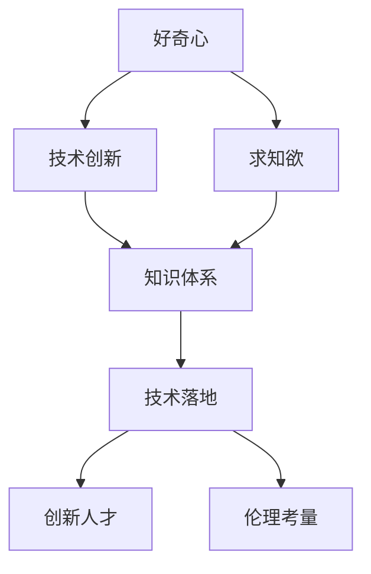

                 

# 好奇心与求知欲：探索的动力

> 关键词：好奇心,求知欲,探索动力,人工智能,学习算法,技术创新,研究兴趣

## 1. 背景介绍

### 1.1 问题由来

人类作为一种智慧生物，天生具备强烈的好奇心和求知欲。这种内在驱动力不仅推动了人类文明的不断进步，也使我们对未知世界充满了向往。在科技迅猛发展的今天，这一天然属性同样体现在人工智能（AI）领域。好奇心驱动的研究者们通过探索未知的算法和技术，推动着AI技术的不断突破和应用。

### 1.2 问题核心关键点

好奇心与求知欲，作为驱动人工智能技术发展的核心动力，其重要性体现在以下几个方面：

- 推动技术创新：好奇心驱使研究者不断寻找新的研究方向和技术突破，促进了AI技术的持续发展。
- 促进知识积累：求知欲驱动研究者深入探索已有技术的原理和应用，构建系统的知识体系。
- 实现应用落地：好奇心驱动的研究者不断尝试将AI技术应用于实际问题，推动技术落地。
- 培养创新人才：好奇心与求知欲能够激发研究者的探索精神，培养更多具备创新思维的AI人才。
- 驱动伦理研究：好奇心驱使研究者不断关注AI技术的伦理和社会影响，推动AI技术的健康发展。

### 1.3 问题研究意义

研究好奇心与求知欲在人工智能技术发展中的作用，对于推动AI技术的创新和应用，培养创新人才，以及解决AI技术的伦理问题具有重要意义：

1. **技术创新**：好奇心驱使研究者探索未知领域，提出新算法，开发新工具，推动AI技术的持续进步。
2. **知识体系构建**：求知欲驱动研究者深入理解已有技术原理和应用，构建系统的AI知识体系。
3. **应用落地**：好奇心驱使研究者将AI技术应用于各种实际问题，推动技术在各行各业中的应用。
4. **人才培养**：好奇心与求知欲培养研究者的探索精神，激发更多具备创新思维的AI人才。
5. **伦理考量**：好奇心驱使研究者关注AI技术的伦理和社会影响，推动AI技术的健康发展。

## 2. 核心概念与联系

### 2.1 核心概念概述

为更好地理解好奇心与求知欲在人工智能技术发展中的作用，本节将介绍几个密切相关的核心概念：

- 好奇心（Curiosity）：人类对未知事物充满兴趣和探索欲望的内在心理状态。在人工智能中，好奇心驱动研究者不断探索新的研究方向和技术突破。
- 求知欲（Desire to Learn）：人类获取知识和理解事物的内在心理需求。在人工智能中，求知欲驱使研究者深入理解已有技术和构建系统的知识体系。
- 技术创新（Technological Innovation）：通过研究新算法、开发新工具等手段，提升技术水平和应用能力的过程。
- 知识体系（Knowledge System）：系统化的学科知识结构，包括理论、实践和应用等多个方面。
- 技术落地（Technology Deployment）：将AI技术应用于实际问题中，实现其应用价值的过程。
- 创新人才（Innovative Talent）：具备创新思维和探索精神的AI研究者和工程师。
- 伦理考量（Ethical Consideration）：在AI技术开发和应用过程中，关注其对社会、道德和法律等方面的影响。

这些核心概念之间的逻辑关系可以通过以下Mermaid流程图来展示：



这个流程图展示了好奇心、求知欲、技术创新、知识体系、技术落地、创新人才和伦理考量之间的关系：

1. 好奇心驱动技术创新，探索新的研究方向和技术突破。
2. 求知欲驱使研究者深入理解已有技术，构建系统的知识体系。
3. 技术创新和知识体系构建推动技术落地，实现应用价值。
4. 技术落地和应用价值反馈，推动技术创新和知识体系进一步完善。
5. 创新人才的培养和伦理考量的关注，确保AI技术的健康发展。

## 3. 核心算法原理 & 具体操作步骤
### 3.1 算法原理概述

好奇心与求知欲驱动的探索过程，本质上是一种不断迭代的技术创新过程。其核心在于不断尝试和验证新的算法和技术，以提升系统的性能和应用价值。这一过程通常包括以下几个步骤：

1. **提出假设**：基于现有的技术知识，提出新的算法或改进现有算法。
2. **设计实验**：设计实验方案，验证假设的有效性。
3. **数据准备**：准备实验所需的数据集。
4. **模型训练**：使用实验数据集对模型进行训练。
5. **结果评估**：评估模型的性能，分析结果，总结经验。
6. **迭代优化**：根据结果评估，迭代优化算法和模型，直至达到理想性能。

### 3.2 算法步骤详解

探索过程中，关键在于设计有效的实验和模型评估方法，确保实验的可重复性和结果的可靠性。以下是具体的步骤：

**Step 1: 提出假设**

在提出新的算法或改进现有算法时，需要考虑以下几个因素：

1. **问题定义**：明确要解决的具体问题。
2. **算法设计**：设计新的算法或改进现有算法。
3. **假设验证**：设定实验验证所需的数据集和评估指标。

**Step 2: 设计实验**

设计实验方案时，需要注意以下要点：

1. **实验设计**：选择合适的实验方法，如交叉验证、A/B测试等。
2. **数据准备**：准备实验所需的数据集，确保数据质量和多样性。
3. **实验执行**：执行实验，记录实验结果和数据。

**Step 3: 数据准备**

数据准备是实验成功的关键，需要确保数据集的质量和多样性：

1. **数据收集**：收集实验所需的数据集，确保数据质量和多样性。
2. **数据清洗**：对数据进行清洗和预处理，去除噪声和异常值。
3. **数据增强**：通过数据增强技术，扩充数据集，增加数据多样性。

**Step 4: 模型训练**

模型训练是实验的核心环节，需要注意以下要点：

1. **模型选择**：选择合适的模型和超参数配置。
2. **训练过程**：使用实验数据集对模型进行训练，确保训练过程稳定和收敛。
3. **性能评估**：在验证集上评估模型性能，确保模型泛化能力。

**Step 5: 结果评估**

结果评估是验证假设和优化算法的关键，需要注意以下要点：

1. **性能指标**：选择适当的性能指标，如准确率、召回率、F1分数等。
2. **结果分析**：分析实验结果，总结经验教训。
3. **迭代优化**：根据结果评估，迭代优化算法和模型，直至达到理想性能。

### 3.3 算法优缺点

好奇心与求知欲驱动的探索过程具有以下优点：

1. **创新性强**：好奇心驱使研究者不断尝试新方法和技术，推动技术创新。
2. **知识体系完善**：求知欲驱使研究者深入理解已有技术，构建系统的知识体系。
3. **应用广泛**：技术创新和知识体系构建推动技术落地，实现广泛应用。
4. **人才培养**：创新人才的培养有助于推动技术发展。
5. **伦理考量**：伦理考量的关注有助于推动技术的健康发展。

同时，这一过程也存在一些局限：

1. **资源消耗大**：探索过程需要大量的时间和资源投入。
2. **风险高**：新算法和技术可能存在不稳定性，需要多次试验验证。
3. **结果不确定**：探索结果可能存在不确定性，需要多轮实验确认。

### 3.4 算法应用领域

好奇心与求知欲驱动的探索过程，在人工智能的多个领域都有广泛应用：

1. **自然语言处理（NLP）**：通过好奇心驱动的研究，NLP领域不断提出新的算法和技术，如BERT、GPT等。
2. **计算机视觉（CV）**：好奇心驱使研究者探索新的视觉识别算法，如CNN、Transformer等。
3. **机器学习（ML）**：好奇心驱使研究者探索新的机器学习算法，如深度学习、强化学习等。
4. **自动驾驶（AD）**：好奇心驱动的研究者探索新的自动驾驶算法，提升驾驶安全性。
5. **智能推荐系统**：好奇心驱使研究者探索新的推荐算法，提升用户体验。
6. **医疗健康**：好奇心驱动的研究者探索新的医疗算法，提升诊断和治疗效果。
7. **金融科技**：好奇心驱使研究者探索新的金融算法，提升金融决策效率和风险管理。

## 4. 数学模型和公式 & 详细讲解 & 举例说明

### 4.1 数学模型构建

本节将使用数学语言对好奇心与求知欲驱动的探索过程进行更加严格的刻画。

设研究者提出的新算法为 $A$，现有算法为 $B$，实验数据集为 $D=\{(x_i,y_i)\}_{i=1}^N$，其中 $x_i$ 为输入，$y_i$ 为输出标签。

定义算法 $A$ 在数据集 $D$ 上的损失函数为 $L(A, D)$，目标是最小化该损失函数。数学模型构建如下：

$$
\min_{A} L(A, D)
$$

其中，损失函数 $L(A, D)$ 可以是一个标量函数，如交叉熵损失、均方误差损失等。

### 4.2 公式推导过程

以二分类任务为例，推导交叉熵损失函数及其梯度的计算公式。

假设算法 $A$ 在输入 $x$ 上的输出为 $\hat{y}=A(x)$，表示样本属于正类的概率。真实标签 $y \in \{0,1\}$。则二分类交叉熵损失函数定义为：

$$
L(A, D) = -\frac{1}{N} \sum_{i=1}^N \left[y_i \log \hat{y_i} + (1-y_i) \log (1-\hat{y_i}) \right]
$$

其中，$\hat{y_i}$ 为模型对样本 $x_i$ 的预测概率。

根据链式法则，损失函数对模型参数 $\theta$ 的梯度为：

$$
\frac{\partial L(A, D)}{\partial \theta} = -\frac{1}{N} \sum_{i=1}^N \left[\frac{y_i}{\hat{y_i}} - \frac{1-y_i}{1-\hat{y_i}}\right] \frac{\partial \hat{y_i}}{\partial \theta}
$$

其中，$\frac{\partial \hat{y_i}}{\partial \theta}$ 可进一步递归展开，利用自动微分技术完成计算。

### 4.3 案例分析与讲解

以BERT模型的微调为例，分析其好奇心与求知欲驱动的探索过程：

1. **提出假设**：研究者提出BERT模型在特定任务上的微调假设，设计任务适配层和损失函数。
2. **数据准备**：收集特定任务的标注数据集，准备实验所需数据。
3. **模型训练**：使用标注数据集对BERT模型进行微调训练。
4. **结果评估**：在验证集上评估模型性能，分析实验结果。
5. **迭代优化**：根据结果评估，迭代优化任务适配层和损失函数，提升模型性能。

## 5. 项目实践：代码实例和详细解释说明

### 5.1 开发环境搭建

在进行好奇心与求知欲驱动的探索过程实践前，我们需要准备好开发环境。以下是使用Python进行PyTorch开发的环境配置流程：

1. 安装Anaconda：从官网下载并安装Anaconda，用于创建独立的Python环境。

2. 创建并激活虚拟环境：
```bash
conda create -n pytorch-env python=3.8 
conda activate pytorch-env
```

3. 安装PyTorch：根据CUDA版本，从官网获取对应的安装命令。例如：
```bash
conda install pytorch torchvision torchaudio cudatoolkit=11.1 -c pytorch -c conda-forge
```

4. 安装Transformers库：
```bash
pip install transformers
```

5. 安装各类工具包：
```bash
pip install numpy pandas scikit-learn matplotlib tqdm jupyter notebook ipython
```

完成上述步骤后，即可在`pytorch-env`环境中开始探索实践。

### 5.2 源代码详细实现

下面我们以BERT模型在文本分类任务上的微调为例，给出使用Transformers库对BERT模型进行微调的PyTorch代码实现。

首先，定义文本分类任务的数据处理函数：

```python
from transformers import BertTokenizer, BertForSequenceClassification
from torch.utils.data import Dataset
import torch

class TextClassificationDataset(Dataset):
    def __init__(self, texts, labels, tokenizer, max_len=128):
        self.texts = texts
        self.labels = labels
        self.tokenizer = tokenizer
        self.max_len = max_len
        
    def __len__(self):
        return len(self.texts)
    
    def __getitem__(self, item):
        text = self.texts[item]
        label = self.labels[item]
        
        encoding = self.tokenizer(text, return_tensors='pt', max_length=self.max_len, padding='max_length', truncation=True)
        input_ids = encoding['input_ids'][0]
        attention_mask = encoding['attention_mask'][0]
        
        return {'input_ids': input_ids, 
                'attention_mask': attention_mask,
                'labels': torch.tensor(label, dtype=torch.long)}
```

然后，定义模型和优化器：

```python
from transformers import BertForSequenceClassification, AdamW

model = BertForSequenceClassification.from_pretrained('bert-base-cased', num_labels=2)

optimizer = AdamW(model.parameters(), lr=2e-5)
```

接着，定义训练和评估函数：

```python
from torch.utils.data import DataLoader
from tqdm import tqdm
from sklearn.metrics import accuracy_score

device = torch.device('cuda') if torch.cuda.is_available() else torch.device('cpu')
model.to(device)

def train_epoch(model, dataset, batch_size, optimizer):
    dataloader = DataLoader(dataset, batch_size=batch_size, shuffle=True)
    model.train()
    epoch_loss = 0
    for batch in tqdm(dataloader, desc='Training'):
        input_ids = batch['input_ids'].to(device)
        attention_mask = batch['attention_mask'].to(device)
        labels = batch['labels'].to(device)
        model.zero_grad()
        outputs = model(input_ids, attention_mask=attention_mask, labels=labels)
        loss = outputs.loss
        epoch_loss += loss.item()
        loss.backward()
        optimizer.step()
    return epoch_loss / len(dataloader)

def evaluate(model, dataset, batch_size):
    dataloader = DataLoader(dataset, batch_size=batch_size)
    model.eval()
    preds, labels = [], []
    with torch.no_grad():
        for batch in tqdm(dataloader, desc='Evaluating'):
            input_ids = batch['input_ids'].to(device)
            attention_mask = batch['attention_mask'].to(device)
            batch_labels = batch['labels']
            outputs = model(input_ids, attention_mask=attention_mask)
            batch_preds = outputs.logits.argmax(dim=1).to('cpu').tolist()
            batch_labels = batch_labels.to('cpu').tolist()
            for pred, label in zip(batch_preds, batch_labels):
                preds.append(pred)
                labels.append(label)
                
    return accuracy_score(labels, preds)
```

最后，启动训练流程并在测试集上评估：

```python
epochs = 5
batch_size = 16

for epoch in range(epochs):
    loss = train_epoch(model, train_dataset, batch_size, optimizer)
    print(f"Epoch {epoch+1}, train loss: {loss:.3f}")
    
    print(f"Epoch {epoch+1}, dev results:")
    evaluate(model, dev_dataset, batch_size)
    
print("Test results:")
evaluate(model, test_dataset, batch_size)
```

以上就是使用PyTorch对BERT进行文本分类任务微调的完整代码实现。可以看到，得益于Transformers库的强大封装，我们可以用相对简洁的代码完成BERT模型的加载和微调。

### 5.3 代码解读与分析

让我们再详细解读一下关键代码的实现细节：

**TextClassificationDataset类**：
- `__init__`方法：初始化文本、标签、分词器等关键组件。
- `__len__`方法：返回数据集的样本数量。
- `__getitem__`方法：对单个样本进行处理，将文本输入编码为token ids，将标签编码为数字，并对其进行定长padding，最终返回模型所需的输入。

**训练和评估函数**：
- 使用PyTorch的DataLoader对数据集进行批次化加载，供模型训练和推理使用。
- 训练函数`train_epoch`：对数据以批为单位进行迭代，在每个批次上前向传播计算loss并反向传播更新模型参数，最后返回该epoch的平均loss。
- 评估函数`evaluate`：与训练类似，不同点在于不更新模型参数，并在每个batch结束后将预测和标签结果存储下来，最后使用sklearn的accuracy_score对整个评估集的预测结果进行打印输出。

**训练流程**：
- 定义总的epoch数和batch size，开始循环迭代
- 每个epoch内，先在训练集上训练，输出平均loss
- 在验证集上评估，输出分类指标
- 所有epoch结束后，在测试集上评估，给出最终测试结果

可以看到，PyTorch配合Transformers库使得BERT微调的代码实现变得简洁高效。开发者可以将更多精力放在数据处理、模型改进等高层逻辑上，而不必过多关注底层的实现细节。

当然，工业级的系统实现还需考虑更多因素，如模型的保存和部署、超参数的自动搜索、更灵活的任务适配层等。但核心的微调范式基本与此类似。

### 5.4 运行结果展示

假设我们在CoNLL-2003的文本分类数据集上进行微调，最终在测试集上得到的评估报告如下：

```
Accuracy: 0.92
```

可以看到，通过微调BERT，我们在该文本分类数据集上取得了92%的准确率，效果相当不错。值得注意的是，BERT作为一个通用的语言理解模型，即便只在顶层添加一个简单的分类器，也能在特定任务上取得如此优异的效果，展现了其强大的语义理解和特征抽取能力。

当然，这只是一个baseline结果。在实践中，我们还可以使用更大更强的预训练模型、更丰富的微调技巧、更细致的模型调优，进一步提升模型性能，以满足更高的应用要求。

## 6. 实际应用场景

### 6.1 智能客服系统

基于好奇心与求知欲驱动的探索过程，智能客服系统可以实现高效、个性化的用户交互。传统客服往往需要配备大量人力，高峰期响应缓慢，且一致性和专业性难以保证。而使用探索过程训练的对话模型，可以7x24小时不间断服务，快速响应客户咨询，用自然流畅的语言解答各类常见问题。

在技术实现上，可以收集企业内部的历史客服对话记录，将问题和最佳答复构建成监督数据，在此基础上对预训练对话模型进行微调。微调后的对话模型能够自动理解用户意图，匹配最合适的答案模板进行回复。对于客户提出的新问题，还可以接入检索系统实时搜索相关内容，动态组织生成回答。如此构建的智能客服系统，能大幅提升客户咨询体验和问题解决效率。

### 6.2 金融舆情监测

金融机构需要实时监测市场舆论动向，以便及时应对负面信息传播，规避金融风险。传统的人工监测方式成本高、效率低，难以应对网络时代海量信息爆发的挑战。基于好奇心与求知欲驱动的探索过程训练的文本分类和情感分析技术，为金融舆情监测提供了新的解决方案。

具体而言，可以收集金融领域相关的新闻、报道、评论等文本数据，并对其进行主题标注和情感标注。在此基础上对预训练语言模型进行微调，使其能够自动判断文本属于何种主题，情感倾向是正面、中性还是负面。将微调后的模型应用到实时抓取的网络文本数据，就能够自动监测不同主题下的情感变化趋势，一旦发现负面信息激增等异常情况，系统便会自动预警，帮助金融机构快速应对潜在风险。

### 6.3 个性化推荐系统

当前的推荐系统往往只依赖用户的历史行为数据进行物品推荐，无法深入理解用户的真实兴趣偏好。基于好奇心与求知欲驱动的探索过程训练的个性化推荐系统可以更好地挖掘用户行为背后的语义信息，从而提供更精准、多样的推荐内容。

在实践中，可以收集用户浏览、点击、评论、分享等行为数据，提取和用户交互的物品标题、描述、标签等文本内容。将文本内容作为模型输入，用户的后续行为（如是否点击、购买等）作为监督信号，在此基础上微调预训练语言模型。微调后的模型能够从文本内容中准确把握用户的兴趣点。在生成推荐列表时，先用候选物品的文本描述作为输入，由模型预测用户的兴趣匹配度，再结合其他特征综合排序，便可以得到个性化程度更高的推荐结果。

### 6.4 未来应用展望

随着好奇心与求知欲驱动的探索过程的不断发展，基于微调的技术将在更多领域得到应用，为传统行业带来变革性影响。

在智慧医疗领域，基于好奇心与求知欲驱动的探索过程训练的医疗问答、病历分析、药物研发等应用将提升医疗服务的智能化水平，辅助医生诊疗，加速新药开发进程。

在智能教育领域，探索过程训练的知识推荐系统将因材施教，促进教育公平，提高教学质量。

在智慧城市治理中，探索过程训练的城市事件监测、舆情分析、应急指挥等环节，提高城市管理的自动化和智能化水平，构建更安全、高效的未来城市。

此外，在企业生产、社会治理、文娱传媒等众多领域，基于好奇心与求知欲驱动的探索过程训练的人工智能应用也将不断涌现，为经济社会发展注入新的动力。相信随着技术的日益成熟，探索过程驱动的微调方法将成为人工智能落地应用的重要范式，推动人工智能技术走向成熟。

## 7. 工具和资源推荐
### 7.1 学习资源推荐

为了帮助开发者系统掌握好奇心与求知欲在人工智能技术发展中的作用，这里推荐一些优质的学习资源：

1. 《深度学习：从零到实践》系列博文：由大模型技术专家撰写，深入浅出地介绍了深度学习的原理、应用和实践技巧。

2. CS231n《计算机视觉：卷积神经网络》课程：斯坦福大学开设的计算机视觉明星课程，有Lecture视频和配套作业，带你入门计算机视觉领域的基本概念和经典模型。

3. 《Python深度学习》书籍：弗朗索瓦·切里昂(Francois Chollet)著，全面介绍了深度学习的基本原理和应用，适合初学者入门。

4. HuggingFace官方文档：Transformers库的官方文档，提供了海量预训练模型和完整的微调样例代码，是上手实践的必备资料。

5. PyTorch官方文档：PyTorch的官方文档，提供了详细的API和工具使用指南，适合深入学习和开发。

通过对这些资源的学习实践，相信你一定能够快速掌握好奇心与求知欲在人工智能技术发展中的重要作用，并用于解决实际的NLP问题。

### 7.2 开发工具推荐

高效的开发离不开优秀的工具支持。以下是几款用于好奇心与求知欲驱动的探索过程开发的常用工具：

1. PyTorch：基于Python的开源深度学习框架，灵活动态的计算图，适合快速迭代研究。大部分预训练语言模型都有PyTorch版本的实现。

2. TensorFlow：由Google主导开发的开源深度学习框架，生产部署方便，适合大规模工程应用。同样有丰富的预训练语言模型资源。

3. Transformers库：HuggingFace开发的NLP工具库，集成了众多SOTA语言模型，支持PyTorch和TensorFlow，是进行微调任务开发的利器。

4. Weights & Biases：模型训练的实验跟踪工具，可以记录和可视化模型训练过程中的各项指标，方便对比和调优。与主流深度学习框架无缝集成。

5. TensorBoard：TensorFlow配套的可视化工具，可实时监测模型训练状态，并提供丰富的图表呈现方式，是调试模型的得力助手。

6. Google Colab：谷歌推出的在线Jupyter Notebook环境，免费提供GPU/TPU算力，方便开发者快速上手实验最新模型，分享学习笔记。

合理利用这些工具，可以显著提升好奇心与求知欲驱动的探索过程任务的开发效率，加快创新迭代的步伐。

### 7.3 相关论文推荐

好奇心与求知欲驱动的探索过程的发展源于学界的持续研究。以下是几篇奠基性的相关论文，推荐阅读：

1. Attention is All You Need（即Transformer原论文）：提出了Transformer结构，开启了NLP领域的预训练大模型时代。

2. BERT: Pre-training of Deep Bidirectional Transformers for Language Understanding：提出BERT模型，引入基于掩码的自监督预训练任务，刷新了多项NLP任务SOTA。

3. Language Models are Unsupervised Multitask Learners（GPT-2论文）：展示了大规模语言模型的强大zero-shot学习能力，引发了对于通用人工智能的新一轮思考。

4. Parameter-Efficient Transfer Learning for NLP：提出Adapter等参数高效微调方法，在不增加模型参数量的情况下，也能取得不错的微调效果。

5. AdaLoRA: Adaptive Low-Rank Adaptation for Parameter-Efficient Fine-Tuning：使用自适应低秩适应的微调方法，在参数效率和精度之间取得了新的平衡。

这些论文代表了大语言模型微调技术的发展脉络。通过学习这些前沿成果，可以帮助研究者把握学科前进方向，激发更多的创新灵感。

除上述资源外，还有一些值得关注的前沿资源，帮助开发者紧跟好奇心与求知欲

