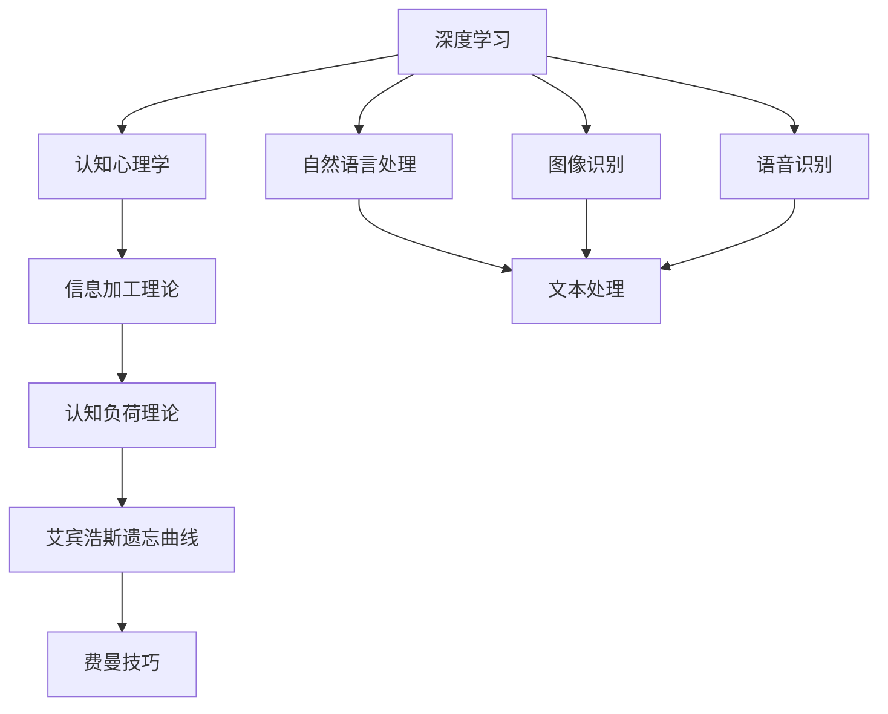
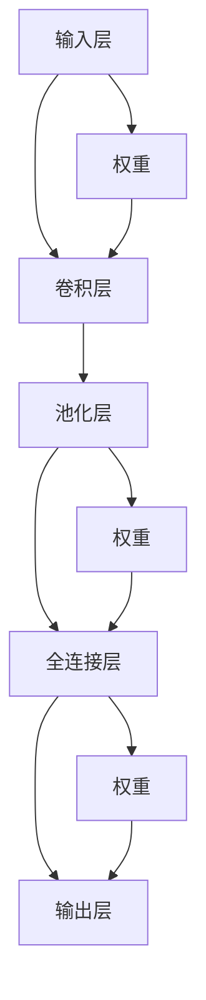

                 

# 如何提高学习效率：如何更好地学习和掌握知识？

> 关键词：学习效率, 学习策略, 知识掌握, 深度理解, 记忆技巧

## 1. 背景介绍

在当今信息爆炸的时代，知识的获取变得前所未有的容易。不论是线上课程、电子书、学术论文还是视频讲座，都可以轻松获取。然而，在知识过剩的背后，如何高效地学习和掌握知识，成为了一个更加复杂且值得深入探讨的问题。本文将深入分析如何更好地学习和掌握知识，通过结构化、系统化的学习策略，提升学习效率，实现深度理解。

## 2. 核心概念与联系

### 2.1 核心概念概述

为了更好地探讨如何提高学习效率，首先需要理解一些核心的学习概念：

- **深度学习（Deep Learning）**：一种通过多层神经网络结构进行复杂数据建模的技术，广泛应用于图像识别、语音识别和自然语言处理等领域。
- **认知心理学（Cognitive Psychology）**：研究人类信息加工过程，包括感知、记忆、思维等心理活动。
- **信息加工理论（Information Processing Theory）**：强调认知过程是对信息的编码、存储、检索和使用的过程。
- **认知负荷理论（Cognitive Load Theory）**：强调在学习过程中信息处理的难度和复杂性对学习效率的影响。
- **艾宾浩斯遗忘曲线（Ebbinghaus Forgetting Curve）**：揭示了人类记忆遗忘的规律，提示了复习的重要性。
- **费曼技巧（Feynman Technique）**：一种通过自我解释、简化、教给他人来加深理解的学习方法。

这些概念之间相互联系，构成了提升学习效率的底层理论基础。

### 2.2 概念间的关系

这些核心概念之间的关系可以通过以下Mermaid流程图来展示：



这个流程图展示了大语言模型微调过程中各个核心概念的关系：

1. 深度学习是实现认知心理过程的工具，可以用于自然语言处理、图像识别和语音识别等任务。
2. 认知心理学研究认知过程，提供了关于深度学习应用的理论基础。
3. 信息加工理论强调认知过程的信息处理，指导深度学习的模型设计。
4. 认知负荷理论揭示了信息处理的难度和复杂性对学习的影响，指导深度学习的参数设置和模型结构选择。
5. 艾宾浩斯遗忘曲线揭示了记忆遗忘的规律，提示了深度学习模型的复习机制。
6. 费曼技巧是一种通过自我解释、简化和教给他人来加深理解的方法，适用于深度学习模型的训练和优化。

## 3. 核心算法原理 & 具体操作步骤
### 3.1 算法原理概述

深度学习模型的训练过程可以看作是对输入数据的一种信息编码和表示。通过多层神经网络的反复迭代，模型逐渐学习到数据的潜在模式和结构。然而，学习效率和知识掌握的质量不仅仅依赖于模型结构，还依赖于学习策略和学习者的认知能力。

### 3.2 算法步骤详解

深度学习的训练过程可以分为以下几个关键步骤：

1. **数据准备**：收集、清洗和预处理训练数据，将其转换为模型可以处理的格式。
2. **模型初始化**：选择合适的深度学习模型架构，如卷积神经网络（CNN）、循环神经网络（RNN）或变压器（Transformer）等。
3. **前向传播**：将输入数据通过模型进行正向计算，得到模型的预测结果。
4. **损失计算**：计算模型预测结果与真实标签之间的差距，得到损失值。
5. **反向传播**：根据损失值计算模型参数的梯度，更新模型参数。
6. **模型验证**：在验证数据集上评估模型性能，避免过拟合。
7. **模型优化**：根据验证结果调整模型超参数和学习率，进行模型优化。
8. **模型部署**：将优化后的模型部署到实际应用中，进行推理和预测。

### 3.3 算法优缺点

深度学习模型的训练过程具有以下优点：

- **自动特征提取**：模型可以自动学习输入数据的特征表示，无需手动提取。
- **泛化能力**：通过大量数据训练，模型能够泛化到未见过的数据上。
- **可解释性强**：通过对模型的训练过程和结构进行可视化，可以更好地理解模型的行为。

然而，深度学习模型的训练过程也存在以下缺点：

- **计算资源需求高**：深度学习模型需要大量的计算资源和时间进行训练。
- **模型复杂度高**：深度学习模型通常具有大量的参数和复杂的结构，难以解释。
- **过拟合风险**：在训练数据量不足的情况下，模型容易出现过拟合现象。

### 3.4 算法应用领域

深度学习模型在以下领域得到了广泛应用：

- **自然语言处理**：用于文本分类、情感分析、机器翻译和问答系统等任务。
- **计算机视觉**：用于图像识别、目标检测和图像生成等任务。
- **语音识别**：用于语音识别、语音合成和语音情感分析等任务。
- **医疗健康**：用于医学影像诊断、基因分析和药物发现等任务。

## 4. 数学模型和公式 & 详细讲解 & 举例说明

### 4.1 数学模型构建

深度学习模型的训练过程可以抽象为以下数学模型：

$$
\theta = \arg\min_\theta \frac{1}{n}\sum_{i=1}^n L(f_\theta(x_i), y_i)
$$

其中 $\theta$ 表示模型参数，$f_\theta(x)$ 表示模型在输入 $x$ 上的预测结果，$L$ 表示损失函数，$y$ 表示真实标签，$n$ 表示样本数。

### 4.2 公式推导过程

以回归问题为例，假设模型输出 $y=\hat{y}(x)$，真实标签为 $y$，则损失函数可以定义为均方误差（MSE）：

$$
L(y, \hat{y}) = \frac{1}{2}\sum_{i=1}^n(y_i - \hat{y_i})^2
$$

将损失函数代入优化目标中，得到：

$$
\theta = \arg\min_\theta \frac{1}{n}\sum_{i=1}^n \frac{1}{2}(y_i - \hat{y_i})^2
$$

### 4.3 案例分析与讲解

以图像分类为例，假设使用卷积神经网络（CNN）进行训练，模型结构如图：



在训练过程中，使用随机梯度下降（SGD）优化算法，通过前向传播和反向传播计算梯度，更新模型参数。训练过程的具体步骤如图：


## 5. 项目实践：代码实例和详细解释说明

### 5.1 开发环境搭建

为了便于深度学习模型的开发和测试，需要搭建一个合适的开发环境。以下是Python环境下搭建深度学习模型环境的示例：

1. 安装Python：选择Python 3.x版本进行安装。
2. 安装Pip：从官网下载并安装Pip包管理工具。
3. 安装NumPy：NumPy是Python科学计算的核心库，使用pip install numpy命令进行安装。
4. 安装Pandas：Pandas是Python数据分析的核心库，使用pip install pandas命令进行安装。
5. 安装TensorFlow：TensorFlow是Google开发的深度学习框架，使用pip install tensorflow命令进行安装。
6. 安装Keras：Keras是基于TensorFlow等深度学习框架的高级API，使用pip install keras命令进行安装。

### 5.2 源代码详细实现

以下是一个简单的Python代码示例，用于训练一个简单的全连接神经网络模型进行图像分类：

```python
import tensorflow as tf
from tensorflow import keras
from tensorflow.keras import layers

# 加载数据集
(x_train, y_train), (x_test, y_test) = keras.datasets.mnist.load_data()

# 数据预处理
x_train = x_train / 255.0
x_test = x_test / 255.0

# 构建模型
model = keras.Sequential([
    layers.Flatten(input_shape=(28, 28)),
    layers.Dense(128, activation='relu'),
    layers.Dense(10)
])

# 编译模型
model.compile(optimizer='adam',
              loss=tf.keras.losses.SparseCategoricalCrossentropy(from_logits=True),
              metrics=['accuracy'])

# 训练模型
model.fit(x_train, y_train, epochs=10, validation_data=(x_test, y_test))

# 评估模型
model.evaluate(x_test, y_test)
```

### 5.3 代码解读与分析

上述代码实现了使用TensorFlow框架进行图像分类的简单神经网络模型训练。代码中涉及了数据预处理、模型构建、编译、训练和评估等步骤。以下是对代码的详细解读：

1. 数据加载和预处理：使用Keras内置的MNIST数据集，加载训练集和测试集，并将图像像素值归一化到[0,1]之间。
2. 模型构建：使用Sequential模型，定义输入层、全连接层和输出层，使用ReLU激活函数。
3. 模型编译：使用Adam优化器，定义交叉熵损失函数和准确率评估指标。
4. 模型训练：使用fit方法，指定训练轮数为10，并在测试集上进行验证。
5. 模型评估：使用evaluate方法，评估模型在测试集上的性能。

## 6. 实际应用场景

### 6.1 医疗影像诊断

深度学习模型在医疗影像诊断中得到了广泛应用。通过训练基于卷积神经网络的模型，可以对医学影像进行自动分类和诊断，提高医生的诊断效率和准确性。

### 6.2 自动驾驶

深度学习模型在自动驾驶领域得到了广泛应用。通过训练基于卷积神经网络和循环神经网络的模型，可以实现图像识别、目标检测和路径规划等功能，提升自动驾驶系统的安全性和可靠性。

### 6.3 语音识别

深度学习模型在语音识别领域得到了广泛应用。通过训练基于循环神经网络和长短期记忆网络的模型，可以实现语音识别、语音合成和语音情感分析等功能，提升语音交互的自然性和准确性。

## 7. 工具和资源推荐

### 7.1 学习资源推荐

为了帮助开发者系统掌握深度学习模型的开发和应用，以下是一些优质的学习资源：

1. Deep Learning Specialization（深度学习专项课程）：由Coursera和Andrew Ng合作开设，包括多个深度学习课程，涵盖了从基础到高级的各类主题。
2. Fast.ai：由Jeremy Howard和Rachel Thomas创办的深度学习平台，提供深入浅出的深度学习教程和实践项目。
3. PyTorch官方文档：PyTorch是深度学习领域的主流框架，官方文档提供了详尽的API和实践指南，是学习深度学习模型的重要资源。
4. TensorFlow官方文档：TensorFlow是Google开发的深度学习框架，官方文档提供了丰富的教程和示例代码，适合各类学习者。
5. Kaggle：Kaggle是一个数据科学和机器学习竞赛平台，提供了大量数据集和代码库，适合实践深度学习模型。

### 7.2 开发工具推荐

为了提高深度学习模型的开发效率，以下是一些常用的开发工具：

1. Jupyter Notebook：Jupyter Notebook是一个交互式的Python代码编辑器，适合编写和调试深度学习模型代码。
2. PyCharm：PyCharm是一个强大的Python IDE，提供了丰富的开发工具和调试功能，适合深度学习模型的开发和测试。
3. TensorBoard：TensorBoard是TensorFlow配套的可视化工具，可以实时监测模型训练状态，适合模型调优和调试。
4. Visual Studio Code：Visual Studio Code是一个跨平台的代码编辑器，支持Python、TensorFlow等深度学习框架的开发和调试。

### 7.3 相关论文推荐

深度学习模型是当前研究的热点领域，以下是几篇奠基性的相关论文，推荐阅读：

1. AlexNet：ImageNet Large Scale Visual Recognition Challenge，提出了卷积神经网络的经典结构。
2. VGGNet：Visual Geometry Group的卷积神经网络模型，定义了标准化的卷积层结构。
3. ResNet：Deep Residual Learning for Image Recognition，提出了残差连接技术，解决了深度神经网络的退化问题。
4. Inception：Going Deeper with Convolutions，提出了Inception模块，增加了网络的多样性。
5. Transformer：Attention is All You Need，提出了Transformer结构，开启了深度学习模型的新时代。

这些论文代表了大语言模型微调技术的发展脉络。通过学习这些前沿成果，可以帮助研究者把握学科前进方向，激发更多的创新灵感。

## 8. 总结：未来发展趋势与挑战

### 8.1 总结

本文详细探讨了如何提高学习效率，通过结构化、系统化的学习策略，提升学习效率，实现深度理解。通过分析深度学习模型的训练过程，以及相关的数学模型和公式，给出了模型训练的具体步骤和示例代码。同时，分析了深度学习模型在实际应用中的表现和挑战，提供了学习资源和开发工具的推荐，以及对未来发展的展望。

## 8.2 未来发展趋势

展望未来，深度学习模型将呈现以下几个发展趋势：

1. 模型结构多样性：深度学习模型将不再局限于传统的卷积神经网络和循环神经网络，将发展出更多新型的模型结构，如Transformer、注意力机制等。
2. 模型可解释性增强：深度学习模型的可解释性将得到更多关注，通过可视化工具和解释技术，提升模型的可理解性和可解释性。
3. 模型迁移学习能力提升：深度学习模型的迁移学习能力将得到提升，能够在不同领域和任务中实现更好的知识迁移。
4. 模型泛化能力增强：深度学习模型将具备更强的泛化能力，能够在更广泛的数据分布下实现高效的性能提升。
5. 模型自动化调优：深度学习模型的调优过程将变得更加自动化，通过自动化调优工具，实现高效、自动的模型训练和优化。

## 8.3 面临的挑战

尽管深度学习模型取得了显著进展，但在应用过程中仍面临诸多挑战：

1. 数据质量和多样性：深度学习模型的训练需要高质量、多样化的数据，而数据获取和标注成本较高。
2. 模型训练资源需求：深度学习模型需要大量的计算资源和时间进行训练，训练成本较高。
3. 模型过拟合问题：深度学习模型容易过拟合，需要采取一系列正则化技术进行防止。
4. 模型可解释性不足：深度学习模型的内部机制难以解释，难以满足高风险领域的需求。
5. 模型安全性问题：深度学习模型容易受到攻击和干扰，需要加强安全性保障。

## 8.4 研究展望

未来的研究需要在以下几个方面寻求新的突破：

1. 探索新的模型结构：通过新的模型结构设计，提升深度学习模型的性能和效率。
2. 研究新型的正则化技术：通过引入新的正则化技术，提高深度学习模型的泛化能力和鲁棒性。
3. 提升模型的可解释性：通过可视化工具和解释技术，提升深度学习模型的可解释性和可理解性。
4. 开发自动化调优工具：通过自动化调优工具，实现高效、自动的深度学习模型训练和优化。
5. 探索新的数据获取方式：通过数据增强和数据合成技术，解决深度学习模型训练数据不足的问题。

这些研究方向的探索，将引领深度学习模型技术迈向更高的台阶，为构建安全、可靠、可解释、可控的智能系统铺平道路。面向未来，深度学习模型技术还需要与其他人工智能技术进行更深入的融合，如知识表示、因果推理、强化学习等，多路径协同发力，共同推动人工智能技术的进步。

## 9. 附录：常见问题与解答

### Q1：如何选择合适的深度学习框架？

A: 深度学习框架的选择取决于具体的应用场景和需求。TensorFlow和PyTorch是目前最流行的深度学习框架，TensorFlow更适合于分布式训练和生产部署，而PyTorch更适合于研究和快速原型开发。Keras则是一个高级API，适合快速搭建深度学习模型。

### Q2：深度学习模型的训练过程中需要注意哪些问题？

A: 深度学习模型的训练过程中需要注意以下几个问题：

1. 数据准备：确保数据质量高，标注准确，数据集划分合理。
2. 模型选择：根据任务选择合适的模型结构，避免过拟合。
3. 模型调优：通过超参数调优和正则化技术，提升模型性能。
4. 模型评估：在验证集上进行评估，避免过拟合。
5. 模型部署：将训练好的模型部署到生产环境中，进行推理和预测。

### Q3：如何避免深度学习模型的过拟合问题？

A: 深度学习模型的过拟合问题可以通过以下方法解决：

1. 数据增强：通过旋转、裁剪、缩放等技术，增加数据多样性，避免模型过拟合。
2. 正则化：使用L2正则、Dropout等正则化技术，限制模型复杂度，防止过拟合。
3. 提前停止：在验证集上监测模型性能，一旦性能不再提升，即停止训练。
4. 模型集成：使用集成学习技术，如Bagging、Boosting等，提升模型泛化能力。

### Q4：如何提高深度学习模型的泛化能力？

A: 提高深度学习模型的泛化能力可以通过以下方法解决：

1. 数据增强：通过增加数据多样性，提升模型泛化能力。
2. 正则化：使用L2正则、Dropout等正则化技术，限制模型复杂度，提升泛化能力。
3. 模型集成：使用集成学习技术，如Bagging、Boosting等，提升模型泛化能力。
4. 迁移学习：通过在其他领域或任务上预训练模型，提升模型泛化能力。

### Q5：深度学习模型在实际应用中需要注意哪些问题？

A: 深度学习模型在实际应用中需要注意以下几个问题：

1. 数据质量：确保数据质量高，标注准确，数据集划分合理。
2. 模型选择：根据任务选择合适的模型结构，避免过拟合。
3. 模型调优：通过超参数调优和正则化技术，提升模型性能。
4. 模型评估：在验证集上进行评估，避免过拟合。
5. 模型部署：将训练好的模型部署到生产环境中，进行推理和预测。
6. 模型监控：实时监测模型性能，及时发现和解决性能问题。

通过以上学习资源和开发工具，相信您能够更好地掌握深度学习模型的开发和应用，提升学习效率，实现深度理解。面对未来的挑战和机遇，只有勇于创新、敢于突破，才能不断拓展深度学习模型的边界，推动人工智能技术的发展。

---

作者：禅与计算机程序设计艺术 / Zen and the Art of Computer Programming

