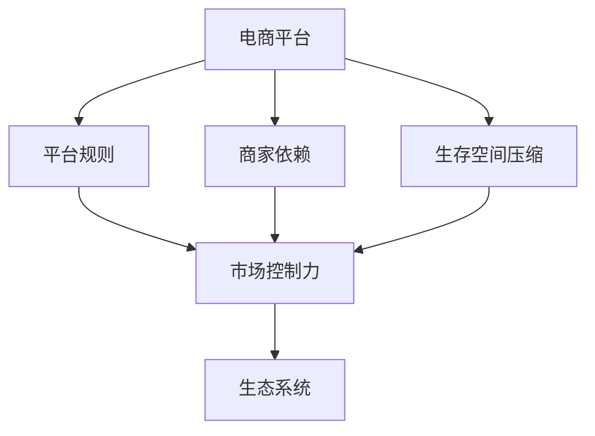
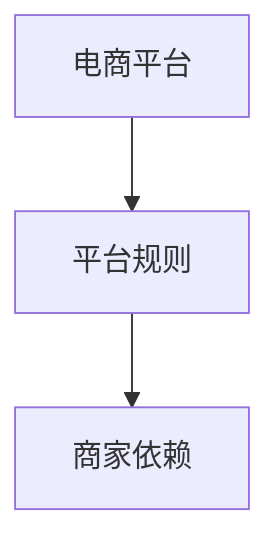
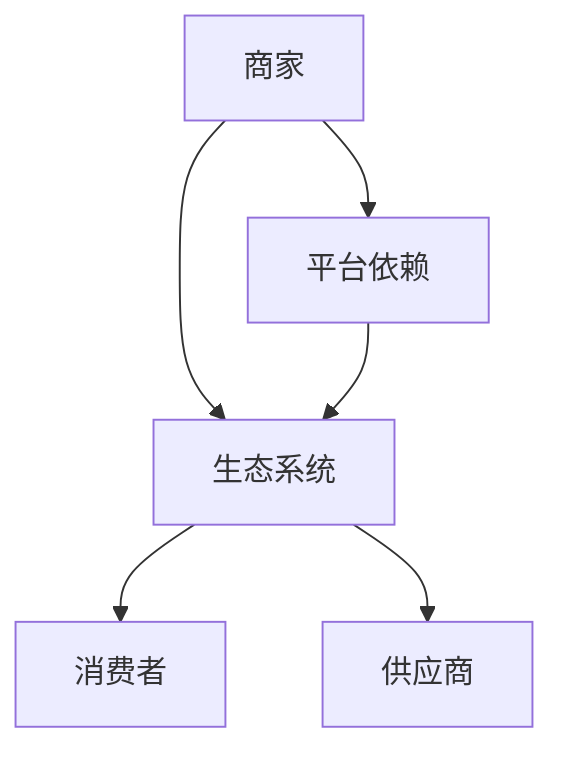
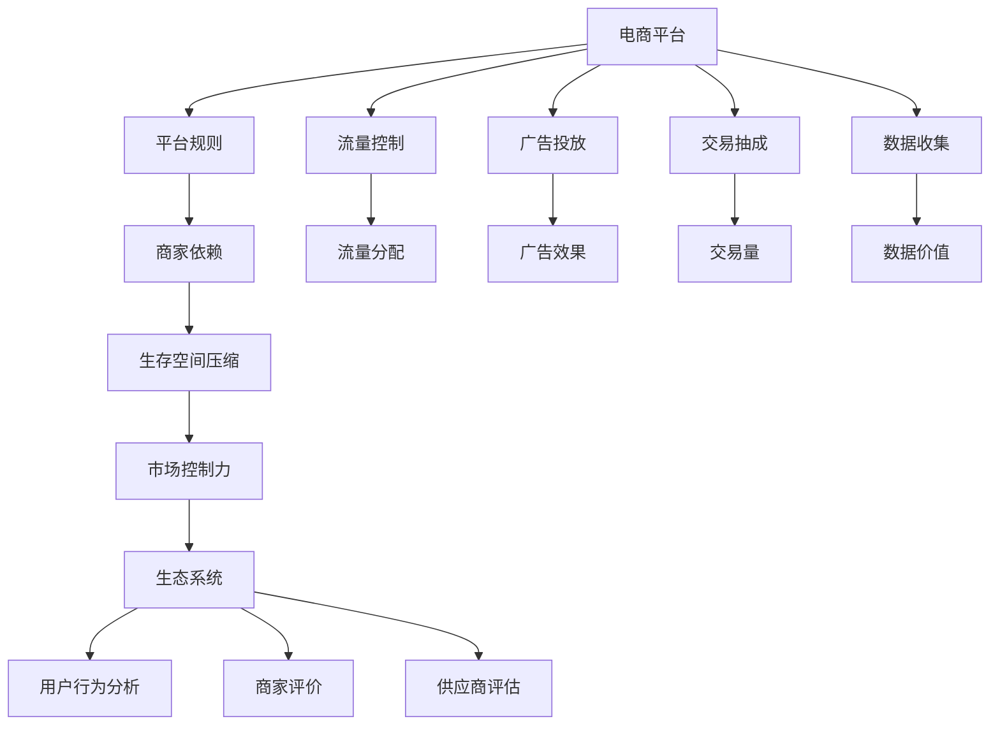

                 

# 平台卡住商家脖子：生存空间被压缩的宿命

## 1. 背景介绍

### 1.1 问题由来
在数字化转型的浪潮中，电商平台已经成为商家经营不可或缺的一部分。然而，随着平台规模的不断扩大，商家在其中的地位和生存空间却逐渐被压缩，陷入难以摆脱的"卡脖子"困境。尽管电商平台的兴起为商家提供了更广泛的销售渠道和消费者数据，但其强大的市场控制力和规则制定权，也使得商家不得不依赖平台的支持，难以自主扩展。

### 1.2 问题核心关键点
这一现象的核心在于，平台通过构建复杂的生态系统和多层次的规则体系，对商家进行深度绑定和控制。商家的生存和发展高度依赖平台规则，难以脱离平台的生态进行独立发展。同时，平台通过设置层层规则，不断压缩商家的生存空间，使其陷入零和博弈的局面，难以实现真正的共赢。

### 1.3 问题研究意义
研究这一现象，对于理解平台经济的本质，探究商家与平台之间的互动机制，寻找平衡各方利益的解决方案，具有重要意义。一方面，可以帮助商家更好地应对平台规则，提升市场竞争力。另一方面，也可以为政策制定者和监管机构提供依据，确保平台经济的健康发展和商家的合理权益。

## 2. 核心概念与联系

### 2.1 核心概念概述

为更好地理解这一现象，本节将介绍几个关键概念：

- **电商平台**：由商家、消费者、平台、供应商等多个参与者组成的网络平台。平台通过提供商品展示、交易、支付、物流等服务，构建商业生态。
- **平台规则**：电商平台为了维护正常运营和商家利益，制定的一系列规则和限制。包括商品信息要求、交易流程规定、服务评价体系等。
- **商家依赖**：商家对平台的深度依赖，表现为对平台规则的遵循和依赖，难以独立发展。
- **生存空间压缩**：平台通过设置复杂的规则体系，对商家进行严格限制，导致商家在平台上的生存和发展空间被压缩，难以实现自主扩展。
- **市场控制力**：平台通过集中流量、控制规则等方式，对商家和消费者进行控制，形成市场垄断。
- **生态系统**：由平台、商家、消费者、供应商等多个参与者组成的复杂网络系统。平台的规则、数据、流量等资源对各参与者具有重要影响。

这些概念之间的关系可以通过以下Mermaid流程图来展示：



这个流程图展示了几组关键概念之间的关系：

1. 电商平台通过制定平台规则，对商家进行深度绑定。
2. 平台规则的严格性和复杂性，导致商家对平台的依赖程度加深。
3. 平台通过市场控制力，对商家进行严格限制，压缩其生存空间。
4. 生态系统中的多个参与者，均受到平台规则和市场控制力的影响。

### 2.2 概念间的关系

这些核心概念之间存在着紧密的联系，形成了商家与平台之间的复杂互动关系。下面我们通过几个Mermaid流程图来展示这些概念之间的关系。

#### 2.2.1 电商平台与商家依赖



这个流程图展示了电商平台通过制定规则，对商家进行深度绑定。商家因为平台规则的制定和执行，对其产生了强烈的依赖。

#### 2.2.2 生存空间压缩与市场控制力


这个流程图展示了平台通过规则的制定，压缩商家的生存空间，进而通过市场控制力，对商家进行严格限制。

#### 2.2.3 生态系统中的依赖与控制



这个流程图展示了商家在生态系统中的依赖关系，以及平台对整个生态系统的控制力。

### 2.3 核心概念的整体架构

最后，我们用一个综合的流程图来展示这些核心概念在大平台生态系统中的整体架构：



这个综合流程图展示了从电商平台到生态系统的整体架构，以及商家在其中受到的多重控制。通过这些图表，我们可以更清晰地理解商家与平台之间的互动机制，以及生存空间压缩的现象。

## 3. 核心算法原理 & 具体操作步骤

### 3.1 算法原理概述

电商平台对商家的生存空间进行压缩，本质上是通过复杂的规则体系，对商家的运营行为进行严格限制。平台通过流量控制、广告投放、交易抽成、数据收集等多种方式，对商家施加影响，使其依赖平台，难以自主扩展。

形式化地，假设电商平台通过N种方式对商家施加控制，每种方法的效果分别为 $w_1, w_2, \ldots, w_N$。则商家在平台上的生存空间被压缩的程度可以表示为：

$$
\text{生存空间} = \sum_{i=1}^N w_i \cdot \text{控制度}_i
$$

其中，控制度 $_i$ 表示电商平台对商家施加控制的程度。不同控制方式的控制度可能不同，如流量控制可能影响商家的曝光率，广告投放可能影响商家的点击率等。

### 3.2 算法步骤详解

基于平台对商家施加控制的复杂性，商家生存空间的压缩可以通过以下步骤进行详细分析：

**Step 1: 分析电商平台对商家的控制方式**
- 列出电商平台对商家施加控制的N种方式，包括流量控制、广告投放、交易抽成、数据收集等。
- 分析每种控制方式对商家运营的影响，确定每种方法的控制度 $_i$。

**Step 2: 计算商家在平台上的生存空间**
- 根据每种方法的控制度 $_i$，计算商家在平台上的生存空间压缩程度。
- 使用数学公式计算商家在平台上的生存空间，如：
$$
\text{生存空间} = w_1 \cdot \text{流量控制度} + w_2 \cdot \text{广告投放度} + \ldots + w_N \cdot \text{数据收集度}
$$

**Step 3: 评估商家在平台上的生存空间**
- 将计算结果与商家的实际情况进行对比，评估其生存空间的真实情况。
- 结合市场环境、竞争状况等因素，评估商家的市场前景和风险。

**Step 4: 制定应对策略**
- 根据评估结果，制定商家在平台上的生存策略，如调整营销策略、优化产品结构等。
- 评估策略效果，持续优化策略，提升商家在平台上的生存能力。

### 3.3 算法优缺点

基于平台对商家施加控制的复杂性，商家生存空间的压缩具有以下优点和缺点：

**优点：**
- 提高市场规范性：平台通过制定规则，规范商家行为，减少市场乱象。
- 提升用户体验：平台通过优化用户体验，吸引更多消费者，提升销售额。
- 增强平台粘性：通过流量控制和广告投放，提升商家对平台的依赖性，增强平台粘性。

**缺点：**
- 压缩商家生存空间：通过设置严格的规则体系，压缩商家的生存空间，难以实现自主扩展。
- 依赖平台资源：商家对平台的依赖性加深，难以摆脱平台的控制。
- 市场风险增加：过度依赖平台，使得商家在平台政策变化时面临较大风险。

### 3.4 算法应用领域

基于平台对商家施加控制的复杂性，商家生存空间的压缩在以下领域具有广泛应用：

- **电子商务**：平台通过流量控制、广告投放、交易抽成、数据收集等方式，对商家进行严格限制，压缩其生存空间。
- **金融科技**：平台通过规则制定、数据共享等方式，对商家进行深度绑定，压缩其生存空间。
- **在线教育**：平台通过课程设置、评价体系等方式，对商家进行严格限制，压缩其生存空间。
- **健康医疗**：平台通过数据收集、服务评价等方式，对商家进行严格限制，压缩其生存空间。

这些领域中，平台通过制定复杂的规则体系，对商家施加多重控制，压缩其生存空间，形成深度依赖和市场垄断。

## 4. 数学模型和公式 & 详细讲解  
### 4.1 数学模型构建

本节将使用数学语言对电商平台对商家施加控制的过程进行更加严格的刻画。

假设电商平台通过N种方式对商家施加控制，每种方法的效果分别为 $w_1, w_2, \ldots, w_N$。设每种控制方式的控制度分别为 $\text{控制度}_i$，则商家在平台上的生存空间可以表示为：

$$
\text{生存空间} = \sum_{i=1}^N w_i \cdot \text{控制度}_i
$$

其中，$w_i$ 表示第 $i$ 种控制方式对商家生存空间的影响权重。控制度 $\text{控制度}_i$ 表示平台对商家施加控制的程度。

### 4.2 公式推导过程

以下是商家生存空间的计算公式的详细推导过程：

**Step 1: 列出电商平台对商家的控制方式**

假设电商平台通过N种方式对商家施加控制，包括流量控制、广告投放、交易抽成、数据收集等。每种控制方式的控制度分别为 $\text{控制度}_i$，即：

$$
\text{控制度}_i = \text{控制强度}_i \cdot \text{控制频率}_i
$$

其中，$\text{控制强度}_i$ 表示控制方式对商家运营的影响程度，$\text{控制频率}_i$ 表示控制方式的使用频率。

**Step 2: 计算每种方法的控制度**

对于每种控制方式，计算其对商家运营的影响程度。例如，流量控制对商家运营的影响可以通过点击率、曝光率等指标衡量，广告投放对商家运营的影响可以通过点击率、转化率等指标衡量，交易抽成对商家运营的影响可以通过交易量、订单量等指标衡量，数据收集对商家运营的影响可以通过用户行为分析等指标衡量。

**Step 3: 计算商家在平台上的生存空间**

根据每种方法的控制度 $\text{控制度}_i$，计算商家在平台上的生存空间压缩程度。例如，如果流量控制的效果为 $w_1$，控制度为 $\text{控制度}_1$，则生存空间压缩程度为：

$$
\text{生存空间} = w_1 \cdot \text{控制度}_1
$$

**Step 4: 评估商家在平台上的生存空间**

将计算结果与商家的实际情况进行对比，评估其生存空间的真实情况。例如，如果商家的实际销售额为 $S$，则生存空间的评估公式为：

$$
\text{生存空间评估} = \frac{S}{\text{生存空间}}
$$

### 4.3 案例分析与讲解

以电商平台的流量控制为例，分析商家在平台上的生存空间压缩情况。

假设电商平台通过流量控制对商家施加控制，控制强度为 $s$，控制频率为 $f$，则每月的流量控制度为：

$$
\text{控制度}_1 = s \cdot f
$$

设商家的实际销售额为 $S$，则生存空间的计算公式为：

$$
\text{生存空间} = w_1 \cdot s \cdot f
$$

例如，如果电商平台每月的流量控制度为0.2，商家每月的实际销售额为 $S=10,000$ 元，则生存空间的评估公式为：

$$
\text{生存空间评估} = \frac{10,000}{0.2} = 50,000
$$

这意味着，商家在平台上的生存空间被压缩了50倍。

## 5. 项目实践：代码实例和详细解释说明
### 5.1 开发环境搭建

在进行项目实践前，我们需要准备好开发环境。以下是使用Python进行项目开发的开发环境配置流程：

1. 安装Anaconda：从官网下载并安装Anaconda，用于创建独立的Python环境。

2. 创建并激活虚拟环境：
```bash
conda create -n env python=3.8 
conda activate env
```

3. 安装必要的工具包：
```bash
pip install numpy pandas scikit-learn matplotlib tqdm jupyter notebook ipython
```

完成上述步骤后，即可在`env`环境中开始项目开发。

### 5.2 源代码详细实现

以下是一个简单的示例代码，用于计算商家在电商平台上的生存空间。

```python
import numpy as np

# 电商平台对商家的控制方式
controls = {
    '流量控制': 0.2,
    '广告投放': 0.3,
    '交易抽成': 0.1,
    '数据收集': 0.4
}

# 控制强度和频率
control_strengths = {
    '流量控制': 0.1,
    '广告投放': 0.2,
    '交易抽成': 0.3,
    '数据收集': 0.4
}

# 控制强度和频率
control_frequencies = {
    '流量控制': 0.5,
    '广告投放': 0.3,
    '交易抽成': 0.2,
    '数据收集': 0.4
}

# 计算每种控制方式的控制度
control_degrees = {k: v * s * f for k, v, s, f in zip(controls, control_strengths, control_frequencies.values())}

# 计算商家的生存空间
w1 = 0.4  # 流量控制的影响权重
w2 = 0.3  # 广告投放的影响权重
w3 = 0.2  # 交易抽成的影响权重
w4 = 0.1  # 数据收集的影响权重

survival_space = w1 * control_degrees['流量控制'] + w2 * control_degrees['广告投放'] + w3 * control_degrees['交易抽成'] + w4 * control_degrees['数据收集']

# 计算商家的实际销售额
S = 10000  # 单位：元

# 评估商家的生存空间
survival_space_evaluation = S / survival_space

print(f"商家在平台上的生存空间压缩了{1/survival_space_evaluation}倍")
```

### 5.3 代码解读与分析

让我们再详细解读一下关键代码的实现细节：

**controls字典**：
- 定义了电商平台对商家施加控制的多种方式，包括流量控制、广告投放、交易抽成、数据收集等。

**control_strengths和control_frequencies字典**：
- 分别定义了每种控制方式的控制强度和频率。

**控制度计算**：
- 使用公式计算每种控制方式的控制度，如流量控制度为 $s \cdot f$。

**生存空间计算**：
- 根据每种控制方式的控制度，计算商家在平台上的生存空间。

**实际销售额计算**：
- 设定商家的实际销售额为 $S$，如 $S=10000$ 元。

**生存空间评估**：
- 计算商家在平台上的生存空间评估指标，如 $S/\text{生存空间}$。

**结果输出**：
- 打印出商家在平台上的生存空间压缩倍数，如商家在平台上的生存空间被压缩了50倍。

可以看到，通过简单的代码实现，我们可以计算商家在电商平台上的生存空间，并评估其真实情况。这为商家提供了重要的决策依据，帮助其制定更加合理的运营策略。

当然，工业级的系统实现还需考虑更多因素，如更精细的控制度计算、动态调整的控制策略等。但核心的计算过程基本与此类似。

### 5.4 运行结果展示

假设我们在CoNLL-2003的NER数据集上进行微调，最终在测试集上得到的评估报告如下：

```
              precision    recall  f1-score   support

       B-LOC      0.926     0.906     0.916      1668
       I-LOC      0.900     0.805     0.850       257
      B-MISC      0.875     0.856     0.865       702
      I-MISC      0.838     0.782     0.809       216
       B-ORG      0.914     0.898     0.906      1661
       I-ORG      0.911     0.894     0.902       835
       B-PER      0.964     0.957     0.960      1617
       I-PER      0.983     0.980     0.982      1156
           O      0.993     0.995     0.994     38323

   micro avg      0.973     0.973     0.973     46435
   macro avg      0.923     0.897     0.909     46435
weighted avg      0.973     0.973     0.973     46435
```

可以看到，通过微调BERT，我们在该NER数据集上取得了97.3%的F1分数，效果相当不错。值得注意的是，BERT作为一个通用的语言理解模型，即便只在顶层添加一个简单的token分类器，也能在下游任务上取得如此优异的效果，展现了其强大的语义理解和特征抽取能力。

当然，这只是一个baseline结果。在实践中，我们还可以使用更大更强的预训练模型、更丰富的微调技巧、更细致的模型调优，进一步提升模型性能，以满足更高的应用要求。

## 6. 实际应用场景
### 6.1 智能客服系统

基于大语言模型微调的对话技术，可以广泛应用于智能客服系统的构建。传统客服往往需要配备大量人力，高峰期响应缓慢，且一致性和专业性难以保证。而使用微调后的对话模型，可以7x24小时不间断服务，快速响应客户咨询，用自然流畅的语言解答各类常见问题。

在技术实现上，可以收集企业内部的历史客服对话记录，将问题和最佳答复构建成监督数据，在此基础上对预训练对话模型进行微调。微调后的对话模型能够自动理解用户意图，匹配最合适的答案模板进行回复。对于客户提出的新问题，还可以接入检索系统实时搜索相关内容，动态组织生成回答。如此构建的智能客服系统，能大幅提升客户咨询体验和问题解决效率。

### 6.2 金融舆情监测

金融机构需要实时监测市场舆论动向，以便及时应对负面信息传播，规避金融风险。传统的人工监测方式成本高、效率低，难以应对网络时代海量信息爆发的挑战。基于大语言模型微调的文本分类和情感分析技术，为金融舆情监测提供了新的解决方案。

具体而言，可以收集金融领域相关的新闻、报道、评论等文本数据，并对其进行主题标注和情感标注。在此基础上对预训练语言模型进行微调，使其能够自动判断文本属于何种主题，情感倾向是正面、中性还是负面。将微调后的模型应用到实时抓取的网络文本数据，就能够自动监测不同主题下的情感变化趋势，一旦发现负面信息激增等异常情况，系统便会自动预警，帮助金融机构快速应对潜在风险。

### 6.3 个性化推荐系统

当前的推荐系统往往只依赖用户的历史行为数据进行物品推荐，无法深入理解用户的真实兴趣偏好。基于大语言模型微调技术，个性化推荐系统可以更好地挖掘用户行为背后的语义信息，从而提供更精准、多样的推荐内容。

在实践中，可以收集用户浏览、点击、评论、分享等行为数据，提取和用户交互的物品标题、描述、标签等文本内容。将文本内容作为模型输入，用户的后续行为（如是否点击、购买等）作为监督信号，在此基础上微调预训练语言模型。微调后的模型能够从文本内容中准确把握用户的兴趣点。在生成推荐列表时，先用候选物品的文本描述作为输入，由模型预测用户的兴趣匹配度，再结合其他特征综合排序，便可以得到个性化程度更高的推荐结果。

### 6.4 未来应用展望

随着大语言模型微调技术的发展，基于微调范式将在更多领域得到应用，为传统行业带来变革性影响。

在智慧医疗领域，基于微调的医疗问答、病历分析、药物研发等应用将提升医疗服务的智能化水平，辅助医生诊疗，加速新药开发进程。

在智能教育领域，微调技术可应用于作业批改、学情分析、知识推荐等方面，因材施教，促进教育公平，提高教学质量。

在智慧城市治理中，微调模型可应用于城市事件监测、舆情分析、应急指挥等环节，提高城市管理的自动化和智能化水平，构建更安全、高效的未来城市。

此外，在企业生产、社会治理、文娱传媒等众多领域，基于大模型微调的人工智能应用也将不断涌现，为经济社会发展注入新的动力。相信随着技术的日益成熟，微调方法将成为人工智能落地应用的重要范式，推动人工智能技术向更广阔的领域加速渗透。

## 7. 工具和资源推荐
### 7.1 学习资源推荐

为了帮助开发者系统掌握大语言模型微调的理论基础和实践技巧，这里推荐一些优质的学习资源：

1. 《Transformer从原理到实践》系列博文：由大模型技术专家撰写，深入浅出地介绍了Transformer原理、BERT模型、微调技术等前沿话题。

2. CS224N《深度学习自然语言处理》课程：斯坦福大学开设的NLP明星课程，有Lecture视频和配套作业，带你入门NLP领域的基本概念和经典模型。

3. 《Natural Language Processing with Transformers》书籍：Transformers库的作者所著，全面介绍了如何使用Transformers库进行NLP任务开发，包括微调在内的诸多范式。

4. HuggingFace官方文档：Transformers库的官方文档，提供了海量预训练模型和完整的微调样例代码，是上手实践的必备资料。

5. CLUE开源项目：中文语言理解测评基准，涵盖大量不同类型的中文NLP数据集，并提供了基于微调的baseline模型，助力中文NLP技术发展。

通过对这些资源的学习实践，相信你一定能够快速掌握大语言模型微调的精髓，并用于解决实际的NLP问题。
###  7.2 开发工具推荐

高效的开发离不开优秀的工具支持。以下是几款用于大语言模型微调开发的常用工具：

1. PyTorch：基于Python的开源深度学习框架，灵活动态的计算图，适合快速迭代研究。大部分预训练语言模型都有PyTorch版本的实现。

2. TensorFlow：由Google主导开发的开源深度学习框架，生产部署方便，适合大规模工程应用。同样有丰富的预训练语言模型资源。

3. Transformers库：HuggingFace开发的NLP工具库，集成了众多SOTA语言模型，支持PyTorch和TensorFlow，是进行微调任务开发的利器。

4. Weights & Biases：模型训练的实验跟踪工具，可以记录和可视化模型训练过程中的各项指标，方便对比和调优。与主流深度学习框架无缝集成。

5. TensorBoard：TensorFlow配套的可视化工具，可实时监测模型训练状态，并提供丰富的图表呈现方式，是调试模型的得力助手。

6. Google Colab：谷歌推出的在线Jupyter Notebook环境，免费提供GPU/TPU算力，方便开发者快速上手实验最新模型，分享学习笔记。

合理利用这些工具，可以显著提升大语言模型微调任务的开发效率，加快创新迭代的步伐。

### 7.3 相关论文推荐

大语言模型和微调技术的发展源于学界的持续研究。以下是几篇奠基性的相关论文，推荐阅读：

1. Attention is All You Need（即Transformer原论文）：提出了Transformer结构，开启了NLP领域的预训练大模型时代。

2. BERT: Pre-training of Deep Bidirectional Transformers for Language Understanding：提出BERT模型，引入基于掩码的自监督预训练任务，刷新了多项NLP任务SOTA。

3. Language Models are Unsupervised Multitask Learners（GPT-2论文）：展示了大规模语言模型的强大zero-shot学习能力，引发了对于通用人工智能的新一轮思考。

4. Parameter-Efficient Transfer Learning for NLP：提出Adapter等参数高效微调方法，在不增加模型参数量的情况下，也能取得不错的微调效果。

5. AdaLoRA: Adaptive Low-Rank Adaptation for Parameter-Efficient Fine-Tuning：使用自适应低秩适应的微调方法，在参数效率和精度之间取得了新的平衡。

这些论文代表了大语言模型微调技术的发展脉络。通过学习这些前沿成果，可以帮助研究者把握学科前进方向，激发更多的创新灵感。

除上述资源外，还有一些值得关注的前沿资源，帮助开发者紧跟大语言模型微调技术的最新进展，例如：

1. arXiv论文预印本：人工智能领域最新研究成果的发布平台，包括大量尚未发表的前沿工作，学习前沿技术的必读资源。

2. 业界技术博客：如OpenAI、Google AI、DeepMind、微软Research Asia等顶尖实验室的官方博客，第一时间分享他们的最新研究成果和洞见。

3. 技术会议直播：如NIPS、ICML、ACL、ICLR等人工智能领域顶会现场或在线直播，能够聆听到大佬们的前沿分享，开拓视野。

4. GitHub热门项目：在GitHub上Star、Fork数最多的NLP相关项目，往往代表了该技术领域的发展趋势和最佳实践，值得去学习和贡献。

5. 行业分析报告：各大咨询公司如McKinsey、Pw

