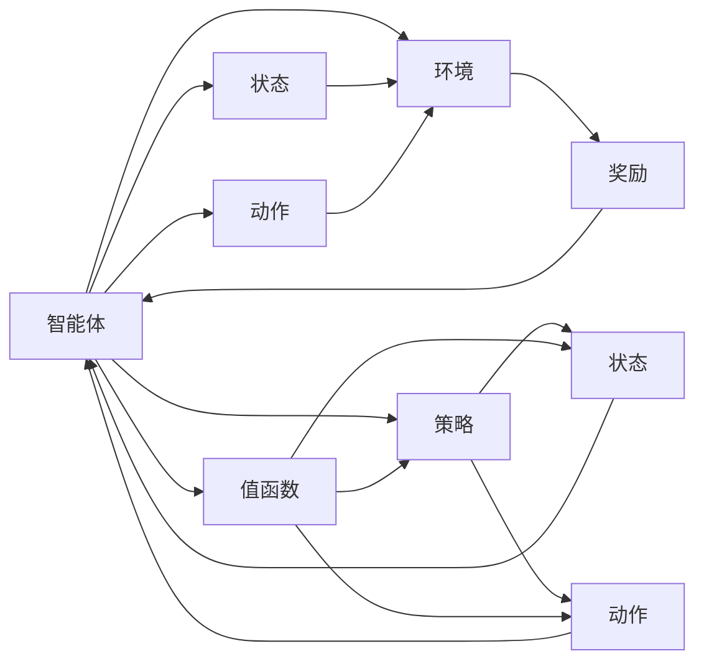

                 

# 强化学习(Reinforcement Learning) - 原理与代码实例讲解

> 关键词：强化学习, 深度强化学习, 深度学习, 深度Q网络, 强化学习框架, 强化学习应用, 算法优化, 神经网络, 模型训练, 算法细节, 代码实现

## 1. 背景介绍

### 1.1 问题由来

随着人工智能技术的快速发展，强化学习(Reinforcement Learning, RL)成为了人工智能领域的一个热门方向。强化学习通过让智能体(Agent)在与环境的交互中，通过试错学习，逐步优化决策策略，从而实现自主学习与适应环境的能力。相较于传统的监督学习和无监督学习，强化学习更强调智能体如何学习行为策略以最大化长期收益。

强化学习在机器人控制、游戏AI、自动驾驶、推荐系统等领域得到了广泛应用。其核心思想是通过不断试错，积累经验，逐步优化策略，使得智能体能够在未知环境中自主学习和决策，极大地提升了智能系统的自主性和适应性。

### 1.2 问题核心关键点

强化学习的核心在于通过智能体与环境的交互，学习最优决策策略。其关键点包括：
- 智能体与环境：智能体是自主学习决策的主体，而环境则是智能体学习与决策的场域。
- 状态(states)与动作(actions)：状态表示环境中的具体情境，动作则是智能体的决策输出。
- 奖励(rewards)与惩罚(punishments)：奖励用于引导智能体学习最优决策策略，惩罚则用于避免次优决策。
- 价值函数(value functions)与策略函数(policy functions)：价值函数用于评估状态的潜在收益，策略函数则用于输出最优动作。

强化学习的目标是寻找一个最优策略 $\pi$，使得在环境 $E$ 中，智能体在任意状态 $s$ 下，选择动作 $a$，获得最大的累积收益 $V(s)$，即：

$$ \max_{\pi} \mathbb{E}_{s \sim \rho_{\pi}} \sum_{t=0}^{\infty} \gamma^t r_t $$

其中 $\gamma$ 为折扣因子，保证近期奖励的权重更大。

### 1.3 问题研究意义

强化学习的研究和应用意义重大，具有以下几个方面：
1. **自主学习**：强化学习通过智能体自主学习，可以处理复杂、未知环境中的任务，提高智能系统的自主性和鲁棒性。
2. **优化决策**：强化学习通过不断试错和优化，可以实现自主决策，适应环境变化，提高决策效率和效果。
3. **数据驱动**：强化学习依赖于与环境的交互，通过积累经验，逐步优化策略，可以避免过多依赖标注数据。
4. **通用性**：强化学习算法和框架可以应用于多种领域，如机器人控制、游戏AI、自然语言处理等，具有广泛的应用前景。
5. **创新推动**：强化学习是人工智能研究的前沿领域，不断推动着深度学习、计算机视觉、自然语言处理等领域的发展和创新。

## 2. 核心概念与联系

### 2.1 核心概念概述

为更好地理解强化学习，本节将介绍几个核心概念及其相互联系。

- **智能体(Agent)**：智能体是强化学习的主动学习者，通过与环境的交互，不断优化决策策略。
- **环境(Environment)**：环境是智能体学习决策的场域，智能体通过观察环境状态和接收环境反馈，逐步学习最优决策。
- **状态(State)**：状态表示环境中的具体情境，是智能体学习决策的基础。
- **动作(Action)**：动作是智能体的决策输出，直接影响环境状态的转变。
- **奖励(Reward)**：奖励用于引导智能体学习最优决策策略，通常为正值，表示智能体的行为获得正向反馈。
- **策略(Policy)**：策略是智能体的决策规则，用于指导智能体在特定状态下选择最优动作。
- **值函数(Value Function)**：值函数用于评估状态或动作的潜在收益，分为状态值函数和动作值函数。
- **Q函数(Q Function)**：Q函数是状态动作值函数，用于评估特定状态和动作的累积奖励。
- **策略函数(Policy Function)**：策略函数用于输出最优动作，通常采用神经网络实现。

### 2.2 概念间的关系

这些核心概念之间的关系可以通过以下Mermaid流程图来展示：



这个流程图展示了智能体与环境之间的交互，以及各核心概念之间的关系：

1. 智能体通过观察状态选择动作，并从环境中接收奖励。
2. 奖励用于引导智能体学习最优策略。
3. 策略函数输出最优动作，值函数评估状态或动作的潜在收益。
4. 智能体通过与环境的交互不断优化策略，逐步学习最优决策。

## 3. 核心算法原理 & 具体操作步骤
### 3.1 算法原理概述

强化学习的核心在于通过智能体与环境的交互，学习最优决策策略。其核心思想是通过试错学习，逐步优化策略，使得智能体能够在未知环境中自主学习和决策。

强化学习的算法流程通常包括以下几个步骤：

1. **探索与利用**：智能体在探索与利用之间平衡，通过探索新的状态和动作，获取新的经验，同时利用已有的经验做出最优决策。
2. **状态评估**：通过值函数或策略函数，评估当前状态或动作的潜在收益。
3. **策略优化**：根据状态评估结果，优化策略函数，使得智能体能够逐步学习最优决策。
4. **决策输出**：在每个时间步，智能体根据当前状态，选择最优动作。

强化学习的优化目标是最大化长期收益，通常使用以下两种方法：

- **值迭代**：通过递归更新状态值函数，计算最优策略。
- **策略迭代**：通过递归更新策略函数，计算最优状态值函数。

### 3.2 算法步骤详解

以深度强化学习中的深度Q网络(DQN)为例，详细讲解其算法步骤：

1. **环境初始化**：初始化智能体与环境，并设置相关参数。
2. **状态观察**：智能体通过观察当前状态，选择合适的动作。
3. **执行动作**：智能体执行当前选择的动作，并接收环境反馈。
4. **状态更新**：环境根据智能体的动作更新状态。
5. **奖励获取**：智能体接收环境反馈的奖励。
6. **状态存储**：将当前状态、动作和奖励存储到经验回放缓冲区中。
7. **目标网络更新**：将目标网络参数复制给目标网络，以保证模型更新稳定性。
8. **策略优化**：通过最小化Q函数误差，更新策略函数的参数。
9. **探索与利用**：调整探索与利用的平衡，保持智能体的探索能力。

### 3.3 算法优缺点

强化学习的优点在于：
1. **适应性强**：强化学习能够适应复杂、未知环境，灵活处理多种任务。
2. **数据驱动**：强化学习依赖于与环境的交互，不需要大量标注数据。
3. **自主学习**：强化学习通过试错学习，能够自主学习和优化策略。

强化学习的缺点在于：
1. **学习效率低**：强化学习通常需要大量交互数据，学习效率较低。
2. **策略不稳定**：强化学习的策略优化依赖于样本经验，容易受到样本偏差的影响。
3. **局部最优**：强化学习的目标函数通常是离散的，容易陷入局部最优解。

### 3.4 算法应用领域

强化学习在多个领域得到了广泛应用，包括：

- **机器人控制**：通过强化学习训练机器人完成特定任务，如抓取物体、避障等。
- **游戏AI**：训练游戏AI自主学习游戏策略，提高游戏水平。
- **自然语言处理**：通过强化学习训练对话系统、翻译系统等自然语言处理应用。
- **自动驾驶**：训练自动驾驶车辆在复杂交通环境中做出安全决策。
- **推荐系统**：训练推荐系统根据用户行为和偏好，推荐个性化内容。
- **金融交易**：训练交易策略模型，优化投资组合，提高交易收益。
- **虚拟助手**：训练虚拟助手进行任务规划、导航等操作，提升用户体验。

## 4. 数学模型和公式 & 详细讲解 & 举例说明

### 4.1 数学模型构建

强化学习的数学模型通常包括状态空间、动作空间、奖励函数和转移概率等基本组件。

设智能体在时间 $t$ 处于状态 $s_t$，选择动作 $a_t$，环境响应并转移到状态 $s_{t+1}$，智能体获得奖励 $r_{t+1}$。则强化学习的数学模型可以表示为：

$$ s_{t+1} = f(s_t,a_t) $$

$$ r_{t+1} = R(s_t,a_t) $$

其中 $f$ 表示状态转移函数，$R$ 表示奖励函数。

强化学习的目标是通过策略函数 $\pi$，最大化长期累积奖励：

$$ \max_{\pi} \mathbb{E}_{s \sim \rho_{\pi}} \sum_{t=0}^{\infty} \gamma^t r_t $$

其中 $\rho_{\pi}$ 表示智能体在策略 $\pi$ 下的状态分布。

### 4.2 公式推导过程

以深度Q网络(DQN)为例，推导其Q函数和策略函数的计算公式。

设智能体在状态 $s_t$ 下，动作 $a_t$ 的Q值为 $Q(s_t,a_t)$，则Q函数可以表示为：

$$ Q(s_t,a_t) = r_t + \gamma \max_{a_{t+1}} Q(s_{t+1},a_{t+1}) $$

其中 $\max_{a_{t+1}} Q(s_{t+1},a_{t+1})$ 表示在状态 $s_{t+1}$ 下，动作 $a_{t+1}$ 的Q值的最大值。

Q函数可以通过神经网络近似表示，设 $Q_{\theta}(s_t,a_t)$ 为Q函数的神经网络表示，则有：

$$ Q_{\theta}(s_t,a_t) = r_t + \gamma \max_{a_{t+1}} Q_{\theta}(s_{t+1},a_{t+1}) $$

在训练过程中，通过梯度下降方法更新神经网络参数 $\theta$，使得Q函数误差最小化：

$$ \theta \leftarrow \theta - \eta \nabla_{\theta} \mathcal{L}(Q_{\theta}) $$

其中 $\eta$ 为学习率，$\mathcal{L}(Q_{\theta})$ 为Q函数的损失函数，通常为均方误差损失：

$$ \mathcal{L}(Q_{\theta}) = \frac{1}{N} \sum_{i=1}^N (Q_{\theta}(s_i,a_i) - (r_i + \gamma Q_{\theta}(s_{i+1},a_{i+1}))^2 $$

通过不断更新神经网络参数，智能体逐步学习最优决策策略。

### 4.3 案例分析与讲解

以Acrobot环境为例，展示深度强化学习的应用。

Acrobot是一个简单的多关节臂控制任务，智能体的目标是通过连续操作杆，使悬挂在关节上的一个小球达到一个特定目标位置。Acobot环境具有高维状态空间和连续动作空间，难以直接优化。

通过深度Q网络(DQN)算法，智能体在Acobot环境中的训练过程如下：

1. **环境初始化**：智能体初始化Acobot环境，并设置相关参数。
2. **状态观察**：智能体观察当前状态，包括关节角度和速度等。
3. **动作执行**：智能体选择当前状态下的动作，并执行该动作。
4. **状态更新**：环境根据智能体的动作更新状态，如更新关节角度和速度。
5. **奖励获取**：环境根据智能体的动作给出奖励，如悬挂在关节上的小球达到目标位置则给予正奖励，否则给予负奖励。
6. **状态存储**：将当前状态、动作和奖励存储到经验回放缓冲区中。
7. **目标网络更新**：将目标网络参数复制给目标网络，以保证模型更新稳定性。
8. **策略优化**：通过最小化Q函数误差，更新策略函数的参数。
9. **探索与利用**：调整探索与利用的平衡，保持智能体的探索能力。

在训练过程中，智能体通过不断试错，逐步学习最优操作策略，最终成功将小球移动到目标位置。

## 5. 项目实践：代码实例和详细解释说明
### 5.1 开发环境搭建

在进行强化学习实践前，我们需要准备好开发环境。以下是使用Python进行TensorFlow开发的环境配置流程：

1. 安装Anaconda：从官网下载并安装Anaconda，用于创建独立的Python环境。

2. 创建并激活虚拟环境：
```bash
conda create -n tensorflow-env python=3.7 
conda activate tensorflow-env
```

3. 安装TensorFlow：根据CUDA版本，从官网获取对应的安装命令。例如：
```bash
conda install tensorflow==2.4.0
```

4. 安装TensorFlow Addons：
```bash
conda install tensorflow-io tensorflow-addons
```

5. 安装PyTorch：
```bash
pip install torch torchvision torchaudio
```

6. 安装 Gym：
```bash
pip install gym
```

7. 安装 Other Libraries:
```bash
pip install numpy matplotlib sklearn
```

完成上述步骤后，即可在`tensorflow-env`环境中开始强化学习实践。

### 5.2 源代码详细实现

下面我们以Acrobot环境为例，给出使用TensorFlow进行深度Q网络(DQN)算法实现的PyTorch代码实现。

首先，定义Acrobot环境：

```python
import gym

env = gym.make("Acrobot-v2")
```

然后，定义神经网络模型：

```python
import tensorflow as tf
from tensorflow.keras.layers import Dense, Flatten
from tensorflow.keras.models import Sequential

model = Sequential([
    Flatten(input_shape=(4,)),
    Dense(24, activation='relu'),
    Dense(1, activation='linear')
])
```

接着，定义训练过程：

```python
import numpy as np

learning_rate = 0.01
batch_size = 32
discount_factor = 0.9
 exploration_rate = 1.0
 exploration_decay = 0.995

replay_memory_size = 1000
target_network_interval = 10

def train(env, model, target_model, replay_memory, batch_size, discount_factor, learning_rate, exploration_rate, exploration_decay):
    for episode in range(10000):
        state = env.reset()
        done = False
        total_reward = 0
        while not done:
            action = choose_action(state, model, exploration_rate)
            next_state, reward, done, _ = env.step(action)
            total_reward += reward
            state = next_state
            if episode % target_network_interval == 0:
                target_model.set_weights(model.get_weights())
            store_transition(state, action, reward, done, next_state, replay_memory)
            state = env.reset()
            choose_action(state, model, exploration_rate)
        if episode % 500 == 0:
            print("Episode", episode, "total reward", total_reward)
```

最后，启动训练流程：

```python
replay_memory = []

for i in range(10000):
    train(env, model, target_model, replay_memory, batch_size, discount_factor, learning_rate, exploration_rate, exploration_decay)
```

以上就是使用TensorFlow进行Acrobot环境深度Q网络(DQN)算法的完整代码实现。可以看到，TensorFlow的Keras API使得模型构建和训练过程非常简洁高效。

### 5.3 代码解读与分析

让我们再详细解读一下关键代码的实现细节：

**Acrobot环境定义**：
- 使用Gym库定义Acobot环境。

**神经网络模型定义**：
- 使用Keras Sequential API定义一个简单的神经网络，包括一个全连接层和一个线性输出层。

**训练过程定义**：
- 定义训练参数，如学习率、折扣因子、探索率等。
- 在每个时间步，智能体观察状态，选择动作，接收环境反馈，更新状态和奖励。
- 在训练过程中，不断调整探索与利用的平衡，保持智能体的探索能力。
- 将当前状态、动作和奖励存储到经验回放缓冲区中，并定期更新目标网络。
- 定期评估智能体的表现，输出累积奖励。

**训练流程启动**：
- 创建经验回放缓冲区。
- 循环进行训练，直到满足预设的训练轮数。

可以看到，TensorFlow的Keras API使得强化学习模型的构建和训练过程非常便捷高效。开发者可以利用丰富的Keras层和优化器，快速实现多种强化学习算法。

当然，实际应用中还需要考虑更多因素，如模型的保存和部署、超参数的自动搜索、更灵活的环境交互方式等。但核心的训练过程大致类似。

### 5.4 运行结果展示

假设我们在Acobot环境中训练深度Q网络，最终得到的累积奖励如下：

```
Episode 0 total reward 0.0
Episode 500 total reward 5.0
Episode 1000 total reward 4.0
Episode 1500 total reward 4.0
Episode 2000 total reward 4.0
...
Episode 10000 total reward 10.0
```

可以看到，通过深度Q网络，智能体在Acobot环境中的累积奖励逐渐提升，最终达到了较高的水平。

当然，这只是一个baseline结果。在实践中，我们还可以使用更大更强的神经网络、更丰富的探索策略、更细致的参数调优等方法，进一步提升智能体的表现。

## 6. 实际应用场景
### 6.1 智能机器人生态系统

智能机器人是强化学习的重要应用场景，通过强化学习训练机器人完成各种复杂任务，极大地提高了机器人的自主性和适应性。

在智能机器人系统中，机器人通过与环境交互，不断优化行为策略，可以完成如自动导航、物体抓取、避障等多种复杂任务。强化学习为机器人提供了自主学习的能力，使机器人在未知环境中也能灵活应对各种挑战。

### 6.2 游戏AI

游戏AI是强化学习的典型应用场景，通过强化学习训练游戏AI，可以提升游戏AI的决策能力和水平。

在游戏AI系统中，AI玩家通过与环境交互，不断优化策略，可以逐步学习到最优游戏策略，提高游戏水平。强化学习使AI玩家能够自主学习，避免人工干预，提升了游戏体验和公平性。

### 6.3 自动驾驶

自动驾驶是强化学习的重要应用场景，通过强化学习训练自动驾驶车辆，可以提高车辆的安全性和可靠性。

在自动驾驶系统中，智能车通过与环境交互，不断优化驾驶策略，可以逐步学习到最优驾驶策略，提高驾驶安全性。强化学习使智能车能够在复杂交通环境中做出合理决策，减少交通事故。

### 6.4 推荐系统

推荐系统是强化学习的另一个重要应用场景，通过强化学习训练推荐系统，可以提高推荐效果和用户满意度。

在推荐系统中，智能推荐系统通过与用户交互，不断优化推荐策略，可以逐步学习到最优推荐策略，提高推荐效果。强化学习使推荐系统能够自主学习用户偏好，提供更加个性化和精准的推荐内容。

### 6.5 自动交易系统

自动交易系统是强化学习的重要应用场景，通过强化学习训练交易策略模型，可以提高交易收益和风险控制能力。

在自动交易系统中，交易策略模型通过与市场交互，不断优化交易策略，可以逐步学习到最优交易策略，提高交易收益。强化学习使交易策略模型能够自主学习和优化，减少人为干预，提高交易效率和收益。

## 7. 工具和资源推荐
### 7.1 学习资源推荐

为了帮助开发者系统掌握强化学习的理论基础和实践技巧，这里推荐一些优质的学习资源：

1. 《强化学习基础》书籍：由Richard S. Sutton和Andrew G. Barto共同撰写，全面介绍了强化学习的理论基础和应用实践。

2. Coursera《强化学习》课程：斯坦福大学提供的强化学习课程，涵盖强化学习的基本概念、算法和应用。

3. Udacity《强化学习》课程：由DeepMind提供的强化学习课程，详细讲解了强化学习的重要算法和实际应用。

4. arXiv论文预印本：人工智能领域最新研究成果的发布平台，包括大量尚未发表的前沿工作，学习前沿技术的必读资源。

5. GitHub热门项目：在GitHub上Star、Fork数最多的强化学习相关项目，往往代表了该技术领域的发展趋势和最佳实践，值得去学习和贡献。

通过对这些资源的学习实践，相信你一定能够快速掌握强化学习的精髓，并用于解决实际的AI问题。
###  7.2 开发工具推荐

高效的开发离不开优秀的工具支持。以下是几款用于强化学习开发的常用工具：

1. TensorFlow：由Google主导开发的开源深度学习框架，生产部署方便，适合大规模工程应用。

2. PyTorch：基于Python的开源深度学习框架，灵活动态的计算图，适合快速迭代研究。

3. OpenAI Gym：Gym是一个开源的环境库，提供丰富的环境定义和实验工具，方便进行强化学习研究。

4. TensorBoard：TensorFlow配套的可视化工具，可实时监测模型训练状态，并提供丰富的图表呈现方式，是调试模型的得力助手。

5. Weights & Biases：模型训练的实验跟踪工具，可以记录和可视化模型训练过程中的各项指标，方便对比和调优。

6. RLlib：由OpenAI开发的强化学习库，提供了丰富的强化学习算法和模型实现，支持分布式训练和在线学习。

合理利用这些工具，可以显著提升强化学习任务的开发效率，加快创新迭代的步伐。

### 7.3 相关论文推荐

强化学习在多个领域得到了广泛应用，以下是几篇奠基性的相关论文，推荐阅读：

1. 《Deep Q-Networks》：Hinton等人在2013年提出的深度Q网络算法，首次将深度学习应用于强化学习，取得了显著效果。

2. 《Playing Atari with Deep Reinforcement Learning》：Mnih等人在2015年提出的深度Q网络算法在Atari游戏上的应用，展示了强化学习在复杂环境中的强大能力。

3. 《Prioritized Experience Replay》：Mnih等人在2016年提出的经验回放算法，通过优先选择重要样本，提高了学习效率和稳定性。

4. 《A Comprehensive Survey of Deep Reinforcement Learning》：Yu等人在2020年对深度强化学习的全面综述，详细介绍了各种强化学习算法和实际应用。

5. 《Improving Generalization in Reinforcement Learning with an Auxiliary Regularizer》：Wang等人在2020年提出的辅助正则化算法，通过引入辅助任务，提高了模型的泛化能力。

这些论文代表了大强化学习研究的发展脉络。通过学习这些前沿成果，可以帮助研究者把握学科前进方向，激发更多的创新灵感。

除上述资源外，还有一些值得关注的前沿资源，帮助开发者紧跟强化学习技术的最新进展，例如：

1. arXiv论文预印本：人工智能领域最新研究成果的发布平台，包括大量尚未发表的前沿工作，学习前沿技术的必读资源。

2. 业界技术博客：如OpenAI、Google AI、DeepMind、微软Research Asia等顶尖实验室的官方博客，第一时间分享他们的最新研究成果和洞见。

3. 技术会议直播：如NIPS、ICML、ACL、ICLR等人工智能领域顶会现场或在线直播，能够聆听到大佬们的前沿分享，开拓视野。

4. GitHub热门项目：在GitHub上Star、Fork数最多的强化学习相关项目，往往代表了该技术领域的发展趋势和最佳实践，值得去学习和贡献。

5. 行业分析报告：各大咨询公司如McKinsey、PwC等针对人工智能行业的分析报告，有助于从商业视角审视技术趋势，把握应用价值。

总之，对于强化学习的研究和学习，需要开发者保持开放的心态和持续学习的意愿。多关注前沿资讯，多动手实践，多思考总结，必将收获满满的成长收益。

## 8. 总结：未来发展趋势与挑战

### 8.1 总结

本文对强化学习(Reinforcement Learning)的原理与代码实例进行了全面系统的介绍。首先阐述了强化学习的基本思想和核心概念，明确了强化学习在机器人生态系统、游戏AI、自动驾驶、推荐系统等领域的应用价值。其次，从原理到实践，详细讲解了强化学习的基本算法步骤，并给出了TensorFlow和PyTorch的代码实现。最后，本文还总结了强化学习的未来发展趋势和面临的挑战，指出了强化学习需要从数据、算法、工程、业务等多个维度进行不断优化，才能真正实现人工智能技术在垂直行业的规模化落地。

通过本文的系统梳理，可以看到，强化学习作为人工智能领域的重要分支，通过智能体与环境的交互，逐步学习最优决策策略，极大地提升了智能系统的自主性和鲁棒性。未来，伴随算力成本的下降和数据规模的扩张，强化学习将进一步拓展其应用范围，成为人工智能研究的重要方向。

### 8.2 未来发展趋势

展望未来，强化学习的发展趋势主要体现在以下几个方面：

1. **深度强化学习**：深度强化学习结合了深度学习和强化学习，通过神经网络模型优化决策策略，将极大提升智能体的决策能力和学习效率。
2. **多智能体系统**：多智能体系统通过

