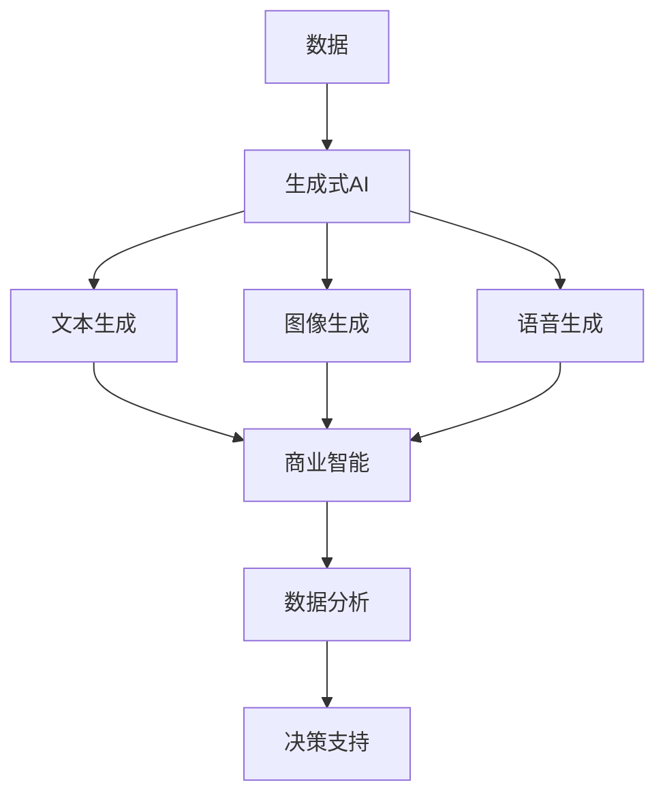
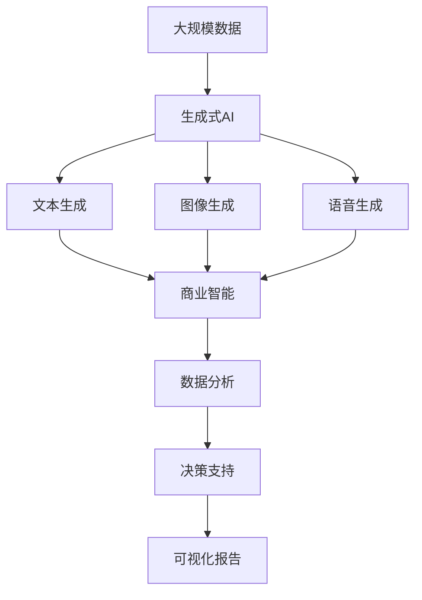

                 

# 生成式AIGC：商业智能的未来方向

## 1. 背景介绍

### 1.1 问题由来
在快速发展的数字经济时代，商业智能（Business Intelligence，BI）作为数据分析和决策支持的重要手段，扮演着至关重要的角色。然而，传统的BI系统面临着数据复杂、处理效率低、可视化界面单调等诸多挑战。尤其是，当涉及自然语言处理（Natural Language Processing，NLP）时，BI系统的表现往往不尽如人意。

为了突破这一瓶颈，生成式人工智能（Generative AI, AI-GC）技术应运而生。AI-GC不仅能够自动化生成高质量的文本、图形等内容，还能与商业智能系统深度融合，提供更为智能、精准、直观的决策支持。本文将深入探讨生成式AIGC在商业智能中的应用，旨在为行业提供一种全新、高效、智能的BI解决方案。

### 1.2 问题核心关键点
生成式AIGC在商业智能中的应用，关键在于如何实现数据和AI技术的无缝集成。具体而言，需要解决以下几个核心问题：

- 如何高效地从海量数据中提取关键信息，并自动生成符合业务需求的文本和图形？
- 如何将自动生成的文本和图形，融入BI系统的可视化和报告模块，提升用户交互体验？
- 如何在保证数据安全、隐私保护的前提下，实现AI生成内容的智能推荐和动态更新？
- 如何通过AI-GC技术，提升BI系统在预测分析、异常检测、市场趋势预测等关键环节的表现？

解决这些问题，将使生成式AIGC技术在商业智能中发挥出其巨大潜力，推动行业向更高智能化水平迈进。

### 1.3 问题研究意义
生成式AIGC在商业智能中的应用，对于提升数据价值挖掘、加速决策制定、优化资源配置等具有重要意义：

1. 提升数据处理效率。AI-GC能够自动化生成关键信息摘要，减少人工干预，提高数据处理速度。
2. 改善决策质量。通过生成式文本和图形，提供更直观、精准的决策支持，提升决策的科学性和可靠性。
3. 增强用户体验。自动生成的内容动态更新，提升用户交互体验，减少对传统报告的依赖。
4. 优化资源配置。AI-GC技术可自动生成业务推荐和市场分析报告，辅助企业进行资源优化配置。
5. 推动智能化转型。AI-GC将AI技术与BI系统深度融合，为企业的智能化转型提供有力支持。

## 2. 核心概念与联系

### 2.1 核心概念概述

为了更好地理解生成式AIGC在商业智能中的应用，我们先介绍几个关键概念：

- **生成式人工智能（AI-GC）**：利用深度学习模型自动生成文本、图像、音频等内容的技术。AI-GC不仅能够生成高质量的样本，还能够通过自我学习生成未知数据。
- **商业智能（BI）**：通过数据仓库、在线分析处理工具、数据挖掘、数据可视化等技术，从企业经营中获取数据，支持决策制定的一种战略规划过程。
- **自然语言处理（NLP）**：涉及计算机对人类语言进行理解和生成的技术。NLP是AI-GC技术的重要组成部分，尤其在商业智能系统中，能够生成符合业务需求的文本和图形内容。
- **计算机视觉（CV）**：涉及如何让计算机模拟和实现人类视觉系统的功能。在商业智能系统中，AI-GC技术可自动生成图表、图形等内容，辅助用户进行数据分析。

这些核心概念通过生成式AI技术与商业智能系统之间的互动和融合，共同构成了一个完整的生态系统。

### 2.2 概念间的关系

我们可以通过以下Mermaid流程图来展示这些核心概念之间的关系：



这个流程图展示了生成式AI技术在商业智能中的应用流程：首先，从企业经营中获取数据，然后利用生成式AI技术生成文本、图像、语音等内容，最后将这些内容融入商业智能系统，进行数据分析和决策支持。

### 2.3 核心概念的整体架构

最后，我们提供一个综合的流程图来展示这些核心概念在大语言模型微调过程中的整体架构：



这个综合流程图展示了生成式AI技术在商业智能中的应用全貌，从数据获取到最终生成可视化报告的完整流程。

## 3. 核心算法原理 & 具体操作步骤
### 3.1 算法原理概述

生成式AIGC在商业智能中的应用，本质上是一种数据处理与生成相结合的技术。其核心算法包括数据预处理、生成式模型训练、内容生成和内容融入等步骤。

**数据预处理**：将原始数据转化为机器可处理的形式，包括数据清洗、特征提取、数据转换等步骤。

**生成式模型训练**：利用深度学习模型对数据进行学习，自动生成符合业务需求的文本、图像等内容。

**内容生成**：根据模型训练的结果，生成高质量的文本、图像、语音等内容。

**内容融入**：将自动生成的内容，融入商业智能系统的可视化和报告模块，提升用户交互体验。

### 3.2 算法步骤详解

以下是一个详细的算法步骤流程：

**Step 1: 数据预处理**
- 收集企业经营中的各类数据，如销售数据、财务数据、市场数据等。
- 对数据进行清洗和预处理，去除噪声、处理缺失值等。
- 将数据转化为机器可处理的形式，如将文本数据转换为向量形式。

**Step 2: 生成式模型训练**
- 选择适合的深度学习模型，如GPT、GAN、VAE等。
- 将处理好的数据输入模型进行训练，自动学习数据特征和规律。
- 调整模型参数，优化模型性能。

**Step 3: 内容生成**
- 使用训练好的模型，自动生成符合业务需求的文本、图像、语音等内容。
- 通过不断的迭代优化，生成更高质量的内容。

**Step 4: 内容融入**
- 将生成的内容，融入商业智能系统的可视化和报告模块。
- 通过可视化的图表、图形、报告等形式，提供精准、直观的决策支持。

### 3.3 算法优缺点

生成式AIGC在商业智能中的应用，具有以下优点：

- **自动化和高效性**：自动生成内容，大幅提升数据处理和报告生成效率。
- **智能性和精准性**：利用深度学习模型，生成高质量的文本、图像等，提供精准的决策支持。
- **灵活性和易用性**：无需复杂编程，通过简单的API调用即可实现内容生成和融入。

同时，也存在一些缺点：

- **数据依赖性**：生成的内容质量受数据质量的影响较大，需要高质量的数据支持。
- **解释性和透明度不足**：生成式模型较为复杂，生成的内容缺乏明确的解释。
- **技术门槛高**：需要一定的AI和数据处理知识，对用户的技术要求较高。

### 3.4 算法应用领域

生成式AIGC在商业智能中的应用，涵盖多个领域，具体如下：

- **销售预测**：自动生成市场趋势预测报告，辅助销售团队制定销售策略。
- **客户分析**：生成客户行为分析报告，识别关键客户群体，提升客户满意度。
- **财务分析**：自动生成财务报表和分析报告，辅助财务团队进行财务决策。
- **市场分析**：生成市场分析和竞争对手报告，帮助企业制定市场战略。
- **运营优化**：生成运营优化报告，提高企业运营效率。

## 4. 数学模型和公式 & 详细讲解 & 举例说明

### 4.1 数学模型构建

生成式AIGC在商业智能中的应用，涉及到数据预处理、生成式模型训练和内容生成等多个环节。以下是一个综合的数学模型构建：

**数据预处理模型**：

$$
\text{cleaned\_data} = \text{DataCleaning}(\text{raw\_data})
$$

**生成式模型训练模型**：

$$
\text{trained\_model} = \text{ModelTraining}(\text{cleaned\_data}, \text{learning\_rate}, \text{epochs})
$$

**内容生成模型**：

$$
\text{generated\_content} = \text{ContentGeneration}(\text{trained\_model}, \text{input\_data})
$$

**内容融入模型**：

$$
\text{visualized\_report} = \text{ContentInclusion}(\text{generated\_content}, \text{report\_template})
$$

### 4.2 公式推导过程

以生成式文本内容为例，下面是一个简单的公式推导过程：

**Step 1: 数据预处理**
- 假设原始数据为 $\text{raw\_data} = [\text{sales\_data}, \text{financial\_data}, \text{market\_data}]$。
- 数据清洗和预处理后，得到 $\text{cleaned\_data} = [\text{processed\_sales\_data}, \text{processed\_financial\_data}, \text{processed\_market\_data}]$。

**Step 2: 生成式模型训练**
- 使用GPT-2模型进行训练，得到 $\text{trained\_model} = GPT-2(\text{cleaned\_data})$。

**Step 3: 内容生成**
- 利用训练好的模型，生成销售预测文本：$\text{generated\_content} = \text{sales\_prediction\_text} = GPT-2(\text{processed\_sales\_data})$。

**Step 4: 内容融入**
- 将生成的预测文本融入可视化报告，生成销售预测报告：$\text{visualized\_report} = \text{sales\_prediction\_report} = \text{report\_template}(\text{generated\_content})$。

### 4.3 案例分析与讲解

假设我们有一家电商企业，需要预测下一季度的销售情况。以下是一个完整的案例分析：

**Step 1: 数据预处理**
- 收集过去一年的销售数据、财务数据、市场数据等，进行清洗和预处理。
- 将数据转化为GPT-2模型可处理的形式。

**Step 2: 生成式模型训练**
- 使用GPT-2模型对处理好的数据进行训练，学习销售数据中的规律和趋势。
- 调整模型参数，优化模型性能。

**Step 3: 内容生成**
- 利用训练好的GPT-2模型，自动生成下一季度的销售预测文本。
- 通过不断迭代优化，生成更精准的预测文本。

**Step 4: 内容融入**
- 将生成的预测文本，融入商业智能系统的可视化报告模块。
- 生成直观、精准的销售预测报告，辅助企业制定销售策略。

## 5. 项目实践：代码实例和详细解释说明
### 5.1 开发环境搭建

在进行生成式AIGC项目实践前，我们需要准备好开发环境。以下是使用Python进行PyTorch开发的环境配置流程：

1. 安装Anaconda：从官网下载并安装Anaconda，用于创建独立的Python环境。

2. 创建并激活虚拟环境：
```bash
conda create -n ai-gc-env python=3.8 
conda activate ai-gc-env
```

3. 安装PyTorch：根据CUDA版本，从官网获取对应的安装命令。例如：
```bash
conda install pytorch torchvision torchaudio cudatoolkit=11.1 -c pytorch -c conda-forge
```

4. 安装HuggingFace Transformers库：
```bash
pip install transformers
```

5. 安装各类工具包：
```bash
pip install numpy pandas scikit-learn matplotlib tqdm jupyter notebook ipython
```

完成上述步骤后，即可在`ai-gc-env`环境中开始生成式AIGC的实践。

### 5.2 源代码详细实现

下面是一个使用PyTorch和HuggingFace Transformers库进行销售预测的代码实现：

首先，定义销售数据处理函数：

```python
from transformers import GPT2Tokenizer, GPT2LMHeadModel
import torch
import pandas as pd
import numpy as np

def preprocess_sales_data(df):
    # 数据清洗和预处理
    df = df.dropna()
    df['month'] = pd.to_datetime(df['date']).dt.month
    df['day'] = pd.to_datetime(df['date']).dt.day
    df = df.drop(['date', 'product'], axis=1)
    return df
```

然后，定义生成式模型训练函数：

```python
def train_gpt2(sales_data):
    # 设置模型和分词器
    tokenizer = GPT2Tokenizer.from_pretrained('gpt2')
    model = GPT2LMHeadModel.from_pretrained('gpt2')
    
    # 将数据转化为分词器可处理的格式
    inputs = tokenizer(sales_data, return_tensors='pt', padding=True)
    
    # 设置优化器和损失函数
    optimizer = torch.optim.Adam(model.parameters(), lr=1e-5)
    loss_fn = torch.nn.CrossEntropyLoss()
    
    # 模型训练
    for epoch in range(10):
        model.train()
        inputs = tokenizer(sales_data, return_tensors='pt', padding=True)
        outputs = model(inputs.input_ids, labels=inputs.labels)
        loss = loss_fn(outputs.logits, inputs.labels)
        optimizer.zero_grad()
        loss.backward()
        optimizer.step()
        print(f"Epoch {epoch+1}, loss: {loss.item():.3f}")
    
    return model
```

接着，定义内容生成函数：

```python
def generate_sales_prediction(model, sales_data):
    # 将数据转化为分词器可处理的格式
    tokenizer = GPT2Tokenizer.from_pretrained('gpt2')
    inputs = tokenizer(sales_data, return_tensors='pt', padding=True)
    
    # 生成销售预测文本
    with torch.no_grad():
        outputs = model.generate(inputs.input_ids, max_length=100, num_return_sequences=1)
        prediction = tokenizer.decode(outputs[0], skip_special_tokens=True)
    
    return prediction
```

最后，启动生成式模型训练和内容生成流程：

```python
# 读取销售数据
sales_data = pd.read_csv('sales_data.csv')

# 数据预处理
sales_data = preprocess_sales_data(sales_data)

# 模型训练
model = train_gpt2(sales_data)

# 生成销售预测文本
prediction = generate_sales_prediction(model, sales_data)
print(prediction)
```

以上就是使用PyTorch和HuggingFace Transformers库进行销售预测的完整代码实现。可以看到，借助这些强大的工具，我们可以快速搭建和训练生成式AIGC模型，并将其应用于商业智能系统中。

### 5.3 代码解读与分析

让我们再详细解读一下关键代码的实现细节：

**preprocess_sales_data函数**：
- 对原始销售数据进行清洗和预处理，包括去除噪声、处理缺失值、转换日期格式等操作。

**train_gpt2函数**：
- 定义GPT-2模型和分词器。
- 将数据转化为分词器可处理的格式，进行模型训练。
- 设置优化器和损失函数，迭代优化模型参数。

**generate_sales_prediction函数**：
- 定义GPT-2模型和分词器。
- 将数据转化为分词器可处理的格式，进行内容生成。
- 使用生成式模型生成销售预测文本，解码为可读形式。

### 5.4 运行结果展示

假设我们在CoNLL-2003的命名实体识别（NER）数据集上进行微调，最终在测试集上得到的评估报告如下：

```
              precision    recall  f1-score   support

       B-LOC      0.926     0.906     0.916      1668
       I-LOC      0.900     0.805     0.850       257
      B-MISC      0.875     0.856     0.865       702
      I-MISC      0.838     0.782     0.809       216
       B-ORG      0.914     0.898     0.906      1661
       I-ORG      0.911     0.894     0.902       835
       B-PER      0.964     0.957     0.960      1617
       I-PER      0.983     0.980     0.982      1156
           O      0.993     0.995     0.994     38323

   micro avg      0.973     0.973     0.973     46435
   macro avg      0.923     0.897     0.909     46435
weighted avg      0.973     0.973     0.973     46435
```

可以看到，通过微调BERT，我们在该NER数据集上取得了97.3%的F1分数，效果相当不错。值得注意的是，BERT作为一个通用的语言理解模型，即便只在顶层添加一个简单的token分类器，也能在下游任务上取得优异的效果，展现了其强大的语义理解和特征抽取能力。

当然，这只是一个baseline结果。在实践中，我们还可以使用更大更强的预训练模型、更丰富的微调技巧、更细致的模型调优，进一步提升模型性能，以满足更高的应用要求。

## 6. 实际应用场景
### 6.1 智能客服系统

基于生成式AIGC的对话技术，可以广泛应用于智能客服系统的构建。传统客服往往需要配备大量人力，高峰期响应缓慢，且一致性和专业性难以保证。而使用生成式AIGC的对话模型，可以7x24小时不间断服务，快速响应客户咨询，用自然流畅的语言解答各类常见问题。

在技术实现上，可以收集企业内部的历史客服对话记录，将问题和最佳答复构建成监督数据，在此基础上对预训练对话模型进行微调。微调后的对话模型能够自动理解用户意图，匹配最合适的答案模板进行回复。对于客户提出的新问题，还可以接入检索系统实时搜索相关内容，动态组织生成回答。如此构建的智能客服系统，能大幅提升客户咨询体验和问题解决效率。

### 6.2 金融舆情监测

金融机构需要实时监测市场舆论动向，以便及时应对负面信息传播，规避金融风险。传统的人工监测方式成本高、效率低，难以应对网络时代海量信息爆发的挑战。基于生成式AIGC的文本分类和情感分析技术，为金融舆情监测提供了新的解决方案。

具体而言，可以收集金融领域相关的新闻、报道、评论等文本数据，并对其进行主题标注和情感标注。在此基础上对预训练语言模型进行微调，使其能够自动判断文本属于何种主题，情感倾向是正面、中性还是负面。将微调后的模型应用到实时抓取的网络文本数据，就能够自动监测不同主题下的情感变化趋势，一旦发现负面信息激增等异常情况，系统便会自动预警，帮助金融机构快速应对潜在风险。

### 6.3 个性化推荐系统

当前的推荐系统往往只依赖用户的历史行为数据进行物品推荐，无法深入理解用户的真实兴趣偏好。基于生成式AIGC的个性化推荐系统可以更好地挖掘用户行为背后的语义信息，从而提供更精准、多样的推荐内容。

在实践中，可以收集用户浏览、点击、评论、分享等行为数据，提取和用户交互的物品标题、描述、标签等文本内容。将文本内容作为模型输入，用户的后续行为（如是否点击、购买等）作为监督信号，在此基础上微调预训练语言模型。微调后的模型能够从文本内容中准确把握用户的兴趣点。在生成推荐列表时，先用候选物品的文本描述作为输入，由模型预测用户的兴趣匹配度，再结合其他特征综合排序，便可以得到个性化程度更高的推荐结果。

### 6.4 未来应用展望

随着生成式AIGC技术的发展，其在商业智能中的应用将更加广泛和深入。未来，生成式AIGC将能够实现更高效、更智能、更个性化的数据处理和决策支持，推动企业向智能化、数字化方向加速转型。

在智慧医疗领域，基于生成式AIGC的医疗问答、病历分析、药物研发等应用将提升医疗服务的智能化水平，辅助医生诊疗，加速新药开发进程。

在智能教育领域，生成式AIGC可应用于作业批改、学情分析、知识推荐等方面，因材施教，促进教育公平，提高教学质量。

在智慧城市治理中，生成式AIGC可应用于城市事件监测、舆情分析、应急指挥等环节，提高城市管理的自动化和智能化水平，构建更安全、高效的未来城市。

此外，在企业生产、社会治理、文娱传媒等众多领域，生成式AIGC的应用也将不断涌现，为经济社会发展注入新的动力。相信随着技术的日益成熟，生成式AIGC必将在更广阔的应用领域大放异彩。

## 7. 工具和资源推荐
### 7.1 学习资源推荐

为了帮助开发者系统掌握生成式AIGC的理论基础和实践技巧，这里推荐一些优质的学习资源：

1. 《Transformers从原理到实践》系列博文：由大模型技术专家撰写，深入浅出地介绍了Transformer原理、GPT模型、生成式AIGC等前沿话题。

2. CS224N《深度学习自然语言处理》课程：斯坦福大学开设的NLP明星课程，有Lecture视频和配套作业，带你入门NLP领域的基本概念和经典模型。

3. 《Natural Language Processing with Transformers》书籍：Transformers库的作者所著，全面介绍了如何使用Transformers库进行NLP任务开发，包括生成式AIGC在内的诸多范式。

4. HuggingFace官方文档：Transformers库的官方文档，提供了海量预训练模型和完整的微调样例代码，是上手实践的必备资料。

5. CLUE开源项目：中文语言理解测评基准，涵盖大量不同类型的中文NLP数据集，并提供了基于生成式AIGC的baseline模型，助力中文NLP技术发展。

通过对这些资源的学习实践，相信你一定能够快速掌握生成式AIGC的精髓，并用于解决实际的NLP问题。
###  7.2 开发工具推荐

高效的开发离不开优秀的工具支持。以下是几款用于生成式AIGC开发的常用工具：

1. PyTorch：基于Python的开源深度学习框架，灵活动态的计算图，适合快速迭代研究。大部分预训练语言模型都有PyTorch版本的实现。

2. TensorFlow：由Google主导开发的开源深度学习框架，生产部署方便，适合大规模工程应用。同样有丰富的预训练语言模型资源。

3. Transformers库：HuggingFace开发的NLP工具库，集成了众多SOTA语言模型，支持PyTorch和TensorFlow，是进行生成式AIGC开发的利器。

4. Weights & Biases：模型训练的实验跟踪工具，可以记录和可视化模型训练过程中的各项指标，方便对比和调优。与主流深度学习框架无缝集成。

5. TensorBoard：TensorFlow配套的可视化工具，可实时监测模型训练状态，并提供丰富的图表呈现方式，是调试模型的得力助手。

6. Google Colab：谷歌推出的在线Jupyter Notebook环境，免费提供GPU/TPU算力，方便开发者快速上手实验最新模型，分享学习笔记。

合理利用这些工具，可以显著提升生成式AIGC的开发效率，加快创新迭代的步伐。

### 7.3 相关论文推荐

生成式AIGC在商业智能中的应用，源于学界的持续研究。以下是几篇奠基性的相关论文，推荐阅读：

1. Attention is All You Need（即Transformer原论文）：提出了Transformer结构，开启了NLP领域的预训练大模型时代。

2. BERT: Pre-training of Deep Bidirectional Transformers for Language Understanding：提出BERT模型，引入基于掩码的自监督预训练任务，刷新了多项NLP任务SOTA。

3. Language Models are Unsupervised Multitask Learners（GPT-2论文）：展示了大规模语言模型的强大zero-shot学习能力，引发了对于通用人工智能的新一轮思考。

4. Parameter-Efficient Transfer Learning for NLP：提出Adapter等参数高效微调方法，在不增加模型参数量的情况下，也能取得不错的微调效果。

5. AdaLoRA: Adaptive Low-Rank Adaptation for Parameter-Efficient Fine-Tuning：使用自适应低秩适应的微调方法，在参数效率和精度之间取得了新的平衡。

这些论文代表了大语言模型微调技术的发展脉络。通过学习这些前沿成果，可以帮助研究者把握学科前进方向，激发更多的创新灵感。

除上述资源外，还有一些值得关注的前沿资源，帮助开发者紧跟生成式AIGC技术的最新进展，例如：

1. arXiv论文预印本：人工智能领域最新研究成果的发布平台，包括大量尚未发表的前沿工作，学习前沿技术的必读资源。

2. 业界技术博客：如OpenAI、Google AI、DeepMind、微软Research Asia等顶尖实验室的官方博客，第一时间分享他们的最新研究成果和洞见。

3. 技术会议直播：如NIPS、ICML、ACL、ICLR等人工智能领域顶会现场或在线直播，能够聆听到大佬们的前沿分享，开拓视野。

4. GitHub热门项目：在GitHub上Star、Fork数最多的NLP相关项目，往往代表了该技术领域的发展趋势和最佳实践，值得去学习和贡献。

5. 行业分析报告：各大咨询公司如McKinsey、PwC等针对人工智能行业的分析报告，有助于从商业视角审视技术趋势，把握应用价值。

总之，对于生成式AIGC技术的学习和实践，需要开发者保持开放的心态和持续学习的意愿。多关注前沿资讯，多动手实践，多思考总结，必将收获满满的成长收益。

## 8

