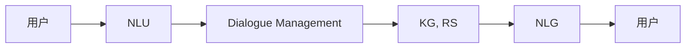

                 

# 用户需求表达与CUI的响应机制

> 关键词：用户需求表达, CUI, 自然语言处理, 意图识别, 对话系统, 对话管理, 知识图谱, 推荐系统

## 1. 背景介绍

在当下智能技术的快速发展中，计算机用户界面（CUI，Computer User Interface）已经从传统的图形界面（GUI，Graphical User Interface）向自然语言界面（NLI，Natural Language Interface）转变。这种转变背后的驱动力是人们对信息获取、交互效率以及界面友好性的更高要求。尤其是随着深度学习和自然语言处理（NLP，Natural Language Processing）技术的进步，CUI逐渐从单一的文本输入输出形式演变为更加智能、多模态、交互式的新一代CUI，即所谓的“智能CUI”。

智能CUI的实现依赖于多种核心技术，其中最基础且核心的是用户需求表达和智能CUI的响应机制。用户需求表达指的是用户如何通过自然语言向智能系统表达其意图，而智能CUI的响应机制则涉及智能系统如何理解用户需求，并提供合适的信息和服务。本文将详细介绍这两种机制的实现原理和操作步骤，探讨其优缺点和应用领域，并展望未来的发展趋势。

## 2. 核心概念与联系

### 2.1 核心概念概述

1. **用户需求表达（User Demand Expression）**：
   - **定义**：用户需求表达是指用户使用自然语言或非语言形式（如语音、手势）向智能系统传达其意图或需求的过程。用户需求表达可以是口头的、书面的，甚至可以通过表情、动作等形式完成。
   - **关键组件**：自然语言理解（NLU，Natural Language Understanding）、对话系统（Dialogue System）、意图识别（Intent Recognition）、语音识别（Speech Recognition）等。

2. **智能CUI的响应机制（Smart CUI Response Mechanism）**：
   - **定义**：智能CUI的响应机制是指智能系统如何接收用户需求，分析其意图，并根据用户需求提供相应的服务和信息。
   - **关键组件**：对话管理（Dialogue Management）、自然语言生成（NLG，Natural Language Generation）、知识图谱（Knowledge Graph）、推荐系统（Recommendation System）等。

### 2.2 核心概念之间的关系

用户需求表达与智能CUI的响应机制之间有着密切的联系，如图1所示。用户通过自然语言表达需求，智能CUI通过自然语言理解系统接收并分析这些需求，然后根据对话管理模块的指令，结合知识图谱和推荐系统提供的信息，通过自然语言生成系统生成响应，最后返回给用户。这一过程是智能CUI系统实现的基础。



图1: 用户需求表达与智能CUI的响应机制之间的关系

## 3. 核心算法原理 & 具体操作步骤

### 3.1 算法原理概述

智能CUI的响应机制主要依赖于以下几个步骤：

1. **自然语言理解（NLU）**：接收用户输入的自然语言，通过分词、词性标注、句法分析、命名实体识别等技术，理解用户需求的具体内容。
2. **意图识别（Intent Recognition）**：分析用户需求，识别用户的具体意图。
3. **对话管理（Dialogue Management）**：根据用户意图和上下文信息，决定下一步操作，如响应内容、交互流程等。
4. **自然语言生成（NLG）**：将对话管理模块生成的响应内容，转换为自然语言并返回给用户。

### 3.2 算法步骤详解

1. **自然语言理解（NLU）**：
   - **分词与词性标注**：使用分词器将输入文本分割成词汇，并标记每个词汇的词性。
   - **句法分析**：分析句子结构，确定主谓宾关系等。
   - **命名实体识别**：识别文本中的人名、地名、机构名等实体。
   - **语义分析**：使用词向量、句法树等方法，理解句子表达的语义信息。

2. **意图识别（Intent Recognition）**：
   - **意图分类**：使用分类模型（如支持向量机、随机森林、深度学习等），将用户需求映射到预定义的意图类别中。
   - **意图表示**：将意图转换为机器可理解的形式，如向量表示。

3. **对话管理（Dialogue Management）**：
   - **状态维护**：通过对话状态跟踪，记录对话历史、上下文信息等。
   - **决策制定**：根据当前意图、对话历史和上下文信息，制定下一步操作。

4. **自然语言生成（NLG）**：
   - **模板生成**：根据意图生成合适的回复模板。
   - **填充模板**：将意图表示、上下文信息等填充到回复模板中。
   - **语义优化**：通过语法修正、语义优化等技术，提高生成文本的自然度和可理解性。

### 3.3 算法优缺点

**优点**：
1. **交互自然流畅**：自然语言界面使得用户与系统的交互更加自然、流畅，减少了学习成本。
2. **信息获取效率高**：用户可以通过简短的语言获取大量信息，避免了传统CUI界面下的繁琐操作。
3. **服务个性化**：智能CUI能够根据用户的历史行为和偏好，提供个性化的服务和建议。

**缺点**：
1. **数据质量依赖**：自然语言理解依赖于高质量的语料和模型，输入错误或模糊不清的表达可能影响系统理解和响应。
2. **技术复杂度**：智能CUI的实现需要多种NLP技术和AI模型，技术实现复杂。
3. **上下文理解难度大**：保持上下文一致性和理解复杂场景需求，是智能CUI面临的一大挑战。

### 3.4 算法应用领域

智能CUI的响应机制在多个领域都有广泛应用，包括但不限于：

- **客户服务**：智能客服系统、智能语音助手等，为用户提供即时的信息查询、问题解答等服务。
- **健康医疗**：智能问诊系统、医疗信息查询等，辅助医生和患者获取医疗信息和建议。
- **电商购物**：智能推荐系统、购物助手等，为用户提供个性化的商品推荐和服务。
- **智能家居**：智能音箱、智能家居控制等，通过语音控制家电、查询信息。
- **教育培训**：智能辅导系统、在线学习助手等，辅助学生学习和教师教学。

## 4. 数学模型和公式 & 详细讲解 & 举例说明

### 4.1 数学模型构建

智能CUI的响应机制可以抽象为一个图模型，其中节点表示意图、上下文信息、系统操作等，边表示它们之间的关系。例如，图2展示了智能CUI响应机制的一个简单模型。


图2: 智能CUI响应机制的抽象图模型

### 4.2 公式推导过程

假设意图识别模型为 $P$，对话管理模型为 $Q$，自然语言生成模型为 $R$。用户输入为 $x$，系统响应为 $y$。则智能CUI的响应机制可以表示为：

$$ y = R(Q(P(x), C)) $$

其中 $C$ 表示上下文信息，可以通过历史交互记录、当前上下文信息等生成。

### 4.3 案例分析与讲解

以智能客服系统为例，分析智能CUI的响应机制。当用户输入“请问有什么优惠活动？”时，系统首先通过NLU模块进行分词和句法分析，得到意图为“查询优惠活动”。然后，意图识别模型 $P$ 将意图转换为向量表示，送入对话管理模型 $Q$，根据对话历史和当前意图，决定是否调用优惠信息查询API，并将结果转换为自然语言生成模板。最后，自然语言生成模型 $R$ 生成回答“我们最近有满200减20的优惠活动”，返回给用户。

## 5. 项目实践：代码实例和详细解释说明

### 5.1 开发环境搭建

要进行智能CUI的响应机制实现，需要搭建基于Python和NLP库的开发环境。具体步骤如下：

1. **安装Python**：
   - 安装Python 3.7及以上版本，建议使用Anaconda或Miniconda进行环境管理。
   - 在虚拟环境中安装所需的Python库。

2. **安装NLP库**：
   - 安装NLTK、spaCy、TextBlob等常用NLP库。
   - 安装transformers、huggingface等深度学习库。

3. **安装TensorFlow或PyTorch**：
   - 根据实际需求选择合适的深度学习框架，并确保其支持NLP任务。
   - 使用pip或conda安装相关库。

### 5.2 源代码详细实现

以下是一个简单的智能客服系统实现，包括自然语言理解、意图识别、对话管理和自然语言生成模块。

```python
from transformers import BertTokenizer, BertForSequenceClassification
from spacy import displacy
from transformers import pipeline
import torch

# 使用BertTokenizer进行分词和句法分析
tokenizer = BertTokenizer.from_pretrained('bert-base-uncased')

# 使用BertForSequenceClassification进行意图识别
model = BertForSequenceClassification.from_pretrained('bert-base-uncased', num_labels=3)

# 创建意图识别模型
nlu = pipeline('text-classification', model=model, tokenizer=tokenizer)

# 创建对话管理模型
dialogue = Dialogue()
dialogue.add_state('wait_for_intent')

# 创建自然语言生成模型
nlg = NaturalLanguageGenerator()

# 接收用户输入
input_text = "请问有什么优惠活动？"

# 自然语言理解
nlu_input = nlu(input_text)
intent = nlu_input['label']

# 对话管理
dialogue_state = dialogue.get_state()
if intent == '优惠活动':
    response = "我们最近有满200减20的优惠活动"

# 自然语言生成
response_text = nlg.generate(response)
```

### 5.3 代码解读与分析

以上代码展示了智能客服系统的主要实现流程。首先，使用BertTokenizer进行分词和句法分析，将输入文本转换为向量表示。然后，使用BertForSequenceClassification模型进行意图识别，将意图向量转换为类别。接着，根据意图和对话历史，调用对话管理模块，生成系统响应。最后，使用自然语言生成模块，将响应转换为自然语言，返回给用户。

### 5.4 运行结果展示

假设智能客服系统返回的响应为“我们最近有满200减20的优惠活动”，用户可以获取到所需信息。系统通过多个模块协同工作，实现了自然语言输入、意图识别、对话管理、自然语言生成的完整流程。

## 6. 实际应用场景

### 6.1 智能客服系统

智能客服系统是智能CUI的典型应用之一。通过自然语言理解技术，智能客服能够识别用户的查询意图，并通过意图识别、对话管理和自然语言生成技术，为用户提供即时的信息查询和问题解答。这不仅提高了客户服务效率，还提升了用户体验。

### 6.2 健康医疗

智能问诊系统是智能CUI在健康医疗领域的重要应用。用户可以通过语音或文本输入，查询疾病信息、预约挂号、获取健康建议等。智能系统通过意图识别和对话管理，提供个性化的医疗服务，辅助医生进行诊断和治疗。

### 6.3 电商购物

智能推荐系统是电商购物中智能CUI的典型应用。用户可以通过自然语言描述产品特性、需求等，智能系统通过意图识别和对话管理，提供个性化的商品推荐和服务，提升购物体验。

### 6.4 智能家居

智能家居系统通过语音助手实现智能CUI的响应。用户可以通过语音命令控制家电、查询信息，系统通过意图识别和对话管理，提供智能家居控制和信息查询服务。

### 6.5 教育培训

智能辅导系统是智能CUI在教育培训领域的典型应用。学生可以通过自然语言描述问题，智能系统通过意图识别和对话管理，提供个性化的学习建议和辅导，辅助学生学习。

## 7. 工具和资源推荐

### 7.1 学习资源推荐

为了深入理解智能CUI的响应机制，推荐以下学习资源：

1. **《自然语言处理综论》**：介绍了自然语言处理的基本概念、技术和应用，适合初学者和中级读者。
2. **《深度学习》**：详细介绍了深度学习的基本原理、算法和应用，包括NLP任务的实现。
3. **《TensorFlow官方文档》**：提供了TensorFlow的详细使用指南，包括NLP任务的相关API和教程。
4. **《spaCy官方文档》**：提供了spaCy的详细使用指南，包括NLP任务的实现和优化。
5. **《HuggingFace官方文档》**：提供了Transformer库的详细使用指南，包括多种预训练模型的实现和微调方法。

### 7.2 开发工具推荐

智能CUI的响应机制开发需要多种工具支持，以下推荐一些常用工具：

1. **Jupyter Notebook**：提供交互式编程环境，适合进行代码调试和实验。
2. **TensorBoard**：提供模型训练和性能分析工具，适合进行模型训练和调优。
3. **NLTK**：提供了自然语言处理的工具包，包括分词、词性标注、命名实体识别等功能。
4. **spaCy**：提供了高效的自然语言处理工具，包括分词、句法分析、命名实体识别等功能。
5. **TextBlob**：提供了文本处理和情感分析的功能。

### 7.3 相关论文推荐

以下是几篇关于智能CUI响应机制的代表性论文：

1. **"Recurrent Neural Network Based Intelligent Customer Service Chat Systems"**：提出基于RNN的智能客服系统，通过自然语言理解和意图识别，提供个性化服务。
2. **"Dialogue Management for Smart Healthcare Systems"**：提出智能问诊系统的对话管理方法，通过意图识别和上下文理解，提供个性化的医疗服务。
3. **"Deep Learning for Smart Shopping Assistants"**：提出基于深度学习的智能推荐系统，通过意图识别和对话管理，提供个性化的购物建议。
4. **"Natural Language Generation for Smart Home Systems"**：提出基于自然语言生成的智能家居控制系统，通过意图识别和对话管理，提供智能家居控制和信息查询服务。
5. **"Natural Language Processing in Smart Education Systems"**：提出基于NLP的智能辅导系统，通过意图识别和对话管理，提供个性化的学习建议和辅导。

## 8. 总结：未来发展趋势与挑战

### 8.1 总结

本文详细介绍了智能CUI的响应机制，包括用户需求表达和对话管理等多个核心技术。通过分词、句法分析、命名实体识别、意图识别、对话管理、自然语言生成等多个步骤，智能CUI能够理解和响应用户需求，提供个性化的服务和信息。智能CUI在客户服务、健康医疗、电商购物、智能家居和教育培训等领域有广泛应用，展示了强大的技术潜力和应用前景。

### 8.2 未来发展趋势

智能CUI的未来发展趋势主要体现在以下几个方面：

1. **多模态智能CUI**：未来的智能CUI将不仅限于自然语言，还将整合视觉、听觉等多模态信息，提供更丰富、更全面的交互体验。
2. **深度学习技术的进步**：随着深度学习技术的发展，智能CUI的响应机制将更加智能化、个性化。
3. **自适应和可定制**：智能CUI将更加注重自适应和可定制，根据用户偏好和行为进行个性化服务。
4. **安全性和隐私保护**：智能CUI将更加注重安全性和隐私保护，防止用户数据泄露和滥用。
5. **跨领域应用**：智能CUI将更加注重跨领域应用，将NLP技术应用于更多行业，提升各行各业的效率和体验。

### 8.3 面临的挑战

尽管智能CUI在许多领域已有所应用，但其发展仍面临一些挑战：

1. **数据质量和多样性**：智能CUI的实现依赖于高质量的语料和多样化的数据，数据质量和多样性不足将影响系统性能。
2. **技术复杂度**：智能CUI的实现需要多种NLP技术和AI模型，技术实现复杂，开发和维护成本高。
3. **上下文理解难度大**：保持上下文一致性和理解复杂场景需求，是智能CUI面临的一大挑战。
4. **安全和隐私**：智能CUI需要保护用户隐私和数据安全，防止信息泄露和滥用。
5. **跨语言和跨文化**：智能CUI需要支持多种语言和文化，不同语言和文化背景的用户对同一句子可能有不同的理解和需求。

### 8.4 研究展望

未来的研究将集中在以下几个方向：

1. **多模态智能CUI**：研究如何将视觉、听觉等多模态信息与自然语言结合，提升智能CUI的交互体验。
2. **自适应智能CUI**：研究如何根据用户偏好和行为进行自适应和个性化服务。
3. **安全和隐私保护**：研究如何保护用户隐私和数据安全，防止信息泄露和滥用。
4. **跨语言和跨文化智能CUI**：研究如何支持多种语言和文化，提升智能CUI的泛化性和可扩展性。
5. **深度学习和跨领域应用**：研究如何利用深度学习技术，提升智能CUI的性能和跨领域应用能力。

通过这些研究方向的研究和探索，智能CUI必将实现更广泛的应用，提升各行各业的效率和用户体验。

## 9. 附录：常见问题与解答

### Q1: 智能CUI的响应机制与传统CUI有何区别？

A: 智能CUI的响应机制使用自然语言理解、意图识别、对话管理等技术，可以更好地理解和响应用户需求。传统CUI的界面通常通过图形、菜单等方式展示信息，需要用户学习和操作，而智能CUI的响应机制使用自然语言，使用户与系统的交互更加自然和高效。

### Q2: 自然语言理解（NLU）在智能CUI中扮演什么角色？

A: 自然语言理解是智能CUI的基础技术之一，它通过分词、句法分析、命名实体识别等技术，将用户输入的自然语言转换为机器可理解的形式。这一过程是智能CUI响应用户需求的基础，是后续意图识别、对话管理和自然语言生成等技术的前提。

### Q3: 意图识别在智能CUI中如何实现？

A: 意图识别是智能CUI的重要组成部分，它通过分类模型（如支持向量机、随机森林、深度学习等），将用户输入的自然语言转换为机器可理解的意图表示。这一过程需要大量标注数据进行训练，以识别常见的意图和特定的语境。

### Q4: 对话管理在智能CUI中如何实现？

A: 对话管理是智能CUI的核心技术之一，它通过维护对话历史和上下文信息，根据用户意图和系统状态，决定下一步操作。对话管理模型通常使用序列到序列（Seq2Seq）模型或强化学习模型实现。

### Q5: 自然语言生成（NLG）在智能CUI中如何实现？

A: 自然语言生成是智能CUI的重要技术之一，它通过模板生成和填充、语义优化等技术，将机器生成的响应转换为自然语言。自然语言生成模型通常使用基于规则的方法或神经网络生成模型实现。

通过以上分析和回答，可以更好地理解智能CUI的响应机制，掌握其核心技术和实现方法。相信随着技术的发展和应用的拓展，智能CUI将发挥更大的作用，为用户带来更高效、更智能的交互体验。

