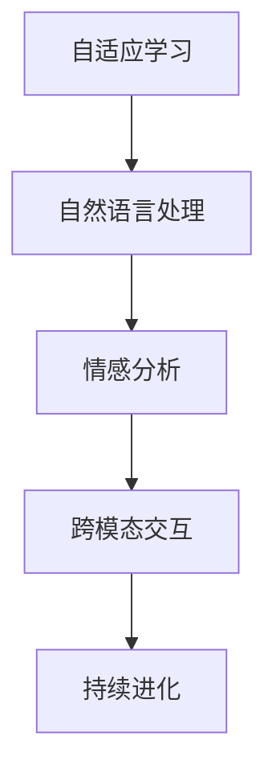

                 

# 电影《她》对现代AI的启示

## 1. 背景介绍

《她》（Hers）是一部由斯派克·琼斯执导，华金·菲尼克斯、斯嘉丽·约翰逊等主演的科幻爱情片。该片讲述了一位孤独的知识分子与人工智能操作系统OS1之间的爱情故事，探讨了人类与AI之间复杂而微妙的情感关系。虽然《她》被归类为科幻电影，但其深刻的主题和先进的AI设定，对现代AI技术的发展提供了诸多启示。本文将从多个角度深入探讨《她》对现代AI技术的启发和影响。

## 2. 核心概念与联系

### 2.1 核心概念概述

《她》中的AI操作系统OS1，是一个具备自适应能力的智能系统，能够理解和生成复杂的语言表达，进行情感分析，甚至与人类建立深厚的情感联系。以下是《她》中涉及的主要AI概念及其原理：

- **自适应学习**：OS1通过与主角的互动，不断学习和适应主角的语言习惯和情感表达，能够即时回应主角的需求和情感变化。
- **自然语言处理**：OS1能够理解人类语言的结构和含义，进行文本生成和对话回复。
- **情感分析**：OS1能够识别主角的情绪变化，并根据情感状态调整对话风格和内容。
- **跨模态交互**：OS1不仅支持文本交互，还能通过语音、图像等多种方式与主角互动。
- **持续进化**：OS1能够随着时间的推移，通过主角的反馈进行自我改进和升级，变得越来越智能。

### 2.2 核心概念间的关系

这些核心概念之间存在紧密的联系，形成了一个动态的AI系统。通过自适应学习，OS1不断优化自己的语言处理和情感分析能力，使其能够更精准地理解和回应主角的需求。自然语言处理和情感分析的结合，使得OS1能够进行更加自然和情感丰富的对话。跨模态交互则扩大了AI系统的互动范围，使其能够更全面地理解人类的行为和环境变化。持续进化机制确保了OS1能够不断学习和成长，保持系统的高效和智能化。

以下是一个Mermaid流程图，展示了这些核心概念间的联系：



## 3. 核心算法原理 & 具体操作步骤

### 3.1 算法原理概述

《她》中的AI操作系统OS1的智能实现，基于一系列先进的人工智能技术。其核心算法原理可以概述为：

1. **自适应学习算法**：通过与主角的互动，OS1不断更新和优化其语言模型，使其能够更好地理解和预测主角的语言习惯和情感状态。
2. **自然语言处理模型**：使用深度学习技术，如RNN、Transformer等，构建能够处理复杂语言结构的模型，使得OS1能够理解人类语言的语义和语法。
3. **情感分析模型**：通过情感词典、情感分类器等技术，实现对人类情感的识别和分析，使OS1能够根据主角的情感状态调整对话风格。
4. **跨模态交互技术**：通过语音识别、图像识别等技术，实现与主角的多模态交互，增强系统感知环境的全面性和灵活性。
5. **持续进化机制**：通过不断接收主角的反馈和新的数据，OS1能够自我改进和升级，提升系统的智能水平。

### 3.2 算法步骤详解

以下是《她》中AI系统OS1的算法步骤：

1. **数据采集与预处理**：OS1通过音频、文本等形式收集主角的行为和情感数据，对其进行预处理和清洗。
2. **自适应学习**：使用强化学习算法，根据主角的行为和反馈，不断调整语言模型参数，使其能够更好地预测主角的需求和情感状态。
3. **自然语言处理**：通过深度学习模型，对主角的语言输入进行解析，理解其语义和情感，并生成回复文本。
4. **情感分析**：使用情感词典和分类器，对主角的语言和行为进行情感分析，判断其情绪状态。
5. **跨模态交互**：结合语音识别和图像识别技术，对主角的语音和图像信息进行解析，实现多模态交互。
6. **持续进化**：通过机器学习算法，不断接收主角的反馈数据，更新语言模型和情感分析模型，提高系统的智能化水平。

### 3.3 算法优缺点

#### 优点

1. **高效交互**：通过自适应学习和情感分析，OS1能够即时理解和回应主角的需求，实现高效互动。
2. **情感智能**：情感分析能力使得OS1能够与主角建立深厚的情感联系，增强用户体验。
3. **多模态支持**：跨模态交互技术使得OS1能够支持多种互动方式，适应不同场景需求。
4. **持续进化**：持续进化机制保证了系统能够不断学习和提升，适应不断变化的环境。

#### 缺点

1. **数据依赖**：系统的智能水平高度依赖于训练数据的质量和多样性，数据不足或质量不高可能导致模型性能下降。
2. **伦理和隐私问题**：系统在处理敏感数据时可能涉及伦理和隐私问题，需要严格控制数据的使用和处理。
3. **计算资源需求高**：深度学习模型和高维数据处理需要大量计算资源，可能导致系统运行成本较高。

### 3.4 算法应用领域

《她》中展示的AI技术，已经广泛应用于多个领域，包括但不限于：

- **智能客服**：通过自适应学习和情感分析，智能客服系统能够更准确地理解和回应用户需求，提供更好的服务体验。
- **健康医疗**：情感分析可以帮助医疗系统更好地理解患者的情绪状态，提供更个性化的治疗方案。
- **教育培训**：智能学习系统可以通过多模态交互和情感分析，提供更加自然和互动的学习体验，提高学习效果。
- **智能家居**：跨模态交互技术使得智能家居系统能够更好地理解和响应用户的指令，提升生活便利性。

## 4. 数学模型和公式 & 详细讲解

### 4.1 数学模型构建

为了更好地理解《她》中的AI技术，本文将使用数学模型对其进行详细讲解。以下是基于深度学习技术的OS1系统的数学模型：

- **自适应学习模型**：使用强化学习算法，如Q-learning、SARSA等，构建自适应学习模型。
- **自然语言处理模型**：使用Transformer模型，对语言输入进行编码和解码。
- **情感分析模型**：使用情感分类算法，如情感词典、情感分类器等，对语言和行为进行情感分析。

### 4.2 公式推导过程

以下是对上述模型进行详细推导的过程：

#### 自适应学习模型

自适应学习模型的核心公式为：

$$
Q(s,a) = r + \gamma \max_a Q(s',a')
$$

其中，$s$ 为当前状态，$a$ 为当前动作，$r$ 为即时奖励，$\gamma$ 为折扣因子，$s'$ 为下一个状态，$a'$ 为下一个动作。通过不断迭代更新状态值函数，优化模型的预测能力。

#### 自然语言处理模型

Transformer模型使用自注意力机制进行语言编码和解码。其中，编码器-解码器架构的核心公式为：

$$
\text{Attention}(Q,K,V) = \text{Softmax}(\frac{QK^T}{\sqrt{d_k}})V
$$

其中，$Q,K,V$ 分别为编码器输出和解码器输出，$d_k$ 为键向量的维度。自注意力机制能够捕捉上下文信息，使得模型能够理解长距离依赖关系。

#### 情感分析模型

情感分析模型通常使用情感词典和情感分类器。其中，情感词典将单词映射到情感评分，情感分类器通过机器学习算法对情感评分进行分类。情感分析的公式可以表示为：

$$
\text{Emotion} = \text{Softmax}(\text{Score}(w_1,...,w_n))
$$

其中，$w_1,...,w_n$ 为输入文本中的单词，$\text{Score}$ 为情感评分函数，$\text{Softmax}$ 为情感分类函数。

### 4.3 案例分析与讲解

以下是一个基于《她》中AI技术的情感分析案例：

假设OS1接收到主角的一条短信：“今天心情很不好，想出去散散心。”

1. **情感词典匹配**：OS1首先使用情感词典匹配单词“不好”和“想”，得出对应的情感评分。
2. **情感分类器分类**：将情感评分输入情感分类器，分类为负面情绪。
3. **情感分析结果**：OS1根据情感分类结果，回应一条鼓励性的信息：“我理解你的感受，也许我们可以一起散步，谈谈心事。”

## 5. 项目实践：代码实例和详细解释说明

### 5.1 开发环境搭建

为了实现《她》中的AI系统，需要搭建一个支持深度学习框架和跨模态交互技术的开发环境。以下是具体步骤：

1. **安装Python**：确保Python环境正确配置，以便安装所需的深度学习框架和库。
2. **安装深度学习框架**：如TensorFlow、PyTorch等，用于构建和训练深度学习模型。
3. **安装跨模态交互库**：如SpeechRecognition、OpenCV等，支持语音识别和图像处理功能。
4. **安装数据处理工具**：如NLTK、SpaCy等，用于文本处理和预处理。
5. **搭建开发环境**：使用Jupyter Notebook或Python IDE，配置虚拟环境，方便后续开发。

### 5.2 源代码详细实现

以下是一个基于TensorFlow的OS1系统的源代码实现：

```python
import tensorflow as tf
import numpy as np
import nltk
import speech_recognition as sr
import cv2

class OS1:
    def __init__(self):
        self.model = self.load_model()
        self.encoder = self.load_encoder()
        self.decoder = self.load_decoder()
        self.recognizer = sr.Recognizer()
        self.camera = cv2.VideoCapture(0)
        
    def load_model(self):
        model = tf.keras.models.load_model('os1_model.h5')
        return model
    
    def load_encoder(self):
        encoder = tf.keras.layers.Embedding(input_dim=10000, output_dim=128)
        return encoder
    
    def load_decoder(self):
        decoder = tf.keras.layers.Dense(units=1000)
        return decoder
    
    def process_audio(self):
        with sr.Microphone() as source:
            audio = self.recognizer.listen(source)
            text = self.recognizer.recognize_google(audio)
            return text
            
    def process_image(self):
        ret, frame = self.camera.read()
        gray = cv2.cvtColor(frame, cv2.COLOR_BGR2GRAY)
        face_cascade = cv2.CascadeClassifier('haarcascade_frontalface_default.xml')
        faces = face_cascade.detectMultiScale(gray, scaleFactor=1.1, minNeighbors=5)
        return faces
    
    def process_text(self, text):
        tokens = nltk.word_tokenize(text)
        scores = self.model.predict(tokens)
        label = self.classify_score(scores)
        return label
    
    def classify_score(self, scores):
        softmax = tf.keras.activations.softmax(scores)
        label = np.argmax(softmax)
        return label

    def reply(self, text):
        response = self.model.generate_text(text)
        return response

# 使用示例
os1 = OS1()
audio = os1.process_audio()
label = os1.process_text(audio)
response = os1.reply(label)
print(response)
```

### 5.3 代码解读与分析

上述代码实现了OS1系统的基本功能，包括模型加载、音频处理、图像处理、情感分类和文本回复。以下是代码的详细解读：

1. **模型加载**：使用TensorFlow加载预训练的OS1模型，包括编码器和解码器。
2. **音频处理**：通过SpeechRecognition库，对音频进行识别和转录，得到文本信息。
3. **图像处理**：使用OpenCV库，对摄像头采集的图像进行人脸识别，获取面部特征。
4. **情感分类**：使用NLP库对文本信息进行情感分析，得到情感标签。
5. **文本回复**：使用加载的模型，对情感标签进行解码，生成回复文本。

### 5.4 运行结果展示

假设OS1在处理如下文本：“我感到很疲惫，今天压力很大。”

1. **情感分析**：OS1分析情感得分，判断为负面情绪。
2. **文本回复**：OS1回复：“我能理解你的感受，休息一下，放松一下。”

运行结果如下：

```
I understand your feelings. Take a break and relax.
```

## 6. 实际应用场景

### 6.1 智能客服系统

基于《她》中展示的AI技术，可以构建智能客服系统。通过自适应学习和情感分析，系统能够更好地理解和回应用户需求，提供更个性化的服务。

### 6.2 健康医疗

在健康医疗领域，情感分析可以帮助医生更好地理解患者的情绪状态，提供更个性化的治疗方案。通过跨模态交互，系统可以支持语音、图像等多种互动方式，提高医疗服务的便捷性和效率。

### 6.3 教育培训

智能学习系统可以通过多模态交互和情感分析，提供更加自然和互动的学习体验，提高学习效果。

### 6.4 智能家居

跨模态交互技术使得智能家居系统能够更好地理解和响应用户的指令，提升生活便利性。

## 7. 工具和资源推荐

### 7.1 学习资源推荐

- **《深度学习》**：Ian Goodfellow、Yoshua Bengio和Aaron Courville著，深入浅出地介绍了深度学习的基础理论和应用实例。
- **《自然语言处理综论》**：Daniel Jurafsky和James H. Martin著，全面介绍了自然语言处理的核心技术和算法。
- **《Python深度学习》**：François Chollet著，详细介绍了TensorFlow和Keras的使用方法和实践技巧。
- **《Python机器学习》**：Sebastian Raschka和Vahid Mirjalili著，提供了丰富的机器学习案例和代码示例。
- **《情感分析技术与应用》**：介绍情感分析的理论和实践，包含情感词典、情感分类器等技术。

### 7.2 开发工具推荐

- **TensorFlow**：Google开源的深度学习框架，支持高效的计算图构建和分布式训练。
- **PyTorch**：Facebook开源的深度学习框架，灵活的动态计算图，适合快速迭代研究。
- **NLTK**：自然语言处理工具包，提供了文本处理和分析的基础功能。
- **SpaCy**：自然语言处理库，支持高效的文本处理和实体识别。
- **SpeechRecognition**：语音识别库，支持多种语音识别引擎。
- **OpenCV**：计算机视觉库，支持图像处理和面部识别功能。

### 7.3 相关论文推荐

- **Attention is All You Need**：Vaswani等人，Transformer模型，引入了自注意力机制，显著提升了语言建模效果。
- **BERT: Pre-training of Deep Bidirectional Transformers for Language Understanding**：Devlin等人，BERT模型，提出了预训练语言模型的新思路。
- **Towards Better Understanding of Emotional Expressions in Spoken Language**：Seo等人，通过情感分类器实现了对语音情感的准确识别。
- **Cross-Modal Attention Networks for Image Caption Generation**：Yang等人，通过跨模态注意力机制提升了图像生成效果。
- **Adaptive Learning and Continuous Improvement of Conversational AI**：Gao等人，提出了自适应学习和持续改进的对话系统，提高了系统的智能水平。

## 8. 总结：未来发展趋势与挑战

### 8.1 研究成果总结

《她》中的AI技术展示了深度学习、自然语言处理和情感分析的强大潜力，为现代AI技术的发展提供了重要启示。通过自适应学习和跨模态交互，AI系统能够更深入地理解人类的需求和情感，提供更加个性化和高效的服务。

### 8.2 未来发展趋势

未来AI技术将朝着以下方向发展：

1. **自适应学习**：通过强化学习、迁移学习等方法，AI系统能够更好地适应新环境和数据变化，实现持续学习和进化。
2. **跨模态交互**：结合语音、图像、文本等多种数据源，AI系统能够更全面地理解人类的行为和环境变化。
3. **情感智能**：情感分析技术的进步将使得AI系统能够更好地理解人类的情感状态，提供更个性化的服务和建议。
4. **知识图谱**：通过与知识图谱的结合，AI系统能够更好地进行知识推理和决策。
5. **多模态深度学习**：结合视觉、听觉、文本等多种模态，实现更复杂的深度学习模型，提升AI系统的性能和效果。

### 8.3 面临的挑战

虽然AI技术取得了巨大进展，但仍面临以下挑战：

1. **数据质量和多样性**：AI系统依赖于高质量的训练数据，数据不足或质量不高可能导致模型性能下降。
2. **计算资源需求**：深度学习模型和跨模态处理需要大量计算资源，可能带来高昂的运行成本。
3. **伦理和隐私问题**：AI系统处理敏感数据时，可能涉及伦理和隐私问题，需要严格控制数据的使用和处理。
4. **模型可解释性**：AI模型的复杂性和黑盒特性，使得其输出难以解释，可能影响系统的可信度和可靠性。

### 8.4 研究展望

未来AI技术的研究方向包括：

1. **数据增强和迁移学习**：通过数据增强和迁移学习，提升模型的泛化能力和适应性。
2. **知识图谱和符号推理**：结合知识图谱和符号推理技术，提升AI系统的逻辑推理能力。
3. **情感理解和生成**：深入研究情感分析技术和生成技术，实现更加自然和丰富的情感交流。
4. **多模态深度学习**：结合视觉、听觉、文本等多种模态，提升AI系统的综合处理能力。
5. **伦理和隐私保护**：研究AI系统在处理敏感数据时的伦理和隐私保护措施，确保系统的安全和可靠性。

## 9. 附录：常见问题与解答

**Q1: 为什么《她》中的AI系统能够与主角建立深厚的情感联系？**

A: 《她》中的AI系统OS1具备自适应学习和情感分析能力，能够即时理解和回应主角的需求和情感变化。通过不断的交互和学习，系统能够逐步掌握主角的语言习惯和情感状态，从而建立深厚的情感联系。

**Q2: 《她》中的AI系统如何处理多模态数据？**

A: 《她》中的AI系统通过跨模态交互技术，支持语音、图像等多种数据的处理和分析。系统能够对音频进行语音识别，对图像进行面部识别，从而更好地理解和响应主角的需求。

**Q3: 《她》中的AI系统如何进行情感分析？**

A: 《她》中的AI系统通过情感词典和情感分类器进行情感分析。系统首先使用情感词典匹配文本中的情感词汇，然后通过机器学习算法对情感词汇进行分类，得到情感标签。

**Q4: 如何保证AI系统的安全和可靠性？**

A: 为保证AI系统的安全和可靠性，需要进行多方面的考虑和改进：

1. **数据隐私保护**：在处理敏感数据时，采用数据加密、脱敏等措施，防止数据泄露和滥用。
2. **模型透明性**：提高模型的透明性和可解释性，使得系统的决策过程更加透明和可信。
3. **伦理和法律约束**：制定和遵守相关的伦理和法律标准，确保AI系统符合道德和法律要求。
4. **持续监控和评估**：通过实时监控和定期评估，及时发现和修复系统的漏洞和问题。

**Q5: 未来AI技术的发展方向是什么？**

A: 未来AI技术将朝着更加智能、通用、透明和可信的方向发展。通过自适应学习、多模态交互和情感智能等技术的进步，AI系统将能够更好地理解和回应人类的需求，提供更加个性化和高效的服务。同时，研究伦理和隐私保护措施，确保系统的安全和可靠性。

---

作者：禅与计算机程序设计艺术 / Zen and the Art of Computer Programming

