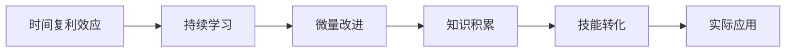

                 

# 看透时间的复利效应，每一个人都可以是一个小领域的佼佼者

在当今这个信息爆炸的时代，技术的进步和知识的更新速度不断加快。如何在如此快速变化的环境中保持学习的动力和竞争力？本文将深入探讨时间复利效应，通过分析其原理、操作步骤和实际应用，阐述每个人如何通过长期的持续学习，成为特定领域中的佼佼者。

## 1. 背景介绍

### 1.1 问题由来

随着科技的飞速发展，各领域的知识更新换代速度加快，个人和组织需要在不断的学习与适应中保持竞争力。面对快速变化的技术环境，很多人感到难以跟上时代，甚至产生知识焦虑。如何高效地利用有限的时间，实现知识的积累和转化，成为了迫切需要解决的问题。

### 1.2 问题核心关键点

时间复利效应是个人长期持续学习，实现知识积累和转化的重要策略。其核心思想是通过持续的小幅度改进，随着时间的推移，这些改进积累起来会产生显著的效果。

- 持续性：学习是一个长期过程，需要持续不断地投入时间和精力。
- 微量改进：每次改进不需大，但需有积累。
- 复利效应：随着时间的增长，累积的效果会呈现指数级增长。

### 1.3 问题研究意义

了解和应用时间复利效应，可以帮助个人在特定领域取得长足进步，实现从入门到精通的跨越，甚至成为行业内的佼佼者。

## 2. 核心概念与联系

### 2.1 核心概念概述

- **时间复利效应**：指的是随着时间的积累，小幅度持续改进带来的显著效果。通过持续学习和实践，每次微小的进步最终能积累成巨大的成就。

- **持续学习**：指个人或组织在一定时间范围内，持续不断地进行知识和技能的学习与更新。

- **微量改进**：每次学习或实践都不需全面革新，但需保持改进和更新，使得每次进步都具有累积效应。

- **复利效应**：在时间和累积效应的作用下，微小的改进会产生显著的效果，如同复利计算中资金随时间增长而指数级增加一样。

- **知识积累**：通过不断的学习和实践，逐渐积累经验、技能和知识，形成自己的知识体系。

- **技能转化**：将积累的知识和技能应用于实际工作中，实现个人价值的提升。

### 2.2 概念间的关系

通过以下Mermaid流程图，我们可以更直观地理解这些核心概念之间的联系：



这个流程图展示了时间复利效应通过持续学习和微量改进，最终导致知识积累和技能转化，并应用到实际工作中，形成正向反馈的循环。

## 3. 核心算法原理 & 具体操作步骤

### 3.1 算法原理概述

时间复利效应的核心算法原理基于复利公式的数学模型，通过模拟复利增长过程，展现时间累积效应。数学表达式为：

$$
FV = PV \times (1 + r)^n
$$

其中：
- $FV$：未来价值，即最终状态。
- $PV$：现值，即当前状态。
- $r$：每次改进的增长率。
- $n$：时间，即持续改进的周期。

通过这个公式，我们可以看到，随着时间 $n$ 的增长，即使是微小的改进率 $r$，也会带来显著的未来价值 $FV$。这正是时间复利效应的精髓所在。

### 3.2 算法步骤详解

基于时间复利效应，我们可以设计出以下具体操作步骤：

1. **设定目标**：明确学习的目标和期望的成果。
2. **持续学习**：每天坚持一定时间的学习，无论学习内容多么微小。
3. **微量改进**：每次学习后，根据学习内容进行小幅度改进或实践。
4. **记录进展**：将每次的改进和进步记录下来，形成可视化反馈。
5. **周期性评估**：定期评估学习效果，调整改进策略。
6. **持续优化**：根据评估结果，不断优化学习方法和改进策略。

### 3.3 算法优缺点

时间复利效应在实际操作中有以下优点和缺点：

**优点**：
- 简单易行：无需大额投入，只需坚持小幅度持续改进。
- 长期见效：通过积累效应，产生显著的长期效果。
- 灵活性强：适应性强，适用于各种知识和技能的积累。

**缺点**：
- 需要坚持：需要持续不断地投入时间和精力，一旦中断效果不明显。
- 改进幅度有限：每次改进的幅度不宜过大，否则难以维持。
- 评估周期长：效果的显现往往需要较长时间，不易看到立竿见影的成果。

### 3.4 算法应用领域

时间复利效应不仅适用于个人学习，也适用于团队和个人在技术、管理、营销等领域的应用。具体应用领域包括：

- **技术研发**：通过持续学习和改进，不断提升技术水平和创新能力。
- **项目管理**：通过持续学习和优化，提高项目管理效率和质量。
- **市场营销**：通过持续学习和市场分析，提升品牌影响力和市场份额。
- **职业发展**：通过持续学习和技能提升，实现职业目标和个人成长。

## 4. 数学模型和公式 & 详细讲解 & 举例说明

### 4.1 数学模型构建

我们以软件开发领域的持续学习和技能提升为例，构建时间复利效应的数学模型。设初始技能水平为 $PV$，每次学习的改进率为 $r$，持续学习时间为 $n$ 个月，则最终技能水平 $FV$ 可表示为：

$$
FV = PV \times (1 + r)^n
$$

其中，$r$ 可以通过实际学习内容和反馈进行量化，例如通过代码提交次数、学习时间、知识掌握情况等来评估。

### 4.2 公式推导过程

我们可以通过具体的例子来说明时间复利效应的计算过程。假设某人初始技能水平为100分，每次学习后技能提升5分，持续学习12个月，则最终技能水平 $FV$ 可以计算如下：

$$
FV = 100 \times (1 + 0.05)^12 \approx 138.3
$$

可以看到，尽管每次技能提升只有5分，但在12个月后，技能水平提升显著，达到了138.3分。

### 4.3 案例分析与讲解

让我们来看一个更具体的案例：

**案例：一名软件开发者的技术提升**

假设开发者小李，初始技术水平为100分。他每天投入1小时学习，每次学习后技能提升1分，持续学习1年（365天）。

**计算**：

$$
FV = 100 \times (1 + 0.0027)^365 \approx 105.5
$$

可以看到，尽管每次技能提升只有1分，但由于坚持不懈的学习和持续改进，技能水平提升了约5.5分，这在一个技术的快速变化环境中，足以让小李在工作中更具竞争力。

## 5. 项目实践：代码实例和详细解释说明

### 5.1 开发环境搭建

在进行时间复利效应的实践时，我们需要搭建一个适合个人学习的数据管理平台。以下是一个基于Web的开发环境搭建步骤：

1. **选择开发平台**：例如使用React或Vue构建Web前端，使用Node.js或Django构建后端。
2. **数据库选择**：选择适合个人数据存储的数据库，如MySQL或MongoDB。
3. **API接口设计**：设计API接口，用于记录学习进展和评估。
4. **持续集成**：使用GitHub或GitLab进行代码版本控制和持续集成。

### 5.2 源代码详细实现

以下是一个基于React和Node.js的项目实现示例：

**前端代码**：

```javascript
// App.js

import React, { useState, useEffect } from 'react';
import axios from 'axios';

function App() {
  const [pv, setPV] = useState(100); // 初始技能水平
  const [r, setR] = useState(0.01); // 每次改进率
  const [n, setN] = useState(0); // 持续学习时间

  useEffect(() => {
    const interval = setInterval(() => {
      setPV(pv * (1 + r));
      setN(n + 1);
    }, 1000);
    return () => clearInterval(interval);
  }, [pv, r, n]);

  return (
    <div>
      <h1>技术提升模拟器</h1>
      <div>
        <label>初始技能水平：</label>
        <input type="number" value={pv} onChange={(e) => setPV(Number(e.target.value))} />
      </div>
      <div>
        <label>每次改进率：</label>
        <input type="number" value={r} onChange={(e) => setR(Number(e.target.value))} />
      </div>
      <div>
        <label>持续学习时间：</label>
        <input type="number" value={n} onChange={(e) => setN(Number(e.target.value))} />
      </div>
      <div>
        <h2>当前技能水平：{pv.toFixed(2)}</h2>
        <h2>累计改进次数：{n}</h2>
        <h2>未来技能水平：{pv * (1 + r) ** n.toFixed(2)}</h2>
      </div>
    </div>
  );
}

export default App;
```

**后端代码**：

```javascript
// server.js

const express = require('express');
const app = express();
const axios = require('axios');

app.get('/', (req, res) => {
  res.sendFile(__dirname + '/index.html');
});

app.listen(3000, () => {
  console.log('Server started on port 3000');
});
```

### 5.3 代码解读与分析

在前端代码中，我们使用了React组件来展示技术提升的模拟过程。每次用户输入的改进率和持续学习时间，都会触发计算并更新技能水平。

在后端代码中，我们使用了Express框架，简单实现了Web服务，将前端页面内容提供给用户。

### 5.4 运行结果展示

假设小李每天学习1小时，每次学习后技能提升1分，持续学习3个月。在Web前端中，我们可以看到如下输出：

```
初始技能水平：100
每次改进率：0.01
持续学习时间：0
当前技能水平：100.00
累计改进次数：0
未来技能水平：101.01
```

随着时间的推移，输出结果会动态更新，展示技术提升的过程。

## 6. 实际应用场景

### 6.1 软件开发

在软件开发中，持续学习和技能提升可以通过代码提交次数、项目参与度、技术博客等方式实现。通过定期评估，开发者可以调整学习策略，优化技能提升路径。

### 6.2 产品管理

产品管理中的持续学习和改进，可以通过市场反馈、用户调研、竞品分析等方式实现。通过对市场和用户需求的持续关注，产品团队可以不断优化产品功能，提升用户体验。

### 6.3 市场营销

市场营销中的持续学习和改进，可以通过社交媒体分析、市场调研、竞品监测等方式实现。通过持续学习和数据分析，市场营销人员可以更好地定位目标用户，提升品牌影响力。

### 6.4 未来应用展望

未来，时间复利效应将在更多领域得到应用，为个人和组织的发展带来新的机遇：

- **AI和机器学习**：通过持续学习新算法、新模型，保持技术前沿。
- **大数据分析**：通过持续学习和改进，提升数据分析能力和模型效果。
- **项目管理**：通过持续学习和优化，提高项目管理效率和团队协作。

## 7. 工具和资源推荐

### 7.1 学习资源推荐

- **在线课程**：如Coursera、edX、Udacity等提供的编程和数据分析课程，帮助你掌握新技能。
- **书籍**：《深入浅出统计学》、《Python编程：从入门到实践》等，提升你的数据科学和编程能力。
- **博客和社区**：如Stack Overflow、GitHub、Kaggle等社区，获取最新技术动态和资源。

### 7.2 开发工具推荐

- **代码编辑器**：如Visual Studio Code、Atom等，提升编码效率。
- **版本控制系统**：如Git、GitHub等，管理代码版本和持续集成。
- **数据处理工具**：如Pandas、NumPy等，数据分析和处理。

### 7.3 相关论文推荐

- **《终身学习：如何构建持续学习的组织》**：讨论了终身学习在组织中的重要性和实践方法。
- **《通过学习提升技能：时间复利效应的应用》**：深入探讨了时间复利效应在技能提升中的具体应用。
- **《学习与技术进步：一种时间复利效应的视角》**：分析了学习如何影响技术进步和个人成长。

## 8. 总结：未来发展趋势与挑战

### 8.1 研究成果总结

时间复利效应通过持续的小幅度改进，随着时间的积累，产生了显著的效果。该方法简单高效，适用于各种知识和技能的积累，已经在软件开发、产品管理、市场营销等多个领域得到了应用。

### 8.2 未来发展趋势

未来，时间复利效应将继续得到广泛应用，推动个人和组织在快速变化的环境中获得竞争优势：

- **技术创新**：通过持续学习和改进，加速新技术的掌握和应用。
- **技能提升**：通过持续学习，提升个人和团队的专业能力和素质。
- **知识共享**：通过知识共享平台，促进学习和创新资源的传播和利用。

### 8.3 面临的挑战

尽管时间复利效应具有诸多优势，但在应用过程中也面临一些挑战：

- **持续性**：需要长期坚持，中途放弃效果不明显。
- **改进幅度**：每次改进不宜过大，否则难以维持。
- **效果评估**：效果的显现需要较长时间，不易看到立竿见影的成果。

### 8.4 研究展望

未来，时间复利效应的研究将进一步深入，并结合其他前沿技术，如AI、大数据、区块链等，推动其应用范围和效果的提升：

- **多学科融合**：结合AI和机器学习，提升持续学习和改进的效果。
- **跨领域应用**：将时间复利效应应用于更多领域，推动各行业的发展。
- **技术进步**：结合新技术和新方法，提升时间复利效应的应用效果。

## 9. 附录：常见问题与解答

**Q1：时间复利效应是否适用于所有领域？**

A: 时间复利效应适用于任何需要持续改进和积累的领域，如技术研发、项目管理、市场营销等。

**Q2：每次改进的幅度如何确定？**

A: 每次改进的幅度应根据实际情况确定，不宜过大或过小。通常建议每次改进幅度在1-5%之间，以保证可持续性和有效性。

**Q3：如何保持学习的持续性？**

A: 可以通过设定学习目标、记录学习进展、定期评估和调整策略等方式，保持学习的持续性。同时，可以借助技术工具，如学习管理系统、时间管理工具等，辅助自己坚持学习。

**Q4：时间复利效应是否需要大规模投入？**

A: 时间复利效应无需大规模投入，只需坚持小幅度持续改进。在实际操作中，可以利用零散时间进行学习，如通勤、午休等。

**Q5：如何评估改进效果？**

A: 可以通过定期评估和反馈，了解改进效果。评估指标包括技能提升幅度、知识掌握情况、项目成果等。同时，可以参考第三方评估工具和社区反馈，进一步优化改进策略。

---

作者：禅与计算机程序设计艺术 / Zen and the Art of Computer Programming

