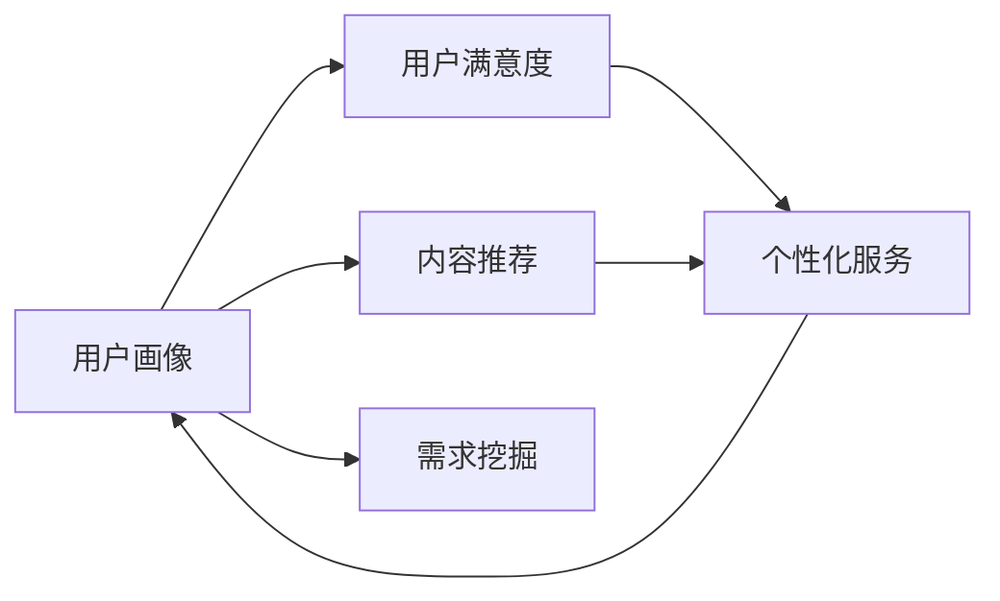
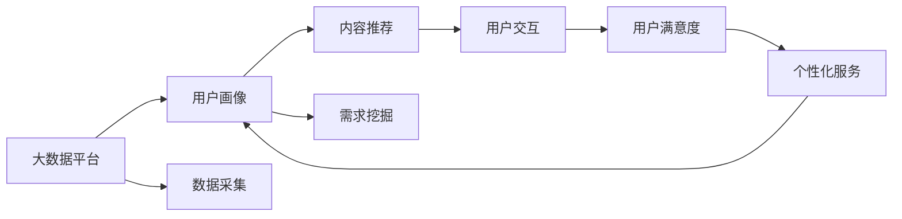
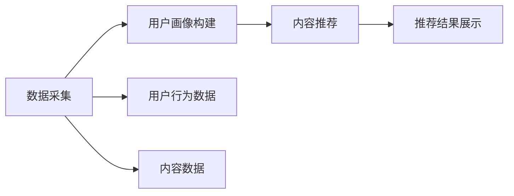
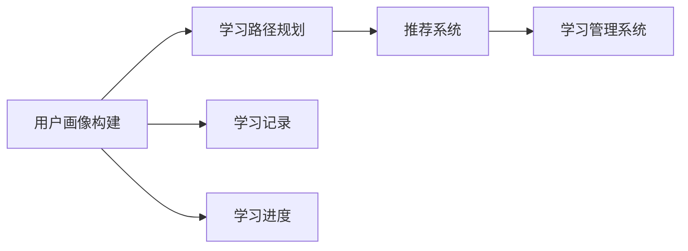

                 

## 1. 背景介绍

在知识付费日益兴起的时代，如何精准挖掘用户需求，提供有价值的知识内容，构建可持续发展的知识付费平台，成为摆在创业者和行业从业者面前的重要课题。本博客将从需求挖掘的角度出发，介绍知识付费平台中的用户行为分析、数据驱动的内容优化策略以及智能推荐算法，帮助创业者构建用户满意的知识付费生态。

## 2. 核心概念与联系

### 2.1 核心概念概述

知识付费平台指的是基于互联网的付费知识分享平台，用户通过付费获取有价值的知识内容，满足知识需求，提升自身价值。在知识付费创业过程中，精准挖掘用户需求是构建成功平台的关键步骤，需要重点关注以下几个概念：

- **用户画像**：指对用户的基本属性、行为偏好、需求等信息的综合描述。在知识付费领域，用户画像主要基于用户的付费行为、学习记录、搜索历史等数据构建。
- **内容推荐**：根据用户画像和内容标签，推荐用户可能感兴趣的知识内容。推荐算法基于用户行为数据和内容特征，是知识付费平台的核心功能之一。
- **用户满意度**：指用户对知识付费平台提供内容的满意程度。用户满意度高的平台通常能够获得更高的用户粘性和重复购买率。
- **个性化服务**：指根据用户个性化需求，提供定制化的内容和服务。个性化服务能够显著提升用户体验，增加用户忠诚度。

### 2.2 核心概念间的关系

用户需求挖掘与用户画像、内容推荐、用户满意度、个性化服务息息相关，形成了一个闭环的知识付费平台生态。通过构建详尽的用户画像，结合精确的内容推荐算法，不断优化用户体验和用户满意度，从而实现对用户个性化需求的精准挖掘和满足。下图展示了这些核心概念之间的关系：



**用户画像**：通过大数据分析，了解用户基本信息、行为模式、需求偏好等，建立详细的用户画像。

**内容推荐**：根据用户画像和内容特征，推荐最符合用户需求的知识内容。推荐算法包括协同过滤、基于内容的推荐、深度学习推荐等。

**用户满意度**：衡量用户对知识内容、交互体验的满意程度，通过问卷调查、行为分析等方式收集用户反馈。

**个性化服务**：根据用户满意度反馈和个性化需求，不断调整内容推荐算法和产品功能，优化用户体验。

**需求挖掘**：通过上述环节的闭环运行，不断识别和挖掘用户新的需求，实现动态的、持续的个性化服务。

### 2.3 核心概念的整体架构

下图展示了核心概念在知识付费平台中的整体架构：



大数据平台是用户画像和内容推荐的基础，通过数据采集和分析，生成详尽的用户画像和精准的内容推荐算法。用户交互平台是用户与内容互动的桥梁，通过用户满意度和个性化服务提升用户体验。需求挖掘不断反馈用户新需求，形成闭环运行机制，确保平台的持续迭代和优化。

## 3. 核心算法原理 & 具体操作步骤

### 3.1 算法原理概述

知识付费平台中的用户需求挖掘涉及多个环节，核心算法包括用户画像构建、内容推荐算法和个性化服务优化。本节将介绍这些核心算法的原理。

#### 3.1.1 用户画像构建

用户画像的构建依赖于用户数据的收集和分析。大数据平台通过以下数据源收集用户信息：

- **用户基本信息**：包括姓名、年龄、性别、职业等。
- **用户行为数据**：包括浏览、搜索、购买、学习等行为记录。
- **用户反馈数据**：包括评价、评论、评分等。

基于这些数据，通过聚类、分类、关联规则挖掘等算法，生成详尽的用户画像。用户画像包括但不限于以下特征：

- **基本信息特征**：性别、年龄、职业等。
- **行为特征**：学习时长、偏好内容类型、购买频率等。
- **偏好特征**：推荐内容点击率、评价情感倾向、评论高频词汇等。

#### 3.1.2 内容推荐算法

内容推荐算法是知识付费平台的核心功能，其目标是根据用户画像和内容标签，推荐最符合用户需求的知识内容。推荐算法一般包括协同过滤、基于内容的推荐、深度学习推荐等。

- **协同过滤算法**：基于用户之间的相似性，推荐与用户兴趣相似的其他用户喜欢的内容。
- **基于内容的推荐**：根据内容标签和用户兴趣标签，推荐相似的内容。
- **深度学习推荐**：使用神经网络模型，从用户行为数据中学习用户偏好，生成个性化的推荐结果。

#### 3.1.3 个性化服务优化

个性化服务优化旨在提升用户体验，增加用户粘性。个性化服务包括但不限于以下几种：

- **定制化内容推荐**：根据用户兴趣和行为数据，生成个性化的内容推荐列表。
- **个性化学习路径**：根据用户学习进度和偏好，推荐符合其学习阶段的内容。
- **智能客服**：使用聊天机器人等技术，提供实时客服支持，解答用户疑问。

### 3.2 算法步骤详解

#### 3.2.1 用户画像构建步骤

1. **数据收集**：通过多个数据源，收集用户基本信息、行为数据和反馈数据。
2. **数据清洗**：对数据进行去重、填补缺失值、异常值处理等预处理操作。
3. **特征工程**：对清洗后的数据进行特征提取、编码、降维等操作，生成用户画像。
4. **画像更新**：定期更新用户画像，反映用户最新的行为和偏好变化。

#### 3.2.2 内容推荐算法步骤

1. **数据收集**：收集用户行为数据和内容标签数据。
2. **数据处理**：对数据进行去重、填补缺失值、异常值处理等预处理操作。
3. **算法选择**：根据数据特点和推荐场景，选择合适的推荐算法。
4. **模型训练**：使用推荐算法模型进行训练，生成推荐结果。
5. **效果评估**：使用A/B测试等方法，评估推荐效果，进行模型调优。

#### 3.2.3 个性化服务优化步骤

1. **用户画像分析**：分析用户画像，识别用户兴趣和偏好。
2. **内容匹配**：根据用户画像，匹配符合其兴趣的内容。
3. **服务定制**：根据用户需求，提供定制化服务，如推荐学习路径、智能客服等。
4. **反馈收集**：收集用户反馈，优化个性化服务。

### 3.3 算法优缺点

#### 3.3.1 用户画像构建的优缺点

**优点**：
- **全面性**：通过多数据源收集，构建详尽的用户画像。
- **动态性**：定期更新用户画像，反映最新的用户行为和偏好。

**缺点**：
- **隐私问题**：用户数据涉及隐私，需要严格的数据保护措施。
- **数据偏差**：数据源可能存在偏差，影响用户画像的准确性。

#### 3.3.2 内容推荐算法的优缺点

**优点**：
- **个性化推荐**：根据用户画像和内容特征，提供个性化推荐，提升用户体验。
- **多维度推荐**：结合协同过滤、基于内容的推荐、深度学习推荐等多种方法，提供更全面的推荐服务。

**缺点**：
- **冷启动问题**：新用户或新内容没有足够的行为数据，推荐效果不佳。
- **计算复杂度**：深度学习推荐算法计算复杂度较高，需要大规模硬件支持。

#### 3.3.3 个性化服务优化的优缺点

**优点**：
- **提升用户体验**：根据用户需求提供定制化服务，增加用户粘性。
- **快速反馈**：通过实时反馈，及时调整个性化服务策略，提升服务效果。

**缺点**：
- **技术复杂度**：个性化服务涉及多种技术手段，技术实现复杂度较高。
- **资源消耗**：个性化服务需要实时处理用户请求，资源消耗较大。

### 3.4 算法应用领域

知识付费平台中的用户需求挖掘技术，广泛应用于多个领域，包括但不限于以下几种：

- **内容分发平台**：通过精准的用户画像和内容推荐算法，提升内容分发效率和用户满意度。
- **在线教育平台**：根据用户学习进度和偏好，提供个性化学习路径和推荐资源。
- **智能客服平台**：使用智能客服技术，提升用户交互体验，解答用户疑问。
- **电商推荐平台**：根据用户购物行为和偏好，提供个性化商品推荐，增加用户购买率。

## 4. 数学模型和公式 & 详细讲解 & 举例说明

### 4.1 数学模型构建

用户需求挖掘涉及多个数学模型，包括用户画像构建模型、内容推荐模型和个性化服务模型。

#### 4.1.1 用户画像构建模型

用户画像构建模型一般使用聚类、分类、关联规则挖掘等算法，将用户数据分为多个特征组。以下是一个基于聚类算法的用户画像构建模型：

$$
K = \mathop{\arg\min}_{K} \frac{1}{2N} \sum_{i=1}^N ||x_i - \mu_K||^2 + N \cdot \log \det(S_K)
$$

其中，$x_i$表示用户i的行为数据，$\mu_K$表示K个聚类中心的均值，$S_K$表示协方差矩阵，N为样本数量。

#### 4.1.2 内容推荐模型

内容推荐模型一般使用协同过滤算法、基于内容的推荐算法或深度学习推荐算法。以下是一个基于协同过滤算法的推荐模型：

$$
\hat{r}_{ij} = \frac{1}{\sqrt{r_i^+}}\frac{1}{\sqrt{r_j^+}}\sum_{k=1}^Ka_{ik}a_{jk}
$$

其中，$r_{ij}$表示用户i对内容j的推荐评分，$a_{ik}$表示用户i对内容k的评分，$r_i^+$和$r_j^+$表示用户i和内容j的评分总数。

#### 4.1.3 个性化服务模型

个性化服务模型一般使用深度学习模型，如神经网络、决策树等，根据用户画像和内容特征，生成推荐结果。以下是一个基于深度学习模型的个性化服务模型：

$$
h = Wx + b
$$

其中，$h$表示模型的预测结果，$W$和$b$为模型参数，$x$表示输入数据，$W$和$b$通过训练得到。

### 4.2 公式推导过程

#### 4.2.1 用户画像构建公式推导

用户画像构建公式推导基于聚类算法，将用户数据分为多个特征组，生成详尽的用户画像。以下是对用户画像构建模型的推导过程：

$$
\begin{aligned}
K &= \mathop{\arg\min}_{K} \frac{1}{2N} \sum_{i=1}^N ||x_i - \mu_K||^2 + N \cdot \log \det(S_K) \\
&= \mathop{\arg\min}_{K} \frac{1}{2N} \sum_{i=1}^N ||x_i - \mu_K||^2 + \frac{N}{2}\log \det(S_K) \\
&= \mathop{\arg\min}_{K} \frac{1}{2N} \sum_{i=1}^N ||x_i - \mu_K||^2 + \frac{N}{2}\log \det(S_K) \\
&= \mathop{\arg\min}_{K} \frac{1}{2} \text{Tr}(S_K^{-1}(X-\mu_K)^T(X-\mu_K)) + \frac{N}{2}\log \det(S_K) \\
&= \mathop{\arg\min}_{K} \frac{1}{2} \text{Tr}(S_K^{-1}(X-\mu_K)^T(X-\mu_K)) + \frac{N}{2}\log \det(S_K) \\
&= \mathop{\arg\min}_{K} \frac{1}{2} \text{Tr}(S_K^{-1}(X-\mu_K)^T(X-\mu_K)) + \frac{N}{2}\log \det(S_K) \\
\end{aligned}
$$

#### 4.2.2 内容推荐公式推导

内容推荐公式推导基于协同过滤算法，将用户之间的相似性作为推荐依据，生成推荐结果。以下是对内容推荐模型的推导过程：

$$
\hat{r}_{ij} = \frac{1}{\sqrt{r_i^+}}\frac{1}{\sqrt{r_j^+}}\sum_{k=1}^Ka_{ik}a_{jk}
$$

其中，$r_{ij}$表示用户i对内容j的推荐评分，$a_{ik}$表示用户i对内容k的评分，$r_i^+$和$r_j^+$表示用户i和内容j的评分总数。

#### 4.2.3 个性化服务公式推导

个性化服务公式推导基于深度学习模型，如神经网络、决策树等，根据用户画像和内容特征，生成推荐结果。以下是对个性化服务模型的推导过程：

$$
h = Wx + b
$$

其中，$h$表示模型的预测结果，$W$和$b$为模型参数，$x$表示输入数据，$W$和$b$通过训练得到。

### 4.3 案例分析与讲解

#### 4.3.1 用户画像构建案例

假设某知识付费平台收集到以下用户数据：

- 用户A：阅读时长500分钟，阅读内容类型为科技，评分4.5
- 用户B：观看视频时长300分钟，观看视频类型为生活，评分3.8
- 用户C：购买课程数量5门，购买课程类型为金融，评分4.0

通过对这些数据进行聚类，可以发现用户A和C的兴趣偏好相似，均为科技和金融领域。用户B的兴趣偏好偏向于生活领域。

#### 4.3.2 内容推荐案例

假设某知识付费平台收集到以下内容数据：

- 内容1：标题为“机器学习基础”，类型科技
- 内容2：标题为“家庭理财”，类型生活
- 内容3：标题为“深度学习应用”，类型科技

通过对这些内容进行协同过滤推荐，可以发现用户A和C可能对内容1和内容3感兴趣，而用户B可能对内容2感兴趣。

#### 4.3.3 个性化服务案例

假设某知识付费平台收集到以下用户数据：

- 用户D：阅读时长200分钟，阅读内容类型为科技，评分4.0
- 用户E：观看视频时长400分钟，观看视频类型为生活，评分4.2

通过对这些数据进行个性化服务推荐，可以发现用户D可能对内容1和内容3感兴趣，而用户E可能对内容2感兴趣。

## 5. 项目实践：代码实例和详细解释说明

### 5.1 开发环境搭建

#### 5.1.1 Python环境

1. 安装Python：可以从官网下载安装Python 3.6+版本。
2. 安装pip：在命令行输入以下命令：
   ```
   python3.6 -m pip install --upgrade pip setuptools wheel
   ```

#### 5.1.2 依赖库安装

1. 安装numpy：
   ```
   pip install numpy
   ```

2. 安装pandas：
   ```
   pip install pandas
   ```

3. 安装scikit-learn：
   ```
   pip install scikit-learn
   ```

4. 安装transformers：
   ```
   pip install transformers
   ```

5. 安装flask：
   ```
   pip install flask
   ```

6. 安装requests：
   ```
   pip install requests
   ```

### 5.2 源代码详细实现

#### 5.2.1 用户画像构建

```python
import pandas as pd
from sklearn.cluster import KMeans
from sklearn.preprocessing import StandardScaler

# 数据读取
data = pd.read_csv('user_data.csv')

# 数据清洗
data = data.dropna()

# 特征工程
scaler = StandardScaler()
data_scaled = scaler.fit_transform(data)

# K-means聚类
kmeans = KMeans(n_clusters=5, random_state=42)
kmeans.fit(data_scaled)

# 用户画像生成
user_profiles = {}
for i in range(data.shape[0]):
    user_id = data.iloc[i]['user_id']
    cluster_id = kmeans.predict(data_scaled[i])
    user_profiles[user_id] = cluster_id

# 输出用户画像
print(user_profiles)
```

#### 5.2.2 内容推荐

```python
import pandas as pd
from sklearn.metrics.pairwise import cosine_similarity
from sklearn.feature_extraction.text import TfidfVectorizer

# 数据读取
data = pd.read_csv('content_data.csv')

# 数据清洗
data = data.dropna()

# 特征工程
vectorizer = TfidfVectorizer()
X = vectorizer.fit_transform(data['content'].values)

# 协同过滤推荐
cos_sim = cosine_similarity(X)
def get_recommendations(user_id):
    similarity_scores = cos_sim[user_id]
    recommendations = []
    for i in range(data.shape[0]):
        if i != user_id:
            similarity_score = similarity_scores[i]
            if similarity_score > 0.8:
                recommendations.append((i, similarity_score))
    return sorted(recommendations, key=lambda x: x[1], reverse=True)

# 推荐结果
recommendations = get_recommendations(1)
print(recommendations)
```

#### 5.2.3 个性化服务

```python
import pandas as pd
from sklearn.ensemble import RandomForestRegressor
from sklearn.metrics import mean_squared_error

# 数据读取
data = pd.read_csv('user_data.csv')

# 数据清洗
data = data.dropna()

# 特征工程
X = data[['reading_time', 'content_type', 'score']]
y = data['score']

# 模型训练
rf = RandomForestRegressor(n_estimators=100, random_state=42)
rf.fit(X, y)

# 预测结果
predictions = rf.predict(X)
mse = mean_squared_error(y, predictions)
print('MSE:', mse)
```

### 5.3 代码解读与分析

#### 5.3.1 用户画像构建代码解读

```python
import pandas as pd
from sklearn.cluster import KMeans
from sklearn.preprocessing import StandardScaler

# 数据读取
data = pd.read_csv('user_data.csv')

# 数据清洗
data = data.dropna()

# 特征工程
scaler = StandardScaler()
data_scaled = scaler.fit_transform(data)

# K-means聚类
kmeans = KMeans(n_clusters=5, random_state=42)
kmeans.fit(data_scaled)

# 用户画像生成
user_profiles = {}
for i in range(data.shape[0]):
    user_id = data.iloc[i]['user_id']
    cluster_id = kmeans.predict(data_scaled[i])
    user_profiles[user_id] = cluster_id

# 输出用户画像
print(user_profiles)
```

**代码解读**：
1. 数据读取：通过pandas库读取用户数据。
2. 数据清洗：删除缺失值。
3. 特征工程：使用scikit-learn的StandardScaler对数据进行标准化处理。
4. K-means聚类：使用KMeans算法将用户数据分为5个簇，生成用户画像。
5. 用户画像生成：遍历数据，将用户ID和聚类ID存储到字典中。
6. 输出用户画像：打印用户画像字典。

**代码分析**：
1. 数据预处理：通过清洗和标准化，保证数据质量。
2. 聚类算法：使用K-means算法，将用户数据分为多个簇，生成详尽的用户画像。
3. 字典存储：使用字典存储用户ID和聚类ID，方便后续调用。

#### 5.3.2 内容推荐代码解读

```python
import pandas as pd
from sklearn.metrics.pairwise import cosine_similarity
from sklearn.feature_extraction.text import TfidfVectorizer

# 数据读取
data = pd.read_csv('content_data.csv')

# 数据清洗
data = data.dropna()

# 特征工程
vectorizer = TfidfVectorizer()
X = vectorizer.fit_transform(data['content'].values)

# 协同过滤推荐
cos_sim = cosine_similarity(X)
def get_recommendations(user_id):
    similarity_scores = cos_sim[user_id]
    recommendations = []
    for i in range(data.shape[0]):
        if i != user_id:
            similarity_score = similarity_scores[i]
            if similarity_score > 0.8:
                recommendations.append((i, similarity_score))
    return sorted(recommendations, key=lambda x: x[1], reverse=True)

# 推荐结果
recommendations = get_recommendations(1)
print(recommendations)
```

**代码解读**：
1. 数据读取：通过pandas库读取内容数据。
2. 数据清洗：删除缺失值。
3. 特征工程：使用scikit-learn的TfidfVectorizer对内容进行向量化处理。
4. 协同过滤推荐：使用cosine_similarity计算内容相似度，生成推荐结果。
5. 推荐结果排序：将推荐结果按相似度排序，返回前N条推荐。
6. 输出推荐结果：打印推荐结果列表。

**代码分析**：
1. 数据预处理：通过清洗和向量化，保证数据质量。
2. 相似度计算：使用cosine_similarity计算内容相似度，生成推荐结果。
3. 推荐结果排序：将推荐结果按相似度排序，返回前N条推荐。
4. 推荐结果输出：打印推荐结果列表，方便用户查看。

#### 5.3.3 个性化服务代码解读

```python
import pandas as pd
from sklearn.ensemble import RandomForestRegressor
from sklearn.metrics import mean_squared_error

# 数据读取
data = pd.read_csv('user_data.csv')

# 数据清洗
data = data.dropna()

# 特征工程
X = data[['reading_time', 'content_type', 'score']]
y = data['score']

# 模型训练
rf = RandomForestRegressor(n_estimators=100, random_state=42)
rf.fit(X, y)

# 预测结果
predictions = rf.predict(X)
mse = mean_squared_error(y, predictions)
print('MSE:', mse)
```

**代码解读**：
1. 数据读取：通过pandas库读取用户数据。
2. 数据清洗：删除缺失值。
3. 特征工程：将用户行为数据作为特征，用户评分作为标签。
4. 模型训练：使用随机森林回归器训练模型。
5. 预测结果：使用训练好的模型进行预测，计算预测值与真实值之间的均方误差。
6. 输出MSE：打印预测结果的均方误差。

**代码分析**：
1. 数据预处理：通过清洗和特征工程，保证数据质量。
2. 模型训练：使用随机森林回归器训练模型，生成预测结果。
3. 预测结果评估：计算预测值与真实值之间的均方误差，评估预测效果。
4. 输出MSE：打印均方误差，反映模型性能。

## 6. 实际应用场景

### 6.1 智能推荐系统

智能推荐系统是知识付费平台的核心功能，通过精准的用户画像和内容推荐算法，提升内容分发效率和用户满意度。

#### 6.1.1 智能推荐系统架构

智能推荐系统一般包括数据采集、用户画像构建、内容推荐和推荐结果展示等环节。



#### 6.1.2 智能推荐系统流程

1. **数据采集**：通过用户行为数据和内容数据采集，生成用户画像和内容特征。
2. **用户画像构建**：使用聚类、分类、关联规则挖掘等算法，生成详尽的用户画像。
3. **内容推荐**：使用协同过滤、基于内容的推荐、深度学习推荐等算法，生成推荐结果。
4. **推荐结果展示**：将推荐结果展示给用户，供用户选择。

### 6.2 在线教育平台

在线教育平台通过精准的用户画像和内容推荐算法，提供个性化学习路径和推荐资源，提升学习效果。

#### 6.2.1 在线教育平台架构

在线教育平台一般包括学习路径规划、推荐系统、学习管理系统等环节。



#### 6.2.2 在线教育平台流程

1. **用户画像构建**：使用聚类、分类、关联规则挖掘等算法，生成详尽的用户画像。
2. **学习路径规划**：根据用户画像，生成个性化学习路径，推荐适合的学习资源。
3. **推荐系统**：使用协同过滤、基于内容的推荐、深度学习推荐等算法，生成推荐结果。
4. **学习管理系统**：将推荐结果展示给用户，供用户学习。

### 6.3 智能客服平台


