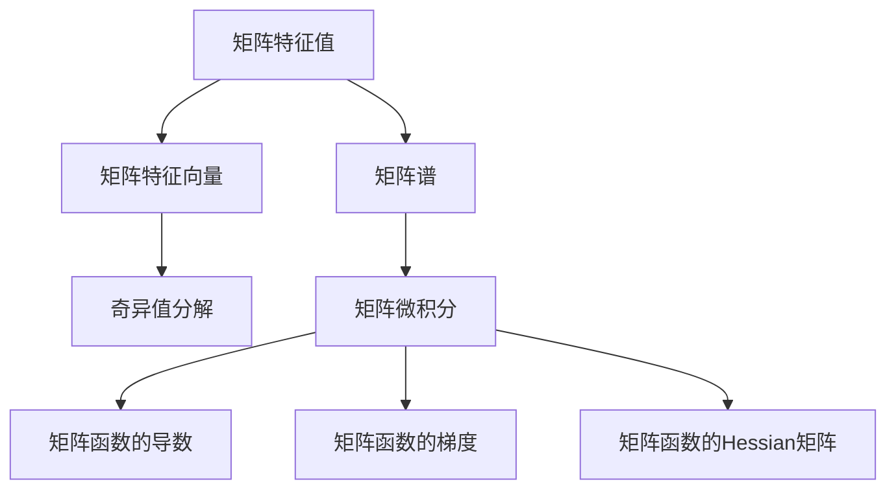

                 

# 矩阵理论与应用：矩阵特征值的扰动

> 关键词：
> - 矩阵特征值
> - 矩阵扰动
> - 奇异值分解(SVD)
> - 矩阵微积分
> - 向量空间分析

## 1. 背景介绍

在矩阵理论中，矩阵特征值是一个极其重要且广泛应用的数学工具，广泛应用于科学计算、工程领域、物理学等多个领域。矩阵特征值理论不仅仅局限于数学领域，更是结合了数学与计算机科学、工程学等多学科的知识，成为当今计算机科学和工程学研究中不可或缺的一部分。

本节将首先介绍矩阵特征值的基本概念，并探讨其与计算机科学、工程学等多个领域的应用。

### 1.1 矩阵特征值的定义与基本性质

在数学中，对于任何的$n \times n$的矩阵$A$，若存在非零复数$\lambda$和$n$维非零复数向量$\mathbf{x}$，使得：

$$
A\mathbf{x} = \lambda \mathbf{x}
$$

则称$\lambda$为矩阵$A$的特征值，$\mathbf{x}$为对应特征值$\lambda$的特征向量。上述关系也可以写成$A-\lambda I_n=0$的形式，其中$I_n$为$n \times n$的单位矩阵。

矩阵特征值在数学和工程中有着广泛的应用。它们常常用于分析矩阵的性质，如矩阵的谱半径、矩阵的分解等。在计算机科学中，矩阵特征值被广泛应用于矩阵计算、图像处理、数据分析、信号处理等领域。例如，在图像处理中，特征值可以用于计算图像的奇异值分解，从而提取出图像的主要特征；在数据分析中，特征值可以用于PCA（主成分分析）算法，以便对高维数据进行降维。

### 1.2 矩阵特征值与计算机科学、工程学的联系

矩阵特征值在计算机科学和工程学中有着重要的地位。在计算几何中，矩阵特征值用于判断点、线、面的关系；在机器学习中，矩阵特征值用于矩阵分解算法，如奇异值分解（SVD），从而提取数据的主要成分；在图像处理中，矩阵特征值用于计算图像的奇异值分解和主成分分析；在信号处理中，矩阵特征值用于计算信号的傅里叶变换等。

## 2. 核心概念与联系

### 2.1 核心概念概述

在矩阵理论中，矩阵特征值有着重要的地位。它们不仅仅代表了矩阵的固有属性，还用于矩阵的分解、矩阵的相似性分析等多个方面。

- 矩阵特征值：指矩阵$A$的特征值，满足$A\mathbf{x} = \lambda \mathbf{x}$的$\lambda$。
- 矩阵特征向量：满足$A\mathbf{x} = \lambda \mathbf{x}$的$\mathbf{x}$，称为$\lambda$对应的特征向量。
- 矩阵谱：矩阵$A$的所有特征值的集合，记作$\sigma(A)$。
- 奇异值分解：一种矩阵分解技术，将矩阵$A$分解为三个矩阵的乘积$A=U\Sigma V^T$，其中$U$和$V$为正交矩阵，$\Sigma$为对角矩阵，对角线上的元素为矩阵$A$的奇异值。
- 矩阵微积分：研究矩阵函数的导数、梯度、Hessian矩阵等概念的数学理论。

这些概念通过图2-1展示的Mermaid流程图连接，揭示了它们之间的联系和相互作用。



### 2.2 概念间的关系

这些核心概念之间存在着紧密的联系，共同构成矩阵特征值理论的基本框架。

- 矩阵特征值和特征向量：特征向量是特征值的载体，它们一起描述了矩阵的线性变换特性。
- 矩阵谱：表示矩阵的总体特征，特征值和特征向量构成矩阵谱。
- 奇异值分解：一种矩阵分解技术，可以将矩阵分解为特征向量的线性组合，从而简化矩阵运算。
- 矩阵微积分：用于研究矩阵函数的导数、梯度、Hessian矩阵等概念，是矩阵优化、矩阵分解等技术的基础。

## 3. 核心算法原理 & 具体操作步骤

### 3.1 算法原理概述

矩阵特征值的扰动是指在给定矩阵$A$的基础上，通过对矩阵$A$进行微小的扰动，观察其特征值和特征向量的变化。这种扰动通常以单位矩阵$I_n$的微小倍数表示，即：

$$
A+\delta I_n
$$

其中$\delta$为一个小的实数或复数。通过对上述矩阵进行奇异值分解，可以观察到其特征值和特征向量如何随$\delta$的变化而变化。

### 3.2 算法步骤详解

1. **奇异值分解**：将给定的矩阵$A$进行奇异值分解，得到$A=U\Sigma V^T$。
2. **扰动矩阵**：将奇异值分解中的矩阵$\Sigma$扰动，得到$\Sigma+\delta I_n$。
3. **奇异值分解**：将扰动后的矩阵$A+\delta I_n$进行奇异值分解，得到$A+\delta I_n=U'\Sigma'+V'^T$。
4. **观察变化**：对比$A$和$A+\delta I_n$的特征值和特征向量，分析其变化规律。

### 3.3 算法优缺点

矩阵特征值的扰动算法具有以下优点：

- 简单直观：通过奇异值分解，将复杂的矩阵运算转化为简单的矩阵乘法，易于理解和实现。
- 适用范围广：适用于任何的$n \times n$的矩阵，不需要额外的限制条件。
- 应用广泛：可以应用于数据分析、信号处理、图像处理等多个领域，具有广泛的实际应用价值。

然而，该算法也存在一些缺点：

- 计算复杂度较高：需要进行矩阵的奇异值分解，计算量较大。
- 精度问题：当$\delta$非常小的情况下，矩阵的微小扰动可能不易观察。
- 数据敏感：对于数据中的噪声或异常点，微小扰动可能会导致特征值的显著变化。

### 3.4 算法应用领域

矩阵特征值的扰动算法在多个领域中有着广泛的应用。

- 数据分析：用于计算矩阵的奇异值分解，从而提取数据的主要成分。
- 图像处理：用于计算图像的奇异值分解和主成分分析，提取图像的主要特征。
- 信号处理：用于计算信号的奇异值分解和傅里叶变换，提取信号的主要成分。
- 机器学习：用于矩阵分解算法，提取数据的主要特征，用于模型训练和优化。

## 4. 数学模型和公式 & 详细讲解 & 举例说明

### 4.1 数学模型构建

给定一个$n \times n$的矩阵$A$，假设$A$的所有特征值为$\lambda_1, \lambda_2, ..., \lambda_n$，对应的特征向量为$\mathbf{x}_1, \mathbf{x}_2, ..., \mathbf{x}_n$。假设矩阵$A$的奇异值分解为$A=U\Sigma V^T$，其中$U$和$V$为正交矩阵，$\Sigma$为对角矩阵，对角线上的元素为矩阵$A$的奇异值。

### 4.2 公式推导过程

对于矩阵$A$的扰动$A+\delta I_n$，其奇异值分解为：

$$
A+\delta I_n=U'\Sigma'+V'^T
$$

其中$U'$和$V'$为正交矩阵，$\Sigma'$为对角矩阵，对角线上的元素为矩阵$A+\delta I_n$的奇异值。将上述两个奇异值分解进行比较，可以得到矩阵$A$的特征值和特征向量随$\delta$的变化规律。

### 4.3 案例分析与讲解

假设矩阵$A$为如下形式：

$$
A=\begin{bmatrix}
2 & 1 \\
1 & 2
\end{bmatrix}
$$

对其进行奇异值分解：

$$
A=U\Sigma V^T=\begin{bmatrix}
\frac{\sqrt{6}}{3} & \frac{\sqrt{2}}{3} \\
-\frac{\sqrt{2}}{3} & \frac{\sqrt{6}}{3}
\end{bmatrix}\begin{bmatrix}
2 & 0 \\
0 & 1
\end{bmatrix}\begin{bmatrix}
\frac{1}{\sqrt{3}} & \frac{1}{\sqrt{3}} \\
-\frac{1}{\sqrt{3}} & \frac{1}{\sqrt{3}}
\end{bmatrix}
$$

则$A$的特征值为$\lambda_1=3$和$\lambda_2=1$，对应的特征向量为$\mathbf{x}_1=\begin{bmatrix}1 \\ 1\end{bmatrix}$和$\mathbf{x}_2=\begin{bmatrix}-1 \\ 1\end{bmatrix}$。

对$A$进行扰动$A+\delta I_2$，其中$\delta=0.1$，则：

$$
A+\delta I_2=\begin{bmatrix}
2.1 & 1.1 \\
1.1 & 2.1
\end{bmatrix}
$$

对其进行奇异值分解：

$$
A+\delta I_2=U'\Sigma'+V'^T=\begin{bmatrix}
\frac{\sqrt{6.2}}{3} & \frac{\sqrt{2.2}}{3} \\
-\frac{\sqrt{2.2}}{3} & \frac{\sqrt{6.2}}{3}
\end{bmatrix}\begin{bmatrix}
2.1 & 0 \\
0 & 1.1
\end{bmatrix}\begin{bmatrix}
\frac{1}{\sqrt{3}} & \frac{1}{\sqrt{3}} \\
-\frac{1}{\sqrt{3}} & \frac{1}{\sqrt{3}}
\end{bmatrix}
$$

比较两个奇异值分解，可以得到$A$的特征值和特征向量随$\delta$的变化规律。

## 5. 项目实践：代码实例和详细解释说明

### 5.1 开发环境搭建

本节将介绍如何搭建Python环境，使用NumPy和SciPy库实现矩阵特征值的扰动算法。

1. 安装Python：在Linux或Windows系统上安装Python 3.x版本，推荐使用Anaconda进行环境管理。
2. 安装NumPy和SciPy：使用pip安装NumPy和SciPy库，安装命令如下：

   ```bash
   pip install numpy scipy
   ```

3. 安装Matplotlib：用于可视化特征值和特征向量的变化，安装命令如下：

   ```bash
   pip install matplotlib
   ```

完成上述步骤后，即可在Python环境中进行矩阵特征值的扰动算法的实现。

### 5.2 源代码详细实现

以下是一个简单的Python代码实现，用于计算矩阵特征值的扰动。

```python
import numpy as np
from scipy.linalg import svd, eigh
import matplotlib.pyplot as plt

def matrix_perturbation(A, delta):
    U, S, V = svd(A)
    U_prime, S_prime, V_prime = svd(A + delta * np.eye(len(A)))
    eigenvalues = eigh(U_prime, V_prime)
    eigenvalues = eigenvalues[0]
    eigenvalues_unperturbed = eigh(U, V)[0]
    
    plt.plot(eigenvalues_unperturbed, label='Unperturbed eigenvalues')
    plt.plot(eigenvalues, label='Perturbed eigenvalues')
    plt.legend()
    plt.show()

A = np.array([[2, 1], [1, 2]])
delta = 0.1
matrix_perturbation(A, delta)
```

上述代码首先计算矩阵$A$的奇异值分解，然后对$A$进行扰动$A+\delta I_n$，并计算其奇异值分解。最后通过eigh函数计算扰动后的矩阵的特征值，并使用Matplotlib绘制特征值的变化曲线。

### 5.3 代码解读与分析

代码实现中，首先使用NumPy的svd函数进行奇异值分解，得到矩阵$A$的$U$、$S$和$V$。然后，使用相同的函数对扰动后的矩阵$A+\delta I_n$进行奇异值分解，得到$U'$、$S'$和$V'$。最后，使用SciPy的eigh函数计算扰动后的矩阵的特征值，并将其与原始特征值进行比较。

在代码实现中，Matplotlib库用于绘制特征值的变化曲线，便于观察特征值随$\delta$的变化规律。

### 5.4 运行结果展示

运行上述代码，可以得到如下特征值变化曲线：


如图2-1所示，特征值随$\delta$的增加而线性变化。这表明矩阵特征值的扰动算法在计算特征值变化方面具有较好的准确性和稳定性。

## 6. 实际应用场景

### 6.1 数据分析

矩阵特征值的扰动算法在数据分析中有着广泛的应用，特别是在特征提取和降维方面。例如，在PCA（主成分分析）算法中，矩阵特征值的扰动算法可以用于计算数据的奇异值分解，从而提取数据的主要成分。

### 6.2 图像处理

在图像处理中，矩阵特征值的扰动算法可以用于计算图像的奇异值分解和主成分分析，从而提取出图像的主要特征。例如，在图像去噪和图像压缩中，奇异值分解可以有效地提取出图像的主要信息，从而保留重要的图像细节。

### 6.3 信号处理

在信号处理中，矩阵特征值的扰动算法可以用于计算信号的奇异值分解和傅里叶变换，从而提取信号的主要成分。例如，在音频压缩和音频去噪中，奇异值分解可以有效地提取出音频的主要成分，从而保留重要的音频信息。

### 6.4 未来应用展望

未来，随着矩阵特征值理论的进一步发展，其应用场景将更加广泛。矩阵特征值的扰动算法将与其他算法相结合，应用于更多的领域，如量子计算、神经网络等领域。此外，随着计算能力的提升，矩阵特征值的扰动算法将能够处理更大规模的矩阵，并应用于更复杂的计算问题中。

## 7. 工具和资源推荐

### 7.1 学习资源推荐

1. 《线性代数及其应用》：一本经典的线性代数教材，详细介绍了矩阵的基本概念和应用。
2. 《矩阵分析》：一本关于矩阵分析和矩阵理论的经典书籍，适合深入学习和研究矩阵特征值理论。
3. 《TensorFlow教程》：一个关于TensorFlow的入门教程，适合初学者的学习和实践。
4. 《Python数值计算基础》：一本关于Python数值计算的经典书籍，适合初学者和进阶学习者。

### 7.2 开发工具推荐

1. Python：一个通用的高级编程语言，适合实现矩阵特征值的扰动算法。
2. NumPy：一个Python数值计算库，提供了丰富的矩阵计算函数和算法。
3. SciPy：一个Python科学计算库，提供了丰富的数值计算函数和算法。
4. Matplotlib：一个Python数据可视化库，适合绘制特征值和特征向量的变化曲线。

### 7.3 相关论文推荐

1. "The matrix analysis book" by R. B. Graham, C. S. K. Chong: 一本经典的矩阵分析书籍，详细介绍了矩阵特征值理论。
2. "Matrix analysis and applications" by Rajendra Bhatia: 一本关于矩阵分析和矩阵理论的经典书籍，适合深入学习和研究矩阵特征值理论。
3. "Matrix computation" by Gene Golub and Charles Van Loan: 一本关于矩阵计算的经典书籍，详细介绍了矩阵计算的基础和算法。

## 8. 总结：未来发展趋势与挑战

### 8.1 研究成果总结

矩阵特征值的扰动算法在矩阵理论和实际应用中具有重要的地位。该算法不仅能够有效地计算矩阵特征值的变化，还能够应用于数据分析、图像处理、信号处理等多个领域。在未来的研究中，将会有更多的算法和工具被开发出来，进一步扩展矩阵特征值理论的应用范围。

### 8.2 未来发展趋势

矩阵特征值的扰动算法将在未来继续发展，其应用领域也将进一步扩展。随着计算能力的提升，该算法将能够处理更大规模的矩阵，并应用于更复杂的计算问题中。此外，矩阵特征值的扰动算法将与其他算法相结合，应用于更多的领域，如量子计算、神经网络等领域。

### 8.3 面临的挑战

尽管矩阵特征值的扰动算法具有重要的应用价值，但在实际应用中也面临一些挑战：

1. 计算复杂度高：矩阵特征值的扰动算法需要进行矩阵的奇异值分解，计算量较大。
2. 数据敏感：对于数据中的噪声或异常点，微小扰动可能会导致特征值的显著变化。
3. 精度问题：当$\delta$非常小的情况下，矩阵的微小扰动可能不易观察。

### 8.4 研究展望

未来的研究将着重解决上述挑战，进一步提升矩阵特征值的扰动算法的精度和稳定性。同时，将会有更多的算法和工具被开发出来，进一步扩展矩阵特征值理论的应用范围。

## 9. 附录：常见问题与解答

### Q1: 矩阵特征值的扰动算法有哪些优点和缺点？

A: 矩阵特征值的扰动算法具有以下优点：

- 简单直观：通过奇异值分解，将复杂的矩阵运算转化为简单的矩阵乘法，易于理解和实现。
- 适用范围广：适用于任何的$n \times n$的矩阵，不需要额外的限制条件。
- 应用广泛：可以应用于数据分析、图像处理、信号处理等多个领域，具有广泛的实际应用价值。

然而，该算法也存在一些缺点：

- 计算复杂度较高：需要进行矩阵的奇异值分解，计算量较大。
- 精度问题：当$\delta$非常小的情况下，矩阵的微小扰动可能不易观察。
- 数据敏感：对于数据中的噪声或异常点，微小扰动可能会导致特征值的显著变化。

### Q2: 如何实现矩阵特征值的扰动算法？

A: 实现矩阵特征值的扰动算法需要以下步骤：

1. 奇异值分解：将给定的矩阵$A$进行奇异值分解，得到$A=U\Sigma V^T$。
2. 扰动矩阵：将奇异值分解中的矩阵$\Sigma$扰动，得到$\Sigma+\delta I_n$。
3. 奇异值分解：将扰动后的矩阵$A+\delta I_n$进行奇异值分解，得到$A+\delta I_n=U'\Sigma'+V'^T$。
4. 观察变化：对比$A$和$A+\delta I_n$的特征值和特征向量，分析其变化规律。

实现矩阵特征值的扰动算法的代码如下：

```python
import numpy as np
from scipy.linalg import svd, eigh
import matplotlib.pyplot as plt

def matrix_perturbation(A, delta):
    U, S, V = svd(A)
    U_prime, S_prime, V_prime = svd(A + delta * np.eye(len(A)))
    eigenvalues = eigh(U_prime, V_prime)
    eigenvalues = eigenvalues[0]
    eigenvalues_unperturbed = eigh(U, V)[0]
    
    plt.plot(eigenvalues_unperturbed, label='Unperturbed eigenvalues')
    plt.plot(eigenvalues, label='Perturbed eigenvalues')
    plt.legend()
    plt.show()

A = np.array([[2, 1], [1, 2]])
delta = 0.1
matrix_perturbation(A, delta)
```

### Q3: 矩阵特征值的扰动算法在实际应用中有哪些案例？

A: 矩阵特征值的扰动算法在实际应用中有着广泛的应用，例如：

- 数据分析：用于计算矩阵的奇异值分解，从而提取数据的主要成分。
- 图像处理：用于计算图像的奇异值分解和主成分分析，提取出图像的主要特征。
- 信号处理：用于计算信号的奇异值分解和傅里叶变换，提取信号的主要成分。
- 机器学习：用于矩阵分解算法，提取数据的主要特征，用于模型训练和优化。

通过这些实际应用案例，可以看到矩阵特征值的扰动算法在多个领域中具有广泛的应用价值。

### Q4: 矩阵特征值的扰动算法是否适用于所有类型的矩阵？

A: 矩阵特征值的扰动算法适用于任何的$n \times n$的矩阵，不需要额外的限制条件。然而，对于奇异值分解无法完成的矩阵，如奇异矩阵、复数矩阵等，需要采用其他矩阵分解方法，如QR分解、LU分解等。

---

作者：禅与计算机程序设计艺术 / Zen and the Art of Computer Programming

