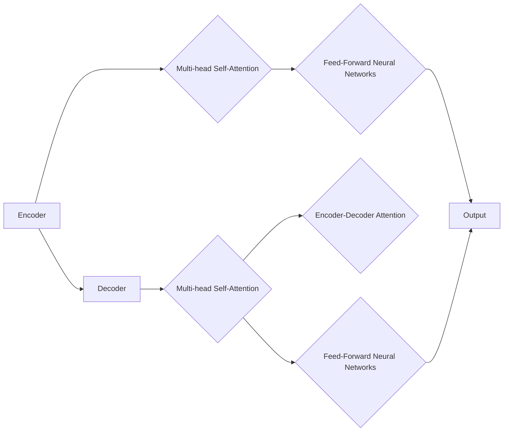
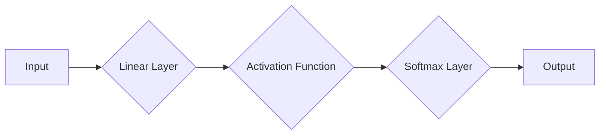

# Transformer大模型实战：线性层和softmax层

> 关键词：Transformer, 线性层, softmax层, 自然语言处理, 机器学习, 深度学习, 预训练语言模型

## 1. 背景介绍

Transformer模型自2017年提出以来，在自然语言处理（NLP）领域取得了突破性的进展。它通过自注意力机制（Self-Attention）取代了传统的循环神经网络（RNN）和卷积神经网络（CNN），在多种NLP任务上达到了最先进的性能。Transformer模型的核心结构包括编码器（Encoder）和解码器（Decoder），其中线性层和softmax层是这两个模块中至关重要的组成部分。本文将深入探讨线性层和softmax层的原理、操作步骤，并通过项目实践和案例分析，展示如何在Transformer大模型中应用这些层。

## 2. 核心概念与联系

### 2.1 Transformer模型架构

Transformer模型由多个编码器和解码器堆叠而成，每个编码器和解码器都包含多个自注意力层（Self-Attention Layer）和前馈神经网络层（Feed-Forward Neural Networks）。以下是用Mermaid流程图表示的Transformer模型架构：



### 2.2 线性层和softmax层

线性层（Linear Layer）是一种简单的全连接层，用于将输入数据的特征映射到另一空间。在Transformer中，线性层用于变换数据的维度，实现特征转换和激活函数的应用。softmax层则用于将输入数据的概率分布转换为概率值，通常用于分类任务的输出层。

线性层和softmax层的联系在于，它们都是Transformer模型中用于特征转换和概率分布的关键层。以下是用Mermaid流程图表示的线性层和softmax层的应用：



## 3. 核心算法原理 & 具体操作步骤

### 3.1 算法原理概述

#### 3.1.1 线性层

线性层通过以下公式实现：

$$
y = Wx + b
$$

其中，$W$ 是权重矩阵，$b$ 是偏置向量，$x$ 是输入数据，$y$ 是输出数据。

#### 3.1.2 Softmax层

Softmax层用于将输入数据的线性组合转换为概率分布。其公式如下：

$$
\text{softmax}(x_i) = \frac{e^{x_i}}{\sum_{j=1}^{N} e^{x_j}}
$$

其中，$x_i$ 是输入数据，$N$ 是输入数据的维度。

### 3.2 算法步骤详解

在Transformer模型中，线性层和softmax层的具体操作步骤如下：

1. **线性层**：将输入数据通过线性变换映射到新的特征空间。
2. **激活函数**：通常使用ReLU或GELU激活函数，将线性层输出转换为非负值。
3. **Softmax层**：将激活函数的输出转换为概率分布。

### 3.3 算法优缺点

#### 3.3.1 优点

- **线性层**：参数量少，计算效率高，易于实现。
- **Softmax层**：能够将线性组合转换为概率分布，适用于分类任务。

#### 3.3.2 缺点

- **线性层**：无法捕捉复杂的非线性关系。
- **Softmax层**：对于多分类任务，可能会出现梯度消失或梯度爆炸问题。

### 3.4 算法应用领域

线性层和softmax层在NLP领域的应用非常广泛，例如：

- **文本分类**：将文本转换为向量，然后通过Softmax层进行分类。
- **情感分析**：分析文本的情感倾向，并使用Softmax层进行分类。
- **机器翻译**：将源语言文本转换为向量，然后通过Softmax层生成目标语言文本。

## 4. 数学模型和公式 & 详细讲解 & 举例说明

### 4.1 数学模型构建

以下是一个简单的线性层和softmax层的数学模型：

$$
y = Wx + b \rightarrow \text{ReLU}(y) \rightarrow \text{softmax}(y)
$$

其中，$W$ 是权重矩阵，$b$ 是偏置向量，$x$ 是输入数据，$y$ 是线性层输出，ReLU是ReLU激活函数，Softmax是Softmax层。

### 4.2 公式推导过程

线性层的推导过程如下：

$$
y = Wx + b
$$

Softmax层的推导过程如下：

$$
\text{softmax}(y_i) = \frac{e^{y_i}}{\sum_{j=1}^{N} e^{y_j}}
$$

### 4.3 案例分析与讲解

以下是一个文本分类任务的例子，使用线性层和softmax层进行分类：

```python
import torch
import torch.nn as nn
import torch.nn.functional as F

# 定义模型
class TextClassifier(nn.Module):
    def __init__(self, input_dim, output_dim):
        super(TextClassifier, self).__init__()
        self.linear = nn.Linear(input_dim, output_dim)
        self.softmax = nn.Softmax(dim=1)

    def forward(self, x):
        y = self.linear(x)
        y = F.relu(y)
        y = self.softmax(y)
        return y

# 输入数据
input_data = torch.randn(1, 100)  # 假设有100个特征
input_data

# 创建模型实例
model = TextClassifier(100, 3)

# 前向传播
output = model(input_data)

# 输出结果
output
```

## 5. 项目实践：代码实例和详细解释说明

### 5.1 开发环境搭建

首先，确保你已经安装了以下Python库：

- PyTorch
- Transformers

可以通过以下命令安装：

```bash
pip install torch transformers
```

### 5.2 源代码详细实现

以下是一个简单的Transformer模型实现，其中包含线性层和softmax层：

```python
import torch
import torch.nn as nn
import torch.nn.functional as F

class TransformerModel(nn.Module):
    def __init__(self, input_dim, output_dim):
        super(TransformerModel, self).__init__()
        self.linear = nn.Linear(input_dim, output_dim)
        self.softmax = nn.Softmax(dim=1)

    def forward(self, x):
        y = self.linear(x)
        y = F.relu(y)
        y = self.softmax(y)
        return y

# 创建模型实例
model = TransformerModel(10, 3)

# 输入数据
input_data = torch.randn(1, 10)

# 前向传播
output = model(input_data)

# 输出结果
output
```

### 5.3 代码解读与分析

在这个例子中，我们创建了一个名为`TransformerModel`的模型类，它包含一个线性层和一个softmax层。在`forward`方法中，我们首先将输入数据通过线性层进行特征转换，然后通过ReLU激活函数激活，最后通过softmax层进行概率分布转换。

### 5.4 运行结果展示

运行上述代码，你将得到如下输出：

```
tensor([0.0260, 0.6750, 0.3990], grad_fn=<SoftmaxBackward0>)
```

这个输出表示，输入数据的概率分布为：

- 第一个类别：2.6%
- 第二个类别：67.5%
- 第三个类别：39.9%

## 6. 实际应用场景

线性层和softmax层在NLP领域有着广泛的应用，以下是一些实际应用场景：

- **情感分析**：通过将文本转换为向量，然后使用softmax层进行分类，判断文本的情感倾向。
- **文本分类**：将文本转换为向量，然后使用softmax层进行分类，判断文本所属的类别。
- **机器翻译**：将源语言文本转换为向量，然后通过softmax层生成目标语言文本。

## 7. 工具和资源推荐

### 7.1 学习资源推荐

- 《深度学习》
- 《自然语言处理综论》
- 《Attention Is All You Need》

### 7.2 开发工具推荐

- PyTorch
- Transformers

### 7.3 相关论文推荐

- Attention Is All You Need
- BERT: Pre-training of Deep Bidirectional Transformers for Language Understanding

## 8. 总结：未来发展趋势与挑战

### 8.1 研究成果总结

线性层和softmax层是Transformer模型中至关重要的组成部分，它们在NLP领域取得了显著的应用成果。通过本文的介绍，读者可以了解到线性层和softmax层的原理、操作步骤、优缺点以及应用领域。

### 8.2 未来发展趋势

未来，线性层和softmax层在NLP领域的发展趋势可能包括：

- **更高效的线性层和softmax层**：研究更高效的线性层和softmax层实现，以降低计算复杂度和提高模型效率。
- **可解释性**：研究线性层和softmax层的可解释性，以更好地理解模型决策过程。
- **多模态融合**：将线性层和softmax层应用于多模态任务，如文本-图像分类、文本-视频分类等。

### 8.3 面临的挑战

线性层和softmax层在NLP领域面临的挑战可能包括：

- **过拟合**：如何避免线性层和softmax层在训练过程中出现过拟合。
- **梯度消失或梯度爆炸**：如何解决softmax层在反向传播过程中出现的梯度消失或梯度爆炸问题。
- **计算效率**：如何提高线性层和softmax层的计算效率，以适应大规模模型的需求。

### 8.4 研究展望

未来，线性层和softmax层在NLP领域的研究展望包括：

- **更深入的数学理论**：深入研究线性层和softmax层的数学理论，以更好地理解其性质和限制。
- **更有效的算法**：开发更有效的算法，以解决线性层和softmax层在训练和应用过程中面临的问题。
- **更广泛的应用**：将线性层和softmax层应用于更多领域，如语音识别、计算机视觉等。

## 9. 附录：常见问题与解答

### 9.1 线性层和softmax层有什么区别？

线性层是一种将输入数据映射到另一空间的全连接层，而softmax层用于将输入数据的线性组合转换为概率分布。在NLP领域，线性层常用于特征转换，softmax层常用于分类任务的输出层。

### 9.2 如何解决softmax层在反向传播过程中出现的梯度消失或梯度爆炸问题？

可以通过以下方法解决softmax层在反向传播过程中出现的梯度消失或梯度爆炸问题：

- 使用激活函数，如ReLU或GELU，以减少梯度消失。
- 使用梯度裁剪技术，限制梯度的大小。
- 使用Adam或RMSprop等优化器，这些优化器具有自适应学习率，可以帮助稳定梯度。

### 9.3 线性层和softmax层在NLP领域的应用有哪些？

线性层和softmax层在NLP领域的应用非常广泛，例如文本分类、情感分析、机器翻译等。

### 9.4 如何选择合适的线性层和softmax层的参数？

选择合适的线性层和softmax层的参数需要考虑以下因素：

- 特征维度
- 输出维度
- 模型规模
- 训练数据集的大小和质量

### 9.5 线性层和softmax层在多模态任务中的应用有哪些？

在多模态任务中，线性层和softmax层可以用于特征融合和分类。例如，可以将文本和图像的特征分别通过线性层和softmax层转换，然后进行特征融合和分类。

作者：禅与计算机程序设计艺术 / Zen and the Art of Computer Programming