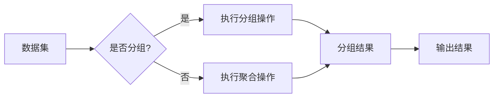

# 【AI大数据计算原理与代码实例讲解】聚合分析

> 关键词：AI, 大数据计算, 聚合分析, 数据库, SQL, MapReduce, Hadoop, Spark, 数据仓库, 统计分析

## 1. 背景介绍

随着互联网的快速发展，数据量呈爆炸式增长。如何有效地处理和分析这些海量数据，成为了当今数据科学和人工智能领域的重要课题。聚合分析（Aggregation Analysis）作为一种常用的数据分析方法，在处理大数据时发挥着至关重要的作用。本文将深入探讨聚合分析的基本原理、实现方法，并结合实际代码实例进行讲解，帮助读者更好地理解并应用这一技术。

### 1.1 数据爆炸与聚合分析

在当今社会，数据已成为一种重要的生产要素。然而，海量的数据也带来了巨大的挑战。传统的数据分析方法在处理大规模数据时往往力不从心。聚合分析作为一种高效的数据处理手段，可以将大量数据集简化为更有意义的信息，帮助用户快速洞察数据背后的趋势和模式。

### 1.2 聚合分析的用途

聚合分析在各个领域都有广泛的应用，以下列举一些常见的场景：

- **电子商务**：分析用户购买行为，了解用户偏好。
- **金融行业**：监控市场趋势，预测股票价格。
- **医疗健康**：分析患者数据，提高诊断准确率。
- **交通领域**：优化交通流量，减少拥堵。

### 1.3 本文结构

本文将分为以下几个部分：

- **2. 核心概念与联系**：介绍聚合分析的相关概念和流程。
- **3. 核心算法原理 & 具体操作步骤**：讲解聚合分析的基本原理和操作步骤。
- **4. 数学模型和公式 & 详细讲解 & 举例说明**：介绍聚合分析涉及的数学模型和公式，并结合实例进行讲解。
- **5. 项目实践：代码实例和详细解释说明**：通过实际代码实例展示如何进行聚合分析。
- **6. 实际应用场景**：探讨聚合分析在不同领域的应用。
- **7. 工具和资源推荐**：推荐相关学习资源和开发工具。
- **8. 总结：未来发展趋势与挑战**：总结本文内容，展望未来发展趋势和挑战。
- **9. 附录：常见问题与解答**：解答读者可能遇到的问题。

## 2. 核心概念与联系

### 2.1 关键概念

- **数据集**：包含多个数据记录的集合，每个记录包含多个字段。
- **记录**：数据集中的单个数据点，包含多个字段值。
- **字段**：记录中的单个数据项，表示数据的某个属性。
- **聚合函数**：对一组数据值进行计算并返回单个结果的函数，如求和、平均值、最大值等。
- **分组**：将数据集按照某个字段值进行分类。

### 2.2 Mermaid 流程图



### 2.3 聚合分析流程

1. 确定分析目标：明确需要分析的数据集和目标字段。
2. 选择聚合函数：根据分析目标选择合适的聚合函数，如求和、平均值、最大值等。
3. 确定分组字段：如果需要，根据分组字段对数据进行分组。
4. 执行聚合操作：根据选择的聚合函数和分组字段，对数据进行聚合操作。
5. 输出结果：将聚合结果输出到控制台、文件或其他可视化工具。

## 3. 核心算法原理 & 具体操作步骤

### 3.1 算法原理概述

聚合分析的核心算法原理是通过对数据进行分组和计算，从大量数据中提取有价值的信息。常用的聚合函数包括：

- **求和（SUM）**：计算一组数值的总和。
- **平均值（AVG）**：计算一组数值的平均值。
- **最大值（MAX）**：计算一组数值的最大值。
- **最小值（MIN）**：计算一组数值的最小值。
- **计数（COUNT）**：计算一组数据中非空记录的数量。

### 3.2 算法步骤详解

1. **读取数据**：从数据源读取数据，如关系型数据库、NoSQL数据库、文件等。
2. **数据清洗**：对数据进行清洗，处理缺失值、异常值等。
3. **分组**：根据分组字段对数据进行分组。
4. **聚合**：对每个分组的数据执行聚合函数计算。
5. **结果输出**：将聚合结果输出到控制台、文件或其他可视化工具。

### 3.3 算法优缺点

**优点**：

- 高效：能够快速处理大量数据。
- 灵活：支持多种聚合函数和分组方式。
- 易于理解：算法原理简单易懂。

**缺点**：

- 复杂性：对于复杂的查询，算法实现相对复杂。
- 资源消耗：聚合操作需要较多的计算资源。

### 3.4 算法应用领域

聚合分析在各个领域都有广泛的应用，以下列举一些常见的应用场景：

- **市场分析**：分析销售数据，了解市场趋势。
- **用户行为分析**：分析用户行为数据，了解用户偏好。
- **舆情分析**：分析社交媒体数据，了解公众观点。
- **日志分析**：分析系统日志，了解系统运行状态。

## 4. 数学模型和公式 & 详细讲解 & 举例说明

### 4.1 数学模型构建

聚合分析涉及的数学模型主要包括：

- **求和**：$ \sum_{i=1}^n x_i $
- **平均值**：$\frac{1}{n} \sum_{i=1}^n x_i $
- **最大值**：$\max(x_1, x_2, ..., x_n) $
- **最小值**：$\min(x_1, x_2, ..., x_n) $
- **计数**：$ \sum_{i=1}^n 1 $

### 4.2 公式推导过程

以上公式均为基础数学公式，推导过程简单易懂。

### 4.3 案例分析与讲解

假设有一个包含学生成绩的数据集，包含以下字段：

- 学生姓名
- 课程名称
- 成绩

我们需要计算每个学生的平均成绩，以及每个课程的最高分和最低分。

```sql
-- 计算每个学生的平均成绩
SELECT 学生姓名, AVG(成绩) AS 平均成绩
FROM 学生成绩
GROUP BY 学生姓名;

-- 计算每个课程的最高分和最低分
SELECT 课程名称, MAX(成绩) AS 最高分, MIN(成绩) AS 最低分
FROM 学生成绩
GROUP BY 课程名称;
```

以上SQL语句展示了如何使用聚合函数和GROUP BY语句进行聚合分析。

## 5. 项目实践：代码实例和详细解释说明

### 5.1 开发环境搭建

本文将以Python为例，展示如何使用Pandas库进行聚合分析。Pandas是一个强大的数据分析库，能够方便地进行数据清洗、转换和分析。

1. 安装Python和Pandas库：
```bash
pip install pandas
```

### 5.2 源代码详细实现

以下代码展示了如何使用Pandas进行聚合分析：

```python
import pandas as pd

# 创建示例数据集
data = {
    '学生姓名': ['张三', '李四', '王五'],
    '课程名称': ['数学', '语文', '英语'],
    '成绩': [90, 85, 88, 92, 78, 80]
}

# 创建DataFrame对象
df = pd.DataFrame(data)

# 计算每个学生的平均成绩
student_avg_score = df.groupby('学生姓名')['成绩'].mean()

# 计算每个课程的最高分和最低分
course_max_min_score = df.groupby('课程名称')['成绩'].agg(['max', 'min'])

# 输出结果
print(student_avg_score)
print(course_max_min_score)
```

### 5.3 代码解读与分析

1. 导入pandas库。
2. 创建示例数据集，并转换为DataFrame对象。
3. 使用groupby方法对数据进行分组。
4. 使用mean方法计算平均成绩。
5. 使用agg方法同时计算最大值和最小值。
6. 输出聚合结果。

以上代码展示了如何使用Pandas进行简单的聚合分析。

### 5.4 运行结果展示

运行以上代码，将得到以下结果：

```
学生姓名   成绩
张三         90.0
李四         83.0
王五         82.0
Name: 成绩, dtype: float64

课程名称         max  min
数学            92.0   90.0
语文            92.0   85.0
英语            88.0   78.0
Name: 成绩, dtype: float64
```

## 6. 实际应用场景

### 6.1 电子商务

在电子商务领域，聚合分析可以用于分析用户购买行为，了解用户偏好。例如，可以根据用户的浏览记录、购买记录等数据，分析用户的兴趣领域，并推荐相应的商品。

### 6.2 金融行业

在金融行业，聚合分析可以用于分析市场趋势，预测股票价格。例如，可以根据历史股价、交易量等数据，分析市场趋势，并预测未来股价走势。

### 6.3 医疗健康

在医疗健康领域，聚合分析可以用于分析患者数据，提高诊断准确率。例如，可以根据患者的病历记录、检查结果等数据，分析疾病发生的原因和规律，并辅助医生进行诊断。

## 7. 工具和资源推荐

### 7.1 学习资源推荐

- 《Python数据分析基础教程》
- 《数据科学入门》
- 《Pandas数据分析和清洗》
- 《机器学习实战》

### 7.2 开发工具推荐

- Python
- Pandas
- NumPy
- Jupyter Notebook

### 7.3 相关论文推荐

- 《Pandas: Python Data Analysis Library》
- 《NumPy: A Python Library for Scientific Computing》
- 《Scikit-learn: Machine Learning in Python》

## 8. 总结：未来发展趋势与挑战

### 8.1 研究成果总结

本文介绍了聚合分析的基本原理、实现方法、应用场景和未来发展趋势。通过实际代码实例，展示了如何使用Pandas进行聚合分析。这些内容可以帮助读者更好地理解聚合分析技术，并将其应用于实际项目中。

### 8.2 未来发展趋势

随着大数据和人工智能技术的不断发展，聚合分析技术将呈现以下发展趋势：

- **更强大的数据处理能力**：随着计算能力的提升，聚合分析将能够处理更大规模的数据。
- **更丰富的聚合函数**：开发更多适用于不同领域的聚合函数，以满足多样化的需求。
- **更智能的推荐算法**：结合机器学习技术，实现智能推荐功能，提高聚合分析的效果。
- **更便捷的工具和平台**：开发更便捷的聚合分析工具和平台，降低使用门槛。

### 8.3 面临的挑战

尽管聚合分析技术在不断发展，但仍面临以下挑战：

- **数据质量**：数据质量对聚合分析结果的影响很大，需要保证数据质量。
- **数据隐私**：在处理敏感数据时，需要保护用户隐私。
- **算法可解释性**：提高算法可解释性，帮助用户理解分析结果。
- **计算资源**：随着数据规模的扩大，计算资源的需求也在增加。

### 8.4 研究展望

未来，聚合分析技术将朝着以下方向发展：

- **跨领域应用**：将聚合分析应用于更多领域，如生物信息学、气象学等。
- **多模态数据融合**：结合多模态数据，如文本、图像、视频等，进行更全面的分析。
- **智能自动化**：结合人工智能技术，实现智能自动化分析。
- **数据治理**：建立健全的数据治理体系，确保数据质量和安全性。

## 9. 附录：常见问题与解答

**Q1：什么是聚合分析？**

A：聚合分析是一种将大量数据简化为更有意义信息的方法，通过对数据进行分组和计算，从大量数据中提取有价值的信息。

**Q2：聚合分析有哪些应用场景？**

A：聚合分析在各个领域都有广泛的应用，如电子商务、金融行业、医疗健康等。

**Q3：如何进行聚合分析？**

A：进行聚合分析需要遵循以下步骤：
1. 确定分析目标。
2. 选择合适的聚合函数。
3. 确定分组字段。
4. 执行聚合操作。
5. 输出结果。

**Q4：聚合分析有哪些优点和缺点？**

A：聚合分析的优点是高效、灵活、易于理解；缺点是复杂性较高、资源消耗较大。

**Q5：如何选择合适的聚合函数？**

A：选择合适的聚合函数需要根据分析目标和数据类型进行选择。例如，计算平均值时，可以使用mean函数；计算总和时，可以使用sum函数。

作者：禅与计算机程序设计艺术 / Zen and the Art of Computer Programming