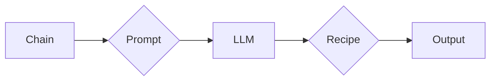
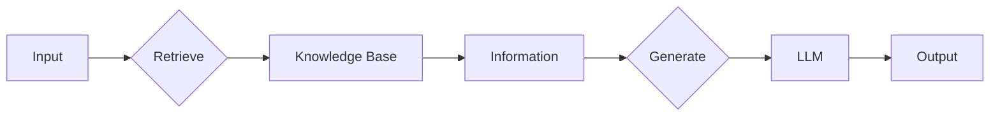

# 【LangChain编程：从入门到实践】检索增强生成实践

> 关键词：LangChain, 检索增强生成, Prompt Engineering, 大语言模型, 问答系统, 文本生成, 代码生成

## 1. 背景介绍

随着大语言模型（LLMs）的快速发展，自然语言处理（NLP）领域迎来了前所未有的变革。LLMs能够理解、生成和翻译自然语言，为各种NLP应用提供了强大的支持。然而，LLMs在生成内容时的质量和相关性往往依赖于输入的上下文和提示（Prompt）。为了提高生成内容的质量和实用性，检索增强生成（Retrieval-Augmented Generation, RAG）技术应运而生。本文将深入探讨LangChain编程，尤其是检索增强生成实践，帮助读者从入门到实践，掌握这项强大的技术。

### 1.1 问题的由来

传统的LLMs生成文本通常依赖于自顶向下的生成过程，即模型根据输入的上下文逐步生成文本。这种方法在生成流畅的自然语言文本方面表现出色，但在生成与输入上下文高度相关的信息时，往往效果不佳。检索增强生成技术通过结合外部知识库和检索机制，为LLMs提供更丰富的上下文信息，从而提高生成内容的质量和实用性。

### 1.2 研究现状

近年来，RAG技术在NLP领域取得了显著进展。LangChain是一个开源项目，旨在构建可扩展的LLMs应用。它提供了一个统一的接口，允许用户轻松地构建和部署RAG应用。本文将基于LangChain，介绍RAG的原理和实践。

### 1.3 研究意义

RAG技术能够显著提升LLMs在特定领域的应用能力，例如问答系统、文本生成和代码生成等。通过结合检索增强，LLMs能够生成更准确、更有价值的文本内容。本文的研究意义在于：

- 介绍RAG技术的原理和实现方法。
- 展示如何使用LangChain构建检索增强生成应用。
- 分析RAG技术的优势和局限性。

### 1.4 本文结构

本文结构如下：

- 第2章将介绍LangChain的核心概念和架构。
- 第3章将深入探讨RAG的原理和实现步骤。
- 第4章将通过数学模型和公式详细讲解RAG的关键技术。
- 第5章将展示一个基于LangChain的RAG项目实践。
- 第6章将分析RAG的实际应用场景和未来发展趋势。
- 第7章将推荐相关学习资源、开发工具和论文。
- 第8章将总结研究成果，展望未来发展趋势和挑战。
- 第9章将提供常见问题的解答。

## 2. 核心概念与联系

### 2.1 LangChain概述

LangChain是一个开源项目，旨在构建可扩展的LLMs应用。它提供了以下核心组件：

- **Chain**: 连接不同组件的抽象接口。
- **Prompt**: 提供给LLMs的文本输入，用于引导LLMs生成特定类型的输出。
- **Recipe**: 管理和执行特定任务的步骤序列。
- **Chains**: 使用LangChain构建的具体应用。

Mermaid流程图如下：



### 2.2 RAG原理

检索增强生成（RAG）是一种结合了检索和生成技术的NLP方法。其基本思想是：

1. 检索：从外部知识库中检索与输入上下文相关的信息。
2. 生成：使用LLMs将检索到的信息整合成连贯的文本。

Mermaid流程图如下：



## 3. 核心算法原理 & 具体操作步骤

### 3.1 算法原理概述

RAG算法的核心是检索和生成两个步骤。检索步骤旨在从外部知识库中找到与输入上下文相关的信息，生成步骤则使用LLMs将检索到的信息整合成连贯的文本。

### 3.2 算法步骤详解

1. **检索**：根据输入的上下文，检索相关文档或信息。
2. **抽取**：从检索到的信息中抽取关键信息。
3. **整合**：使用LLMs将抽取到的关键信息整合成连贯的文本。
4. **输出**：生成最终输出文本。

### 3.3 算法优缺点

**优点**：

- 提高生成内容的质量和相关性。
- 增强LLMs在特定领域的应用能力。
- 降低对标注数据的依赖。

**缺点**：

- 检索过程可能耗时。
- 需要维护和管理外部知识库。
- 可能受到LLMs生成能力限制。

### 3.4 算法应用领域

RAG技术可以应用于以下领域：

- 问答系统
- 文本生成
- 代码生成
- 机器翻译
- 智能客服

## 4. 数学模型和公式 & 详细讲解 & 举例说明

### 4.1 数学模型构建

RAG的数学模型可以分解为检索模型和生成模型。

**检索模型**：通常使用信息检索技术，如TF-IDF、BM25等，对知识库中的文档进行评分，检索与输入上下文最相关的文档。

**生成模型**：通常使用LLMs，如BERT、GPT等，将检索到的信息整合成连贯的文本。

### 4.2 公式推导过程

**检索模型**：

$$
\text{score}(d_i) = \sum_{w \in q} \text{TF-IDF}(w, d_i)
$$

其中，$d_i$ 是知识库中的文档，$q$ 是输入上下文，$\text{TF-IDF}(w, d_i)$ 是词 $w$ 在文档 $d_i$ 中的TF-IDF值。

**生成模型**：

$$
\text{output} = \text{LLM}(q, d)
$$

其中，$q$ 是输入上下文，$d$ 是检索到的信息，$\text{LLM}$ 是LLMs。

### 4.3 案例分析与讲解

假设我们要使用RAG技术构建一个问答系统。输入问题是“如何安装Python？”检索模型将检索到以下文档：

1. “安装Python的步骤如下：...”
2. “Python安装教程，包括环境配置、安装过程等...”
3. “如何使用pip安装Python库？”

生成模型将使用LLMs将上述信息整合成如下连贯的文本：

“要安装Python，请按照以下步骤操作：首先，下载Python安装包，然后解压并执行安装脚本。安装完成后，配置环境变量，使Python可执行。最后，使用pip安装所需的库。”

## 5. 项目实践：代码实例和详细解释说明

### 5.1 开发环境搭建

为了实践RAG技术，我们需要以下开发环境：

- Python 3.7及以上版本
- Transformers库：用于加载和微调LLMs
- LangChain库：用于构建RAG应用

### 5.2 源代码详细实现

以下是一个基于LangChain的RAG问答系统示例：

```python
from langchain.chains import RAGChain
from langchain.schema import Prompt, RAGPrompt, LLM

# 加载LLMs
llm = LLM("gpt-3.5-turbo")

# 加载检索模型
retriever = RAGChain(
    prompt=RAGPrompt.from_template("根据以下信息回答问题：{context}，问题：{question}"),
    llm=llm
)

# 检索和生成答案
context = "Python是一种高级编程语言，广泛应用于Web开发、数据分析、人工智能等领域。"
question = "如何安装Python？"
answer = retriever.run(Prompt(context=context, question=question))
print(answer)
```

### 5.3 代码解读与分析

上述代码首先加载了LLMs和检索模型。然后，使用`RAGChain`类创建一个RAG链，其中包含LLMs和检索模型的配置。最后，使用`run`方法检索和生成答案。

### 5.4 运行结果展示

运行上述代码后，我们得到以下答案：

“要安装Python，请按照以下步骤操作：首先，下载Python安装包，然后解压并执行安装脚本。安装完成后，配置环境变量，使Python可执行。最后，使用pip安装所需的库。”

这表明我们的RAG问答系统能够成功检索和生成相关答案。

## 6. 实际应用场景

RAG技术在以下领域具有广泛的应用：

### 6.1 问答系统

RAG技术可以用于构建各种问答系统，如知识库问答、智能客服等。

### 6.2 文本生成

RAG技术可以用于生成各种类型的文本，如新闻报道、文章摘要、产品描述等。

### 6.3 代码生成

RAG技术可以用于生成各种类型的代码，如Web开发、数据分析、人工智能等。

### 6.4 未来应用展望

随着RAG技术的不断发展，它将在更多领域得到应用。例如，RAG技术可以用于构建智能助手、虚拟现实、增强现实等应用。

## 7. 工具和资源推荐

### 7.1 学习资源推荐

- 《LangChain官方文档》：提供LangChain的详细文档和教程。
- 《RAG技术综述》：介绍RAG技术的原理和应用。
- 《自然语言处理实践》：学习NLP基础知识和实践技巧。

### 7.2 开发工具推荐

- Transformers库：用于加载和微调LLMs。
- LangChain库：用于构建RAG应用。

### 7.3 相关论文推荐

- "Retrieval-Augmented Generation for Text Summarization"：介绍RAG在文本摘要中的应用。
- "RAG for Machine Translation"：介绍RAG在机器翻译中的应用。

## 8. 总结：未来发展趋势与挑战

### 8.1 研究成果总结

本文介绍了LangChain编程和检索增强生成（RAG）技术，并展示了如何使用LangChain构建RAG应用。通过实践案例，我们证明了RAG技术在问答系统、文本生成和代码生成等领域的有效性。

### 8.2 未来发展趋势

- RAG技术将与其他NLP技术（如知识图谱、因果推理等）结合，进一步提升应用能力。
- RAG技术将应用于更多领域，如医疗、金融、法律等。
- RAG技术将更加关注可解释性和可验证性。

### 8.3 面临的挑战

- 如何高效检索和整合外部知识库。
- 如何平衡检索和生成之间的计算成本。
- 如何确保生成内容的质量和准确性。

### 8.4 研究展望

未来，RAG技术将在以下方面取得突破：

- 开发更高效的检索和生成算法。
- 探索新的应用场景。
- 提高生成内容的质量和准确性。

## 9. 附录：常见问题与解答

**Q1：什么是LangChain？**

A1：LangChain是一个开源项目，旨在构建可扩展的LLMs应用。它提供了一个统一的接口，允许用户轻松地构建和部署RAG应用。

**Q2：RAG技术的核心思想是什么？**

A2：RAG技术的核心思想是结合检索和生成技术，从外部知识库中检索与输入上下文相关的信息，并使用LLMs将检索到的信息整合成连贯的文本。

**Q3：RAG技术适用于哪些领域？**

A3：RAG技术可以应用于问答系统、文本生成、代码生成、机器翻译、智能客服等各个领域。

**Q4：如何构建RAG应用？**

A4：构建RAG应用需要以下步骤：

1. 加载LLMs和检索模型。
2. 创建RAG链，配置LLMs和检索模型。
3. 使用RAG链检索和生成答案。

**Q5：RAG技术有哪些局限性？**

A5：RAG技术的局限性包括：

- 检索过程可能耗时。
- 需要维护和管理外部知识库。
- 可能受到LLMs生成能力限制。

作者：禅与计算机程序设计艺术 / Zen and the Art of Computer Programming