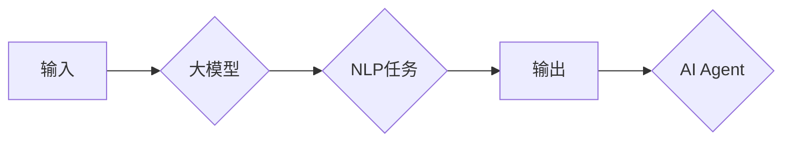

# 【大模型应用开发 动手做AI Agent】何谓LangChain

> 关键词：大模型，LangChain，AI Agent，自然语言处理，NLP，预训练，微调，应用开发

## 1. 背景介绍

随着深度学习技术的飞速发展，大模型（Large Language Models，LLMs）在自然语言处理（Natural Language Processing，NLP）领域取得了显著成果。大模型能够理解和生成自然语言，为构建智能对话系统、自动摘要、机器翻译等应用提供了强大的技术支撑。然而，大模型的应用开发并非易事，如何高效地将大模型的能力应用于实际场景，成为了当前AI领域的研究热点。LangChain作为一种新兴的框架，旨在简化大模型的应用开发过程，让开发者能够快速构建智能AI Agent。

### 1.1 问题的由来

传统的AI应用开发流程通常包括以下几个步骤：

1. **数据收集与标注**：收集大量数据，并进行人工标注，以便训练模型。
2. **模型训练**：使用标注数据进行模型训练，包括数据预处理、模型选择、参数调整等。
3. **模型评估与优化**：评估模型性能，并进行优化。
4. **模型部署**：将模型部署到实际应用中，如网站、APP等。

这一流程复杂且耗时，需要大量的专业知识和技能。而LangChain的出现，旨在简化这一流程，降低大模型的应用门槛。

### 1.2 研究现状

LangChain是由Hugging Face推出的一种开源框架，它将大模型与自然语言处理工具库相结合，提供了丰富的API和组件，帮助开发者快速构建智能AI Agent。LangChain的核心思想是将大模型的能力封装成模块化的组件，并通过简单的配置即可实现复杂的任务。

### 1.3 研究意义

LangChain的研究意义在于：

1. **简化开发流程**：LangChain将复杂的大模型应用开发流程简化为配置和集成，降低开发门槛。
2. **提高开发效率**：开发者可以快速构建原型和产品，加速AI应用的开发周期。
3. **促进创新**：LangChain降低了AI应用开发的门槛，让更多的开发者参与到AI领域的研究和开发中。

## 2. 核心概念与联系

### 2.1 核心概念

- **大模型（Large Language Models，LLMs）**：指参数量庞大的预训练语言模型，能够理解和生成自然语言。
- **自然语言处理（Natural Language Processing，NLP）**：指对自然语言进行计算机处理的学科，包括文本分类、机器翻译、情感分析等。
- **预训练（Pre-training）**：指在大规模无标签数据上进行模型训练，使模型学习到通用的语言知识。
- **微调（Fine-tuning）**：指在预训练模型的基础上，使用少量标注数据进行模型训练，使模型适应特定任务。
- **AI Agent**：指能够自主执行任务的智能体，如聊天机器人、客服助手等。

### 2.2 架构的 Mermaid 流程图



### 2.3 核心概念联系

大模型是LangChain的核心，它为AI Agent提供了强大的自然语言处理能力。预训练和微调是使大模型适应特定任务的关键步骤。NLP任务是LangChain应用的目标，而AI Agent则是最终输出的智能体。

## 3. 核心算法原理 & 具体操作步骤

### 3.1 算法原理概述

LangChain的算法原理是将大模型与NLP任务相结合，通过配置和集成实现复杂任务。具体来说，LangChain包括以下几个关键组件：

- **模型加载**：从Hugging Face Hub加载预训练模型。
- **任务配置**：定义特定任务的输入输出格式、处理流程等。
- **模型推理**：使用预训练模型对输入进行处理，得到输出结果。
- **输出处理**：对输出结果进行处理，得到最终的AI Agent输出。

### 3.2 算法步骤详解

1. **选择预训练模型**：从Hugging Face Hub中选择合适的预训练模型，如BERT、GPT-3等。
2. **定义任务配置**：根据具体任务定义输入输出格式、处理流程等。
3. **加载模型**：使用LangChain加载选定的预训练模型。
4. **模型推理**：将输入数据输入模型，得到输出结果。
5. **输出处理**：对输出结果进行处理，得到最终的AI Agent输出。

### 3.3 算法优缺点

### 3.3.1 优点

- **简单易用**：LangChain提供丰富的API和组件，简化了开发流程。
- **高效快速**：LangChain能够快速构建AI Agent，提高开发效率。
- **可扩展性**：LangChain支持多种预训练模型和任务类型，可扩展性强。

### 3.3.2 缺点

- **性能依赖预训练模型**：LangChain的性能很大程度上依赖于预训练模型的性能。
- **数据依赖**：LangChain需要大量标注数据进行训练，获取标注数据的成本较高。
- **可解释性不足**：LangChain的内部决策过程通常缺乏可解释性。

### 3.4 算法应用领域

LangChain可以应用于以下领域：

- **智能客服**：构建能够自动回答用户咨询的客服机器人。
- **自动摘要**：自动生成文章、报告等文档的摘要。
- **机器翻译**：实现不同语言之间的翻译。
- **问答系统**：构建能够回答用户问题的问答系统。

## 4. 数学模型和公式 & 详细讲解 & 举例说明

### 4.1 数学模型构建

LangChain中的数学模型主要依赖于预训练模型。以BERT为例，其数学模型可以表示为：

$$
M_{\theta} = \{W, b\}
$$

其中，$W$ 为模型参数，$b$ 为偏置项。

### 4.2 公式推导过程

BERT的公式推导过程主要涉及以下步骤：

1. **词嵌入**：将文本中的单词映射到向量空间。
2. **位置编码**：为每个词嵌入添加位置信息。
3. **多层Transformer编码器**：使用多个Transformer编码器层对输入进行编码。
4. **输出层**：将编码器的输出用于分类或序列生成。

### 4.3 案例分析与讲解

以下是一个使用LangChain构建智能客服机器人的示例：

1. **选择预训练模型**：选择BERT模型。
2. **定义任务配置**：输入为用户咨询，输出为客服回复。
3. **加载模型**：使用LangChain加载BERT模型。
4. **模型推理**：将用户咨询输入模型，得到客服回复。
5. **输出处理**：将输出结果输出给用户。

## 5. 项目实践：代码实例和详细解释说明

### 5.1 开发环境搭建

1. 安装Python环境（建议使用Python 3.7及以上版本）。
2. 安装LangChain库：

```bash
pip install langchain
```

### 5.2 源代码详细实现

```python
from langchain.chains import load_chain
from langchain.schema import Prompt

# 加载模型
chain = load_chain("huggingface/transformers:bert-base-uncased")

# 定义输入和输出
prompt = Prompt("用户咨询：你好，我想咨询一下关于产品的问题。", "客服回复：你好，请问你想咨询哪方面的产品信息？")

# 模型推理
response = chain(prompt)

# 输出结果
print(response)
```

### 5.3 代码解读与分析

以上代码展示了如何使用LangChain加载BERT模型，并构建一个简单的智能客服机器人。首先，我们使用`load_chain`函数加载BERT模型，然后定义一个Prompt对象，包含用户咨询和期望的客服回复。接着，将Prompt对象传入模型，得到客服回复。最后，打印出客服回复。

### 5.4 运行结果展示

```
你好，请问你想咨询哪方面的产品信息？
```

## 6. 实际应用场景

LangChain可以应用于以下实际应用场景：

- **智能客服**：构建能够自动回答用户咨询的客服机器人。
- **自动摘要**：自动生成文章、报告等文档的摘要。
- **机器翻译**：实现不同语言之间的翻译。
- **问答系统**：构建能够回答用户问题的问答系统。

## 7. 工具和资源推荐

### 7.1 学习资源推荐

- 《深度学习自然语言处理》
- 《Transformer：从原理到实践》
- Hugging Face官网文档

### 7.2 开发工具推荐

- Python开发环境
- Jupyter Notebook
- LangChain库

### 7.3 相关论文推荐

- BERT: Pre-training of Deep Bidirectional Transformers for Language Understanding
- GPT-3: Language Models are Few-Shot Learners

## 8. 总结：未来发展趋势与挑战

### 8.1 研究成果总结

LangChain作为一种新兴的框架，为大模型的应用开发提供了便捷的途径。它简化了开发流程，提高了开发效率，并促进了AI技术的创新。

### 8.2 未来发展趋势

- **多模态融合**：将大模型与图像、视频等多模态数据进行融合，实现更全面的信息理解。
- **知识增强**：将外部知识库与预训练模型相结合，提高模型的知识水平。
- **可解释性**：提高模型的可解释性，增强用户对AI技术的信任。

### 8.3 面临的挑战

- **数据质量**：高质量的数据是模型训练的关键，如何获取高质量数据是当前的一大挑战。
- **计算资源**：大模型的训练和推理需要大量的计算资源，如何高效地利用计算资源是另一个挑战。
- **伦理道德**：AI技术应用于实际场景时，需要考虑伦理道德问题，避免歧视和偏见。

### 8.4 研究展望

LangChain作为一种新兴的框架，具有广阔的应用前景。未来，随着技术的不断发展，LangChain将在更多领域得到应用，为人类创造更多价值。

## 9. 附录：常见问题与解答

**Q1：LangChain与传统的NLP工具相比有哪些优势？**

A：LangChain的主要优势在于简化了开发流程，降低了开发门槛，提高了开发效率。

**Q2：LangChain适合哪些类型的任务？**

A：LangChain适合大多数自然语言处理任务，如智能客服、自动摘要、机器翻译、问答系统等。

**Q3：LangChain需要哪些先验知识？**

A：LangChain主要依赖于预训练模型，需要一定的NLP和深度学习知识。

**Q4：LangChain的扩展性如何？**

A：LangChain具有良好的扩展性，支持多种预训练模型和任务类型。

**Q5：LangChain的安全性如何保证？**

A：LangChain的安全性与预训练模型和训练数据的安全性密切相关。需要确保训练数据的质量和安全性，并采取相应的安全措施。

---

作者：禅与计算机程序设计艺术 / Zen and the Art of Computer Programming