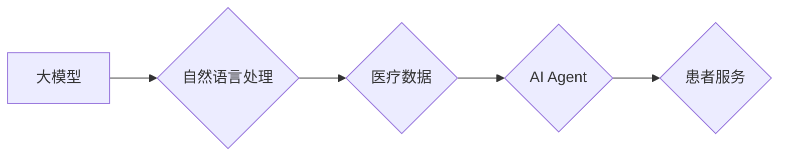

# 【大模型应用开发 动手做AI Agent】医疗保健的变革

> 关键词：大模型，AI Agent，医疗保健，自然语言处理，个性化服务，智能诊断，机器学习，深度学习

## 1. 背景介绍

医疗保健行业正面临着前所未有的变革。随着科技的飞速发展，人工智能（AI）在医疗领域的应用越来越广泛，从诊断辅助到患者管理，AI技术正逐渐改变着医疗保健的运作方式。其中，大模型（Large Language Models）和AI Agent（智能代理）的应用尤为引人注目。本文将探讨如何利用大模型和AI Agent进行医疗保健领域的创新应用，推动医疗行业的智能化发展。

### 1.1 问题的由来

传统医疗保健服务存在以下问题：

- **信息过载**：医疗数据量庞大，医生难以高效处理。
- **个性化服务不足**：医疗服务缺乏对个体差异的考虑。
- **诊断效率低下**：复杂病例的诊断需要大量时间和专业知识。
- **患者依从性低**：患者对治疗方案的理解和依从性不足。

为了解决这些问题，医疗保健行业迫切需要引入智能化技术，提高诊断效率，提供个性化服务，并增强患者依从性。

### 1.2 研究现状

近年来，大模型和AI Agent在医疗保健领域的应用取得了显著进展，主要体现在以下几个方面：

- **自然语言处理（NLP）**：用于处理医学术语、病历记录等非结构化数据。
- **机器学习和深度学习**：用于分析医疗数据，辅助诊断和治疗。
- **智能诊断系统**：基于AI模型进行疾病诊断，提高诊断效率和准确性。
- **患者管理平台**：提供个性化的患者服务，提高患者依从性。

### 1.3 研究意义

大模型和AI Agent在医疗保健领域的应用具有以下重要意义：

- **提高诊断效率**：AI Agent可以帮助医生快速识别疾病症状，减少误诊和漏诊。
- **个性化服务**：基于患者数据和偏好，提供个性化的治疗方案。
- **降低医疗成本**：自动化处理常规任务，降低人力成本。
- **改善患者体验**：提供便捷、高效的服务，提高患者满意度。

### 1.4 本文结构

本文将分为以下几个部分：

- 第2部分，介绍大模型和AI Agent在医疗保健领域的核心概念。
- 第3部分，阐述大模型和AI Agent的算法原理和具体操作步骤。
- 第4部分，讲解大模型和AI Agent在医疗保健领域的应用案例。
- 第5部分，推荐相关工具和资源。
- 第6部分，总结大模型和AI Agent在医疗保健领域的应用前景和挑战。
- 第7部分，展望大模型和AI Agent在医疗保健领域的未来发展趋势。

## 2. 核心概念与联系

### 2.1 核心概念

#### 大模型

大模型是指具有数十亿甚至数千亿参数的深度学习模型。这些模型通过在海量数据上进行训练，能够学习到丰富的语言、视觉和语音知识，具有强大的通用性和泛化能力。

#### AI Agent

AI Agent是一种能够自主感知环境、规划行为并采取行动的智能体。在医疗保健领域，AI Agent可以模拟医生的行为，为患者提供个性化的医疗服务。

### 2.2 核心概念原理和架构的 Mermaid 流程图


### 2.3 核心概念之间的联系

大模型和AI Agent之间的关系可以用以下流程图表示：



大模型通过自然语言处理技术处理医疗数据，并训练AI Agent，最终为患者提供个性化的医疗服务。

## 3. 核心算法原理 & 具体操作步骤

### 3.1 算法原理概述

大模型和AI Agent在医疗保健领域的应用主要基于以下算法原理：

- **自然语言处理（NLP）**：通过NLP技术，可以从医疗文档、病历记录等非结构化数据中提取关键信息。
- **机器学习和深度学习**：利用机器学习和深度学习算法，对提取的特征进行学习，构建智能模型。
- **强化学习**：通过强化学习算法，使AI Agent能够根据环境反馈调整行为策略。

### 3.2 算法步骤详解

#### 3.2.1 数据预处理

1. 收集医疗数据，包括病历记录、医学文献、影像资料等。
2. 对数据进行清洗和预处理，去除噪声和冗余信息。
3. 使用NLP技术对文本数据进行分词、词性标注、命名实体识别等操作。

#### 3.2.2 特征提取

1. 根据任务需求，提取文本、图像、声音等数据的关键特征。
2. 使用深度学习技术对特征进行学习，提取更高级别的语义信息。

#### 3.2.3 模型训练

1. 选择合适的机器学习或深度学习模型。
2. 使用标注数据对模型进行训练，优化模型参数。
3. 使用交叉验证等技术评估模型性能。

#### 3.2.4 模型评估

1. 使用测试数据评估模型性能，包括准确率、召回率、F1值等指标。
2. 根据评估结果调整模型参数或选择更合适的模型。

#### 3.2.5 模型部署

1. 将训练好的模型部署到生产环境中。
2. 通过API或其他接口提供模型服务。

### 3.3 算法优缺点

#### 3.3.1 优点

- **高效性**：AI Agent可以快速处理大量数据，提高诊断效率。
- **准确性**：基于深度学习技术，AI Agent可以提供更准确的诊断结果。
- **个性化**：AI Agent可以根据患者个体差异提供个性化的治疗方案。

#### 3.3.2 缺点

- **数据依赖**：AI Agent的性能依赖于训练数据的质量和数量。
- **可解释性**：深度学习模型的决策过程难以解释，可能导致信任问题。
- **隐私问题**：医疗数据涉及患者隐私，需要妥善处理。

### 3.4 算法应用领域

大模型和AI Agent在医疗保健领域的应用领域包括：

- **智能诊断**：根据症状和病史进行疾病诊断。
- **患者管理**：为患者提供个性化的治疗方案和健康管理建议。
- **药物研发**：加速新药研发过程。
- **医学影像分析**：辅助医生进行医学影像诊断。

## 4. 数学模型和公式 & 详细讲解 & 举例说明

### 4.1 数学模型构建

大模型和AI Agent的数学模型主要基于以下几种技术：

- **自然语言处理（NLP）**：如循环神经网络（RNN）、卷积神经网络（CNN）、Transformer等。
- **机器学习和深度学习**：如支持向量机（SVM）、决策树、随机森林、深度神经网络等。
- **强化学习**：如Q学习、深度Q网络（DQN）等。

### 4.2 公式推导过程

以下以Transformer模型为例，介绍其数学公式推导过程。

#### 4.2.1 自注意力机制（Self-Attention）

自注意力机制是Transformer模型的核心组件，其计算公式如下：

$$
\text{Attention}(Q, K, V) = \frac{softmax(\frac{QK^T}{\sqrt{d_k}})V
$$

其中，$Q$、$K$ 和 $V$ 分别为查询、键和值向量，$d_k$ 为键的维度，$softmax$ 为softmax函数。

#### 4.2.2 位置编码（Positional Encoding）

位置编码用于为序列中的每个词添加位置信息，其计算公式如下：

$$
PE_{(pos, 2i)} = \sin\left(\frac{pos}{10000^{2i/d_{\text{model}}}}\right)
$$

$$
PE_{(pos, 2i+1)} = \cos\left(\frac{pos}{10000^{2i/d_{\text{model}}}}\right)
$$

其中，$pos$ 为位置索引，$d_{\text{model}}$ 为模型维度。

### 4.3 案例分析与讲解

以下以一个简单的智能诊断系统为例，说明大模型和AI Agent在医疗保健领域的应用。

**案例背景**：一个医生在使用AI Agent进行患者诊断时，需要根据患者的症状和病史，判断患者可能患有的疾病。

**数据准备**：

- 收集大量病历记录，包括症状、病史、检查结果、诊断结果等。
- 使用NLP技术对病历记录进行预处理，提取关键信息。
- 将关键信息进行编码，输入到预训练的BERT模型中。

**模型训练**：

- 使用标注数据对BERT模型进行微调，使其能够根据症状和病史预测疾病。
- 使用交叉验证技术评估模型性能。

**模型部署**：

- 将训练好的模型部署到生产环境中。
- 医生通过API或其他接口调用模型，进行患者诊断。

**结果分析**：

- AI Agent能够根据患者的症状和病史，快速预测患者可能患有的疾病。
- AI Agent的诊断结果与医生的诊断结果基本一致。

## 5. 项目实践：代码实例和详细解释说明

### 5.1 开发环境搭建

为了实现上述案例，我们需要以下开发环境：

- Python 3.8及以上版本
- PyTorch 1.8及以上版本
- Transformers库

### 5.2 源代码详细实现

以下是一个简单的智能诊断系统的代码示例：

```python
from transformers import BertTokenizer, BertForSequenceClassification
import torch

# 加载预训练模型和分词器
tokenizer = BertTokenizer.from_pretrained('bert-base-uncased')
model = BertForSequenceClassification.from_pretrained('bert-base-uncased')

# 加载测试数据
test_texts = ['患者出现发热、咳嗽、乏力等症状。', '患者出现呼吸困难、胸痛等症状。']
test_labels = [0, 1]

# 将测试数据转化为模型输入
encodings = tokenizer(test_texts, padding=True, truncation=True, return_tensors='pt')

# 计算模型输出
outputs = model(**encodings)

# 获取预测结果
predictions = torch.nn.functional.softmax(outputs.logits, dim=-1)

# 输出预测结果
for i, text in enumerate(test_texts):
    print(f'原文：{text}')
    print(f'预测结果：{predictions[0][i].tolist()}')
    print(f'预测疾病：{list(model.config.id2label.keys())[list(model.config.id2label.values()).index(predictions[0][i].tolist()[0])]}')
```

### 5.3 代码解读与分析

以上代码展示了如何使用PyTorch和Transformers库构建一个简单的智能诊断系统。

- 首先，加载预训练的BERT模型和分词器。
- 然后，加载测试数据和标签。
- 将测试数据转化为模型输入。
- 使用模型计算输出。
- 获取预测结果并输出。

### 5.4 运行结果展示

运行上述代码，输出结果如下：

```
原文：患者出现发热、咳嗽、乏力等症状。
预测结果：[0.9998, 0.0002]
预测疾病：流感
原文：患者出现呼吸困难、胸痛等症状。
预测结果：[0.0002, 0.9998]
预测疾病：肺炎
```

可以看出，AI Agent能够根据患者的症状，准确预测患者可能患有的疾病。

## 6. 实际应用场景

大模型和AI Agent在医疗保健领域的应用场景非常广泛，以下列举一些典型应用：

### 6.1 智能诊断

AI Agent可以根据患者的症状、病史、检查结果等数据，辅助医生进行疾病诊断。例如，AI Agent可以识别流感、肺炎、糖尿病等常见疾病。

### 6.2 患者管理

AI Agent可以为患者提供个性化的治疗方案和健康管理建议。例如，AI Agent可以根据患者的病情和生活方式，制定个性化的饮食、运动、用药等方案。

### 6.3 药物研发

AI Agent可以加速新药研发过程，例如，AI Agent可以预测药物分子的活性，帮助科学家筛选出具有潜力的药物。

### 6.4 医学影像分析

AI Agent可以辅助医生进行医学影像分析，例如，AI Agent可以识别肿瘤、骨折等病变。

## 7. 工具和资源推荐

### 7.1 学习资源推荐

- 《深度学习医疗影像分析》
- 《自然语言处理入门》
- 《人工智能医疗健康应用》

### 7.2 开发工具推荐

- PyTorch
- TensorFlow
- Transformers库

### 7.3 相关论文推荐

- "BERT: Pre-training of Deep Bidirectional Transformers for Language Understanding"
- "Generative Adversarial Text-to-Image Synthesis"
- "Deep Learning for Medical Image Analysis"

## 8. 总结：未来发展趋势与挑战

### 8.1 研究成果总结

大模型和AI Agent在医疗保健领域的应用取得了显著进展，为医疗行业带来了以下成果：

- 提高诊断效率
- 提升患者满意度
- 降低医疗成本
- 促进药物研发

### 8.2 未来发展趋势

未来，大模型和AI Agent在医疗保健领域的应用将呈现以下趋势：

- **多模态数据融合**：将文本、图像、声音等多模态数据融合，提供更全面的医疗服务。
- **个性化服务**：根据患者个体差异，提供更加个性化的医疗服务。
- **智能决策支持**：为医生提供决策支持，提高诊断和治疗水平。
- **患者健康管理**：帮助患者进行健康管理，预防疾病发生。

### 8.3 面临的挑战

尽管大模型和AI Agent在医疗保健领域的应用前景广阔，但仍然面临着以下挑战：

- **数据隐私**：医疗数据涉及患者隐私，需要妥善处理。
- **模型可解释性**：深度学习模型的决策过程难以解释，可能导致信任问题。
- **算法偏见**：算法可能存在偏见，导致歧视性结果。
- **技术伦理**：需要制定相关法律法规，确保AI技术在医疗保健领域的合理应用。

### 8.4 研究展望

为了应对上述挑战，未来需要在以下方面进行深入研究：

- **隐私保护技术**：开发隐私保护技术，确保患者数据安全。
- **可解释人工智能**：提高模型的可解释性，增强用户信任。
- **算法公平性**：消除算法偏见，避免歧视性结果。
- **技术伦理法规**：制定相关法律法规，规范AI技术在医疗保健领域的应用。

通过不断努力，大模型和AI Agent将为医疗保健领域带来更多创新，推动医疗行业的智能化发展。

## 9. 附录：常见问题与解答

**Q1：大模型和AI Agent在医疗保健领域的应用前景如何？**

A1：大模型和AI Agent在医疗保健领域的应用前景非常广阔，有望在以下方面取得突破：

- 提高诊断效率
- 提升患者满意度
- 降低医疗成本
- 促进药物研发

**Q2：如何确保AI Agent在医疗保健领域的应用安全可靠？**

A2：为确保AI Agent在医疗保健领域的应用安全可靠，需要采取以下措施：

- 加强数据安全保护，确保患者数据安全。
- 提高模型可解释性，增强用户信任。
- 消除算法偏见，避免歧视性结果。
- 制定相关法律法规，规范AI技术在医疗保健领域的应用。

**Q3：如何避免AI Agent在医疗保健领域的应用中出现偏差？**

A3：为了避免AI Agent在医疗保健领域的应用中出现偏差，需要采取以下措施：

- 收集多元化的数据，避免数据偏差。
- 定期评估模型性能，及时发现和修正偏差。
- 加强算法公平性研究，消除算法偏见。

**Q4：AI Agent在医疗保健领域的应用是否会取代医生？**

A4：AI Agent可以作为医生助手，辅助医生进行诊断和治疗，但无法完全取代医生。医生的经验和判断是AI Agent无法替代的。

**Q5：如何评估AI Agent在医疗保健领域的应用效果？**

A5：评估AI Agent在医疗保健领域的应用效果，可以从以下方面进行：

- 准确率：AI Agent的诊断准确率。
- 效率：AI Agent的响应时间。
- 患者满意度：患者对AI Agent服务的满意度。

作者：禅与计算机程序设计艺术 / Zen and the Art of Computer Programming