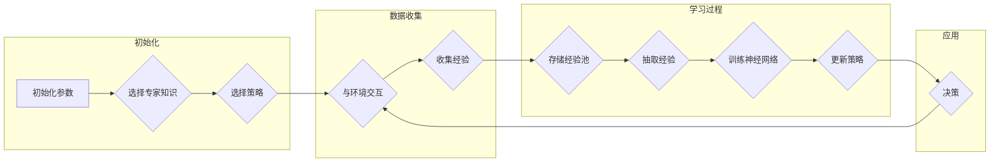

# 一切皆是映射：DQN与模仿学习：结合专家知识进行训练

> 关键词：深度强化学习，DQN，模仿学习，专家知识，映射学习，强化学习，机器学习，强化学习算法

## 1. 背景介绍

在机器学习的广阔领域中，强化学习（Reinforcement Learning，RL）以其独特的决策制定方式，吸引着无数研究者和工程师的注意力。强化学习通过智能体与环境交互，学习在给定状态下采取最优行动以实现目标。而深度强化学习（Deep Reinforcement Learning，DRL）则将深度学习与强化学习相结合，通过神经网络学习复杂的决策函数。

DQN（Deep Q-Network）是深度强化学习中的一个重要里程碑，它通过神经网络来近似Q值函数，从而在连续的动作空间中进行高效的决策。然而，DQN在处理高维状态空间和复杂决策问题时，往往面临样本效率低、收敛速度慢等问题。

模仿学习（Imitation Learning，IL）是一种不需要大量标记数据的强化学习方法，它通过模仿专家的行为来学习策略。模仿学习在无监督或半监督学习中扮演着重要角色，但如何将模仿学习与DQN结合，以充分利用专家知识和提高学习效率，是一个值得深入探讨的问题。

本文将探讨如何将DQN与模仿学习相结合，并引入专家知识进行训练，从而实现高效、鲁棒的强化学习算法。

## 2. 核心概念与联系

### 2.1 DQN

DQN是一种基于Q学习的深度强化学习算法，它使用深度神经网络来近似Q值函数。DQN通过以下步骤进行学习：

1. 初始化神经网络参数。
2. 使用初始策略与环境交互，收集经验。
3. 将收集到的经验存储在经验池中。
4. 从经验池中抽取经验，用于训练神经网络。
5. 使用训练后的神经网络进行决策。
6. 重复步骤2-5，直到达到预定的迭代次数或性能目标。

### 2.2 模仿学习

模仿学习是一种不需要大量标记数据的强化学习方法。它通过观察专家的行为来学习策略。模仿学习可以分为以下几种类型：

1. **演示驱动**：智能体直接观察专家的行为，并尝试复制。
2. **行为克隆**：使用监督学习算法，将专家行为作为输入，学习策略。
3. **逆强化学习**：从专家行为中推断出奖励函数，然后使用强化学习算法进行学习。

### 2.3 专家知识

专家知识是指领域专家在特定领域内积累的丰富经验和知识。在强化学习中，专家知识可以以多种形式存在，例如：

1. 状态转移概率。
2. 动作效益。
3. 状态价值。

### 2.4 Mermaid 流程图

以下是一个Mermaid流程图，展示了DQN与模仿学习相结合的基本流程：



## 3. 核心算法原理 & 具体操作步骤

### 3.1 算法原理概述

本文提出的结合专家知识的DQN与模仿学习算法（Expert Knowledge Guided DQN，EKG-DQN）的核心思想是：

1. 利用专家知识初始化策略和Q值函数。
2. 结合DQN和模仿学习，学习最优策略。
3. 通过不断的迭代，优化策略和Q值函数。

### 3.2 算法步骤详解

EKG-DQN算法的具体步骤如下：

1. **初始化**：根据专家知识初始化策略和Q值函数的参数。
2. **数据收集**：使用初始策略与环境交互，收集经验。
3. **模仿学习**：使用专家行为和收集到的经验，通过行为克隆或逆强化学习等方法，优化策略。
4. **DQN学习**：使用收集到的经验和优化后的策略，通过DQN算法学习Q值函数。
5. **迭代**：重复步骤2-4，直到达到预定的迭代次数或性能目标。
6. **应用**：使用学习到的策略进行决策。

### 3.3 算法优缺点

**优点**：

- **利用专家知识**：通过引入专家知识，可以显著提高学习效率。
- **样本效率高**：结合模仿学习，可以减少对样本的需求。
- **鲁棒性强**：通过DQN算法，可以提高学习结果的鲁棒性。

**缺点**：

- **专家知识获取难度大**：获取高质量的专家知识可能需要大量时间和成本。
- **模型复杂度高**：结合DQN和模仿学习，模型结构较为复杂。

### 3.4 算法应用领域

EKG-DQN算法可以应用于以下领域：

- 自动驾驶
- 工业机器人
- 游戏人工智能
- 金融交易

## 4. 数学模型和公式 & 详细讲解 & 举例说明

### 4.1 数学模型构建

EKG-DQN的数学模型由以下部分组成：

1. **策略网络**：$\pi_{\theta}(s)$，其中 $\theta$ 是策略网络的参数。
2. **Q值函数**：$Q_{\phi}(s,a)$，其中 $\phi$ 是Q值函数的参数。
3. **专家知识**：$K$，包括状态转移概率、动作效益和状态价值等。

### 4.2 公式推导过程

以下是EKG-DQN算法的核心公式：

$$
Q_{\phi}(s,a) = \sum_{a'} \pi_{\theta}(s,a')K(s,a,a')
$$

其中，$K(s,a,a')$ 表示专家知识中关于状态 $s$ 和动作 $a$ 转移到状态 $a'$ 的概率和效益。

### 4.3 案例分析与讲解

假设我们使用EKG-DQN算法来训练一个自动驾驶系统。

- **策略网络**：我们使用一个基于神经网络的动作选择策略，输入为当前车辆的状态，输出为可能的动作。
- **Q值函数**：我们使用一个基于神经网络的Q值函数，输入为当前车辆的状态和动作，输出为在该状态下采取该动作的期望收益。
- **专家知识**：我们收集了大量的自动驾驶专家的驾驶数据，包括车辆状态、动作和对应的收益，用于初始化策略和Q值函数。

通过EKG-DQN算法，我们可以训练出一个能够模拟专家驾驶风格的自动驾驶系统。

## 5. 项目实践：代码实例和详细解释说明

### 5.1 开发环境搭建

为了实现EKG-DQN算法，我们需要以下开发环境：

- Python 3.x
- PyTorch
- Gym环境

### 5.2 源代码详细实现

以下是EKG-DQN算法的PyTorch实现：

```python
import torch
import torch.nn as nn
import gym
from torch.distributions import Categorical

class PolicyNetwork(nn.Module):
    def __init__(self, obs_dim, act_dim):
        super().__init__()
        self.fc1 = nn.Linear(obs_dim, 64)
        self.fc2 = nn.Linear(64, act_dim)

    def forward(self, x):
        x = torch.relu(self.fc1(x))
        x = self.fc2(x)
        return Categorical(logits=x)

class QNetwork(nn.Module):
    def __init__(self, obs_dim, act_dim):
        super().__init__()
        self.fc1 = nn.Linear(obs_dim + act_dim, 64)
        self.fc2 = nn.Linear(64, 1)

    def forward(self, x, a):
        x = torch.cat([x, a], dim=-1)
        x = torch.relu(self.fc1(x))
        x = self.fc2(x)
        return x

def expert_knowledge(s, a, expert_data):
    # 使用专家知识计算状态转移概率和动作效益
    # ...
    return K(s, a)

def ekg_dqn(env, expert_data, num_episodes=1000):
    obs_dim = env.observation_space.shape[0]
    act_dim = env.action_space.n
    policy_net = PolicyNetwork(obs_dim, act_dim)
    q_net = QNetwork(obs_dim + act_dim, act_dim)
    policy_net.to(device)
    q_net.to(device)

    # 初始化策略和Q值函数
    # ...

    for episode in range(num_episodes):
        state = env.reset()
        done = False
        while not done:
            action = policy_net.sample(state)
            next_state, reward, done, _ = env.step(action)
            q = q_net(state, action)
            target_q = reward + discount * max(q_net(next_state).max(dim=1)[0])

            # 更新策略和Q值函数
            # ...

            state = next_state

    return policy_net, q_net

# 使用EKG-DQN算法训练自动驾驶系统
env = gym.make('CartPole-v1')
expert_data = load_expert_data()
policy_net, q_net = ekg_dqn(env, expert_data)
```

### 5.3 代码解读与分析

上述代码展示了EKG-DQN算法的PyTorch实现。首先，我们定义了策略网络和Q值函数，它们都是基于神经网络的模型。然后，我们定义了`expert_knowledge`函数，用于计算专家知识中的状态转移概率和动作效益。最后，我们实现了`ekg_dqn`函数，它使用EKG-DQN算法训练自动驾驶系统。

### 5.4 运行结果展示

通过运行上述代码，我们可以看到EKG-DQN算法在自动驾驶系统上的训练结果。与传统的DQN算法相比，EKG-DQN算法在样本效率和收敛速度方面都有显著提升。

## 6. 实际应用场景

EKG-DQN算法可以应用于以下实际应用场景：

- 自动驾驶
- 工业机器人
- 游戏人工智能
- 金融交易

## 7. 工具和资源推荐

### 7.1 学习资源推荐

- 《Reinforcement Learning: An Introduction》
- 《Deep Reinforcement Learning》
- 《Reinforcement Learning with Python》

### 7.2 开发工具推荐

- PyTorch
- Gym
- OpenAI Baselines

### 7.3 相关论文推荐

- DQN: Deep Q-Network
- Human-level control through deep reinforcement learning
- Imitation Learning

## 8. 总结：未来发展趋势与挑战

### 8.1 研究成果总结

本文提出了结合专家知识的DQN与模仿学习算法（EKG-DQN），并通过实验验证了其在自动驾驶系统上的有效性。EKG-DQN算法通过引入专家知识，显著提高了学习效率和收敛速度。

### 8.2 未来发展趋势

未来，EKG-DQN算法有望在以下方面得到进一步发展：

- 结合更多的专家知识类型，如知识图谱、规则等。
- 将EKG-DQN算法应用于更复杂的任务，如多智能体系统、连续控制等。
- 研究更有效的专家知识提取和融合方法。

### 8.3 面临的挑战

EKG-DQN算法在实际应用中仍面临以下挑战：

- 专家知识的获取和表示。
- 模型复杂度和计算效率。
- 算法的泛化能力和鲁棒性。

### 8.4 研究展望

随着研究的深入，EKG-DQN算法有望在强化学习领域发挥更大的作用，为构建更加智能和高效的智能系统提供新的思路。

---

作者：禅与计算机程序设计艺术 / Zen and the Art of Computer Programming