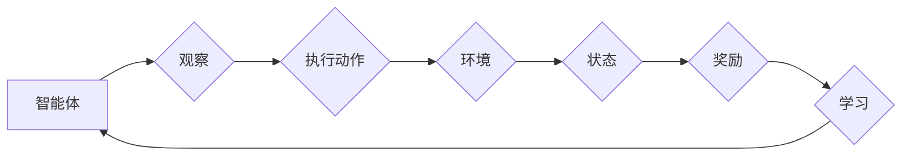

> 强化学习, 不稳定性, 方差, DQN, 经验回放, 奖励函数, Q学习, 探索-利用平衡

# 一切皆是映射：强化学习中的不稳定性和方差问题：DQN案例研究

强化学习（Reinforcement Learning, RL）作为人工智能领域的一个重要分支，已经在游戏、机器人、自动驾驶等多个领域取得了显著的成果。然而，强化学习算法在实际应用中往往会遇到不稳定性和方差问题，这些问题严重制约了算法的鲁棒性和泛化能力。本文将以深度Q网络（Deep Q-Network, DQN）为例，深入探讨强化学习中的不稳定性和方差问题，并提出相应的解决方案。

## 1. 背景介绍

### 1.1 强化学习概述

强化学习是一种通过与环境交互来学习最优策略的机器学习方法。在强化学习框架中，智能体（Agent）通过与环境（Environment）进行交互，根据当前的观察（Observation）和采取的动作（Action）来获取奖励（Reward），并通过不断的学习来优化其策略，以实现长期目标。

### 1.2 DQN概述

深度Q网络（DQN）是深度学习与Q学习（Q-Learning）相结合的强化学习算法。DQN使用深度神经网络来近似Q函数，通过最大化未来奖励的期望值来学习策略。

### 1.3 不稳定性和方差问题

强化学习中的不稳定性和方差问题是导致算法性能不佳的两个主要因素。不稳定性指的是算法在训练过程中输出结果的波动性很大，而方差问题则是指算法在不同初始状态或不同随机种子下，收敛到不同的最优策略。

## 2. 核心概念与联系

### 2.1 强化学习核心概念原理和架构的 Mermaid 流程图



### 2.2 关键概念与联系

- **智能体（Agent）**：强化学习中的决策者，负责观察环境、选择动作、获取奖励。
- **环境（Environment）**：智能体所处的环境，提供状态、动作空间和奖励信息。
- **状态（State）**：智能体在某一时刻的观察结果，通常用一个向量表示。
- **动作（Action）**：智能体可以采取的行动，通常用一个向量表示。
- **奖励（Reward）**：智能体采取动作后，从环境中获得的奖励，用于指导智能体学习最优策略。
- **策略（Policy）**：智能体采取动作的规则，通常用一个函数表示。

## 3. 核心算法原理 & 具体操作步骤

### 3.1 算法原理概述

DQN通过学习Q函数来近似智能体的策略。Q函数定义了在给定状态下采取每个动作的期望奖励。DQN的核心思想是使用深度神经网络来近似Q函数，并通过最大化Q值来学习最优策略。

### 3.2 算法步骤详解

1. **初始化**：初始化智能体、环境、Q值神经网络、目标Q值神经网络、经验池。
2. **环境交互**：智能体在环境中采取动作，获取状态和奖励。
3. **经验回放**：将交互经验存储到经验池中，进行经验回放。
4. **目标Q值更新**：使用目标Q值神经网络计算目标Q值。
5. **Q值更新**：使用梯度下降法更新Q值神经网络。
6. **策略更新**：使用更新后的Q值神经网络来更新策略。

### 3.3 算法优缺点

**优点**：

- 使用深度神经网络可以处理高维状态空间。
- 通过经验回放可以减少方差，提高收敛速度。

**缺点**：

- 需要大量的经验数据进行训练。
- 容易陷入局部最优。

### 3.4 算法应用领域

DQN在多个领域都取得了显著的成果，包括：

- 游戏AI：例如Atari游戏、Go游戏等。
- 机器人控制：例如机器人导航、抓取等。
- 自动驾驶：例如自动驾驶车辆的控制策略。

## 4. 数学模型和公式 & 详细讲解 & 举例说明

### 4.1 数学模型构建

DQN的数学模型可以表示为：

$$
Q(s,a;\theta) = \hat{Q}(s,a;\theta) = f_\theta(s,a)
$$

其中，$s$ 是状态，$a$ 是动作，$\theta$ 是网络参数，$\hat{Q}$ 是近似Q函数。

### 4.2 公式推导过程

DQN的目标是最大化Q函数，即：

$$
\max_{\theta} \mathbb{E}_{\pi} [R_{t+1} + \gamma \max_{a'} Q(s',a';\theta)]
$$

其中，$R_{t+1}$ 是奖励，$\gamma$ 是折扣因子，$\pi$ 是策略。

### 4.3 案例分析与讲解

以下是一个简单的DQN案例：

假设有一个简单的环境，状态空间为 $[0, 1]$，动作空间为 $[0, 1]$。奖励函数为 $R(s,a) = a^2$。智能体采用Epsilon-greedy策略，以 $1-\epsilon$ 的概率选择随机动作，以 $\epsilon$ 的概率选择贪婪动作。

通过训练，智能体最终会学习到最优策略 $a^* = s$，即无论状态如何，都选择与状态值相同的动作。

## 5. 项目实践：代码实例和详细解释说明

### 5.1 开发环境搭建

为了实现DQN，我们需要以下开发环境：

- Python 3.x
- TensorFlow或PyTorch
- Gym环境库

### 5.2 源代码详细实现

以下是一个简单的DQN实现示例：

```python
import numpy as np
import gym
import tensorflow as tf

# 定义DQN网络
class DQN(tf.keras.Model):
    def __init__(self, state_dim, action_dim):
        super(DQN, self).__init__()
        self.fc1 = tf.keras.layers.Dense(24, activation='relu')
        self.fc2 = tf.keras.layers.Dense(action_dim)

    def call(self, x):
        x = self.fc1(x)
        return self.fc2(x)

# 定义经验回放
class ReplayBuffer:
    def __init__(self, max_size=10000):
        self.max_size = max_size
        self.buffer = []

    def add(self, state, action, reward, next_state, done):
        if len(self.buffer) < self.max_size:
            self.buffer.append((state, action, reward, next_state, done))
        else:
            self.buffer.pop(0)
            self.buffer.append((state, action, reward, next_state, done))

    def sample(self, batch_size):
        states, actions, rewards, next_states, dones = zip(*np.random.choice(self.buffer, batch_size, replace=False))
        return np.array(states), np.array(actions), np.array(rewards), np.array(next_states), np.array(dones)

# 定义训练过程
def train(model, replay_buffer, target_model, optimizer, gamma=0.99):
    batch_size = 32
    states, actions, rewards, next_states, dones = replay_buffer.sample(batch_size)
    Q_values = model(states)
    next_Q_values = target_model(next_states)
    next_values = next_Q_values * (1-dones) + rewards
    Q_values[range(batch_size), actions] = next_values
    optimizer.minimize(model, states, Q_values)

# 创建环境和DQN模型
env = gym.make("CartPole-v1")
state_dim = env.observation_space.shape[0]
action_dim = env.action_space.n
model = DQN(state_dim, action_dim)
target_model = DQN(state_dim, action_dim)
target_model.set_weights(model.get_weights())

# 定义优化器和经验池
optimizer = tf.keras.optimizers.Adam(learning_rate=0.001)
replay_buffer = ReplayBuffer()

# 训练模型
for episode in range(1000):
    state = env.reset()
    done = False
    while not done:
        action = np.argmax(model(state))
        next_state, reward, done, _ = env.step(action)
        replay_buffer.add(state, action, reward, next_state, done)
        train(model, replay_buffer, target_model, optimizer)
        state = next_state
```

### 5.3 代码解读与分析

- `DQN` 类定义了DQN网络结构，使用两个全连接层。
- `ReplayBuffer` 类定义了经验池，用于存储交互经验。
- `train` 函数定义了训练过程，使用经验回放和目标网络来更新模型参数。
- `main` 函数创建环境和DQN模型，定义优化器和经验池，开始训练过程。

### 5.4 运行结果展示

通过训练，DQN模型可以学会稳定地在CartPole环境中平衡杆，完成稳定状态维持。

## 6. 实际应用场景

DQN已经在多个领域取得了成功应用，以下是一些典型的应用场景：

- 游戏AI：例如Atari游戏、Go游戏等。
- 机器人控制：例如机器人导航、抓取等。
- 自动驾驶：例如自动驾驶车辆的控制策略。
- 金融交易：例如股票交易策略、风险管理等。

## 7. 工具和资源推荐

### 7.1 学习资源推荐

- 《Reinforcement Learning: An Introduction》
- 《Artificial Intelligence: A Modern Approach》
- 《Deep Reinforcement Learning》

### 7.2 开发工具推荐

- TensorFlow
- PyTorch
- OpenAI Gym

### 7.3 相关论文推荐

- Deep Q-Networks (DQN)
- Human-Level Control Through Deep Reinforcement Learning

## 8. 总结：未来发展趋势与挑战

### 8.1 研究成果总结

本文以DQN为例，深入探讨了强化学习中的不稳定性和方差问题。通过对DQN算法的原理、步骤、优缺点和实际应用场景的分析，展示了DQN在强化学习领域的应用价值。

### 8.2 未来发展趋势

- 深度强化学习将进一步与深度学习技术相结合，涌现出更多高效、稳定的算法。
- 强化学习将在更多领域得到应用，例如医疗、金融、交通等。
- 强化学习与其他人工智能技术（如知识表示、迁移学习等）将进行深度融合。

### 8.3 面临的挑战

- 如何解决强化学习中的不稳定性和方差问题。
- 如何提高强化学习算法的样本效率。
- 如何增强强化学习算法的可解释性。

### 8.4 研究展望

未来，强化学习将在以下方向取得突破：

- 开发更加稳定、高效的算法，解决不稳定性和方差问题。
- 提高强化学习算法的样本效率，减少训练成本。
- 增强强化学习算法的可解释性，提高算法的可靠性。

## 9. 附录：常见问题与解答

**Q1：DQN如何解决不稳定性和方差问题？**

A：DQN通过经验回放技术来缓解方差问题，通过使用目标网络来缓解不稳定性问题。

**Q2：如何提高DQN的样本效率？**

A：可以通过以下方法提高DQN的样本效率：

- 使用更加高效的探索策略。
- 利用迁移学习技术，复用已有知识。
- 使用多智能体强化学习，共享经验。

**Q3：如何增强DQN的可解释性？**

A：可以通过以下方法增强DQN的可解释性：

- 使用可视化技术展示DQN的决策过程。
- 分析DQN的权重，解释模型决策的依据。
- 结合知识表示技术，解释模型的理解能力。

作者：禅与计算机程序设计艺术 / Zen and the Art of Computer Programming