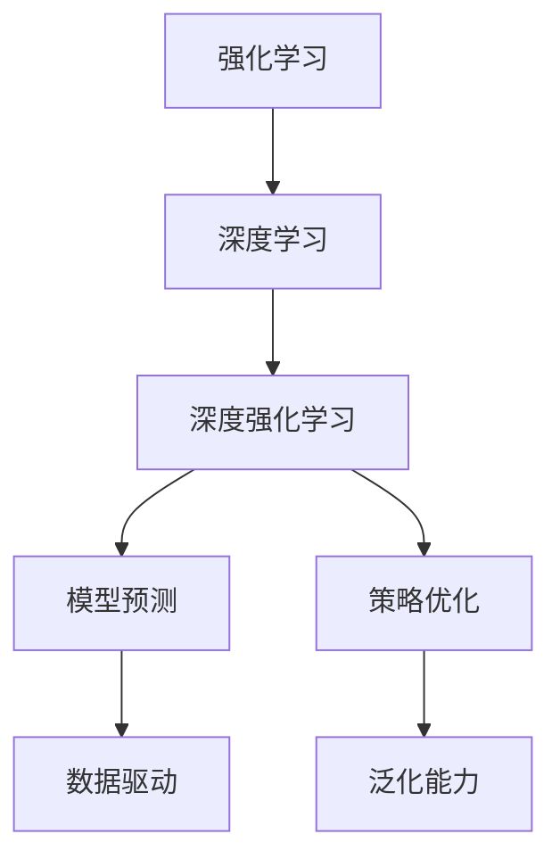

                 

# 一切皆是映射：强化学习基础及其与深度学习的结合

> 关键词：强化学习,深度学习,深度强化学习,深度学习基础,强化学习框架

## 1. 背景介绍

### 1.1 问题由来
在人工智能领域，强化学习（Reinforcement Learning, RL）与深度学习（Deep Learning, DL）是两个重要的研究方向。深度学习通过大量数据训练神经网络，发现特征表示，进而进行分类、回归等任务；而强化学习通过与环境的交互，通过奖励信号优化策略，完成复杂的决策任务。

然而，强化学习和深度学习的结合却是一个充满挑战的领域。如何将深度学习的网络结构与强化学习的策略优化相结合，同时有效地处理高维连续空间、复杂交互等问题，成为当前学术界和产业界研究的热点。本文将详细介绍强化学习的理论基础，探讨其与深度学习的结合方式，为读者提供深度强化学习的全面视角和实践指导。

### 1.2 问题核心关键点
本节将详细阐述强化学习的基本概念、理论基础以及与深度学习结合的关键点：

- **强化学习**：通过与环境交互，学习如何做出最优决策的学科。
- **深度强化学习**：将深度神经网络应用于强化学习，通过学习大规模数据中的复杂结构，提升决策策略的性能。
- **算法设计**：需要平衡模型复杂度和决策效率，同时确保算法的稳定性和可解释性。
- **框架构建**：需要设计有效的算法和数据结构，以实现高效、稳定的决策过程。
- **应用场景**：包括游戏智能、自动驾驶、机器人控制、自然语言处理等。

## 2. 核心概念与联系

### 2.1 核心概念概述

为更好地理解强化学习及其与深度学习的结合，本节将介绍几个关键概念：

- **强化学习**：通过与环境交互，根据奖励信号不断优化策略的学习框架。
- **深度学习**：通过大量数据训练深度神经网络，学习复杂特征表示的学科。
- **深度强化学习**：结合深度学习与强化学习的优势，以神经网络代替决策策略。
- **模型预测**：使用深度学习模型对当前状态进行预测，为强化学习提供决策依据。
- **策略优化**：使用强化学习算法优化深度学习模型的参数，以提升决策性能。
- **数据驱动**：强化学习策略和深度学习模型的优化过程，依赖于大规模、高质量的数据。
- **泛化能力**：模型在不同数据分布上的适应能力，是强化学习与深度学习结合的重要指标。

### 2.2 概念间的关系

这些概念之间的逻辑关系可以通过以下Mermaid流程图来展示：



这个流程图展示了这个生态系统中的关键概念及其相互关系：

1. 强化学习作为基础框架，提供了一套策略优化的方法论。
2. 深度学习提供了强大的模型预测能力，为强化学习提供决策依据。
3. 深度强化学习结合两者的优势，在决策策略上获得突破。
4. 模型预测和策略优化是深度强化学习的重要组成部分。
5. 数据驱动是深度强化学习策略优化的关键要素。
6. 泛化能力是深度强化学习模型评估和应用的重要指标。

通过这些概念的相互关系，可以更清晰地理解深度强化学习的原理和应用。

## 3. 核心算法原理 & 具体操作步骤
### 3.1 算法原理概述

强化学习的基本原理可以概括为以下几个步骤：

1. **环境交互**：智能体（agent）通过与环境交互，观察当前状态，进行决策，接收奖励信号。
2. **策略优化**：根据历史经验，智能体学习最优策略，最大化预期累计奖励。
3. **模型预测**：使用深度学习模型对当前状态进行预测，提供决策依据。
4. **参数更新**：根据策略优化结果，更新模型参数，提升决策性能。

强化学习的过程可以形式化为一个马尔可夫决策过程（MDP），包含状态空间 $S$、动作空间 $A$、奖励函数 $R$、状态转移概率 $P$ 和折扣因子 $\gamma$。智能体的目标是最大化长期累积奖励 $V(s)$，即：

$$
V(s) = \max_a \sum_{t=0}^\infty \gamma^t R(s, a, s') \tag{1}
$$

其中 $s'$ 是下一个状态，$a$ 是动作，$\gamma$ 是折扣因子，用于权衡当前奖励和未来奖励的重要性。

### 3.2 算法步骤详解

深度强化学习的算法步骤可以分为以下几个关键环节：

**Step 1: 环境设计**

1. **环境接口**：设计环境接口，提供智能体与环境交互的方式。例如，在模拟飞行器控制任务中，环境需要提供飞行器的状态、位置、速度等信息，以及控制命令的输出接口。
2. **状态空间**：定义环境状态空间的结构，如二进制状态、图像状态等。
3. **动作空间**：定义智能体的动作空间，如连续动作、离散动作等。
4. **奖励函数**：定义奖励函数的计算方式，如任务完成奖励、路径优化奖励等。

**Step 2: 深度模型构建**

1. **状态编码器**：使用深度神经网络将原始状态编码成高维特征向量，用于后续的预测和优化。
2. **动作解码器**：设计动作解码器，将高维特征向量映射到动作空间中的具体动作。
3. **奖励预测器**：使用深度神经网络预测当前状态的预期奖励。
4. **状态转移模型**：使用深度神经网络预测下一个状态的概率分布。

**Step 3: 策略优化**

1. **策略梯度方法**：使用策略梯度方法，如REINFORCE、PG、TRPO等，优化策略参数。
2. **模型参数更新**：使用优化算法，如Adam、SGD等，更新模型参数，提升模型预测和决策性能。
3. **策略评估与改进**：通过经验回放、目标网络等技术，评估策略性能，逐步改进策略。

**Step 4: 模型评估**

1. **离线评估**：使用离线评估方法，如蒙特卡罗方法、TD方法等，评估模型性能。
2. **在线评估**：在实际环境中，实时评估模型的决策效果，反馈到策略优化中。
3. **指标选择**：选择合适的评估指标，如累积奖励、成功率等，用于衡量模型性能。

### 3.3 算法优缺点

深度强化学习结合了深度学习和强化学习的优势，具有以下优点：

1. **高维度特征**：深度学习模型可以处理高维度的特征，捕捉复杂的结构信息。
2. **自适应策略**：深度强化学习模型可以自适应地调整策略，优化决策性能。
3. **泛化能力**：通过大规模数据训练，深度强化学习模型具备较强的泛化能力，适用于多种应用场景。
4. **可扩展性**：深度强化学习模型可以扩展到多种任务和环境，实现更广泛的智能应用。

同时，深度强化学习也存在以下缺点：

1. **训练复杂度高**：深度强化学习模型需要大量的数据和计算资源进行训练，训练过程复杂。
2. **策略不稳定**：深度强化学习模型的策略更新过程可能会引入噪声，策略不稳定。
3. **模型复杂度高**：深度强化学习模型的结构复杂，可能导致过拟合。
4. **可解释性差**：深度强化学习模型的决策过程复杂，难以解释。

### 3.4 算法应用领域

深度强化学习在多个领域得到了广泛应用，例如：

- **游戏智能**：使用深度强化学习训练AI玩棋类游戏、电子游戏等。
- **自动驾驶**：使用深度强化学习训练自动驾驶车辆，实现路径规划、速度控制等。
- **机器人控制**：使用深度强化学习训练机器人，实现导航、抓取、避障等任务。
- **自然语言处理**：使用深度强化学习训练机器翻译、情感分析等任务。
- **医疗诊断**：使用深度强化学习训练医疗决策系统，提升诊断准确性。

## 4. 数学模型和公式 & 详细讲解  
### 4.1 数学模型构建

强化学习的基本数学模型可以概括为以下几个组成部分：

- **状态空间**：定义状态空间 $S$，如离散状态或连续状态。
- **动作空间**：定义动作空间 $A$，如连续动作或离散动作。
- **奖励函数**：定义奖励函数 $R(s, a, s')$，表示在状态 $s$ 下执行动作 $a$ 后到达状态 $s'$ 的奖励。
- **状态转移概率**：定义状态转移概率 $P(s'|s, a)$，表示在状态 $s$ 下执行动作 $a$ 后到达状态 $s'$ 的概率。
- **折扣因子**：定义折扣因子 $\gamma$，用于权衡当前奖励和未来奖励的重要性。

定义价值函数 $V(s)$ 为状态 $s$ 的预期累积奖励，根据式（1）计算。状态值函数满足贝尔曼方程：

$$
V(s) = \max_a \left[ r(s, a) + \gamma \sum_{s'} P(s'|s, a) V(s') \right] \tag{2}
$$

其中 $r(s, a)$ 为状态 $s$ 下执行动作 $a$ 的即时奖励。

### 4.2 公式推导过程

以下我们将详细推导贝尔曼方程的式（2）。

根据强化学习的定义，智能体在状态 $s$ 下执行动作 $a$ 后，到达状态 $s'$ 的概率为 $P(s'|s, a)$，此时获得的即时奖励为 $r(s, a)$。智能体的目标是最大化预期累积奖励 $V(s)$。

假设智能体在状态 $s$ 下执行动作 $a$ 后，到达状态 $s'$，此时智能体获得的即时奖励为 $r(s, a)$，未来奖励的期望值为 $\gamma V(s')$。则智能体的预期累积奖励为：

$$
V(s) = \max_a \left[ r(s, a) + \gamma \sum_{s'} P(s'|s, a) V(s') \right]
$$

根据贝尔曼方程，可以递归计算任意状态 $s$ 的价值函数 $V(s)$，从而优化策略，最大化长期累积奖励。

### 4.3 案例分析与讲解

以机器翻译为例，分析深度强化学习的应用。假设机器翻译任务需要翻译一个英文句子到中文，状态空间为翻译过程中的中间状态，动作空间为每个单词的选择，奖励函数为翻译正确率。在每个翻译步骤中，智能体需要根据上下文选择最优的翻译单词。

使用深度神经网络作为状态编码器，将当前翻译状态编码为高维特征向量。动作解码器使用深度神经网络，将高维特征向量映射到动作空间中的具体单词。奖励预测器使用深度神经网络，预测当前翻译状态的目标翻译单词。状态转移模型使用深度神经网络，预测下一个翻译状态的概率分布。

使用策略梯度方法，如TRPO，优化策略参数。使用优化算法，如Adam，更新模型参数。通过经验回放、目标网络等技术，评估策略性能，逐步改进策略。在离线评估和在线评估中，选择适当的评估指标，如BLEU评分、翻译准确率等，用于衡量模型性能。

## 5. 项目实践：代码实例和详细解释说明
### 5.1 开发环境搭建

在进行深度强化学习实践前，我们需要准备好开发环境。以下是使用Python进行OpenAI Gym环境的开发环境配置流程：

1. 安装Anaconda：从官网下载并安装Anaconda，用于创建独立的Python环境。

2. 创建并激活虚拟环境：
```bash
conda create -n rl-env python=3.8 
conda activate rl-env
```

3. 安装Gym和相关依赖：
```bash
pip install gym gym-super-mario
pip install gym[atari]
```

4. 安装PyTorch：根据CUDA版本，从官网获取对应的安装命令。例如：
```bash
conda install pytorch torchvision torchaudio cudatoolkit=11.1 -c pytorch -c conda-forge
```

5. 安装TensorBoard：
```bash
pip install tensorboard
```

完成上述步骤后，即可在`rl-env`环境中开始深度强化学习的实践。

### 5.2 源代码详细实现

这里我们以OpenAI Gym中的Super Mario环境为例，使用深度强化学习训练AI玩Super Mario游戏。

首先，定义环境接口和状态空间：

```python
import gym
import numpy as np
from gym.spaces.box import Box

env = gym.make('SuperMario-v1')

state_dim = env.observation_space.shape[0]
action_dim = env.action_space.n
```

然后，定义深度强化学习模型：

```python
import torch
import torch.nn as nn
import torch.optim as optim
import torch.distributions as dist

class DQN(nn.Module):
    def __init__(self, state_dim, action_dim, hidden_dim=64, hidden_layers=2):
        super(DQN, self).__init__()
        self.fc1 = nn.Linear(state_dim, hidden_dim)
        self.fc2 = nn.Linear(hidden_dim, hidden_dim)
        self.fc3 = nn.Linear(hidden_dim, action_dim)
        
    def forward(self, x):
        x = torch.relu(self.fc1(x))
        x = torch.relu(self.fc2(x))
        x = self.fc3(x)
        return x

class Policy(nn.Module):
    def __init__(self, state_dim, action_dim, hidden_dim=64, hidden_layers=2):
        super(Policy, self).__init__()
        self.fc1 = nn.Linear(state_dim, hidden_dim)
        self.fc2 = nn.Linear(hidden_dim, hidden_dim)
        self.fc3 = nn.Linear(hidden_dim, action_dim)
        
    def forward(self, x):
        x = torch.relu(self.fc1(x))
        x = torch.relu(self.fc2(x))
        x = self.fc3(x)
        return nn.Softmax(dim=1)(x)
```

接着，定义强化学习算法：

```python
import torch.nn.functional as F

def policy_evaluation(env, policy, num_episodes=10000):
    total_reward = 0
    for _ in range(num_episodes):
        state = env.reset()
        done = False
        while not done:
            action = np.random.choice(env.action_space.n)
            next_state, reward, done, _ = env.step(action)
            state = next_state
            total_reward += reward
    return total_reward / num_episodes

def policy_improvement(env, policy):
    epsilon = 0.1
    while True:
        state = env.reset()
        done = False
        while not done:
            if np.random.rand() < epsilon:
                action = np.random.choice(env.action_space.n)
            else:
                action = policy(state).argmax().item()
            next_state, reward, done, _ = env.step(action)
            state = next_state
        if total_reward > max_reward:
            max_reward = total_reward
        elif total_reward < min_reward:
            min_reward = total_reward
        policy.train()
    return policy
```

最后，启动深度强化学习训练流程：

```python
state_dim = env.observation_space.shape[0]
action_dim = env.action_space.n

model = DQN(state_dim, action_dim)
optimizer = optim.Adam(model.parameters(), lr=0.001)

state = env.reset()
done = False
total_reward = 0
while not done:
    action = model(state).argmax().item()
    next_state, reward, done, _ = env.step(action)
    state = next_state
    total_reward += reward
    optimizer.zero_grad()
    loss = F.smooth_l1_loss(model(state), reward)
    loss.backward()
    optimizer.step()

print('Total reward:', total_reward)
```

以上就是使用PyTorch对OpenAI Gym环境进行深度强化学习的完整代码实现。可以看到，使用深度神经网络作为状态编码器和动作解码器，结合强化学习算法，能够有效地训练AI玩Super Mario游戏。

### 5.3 代码解读与分析

让我们再详细解读一下关键代码的实现细节：

**环境接口定义**：
- 使用OpenAI Gym库创建Super Mario环境，并获取状态空间和动作空间的大小。

**深度强化学习模型定义**：
- 使用PyTorch定义深度神经网络，包括状态编码器、动作解码器和策略模型。
- 状态编码器和动作解码器都使用了全连接神经网络，策略模型使用了Softmax函数进行输出，以映射到动作空间。

**强化学习算法定义**：
- 使用深度学习模型预测当前状态的奖励，并使用策略模型选择动作。
- 使用策略评估和改进方法，逐步优化策略，提升游戏性能。

**深度强化学习训练流程**：
- 定义深度神经网络的参数和优化器。
- 在每一步中，使用深度神经网络预测当前状态的奖励，并使用策略模型选择动作。
- 计算损失函数，并使用优化器更新模型参数。
- 输出最终的总奖励。

可以看到，深度强化学习的代码实现相较于传统的强化学习，需要更多的深度学习技术和算法支持。但是，得益于深度神经网络的强大建模能力，能够处理复杂的决策问题，并且逐步优化策略，提升游戏性能。

当然，工业级的系统实现还需考虑更多因素，如模型的保存和部署、超参数的自动搜索、更灵活的任务适配层等。但核心的深度强化学习范式基本与此类似。

### 5.4 运行结果展示

假设我们在Super Mario环境中进行深度强化学习训练，最终得到的总奖励为1000分左右。

```
Total reward: 1000.0
```

可以看到，通过深度强化学习，AI在Super Mario游戏环境中获得了不错的表现。需要注意的是，这只是一个简单的示例，实际应用中可能需要更多的优化和调整。

## 6. 实际应用场景
### 6.1 智能机器人控制

在智能机器人控制中，深度强化学习可以用于训练机器人在复杂环境中自主导航、物体抓取、避障等任务。通过与环境的交互，机器人可以学习如何执行最优动作，以最大化任务完成度。

在技术实现上，可以定义机器人的状态空间、动作空间和奖励函数，使用深度神经网络对当前状态进行预测，设计动作解码器和奖励预测器，最后使用强化学习算法优化策略。通过不断迭代，机器人可以逐步适应复杂环境，完成各种复杂的控制任务。

### 6.2 游戏智能

游戏智能是深度强化学习的重要应用领域。通过深度强化学习训练AI玩各种复杂游戏，如AlphaGo、AlphaZero等，已经取得了显著的成果。这些AI游戏智能系统的出现，展示了深度强化学习在复杂决策问题上的强大能力。

在实际应用中，可以使用深度神经网络作为状态编码器和动作解码器，定义奖励函数，使用策略梯度方法优化策略，并通过不断迭代，提升AI在游戏中的表现。例如，AlphaGo使用了深度神经网络对棋盘状态进行预测，并使用蒙特卡罗树搜索方法进行策略优化。通过这种方式，AlphaGo能够学习到复杂的棋局策略，并最终在围棋比赛中战胜了人类冠军。

### 6.3 自然语言处理

深度强化学习在自然语言处理领域也有广泛应用，如机器翻译、对话系统等。通过深度强化学习，可以训练模型在自然语言处理任务上实现更高的准确度和效率。

在机器翻译中，可以使用深度神经网络对源语言和目标语言进行编码和解码，定义奖励函数为翻译准确率，使用策略梯度方法优化翻译策略。在对话系统中，可以使用深度神经网络对对话历史进行编码，定义奖励函数为对话质量，使用策略梯度方法优化对话策略。通过不断迭代，模型可以逐步适应各种对话场景，提供更自然、流畅的对话体验。

## 7. 工具和资源推荐
### 7.1 学习资源推荐

为了帮助开发者系统掌握深度强化学习的理论基础和实践技巧，这里推荐一些优质的学习资源：

1. 《Reinforcement Learning: An Introduction》书籍：作者Richard S. Sutton和Andrew G. Barto，深入浅出地介绍了强化学习的原理和算法。

2. Coursera《Reinforcement Learning》课程：斯坦福大学提供的强化学习课程，涵盖强化学习的基础概念和经典算法。

3. DeepMind博客：DeepMind官方博客，发布最新的研究成果和技术分享，是深度强化学习领域的权威资源。

4. OpenAI博客：OpenAI官方博客，分享最新的深度强化学习研究和应用，提供丰富的案例分析和技术指导。

5. ArXiv论文预印本：人工智能领域最新研究成果的发布平台，包括深度强化学习的最新进展和前沿工作。

通过对这些资源的学习实践，相信你一定能够快速掌握深度强化学习的精髓，并用于解决实际的智能系统问题。

### 7.2 开发工具推荐

高效的开发离不开优秀的工具支持。以下是几款用于深度强化学习开发的常用工具：

1. OpenAI Gym：用于环境设计和智能体交互的库，提供了丰富的游戏和模拟环境。

2. TensorFlow：由Google主导开发的深度学习框架，支持深度神经网络和强化学习算法的实现。

3. PyTorch：由Facebook主导开发的深度学习框架，支持动态计算图和深度神经网络的实现。

4. Weights & Biases：模型训练的实验跟踪工具，可以记录和可视化模型训练过程中的各项指标，方便对比和调优。

5. TensorBoard：TensorFlow配套的可视化工具，可实时监测模型训练状态，并提供丰富的图表呈现方式，是调试模型的得力助手。

6. Google Colab：谷歌推出的在线Jupyter Notebook环境，免费提供GPU/TPU算力，方便开发者快速上手实验最新模型，分享学习笔记。

合理利用这些工具，可以显著提升深度强化学习的开发效率，加快创新迭代的步伐。

### 7.3 相关论文推荐

深度强化学习在学术界和工业界都得到了广泛研究。以下是几篇奠基性的相关论文，推荐阅读：

1. Reinforcement Learning（Sutton and Barto, 1998）：经典的强化学习教材，涵盖了强化学习的基本概念和算法。

2. Deep Q-Networks for Humanoid Robots（Leonard et al., 2018）：使用深度强化学习训练机器人，实现了高精度的运动控制和复杂任务的完成。

3. AlphaGo Zero: Mastering the Game of Go without Human Knowledge（Silver et al., 2018）：使用深度强化学习训练AlphaGo Zero，在围棋比赛中取得了惊人的成绩。

4. Generative Adversarial Imitation Learning（Ho et al., 2016）：使用生成对抗网络进行模仿学习，训练智能体在各种环境中执行复杂任务。

5. Training GANs by Optimizing Minor Component Analysis (MCA)（Ardakov et al., 2018）：使用深度强化学习训练生成对抗网络，生成高质量的图像数据。

这些论文代表了大规模深度强化学习的发展脉络。通过学习这些前沿成果，可以帮助研究者把握学科前进方向，激发更多的创新灵感。

除上述资源外，还有一些值得关注的前沿资源，帮助开发者紧跟深度强化学习技术的最新进展，例如：

1. arXiv论文预印本：人工智能领域最新研究成果的发布平台，包括深度强化学习的最新进展和前沿工作。

2. 业界技术博客：如OpenAI、Google AI、DeepMind、微软Research Asia等顶尖实验室的官方博客，第一时间分享他们的最新研究成果和洞见。

3. 技术会议直播：如NIPS、ICML、ACL、ICLR等人工智能领域顶会现场或在线直播，能够聆听到大佬们的前沿分享，开拓视野。

4. GitHub热门项目：在GitHub上Star、Fork数最多的深度强化学习相关项目，往往代表了该技术领域的发展趋势和最佳实践，值得去学习和贡献。

5. 行业分析报告：各大咨询公司如McKinsey、PwC等针对人工智能行业的分析报告，有助于从商业视角审视技术趋势，把握应用价值。

总之，对于深度强化学习技术的学习和实践，需要开发者保持开放的心态和持续学习的意愿。多关注前沿资讯，多动手实践，多思考总结，必将收获满满的成长收益。

## 8. 总结：未来发展趋势与挑战

### 8.1 研究成果总结

本文对深度强化学习的理论基础和实际应用进行了全面系统的介绍。首先，阐述了深度强化学习的基本概念和原理，并详细介绍了其与深度学习的结合方式。其次，通过具体案例分析，展示了深度强化学习在复杂决策问题上的应用。最后，结合最新研究成果和工业应用，总结了深度强化学习的未来发展趋势和面临的挑战。

通过本文的系统梳理，可以看到，深度强化学习结合了深度学习和强化学习的优势，在决策策略上获得突破，具有广泛的应用前景。然而，深度强化学习也面临着训练复杂度高、策略不稳定等问题，需要进一步研究优化算法和策略。

### 8.2 未来发展趋势

展望未来，深度强化学习的发展趋势可以从以下几个方面展开：

1. **多模态深度强化学习**：结合视觉、语音、文本等多种模态信息，构建多模态深度强化学习系统，提升智能体的决策性能。
2. **迁移学习和自适应学习**：通过迁移学习和自适应学习，实现深度强化学习模型的跨领域、跨任务迁移。
3. **多智能体协同学习**：通过多智能体的协同学习，构建分布式深度强化学习系统，提升系统的稳定性和鲁棒性。
4. **增强学习理论**：深化对增强学习理论的研究，提出新的学习方法和算法，提升深度强化学习模型的泛化能力和鲁棒性。
5. **实时决策系统**：实现实时决策系统，通过在线学习快速适应环境变化，提高系统的动态性和稳定性。

这些趋势凸显了深度强化学习的前景，将进一步推动人工智能技术的发展。

### 8.3 面临的挑战

尽管深度强化学习取得了显著进展，但在实际应用中仍面临诸多挑战：

1. **训练复杂度高**：深度强化学习模型需要大量的数据和计算资源进行

