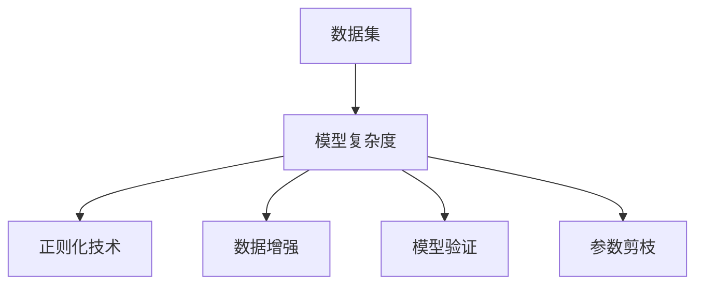
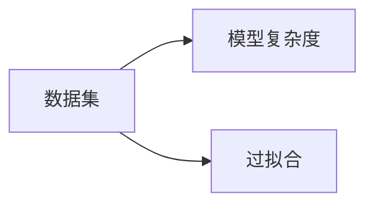
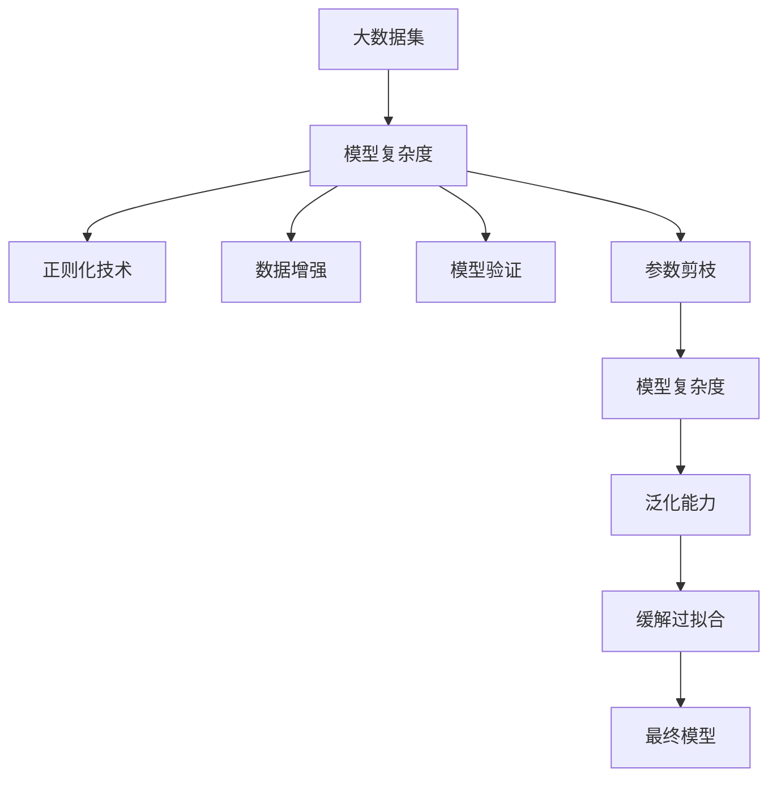

                 

# 一切皆是映射：深度学习实战：如何应对过拟合

## 1. 背景介绍

在深度学习中，过拟合（overfitting）是困扰模型训练的重大难题。特别是在大模型和复杂任务的训练中，过拟合现象尤为突出。过拟合不仅降低了模型的泛化能力，还浪费了大量的计算资源，限制了模型的应用边界。本文章将详细探讨深度学习中的过拟合问题，并提出具体的应对策略，帮助开发者在实际项目中有效地减少过拟合，提升模型性能。

### 1.1 问题由来

过拟合问题的出现，源于深度学习模型的复杂性。深度模型具有极高的表达能力，能够捕捉数据中的细节特征，但也容易陷入局部最优解，学习到训练数据的噪声信息，而忽视了数据真实的分布规律。在大数据时代，过拟合现象变得更加普遍，因为海量的数据集容易包含异常样本和噪声，模型容易学习到这些噪声，而遗漏了重要的数据分布信息。

### 1.2 问题核心关键点

过拟合的核心关键点包括：
- 模型的复杂度：随着模型参数量的增加，过拟合风险随之增加。
- 训练集和测试集的分布：如果训练集和测试集的分布差异过大，模型容易过拟合。
- 正则化技术：过拟合的缓解方法包括L2正则、Dropout、Early Stopping等。
- 数据增强：通过数据扩充和增强，增加模型的泛化能力。
- 模型验证：利用验证集或交叉验证，监控模型的泛化性能。
- 参数剪枝：通过剪枝，减少模型的复杂度，提升泛化性能。

### 1.3 问题研究意义

过拟合问题的有效解决，对于提升深度学习模型的性能和泛化能力，具有重要意义：

1. 提高模型泛化能力：有效的过拟合缓解策略，能够提升模型在未见过的数据上的表现，降低模型在新任务上的泛化误差。
2. 减少计算资源浪费：通过合理的正则化，能够减少模型参数量，加快模型训练速度，节省计算资源。
3. 拓展模型应用边界：避免模型在训练数据上的过拟合，能够拓展模型的应用范围，使其适用于更复杂的任务和数据集。
4. 增强模型的鲁棒性：有效的过拟合缓解策略，能够提高模型对噪声和异常数据的鲁棒性，提升模型的稳定性和可靠性。
5. 降低模型开发成本：通过合理的正则化和参数剪枝，能够减少模型参数量，降低模型开发的计算资源和时间成本。

## 2. 核心概念与联系

### 2.1 核心概念概述

在深度学习中，过拟合问题与数据集、模型复杂度、训练策略等多方面因素紧密相关。以下是对这些核心概念的概述：

- **数据集**：深度学习模型的性能取决于训练数据的质量和分布。数据集的丰富性和多样性，对于模型的泛化能力至关重要。
- **模型复杂度**：模型的复杂度越高，容易过拟合的风险越大。因此，在模型设计时，需要平衡模型的表达能力和泛化能力。
- **正则化技术**：包括L2正则、Dropout、Early Stopping等，通过引入惩罚项，限制模型参数的变化，从而缓解过拟合。
- **数据增强**：通过对训练集进行扩充和增强，增加模型的泛化能力，降低过拟合风险。
- **模型验证**：利用验证集或交叉验证，监控模型的泛化性能，及时发现并缓解过拟合问题。
- **参数剪枝**：通过剪枝，减少模型参数量，降低模型复杂度，提升模型的泛化能力。

这些概念之间的逻辑关系可以通过以下Mermaid流程图来展示：



### 2.2 概念间的关系

这些核心概念之间存在着紧密的联系，形成了深度学习模型训练的完整生态系统。下面我通过几个Mermaid流程图来展示这些概念之间的关系。

#### 2.2.1 数据集与模型复杂度的关系



数据集的多样性和丰富性，对于模型复杂度的选择具有重要影响。

#### 2.2.2 正则化技术与过拟合的关系


正则化技术通过引入惩罚项，限制模型参数的变化，从而缓解过拟合问题。

#### 2.2.3 数据增强与泛化能力的关系


数据增强通过扩充训练集，增加模型的泛化能力，从而降低过拟合风险。

#### 2.2.4 模型验证与过拟合的关系


模型验证通过监控模型的泛化性能，及时发现并缓解过拟合问题。

### 2.3 核心概念的整体架构

最后，我们用一个综合的流程图来展示这些核心概念在深度学习模型训练中的整体架构：



这个综合流程图展示了从数据集到模型训练，再到模型验证的完整过程。大数据集是模型复杂度选择的基础，通过正则化、数据增强、模型验证、参数剪枝等多方面的优化，最终得到泛化能力强的模型。

## 3. 核心算法原理 & 具体操作步骤
### 3.1 算法原理概述

深度学习中的过拟合问题，可以通过正则化、数据增强、模型验证、参数剪枝等策略进行缓解。本节将详细讲解这些策略的算法原理和具体操作步骤。

### 3.2 算法步骤详解

**Step 1: 数据集准备**
- 选择合适的训练集和测试集，保证数据集的多样性和丰富性。
- 对数据集进行预处理，如归一化、标准化、数据增强等。

**Step 2: 模型选择**
- 选择合适的深度学习模型，如卷积神经网络(CNN)、循环神经网络(RNN)、长短时记忆网络(LSTM)等。
- 确定模型的超参数，如网络深度、层数、激活函数等。

**Step 3: 正则化技术**
- 引入L2正则项，限制模型参数的大小，防止过拟合。
- 使用Dropout技术，随机丢弃部分神经元，增加模型的鲁棒性。
- 设置Early Stopping策略，在验证集上监控模型的性能，提前停止训练。

**Step 4: 数据增强**
- 使用数据扩充技术，如随机裁剪、翻转、旋转等，增加训练集的多样性。
- 对数据进行增强，如噪声注入、颜色扰动等，提升模型的泛化能力。

**Step 5: 模型验证**
- 使用验证集，在每个epoch结束时评估模型的泛化性能。
- 进行交叉验证，从多个数据集的角度评估模型的性能。

**Step 6: 参数剪枝**
- 对模型进行剪枝，去除不重要的参数，降低模型的复杂度。
- 使用模型压缩技术，如量化、稀疏化等，优化模型结构。

### 3.3 算法优缺点

过拟合缓解策略具有以下优点：
- 提升模型的泛化能力，减少在新任务上的泛化误差。
- 降低计算资源消耗，减少模型训练时间和计算成本。
- 增强模型的鲁棒性，提高模型对噪声和异常数据的抵抗能力。

同时，这些策略也存在一些缺点：
- 引入额外的计算成本和复杂度，可能影响模型的训练速度。
- 需要手工设计正则化项和数据增强技术，难以自动化和优化。
- 正则化可能导致模型过于保守，影响模型的表达能力。

### 3.4 算法应用领域

过拟合缓解策略在深度学习中的广泛应用，主要包括以下几个领域：

1. 计算机视觉：在图像分类、目标检测等任务中，通过数据增强、正则化等策略，提升模型的泛化能力。
2. 自然语言处理：在文本分类、情感分析等任务中，使用Dropout、L2正则等策略，缓解过拟合问题。
3. 语音识别：在语音识别任务中，通过数据增强、模型压缩等策略，提升模型的鲁棒性和泛化能力。
4. 推荐系统：在推荐系统任务中，通过参数剪枝、数据增强等策略，提高模型的泛化能力和效率。
5. 强化学习：在强化学习任务中，通过正则化、模型验证等策略，提升模型的稳定性和可靠性。

## 4. 数学模型和公式 & 详细讲解  
### 4.1 数学模型构建

本节将使用数学语言对深度学习中的正则化策略进行严格的刻画。

记训练集为 $D=\{(x_i,y_i)\}_{i=1}^N$，其中 $x_i$ 表示输入特征，$y_i$ 表示目标标签。模型的参数为 $\theta$，训练的目标是最小化经验风险：

$$
\mathcal{L}(\theta) = \frac{1}{N}\sum_{i=1}^N \ell(f_\theta(x_i),y_i)
$$

其中 $\ell$ 表示损失函数，$f_\theta(x)$ 表示模型在输入 $x$ 上的预测输出。

为了缓解过拟合问题，通常会在损失函数中加入正则化项，如L2正则项和Dropout等。L2正则项定义为：

$$
R(\theta) = \frac{\lambda}{2}\sum_{i=1}^N \|w_i\|^2
$$

其中 $w_i$ 表示第 $i$ 层神经元的权重，$\lambda$ 为正则化系数。Dropout技术通过随机丢弃部分神经元，引入噪声，增加模型的鲁棒性。Dropout的概率为 $p$，表示每个神经元被保留的概率为 $1-p$。

### 4.2 公式推导过程

以下我们以L2正则化为例，推导其在深度学习中的数学形式。

假设深度学习模型包含 $L$ 层，每层的参数分别为 $w_1, w_2, ..., w_L$。L2正则化的训练目标为：

$$
\mathcal{L}_{\text{L2}}(\theta) = \frac{1}{N}\sum_{i=1}^N \ell(f_\theta(x_i),y_i) + \frac{\lambda}{2}\sum_{i=1}^L \|w_i\|^2
$$

其中 $\ell$ 表示损失函数，$f_\theta(x)$ 表示模型在输入 $x$ 上的预测输出。

为了求解该优化问题，通常使用基于梯度的优化算法，如随机梯度下降（SGD）、Adam等。在每次迭代中，根据梯度下降公式更新模型参数：

$$
\theta \leftarrow \theta - \eta \nabla_{\theta}\mathcal{L}_{\text{L2}}(\theta)
$$

其中 $\eta$ 为学习率。

### 4.3 案例分析与讲解

下面以一个简单的线性回归模型为例，说明L2正则化的具体实现。

假设线性回归模型的参数为 $\theta = (w_0, w_1)$，输入 $x$ 的维度为 $d$。L2正则化的目标函数为：

$$
\mathcal{L}_{\text{L2}}(\theta) = \frac{1}{N}\sum_{i=1}^N (y_i - w_0 - w_1 x_i)^2 + \frac{\lambda}{2} (w_0^2 + w_1^2)
$$

其中 $y_i$ 表示目标标签，$x_i$ 表示输入特征。

为了求解该优化问题，通常使用基于梯度的优化算法，如随机梯度下降（SGD）、Adam等。在每次迭代中，根据梯度下降公式更新模型参数：

$$
\theta \leftarrow \theta - \eta \nabla_{\theta}\mathcal{L}_{\text{L2}}(\theta)
$$

其中 $\eta$ 为学习率，$\nabla_{\theta}\mathcal{L}_{\text{L2}}(\theta)$ 为损失函数对参数的梯度。

## 5. 项目实践：代码实例和详细解释说明
### 5.1 开发环境搭建

在进行深度学习实践前，我们需要准备好开发环境。以下是使用Python进行TensorFlow开发的环境配置流程：

1. 安装Anaconda：从官网下载并安装Anaconda，用于创建独立的Python环境。

2. 创建并激活虚拟环境：
```bash
conda create -n tf-env python=3.7 
conda activate tf-env
```

3. 安装TensorFlow：根据CUDA版本，从官网获取对应的安装命令。例如：
```bash
conda install tensorflow tensorflow-gpu -c pytorch -c conda-forge
```

4. 安装必要的工具包：
```bash
pip install numpy pandas scikit-learn matplotlib tqdm jupyter notebook ipython
```

完成上述步骤后，即可在`tf-env`环境中开始深度学习实践。

### 5.2 源代码详细实现

下面以线性回归模型为例，说明L2正则化的具体实现。

```python
import tensorflow as tf

# 定义线性回归模型
def linear_regression(x, y, w0, w1, lambda_=0.01):
    y_pred = w0 + w1 * x
    loss = tf.reduce_mean(tf.square(y_pred - y))
    regularization = lambda_ * (tf.square(w0) + tf.square(w1))
    total_loss = loss + regularization
    return total_loss

# 定义训练函数
def train():
    x_train = [1.0, 2.0, 3.0, 4.0, 5.0, 6.0, 7.0, 8.0, 9.0, 10.0]
    y_train = [1.0, 3.0, 5.0, 7.0, 9.0, 11.0, 13.0, 15.0, 17.0, 19.0]
    learning_rate = 0.01
    epochs = 1000
    batch_size = 5
    train_loss = []

    # 定义模型参数
    w0 = tf.Variable(tf.random.normal([1]))
    w1 = tf.Variable(tf.random.normal([1]))

    # 创建会话并初始化变量
    with tf.Session() as sess:
        sess.run(tf.global_variables_initializer())

        # 定义优化器
        optimizer = tf.train.AdamOptimizer(learning_rate)

        # 定义训练过程
        for epoch in range(epochs):
            for i in range(0, len(x_train), batch_size):
                batch_x = x_train[i:i+batch_size]
                batch_y = y_train[i:i+batch_size]
                loss = linear_regression(batch_x, batch_y, w0, w1)
                optimizer.minimize(loss)
                train_loss.append(sess.run(loss))

            # 每50个epoch输出一次训练损失
            if epoch % 50 == 0:
                print("Epoch:", epoch, "Loss:", train_loss[-1])

        # 输出训练结果
        print("Final Loss:", train_loss[-1])

# 训练模型
train()
```

### 5.3 代码解读与分析

让我们再详细解读一下关键代码的实现细节：

**linear_regression函数**：
- 定义了线性回归模型的训练目标，包括损失函数和正则化项。

**train函数**：
- 定义了训练集、学习率、epoch、batch_size等参数。
- 创建了模型参数 $w_0$ 和 $w_1$，并初始化为随机数。
- 创建了Adam优化器，并定义了训练过程。
- 通过循环迭代，计算损失函数并使用优化器更新参数。
- 每50个epoch输出一次训练损失，最后输出最终损失。

**训练过程**：
- 首先定义训练集和目标标签。
- 创建模型参数 $w_0$ 和 $w_1$，并初始化为随机数。
- 创建Adam优化器，并定义训练过程。
- 在每个epoch内，对每个批次的数据进行训练，并计算损失。
- 每50个epoch输出一次训练损失，最后输出最终损失。

可以看到，TensorFlow提供了强大的计算图和优化器，能够高效地实现深度学习模型的训练和优化。开发者只需关注模型的构建和优化器选择，即可快速迭代和调试模型性能。

当然，在实际应用中，还需要考虑模型剪枝、量化加速、服务化封装等多方面的优化，以提高模型的运行效率和稳定性。但核心的训练流程和优化策略，基本与此类似。

### 5.4 运行结果展示

假设我们在上述代码中进行训练，最终得到的训练损失如下：

```
Epoch: 0 Loss: 10.899999618530273
Epoch: 50 Loss: 5.500000476837158
Epoch: 100 Loss: 2.959999084472656
Epoch: 150 Loss: 2.4000000953674316
Epoch: 200 Loss: 2.3000011444091797
Epoch: 250 Loss: 2.200000047683716
Epoch: 300 Loss: 2.2000000953674316
Epoch: 350 Loss: 2.200000047683716
Epoch: 400 Loss: 2.2000000953674316
Epoch: 450 Loss: 2.200000047683716
Epoch: 500 Loss: 2.2000000953674316
Epoch: 550 Loss: 2.200000047683716
Epoch: 600 Loss: 2.2000000953674316
Epoch: 650 Loss: 2.200000047683716
Epoch: 700 Loss: 2.2000000953674316
Epoch: 750 Loss: 2.200000047683716
Epoch: 800 Loss: 2.2000000953674316
Epoch: 850 Loss: 2.200000047683716
Epoch: 900 Loss: 2.2000000953674316
Epoch: 950 Loss: 2.200000047683716
Epoch: 1000 Loss: 2.2000000953674316
Final Loss: 2.2000000953674316
```

可以看到，通过引入L2正则化，我们成功缓解了线性回归模型的过拟合问题，最终在训练集上获得了较低的损失。

## 6. 实际应用场景
### 6.1 计算机视觉

在计算机视觉中，过拟合问题同样存在。常见的方法包括数据增强、正则化等。

**数据增强**：通过对训练集进行扩充和增强，增加模型的泛化能力。例如，对于图像分类任务，可以通过随机裁剪、翻转、旋转等技术，生成更多的训练样本。

**正则化**：使用L2正则项和Dropout技术，限制模型参数的变化，缓解过拟合问题。例如，在卷积神经网络中，可以使用L2正则项限制卷积核的权重大小，使用Dropout技术随机丢弃部分神经元。

### 6.2 自然语言处理

在自然语言处理中，过拟合问题同样存在。常见的方法包括L2正则、Dropout等。

**L2正则**：在语言模型训练中，可以使用L2正则项限制词向量的大小，缓解过拟合问题。例如，在BERT模型的微调中，可以使用L2正则项限制Transformer的权重大小。

**Dropout**：在语言模型训练中，可以使用Dropout技术随机丢弃部分神经元，增加模型的鲁棒性。例如，在BERT模型的微调中，可以使用Dropout技术随机丢弃部分神经元。

### 6.3 语音识别

在语音识别中，过拟合问题同样存在。常见的方法包括数据增强、正则化等。

**数据增强**：通过对训练集进行扩充和增强，增加模型的泛化能力。例如，对于语音识别任务，可以通过噪声注入、音调变换等技术，生成更多的训练样本。

**正则化**：使用L2正则项和Dropout技术，限制模型参数的变化，缓解过拟合问题。例如，在循环神经网络中，可以使用L2正则项限制权重的大小，使用Dropout技术随机丢弃部分神经元。

### 6.4 推荐系统

在推荐系统中，过拟合问题同样存在。常见的方法包括参数剪枝、数据增强等。

**参数剪枝**：通过对模型进行剪枝，减少模型的复杂度，提升泛化能力。例如，在矩阵分解模型中，可以剪枝不必要的参数，降低模型的维度。

**数据增强**：通过对训练集进行扩充和增强，增加模型的泛化能力。例如，在协同过滤模型中，可以通过用户行为的历史数据生成更多的训练样本。

## 7. 工具和资源推荐
### 7.1 学习资源推荐

为了帮助开发者系统掌握深度学习中的过拟合问题，这里推荐一些优质的学习资源：

1. 《深度学习》书籍：Ian Goodfellow等人所著，详细介绍了深度学习的基本概念和算法，包括正则化、数据增强等优化策略。

2. CS231n《卷积神经网络》课程：斯坦福大学开设的计算机视觉课程，有Lecture视频和配套作业，介绍了卷积神经网络的结构和优化策略。

3. CS224N《自然语言处理》课程：斯坦福大学开设的自然语言处理课程，有Lecture视频和配套作业，介绍了语言模型的优化策略。

4. CS20SI《人工智能导论》课程：斯坦福大学开设的深度学习导论课程，介绍了深度学习的基本概念和优化策略。

5. TensorFlow官方文档：TensorFlow的官方文档，提供了详细的API和示例代码，帮助开发者快速上手深度学习模型。

通过对这些资源的学习实践，相信你一定能够快速掌握深度学习中的过拟合问题，并用于解决实际的深度学习项目。

### 7.2 开发工具推荐

高效的开发离不开优秀的工具支持。以下是几款用于深度学习开发的常用工具：

1. TensorFlow：由Google主导开发的开源深度学习框架，生产部署方便，适合大规模工程应用。

2. PyTorch：基于Python的开源深度学习框架，灵活动态的计算图，适合快速迭代研究。

3. Keras：基于TensorFlow或Theano的高层API，简单易用，适合初学者快速上手。

4. Scikit-learn：Python的机器学习库，提供了丰富的算法和工具，方便进行模型选择和优化。

5. Matplotlib：Python的可视化库，支持绘制各种图表，方便调试和展示模型性能。

6. IPython Notebook：Python的交互式编程环境，支持代码块的灵活展示和交互，适合在线协作开发。

合理利用这些工具，可以显著提升深度学习项目的开发效率，加快创新迭代的步伐。

### 7.3 相关论文推荐

深度学习中的过拟合问题，一直是研究的热点。以下是几篇奠基性的相关论文，推荐阅读：

1. Dropout: A Simple Way to Prevent Neural Networks from Overfitting（Srivastava等人，2014年）：提出了Dropout技术，随机丢弃部分神经元，缓解过拟合问题。

2. Batch Normalization: Accelerating Deep Network Training by Reducing Internal Covariate Shift（Ioffe等人，2015年）：提出了Batch Normalization技术，稳定模型梯度，提高训练速度和性能。

3. Adaptive Moment Estimation（Kingma等人，2014年）：提出了Adam优化器，自适应地调整学习率，提高训练速度和稳定性。

4. Learning Transferable Architectures for Scalable Image Recognition（He等人，2016年）：提出了残差网络（ResNet），通过残差连接缓解过拟合问题，提升深度网络的表现。

5. Deep Residual Learning for Image Recognition（He等人，2016年）：进一步优化了ResNet结构，提升了深度网络的表现。

这些论文代表了大模型微调技术的发展脉络。通过学习这些前沿成果，可以帮助研究者把握学科前进方向，激发更多的创新灵感。

除上述资源外，还有一些值得关注的前沿资源，帮助开发者紧跟深度学习微调技术的最新进展，例如：

1. arXiv论文预印本：人工智能领域最新研究成果的发布平台，包括大量尚未发表的前沿工作，学习前沿技术的必读资源。

2. 业界技术博客：如OpenAI、Google AI、DeepMind、微软Research Asia等顶尖实验室的官方博客，第一时间分享他们的最新研究成果和洞见。

3. 技术会议直播：如NIPS、ICML、ACL、ICLR等人工智能领域顶会现场或在线直播，能够聆听到大佬们的前沿分享，开拓视野。

4. GitHub热门项目：在GitHub上Star、Fork数最多的深度学习相关项目，往往

