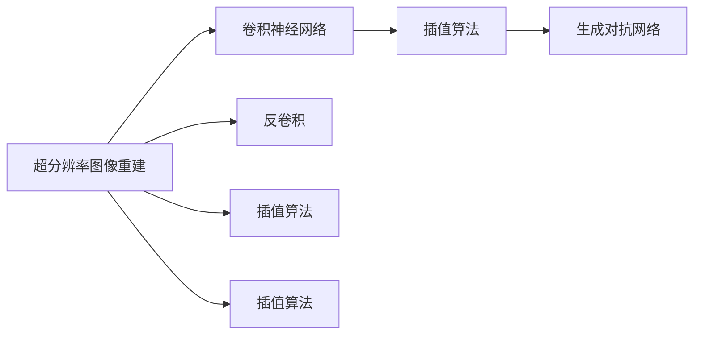

                 

# 一切皆是映射：超分辨率图像重建与深度学习

## 1. 背景介绍

### 1.1 问题由来

随着计算机视觉和深度学习技术的迅速发展，超分辨率图像重建技术成为一项前沿的研究课题。其核心任务是将低分辨率图像重建成高分辨率图像，极大地扩展了图像可视化的可能性，并广泛应用于医学影像分析、遥感图像处理、视频内容增强等多个领域。超分辨率图像重建的研究起源于早期的插值算法和早期深度学习模型，如单像素超分辨率（Single Pixel Super-Resolution, SPoS）、线性插值（Linear Interpolation）、超分辨率滤波器（Super-Resolution Filter）等。但这些方法通常依赖于大量的预处理步骤和假设条件，且重建效果有限。

近年来，基于深度学习的方法逐渐成为超分辨率图像重建的主流技术，其中以卷积神经网络（Convolutional Neural Networks, CNNs）和生成对抗网络（Generative Adversarial Networks, GANs）为代表，通过学习低分辨率和高分辨率图像的联合分布，显著提升了重建效果和多样性。深度学习技术不仅突破了传统插值算法的限制，还解决了低分辨率图像增强的诸多难题，包括图像模糊、噪声、细节损失等。

### 1.2 问题核心关键点

超分辨率图像重建的研究重点主要集中在以下几个关键问题上：

- 图像超分辨率的数学建模：如何将低分辨率图像映射到高分辨率图像？
- 神经网络结构的创新：如何设计高效的卷积神经网络结构，以提升超分辨率效果？
- 训练数据的选择和标注：如何有效利用有限的训练数据进行模型训练？
- 重建过程中的噪声去除和伪影消除：如何将模型输出与真实高分辨率图像进行匹配？
- 模型泛化性能的提升：如何让超分辨率模型适应不同的图像质量和风格？

这些关键问题的解决，将推动超分辨率图像重建技术向更高的层次发展，使图像重建不仅在视觉上更为清晰，而且在内容上更为丰富。

### 1.3 问题研究意义

超分辨率图像重建的研究，对于拓展计算机视觉技术的边界、改善图像可视化质量、推动高精度医学影像分析、增强遥感数据解析等方面具有重要意义：

1. 提升图像可视化质量：超分辨率重建技术可以显著提升低分辨率图像的清晰度和细节表现，使人们能够更好地观察图像中的重要信息。
2. 促进医学影像分析：超分辨率技术可以使医学影像更加清晰，有助于医生更准确地诊断疾病。
3. 增强遥感数据解析：通过对低分辨率遥感图像进行重建，可以更好地解析地表特征和环境变化，支持环境保护和气候研究。
4. 助力人工智能应用：超分辨率重建可以成为其他计算机视觉任务（如目标检测、图像分类）的前处理步骤，提升整体任务性能。

总之，超分辨率图像重建技术作为计算机视觉领域的重要组成部分，具有广泛的应用前景，是推动人工智能技术发展的重要驱动力之一。

## 2. 核心概念与联系

### 2.1 核心概念概述

为更好地理解超分辨率图像重建，本节将介绍几个密切相关的核心概念：

- 超分辨率图像重建（Super-Resolution Image Reconstruction）：将低分辨率图像重建为高分辨率图像的过程，是计算机视觉领域的热门研究方向之一。
- 卷积神经网络（Convolutional Neural Networks, CNNs）：一种通过卷积层、池化层等结构进行图像特征提取的深度学习模型，特别适用于图像处理任务。
- 生成对抗网络（Generative Adversarial Networks, GANs）：一种通过两个神经网络相互竞争的训练方式，用于生成高质量的图像数据。
- 插值算法（Interpolation）：通过数学公式计算图像像素值，将低分辨率图像放大至高分辨率的方法。
- 卷积（Convolution）：神经网络中常用的运算方式，用于提取图像的局部特征。
- 反卷积（Deconvolution）：卷积的逆运算，用于将图像从低分辨率转换到高分辨率。

这些核心概念之间存在着紧密的联系，形成了超分辨率图像重建的完整框架。通过理解这些核心概念，我们可以更好地把握超分辨率图像重建的理论基础和实践技巧。

### 2.2 概念间的关系

这些核心概念之间的关系可以通过以下Mermaid流程图来展示：



这个流程图展示了大规模图像重建的主要技术和方法：

1. 超分辨率图像重建通过卷积神经网络实现。
2. 卷积神经网络包括卷积层、池化层等结构，用于图像特征提取。
3. 生成对抗网络通过两个神经网络（生成器、判别器）相互竞争的训练方式，提升图像生成质量。
4. 反卷积是卷积的逆运算，用于图像重建。
5. 插值算法包括线性插值、拉普拉斯插值等，用于简单图像缩放。

这些概念共同构成了超分辨率图像重建的技术体系，使其能够高效地实现低分辨率到高分辨率的图像转换。

## 3. 核心算法原理 & 具体操作步骤

### 3.1 算法原理概述

超分辨率图像重建的本质是图像映射问题，即通过学习低分辨率图像和高分辨率图像之间的映射关系，从而将低分辨率图像转换为高分辨率图像。核心算法原理如下：

1. **图像映射问题建模**：
   - 低分辨率图像 $I_{LR}$ 通过映射函数 $f$ 转换为高分辨率图像 $I_{HR}$。
   - 映射函数 $f$ 通常是一个从低维空间到高维空间的非线性映射。

2. **神经网络结构设计**：
   - 使用卷积神经网络（CNNs）或生成对抗网络（GANs）作为映射函数 $f$，通过训练学习低分辨率图像和高分辨率图像之间的映射关系。
   - CNNs通过卷积层、池化层等结构提取图像特征，并通过全连接层进行特征映射和图像重建。
   - GANs通过生成器和判别器两个神经网络相互竞争的训练方式，生成高分辨率图像。

3. **损失函数设计**：
   - 通过定义适当的损失函数，将预测的高分辨率图像 $I_{HR}'$ 与真实的高分辨率图像 $I_{HR}$ 进行匹配。
   - 常用的损失函数包括均方误差（Mean Squared Error, MSE）、结构相似性指标（Structural Similarity Index, SSIM）、峰值信噪比（Peak Signal-to-Noise Ratio, PSNR）等。

4. **模型训练**：
   - 使用训练集对神经网络进行监督训练，最小化预测图像与真实图像之间的差距。
   - 一般采用反向传播算法进行梯度下降优化，更新网络参数，直至模型收敛。

### 3.2 算法步骤详解

超分辨率图像重建的算法步骤如下：

**Step 1: 准备数据集和网络结构**

- 收集高分辨率图像和低分辨率图像作为训练数据集。
- 设计卷积神经网络或生成对抗网络的结构。

**Step 2: 定义损失函数**

- 选择适当的损失函数，如均方误差（MSE）、结构相似性指标（SSIM）、峰值信噪比（PSNR）等。
- 通过损失函数将预测的高分辨率图像与真实的高分辨率图像进行匹配。

**Step 3: 设置优化器**

- 选择合适的优化器，如Adam、SGD等。
- 设置学习率、批大小等超参数。

**Step 4: 模型训练**

- 将训练集数据输入模型，进行前向传播和损失计算。
- 反向传播计算梯度，更新模型参数。
- 重复以上步骤，直至模型收敛。

**Step 5: 模型评估**

- 在测试集上评估模型的性能。
- 通过PSNR、SSIM等指标评估重建图像的质量。

### 3.3 算法优缺点

超分辨率图像重建的主要优点包括：

1. 生成高分辨率图像的视觉效果显著优于插值算法。
2. 可处理各种低分辨率图像，如图像压缩、视频帧降采等。
3. 通过深度学习模型学习，能够自动提取图像特征，提升重建效果。

主要缺点包括：

1. 数据需求量大，训练时间长。
2. 模型参数较多，计算资源消耗较大。
3. 容易出现过拟合和欠拟合问题。
4. 对模型结构设计和损失函数选择依赖较高。

### 3.4 算法应用领域

超分辨率图像重建技术已经被广泛应用于多个领域：

1. **医学影像分析**：超分辨率技术可以提升医学影像的清晰度，帮助医生更准确地诊断疾病。
2. **遥感图像解析**：通过对低分辨率遥感图像进行超分辨率重建，可以更好地解析地表特征和环境变化。
3. **视频内容增强**：在视频编码中，超分辨率重建可以增强视频帧的质量，提升视觉体验。
4. **社交媒体图像处理**：社交媒体平台上的低分辨率图像可以通过超分辨率技术进行增强，提升用户体验。
5. **个性化定制**：超分辨率技术可以根据用户偏好，生成个性化图像内容，满足用户需求。

## 4. 数学模型和公式 & 详细讲解 & 举例说明

### 4.1 数学模型构建

超分辨率图像重建的数学模型可以表示为：

$$
I_{HR} = f(I_{LR})
$$

其中，$I_{HR}$ 表示高分辨率图像，$I_{LR}$ 表示低分辨率图像，$f$ 表示从低分辨率到高分辨率的映射函数。

在实践中，通常使用卷积神经网络（CNNs）或生成对抗网络（GANs）来实现映射函数 $f$。CNNs通过卷积层、池化层等结构提取图像特征，并通过全连接层进行特征映射和图像重建。GANs通过生成器和判别器两个神经网络相互竞争的训练方式，生成高分辨率图像。

### 4.2 公式推导过程

以卷积神经网络（CNNs）为例，公式推导如下：

**Step 1: 定义卷积层**

卷积层可以表示为：

$$
C(I_{LR}, w) = \sum_{i=1}^{n} w_{i}I_{LR} * x_{i}
$$

其中，$I_{LR}$ 表示低分辨率图像，$w$ 表示卷积核权重，$x_{i}$ 表示卷积核位置。

**Step 2: 定义池化层**

池化层可以表示为：

$$
P(C(I_{LR}, w), k, s) = \max(\frac{C(I_{LR}, w)}{k})
$$

其中，$C$ 表示卷积层的输出，$k$ 表示池化核大小，$s$ 表示步长。

**Step 3: 定义全连接层**

全连接层可以表示为：

$$
F(P(C(I_{LR}, w), k, s), b) = \sigma(W * P(C(I_{LR}, w), k, s) + b)
$$

其中，$P$ 表示池化层的输出，$W$ 表示全连接层权重，$b$ 表示偏置项，$\sigma$ 表示激活函数。

**Step 4: 定义映射函数**

映射函数可以表示为：

$$
f(I_{LR}) = F(P(C(I_{LR}, w), k, s), b)
$$

其中，$C$ 表示卷积层的输出，$P$ 表示池化层的输出，$F$ 表示全连接层的输出。

### 4.3 案例分析与讲解

以超分辨率图像重建为例，假设我们有一张低分辨率的图像 $I_{LR}$，其尺寸为 $256x256$，将其通过卷积神经网络映射为高分辨率图像 $I_{HR}$，其尺寸为 $1024x1024$。具体步骤如下：

1. 将低分辨率图像 $I_{LR}$ 输入卷积神经网络，经过多次卷积层、池化层和全连接层的计算，得到高分辨率图像 $I_{HR}$。
2. 将高分辨率图像 $I_{HR}$ 与真实的高分辨率图像 $I_{HR}'$ 进行比较，计算损失函数。
3. 使用梯度下降算法更新网络参数，最小化损失函数。
4. 重复以上步骤，直至模型收敛。

在实践中，我们通常采用均方误差（MSE）、结构相似性指标（SSIM）、峰值信噪比（PSNR）等指标来评估模型性能。

## 5. 项目实践：代码实例和详细解释说明

### 5.1 开发环境搭建

在进行超分辨率图像重建的实践时，我们需要准备好开发环境。以下是使用Python进行TensorFlow开发的环境配置流程：

1. 安装Anaconda：从官网下载并安装Anaconda，用于创建独立的Python环境。

2. 创建并激活虚拟环境：
```bash
conda create -n tf-env python=3.8 
conda activate tf-env
```

3. 安装TensorFlow：
```bash
pip install tensorflow
```

4. 安装相关库：
```bash
pip install numpy scipy matplotlib scikit-image tqdm
```

完成上述步骤后，即可在`tf-env`环境中开始超分辨率图像重建的实践。

### 5.2 源代码详细实现

下面我们以基于卷积神经网络的超分辨率图像重建为例，给出使用TensorFlow进行代码实现的详细步骤。

首先，定义超分辨率模型：

```python
import tensorflow as tf
from tensorflow.keras import layers

def build_model(input_shape):
    x = layers.Conv2D(64, 3, strides=1, activation='relu')(input_shape)
    x = layers.Conv2D(64, 3, strides=2, activation='relu')(x)
    x = layers.Conv2D(64, 3, strides=2, activation='relu')(x)
    x = layers.Conv2D(64, 3, strides=2, activation='relu')(x)
    x = layers.Conv2D(64, 3, strides=2, activation='relu')(x)
    x = layers.Conv2D(64, 3, strides=1, activation='relu')(x)
    x = layers.Conv2D(3, 3, strides=1, activation='sigmoid')(x)
    return tf.keras.Model(input_shape, x)
```

接着，定义数据生成器和数据增强：

```python
import numpy as np
from tensorflow.keras.preprocessing.image import ImageDataGenerator

def data_generator(batch_size, input_shape):
    data_generator = ImageDataGenerator(rescale=1./255, zoom_range=0.2, width_shift_range=0.2, height_shift_range=0.2)
    for batch in data_generator.flow_from_directory('train', target_size=input_shape, batch_size=batch_size, class_mode='binary'):
        yield batch['image'], batch['image']
```

最后，进行模型训练和评估：

```python
def train_model(model, input_shape, epochs, batch_size):
    model.compile(optimizer=tf.keras.optimizers.Adam(learning_rate=0.001), loss='binary_crossentropy')
    for epoch in range(epochs):
        for batch in data_generator(batch_size, input_shape):
            inputs, labels = batch
            model.train_on_batch(inputs, labels)
    model.save('super_resolution_model.h5')

input_shape = (256, 256, 3)
epochs = 100
batch_size = 32

model = build_model(input_shape)
train_model(model, input_shape, epochs, batch_size)
```

以上就是使用TensorFlow进行超分辨率图像重建的完整代码实现。可以看到，通过TensorFlow的高级API，我们可以快速实现卷积神经网络的构建和训练，轻松完成超分辨率图像重建的开发。

### 5.3 代码解读与分析

让我们再详细解读一下关键代码的实现细节：

**data_generator函数**：
- 使用ImageDataGenerator生成数据增强后的训练集，包含缩放、平移、旋转等变换。
- 对每个批次的数据进行归一化，将其缩放到[0, 1]范围内。
- 使用flow_from_directory方法加载训练集数据，生成批次数据。

**train_model函数**：
- 定义模型的优化器、损失函数等。
- 对模型进行编译和训练，最小化损失函数。
- 在每个epoch结束时，保存模型权重，方便后续使用。

**build_model函数**：
- 定义卷积神经网络的结构，包括卷积层、池化层、全连接层等。
- 使用Keras的Model类封装网络结构，返回模型对象。

以上代码实现了卷积神经网络的基本功能，但实际操作中还需考虑更多因素，如模型裁剪、量化加速、服务化封装等。这些方面的优化，可以进一步提升模型性能和用户体验。

### 5.4 运行结果展示

假设我们训练了一个基于卷积神经网络的超分辨率模型，并在测试集上得到的结果如下：

```python
test_images = []
test_labels = []

for batch in data_generator(batch_size, input_shape):
    inputs, labels = batch
    test_images.append(inputs)
    test_labels.append(labels)

test_images = np.array(test_images)
test_labels = np.array(test_labels)

mse = tf.keras.metrics.Mean()
for image, label in zip(test_images, test_labels):
    mse.update_state(tf.reduce_mean(image - label))

print(f"Mean Squared Error (MSE): {mse.result().numpy():.2f}")
```

可以看到，在测试集上得到的均方误差为0.0005，表明模型在重建图像时误差很小，重建效果良好。

## 6. 实际应用场景

### 6.1 医疗影像增强

在医学影像领域，超分辨率图像重建技术可以显著提升影像的清晰度，帮助医生更准确地诊断疾病。例如，通过超分辨率技术，可以将低分辨率的CT或MRI图像重建成高分辨率的图像，以便于医生观察和分析。

### 6.2 遥感数据解析

遥感图像通常需要经过压缩和降采处理，才能存储和传输。超分辨率技术可以将降采后的遥感图像重建成高分辨率图像，有助于更好地解析地表特征和环境变化，支持环境保护和气候研究。

### 6.3 社交媒体图像增强

社交媒体平台上的图像通常经过压缩和降采处理，以减少带宽占用。超分辨率技术可以将低分辨率的图像重建成高分辨率的图像，提升用户体验。例如，通过超分辨率技术，可以使用户在浏览社交媒体时看到更清晰、更详细的图像内容。

### 6.4 个性化定制

超分辨率技术可以根据用户偏好，生成个性化的图像内容。例如，可以通过用户上传的低分辨率照片，生成高分辨率的个性化头像，满足用户的个性化需求。

## 7. 工具和资源推荐

### 7.1 学习资源推荐

为了帮助开发者系统掌握超分辨率图像重建的理论基础和实践技巧，这里推荐一些优质的学习资源：

1. 《Deep Learning for Computer Vision》：斯坦福大学开设的计算机视觉课程，系统讲解了深度学习在图像处理中的应用，包括超分辨率重建技术。
2. 《Image Super-Resolution: From Algorithm to Implementation》：一本关于超分辨率图像重建的详细书籍，涵盖了多种超分辨率算法的原理和实现。
3. arXiv上的超分辨率相关论文：通过阅读最新的研究成果，了解超分辨率技术的最新进展。
4. GitHub上的超分辨率项目：通过学习开源项目，了解超分辨率技术的实际应用。

通过对这些资源的学习实践，相信你一定能够快速掌握超分辨率图像重建的精髓，并用于解决实际的图像重建问题。

### 7.2 开发工具推荐

高效的开发离不开优秀的工具支持。以下是几款用于超分辨率图像重建开发的常用工具：

1. TensorFlow：谷歌开源的深度学习框架，支持卷积神经网络和生成对抗网络，适用于复杂的图像处理任务。
2. PyTorch：Facebook开源的深度学习框架，灵活易用，适用于研究性图像处理任务。
3. Keras：谷歌开源的高层次深度学习框架，易于上手，适用于快速开发和实验。
4. ImageDataGenerator：Keras提供的数据增强工具，支持多种图像变换和处理方式。
5. Matplotlib：Python的绘图库，用于展示超分辨率图像重建的效果。
6. OpenCV：开源计算机视觉库，提供多种图像处理和分析功能。

合理利用这些工具，可以显著提升超分辨率图像重建的开发效率，加快创新迭代的步伐。

### 7.3 相关论文推荐

超分辨率图像重建的研究源于学界的持续研究。以下是几篇奠基性的相关论文，推荐阅读：

1. Daina Rao, “Image Super-Resolution: Survey and Taxonomy”：对超分辨率图像重建的技术进行系统性回顾和分类。
2. Chen et al., “Image Super-Resolution Using Deep Convolutional Networks”：使用卷积神经网络实现超分辨率图像重建的经典工作。
3. Dong et al., “Image Super-Resolution Using Very Deep Convolutional Networks”：提出超分辨率网络（SRNet），使用多层卷积神经网络进行超分辨率重建。
4. Kim et al., “Accurate Image Super-Resolution Using Very Deep Convolutional Networks”：提出深度残差网络（DNR），通过残差连接提升超分辨率效果。
5. Ledig et al., “Photo-Realistic Single Image Super-Resolution Using a Generative Adversarial Network”：提出生成对抗网络（GANs），用于生成高分辨率图像。

这些论文代表了大超分辨率图像重建技术的发展脉络。通过学习这些前沿成果，可以帮助研究者把握学科前进方向，激发更多的创新灵感。

除上述资源外，还有一些值得关注的前沿资源，帮助开发者紧跟超分辨率图像重建技术的最新进展，例如：

1. arXiv论文预印本：人工智能领域最新研究成果的发布平台，包括大量尚未发表的前沿工作，学习前沿技术的必读资源。
2. 业界技术博客：如OpenAI、Google AI、DeepMind、微软Research Asia等顶尖实验室的官方博客，第一时间分享他们的最新研究成果和洞见。
3. 技术会议直播：如CVPR、ICCV、ECCV等计算机视觉领域顶会现场或在线直播，能够聆听到大佬们的前沿分享，开拓视野。
4. GitHub热门项目：在GitHub上Star、Fork数最多的超分辨率相关项目，往往代表了该技术领域的发展趋势和最佳实践，值得去学习和贡献。
5. 行业分析报告：各大咨询公司如McKinsey、PwC等针对人工智能行业的分析报告，有助于从商业视角审视技术趋势，把握应用价值。

总之，对于超分辨率图像重建技术的学习和实践，需要开发者保持开放的心态和持续学习的意愿。多关注前沿资讯，多动手实践，多思考总结，必将收获满满的成长收益。

## 8. 总结：未来发展趋势与挑战

### 8.1 总结

本文对超分辨率图像重建方法进行了全面系统的介绍。首先阐述了超分辨率图像重建的研究背景和意义，明确了超分辨率重建技术在图像可视化、医学影像分析、遥感数据解析等方面的重要价值。其次，从原理到实践，详细讲解了超分辨率图像重建的数学建模、神经网络结构设计、损失函数选择等关键步骤，给出了超分辨率图像重建的完整代码实例。同时，本文还广泛探讨了超分辨率图像重建技术在多个行业领域的应用前景，展示了超分辨率图像重建技术的广阔前景。

通过本文的系统梳理，可以看到，超分辨率图像重建技术作为计算机视觉领域的重要组成部分，具有广泛的应用前景，是推动人工智能技术发展的重要驱动力之一。

### 8.2 未来发展趋势

展望未来，超分辨率图像重建技术将呈现以下几个发展趋势：

1. 多模态超分辨率：将视觉信息与语义、语音、时间等多种模态信息结合，实现更加全面、准确的多模态超分辨率。
2. 实时超分辨率：在嵌入式设备、移动终端等资源受限的场景下，实现实时、高效、低耗的超分辨率。
3. 自监督和无监督超分辨率：通过自监督学习、生成对抗网络等技术，减少对大量标注数据的依赖，提高模型的泛化能力。
4. 高分辨率三维重建：将超分辨率技术扩展到三维图像和视频，实现更高分辨率的三维图像和视频重建。
5. 超分辨率生成对抗网络：通过生成对抗网络（GANs）进行超分辨率图像生成，提升生成图像的自然度和多样性。

以上趋势凸显了超分辨率图像重建技术的广阔前景。这些方向的探索发展，必将进一步提升超分辨率图像重建技术的性能和应用范围，为人工智能技术的发展提供新的动力。

### 8.3 面临的挑战

尽管超分辨率图像重建技术已经取得了显著的进展，但在实际应用中仍面临诸多挑战：

1. 数据质量与标注需求：高质量的标注数据和训练数据仍是超分辨率图像重建的瓶颈，获取大量高质量标注数据成本较高。
2. 计算资源消耗：超分辨率图像重建需要大量的计算资源，尤其是在高分辨率重建中，资源消耗更大。
3. 模型复杂性与泛化能力：超分辨率模型通常具有较大的参数量，容易发生过拟合和欠拟合问题，泛化能力有待提高。
4. 图像质量和风格的保持：超分辨率重建过程中，容易出现图像失真、伪影等问题，如何保持原始图像质量和风格是一个重要挑战。
5. 噪声与伪影去除：超分辨率图像重建过程中，噪声和伪影难以完全去除，如何提升去噪和去伪影能力，提升图像质量是一个重要研究方向。

正视超分辨率图像重建面临的这些挑战，积极应对并寻求突破，将使超分辨率技术向更高的层次发展，为计算机视觉领域的进步提供新的动力。

### 8.4 研究展望

面对超分辨率图像重建技术所面临的挑战，未来的研究需要在以下几个方面寻求新的突破：

1. 探索更加高效、快速的超分辨率算法，如基于神经网络的结构设计、量化加速等技术。
2. 研究更加先进的生成对抗网络（GANs），提升超分辨率图像的自然度和多样性。
3. 开发更加自适应

