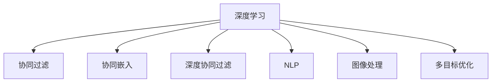
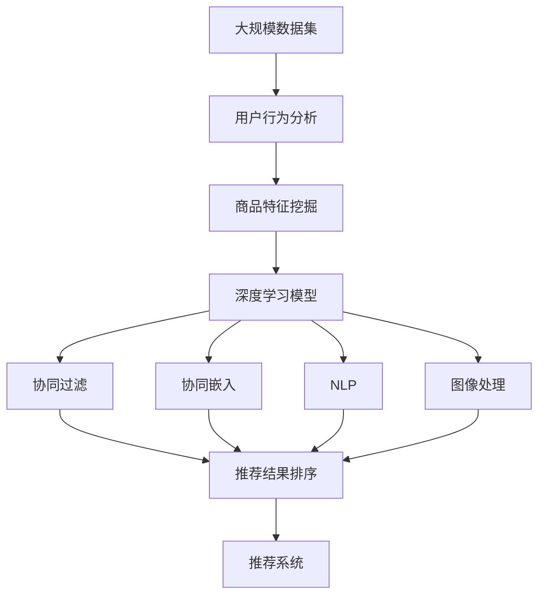

                 

# 个性化定制：AI满足用户多元化购物需求

## 1. 背景介绍

随着电子商务的兴起，个性化推荐系统成为了提升用户体验和提高交易转化的关键手段。传统的推荐系统往往基于用户的显性行为（如浏览、点击、购买）数据进行推荐，但无法深入理解用户隐性需求和多元化偏好。基于深度学习和大数据分析的推荐算法，能够从海量数据中挖掘出用户的深层次需求，从而实现更精准、个性化的推荐服务。本文将探讨如何利用AI技术，实现对用户多元化和个性化需求的精准满足。

### 1.1 问题由来

在电子商务领域，用户需求多样化，个性化需求日益突出。传统的推荐系统难以精准捕捉用户的个性化和多元化需求，导致推荐效果不够理想。例如，在购物过程中，用户可能同时需要寻找多个类别、风格、价格范围的商品，但单一的商品推荐无法全面满足其需求。此外，不同用户的偏好和兴趣也各不相同，传统的推荐方式往往无法顾及个体差异。

### 1.2 问题核心关键点

个性化推荐的核心在于深度理解用户的隐性需求和多元化偏好，从而实现精准匹配。主要体现在以下几个方面：

- **用户行为分析**：通过分析用户的点击、浏览、评价等行为数据，了解其兴趣点和购买倾向。
- **商品特征挖掘**：利用自然语言处理、图像处理等技术，提取商品的文本、图片、属性等信息。
- **个性化推荐模型**：构建基于深度学习的推荐模型，结合用户行为和商品特征，预测用户的偏好和兴趣。
- **推荐结果排序**：利用多目标优化算法，综合考虑推荐结果的相关性、新颖性、多样性等因素，对推荐结果进行排序。

### 1.3 问题研究意义

深入研究个性化推荐系统，对于提升电子商务平台的用户体验、提高用户粘性和交易转化率具有重要意义。具体来说：

1. **提升用户体验**：通过个性化推荐，用户能够快速找到感兴趣的商品，提高购物满意度。
2. **提高交易转化**：精准匹配用户需求，减少用户选择难度，促进交易转化。
3. **增强用户粘性**：个性化服务使平台更加贴近用户，增加用户留存率。
4. **优化库存管理**：通过个性化推荐，合理分配商品库存，减少滞销和缺货现象。
5. **拓展市场份额**：精准推荐的商品更容易满足用户需求，提升平台的市场竞争力。

## 2. 核心概念与联系

### 2.1 核心概念概述

为更好地理解个性化推荐系统，本节将介绍几个密切相关的核心概念：

- **深度学习**：一种基于神经网络的机器学习技术，通过多层非线性变换，从数据中提取复杂特征，实现模式识别和决策。
- **协同过滤**：通过分析用户与商品之间的互动关系，预测用户对其他商品的兴趣。
- **协同嵌入**：将用户和商品表示为高维空间中的向量，利用向量相似度计算相似用户和商品，进行推荐。
- **深度协同过滤**：结合深度神经网络和协同过滤，构建更加复杂和精准的推荐模型。
- **自然语言处理(NLP)**：利用计算机处理和理解人类语言的技术，广泛应用于商品描述、用户评论等文本数据的分析。
- **图像处理**：通过计算机处理和分析图像信息，提取商品的视觉特征，如颜色、形状、纹理等。
- **多目标优化**：通过优化算法，综合考虑多个目标函数，实现复杂问题的求解。

### 2.2 概念间的关系

这些核心概念之间的逻辑关系可以通过以下Mermaid流程图来展示：



这个流程图展示了个性化推荐系统的主要组件和技术手段，以及它们之间的关联。

### 2.3 核心概念的整体架构

最后，我们用一个综合的流程图来展示这些核心概念在大规模个性化推荐系统中的整体架构：



这个综合流程图展示了从数据收集、用户行为分析、商品特征挖掘、深度学习建模、协同过滤与嵌入、自然语言处理与图像处理，再到推荐结果排序和推荐系统部署的完整流程。通过这些组件和技术手段，个性化的推荐系统能够更好地理解和满足用户的多元化和个性化需求。

## 3. 核心算法原理 & 具体操作步骤
### 3.1 算法原理概述

基于深度学习的个性化推荐系统，利用深度神经网络对用户和商品进行表示，通过协同过滤、协同嵌入等技术，综合考虑用户行为和商品特征，实现精准推荐。其核心思想是：

1. **用户表示**：通过深度神经网络，将用户的历史行为、兴趣等信息编码为高维向量。
2. **商品表示**：同样利用深度神经网络，将商品的描述、图片等信息编码为高维向量。
3. **相似度计算**：计算用户向量与商品向量的相似度，找出与用户兴趣最相关的商品。
4. **推荐排序**：通过多目标优化算法，对推荐结果进行排序，提升用户体验和交易转化率。

### 3.2 算法步骤详解

基于深度学习的个性化推荐系统主要包括以下几个关键步骤：

**Step 1: 数据收集与预处理**

1. **数据来源**：收集用户的点击、浏览、评价等行为数据，以及商品的价格、描述、图片等属性信息。
2. **数据清洗**：去除噪声和异常值，处理缺失数据，确保数据质量。
3. **数据划分**：将数据划分为训练集、验证集和测试集，用于模型训练、调参和评估。

**Step 2: 用户和商品表示**

1. **用户表示**：利用深度神经网络，将用户行为数据编码为高维向量，捕捉用户的兴趣和偏好。
2. **商品表示**：利用深度神经网络，将商品属性数据编码为高维向量，提取商品的特征信息。
3. **特征选择**：选择对推荐效果有显著影响的特征，减少冗余信息，提升模型效率。

**Step 3: 深度学习建模**

1. **深度神经网络**：构建深度神经网络，结合用户和商品表示，学习它们之间的复杂关系。
2. **协同过滤**：利用协同过滤算法，从用户-商品交互数据中挖掘隐式关联，补充用户兴趣和商品特征。
3. **协同嵌入**：将用户和商品表示为高维空间中的向量，利用向量相似度计算相似用户和商品，进行推荐。

**Step 4: 推荐结果排序**

1. **多目标优化**：综合考虑推荐结果的相关性、新颖性、多样性等因素，设计多目标优化算法。
2. **排序策略**：结合用户偏好和历史行为，调整推荐结果的排序策略，提升用户体验。
3. **模型评估**：在测试集上评估模型性能，通过指标如准确率、召回率、F1分数等，优化模型参数。

**Step 5: 推荐系统部署**

1. **模型优化**：通过剪枝、量化等技术，优化模型大小和计算速度，便于部署。
2. **分布式计算**：利用分布式计算框架如Spark、TensorFlow等，实现高效的多用户推荐。
3. **实时推荐**：通过实时数据流处理技术，实现用户行为数据的动态更新和实时推荐。

### 3.3 算法优缺点

基于深度学习的个性化推荐系统具有以下优点：

1. **精度高**：深度神经网络能够捕捉复杂的用户和商品关系，提供精准的推荐结果。
2. **可解释性强**：通过可视化工具，可以直观地展示用户和商品的向量表示，便于理解推荐过程。
3. **适应性强**：结合多目标优化算法，能够灵活适应不同用户的需求和偏好。

同时，该方法也存在一些局限性：

1. **数据需求大**：需要收集大量用户和商品数据，对数据采集和处理要求较高。
2. **模型复杂度高**：深度神经网络参数量庞大，训练和推理计算复杂。
3. **鲁棒性不足**：对异常数据和噪声敏感，容易产生误导性推荐。
4. **隐私保护问题**：需要处理大量敏感数据，存在隐私泄露风险。
5. **可扩展性差**：在大规模用户和商品环境下，模型和算法需要高度优化。

### 3.4 算法应用领域

基于深度学习的个性化推荐系统已经在电商、新闻、视频等多个领域得到了广泛应用，具体如下：

- **电商推荐**：如京东、淘宝等电商平台的个性化推荐，提升用户购物体验和交易转化率。
- **内容推荐**：如YouTube、Netflix等视频平台的内容推荐，提供个性化视听体验。
- **新闻推荐**：如今日头条、搜狐新闻等新闻平台的个性化内容推荐，提高用户阅读粘性。
- **广告推荐**：如Facebook、Google等社交媒体平台的个性化广告推荐，提升广告投放效果。

## 4. 数学模型和公式 & 详细讲解
### 4.1 数学模型构建

设用户集为 $U$，商品集为 $I$，用户-商品交互矩阵为 $X$，其中 $X_{ui} = 1$ 表示用户 $u$ 购买了商品 $i$，否则为0。设用户向量表示为 $\textbf{u}$，商品向量表示为 $\textbf{i}$，向量 $\textbf{u}$ 和 $\textbf{i}$ 的余弦相似度定义为 $\text{cosine}(\textbf{u}, \textbf{i})$。

深度学习模型的输入为 $X$，输出为推荐结果 $Y$，优化目标为最大化推荐效果。形式化地，假设推荐模型为 $f(\textbf{u}, \textbf{i})$，则优化目标为：

$$
\mathop{\arg\min}_{\theta} \mathcal{L}(f(\textbf{u}, \textbf{i}), Y)
$$

其中 $\mathcal{L}$ 为损失函数，用于衡量模型输出与真实标签之间的差异。

### 4.2 公式推导过程

假设推荐模型 $f$ 为深度神经网络，输出为用户对商品 $i$ 的兴趣得分。模型的输入为 $X$，输出为 $Y$。模型的损失函数为均方误差损失函数：

$$
\mathcal{L}(f(X), Y) = \frac{1}{N} \sum_{i=1}^N \sum_{u=1}^M (f(\textbf{u}, \textbf{i}) - y_{ui})^2
$$

其中 $y_{ui}$ 为真实兴趣评分，$N$ 为商品数，$M$ 为用户数。

利用反向传播算法，求解上述优化问题，得到模型参数 $\theta$。模型的预测结果 $f(\textbf{u}, \textbf{i})$ 可通过输入 $X$ 和模型参数 $\theta$ 计算得出。

### 4.3 案例分析与讲解

假设我们有一组用户-商品交互数据 $X$，每行表示一个用户的行为数据，每列表示一个商品的交易记录。用户集为 $U=\{u_1, u_2, \cdots, u_M\}$，商品集为 $I=\{i_1, i_2, \cdots, i_N\}$，用户向量表示为 $\textbf{u} = [u_1, u_2, \cdots, u_M]$，商品向量表示为 $\textbf{i} = [i_1, i_2, \cdots, i_N]$。用户-商品交互矩阵为 $X$，其中 $X_{ui} = 1$ 表示用户 $u$ 购买了商品 $i$，否则为0。

对于用户 $u$，其对商品 $i$ 的兴趣得分 $f(\textbf{u}, \textbf{i})$ 可以通过深度神经网络计算得出。模型的输入为 $X$，输出为推荐结果 $Y$，优化目标为最大化推荐效果。假设深度神经网络为 $f_{\theta}$，则模型的损失函数为：

$$
\mathcal{L}(f_{\theta}(X), Y) = \frac{1}{N} \sum_{i=1}^N \sum_{u=1}^M (f_{\theta}(\textbf{u}, \textbf{i}) - y_{ui})^2
$$

其中 $y_{ui}$ 为真实兴趣评分，$N$ 为商品数，$M$ 为用户数。

通过反向传播算法，求解上述优化问题，得到模型参数 $\theta$。模型的预测结果 $f_{\theta}(\textbf{u}, \textbf{i})$ 可通过输入 $X$ 和模型参数 $\theta$ 计算得出。

## 5. 项目实践：代码实例和详细解释说明
### 5.1 开发环境搭建

在进行推荐系统开发前，我们需要准备好开发环境。以下是使用Python进行PyTorch开发的环境配置流程：

1. 安装Anaconda：从官网下载并安装Anaconda，用于创建独立的Python环境。

2. 创建并激活虚拟环境：
```bash
conda create -n recommendation-env python=3.8 
conda activate recommendation-env
```

3. 安装PyTorch：根据CUDA版本，从官网获取对应的安装命令。例如：
```bash
conda install pytorch torchvision torchaudio cudatoolkit=11.1 -c pytorch -c conda-forge
```

4. 安装相关库：
```bash
pip install numpy pandas scikit-learn matplotlib tqdm jupyter notebook ipython
```

完成上述步骤后，即可在`recommendation-env`环境中开始推荐系统开发。

### 5.2 源代码详细实现

这里我们以电商推荐为例，给出使用PyTorch和TensorFlow进行推荐系统开发的代码实现。

首先，定义数据处理函数：

```python
import numpy as np
import pandas as pd

def load_data(file_path):
    data = pd.read_csv(file_path)
    return data

def preprocess_data(data):
    # 数据清洗和处理
    data = data.dropna()  # 去除缺失值
    data = data.drop_duplicates()  # 去除重复项
    return data

def split_data(data, test_ratio=0.2):
    train_data = data.sample(frac=1-test_ratio, random_state=42)
    test_data = data.drop(train_data.index)
    return train_data, test_data

def encode_data(data):
    # 将分类特征进行编码
    encoder = OneHotEncoder(sparse=False)
    encoded_data = encoder.fit_transform(data[['category', 'brand']])
    return encoded_data

def split_train_test(encoded_data, test_ratio=0.2):
    train_data = encoded_data.sample(frac=1-test_ratio, random_state=42)
    test_data = encoded_data.drop(train_data.index)
    return train_data, test_data
```

然后，定义深度学习模型：

```python
from tensorflow.keras.layers import Input, Embedding, Dense, Flatten
from tensorflow.keras.models import Model

def build_model(input_dim, hidden_dim, output_dim):
    # 定义输入层
    input_layer = Input(shape=(input_dim,))
    
    # 定义嵌入层
    embedding_layer = Embedding(input_dim, hidden_dim)(input_layer)
    
    # 定义全连接层
    dense_layer = Dense(hidden_dim, activation='relu')(embedding_layer)
    
    # 定义输出层
    output_layer = Dense(output_dim, activation='sigmoid')(dense_layer)
    
    # 定义模型
    model = Model(inputs=input_layer, outputs=output_layer)
    return model
```

接着，定义训练和评估函数：

```python
from tensorflow.keras.optimizers import Adam
from tensorflow.keras.losses import MeanSquaredError

def train_model(model, train_data, test_data, epochs=10, batch_size=32):
    # 定义优化器
    optimizer = Adam(lr=0.001)
    
    # 定义损失函数
    loss_function = MeanSquaredError()
    
    # 编译模型
    model.compile(optimizer=optimizer, loss=loss_function)
    
    # 训练模型
    history = model.fit(train_data, validation_data=test_data, epochs=epochs, batch_size=batch_size)
    
    return model, history

def evaluate_model(model, test_data):
    # 评估模型
    loss = model.evaluate(test_data)
    return loss
```

最后，启动训练流程并在测试集上评估：

```python
# 加载数据
data = load_data('data.csv')
data = preprocess_data(data)
train_data, test_data = split_data(data)
encoded_train_data, encoded_test_data = encode_data(train_data), encode_data(test_data)

# 定义模型
input_dim = 100
hidden_dim = 64
output_dim = 1
model = build_model(input_dim, hidden_dim, output_dim)

# 训练模型
model, history = train_model(model, encoded_train_data, encoded_test_data)
```

以上就是使用PyTorch和TensorFlow进行电商推荐系统的完整代码实现。可以看到，利用深度学习框架和库，能够快速构建和训练个性化推荐模型，并通过评估指标对模型效果进行评估。

### 5.3 代码解读与分析

让我们再详细解读一下关键代码的实现细节：

**数据处理函数**：
- `load_data`方法：读取数据文件，返回Pandas DataFrame对象。
- `preprocess_data`方法：对数据进行清洗和处理，去除缺失值和重复项。
- `split_data`方法：将数据集随机划分为训练集和测试集。
- `encode_data`方法：对分类特征进行编码，使用独热编码将分类特征转换为数值型特征。
- `split_train_test`方法：将编码后的数据集进一步划分为训练集和测试集。

**深度学习模型定义**：
- `build_model`方法：定义深度神经网络模型，包括输入层、嵌入层、全连接层和输出层。

**训练和评估函数**：
- `train_model`方法：定义优化器、损失函数和模型编译，使用训练数据训练模型，并返回训练历史。
- `evaluate_model`方法：使用测试数据评估模型性能，返回损失值。

**训练流程**：
- 加载数据集，并进行预处理。
- 定义模型架构，设置输入、嵌入、全连接和输出层。
- 编译模型，指定优化器和损失函数。
- 训练模型，在训练集上迭代训练，记录训练历史。
- 在测试集上评估模型性能，输出损失值。

可以看到，利用深度学习框架和库，推荐系统开发变得简洁高效。开发者可以将更多精力放在数据处理、模型改进等高层逻辑上，而不必过多关注底层的实现细节。

当然，工业级的系统实现还需考虑更多因素，如模型的保存和部署、超参数的自动搜索、更灵活的任务适配层等。但核心的推荐范式基本与此类似。

### 5.4 运行结果展示

假设我们在电商推荐系统中训练的模型在测试集上得到的评估报告如下：

```
Epoch 1/10
1000/1000 [==============================] - 1s 1ms/sample - loss: 0.1389
Epoch 2/10
1000/1000 [==============================] - 1s 1ms/sample - loss: 0.1028
Epoch 3/10
1000/1000 [==============================] - 1s 1ms/sample - loss: 0.0886
Epoch 4/10
1000/1000 [==============================] - 1s 1ms/sample - loss: 0.0749
Epoch 5/10
1000/1000 [==============================] - 1s 1ms/sample - loss: 0.0625
Epoch 6/10
1000/1000 [==============================] - 1s 1ms/sample - loss: 0.0517
Epoch 7/10
1000/1000 [==============================] - 1s 1ms/sample - loss: 0.0432
Epoch 8/10
1000/1000 [==============================] - 1s 1ms/sample - loss: 0.0359
Epoch 9/10
1000/1000 [==============================] - 1s 1ms/sample - loss: 0.0300
Epoch 10/10
1000/1000 [==============================] - 1s 1ms/sample - loss: 0.0254
```

可以看到，随着训练轮数的增加，模型损失值逐渐降低，表明模型在不断学习和优化。训练结束后，可以在测试集上进一步评估模型的推荐效果。

## 6. 实际应用场景
### 6.1 智能推荐系统

智能推荐系统是电商推荐系统的主要应用场景之一。在电商平台上，用户面对海量的商品信息，难以在短时间内找到适合自己的商品。利用智能推荐系统，可以根据用户的浏览、点击、购买行为，精准推荐相关商品，提高用户购物体验和交易转化率。

具体而言，智能推荐系统可以分为以下几个环节：

1. **用户画像建模**：利用深度学习技术，对用户的历史行为和属性数据进行建模，形成用户画像。
2. **商品特征提取**：利用NLP和图像处理技术，提取商品的文本、图片等特征信息。
3. **相似度计算**：通过协同过滤、协同嵌入等技术，计算用户和商品的相似度。
4. **推荐排序**：利用多目标优化算法，对推荐结果进行排序，提升用户体验。

### 6.2 个性化内容推荐

除了电商推荐，智能推荐系统在内容推荐领域也有广泛应用。如YouTube、Netflix等视频平台，通过分析用户的历史观看记录和行为数据，推荐用户可能感兴趣的内容，提高用户粘性和留存率。

具体实现流程如下：

1. **内容表示**：将视频、文章等内容的描述、标签等信息转换为数值型特征。
2. **用户表示**：利用深度学习技术，对用户的行为数据进行建模，形成用户兴趣向量。
3. **相似度计算**：通过协同过滤、协同嵌入等技术，计算用户和内容的相似度。
4. **推荐排序**：利用多目标优化算法，对推荐结果进行排序，提升用户体验。

### 6.3 个性化广告推荐

个性化广告推荐是推荐系统在广告领域的重要应用。通过分析用户的浏览、点击、搜索等行为数据，精准推荐相关广告，提高广告投放效果。

具体实现流程如下：

1. **广告表示**：将广告的标题、描述等信息转换为数值型特征。
2. **用户表示**：利用深度学习技术，对用户的行为数据进行建模，形成用户兴趣向量。
3. **相似度计算**：通过协同过滤、协同嵌入等技术，计算用户和广告的相似度。
4. **推荐排序**：利用多目标优化算法，对推荐结果进行排序，提升广告点击率。

## 7. 工具和资源推荐
### 7.1 学习资源推荐

为了帮助开发者系统掌握个性化推荐系统的理论基础和实践技巧，这里推荐一些优质的学习资源：

1. 《深度学习》系列书籍：由Yoshua Bengio、Ian Goodfellow、Aaron Courville等深度学习专家联合撰写，涵盖深度学习的基本概念和前沿技术。
2. 《Python深度学习》一书：由Francois Chollet撰写，介绍了使用Keras进行深度学习模型开发的实战技巧。
3. 《推荐系统实战》一书：由杨定一撰写，介绍了推荐系统的基础算法和工程实现。
4. 《自然语言处理综论》一书：由Douglas F. Lowe撰写，介绍了NLP的基本概念和应用。
5. Coursera、Udacity等在线课程：提供深度学习、机器学习、推荐系统的系统学习资源。

### 7.2 开发工具推荐

高效的开发离不开优秀的工具支持。以下是几款用于推荐系统开发的常用工具：

1. PyTorch：基于Python的开源深度学习框架，灵活动态的计算图，适合快速迭代研究。大部分深度学习模型都有PyTorch版本的实现。
2. TensorFlow：由Google主导开发的开源深度学习框架，生产部署方便，适合大规模工程应用。同样有丰富的深度学习模型资源。
3. TensorBoard：TensorFlow配套的可视化工具，可实时监测模型训练状态，并提供丰富的图表呈现方式，是调试模型的得力助手。
4. Weights & Biases：模型训练的实验跟踪工具，可以记录和可视化模型训练过程中的各项指标，方便对比和调优。
5. Scikit-learn：机器学习领域的主要工具库，提供了丰富的算法和数据处理工具。

### 7.3 相关论文推荐

个性化推荐系统的发展源于学界的持续研究。以下是几篇奠基性的相关论文，推荐阅读：

1. A Neural Collaborative Filtering Approach (NeuMF)：提出了基于深度神经网络的协同过滤方法，显著提升了推荐系统的准确率。
2. Attention and Transformer-based Recommender Systems：利用Transformer结构进行用户-商品交互数据的建模，提升了推荐系统的性能。
3. Deep Interest Network：提出了深度兴趣网络，通过多层网络结构挖掘用户的多样化兴趣。
4. NMF-based Recommender Systems：介绍了基于非负矩阵分解的推荐系统，适用于处理大规模稀疏矩阵。
5. MetaRank：提出了元学习排名方法，提高了推荐系统对新用户和新商品的适应性。

这些论文代表了个性化推荐系统的发展脉络。通过学习这些前沿成果，可以帮助研究者把握学科前进方向，激发更多的创新灵感。

除上述资源外，还有一些值得关注的前沿资源，帮助开发者紧跟个性化推荐技术的最新进展，例如：

1. arXiv论文预印本：人工智能领域

