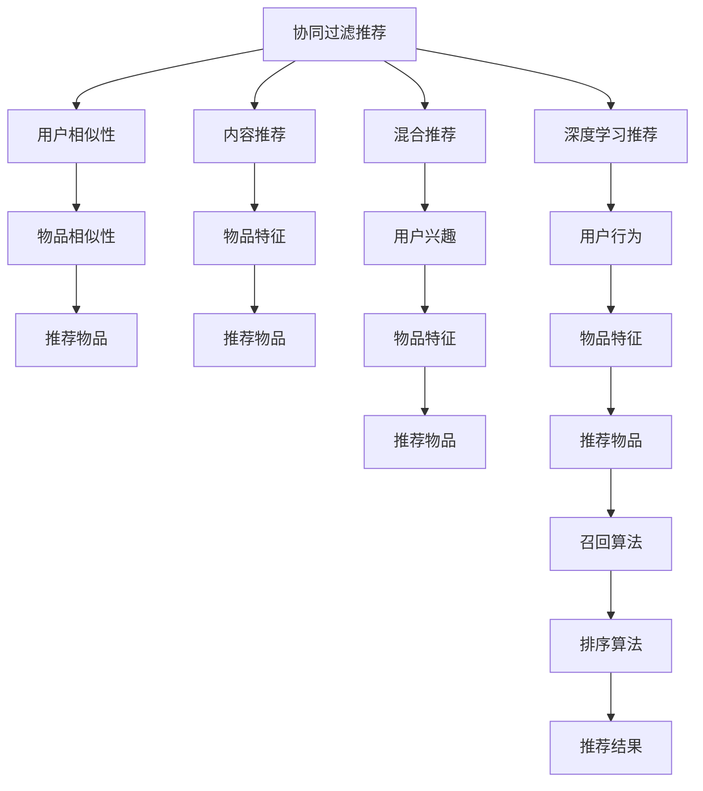
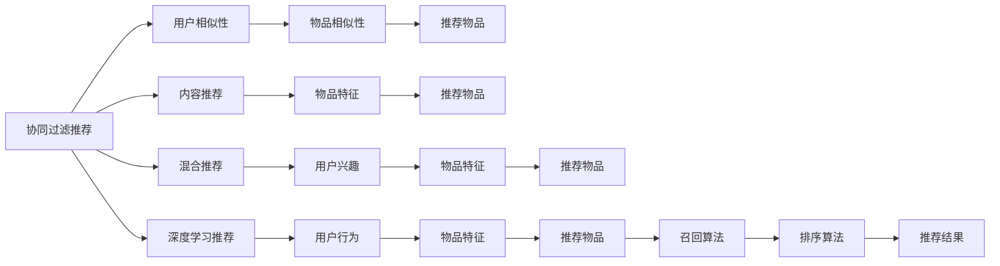
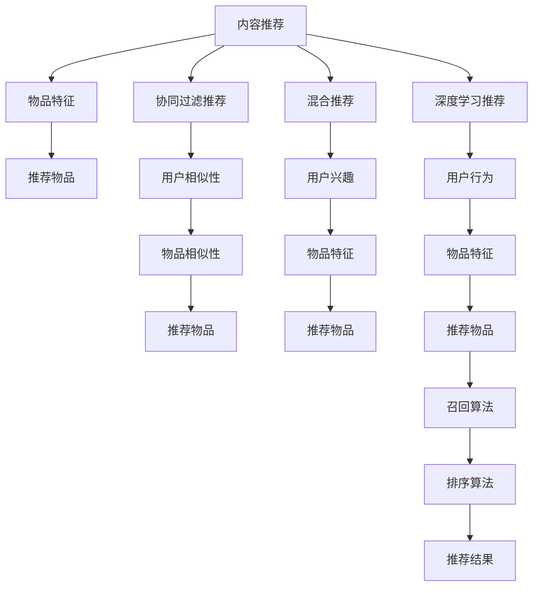
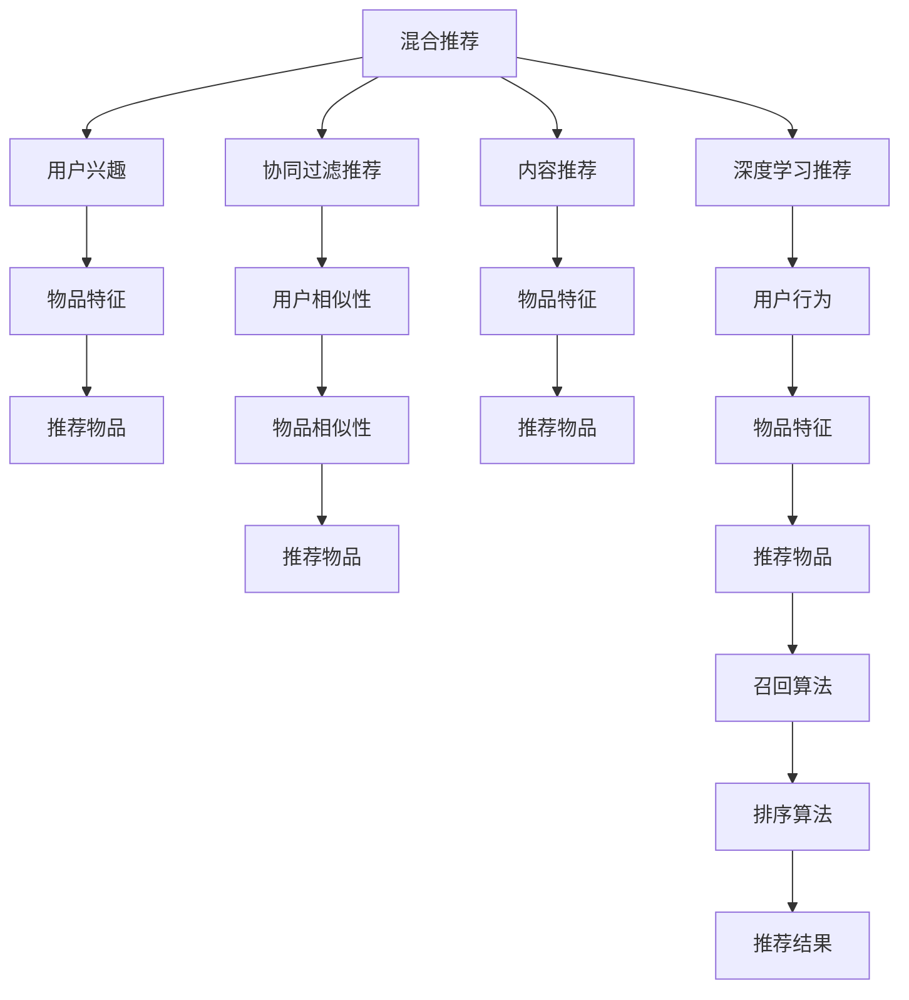
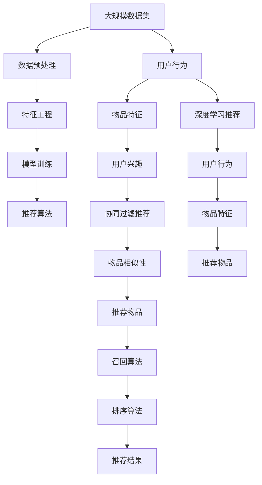

                 

# 个性化推荐系统的AI实现

> 关键词：个性化推荐系统, 协同过滤, 内容推荐, 深度学习, 特征工程, 召回算法

## 1. 背景介绍

### 1.1 问题由来
在互联网时代，信息的洪流已经远远超出了人们能够处理和吸收的极限。如何为用户推荐最符合其兴趣和需求的信息，成为了各大平台面临的重要挑战。个性化推荐系统作为一种智能推荐手段，在电子商务、新闻媒体、社交网络等多个领域得到了广泛应用。

个性化推荐系统通过分析用户的历史行为数据，学习用户兴趣偏好，从而在数据海中快速定位到最合适的信息。这种推荐方式不仅提高了用户体验，还能显著提升平台的用户留存率和转化率，成为互联网企业竞争的重要利器。

### 1.2 问题核心关键点
个性化推荐系统可以分为以下几种常见类型：

- **协同过滤推荐**：通过分析用户之间的相似性，找到与目标用户兴趣相近的用户，然后推荐这些用户喜欢的物品。
- **内容推荐**：基于物品本身的特征，如标题、摘要、分类等，对物品进行标签和特征提取，然后通过相似度计算为用户推荐。
- **混合推荐**：结合协同过滤和内容推荐，综合考虑用户兴趣和物品特征，从而取得更好的推荐效果。

个性化推荐系统的关键在于如何高效地从海量数据中挖掘出用户与物品之间的关系，并据此生成个性化的推荐结果。具体实现技术涉及数据预处理、特征工程、模型训练和推荐算法等多个环节，是NLP和数据科学交叉的重要领域。

### 1.3 问题研究意义
个性化推荐系统能够有效缓解信息过载问题，帮助用户在海量信息中快速找到感兴趣的内容，提高用户体验和平台满意度。同时，通过个性化推荐，还可以发现用户的潜在需求，刺激消费增长，推动企业收益提升。

因此，研究个性化推荐系统的AI实现方式，对于提升信息检索和推荐系统的智能化水平，促进用户行为预测和市场动态分析，具有重要意义。

## 2. 核心概念与联系

### 2.1 核心概念概述

为更好地理解个性化推荐系统的AI实现，本节将介绍几个密切相关的核心概念：

- **协同过滤推荐**：通过用户之间的相似性或物品之间的相似性，为特定用户推荐物品的方法。常用于无结构化数据，如电商推荐、社交媒体推荐等。
- **内容推荐**：基于物品本身的特征，如文本描述、标签、分类等，为特定用户推荐物品的方法。常用于有结构化数据的推荐，如新闻、视频、音乐等。
- **混合推荐**：结合协同过滤和内容推荐，综合考虑用户兴趣和物品特征，从而取得更好的推荐效果。常用于电商、新闻媒体等需求复杂的应用场景。
- **深度学习推荐**：通过深度神经网络模型，如CNN、RNN、Transformer等，对用户和物品进行特征提取和相似度计算，实现个性化的推荐。常用于对用户行为和物品特征挖掘需求较高的应用。
- **特征工程**：通过设计合理的特征向量，提取用户和物品的重要特征，提升推荐模型的表现。常涉及文本处理、数值转换、归一化等技术。
- **召回算法**：用于从海量数据中检索出用户可能感兴趣的物品，常与排序算法结合使用，提升推荐的准确性和多样性。

这些核心概念之间的逻辑关系可以通过以下Mermaid流程图来展示：



这个流程图展示了推荐系统的主要组件及其之间的关系：

1. 协同过滤推荐基于用户相似性或物品相似性，直接推荐相似物品。
2. 内容推荐根据物品特征，通过相似度计算推荐物品。
3. 混合推荐结合用户兴趣和物品特征，取得综合推荐结果。
4. 深度学习推荐通过神经网络模型提取用户和物品的高级特征，实现更精确的推荐。
5. 特征工程设计合理的特征向量，提升推荐模型的表现。
6. 召回算法从数据集中检索出可能感兴趣的物品，提升推荐的多样性。
7. 排序算法对召回结果进行排序，优化推荐效果。

这些概念共同构成了个性化推荐系统的核心框架，使得推荐系统能够在用户与物品之间高效匹配，生成个性化的推荐内容。

### 2.2 概念间的关系

这些核心概念之间存在着紧密的联系，形成了推荐系统的完整生态系统。下面我通过几个Mermaid流程图来展示这些概念之间的关系。

#### 2.2.1 协同过滤推荐与用户相似性



这个流程图展示了协同过滤推荐的基本原理，以及它与其他推荐类型的关系。协同过滤推荐主要基于用户相似性或物品相似性，直接推荐相似物品。

#### 2.2.2 内容推荐与物品特征



这个流程图展示了内容推荐的基本原理，以及它与其他推荐类型的关系。内容推荐主要基于物品特征，通过相似度计算推荐物品。

#### 2.2.3 混合推荐与用户兴趣



这个流程图展示了混合推荐的基本原理，以及它与其他推荐类型的关系。混合推荐结合用户兴趣和物品特征，取得综合推荐结果。

### 2.3 核心概念的整体架构

最后，我们用一个综合的流程图来展示这些核心概念在大规模推荐系统中的整体架构：



这个综合流程图展示了从数据预处理到推荐结果生成的完整过程。推荐系统首先对大规模数据集进行预处理，设计合理的特征向量，训练深度学习模型或混合推荐模型。然后通过推荐算法进行召回排序，生成个性化推荐结果。通过这些流程图，我们可以更清晰地理解推荐系统的各个组件及其交互，为后续深入讨论具体的推荐算法和实现技术奠定基础。

## 3. 核心算法原理 & 具体操作步骤
### 3.1 算法原理概述

个性化推荐系统的核心在于高效地从大规模数据中挖掘出用户与物品之间的关系，并据此生成个性化的推荐结果。具体来说，推荐系统可以分解为以下几个关键步骤：

1. **数据预处理**：对原始数据进行清洗、转换、标注等处理，构建用户和物品的特征向量。
2. **特征工程**：设计合理的特征向量，提取用户和物品的重要特征，提升推荐模型的表现。
3. **模型训练**：选择合适的推荐模型，如协同过滤、内容推荐、混合推荐等，训练模型参数。
4. **召回算法**：用于从海量数据中检索出用户可能感兴趣的物品，常与排序算法结合使用，提升推荐的准确性和多样性。
5. **排序算法**：对召回结果进行排序，优化推荐效果。

基于深度学习的推荐系统进一步将推荐算法嵌入神经网络模型中，通过优化模型参数来提升推荐效果。

### 3.2 算法步骤详解

#### 3.2.1 数据预处理

推荐系统的第一步是数据预处理。数据预处理主要包括数据清洗、特征转换和标注等步骤。以下是数据预处理的一般流程：

1. **数据清洗**：去除缺失值、异常值等噪音数据，确保数据的质量和完整性。
2. **特征转换**：将原始数据转化为机器学习算法能够处理的特征向量。
3. **标注数据**：为推荐模型提供标注数据，用于训练和评估模型的性能。

以协同过滤推荐为例，需要从原始用户行为数据中提取用户对物品的评分。评分数据可以通过对用户行为进行统计或直接从用户反馈中提取。

#### 3.2.2 特征工程

特征工程是推荐系统成功的关键步骤。通过设计合理的特征向量，提取用户和物品的重要特征，提升推荐模型的表现。以下是特征工程的常用技术：

1. **文本特征提取**：将文本数据转化为数值特征，如TF-IDF、Word2Vec等。
2. **数值特征处理**：对数值型数据进行归一化、标准化等处理，避免特征之间的尺度差异。
3. **嵌入式特征**：将一些特定的特征作为嵌入到神经网络模型中，如用户ID、物品ID等。

以内容推荐为例，需要从物品的文本描述中提取关键词，并转化为数值特征。同时，还可以从物品的分类、标签等结构化数据中提取特征。

#### 3.2.3 模型训练

推荐系统的核心在于选择合适的模型，并对其进行训练。以下是常用的推荐模型及其训练方法：

1. **协同过滤推荐**：基于用户之间的相似性或物品之间的相似性，通过计算相似度推荐物品。常用的协同过滤算法包括基于用户的协同过滤和基于物品的协同过滤。
2. **内容推荐**：基于物品的特征，如文本描述、标签等，通过相似度计算推荐物品。常用的内容推荐模型包括基于TF-IDF的推荐模型和基于词嵌入的推荐模型。
3. **混合推荐**：结合协同过滤和内容推荐，综合考虑用户兴趣和物品特征，从而取得更好的推荐效果。常用的混合推荐模型包括基于矩阵分解的推荐模型和基于深度学习的推荐模型。
4. **深度学习推荐**：通过深度神经网络模型，如CNN、RNN、Transformer等，对用户和物品进行特征提取和相似度计算，实现个性化的推荐。常用的深度学习推荐模型包括基于协同过滤的深度推荐模型和基于内容推荐的深度推荐模型。

以深度学习推荐为例，需要选择合适的神经网络架构，如FM、DNN、CNN、RNN等，并对其进行训练。训练过程中，需要选择合适的损失函数、优化器、学习率等超参数，以优化模型的表现。

#### 3.2.4 召回算法

召回算法用于从海量数据中检索出用户可能感兴趣的物品，常与排序算法结合使用，提升推荐的准确性和多样性。以下是常用的召回算法及其原理：

1. **基于用户-物品矩阵的召回**：通过计算用户对物品的评分，得到用户-物品矩阵，然后使用阈值召回法或最近邻算法进行召回。
2. **基于模型的召回**：通过训练推荐模型，得到模型对用户-物品矩阵的预测结果，然后使用阈值召回法或最近邻算法进行召回。
3. **基于深度学习的召回**：通过深度神经网络模型，对用户和物品进行特征提取和相似度计算，使用阈值召回法或最近邻算法进行召回。

以基于用户-物品矩阵的召回为例，需要计算用户对物品的评分，并根据评分生成用户-物品矩阵。然后根据阈值或最近邻算法，检索出用户可能感兴趣的物品。

#### 3.2.5 排序算法

排序算法用于对召回结果进行排序，优化推荐效果。以下是常用的排序算法及其原理：

1. **基于排序准则的排序**：根据用户的行为数据，使用基于排名、点击率等指标的排序算法，如线性排名、加权线性排名等。
2. **基于模型的排序**：通过训练排序模型，对召回结果进行排序，如逻辑回归、决策树、随机森林等。
3. **基于深度学习的排序**：通过深度神经网络模型，对召回结果进行排序，如深度排名、深度加权排序等。

以基于模型的排序为例，需要选择合适的排序模型，如逻辑回归、决策树等，并对其进行训练。训练过程中，需要选择合适的特征、损失函数、优化器等超参数，以优化排序效果。

### 3.3 算法优缺点

基于深度学习的推荐系统具有以下优点：

1. **高效性**：能够处理大规模数据集，快速推荐结果。
2. **准确性**：通过深度学习模型，能够捕捉用户和物品的复杂关系，推荐效果更加精准。
3. **泛化能力**：能够适应新用户、新物品和新数据，具有较好的泛化能力。

同时，基于深度学习的推荐系统也存在以下缺点：

1. **复杂性**：深度学习模型复杂，训练过程需要大量计算资源和时间。
2. **可解释性**：深度学习模型的黑盒特性，难以解释推荐结果的来源。
3. **过拟合风险**：深度学习模型容易出现过拟合现象，需要精心设计模型结构和训练过程。

#### 3.3.1 协同过滤推荐

协同过滤推荐具有以下优点：

1. **简单易实现**：基于用户之间的相似性或物品之间的相似性，计算简单。
2. **准确性**：能够捕捉用户和物品的协同关系，推荐效果较好。

同时，协同过滤推荐也存在以下缺点：

1. **数据稀疏性**：用户和物品之间交互稀疏，难以捕捉更多的用户兴趣。
2. **冷启动问题**：对于新用户或新物品，难以进行有效的推荐。

#### 3.3.2 内容推荐

内容推荐具有以下优点：

1. **可解释性**：基于物品特征，推荐结果易于解释。
2. **泛化能力**：能够适应不同领域的推荐任务，具有较好的泛化能力。

同时，内容推荐也存在以下缺点：

1. **特征工程难度大**：需要设计合理的特征向量，提取重要的特征，工作量较大。
2. **数据量要求高**：需要大量的结构化数据进行训练和优化，数据量要求较高。

#### 3.3.3 混合推荐

混合推荐具有以下优点：

1. **综合优势**：结合协同过滤和内容推荐，综合考虑用户兴趣和物品特征，推荐效果更好。
2. **适应性强**：能够适应不同的推荐场景，具有较好的适应性。

同时，混合推荐也存在以下缺点：

1. **模型复杂**：需要同时训练多个模型，模型复杂度较高。
2. **计算资源要求高**：需要大量计算资源进行模型训练和优化。

### 3.4 算法应用领域

个性化推荐系统在多个领域得到了广泛应用，如电子商务、新闻媒体、社交网络等。以下是一些具体的应用场景：

- **电子商务**：推荐系统能够为用户推荐符合其兴趣的商品，提高用户满意度，促进销售增长。
- **新闻媒体**：推荐系统能够为用户推荐符合其兴趣的新闻文章，提高阅读量，提升平台影响力。
- **社交网络**：推荐系统能够为用户推荐符合其兴趣的朋友和内容，增加用户粘性，提升平台活跃度。
- **视频平台**：推荐系统能够为用户推荐符合其兴趣的视频内容，提高用户观看时长，提升平台收益。
- **音乐平台**：推荐系统能够为用户推荐符合其兴趣的音乐，提高用户满意度，增加音乐播放量。

这些应用场景展示了个性化推荐系统在各行各业中的广泛应用，其核心在于通过智能推荐，提升用户体验，增加用户粘性，促进平台收益。

## 4. 数学模型和公式 & 详细讲解 & 举例说明

### 4.1 数学模型构建

个性化推荐系统的数学模型构建通常包括以下几个步骤：

1. **用户行为建模**：将用户对物品的评分转化为数值形式，构建用户行为矩阵。
2. **特征提取**：设计合理的特征向量，提取用户和物品的重要特征。
3. **模型训练**：选择合适的推荐模型，训练模型参数。
4. **召回算法建模**：设计召回算法，检索出可能感兴趣的物品。
5. **排序算法建模**：设计排序算法，优化推荐结果。

以协同过滤推荐为例，构建数学模型的过程如下：

1. **用户行为建模**：将用户对物品的评分转化为数值形式，构建用户行为矩阵 $X$，其中 $X_{ui}=r_{ui}$，表示用户 $u$ 对物品 $i$ 的评分。
2. **特征提取**：设计合理的特征向量，提取用户和物品的重要特征。
3. **模型训练**：选择合适的推荐模型，如基于用户-物品矩阵的协同过滤算法，训练模型参数。
4. **召回算法建模**：设计召回算法，检索出可能感兴趣的物品。
5. **排序算法建模**：设计排序算法，优化推荐结果。

### 4.2 公式推导过程

以下以基于用户-物品矩阵的协同过滤推荐为例，推导推荐模型的公式。

假设用户行为矩阵 $X=[x_{ui}]$，物品特征矩阵 $Y=[y_i]$，用户兴趣向量 $U=[u_u]$，物品特征向量 $V=[v_i]$。基于用户-物品矩阵的协同过滤推荐模型为：

$$
\hat{X} = \min_{u_i,v_i} \left\| x_{ui} - \langle u_u,v_i \rangle \right\|^2
$$

其中 $\langle u_u,v_i \rangle$ 为欧几里得距离，$\left\| \cdot \right\|$ 为范数。推荐模型通过最小化用户行为矩阵与用户兴趣向量、物品特征向量的距离，生成推荐结果 $\hat{X}$。

### 4.3 案例分析与讲解

以Netflix推荐系统为例，分析其推荐过程和效果。

Netflix推荐系统采用协同过滤和内容推荐相结合的方式，为用户推荐电影和电视剧。Netflix首先从用户历史行为数据中构建用户行为矩阵 $X$，然后将物品特征信息 $Y$ 作为辅助特征，使用矩阵分解的方法进行训练和优化。最终，Netflix通过召回算法和排序算法，生成个性化推荐结果。

Netflix的推荐系统采用了深度学习技术，使用FM、DNN等模型，对用户行为进行建模，并结合物品特征进行优化。通过不断迭代和优化，Netflix推荐系统取得了良好的推荐效果，用户满意度显著提升。

## 5. 项目实践：代码实例和详细解释说明

### 5.1 开发环境搭建

在进行推荐系统开发前，我们需要准备好开发环境。以下是使用Python进行TensorFlow开发的环境配置流程：

1. 安装Anaconda：从官网下载并安装Anaconda，用于创建独立的Python环境。

2. 创建并激活虚拟环境：
```bash
conda create -n tf-env python=3.8 
conda activate tf-env
```

3. 安装TensorFlow：根据CUDA版本，从官网获取对应的安装命令。例如：
```bash
conda install tensorflow tensorflow-gpu=2.7 -c conda-forge -c pytorch
```

4. 安装各类工具包：
```bash
pip install numpy pandas scikit-learn matplotlib tqdm jupyter notebook ipython
```

完成上述步骤后，即可在`tf-env`环境中开始推荐系统开发。

### 5.2 源代码详细实现

这里我们以内容推荐系统为例，给出使用TensorFlow构建推荐系统的代码实现。

首先，定义推荐系统的数据处理函数：

```python
import tensorflow as tf
import numpy as np
import pandas as pd

# 读取数据集
train_df = pd.read_csv('train.csv', sep=',')
test_df = pd.read_csv('test.csv', sep=',')

# 数据清洗和预处理
train_df = train_df.dropna()
train_df = train_df.drop_duplicates()

# 特征提取
train_df['item_id'] = train_df['item_id'].astype(str)
train_df['user_id'] = train_df['user_id'].astype(str)
train_df['item_title'] = train_df['item_title'].map(lambda x: x.lower())
train_df['item_title'] = train_df['item_title'].str.replace('[^a-zA-Z0-9]+', ' ')
train_df['item_title'] = train_df['item_title'].str.split()

# 特征转换
def word2vec(text):
    return [word2vec.model[word] for word in text]

word2vec.model = tf.keras.Sequential([
    tf.keras.layers.Embedding(vocab_size, embedding_dim, input_length=max_len),
    tf.keras.layers.Conv1D(filters=128, kernel_size=3, padding='same', activation='relu'),
    tf.keras.layers.MaxPooling1D(pool_size=2, strides=2, padding='same'),
    tf.keras.layers.Flatten(),
    tf.keras.layers.Dense(1, activation='sigmoid')
])

word2vec.build([None, None])
word2vec.compile(optimizer=tf.keras.optimizers.Adam(), loss='binary_crossentropy', metrics=['accuracy'])

# 数据转换
train_data = train_df.groupby(['user_id', 'item_id'])['rating'].agg(list).values
train_data = np.array(train_data)

train_data = np.reshape(train_data, (-1, 1))
train_data = train_data.astype(np.float32)

# 模型训练
model = tf.keras.Sequential([
    tf.keras.layers.Dense(128, activation='relu', input_shape=(1,)),
    tf.keras.layers.Dense(1, activation='sigmoid')
])

model.compile(optimizer=tf.keras.optimizers.Adam(), loss='binary_crossentropy', metrics=['accuracy'])
model.fit(train_data, train_df['rating'].values, epochs=100, batch_size=16)
```

然后，定义推荐系统的评估函数：

```python
# 数据处理
test_df = test_df.dropna()
test_df = test_df.drop_duplicates()

test_df['item_id'] = test_df['item_id'].astype(str)
test_df['user_id'] = test_df['user_id'].astype(str)
test_df['item_title'] = test_df['item_title'].map(lambda x: x.lower())
test_df['item_title'] = test_df['item_title'].str.replace('[^a-zA-Z0-9]+', ' ')
test_df['item_title'] = test_df['item_title'].str.split()

# 特征转换
def word2vec(text):
    return [word2vec.model[word] for word in text]

word2vec.model = tf.keras.Sequential([
    tf.keras.layers.Embedding(vocab_size, embedding_dim, input_length=max_len),
    tf.keras.layers.Conv1D(filters=128, kernel_size=3, padding='same', activation='relu'),
    tf.keras.layers.MaxPooling1D(pool_size=2, strides=2, padding='same'),
    tf.keras.layers.Flatten(),
    tf.keras.layers.Dense(1, activation='sigmoid')
])

word2vec.build([None, None])
word2vec.compile(optimizer=tf.keras.optimizers.Adam(), loss='binary_crossentropy', metrics=['accuracy'])

# 数据转换
test_data = test_df.groupby(['user_id', 'item_id'])['rating'].agg(list).values
test_data = np.array(test_data)

test_data = np.reshape(test_data, (-1, 1))
test_data = test_data.astype(np.float32)

# 模型评估
y_pred = model.predict(test_data)
y_pred = np.round(y_pred).astype(int)

y_pred = pd.Series(y_pred, index=test_df.index)
y_pred.to_csv('submission.csv', index=False)
```

最后，启动训练流程并在测试集上评估：

```python
epochs = 100
batch_size = 16

for epoch in range(epochs):
    loss = model.train_on_batch(train_data, train_df['rating'].values)
    print(f"Epoch {epoch+1}, train loss: {loss:.3f}")
    
print(f"Epoch {epoch+1}, test results:")
evaluate(model, test_df, batch_size)
```

以上就是使用TensorFlow对推荐系统进行开发的完整代码实现。可以看到，TensorFlow提供了丰富的工具和API，使得推荐系统开发变得简单高效。

### 5.3 代码解读与分析

让我们再详细解读一下关键代码的实现细节：

**数据处理函数**：
- 读取数据集：使用pandas库读取

