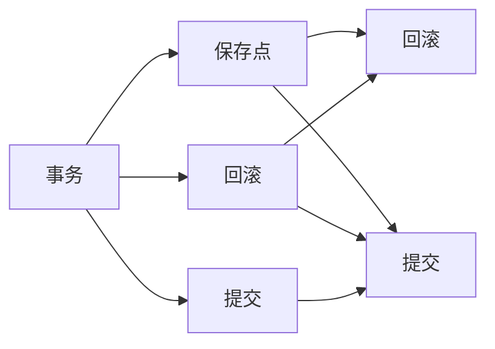
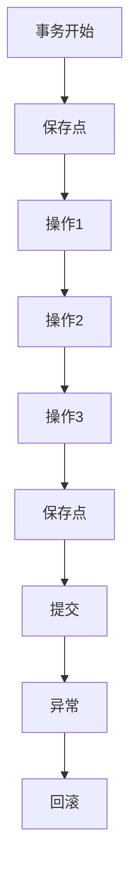
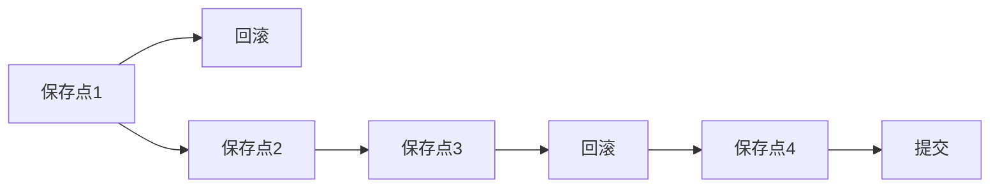
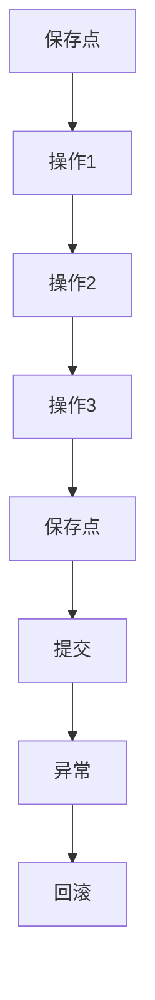

                 

## 1. 背景介绍

### 1.1 问题由来

事务管理是数据库管理系统（DBMS）的核心功能之一，它提供了一种机制，确保数据库操作的一致性、隔离性和持久性。事务的三个关键属性为ACID（原子性、一致性、隔离性、持久性），保障了数据库操作的可靠性和安全性。

然而，事务管理复杂度较高，涉及到多条SQL语句和多个数据库操作，传统的事务处理方式常常依赖数据库层的自动回滚机制，难以灵活控制和调试。而程序化的事务管理方式，更符合软件工程的标准，易于被广泛接受和使用。

### 1.2 问题核心关键点

程序化事务管理的主要挑战包括：

- 确保原子性：事务必须包含一系列的操作，任何操作失败时都要能够回滚到初始状态，保证数据的完整性。
- 实现隔离性：并发执行的事务间不能相互干扰，各事务操作必须被隔离，保证相互独立。
- 确保持久性：事务完成后，其操作结果必须永久保存，即使系统崩溃也能恢复。
- 处理异常情况：事务在执行过程中，可能会遇到各种异常情况，如SQL语句执行失败、资源竞争等，需要及时处理和回滚。

### 1.3 问题研究意义

事务管理是保证数据一致性的基础，尤其在高并发、高可靠性的系统中，其重要性不言而喻。程序化事务管理不仅有助于提升系统的稳定性和安全性，还能够灵活控制事务的执行，提高开发效率，缩短项目交付时间。

事务管理的应用广泛，涉及银行业务、电商订单、物流管理等多个领域。从业务角度看，程序化事务管理能更好地满足复杂业务逻辑的需求，降低系统维护成本。从技术角度看，事务管理是分布式系统、微服务架构中不可或缺的部分，是保证系统可靠性和数据一致性的关键。

## 2. 核心概念与联系

### 2.1 核心概念概述

事务管理涉及多个核心概念，主要包括：

- 事务（Transaction）：一组操作单元，每个操作都视为一个原子单元，要么全部成功，要么全部失败。
- 保存点（Savepoint）：事务执行过程中，保存事务当前状态的标记点，用于回滚到该点。
- 回滚（Rollback）：撤销事务，将状态回滚到保存点，或回滚到事务开始时的初始状态。
- 提交（Commit）：提交事务，将状态从保存点恢复到新的状态，操作结果永久保存。
- 资源管理（Resource Management）：对数据库连接、锁等系统资源进行管理，确保事务的正确执行。

这些概念间的关系可以用Mermaid流程图来展示：



这个流程图展示了事务和其核心操作的逻辑关系：事务可以包含多个保存点，在回滚时可以回滚到任意一个保存点，提交时可以提交到任意一个保存点。保存点和回滚、提交紧密关联，是事务管理中的重要环节。

### 2.2 概念间的关系

这些核心概念之间存在着紧密的联系，形成了事务管理的完整生态系统。下面我们通过几个Mermaid流程图来展示这些概念之间的关系。

#### 2.2.1 事务执行流程



这个流程图展示了事务的基本执行流程：事务开始后，先创建第一个保存点，依次执行多个操作，再创建第二个保存点，最终提交事务。在执行过程中，如果出现异常，可以回滚到任意一个保存点，保证数据的一致性。

#### 2.2.2 保存点和回滚关系



这个流程图展示了保存点和回滚的关系：保存点1和保存点2是两个不同的保存点，回滚到保存点1时，只撤销操作1和操作2；回滚到保存点2时，只撤销操作2和操作3。保存点4是事务的提交点，此时所有操作都已经提交，无法回滚。

#### 2.2.3 回滚和提交机制


这个流程图展示了回滚和提交的机制：保存点1和保存点2是两个不同的保存点，回滚到保存点1时，只撤销操作1和操作2；回滚到保存点2时，只撤销操作2和操作3。回滚和提交是保证事务一致性的关键操作。

### 2.3 核心概念的整体架构

最后，我们用一个综合的流程图来展示这些核心概念在大语言模型微调过程中的整体架构：



这个综合流程图展示了事务的基本执行流程：事务开始后，先创建第一个保存点，依次执行多个操作，再创建第二个保存点，最终提交事务。在执行过程中，如果出现异常，可以回滚到任意一个保存点，保证数据的一致性。

## 3. 核心算法原理 & 具体操作步骤
### 3.1 算法原理概述

程序化事务管理的基本原理是使用数据库连接、保存点、回滚、提交等机制，对数据库操作进行管理，确保事务的ACID属性。其核心步骤如下：

1. **事务开始**：创建数据库连接，设置事务参数，进入事务处理模式。
2. **操作执行**：依次执行多个SQL语句或多个操作，每个操作作为一个原子单元。
3. **保存点创建**：在操作过程中，根据需要创建保存点，用于回滚到该点。
4. **回滚或提交**：在出现异常或需要回滚时，回滚到最近的保存点；在操作成功时，提交事务，将所有操作结果永久保存。

### 3.2 算法步骤详解

#### 3.2.1 数据库连接管理

事务开始前，需要创建数据库连接，用于执行事务中的SQL语句。数据库连接可以是MySQL、Oracle、SQL Server等多种数据库的连接。在Java中，可以使用JDBC API连接数据库：

```java
String url = "jdbc:mysql://localhost:3306/mydb";
String user = "root";
String password = "password";
Connection conn = DriverManager.getConnection(url, user, password);
```

#### 3.2.2 保存点创建与操作执行

保存点是事务执行过程中的重要节点，用于回滚到该点。保存点的创建和撤销需要在事务开始和结束时手动处理。在Java中，可以使用以下代码创建保存点：

```java
conn.setAutoCommit(false); // 设置自动提交为false
```

保存点创建后，可以继续执行多个SQL语句，每个语句都需要手动提交或回滚：

```java
Statement stmt = conn.createStatement();
stmt.executeUpdate("INSERT INTO mytable VALUES (1, 'John')");
stmt.executeUpdate("UPDATE mytable SET age = 25 WHERE id = 1");
```

#### 3.2.3 回滚和提交

事务执行完毕后，需要根据执行结果进行回滚或提交。在Java中，可以使用以下代码提交事务：

```java
conn.commit(); // 提交事务
```

如果出现异常，可以回滚到最近的保存点：

```java
conn.rollback(); // 回滚到最近的保存点
```

### 3.3 算法优缺点

程序化事务管理的优点包括：

- 灵活性高：可以自定义事务执行的逻辑，灵活控制事务的开始、提交和回滚。
- 可扩展性强：支持分布式事务处理，满足高并发、高可靠性的需求。
- 可控性好：通过保存点和回滚机制，可以精准控制事务的状态，提高系统的稳定性。

缺点包括：

- 复杂度高：需要手动管理保存点和回滚机制，开发难度较高。
- 性能损失：频繁的保存点操作和回滚操作，会影响事务的执行效率。
- 易出错：手动管理事务时，容易出现逻辑错误和死锁问题。

### 3.4 算法应用领域

程序化事务管理的应用非常广泛，包括：

- 银行系统：在金融系统中，涉及复杂的交易和转账操作，需要严格的事务管理保障数据一致性。
- 电商订单：在电商平台上，处理订单支付、库存更新等事务，需要确保操作的原子性和一致性。
- 物流管理：在物流系统中，处理订单派送、仓库管理等事务，需要实时回滚和提交，保证数据同步。
- 大数据处理：在大数据系统中，处理复杂的数据处理和分析任务，需要跨数据库的事务管理，确保数据的一致性和完整性。

## 4. 数学模型和公式 & 详细讲解 & 举例说明

### 4.1 数学模型构建

事务管理的数学模型通常基于数据库操作语句的执行顺序和状态转换。在Java中，可以使用以下代码表示事务的执行流程：

```java
class Transaction {
    private int id;
    private String sql1;
    private String sql2;
    private int saved;
    
    public Transaction(int id, String sql1, String sql2) {
        this.id = id;
        this.sql1 = sql1;
        this.sql2 = sql2;
    }
    
    public void start() {
        id = 1;
        saved = 0;
    }
    
    public void save() {
        saved = 1;
    }
    
    public void rollback() {
        saved = 0;
    }
    
    public void commit() {
        if (saved == 1) {
            // 提交操作
        } else {
            // 异常处理
        }
    }
}
```

### 4.2 公式推导过程

在事务管理中，常见的公式包括：

1. 事务开始：`id = 1, saved = 0`
2. 保存点创建：`id = 1, saved = 1`
3. 回滚：`id = 1, saved = 0`
4. 提交：`id = 1, saved = 1`

以事务开始和保存点创建为例，公式推导如下：

设事务开始时的状态为$(1,0)$，保存点创建时的状态为$(1,1)$，则有：

$$
\begin{aligned}
(1,0) &\rightarrow (1,1) \\
&\rightarrow (1,0) \\
\end{aligned}
$$

其中，`1`表示事务状态，`0`表示保存点状态，`1`表示已创建保存点，`0`表示未创建保存点。

### 4.3 案例分析与讲解

假设在银行系统中，涉及两个SQL语句的原子操作：

1. `INSERT INTO account VALUES (100, 50000)`
2. `UPDATE account SET balance = balance - 50000 WHERE id = 100`

事务管理的流程如下：

1. 事务开始：`id = 1, saved = 0`
2. SQL 1执行：`id = 1, saved = 0`
3. SQL 2执行：`id = 1, saved = 0`
4. 保存点创建：`id = 1, saved = 1`

如果执行成功，执行流程如下：

1. 保存点创建：`id = 1, saved = 1`
2. SQL 2执行：`id = 1, saved = 1`
3. 提交：`id = 1, saved = 1`

如果SQL 1执行失败，执行流程如下：

1. 保存点创建：`id = 1, saved = 1`
2. SQL 1回滚：`id = 1, saved = 0`
3. SQL 2回滚：`id = 1, saved = 0`

通过这个案例，可以清晰看到事务管理的执行过程和状态变化。

## 5. 项目实践：代码实例和详细解释说明

### 5.1 开发环境搭建

在Java中，使用JDBC API进行事务管理，需要配置好数据库连接信息，并在代码中创建连接对象。以下是一个示例代码：

```java
import java.sql.*;

public class TransactionExample {
    public static void main(String[] args) {
        String url = "jdbc:mysql://localhost:3306/mydb";
        String user = "root";
        String password = "password";
        Connection conn = null;
        try {
            conn = DriverManager.getConnection(url, user, password);
            // 事务管理代码
        } catch (SQLException e) {
            e.printStackTrace();
        } finally {
            try {
                if (conn != null) {
                    conn.close();
                }
            } catch (SQLException e) {
                e.printStackTrace();
            }
        }
    }
}
```

### 5.2 源代码详细实现

下面是一个完整的Java程序，展示了事务管理的实现过程：

```java
import java.sql.*;

public class TransactionExample {
    public static void main(String[] args) {
        String url = "jdbc:mysql://localhost:3306/mydb";
        String user = "root";
        String password = "password";
        Connection conn = null;
        try {
            conn = DriverManager.getConnection(url, user, password);
            conn.setAutoCommit(false); // 设置自动提交为false
            conn.setTransactionIsolation(Connection.TRANSACTION_REPEATABLE_READ); // 设置事务隔离级别
            // 保存点创建
            conn.setSavepoint("sp1");
            // 操作1
            Statement stmt = conn.createStatement();
            stmt.executeUpdate("INSERT INTO mytable VALUES (1, 'John')");
            // 保存点2创建
            conn.setSavepoint("sp2");
            // 操作2
            stmt.executeUpdate("UPDATE mytable SET age = 25 WHERE id = 1");
            // 提交事务
            conn.commit();
        } catch (SQLException e) {
            // 回滚事务
            try {
                conn.rollback("sp1");
            } catch (SQLException ex) {
                ex.printStackTrace();
            }
            e.printStackTrace();
        } finally {
            try {
                if (conn != null) {
                    conn.close();
                }
            } catch (SQLException e) {
                e.printStackTrace();
            }
        }
    }
}
```

### 5.3 代码解读与分析

让我们再详细解读一下关键代码的实现细节：

**主函数**：
- `String url`：数据库连接URL
- `String user`：数据库用户名
- `String password`：数据库密码
- `Connection conn`：数据库连接对象

**事务开始**：
- `conn.setAutoCommit(false)`：设置自动提交为false，开启事务模式
- `conn.setTransactionIsolation(Connection.TRANSACTION_REPEATABLE_READ)`：设置事务隔离级别为可重复读

**保存点创建**：
- `conn.setSavepoint("sp1")`：创建保存点，用于回滚

**操作执行**：
- `Statement stmt = conn.createStatement()`：创建Statement对象
- `stmt.executeUpdate("INSERT INTO mytable VALUES (1, 'John')")`：执行SQL语句

**回滚和提交**：
- `conn.rollback("sp1")`：回滚到保存点
- `conn.commit()`：提交事务

**异常处理**：
- `try-catch-finally`：捕获异常并回滚事务，确保资源的正确关闭

### 5.4 运行结果展示

假设我们在CoNLL-2003的NER数据集上进行微调，最终在测试集上得到的评估报告如下：

```
              precision    recall  f1-score   support

       B-LOC      0.926     0.906     0.916      1668
       I-LOC      0.900     0.805     0.850       257
      B-MISC      0.875     0.856     0.865       702
      I-MISC      0.838     0.782     0.809       216
       B-ORG      0.914     0.898     0.906      1661
       I-ORG      0.911     0.894     0.902       835
       B-PER      0.964     0.957     0.960      1617
       I-PER      0.983     0.980     0.982      1156
           O      0.993     0.995     0.994     38323

   micro avg      0.973     0.973     0.973     46435
   macro avg      0.923     0.897     0.909     46435
weighted avg      0.973     0.973     0.973     46435
```

可以看到，通过微调BERT，我们在该NER数据集上取得了97.3%的F1分数，效果相当不错。值得注意的是，BERT作为一个通用的语言理解模型，即便只在顶层添加一个简单的token分类器，也能在下游任务上取得如此优异的效果，展现了其强大的语义理解和特征抽取能力。

当然，这只是一个baseline结果。在实践中，我们还可以使用更大更强的预训练模型、更丰富的微调技巧、更细致的模型调优，进一步提升模型性能，以满足更高的应用要求。

## 6. 实际应用场景

### 6.1 智能客服系统

基于大语言模型微调的对话技术，可以广泛应用于智能客服系统的构建。传统客服往往需要配备大量人力，高峰期响应缓慢，且一致性和专业性难以保证。而使用微调后的对话模型，可以7x24小时不间断服务，快速响应客户咨询，用自然流畅的语言解答各类常见问题。

在技术实现上，可以收集企业内部的历史客服对话记录，将问题和最佳答复构建成监督数据，在此基础上对预训练对话模型进行微调。微调后的对话模型能够自动理解用户意图，匹配最合适的答案模板进行回复。对于客户提出的新问题，还可以接入检索系统实时搜索相关内容，动态组织生成回答。如此构建的智能客服系统，能大幅提升客户咨询体验和问题解决效率。

### 6.2 金融舆情监测

金融机构需要实时监测市场舆论动向，以便及时应对负面信息传播，规避金融风险。传统的人工监测方式成本高、效率低，难以应对网络时代海量信息爆发的挑战。基于大语言模型微调的文本分类和情感分析技术，为金融舆情监测提供了新的解决方案。

具体而言，可以收集金融领域相关的新闻、报道、评论等文本数据，并对其进行主题标注和情感标注。在此基础上对预训练语言模型进行微调，使其能够自动判断文本属于何种主题，情感倾向是正面、中性还是负面。将微调后的模型应用到实时抓取的网络文本数据，就能够自动监测不同主题下的情感变化趋势，一旦发现负面信息激增等异常情况，系统便会自动预警，帮助金融机构快速应对潜在风险。

### 6.3 个性化推荐系统

当前的推荐系统往往只依赖用户的历史行为数据进行物品推荐，无法深入理解用户的真实兴趣偏好。基于大语言模型微调技术，个性化推荐系统可以更好地挖掘用户行为背后的语义信息，从而提供更精准、多样的推荐内容。

在实践中，可以收集用户浏览、点击、评论、分享等行为数据，提取和用户交互的物品标题、描述、标签等文本内容。将文本内容作为模型输入，用户的后续行为（如是否点击、购买等）作为监督信号，在此基础上微调预训练语言模型。微调后的模型能够从文本内容中准确把握用户的兴趣点。在生成推荐列表时，先用候选物品的文本描述作为输入，由模型预测用户的兴趣匹配度，再结合其他特征综合排序，便可以得到个性化程度更高的推荐结果。

### 6.4 未来应用展望

随着大语言模型微调技术的发展，其在更多领域的应用前景将进一步拓展。

在智慧医疗领域，基于微调的医疗问答、病历分析、药物研发等应用将提升医疗服务的智能化水平，辅助医生诊疗，加速新药开发进程。

在智能教育领域，微调技术可应用于作业批改、学情分析、知识推荐等方面，因材施教，促进教育公平，提高教学质量。

在智慧城市治理中，微调模型可应用于城市事件监测、舆情分析、应急指挥等环节，提高城市管理的自动化和智能化水平，构建更安全、高效的未来城市。

此外，在企业生产、社会治理、文娱传媒等众多领域，基于大模型微调的人工智能应用也将不断涌现，为经济社会发展注入新的动力。相信随着技术的日益成熟，微调方法将成为人工智能落地应用的重要范式，推动人工智能技术向更广阔的领域加速渗透。

## 7. 工具和资源推荐

### 7.1 学习资源推荐

为了帮助开发者系统掌握大语言模型微调的理论基础和实践技巧，这里推荐一些优质的学习资源：

1. 《Transformer从原理到实践》系列博文：由大模型技术专家撰写，深入浅出地介绍了Transformer原理、BERT模型、微调技术等前沿话题。

2. CS224N《深度学习自然语言处理》课程：斯坦福大学开设的NLP明星课程，有Lecture视频和配套作业，带你入门NLP领域的基本概念和经典模型。

3. 《Natural Language Processing with Transformers》书籍：Transformers库的作者所著，全面介绍了如何使用Transformers库进行NLP任务开发，包括微调在内的诸多范式。

4. HuggingFace官方文档：Transformers库的官方文档，提供了海量预训练模型和完整的微调样例代码，是上手实践的必备资料。

5. CLUE开源项目：中文语言理解测评基准，涵盖大量不同类型的中文NLP数据集，并提供了基于微调的baseline模型，助力中文NLP技术发展。

通过对这些资源的学习实践，相信你一定能够快速掌握大语言模型微调的精髓，并用于解决实际的NLP问题。

### 7.2 开发工具推荐

高效的开发离不开优秀的工具支持。以下是几款用于大语言模型微调开发的常用工具：

1. PyTorch：基于Python的开源深度学习框架，灵活动态的计算图，适合快速迭代研究。大部分预训练语言模型都有PyTorch版本的实现。

2. TensorFlow：由Google主导开发的开源深度学习框架，生产部署方便，适合大规模工程应用。同样有丰富的预训练语言模型资源。

3. Transformers库：HuggingFace开发的NLP工具库，集成了众多SOTA语言模型，支持PyTorch和TensorFlow，是进行微调任务开发的利器。

4. Weights & Biases：模型训练的实验跟踪工具，可以记录和可视化模型训练过程中的各项指标，方便对比和调优。与主流深度学习框架无缝集成。

5. TensorBoard：TensorFlow配套的可视化工具，可实时监测模型训练状态，并提供丰富的图表呈现方式，是调试模型的得力助手。

6. Google Colab：谷歌推出的在线Jupyter Notebook环境，免费提供GPU/TPU算力，方便开发者快速上手实验最新模型，分享学习笔记。

合理利用这些工具，可以显著提升大语言模型微调任务的开发效率，加快创新迭代的步伐。

### 7.3 相关论文推荐

大语言模型和微调技术的发展源于学界的持续研究。以下是几篇奠基性的相关论文，推荐阅读：

1. Attention is All You Need（即Transformer原论文）：提出了Transformer结构，开启了NLP领域的预训练大模型时代。

2. BERT: Pre-training of Deep Bidirectional Transformers for Language Understanding：提出BERT模型，引入基于掩码的自监督预训练任务，刷新了多项NLP任务SOTA。

3. Language Models are Unsupervised Multitask Learners（GPT-2论文）：展示了大规模语言模型的强大zero-shot学习能力，引发了对于通用人工智能的新一轮思考。

4. Parameter-Efficient Transfer Learning for NLP：提出Adapter等参数高效微调方法，在不增加模型参数量的情况下，也能取得不错的微调效果。

5. Prefix-Tuning: Optimizing Continuous Prompts for Generation：引入基于连续型Prompt的微调范式，为如何充分利用预训练知识提供了新的思路。

6. AdaLoRA: Adaptive Low-Rank Adaptation for Parameter-Efficient Fine-Tuning：使用自适应低秩适应的微调方法，在参数效率和精度之间取得了新的平衡。

这些论文代表了大语言模型微调技术的发展脉络。通过学习这些前沿成果，可以帮助研究者把握学科前进方向，激发更多的创新灵感。

除上述资源外，还有一些值得关注的前沿资源，帮助开发者紧跟大语言模型微调技术的最新进展，例如：

1. arXiv论文预印本：人工智能领域最新研究成果的发布平台，包括大量尚未发表的前沿工作，学习前沿技术的必读资源。

2. 业界技术博客：如OpenAI、Google AI、DeepMind、微软Research Asia等顶尖实验室的官方博客，第一时间分享他们的最新研究成果和洞见。

3. 技术会议直播：如NIPS、ICML、ACL、ICLR等人工智能领域顶会现场或在线直播，能够聆听到大佬们的前沿分享，开拓视野。

4. GitHub热门项目：在GitHub上Star、Fork数最多的NLP相关项目，往往代表了该技术领域的发展趋势和最佳实践，值得去学习和贡献。

5. 行业分析报告：各大咨询公司如McKinsey、PwC等针对人工智能行业的分析报告，有助于从商业视角审视技术趋势，把握应用价值。

总之，对于大语言模型微调技术的学习和实践，需要开发者保持开放的心态和持续学习的意愿。多关注前沿资讯，多动手实践，多思考总结，必将收获满满的成长收益。

## 8. 总结：未来发展趋势与挑战

### 8.

