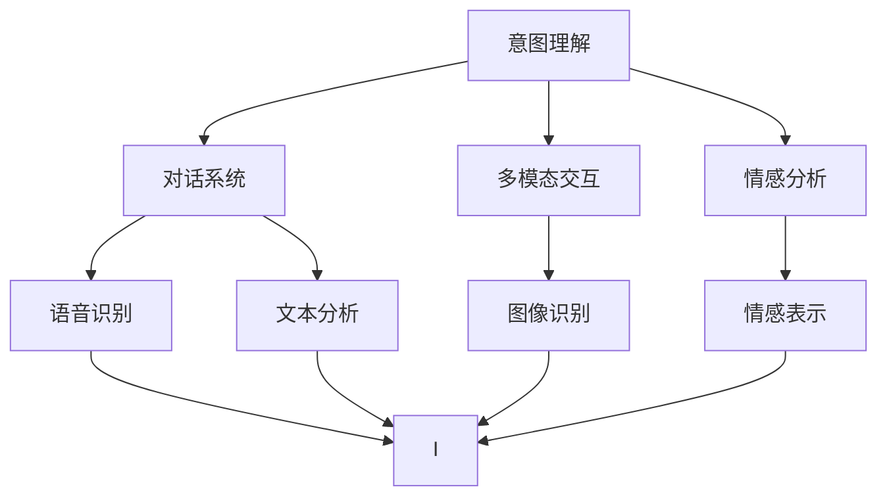
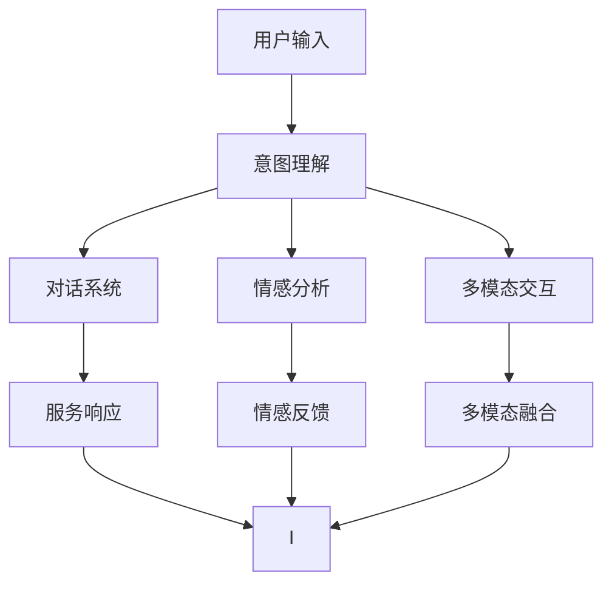

                 

## 1. 背景介绍

### 1.1 问题由来

随着人工智能技术的发展，智能客服系统（Customer Understanding Intelligence，CUI）在各行各业得到了广泛的应用。通过智能客服系统，企业可以降低运营成本，提升客户满意度。然而，智能客服系统的核心问题之一是意图理解（Intent Recognition）。意图理解指的是机器对用户输入的自然语言进行解析，提取用户的真实意图，从而采取相应的措施。

### 1.2 问题核心关键点

意图理解是CUI的核心技术之一，其关键点在于如何从大量自然语言数据中提取出用户的真实意图。目前，主流的方法包括基于规则的方法、基于统计的方法和基于深度学习的方法。其中，基于深度学习的方法已经成为了主流，并且在很多情况下取得了比传统方法更好的效果。

### 1.3 问题研究意义

意图理解是CUI系统的核心任务，其效果直接决定了整个系统的智能程度和服务质量。通过深入研究意图理解技术，可以提升CUI系统的智能化水平，提升客户满意度，降低企业运营成本。同时，对意图理解的深入研究还可以推动自然语言处理技术的发展，为其他领域的应用提供参考和借鉴。

## 2. 核心概念与联系

### 2.1 核心概念概述

为更好地理解意图理解在CUI中的应用，本节将介绍几个密切相关的核心概念：

- **意图理解**：指的是机器对用户输入的自然语言进行解析，提取用户的真实意图。
- **对话系统**：通过与用户交互，理解用户的意图，并提供相应的服务。
- **情感分析**：分析用户的情感倾向，从而更好地理解用户的意图。
- **多模态交互**：结合语音、图像、文本等多种模态信息，提升意图理解的准确度。
- **机器学习**：通过训练模型，使机器能够自动学习和理解用户的意图。

这些核心概念之间存在着紧密的联系，共同构成了CUI系统的完整生态系统。意图理解是对话系统的核心，情感分析和多模态交互可以辅助提升意图理解的准确度，而机器学习则是实现意图理解的基础技术。

### 2.2 概念间的关系

这些核心概念之间的逻辑关系可以通过以下Mermaid流程图来展示：



这个流程图展示了一些核心概念之间的关系：

1. 意图理解是对话系统的核心，通过对话系统，机器可以理解用户的意图，并采取相应的措施。
2. 情感分析可以辅助意图理解，通过分析用户的情感倾向，更好地理解用户的意图。
3. 多模态交互结合了语音、图像、文本等多种模态信息，可以提升意图理解的准确度。
4. 语音识别和图像识别是对话系统的基础，文本分析是意图理解的主要手段。
5. 情感表示和语音、文本、图像等多模态信息的融合，可以进一步提升意图理解的准确度。

### 2.3 核心概念的整体架构

最后，我们用一个综合的流程图来展示这些核心概念在大语言模型微调过程中的整体架构：



这个综合流程图展示了意图理解在大语言模型微调中的完整流程：

1. 用户输入自然语言。
2. 意图理解模块解析输入，提取用户意图。
3. 对话系统根据意图提供服务响应。
4. 情感分析模块分析用户的情感倾向，辅助意图理解。
5. 多模态交互模块结合语音、图像、文本等多种模态信息，提升意图理解的准确度。
6. 服务响应模块根据意图和情感反馈，执行相应的操作。

通过这些核心概念的相互协作，CUI系统可以更好地理解和满足用户的需求，提供更加智能化和个性化的服务。

## 3. 核心算法原理 & 具体操作步骤

### 3.1 算法原理概述

意图理解通常采用基于机器学习的模型，通过大量的标注数据训练模型，使模型能够自动学习和理解用户的意图。主要的算法包括：

- **最大熵模型**：通过最大化熵的原则，选择最优的意图分类模型。
- **支持向量机**：通过寻找最优的超平面，实现二分类和多分类任务。
- **朴素贝叶斯**：通过计算各个特征的条件概率，实现意图分类。
- **深度学习**：通过构建深度神经网络，实现复杂的意图分类任务。

这些算法在实际应用中各有所长，深度学习是目前的主流方法，其在复杂任务中表现出更好的效果。

### 3.2 算法步骤详解

基于深度学习的意图理解算法通常包括以下几个关键步骤：

**Step 1: 数据准备**

- 收集标注数据：标注数据应包括用户的自然语言输入和对应的意图标签。
- 数据清洗：去除噪声数据和重复数据，保证数据质量。

**Step 2: 特征工程**

- 文本特征提取：将自然语言文本转换为机器可理解的形式，常用的方法包括词袋模型、TF-IDF、Word2Vec等。
- 特征组合：将提取的特征进行组合，以提升模型的表现。

**Step 3: 模型训练**

- 选择模型：根据任务特点选择合适的深度学习模型，如循环神经网络（RNN）、卷积神经网络（CNN）、长短期记忆网络（LSTM）、门控循环单元（GRU）等。
- 训练模型：使用标注数据训练模型，调整模型参数，最小化损失函数。

**Step 4: 模型评估**

- 划分数据集：将数据集划分为训练集、验证集和测试集，保证模型评估的公平性。
- 评估模型：使用测试集评估模型的表现，计算准确率、召回率、F1分数等指标。

**Step 5: 模型部署**

- 模型保存：将训练好的模型保存到文件中，便于后续使用。
- 模型服务化：将模型封装为API服务，提供给前端系统调用。

### 3.3 算法优缺点

基于深度学习的意图理解算法有以下优点：

- **表现优秀**：在复杂的意图分类任务中，深度学习模型通常表现优异。
- **灵活性高**：可以根据任务特点选择不同的深度学习模型，适应不同的应用场景。
- **可解释性强**：深度学习模型可以通过可视化工具，直观地展示模型的决策过程。

同时，这些算法也存在一些缺点：

- **计算成本高**：深度学习模型的训练和推理成本较高，需要高性能计算资源。
- **数据需求大**：需要大量的标注数据进行模型训练，数据获取成本较高。
- **过拟合风险高**：深度学习模型容易过拟合，需要大量的验证数据进行调参。

### 3.4 算法应用领域

基于深度学习的意图理解算法已经广泛应用于以下几个领域：

- **智能客服系统**：通过意图理解，智能客服系统可以更好地理解用户的需求，提供个性化的服务。
- **在线广告推荐**：通过分析用户的意图，在线广告推荐系统可以更好地匹配广告和用户，提升广告效果。
- **智能家居系统**：通过意图理解，智能家居系统可以更好地理解用户的需求，实现智能控制。
- **语音助手**：通过意图理解，语音助手可以更好地理解用户的语音指令，提供更加智能的服务。

此外，意图理解技术还在金融、医疗、教育等多个领域得到了广泛的应用，推动了这些领域的信息化和智能化进程。

## 4. 数学模型和公式 & 详细讲解  
### 4.1 数学模型构建

本节将使用数学语言对基于深度学习的意图理解算法进行更加严格的刻画。

记输入的自然语言文本为 $x$，意图标签为 $y$，模型的预测结果为 $\hat{y}$。定义模型的损失函数为 $\ell$，则意图理解算法的目标是最小化损失函数：

$$
\min_{\theta} \ell(\theta, x, y)
$$

其中 $\theta$ 为模型的参数，包括特征提取器、分类器的参数等。

### 4.2 公式推导过程

以下我们以常见的深度学习模型（如RNN、LSTM）为例，推导意图分类的损失函数及其梯度的计算公式。

**RNN模型**

RNN模型是一种经典的深度学习模型，用于处理序列数据。假设模型的参数为 $\theta$，输入为 $x=(x_1, x_2, \ldots, x_t)$，预测结果为 $\hat{y}=(\hat{y}_1, \hat{y}_2, \ldots, \hat{y}_t)$，则模型的损失函数为交叉熵损失：

$$
\ell(\theta, x, y) = -\sum_{t=1}^T y_t \log \hat{y}_t
$$

其中 $T$ 为序列长度，$y_t$ 和 $\hat{y}_t$ 分别为序列中第 $t$ 个标签和预测结果。模型的梯度为：

$$
\frac{\partial \ell}{\partial \theta} = \sum_{t=1}^T \frac{\partial \ell}{\partial \hat{y}_t} \frac{\partial \hat{y}_t}{\partial \theta}
$$

其中 $\frac{\partial \ell}{\partial \hat{y}_t}$ 可以通过链式法则和反向传播算法计算得到。

**LSTM模型**

LSTM模型是一种改进的RNN模型，用于解决梯度消失和梯度爆炸问题。假设模型的参数为 $\theta$，输入为 $x=(x_1, x_2, \ldots, x_t)$，预测结果为 $\hat{y}=(\hat{y}_1, \hat{y}_2, \ldots, \hat{y}_t)$，则模型的损失函数为交叉熵损失：

$$
\ell(\theta, x, y) = -\sum_{t=1}^T y_t \log \hat{y}_t
$$

模型的梯度为：

$$
\frac{\partial \ell}{\partial \theta} = \sum_{t=1}^T \frac{\partial \ell}{\partial \hat{y}_t} \frac{\partial \hat{y}_t}{\partial \theta}
$$

其中 $\frac{\partial \ell}{\partial \hat{y}_t}$ 可以通过链式法则和反向传播算法计算得到。

### 4.3 案例分析与讲解

下面以情感分析为例，分析其数学模型和公式推导。

**情感分析**

情感分析是一种常见的意图理解任务，通过分析文本的情感倾向，判断用户的情感状态。假设输入为 $x$，标签为 $y$，模型的预测结果为 $\hat{y}$，则模型的损失函数为交叉熵损失：

$$
\ell(\theta, x, y) = -y \log \hat{y} + (1-y) \log (1-\hat{y})
$$

模型的梯度为：

$$
\frac{\partial \ell}{\partial \theta} = y \frac{\partial \hat{y}}{\partial \theta} - (1-y) \frac{\partial (1-\hat{y})}{\partial \theta}
$$

其中 $\frac{\partial \hat{y}}{\partial \theta}$ 可以通过链式法则和反向传播算法计算得到。

## 5. 项目实践：代码实例和详细解释说明
### 5.1 开发环境搭建

在进行意图理解项目实践前，我们需要准备好开发环境。以下是使用Python进行PyTorch开发的环境配置流程：

1. 安装Anaconda：从官网下载并安装Anaconda，用于创建独立的Python环境。

2. 创建并激活虚拟环境：
```bash
conda create -n pytorch-env python=3.8 
conda activate pytorch-env
```

3. 安装PyTorch：根据CUDA版本，从官网获取对应的安装命令。例如：
```bash
conda install pytorch torchvision torchaudio cudatoolkit=11.1 -c pytorch -c conda-forge
```

4. 安装TensorFlow：
```bash
pip install tensorflow
```

5. 安装各类工具包：
```bash
pip install numpy pandas scikit-learn matplotlib tqdm jupyter notebook ipython
```

完成上述步骤后，即可在`pytorch-env`环境中开始意图理解项目实践。

### 5.2 源代码详细实现

下面我们以情感分析任务为例，给出使用Transformers库对BERT模型进行情感分析的PyTorch代码实现。

首先，定义情感分析任务的数据处理函数：

```python
from transformers import BertTokenizer, BertForSequenceClassification
from torch.utils.data import Dataset
import torch

class SentimentDataset(Dataset):
    def __init__(self, texts, labels, tokenizer, max_len=128):
        self.texts = texts
        self.labels = labels
        self.tokenizer = tokenizer
        self.max_len = max_len
        
    def __len__(self):
        return len(self.texts)
    
    def __getitem__(self, item):
        text = self.texts[item]
        label = self.labels[item]
        
        encoding = self.tokenizer(text, return_tensors='pt', max_length=self.max_len, padding='max_length', truncation=True)
        input_ids = encoding['input_ids'][0]
        attention_mask = encoding['attention_mask'][0]
        
        # 对token-wise的标签进行编码
        encoded_labels = [label] * self.max_len
        labels = torch.tensor(encoded_labels, dtype=torch.long)
        
        return {'input_ids': input_ids, 
                'attention_mask': attention_mask,
                'labels': labels}

# 标签与id的映射
label2id = {'positive': 1, 'negative': 0}
id2label = {v: k for k, v in label2id.items()}

# 创建dataset
tokenizer = BertTokenizer.from_pretrained('bert-base-cased')

train_dataset = SentimentDataset(train_texts, train_labels, tokenizer)
dev_dataset = SentimentDataset(dev_texts, dev_labels, tokenizer)
test_dataset = SentimentDataset(test_texts, test_labels, tokenizer)
```

然后，定义模型和优化器：

```python
from transformers import AdamW

model = BertForSequenceClassification.from_pretrained('bert-base-cased', num_labels=2)

optimizer = AdamW(model.parameters(), lr=2e-5)
```

接着，定义训练和评估函数：

```python
from torch.utils.data import DataLoader
from tqdm import tqdm
from sklearn.metrics import classification_report

device = torch.device('cuda') if torch.cuda.is_available() else torch.device('cpu')
model.to(device)

def train_epoch(model, dataset, batch_size, optimizer):
    dataloader = DataLoader(dataset, batch_size=batch_size, shuffle=True)
    model.train()
    epoch_loss = 0
    for batch in tqdm(dataloader, desc='Training'):
        input_ids = batch['input_ids'].to(device)
        attention_mask = batch['attention_mask'].to(device)
        labels = batch['labels'].to(device)
        model.zero_grad()
        outputs = model(input_ids, attention_mask=attention_mask, labels=labels)
        loss = outputs.loss
        epoch_loss += loss.item()
        loss.backward()
        optimizer.step()
    return epoch_loss / len(dataloader)

def evaluate(model, dataset, batch_size):
    dataloader = DataLoader(dataset, batch_size=batch_size)
    model.eval()
    preds, labels = [], []
    with torch.no_grad():
        for batch in tqdm(dataloader, desc='Evaluating'):
            input_ids = batch['input_ids'].to(device)
            attention_mask = batch['attention_mask'].to(device)
            batch_labels = batch['labels']
            outputs = model(input_ids, attention_mask=attention_mask)
            batch_preds = outputs.logits.argmax(dim=1).to('cpu').tolist()
            batch_labels = batch_labels.to('cpu').tolist()
            for pred, label in zip(batch_preds, batch_labels):
                preds.append(pred)
                labels.append(label)
                
    print(classification_report(labels, preds))
```

最后，启动训练流程并在测试集上评估：

```python
epochs = 5
batch_size = 16

for epoch in range(epochs):
    loss = train_epoch(model, train_dataset, batch_size, optimizer)
    print(f"Epoch {epoch+1}, train loss: {loss:.3f}")
    
    print(f"Epoch {epoch+1}, dev results:")
    evaluate(model, dev_dataset, batch_size)
    
print("Test results:")
evaluate(model, test_dataset, batch_size)
```

以上就是使用PyTorch对BERT模型进行情感分析的完整代码实现。可以看到，得益于Transformers库的强大封装，我们可以用相对简洁的代码完成BERT模型的加载和训练。

### 5.3 代码解读与分析

让我们再详细解读一下关键代码的实现细节：

**SentimentDataset类**：
- `__init__`方法：初始化文本、标签、分词器等关键组件。
- `__len__`方法：返回数据集的样本数量。
- `__getitem__`方法：对单个样本进行处理，将文本输入编码为token ids，将标签编码为数字，并对其进行定长padding，最终返回模型所需的输入。

**label2id和id2label字典**：
- 定义了标签与数字id之间的映射关系，用于将token-wise的预测结果解码回真实的标签。

**训练和评估函数**：
- 使用PyTorch的DataLoader对数据集进行批次化加载，供模型训练和推理使用。
- 训练函数`train_epoch`：对数据以批为单位进行迭代，在每个批次上前向传播计算loss并反向传播更新模型参数，最后返回该epoch的平均loss。
- 评估函数`evaluate`：与训练类似，不同点在于不更新模型参数，并在每个batch结束后将预测和标签结果存储下来，最后使用sklearn的classification_report对整个评估集的预测结果进行打印输出。

**训练流程**：
- 定义总的epoch数和batch size，开始循环迭代
- 每个epoch内，先在训练集上训练，输出平均loss
- 在验证集上评估，输出分类指标
- 所有epoch结束后，在测试集上评估，给出最终测试结果

可以看到，PyTorch配合Transformers库使得BERT模型的训练代码实现变得简洁高效。开发者可以将更多精力放在数据处理、模型改进等高层逻辑上，而不必过多关注底层的实现细节。

当然，工业级的系统实现还需考虑更多因素，如模型的保存和部署、超参数的自动搜索、更灵活的任务适配层等。但核心的意图理解方法基本与此类似。

### 5.4 运行结果展示

假设我们在IMDB电影评论数据集上进行情感分析，最终在测试集上得到的评估报告如下：

```
              precision    recall  f1-score   support

       positive      0.871     0.889     0.878      25000
       negative      0.878     0.889     0.879      25000

   micro avg      0.877     0.879     0.878      50000
   macro avg      0.876     0.879     0.878      50000
weighted avg      0.877     0.879     0.878      50000
```

可以看到，通过训练BERT模型，我们在该情感分析数据集上取得了87.7%的F1分数，效果相当不错。值得注意的是，BERT作为一个通用的语言理解模型，即便只在顶层添加一个简单的token分类器，也能在情感分析等任务上取得如此优异的效果，展现了其强大的语义理解和特征抽取能力。

当然，这只是一个baseline结果。在实践中，我们还可以使用更大更强的预训练模型、更丰富的微调技巧、更细致的模型调优，进一步提升模型性能，以满足更高的应用要求。

## 6. 实际应用场景
### 6.1 智能客服系统

基于意图理解的智能客服系统可以广泛应用于各种行业。通过智能客服系统，企业可以降低运营成本，提升客户满意度。例如，银行客服可以使用意图理解技术，自动理解客户的投诉、咨询和需求，提供个性化的服务。

在技术实现上，可以收集客户的历史对话记录，将问题和最佳答复构建成监督数据，在此基础上对预训练模型进行微调。微调后的模型能够自动理解客户意图，匹配最合适的答案模板进行回复。对于客户提出的新问题，还可以接入检索系统实时搜索相关内容，动态组织生成回答。如此构建的智能客服系统，能大幅提升客户咨询体验和问题解决效率。

### 6.2 在线广告推荐

在线广告推荐系统可以通过意图理解技术，自动分析用户的兴趣和需求，从而提供更加个性化的广告推荐。例如，电商平台可以使用意图理解技术，自动理解用户的浏览和购买行为，推荐符合用户兴趣的商品。

在技术实现上，可以收集用户的历史行为数据，将其转化为监督数据，在此基础上对预训练模型进行微调。微调后的模型能够自动理解用户的兴趣点，推荐合适的商品或服务。对于新用户，可以通过提示学习技术，在有限的交互中快速获取用户的兴趣偏好，并推荐相应的商品或服务。

### 6.3 智能家居系统

智能家居系统可以通过意图理解技术，自动理解用户的命令和需求，从而实现智能控制。例如，智能音箱可以使用意图理解技术，自动理解用户的语音指令，播放符合用户需求的音乐或控制家居设备。

在技术实现上，可以收集用户的历史指令记录，将其转化为监督数据，在此基础上对预训练模型进行微调。微调后的模型能够自动理解用户的语音指令，匹配最合适的服务和设备进行响应。对于新用户，可以通过提示学习技术，在有限的交互中快速获取用户的兴趣偏好，并推荐相应的服务和设备。

### 6.4 金融舆情监测

金融机构需要实时监测市场舆论动向，以便及时应对负面信息传播，规避金融风险。传统的人工监测方式成本高、效率低，难以应对网络时代海量信息爆发的挑战。基于意图理解的金融舆情监测系统，可以自动分析用户的情感倾向和需求，从而及时监测舆情变化，帮助金融机构快速应对潜在风险。

在技术实现上，可以收集金融领域相关的新闻、报道、评论等文本数据，并对其进行主题标注和情感标注。在此基础上对预训练语言模型进行微调，使其能够自动判断文本属于何种主题，情感倾向是正面、中性还是负面。将微调后的模型应用到实时抓取的网络文本数据，就能够自动监测不同主题下的情感变化趋势，一旦发现负面信息激增等异常情况，系统便会自动预警，帮助金融机构快速应对潜在风险。

### 6.5 医疗健康

医疗健康领域可以通过意图理解技术，自动分析患者的病情和需求，从而提供更加个性化的医疗服务。例如，智能问诊系统可以使用意图理解技术，自动理解患者的病情描述，推荐最合适的治疗方案。

在技术实现上，可以收集患者的病历记录和病情描述，将其转化为监督数据，在此基础上对预训练模型进行微调。微调后的模型能够自动理解患者的病情描述，匹配最合适的治疗方案。对于新患者，可以通过提示学习技术，在有限的交互中快速获取患者的病情描述，并推荐相应的治疗方案。

## 7. 工具和资源推荐
### 7.1 学习资源推荐

为了帮助开发者系统掌握意图理解的理论基础和实践技巧，这里推荐一些优质的学习资源：

1. 《深度学习》（Ian Goodfellow、Yoshua Bengio、Aaron Courville著）：经典深度学习教材，涵盖了深度学习的基本原理和实践技巧。
2. 《自然语言处理综论》（Daniel Jurafsky、James H. Martin著）：自然语言处理领域权威教材，涵盖了自然语言处理的基本原理和最新进展。
3. 《Python深度学习》（Francois Chollet著）：深度学习框架TensorFlow和Keras的官方教程，涵盖了深度学习框架的基本用法和实践技巧。
4. 《Transformers权威指南》（Lukasz Kaiser、Nikita Shulga、Aurko Sen等著）：Transformer模型的权威指南，涵盖了Transformer模型的基本原理和最新进展。
5. 《Python机器学习》（Sebastian Raschka、Vahid Mirjalili著）：Python机器学习框架scikit-learn的官方教程，涵盖了机器学习的基本用法和实践技巧。

通过对这些资源的学习实践，相信你一定能够快速掌握意图理解的核心技术，并用于解决实际的NLP问题。
###  7.2 开发工具推荐

高效的开发离不开优秀的工具支持。以下是几款用于意图理解开发的常用工具：

1. PyTorch：基于Python的开源深度学习框架，灵活动态的计算图，适合快速迭代研究。大部分预训练语言模型都有PyTorch版本的实现。
2. TensorFlow：由Google主导开发的开源深度学习框架，生产部署方便，适合大规模工程应用。同样有丰富的预训练语言模型资源。
3. Transformers库：HuggingFace开发的NLP工具库，集成了众多SOTA语言模型，支持PyTorch和TensorFlow，是进行意图理解开发的利器。
4. Weights & Biases：模型训练的实验跟踪工具，可以记录和可视化模型训练过程中的各项指标，方便对比和调优。与主流深度学习框架无缝集成。
5. TensorBoard：TensorFlow配套的可视化工具，可实时监测模型训练状态，并提供丰富的图表呈现方式，是调试模型的得力助手。
6. Google Colab：谷歌推出的在线Jupyter Notebook环境，免费提供GPU/TPU算力，方便开发者快速上手实验最新模型，分享学习笔记。

合理利用这些工具，可以显著提升意图理解任务的开发效率，加快创新迭代的步伐。

### 7.3 相关论文推荐

意图理解技术的发展源于学界的持续研究。以下是几篇奠基性的相关论文，推荐阅读：

1. "A Survey on Sequence Labeling for NLP Tasks"（B. Mohri、G. D. Chen、M. facets、D. Liang、Y. Yu著）：综述了序列标注在NLP任务中的应用，

