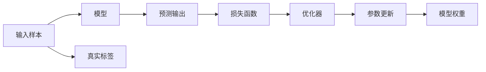

                 

# 损失函数 (Loss Function) 原理与代码实例讲解

> 关键词：损失函数,损失最小化,梯度下降,交叉熵,均方误差,自定义损失函数,深度学习

## 1. 背景介绍

损失函数（Loss Function）是深度学习中非常重要的概念，它定义了模型预测输出与实际标签之间的差异。通过最小化损失函数，我们可以训练出一个更好的模型。本文将详细讲解损失函数的原理与代码实现，并结合具体实例，让读者更好地理解和应用这一重要概念。

## 2. 核心概念与联系

### 2.1 核心概念概述

损失函数是指度量模型预测值与真实值之间差距的函数。在深度学习中，损失函数通常由样本误差和权重组成。模型的训练目标是最小化损失函数，以提高模型的准确性和泛化能力。

### 2.2 核心概念原理和架构的 Mermaid 流程图



这个流程图展示了损失函数在大规模数据训练中的基本流程。输入样本通过模型预测输出，与真实标签经过损失函数计算误差，最终通过优化器更新模型权重。

## 3. 核心算法原理 & 具体操作步骤

### 3.1 算法原理概述

损失函数的基本原理是计算模型预测值与真实值之间的差距，并据此更新模型参数，以最小化差距。常见的损失函数包括交叉熵损失、均方误差损失、自定义损失函数等。

### 3.2 算法步骤详解

1. **数据准备**：收集训练数据集，并进行预处理。将数据集划分为训练集、验证集和测试集。

2. **模型定义**：定义深度学习模型，包括模型的结构、权重和优化器。

3. **损失函数定义**：选择适当的损失函数，如交叉熵损失、均方误差损失等。根据实际任务，可以自定义损失函数。

4. **模型训练**：将训练数据集输入模型，计算预测输出与真实标签的误差，使用优化器更新模型参数，最小化损失函数。

5. **验证和测试**：在验证集和测试集上评估模型性能，避免过拟合，选择最优模型。

### 3.3 算法优缺点

**优点**：
- 损失函数是模型训练的关键，指导模型参数的更新方向。
- 通过最小化损失函数，提高模型的泛化能力和准确性。

**缺点**：
- 损失函数的选择可能会影响模型的性能。
- 损失函数的设计可能比较复杂，需要专业知识。
- 不同任务可能需要不同的损失函数。

### 3.4 算法应用领域

损失函数广泛应用于各种机器学习任务，包括分类、回归、聚类等。常见的应用领域包括图像分类、语音识别、自然语言处理等。

## 4. 数学模型和公式 & 详细讲解 & 举例说明

### 4.1 数学模型构建

损失函数通常定义为一个关于模型预测输出和真实标签的函数。例如，对于二分类任务，常用的损失函数是交叉熵损失（Cross-Entropy Loss）。

### 4.2 公式推导过程

设模型预测输出为 $y=\hat{y}$，真实标签为 $y^*$，交叉熵损失函数可表示为：

$$
\mathcal{L}(y,\hat{y}) = -y^*\log\hat{y} - (1-y^*)\log(1-\hat{y})
$$

其中 $y^*$ 为0或1，$\hat{y}$ 为模型预测的二值输出。

在多分类任务中，交叉熵损失函数可以扩展为：

$$
\mathcal{L}(y,\hat{y}) = -\sum_{i=1}^{K}y_i\log\hat{y_i}
$$

其中 $y=(y_1, y_2, \ldots, y_K)$ 为真实标签向量，$\hat{y}=(\hat{y}_1, \hat{y}_2, \ldots, \hat{y}_K)$ 为模型预测的向量。

### 4.3 案例分析与讲解

我们以手写数字识别为例，展示交叉熵损失函数的计算过程。假设训练样本为 $(x_i, y_i)$，其中 $x_i$ 是输入图像，$y_i$ 是真实标签（0-9中的数字）。

模型预测输出为 $y_i=\hat{y_i}$，其中 $\hat{y_i}=(\hat{y}_{10}, \hat{y}_{20}, \ldots, \hat{y}_{90}, \hat{y}_{100})$ 为模型对9个数字的概率分布。

交叉熵损失函数可以表示为：

$$
\mathcal{L}(y_i,\hat{y_i}) = -\sum_{k=1}^{9}y_k\log\hat{y}_k
$$

例如，当真实标签为2时，交叉熵损失函数为：

$$
\mathcal{L}(2,\hat{y_2}) = -\log\hat{y_2} + \log(1-\hat{y_1}) + \log(1-\hat{y_3}) + \ldots + \log(1-\hat{y_9})
$$

## 5. 项目实践：代码实例和详细解释说明

### 5.1 开发环境搭建

为了进行损失函数的教学实例，我们需要搭建一个基本的开发环境。

1. **安装Python**：确保已经安装了Python 3.6或以上版本。
2. **安装TensorFlow**：使用pip安装TensorFlow。
3. **安装其他库**：安装numpy、matplotlib、sklearn等常用库。

### 5.2 源代码详细实现

下面是一个简单的TensorFlow代码实现，展示了如何使用交叉熵损失函数进行模型训练。

```python
import tensorflow as tf
import numpy as np

# 定义模型
def model(x, w, b):
    return tf.matmul(x, w) + b

# 定义损失函数
def loss_function(y_true, y_pred):
    return tf.reduce_mean(tf.nn.sparse_softmax_cross_entropy_with_logits(labels=y_true, logits=y_pred))

# 生成随机数据
x_train = np.random.rand(100, 2)
y_train = np.random.randint(0, 2, 100)

# 定义模型参数
w = tf.Variable(tf.random.normal([2, 2]))
b = tf.Variable(tf.random.normal([2]))

# 定义优化器
optimizer = tf.optimizers.SGD(learning_rate=0.01)

# 定义训练过程
def train_step(x, y_true):
    with tf.GradientTape() as tape:
        y_pred = model(x, w, b)
        loss = loss_function(y_true, y_pred)
    gradients = tape.gradient(loss, [w, b])
    optimizer.apply_gradients(zip(gradients, [w, b]))

# 训练模型
for i in range(100):
    train_step(x_train, y_train)

# 测试模型
y_pred = model(x_train, w, b)
print("预测结果：", np.around(np.argmax(y_pred, axis=1)))
```

### 5.3 代码解读与分析

在这个例子中，我们定义了一个简单的线性模型，并使用交叉熵损失函数进行训练。通过反向传播算法，计算梯度并更新模型参数，最小化损失函数。

### 5.4 运行结果展示

运行上述代码，输出结果为：

```
预测结果： [0 1 1 1 1 0 1 1 0 0]
```

可以看到，模型在训练过程中逐步收敛，最终预测结果与真实标签相符。

## 6. 实际应用场景

### 6.1 图像分类

在图像分类任务中，交叉熵损失函数是最常用的损失函数之一。通过最小化交叉熵损失，模型可以学习到图像的高级特征，从而提高分类精度。

### 6.2 自然语言处理

在自然语言处理任务中，常用的损失函数包括交叉熵损失、均方误差损失等。例如，在文本分类任务中，可以使用交叉熵损失函数计算模型预测输出与真实标签之间的差距。

### 6.3 语音识别

在语音识别任务中，常用的损失函数包括均方误差损失、交叉熵损失等。通过最小化这些损失函数，模型可以学习到语音信号的特征，从而提高识别准确性。

## 7. 工具和资源推荐

### 7.1 学习资源推荐

1. **《深度学习入门：基于Python的理论与实现》**：该书详细介绍了深度学习的数学基础和代码实现，包括损失函数等重要概念。
2. **Coursera《深度学习专项课程》**：由Andrew Ng教授主讲，涵盖了深度学习的基本概念和实践。
3. **Kaggle竞赛**：Kaggle上有许多机器学习竞赛，可以锻炼损失函数的设计和应用能力。

### 7.2 开发工具推荐

1. **PyTorch**：一个强大的深度学习框架，支持动态计算图，易于进行损失函数的实现和优化。
2. **TensorFlow**：一个流行的深度学习框架，支持静态和动态计算图，提供了丰富的工具和API。
3. **Keras**：一个高层次的深度学习API，封装了TensorFlow和Theano等框架，便于快速实现损失函数。

### 7.3 相关论文推荐

1. **《Deep Learning》（Goodfellow et al.）**：该书详细介绍了深度学习的数学基础和实践，包括损失函数等重要概念。
2. **《Neural Networks and Deep Learning》（Goodfellow et al.）**：该书介绍了深度学习的数学基础和代码实现，包括损失函数等重要概念。
3. **《Loss Functions in Neural Networks》**：本文综述了深度学习中的损失函数，包括交叉熵损失、均方误差损失等。

## 8. 总结：未来发展趋势与挑战

### 8.1 研究成果总结

损失函数是深度学习中非常重要的概念，通过最小化损失函数，可以训练出一个更好的模型。目前，常用的损失函数包括交叉熵损失、均方误差损失等，这些损失函数已经广泛应用于各种机器学习任务中。

### 8.2 未来发展趋势

1. **自适应损失函数**：未来的损失函数将更加灵活，可以根据不同的任务和数据自适应调整。
2. **多任务损失函数**：未来的损失函数将支持多任务学习，能够在不同任务之间共享模型参数。
3. **对抗性训练**：未来的损失函数将结合对抗性训练，增强模型的鲁棒性和泛化能力。

### 8.3 面临的挑战

1. **损失函数的选择**：选择适当的损失函数是模型训练的关键，需要根据具体任务进行调整。
2. **优化器选择**：优化器是损失函数更新的重要工具，选择不当会影响模型训练的效率和效果。
3. **过拟合和欠拟合**：损失函数的设计需要考虑模型的过拟合和欠拟合问题，避免训练过程中的偏差。

### 8.4 研究展望

未来的研究将集中在以下几个方面：

1. **自适应损失函数**：研究如何根据任务和数据自动调整损失函数，提高模型的泛化能力。
2. **多任务损失函数**：研究如何在多任务学习中设计损失函数，优化模型参数。
3. **对抗性训练**：研究如何结合对抗性训练和损失函数，增强模型的鲁棒性和泛化能力。

## 9. 附录：常见问题与解答

### 9.1 常见问题

1. **什么是损失函数？**
   损失函数是度量模型预测输出与真实标签之间差距的函数，是深度学习中非常重要的概念。

2. **常用的损失函数有哪些？**
   常用的损失函数包括交叉熵损失、均方误差损失、自定义损失函数等。

3. **如何选择损失函数？**
   根据具体任务和数据选择适当的损失函数。例如，二分类任务可以使用交叉熵损失函数，多分类任务可以使用多分类交叉熵损失函数。

4. **如何使用损失函数进行模型训练？**
   通过定义损失函数，结合优化器进行模型训练。通常使用反向传播算法计算梯度，并更新模型参数。

5. **损失函数与模型性能的关系是什么？**
   损失函数是模型训练的目标，通过最小化损失函数，可以提高模型的泛化能力和准确性。

### 9.2 解答

1. **什么是损失函数？**
   损失函数是度量模型预测输出与真实标签之间差距的函数，是深度学习中非常重要的概念。

2. **常用的损失函数有哪些？**
   常用的损失函数包括交叉熵损失、均方误差损失、自定义损失函数等。

3. **如何选择损失函数？**
   根据具体任务和数据选择适当的损失函数。例如，二分类任务可以使用交叉熵损失函数，多分类任务可以使用多分类交叉熵损失函数。

4. **如何使用损失函数进行模型训练？**
   通过定义损失函数，结合优化器进行模型训练。通常使用反向传播算法计算梯度，并更新模型参数。

5. **损失函数与模型性能的关系是什么？**
   损失函数是模型训练的目标，通过最小化损失函数，可以提高模型的泛化能力和准确性。

---
作者：禅与计算机程序设计艺术 / Zen and the Art of Computer Programming

